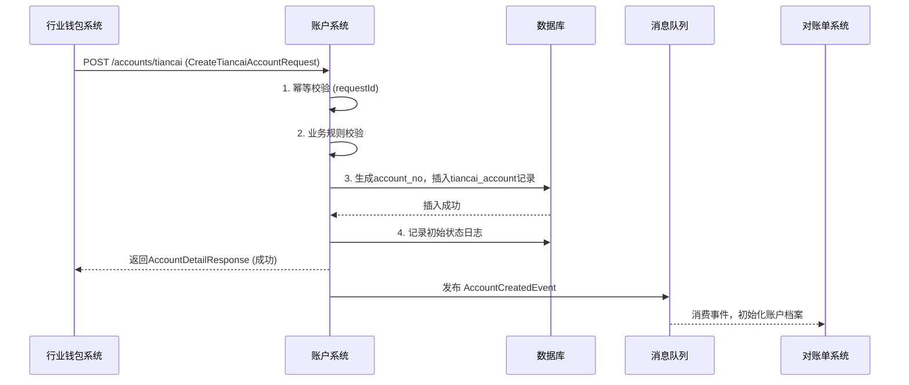
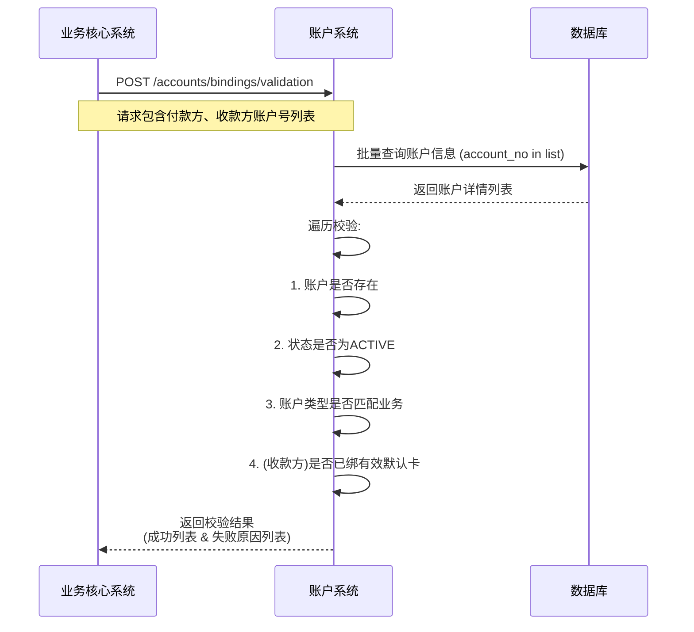

# 模块设计: 账户系统

生成时间: 2026-01-19 17:53:00

---

# 账户系统模块设计文档

## 1. 概述

### 1.1 目的
本模块作为支付系统的底层账户核心，负责为“天财分账”等业务场景创建和管理专用的资金账户体系。其主要目的是：
- **账户生命周期管理**：为天财机构下的收单商户创建、维护、冻结、解冻、注销天财专用账户。
- **账户能力控制**：为天财专用账户打上特殊标记，并控制其专属能力（如支持分账、绑定多张银行卡、设置默认提现卡等）。
- **数据存储与查询**：提供账户基础信息、状态、余额、关联关系等数据的持久化存储和高效查询服务。
- **业务支撑**：为上游的行业钱包系统、清结算系统、业务核心系统等提供稳定、可靠的账户操作接口。

### 1.2 范围
- **账户类型**：专注于管理“天财收款账户”（行业钱包）和“天财接收方账户”（行业钱包），区别于普通小微钱包。
- **核心功能**：
    - 账户开户/销户
    - 账户状态管理（启用、冻结、禁用）
    - 账户信息查询与更新
    - 账户余额查询（通常为只读，实际余额由清结算系统管理）
    - 账户关系绑定校验（如校验账户是否存在、状态是否正常、是否具备特定角色）
    - 账户特殊标记管理（如天财机构号、角色类型标记）
- **非功能范围**：
    - 不处理资金流转（由清结算系统负责）。
    - 不处理具体的分账、归集、付款业务逻辑（由行业钱包系统和业务核心系统负责）。
    - 不处理电子签约、身份认证流程（由电子签约平台和三代系统负责）。
    - 不直接生成对账单（由对账单系统负责，但提供账户动账数据源）。

## 2. 接口设计

### 2.1 API 端点 (RESTful)

#### 2.1.1 账户管理接口
- **POST /api/v1/accounts/tiancai** - 创建天财专用账户
- **GET /api/v1/accounts/{accountNo}** - 查询账户详情
- **PATCH /api/v1/accounts/{accountNo}/status** - 更新账户状态
- **GET /api/v1/accounts** - 根据条件查询账户列表（内部接口）

#### 2.1.2 账户关系与校验接口
- **GET /api/v1/accounts/{accountNo}/validation** - 校验账户有效性（状态、类型、角色）
- **POST /api/v1/accounts/bindings/validation** - 批量校验账户绑定关系（用于分账前置检查）

### 2.2 输入/输出数据结构

#### 2.2.1 创建天财专用账户请求 (CreateTiancaiAccountRequest)
```json
{
  "requestId": "REQ202310270001", // 请求流水号，用于幂等
  "merchantNo": "M100001", // 收单商户号（来自三代系统）
  "institutionNo": "TC001", // 天财机构号
  "accountType": "RECEIVABLE | RECEIVER", // 账户类型：收款账户 | 接收方账户
  "roleType": "HEADQUARTERS | STORE", // 角色类型：总部 | 门店
  "settlementMode": "ACTIVE", // 结算模式，默认主动结算
  "extraInfo": {
    "legalPersonName": "张三",
    "businessLicenseNo": "91330101MA2XXXXXXX"
    // ... 其他开户所需信息
  }
}
```

#### 2.2.2 账户详情响应 (AccountDetailResponse)
```json
{
  "accountNo": "TCWALLET202310270001",
  "merchantNo": "M100001",
  "institutionNo": "TC001",
  "accountType": "RECEIVABLE",
  "roleType": "HEADQUARTERS",
  "status": "ACTIVE", // ACTIVE, FROZEN, DISABLED, CLOSED
  "settlementMode": "ACTIVE",
  "balance": "0.00", // 仅供参考，实时余额以清结算为准
  "capabilities": ["SPLIT_ACCOUNT", "BIND_MULTI_CARD", "WITHDRAW"],
  "tags": ["TIANCAI_SPECIAL", "INDUSTRY_WALLET"],
  "createdAt": "2023-10-27T10:00:00Z",
  "updatedAt": "2023-10-27T10:00:00Z"
}
```

#### 2.2.3 账户状态更新请求 (UpdateAccountStatusRequest)
```json
{
  "requestId": "STATUS202310270001",
  "targetStatus": "FROZEN", // 目标状态
  "reason": "风险控制", // 状态变更原因
  "operator": "system_risk_control"
}
```

### 2.3 发布/消费的事件

#### 2.3.1 发布的事件
- **AccountCreatedEvent**: 账户创建成功时发布。
    - 内容：账户基础信息、账户号、商户号、机构号。
    - 消费者：行业钱包系统（用于同步开户结果）、对账单系统（用于初始化账户档案）。
- **AccountStatusChangedEvent**: 账户状态变更时发布。
    - 内容：账户号、原状态、新状态、变更原因、时间。
    - 消费者：行业钱包系统、清结算系统、业务核心系统（用于控制相关业务是否可执行）。

#### 2.3.2 消费的事件
- **MerchantCreatedEvent** (来自三代系统)：监听新商户创建，为符合条件的商户自动或异步触发开户流程。
- **SettlementCompletedEvent** (来自清结算系统)：消费此事件主要用于内部对账或更新缓存，不直接修改余额。

## 3. 数据模型

### 3.1 数据库表设计

#### 表: `tiancai_account` (天财专用账户主表)
| 字段名 | 类型 | 必填 | 默认值 | 说明 |
| :--- | :--- | :--- | :--- | :--- |
| `id` | bigint | Y | AUTO_INCREMENT | 主键 |
| `account_no` | varchar(32) | Y | | **账户号**，唯一标识，规则: TCWALLET+日期+序列 |
| `merchant_no` | varchar(32) | Y | | 收单商户号，与三代系统关联 |
| `institution_no` | varchar(16) | Y | | 天财机构号 |
| `account_type` | varchar(20) | Y | | 账户类型: `RECEIVABLE`(收款账户), `RECEIVER`(接收方账户) |
| `role_type` | varchar(20) | Y | | 角色类型: `HEADQUARTERS`(总部), `STORE`(门店) |
| `status` | varchar(20) | Y | `ACTIVE` | 状态: `ACTIVE`, `FROZEN`, `DISABLED`, `CLOSED` |
| `settlement_mode` | varchar(20) | Y | `ACTIVE` | 结算模式: `ACTIVE`(主动), `PASSIVE`(被动) |
| `balance` | decimal(15,2) | Y | 0.00 | **展示余额**，与清结算系统定期同步 |
| `capabilities` | json | Y | | 账户能力列表，如 `["SPLIT_ACCOUNT", "BIND_MULTI_CARD"]` |
| `tags` | json | Y | | 账户标记列表，如 `["TIANCAI_SPECIAL", "INDUSTRY_WALLET"]` |
| `version` | int | Y | 0 | 乐观锁版本号 |
| `created_at` | datetime | Y | CURRENT_TIMESTAMP | 创建时间 |
| `updated_at` | datetime | Y | CURRENT_TIMESTAMP ON UPDATE | 更新时间 |
| **索引** | | | | |
| `uk_account_no` | UNIQUE(`account_no`) | | | 账户号唯一索引 |
| `idx_merchant_no` | (`merchant_no`) | | | 商户号查询索引 |
| `idx_institution_no` | (`institution_no`, `status`) | | | 机构与状态联合索引 |

#### 表: `account_binding_card` (账户绑定银行卡表)
| 字段名 | 类型 | 必填 | 默认值 | 说明 |
| :--- | :--- | :--- | :--- | :--- |
| `id` | bigint | Y | AUTO_INCREMENT | 主键 |
| `account_no` | varchar(32) | Y | | 关联的账户号 |
| `card_no` | varchar(32) | Y | | 银行卡号（加密存储） |
| `bank_name` | varchar(64) | Y | | 银行名称 |
| `card_type` | varchar(10) | Y | | 卡类型: `DEBIT`(借记卡), `CREDIT`(信用卡) |
| `is_default` | tinyint(1) | Y | 0 | 是否默认提现卡: 0-否, 1-是 |
| `status` | varchar(20) | Y | `VALID` | 状态: `VALID`, `INVALID` |
| `created_at` | datetime | Y | CURRENT_TIMESTAMP | 创建时间 |
| **索引** | | | | |
| `idx_account_no` | (`account_no`, `status`) | | | 账户与状态联合索引 |

#### 表: `account_status_log` (账户状态变更日志表)
| 字段名 | 类型 | 必填 | 默认值 | 说明 |
| :--- | :--- | :--- | :--- | :--- |
| `id` | bigint | Y | AUTO_INCREMENT | 主键 |
| `account_no` | varchar(32) | Y | | 账户号 |
| `old_status` | varchar(20) | Y | | 原状态 |
| `new_status` | varchar(20) | Y | | 新状态 |
| `reason` | varchar(255) | Y | | 变更原因 |
| `operator` | varchar(64) | Y | | 操作人/系统 |
| `created_at` | datetime | Y | CURRENT_TIMESTAMP | 创建时间 |
| **索引** | | | | |
| `idx_account_no` | (`account_no`, `created_at`) | | | 账户操作历史查询索引 |

### 3.2 与其他模块的关系
- **行业钱包系统**：上游调用方。账户系统接收其开户请求，并为其提供账户校验服务。账户状态变更事件通知钱包系统。
- **三代系统**：数据源头。提供商户基础信息，并可能触发开户指令。
- **清结算系统**：紧密关联。清结算系统持有资金账簿，账户系统的`balance`字段为只读展示，需与其定期同步。账户状态影响清结算的资金操作。
- **业务核心系统**：下游依赖方。在处理“天财分账”交易前，需通过账户系统校验付款方和收款方账户的有效性。
- **对账单系统**：数据消费方。订阅账户创建事件，并可能直接读取账户主表以获取账户档案信息。

## 4. 业务逻辑

### 4.1 核心算法
- **账户号生成算法**：`TCWALLET` + `YYYYMMDD` + `6位自增序列`。自增序列每日重置，通过分布式序列服务或数据库序列实现，确保全局唯一。
- **余额同步**：采用“最终一致性”策略。不直接处理账务。通过消费`SettlementCompletedEvent`或定时任务调用清结算系统的余额查询接口，更新`tiancai_account.balance`字段。对于实时性要求极高的查询，可提供接口透传至清结算系统。

### 4.2 业务规则
1. **开户规则**：
    - 一个收单商户(`merchant_no`)在同一机构(`institution_no`)下，只能拥有一个`RECEIVABLE`类型的账户。
    - 一个收单商户可以拥有多个`RECEIVER`类型的账户（对应多个接收方）。
    - 开户请求必须包含有效的天财机构号，否则拒绝。
    - 账户创建成功后，自动打上`TIANCAI_SPECIAL`和`INDUSTRY_WALLET`标记。
2. **状态流转规则**：
    - `ACTIVE` -> `FROZEN`: 可因风控、纠纷等原因触发。
    - `FROZEN` -> `ACTIVE`: 需人工审核解冻。
    - `ACTIVE`/`FROZEN` -> `DISABLED`: 业务违规，停止所有服务。
    - `DISABLED` -> `CLOSED`: 结清所有资金后销户。
    - 状态变更必须记录日志(`account_status_log`)。
3. **账户校验规则**：
    - 参与分账、付款的账户状态必须为`ACTIVE`。
    - 收款方账户(`RECEIVER`)必须已绑定至少一张有效且已认证的银行卡，且必须有默认卡，才能参与付款。
    - 校验关系绑定时，需确认付款方账户角色与业务场景匹配（如归集场景，付款方必须是`STORE`）。

### 4.3 验证逻辑
- **创建账户请求验证**：
    - 校验`requestId`幂等性，防止重复开户。
    - 校验`institutionNo`是否为已配置的有效天财机构。
    - 根据`merchantNo`和`accountType`校验是否已存在账户。
    - 校验`roleType`与`accountType`的合法性（如`RECEIVER`账户可能不需要角色）。
- **更新状态请求验证**：
    - 校验目标状态是否符合状态流转规则。
    - 校验操作人权限。
    - 如果是销户(`CLOSED`)，必须联合清结算系统校验余额是否为0且无在途资金。

## 5. 时序图

### 5.1 天财专用账户开户时序图


### 5.2 分账交易前账户校验时序图


## 6. 错误处理

| 错误码 | HTTP状态码 | 描述 | 处理策略 |
| :--- | :--- | :--- | :--- |
| `ACCOUNT_4001` | 400 Bad Request | 请求参数无效或缺失 | 客户端检查请求体格式和必填字段 |
| `ACCOUNT_4002` | 400 Bad Request | 账户号不存在 | 客户端检查输入的账户号是否正确 |
| `ACCOUNT_4091` | 409 Conflict | 重复请求 (requestId已处理) | 客户端使用原请求结果，无需重试 |
| `ACCOUNT_4092` | 409 Conflict | 商户已存在同类型账户 | 客户端查询已有账户，勿重复开户 |
| `ACCOUNT_4031` | 403 Forbidden | 状态流转非法 (如ACTIVE直接到CLOSED) | 客户端检查业务逻辑，按正确状态流转图操作 |
| `ACCOUNT_5001` | 500 Internal Server Error | 数据库操作失败 | 服务端记录详细日志，告警，客户端可有限重试 |
| `ACCOUNT_5002` | 500 Internal Server Error | 依赖服务（如清结算）不可用 | 服务端熔断/降级，返回部分数据或提示稍后重试 |

**通用策略**：
- **客户端错误(4xx)**：由调用方修正请求后重试。
- **服务端错误(5xx)**：实现重试机制（带退避策略），并设有监控告警。
- **幂等性**：所有写操作（创建、状态更新）必须支持幂等，通过`requestId`保证。
- **事务一致性**：本地数据库操作保证事务性。跨系统操作（如销户前校验余额）通过Saga等模式保证最终一致性。

## 7. 依赖说明

### 7.1 上游模块交互
1. **行业钱包系统**：
    - **交互方式**：同步REST API调用（开户、查询、校验）。
    - **职责**：钱包系统是账户系统的主要服务对象，封装了更上层的业务逻辑（如关系绑定、分账执行），账户系统为其提供底层的账户实体支撑。

2. **三代系统**：
    - **交互方式**：异步事件消费 (`MerchantCreatedEvent`) 或 直接API调用（查询商户信息）。
    - **职责**：作为商户信息的权威来源，触发账户创建的初始源头。

### 7.2 下游模块交互
1. **清结算系统**：
    - **交互方式**：异步事件消费 (`SettlementCompletedEvent`) 和 同步REST API调用（查询实时余额）。
    - **职责**：账户系统依赖清结算系统获取资金权威数据。账户状态变更事件会影响清结算的资金处理逻辑。

2. **消息队列(MQ)**：
    - **交互方式**：发布领域事件 (`AccountCreatedEvent`, `AccountStatusChangedEvent`)。
    - **职责**：实现系统间松耦合通信，通知其他模块账户领域的状态变化。

### 7.3 关键依赖管理
- **强依赖**：数据库、清结算系统（对于实时性要求不高的场景可降级）。
- **弱依赖**：对账单系统、三代系统事件。这些系统故障不应影响账户核心功能的运行（开户、查询、校验），可通过异步重试或日志补偿解决。
- **降级方案**：当清结算系统不可用时，余额查询接口可返回缓存数据或上次同步的数据，并明确提示“数据可能延迟”。账户校验中的余额校验项可暂时跳过。