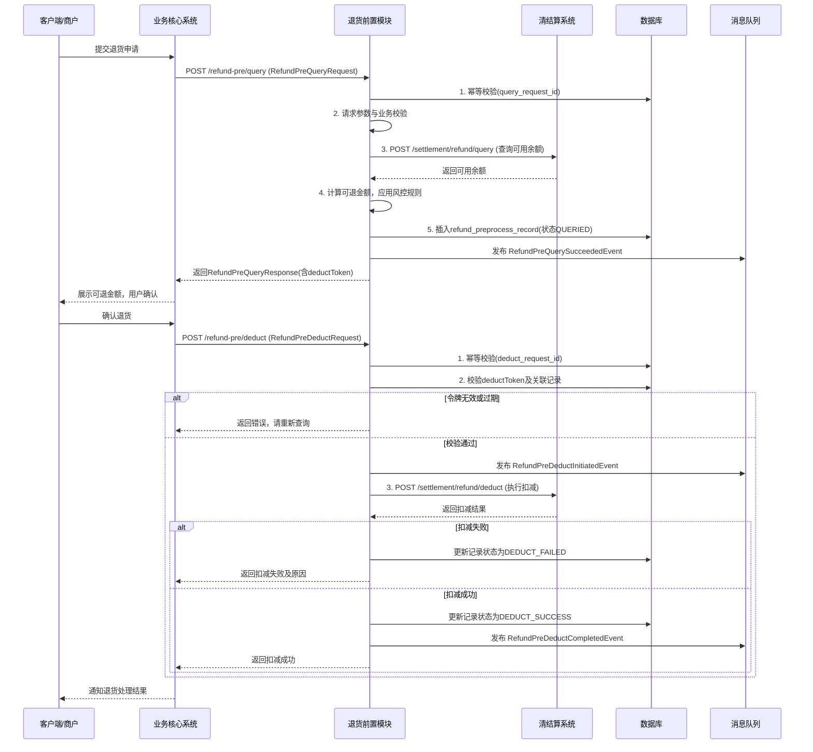
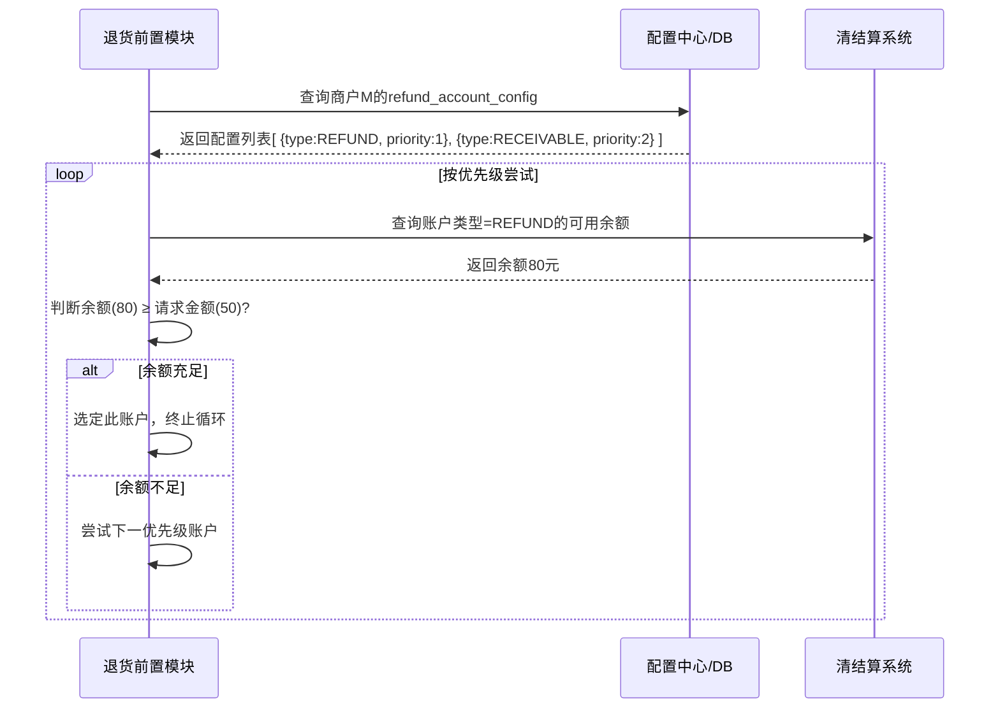

# 模块设计: 退货前置模块

生成时间: 2026-01-19 17:55:33

---

# 模块设计: 退货前置模块

生成时间: 2026-01-19 18:00:00

---

# 退货前置模块设计文档

## 1. 概述

### 1.1 目的
退货前置模块是“天财分账”业务场景中，专门负责处理退货交易资金预校验和预扣减的核心模块。其主要目的是：
- **资金安全与风险控制**：在退货交易实际发生前，预先锁定或验证退货资金来源，确保退货资金充足，避免超退风险。
- **流程解耦与性能优化**：将退货资金校验环节从核心交易流程中剥离，实现异步或并行处理，提升整体交易处理效率和响应速度。
- **多账户源支持**：统一处理从天财收款账户（行业钱包）或04退货账户扣减资金的逻辑，为上游业务方提供简洁、一致的接口。
- **状态管理与防重放**：管理退货查询与扣减的中间状态，防止同一笔退货被重复扣款，保证资金操作的幂等性和最终一致性。

### 1.2 范围
- **核心功能**：
    - **退货资金查询**：接收上游查询请求，根据配置的退货资金源（收款账户或04账户），计算并返回当前可退余额。
    - **退货资金扣减**：在用户确认退货后，执行对指定账户的资金扣减操作，并更新前置处理状态。
    - **状态与有效期管理**：为每次查询结果设置有效期，并跟踪从查询到扣减的全流程状态，确保流程的连贯性和安全性。
    - **资金源路由与适配**：根据业务规则和账户类型，将扣款请求路由至正确的底层账户系统（清结算系统）。
- **非功能范围**：
    - 不处理具体的退货业务逻辑（如退货原因审核、商品状态管理）。
    - 不直接管理账户实体和余额（依赖清结算系统作为权威数据源）。
    - 不生成最终的退货交易凭证和账单（由业务核心和清结算系统完成）。
    - 不处理与银行通道的交互（资金扣减仅为内部记账）。

## 2. 接口设计

### 2.1 API 端点 (RESTful)

#### 2.1.1 核心业务接口
- **POST /api/v1/refund-pre/query** - 退货前置查询（查询可退余额及有效期）
- **POST /api/v1/refund-pre/deduct** - 退货前置扣减（执行资金扣减）

#### 2.1.2 管理与查询接口（内部）
- **GET /api/v1/refund-pre/records/{requestId}** - 根据请求ID查询处理记录
- **GET /api/v1/refund-pre/records** - 根据商户号、原订单号等条件查询记录列表
- **POST /api/v1/refund-pre/records/{recordId}/compensate** - 人工冲正/补偿接口（用于异常处理）

### 2.2 输入/输出数据结构

#### 2.2.1 退货前置查询请求 (RefundPreQueryRequest)
```json
{
  "requestId": "RPQ202310270001", // 请求流水号，全局唯一，用于幂等
  "merchantNo": "M100001", // 发起退货的商户号
  "storeNo": "S10001", // 门店编号（可选，用于门店维度风控）
  "originalOrderNo": "ORDER202310270001", // 原消费订单号
  "originalAmount": "100.00", // 原订单金额
  "refundAmount": "50.00", // 本次请求退货金额
  "accountType": "RECEIVABLE | REFUND", // 扣款账户类型：收款账户 | 04退货账户
  "bizScene": "NORMAL_REFUND | PARTIAL_REFUND", // 业务场景：全额退 | 部分退
  "extInfo": {
    "operator": "user123",
    "reason": "商品质量问题"
    // ... 其他业务扩展信息
  }
}
```

#### 2.2.2 退货前置查询响应 (RefundPreQueryResponse)
```json
{
  "code": "SUCCESS",
  "message": "查询成功",
  "data": {
    "requestId": "RPQ202310270001",
    "merchantNo": "M100001",
    "originalOrderNo": "ORDER202310270001",
    "availableAmount": "80.00", // 当前可退余额
    "requestedAmount": "50.00",
    "isSufficient": true, // 是否充足
    "accountType": "RECEIVABLE",
    "deductToken": "TOKEN_ABC123XYZ", // 扣减凭证，有效期內扣减需携带
    "expireTime": "2023-10-27T10:05:00Z", // 过期时间（默认查询后5分钟）
    "suggestedAction": "PROCEED" // 建议操作: PROCEED(继续), INSUFFICIENT(余额不足), SUSPEND(暂停-风控)
  }
}
```

#### 2.2.3 退货前置扣减请求 (RefundPreDeductRequest)
```json
{
  "requestId": "RPD202310270001", // 扣减请求流水号，全局唯一
  "queryRequestId": "RPQ202310270001", // 对应的查询请求ID
  "deductToken": "TOKEN_ABC123XYZ", // 查询返回的扣减凭证
  "merchantNo": "M100001",
  "refundOrderNo": "REFUND202310270001", // 本次退货订单号（业务系统生成）
  "refundAmount": "50.00", // 扣减金额（需与查询金额一致）
  "accountType": "RECEIVABLE",
  "operator": "user123",
  "extInfo": {
    // ... 扣减相关扩展信息
  }
}
```

#### 2.2.4 退货前置扣减响应 (RefundPreDeductResponse)
```json
{
  "code": "SUCCESS",
  "message": "扣减成功",
  "data": {
    "requestId": "RPD202310270001",
    "queryRequestId": "RPQ202310270001",
    "refundOrderNo": "REFUND202310270001",
    "deductAmount": "50.00",
    "accountNo": "TCWALLET202310270001", // 实际扣减的账户号
    "accountType": "RECEIVABLE",
    "balanceAfter": "30.00", // 扣减后余额
    "deductTime": "2023-10-27T10:02:00Z",
    "settlementDetailNo": "STD20231027000001" // 关联的清结算明细流水号（如有）
  }
}
```

### 2.3 发布/消费的事件

#### 2.3.1 发布的事件
- **RefundPreQuerySucceededEvent**: 退货前置查询成功时发布。
    - **内容**：请求ID、商户号、原订单号、可退金额、账户类型、是否充足、时间。
    - **消费者**：**风控系统**（用于监控大额或频繁退货行为）、**监控系统**（业务大盘展示）。
- **RefundPreDeductInitiatedEvent**: 退货前置扣减请求发起时发布。
    - **内容**：扣减请求ID、查询请求ID、退货订单号、金额、账户类型、时间。
    - **消费者**：**清结算系统**（可作为触发资金扣减的另一种异步方式，本设计采用同步调用）。
- **RefundPreDeductCompletedEvent**: 退货前置扣减完成时发布。
    - **内容**：扣减请求ID、结果（成功/失败）、金额、账户号、扣减后余额、失败原因、时间。
    - **消费者**：**业务核心系统**（通知扣减结果，驱动后续退货流程）、**风控系统**（记录最终结果）。

#### 2.3.2 消费的事件
- **AccountStatusChangedEvent** (来自账户系统)：当相关账户状态变为`FROZEN`或`DISABLED`时，需使该账户相关的未过期查询令牌失效。
- **OriginalOrderPaidEvent** (来自业务核心系统)：消费原订单支付成功事件，用于内部记录和关联（可选，可用于增强风控）。

## 3. 数据模型

### 3.1 数据库表设计

#### 表: `refund_preprocess_record` (退货前置处理记录表)
| 字段名 | 类型 | 必填 | 默认值 | 说明 |
| :--- | :--- | :--- | :--- | :--- |
| `id` | bigint | Y | AUTO_INCREMENT | 主键 |
| `query_request_id` | varchar(64) | Y | | **查询请求流水号**，唯一标识一次查询 |
| `deduct_request_id` | varchar(64) | | NULL | 扣减请求流水号（扣减时填入） |
| `merchant_no` | varchar(32) | Y | | 商户号 |
| `store_no` | varchar(32) | | NULL | 门店编号 |
| `original_order_no` | varchar(32) | Y | | 原消费订单号 |
| `original_amount` | decimal(15,2) | Y | | 原订单金额 |
| `account_type` | varchar(20) | Y | | 扣款账户类型: `RECEIVABLE`, `REFUND` |
| `requested_amount` | decimal(15,2) | Y | | 请求退货金额 |
| `available_amount` | decimal(15,2) | Y | | 查询时账户可用余额 |
| `is_sufficient` | tinyint(1) | Y | 0 | 是否充足: 0-否, 1-是 |
| `deduct_token` | varchar(64) | Y | | 扣减凭证（JWT或随机字符串） |
| `token_expire_time` | datetime | Y | | 凭证过期时间 |
| `refund_order_no` | varchar(32) | | NULL | 退货订单号（扣减时填入） |
| `deduct_amount` | decimal(15,2) | | NULL | 实际扣减金额 |
| `status` | varchar(20) | Y | `QUERIED` | 状态: `QUERIED`, `TOKEN_USED`, `DEDUCT_SUCCESS`, `DEDUCT_FAILED`, `EXPIRED`, `CANCELLED` |
| `settlement_detail_no` | varchar(32) | | NULL | 清结算明细流水号 |
| `fail_reason` | varchar(255) | | NULL | 失败原因 |
| `ext_info` | json | | NULL | 扩展信息 |
| `created_at` | datetime | Y | CURRENT_TIMESTAMP | 创建时间 |
| `updated_at` | datetime | Y | CURRENT_TIMESTAMP ON UPDATE | 更新时间 |
| **索引** | | | | |
| `uk_query_request_id` | UNIQUE(`query_request_id`) | | | 查询请求ID幂等索引 |
| `uk_deduct_request_id` | UNIQUE(`deduct_request_id`) | | | 扣减请求ID幂等索引 |
| `idx_deduct_token` | (`deduct_token`, `status`) | | | 凭证快速校验索引 |
| `idx_merchant_original` | (`merchant_no`, `original_order_no`, `status`) | | | 商户原单查询索引 |
| `idx_token_expire` | (`token_expire_time`, `status`) | | | 清理过期token任务索引 |

#### 表: `refund_account_config` (退货账户配置表)
| 字段名 | 类型 | 必填 | 默认值 | 说明 |
| :--- | :--- | :--- | :--- | :--- |
| `id` | bigint | Y | AUTO_INCREMENT | 主键 |
| `merchant_no` | varchar(32) | Y | | 商户号 |
| `account_type` | varchar(20) | Y | | 账户类型: `RECEIVABLE`, `REFUND` |
| `priority` | tinyint | Y | 1 | 优先级 (1-最高) |
| `is_enabled` | tinyint(1) | Y | 1 | 是否启用: 0-否, 1-是 |
| `daily_limit` | decimal(15,2) | | NULL | 单日扣款上限 |
| `rule_expression` | json | | NULL | 规则表达式（如：按订单金额比例、按业务场景） |
| `effective_time` | datetime | Y | | 生效时间 |
| `expire_time` | datetime | | NULL | 失效时间 |
| `created_at` | datetime | Y | CURRENT_TIMESTAMP | 创建时间 |
| `updated_at` | datetime | Y | CURRENT_TIMESTAMP ON UPDATE | 更新时间 |
| **索引** | | | | |
| `uk_merchant_type` | UNIQUE(`merchant_no`, `account_type`) | | | 商户与账户类型唯一索引 |
| `idx_merchant_enabled` | (`merchant_no`, `is_enabled`) | | | 查询有效配置索引 |

### 3.2 与其他模块的关系
- **业务核心系统**：上游调用方。在用户发起退货时，业务核心先调用本模块进行资金预校验和预扣减，确保资金安全后再推进后续退货流程。
- **清结算系统**：核心依赖方。本模块通过调用清结算系统的`/refund/query`和`/refund/deduct`接口，获取账户实时可用余额并执行资金扣减操作。清结算系统是资金数据的权威源。
- **账户系统**：信息依赖方。通过消费其`AccountStatusChangedEvent`，确保不会对状态异常的账户进行操作。同时，在需要时查询账户基础信息。
- **风控系统**：协同与被监控方。向风控系统发布查询和扣减事件，供其进行实时风险分析。同时，可能接收风控系统的建议（如`suggestedAction`）。
- **配置中心/三代系统**：规则来源。获取商户级别的退货账户配置规则（如默认扣款账户类型、优先级、限额等）。

## 4. 业务逻辑

### 4.1 核心算法
- **扣减令牌生成算法**：采用JWT (JSON Web Token) 或高强度随机字符串。
    - JWT方案：Payload包含`queryRequestId`, `merchantNo`, `amount`, `accountType`, `exp`（过期时间）。签名密钥由模块管理。
    - 随机字符串方案：生成32位随机字符串，与`query_request_id`关联存储于数据库。校验时直接查库比对。
    - **推荐JWT方案**：无需查库即可校验有效性，性能更高，但需管理密钥和考虑令牌撤销。
- **可退余额计算**：
    1. 根据`merchantNo`和`accountType`，调用清结算系统接口查询指定账户的`available_balance`。
    2. 若`accountType`为`RECEIVABLE`，还需考虑该账户下可能存在的在途交易或冻结金额（清结算接口应已体现）。
    3. 结合商户配置的`daily_limit`（日限额），计算最终`availableAmount` = min(账户可用余额, 日剩余限额)。
- **过期令牌清理**：定时任务（每分钟）扫描`refund_preprocess_record`表，将`status='QUERIED'`且`token_expire_time < NOW()`的记录状态更新为`EXPIRED`。

### 4.2 业务规则
1. **查询流程规则**：
    - **幂等性**：基于`query_request_id`保证，重复查询返回原结果。
    - **账户路由**：若请求未指定`accountType`，则根据`refund_account_config`表为商户配置的默认账户类型和优先级决定。
    - **风控介入**：查询结果中的`suggestedAction`可来自内置风控规则（如单笔退货金额超过阈值、频率过高）或外部风控系统的实时决策。
    - **有效期**：默认5分钟，可在配置中按商户调整。

2. **扣减流程规则**：
    - **凭证校验**：必须提供有效的、未过期的`deduct_token`，且其关联的查询记录状态为`QUERIED`。
    - **金额一致性**：`refundAmount`必须等于对应查询记录的`requested_amount`。
    - **状态防重**：扣减成功后，记录状态变为`DEDUCT_SUCCESS`，令牌失效，防止重复扣减。
    - **同步调用**：扣减操作同步调用清结算系统，等待其返回明确结果（成功/失败）后再响应上游。
    - **失败处理**：扣减失败（如余额不足、账户冻结）后，记录状态变为`DEDUCT_FAILED`，并记录原因。上游需根据失败原因决定后续流程（如更换账户重试或终止退货）。

3. **账户配置规则**：
    - 一个商户可配置多个退货资金源（如优先从04账户退，不足时从收款账户退）。
    - 支持基于业务场景（`bizScene`）的差异化配置。
    - 日限额支持动态重置（每日零点）。

### 4.3 验证逻辑
- **查询请求验证**：
    1. 校验`requestId`幂等性。
    2. 校验必填字段：`merchantNo`, `originalOrderNo`, `refundAmount`。
    3. 校验`refundAmount` ≤ `originalAmount`。
    4. 校验`originalOrderNo`对应的原交易是否存在且状态可退（可调用业务核心接口或依赖其事前校验）。
    5. 根据`accountType`或配置，校验目标账户是否存在且状态正常（可调用账户系统接口）。
- **扣减请求验证**：
    1. 校验`requestId`和`deduct_request_id`幂等性。
    2. 校验必填字段：`queryRequestId`, `deductToken`, `refundAmount`, `refundOrderNo`。
    3. 使用`deductToken`查找对应的有效查询记录（状态=`QUERIED`，未过期）。
    4. 校验`refundAmount`与查询记录的`requested_amount`一致。
    5. 校验当前时间未超过查询记录的`token_expire_time`。
    6. 二次校验账户状态（防止查询后账户被冻结）。

## 5. 时序图

### 5.1 退货前置查询与扣减完整时序图


### 5.2 多账户源路由时序图（未指定accountType时）


## 6. 错误处理

| 错误码 | HTTP状态码 | 描述 | 处理策略 |
| :--- | :--- | :--- | :--- |
| `REFUND_PRE_4001` | 400 Bad Request | 请求参数无效或缺失 | 客户端检查请求体格式和必填字段 |
| `REFUND_PRE_4002` | 400 Bad Request | 退货金额超过原订单金额 | 客户端调整退货金额 |
| `REFUND_PRE_4003` | 400 Bad Request | 原订单不存在或状态不可退 | 客户端检查订单状态 |
| `REFUND_PRE_4091` | 409 Conflict | 重复查询请求 (queryRequestId已处理) | 客户端使用原查询结果 |
| `REFUND_PRE_4092` | 409 Conflict | 重复扣减请求 (deductRequestId已处理) | 客户端使用原扣减结果 |
| `REFUND_PRE_4031` | 403 Forbidden | 扣减令牌无效或已过期 | 客户端需重新发起查询流程 |
| `REFUND_PRE_4032` | 403 Forbidden | 扣减令牌与金额不匹配 | 客户端检查金额是否与查询时一致 |
| `REFUND_PRE_4033` | 403 Forbidden | 账户余额不足 | 客户端提示商户充值或使用其他账户 |
| `REFUND_PRE_4034` | 403 Forbidden | 账户状态异常（冻结/禁用） | 客户端联系客服解决账户问题 |
| `REFUND_PRE_4041` | 404 Not Found | 未找到有效的退货账户配置 | 联系运营人员为商户配置账户 |
| `REFUND_PRE_4291` | 429 Too Many Requests | 单位时间内查询/扣减频率超限 | 客户端降低请求频率，或稍后重试 |
| `REFUND_PRE_5001` | 500 Internal Server Error | 清结算系统调用失败 | 服务端告警，客户端可有限重试（需注意幂等） |
| `REFUND_PRE_5002` | 500 Internal Server Error | 数据库操作失败 | 服务端记录详细日志，告警，客户端可有限重试 |

**通用策略**：
- **资金操作最终一致性**：扣减操作必须与清结算系统保持一致。采用同步调用，失败则明确返回原因。极端情况下（如超时未知），需有对账补偿机制，根据`refund_preprocess_record`和清结算流水进行核对与冲正。
- **重试机制**：对于网络超时或5xx错误，客户端应实现带指数退避的有限重试（最多3次）。对于令牌过期、余额不足等4xx错误，不应自动重试，需引导用户重新操作。
- **监控与告警**：对高失败率的错误（如余额不足、令牌过期）、清结算系统调用超时、过期令牌清理异常等进行监控和告警。
- **对账与核对**：日终与清结算系统对账，确保本模块记录的扣减状态与清结算流水一致。

## 7. 依赖说明

### 7.1 上游模块交互
1. **业务核心系统**：
    - **交互方式**：同步REST API调用（`/refund-pre/query`, `/refund-pre/deduct`）。
    - **职责**：业务核心是退货流程的驱动者，负责组装退货请求、调用本模块进行资金保障、并根据结果推进后续物流、凭证生成等环节。本模块是其资金安全关卡。
    - **降级方案**：极端情况下，若本模块完全不可用，业务核心可配置降级开关，绕过前置校验直接尝试调用清结算扣减（需承担超退风险），或引导用户稍后重试。

### 7.2 下游模块交互
1. **清结算系统**：
    - **交互方式**：同步REST API调用（`/settlement/refund/query`, `/settlement/refund/deduct`）。这是本模块最核心的依赖。
    - **职责**：清结算系统是资金余额和操作的权威源。本模块所有关于“钱”的操作都必须通过它完成。
    - **降级方案**：无有效降级方案。清结算系统不可用将导致整个退货前置功能失效。必须保证清结算系统的高可用性，并通过熔断、快速失败、友好提示等方式减少对用户体验的影响。

2. **账户系统**：
    - **交互方式**：异步事件消费 (`AccountStatusChangedEvent`) 和 可选的同步REST API调用（用于增强校验）。
    - **职责**：通过事件感知账户状态变化，及时使相关令牌失效，防止对异常账户操作。
    - **降级方案**：事件短暂丢失可通过扣减时调用清结算接口的校验来弥补（清结算也应拒绝异常账户的操作）。API调用失败可降级为仅依赖清结算的校验。

### 7.3 关键依赖管理
- **强依赖**：**清结算系统**（资金操作）、**数据库**（状态持久化）。
- **弱依赖**：账户系统（状态事件）、配置中心（规则获取）、风控系统（建议反馈）。这些依赖的故障不应阻塞核心查询-扣减流程，可降级为使用默认配置或跳过增强校验。
- **隔离与熔断**：对清结算系统的调用必须配置熔断器（如Hystrix或Resilience4j），设置合理的超时时间，防止因清结算延迟导致本模块线程池耗尽。熔断开启时，快速失败返回“服务暂时不可用”。
- **缓存策略**：对商户的`refund_account_config`配置进行本地缓存，减少对配置中心的频繁查询。