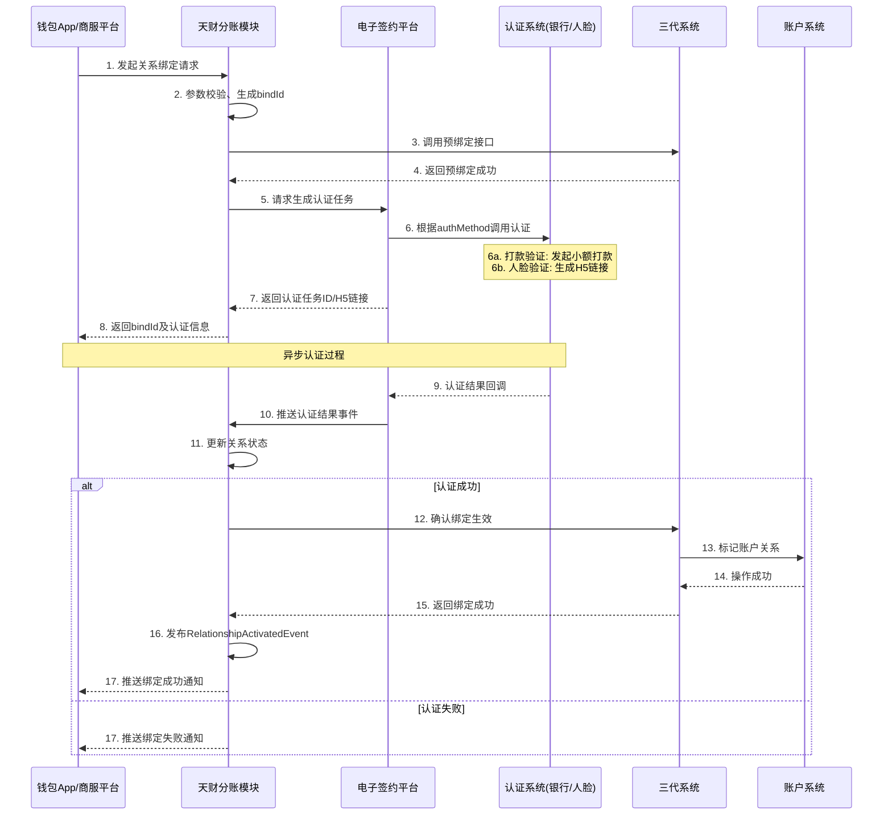
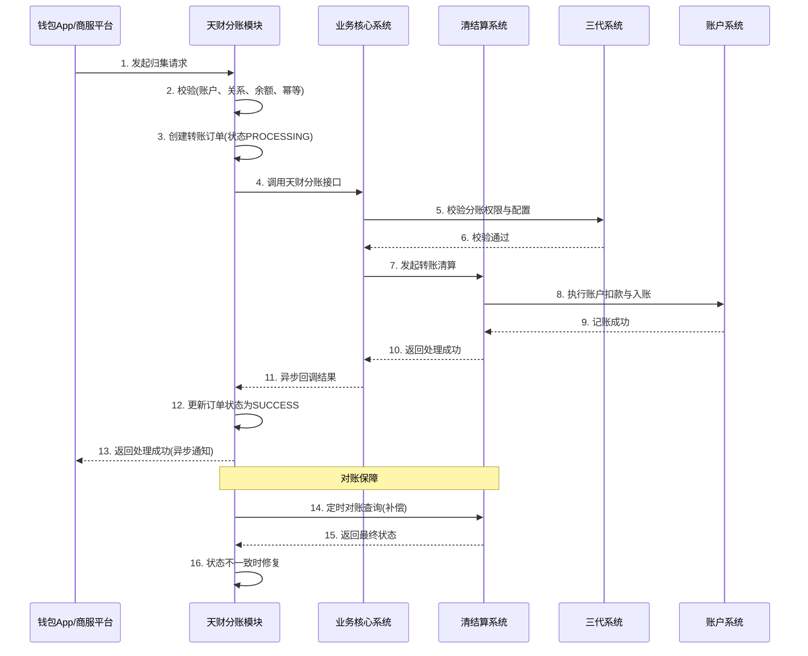

# 模块设计: 钱包App/商服平台

生成时间: 2026-01-19 17:53:27

---

# 钱包App/商服平台 - 天财分账模块设计文档

## 1. 概述

### 1.1 目的
本模块旨在为“钱包App/商服平台”提供天财分账业务的核心服务能力，作为连接前端应用与后端支付核心系统的业务中台。它负责封装天财分账、关系绑定、资金归集、批量付款、会员结算等复杂业务流程，向上提供统一、稳定、易用的API接口，向下协调三代系统、行业钱包系统、账户系统等多个底层系统，实现业务逻辑的编排、数据聚合与状态管理。

### 1.2 范围
- **核心业务流程**：天财专用账户的开户与状态管理、关系绑定（签约与认证）、资金流转（归集、批量付款、会员结算）、退货前置处理。
- **业务实体管理**：管理收单商户、总部、门店等业务实体在本模块的映射与状态。
- **数据聚合与展示**：聚合来自多个底层系统的数据，为前端提供统一的账户信息、交易流水、关系列表等视图。
- **异步任务处理**：处理如批量付款文件上传、异步认证结果通知、分账结果回调等异步操作。
- **本模块不直接负责**：
    - 底层账户的创建与记账（由账户系统负责）。
    - 电子协议的具体签署与存证（由电子签约平台负责）。
    - 最终的资金清算、结算与计费（由清结算系统负责）。
    - 底层收单交易的处理（由业务核心系统负责）。

## 2. 接口设计

### 2.1 API端点 (RESTful)

#### 2.1.1 账户与关系管理
- `POST /api/v1/tiancai/accounts` **创建天财专用账户**
    - **描述**：为收单商户开通天财收款账户或接收方账户。
    - **输入**：`CreateTiancaiAccountRequest`
    - **输出**：`CreateTiancaiAccountResponse`

- `GET /api/v1/tiancai/accounts/{accountNo}` **查询账户详情**
    - **输出**：`TiancaiAccountDetail`

- `POST /api/v1/tiancai/relationships/bind` **发起关系绑定**
    - **描述**：在付款方与收款方之间建立分账关系，并触发相应认证流程。
    - **输入**：`InitiateRelationshipBindRequest`
    - **输出**：`InitiateRelationshipBindResponse`

- `POST /api/v1/tiancai/relationships/{bindId}/auth-callback` **认证结果回调**
    - **描述**：接收来自电子签约平台或认证系统的异步认证结果。
    - **输入**：`AuthCallbackRequest`
    - **输出**：通用ACK响应

- `GET /api/v1/tiancai/relationships` **查询关系列表**
    - **查询参数**：`payerAccountNo`, `payeeAccountNo`, `status`, `sceneType`
    - **输出**：`PagedResponse<RelationshipVO>`

#### 2.1.2 资金流转
- `POST /api/v1/tiancai/transfer/collect` **发起资金归集**
    - **输入**：`InitiateCollectRequest`
    - **输出**：`TransferResponse`

- `POST /api/v1/tiancai/transfer/batch-payment` **发起批量付款**
    - **描述**：支持文件上传或列表方式发起。
    - **输入**：`InitiateBatchPaymentRequest` (multipart/form-data 包含文件)
    - **输出**：`BatchJobResponse`

- `GET /api/v1/tiancai/transfer/batch-jobs/{jobId}` **查询批量任务结果**
    - **输出**：`BatchJobDetail`

- `POST /api/v1/tiancai/transfer/member-settlement` **发起会员结算**
    - **输入**：`InitiateMemberSettlementRequest`
    - **输出**：`TransferResponse`

#### 2.1.3 查询与对账
- `GET /api/v1/tiancai/transactions` **查询交易流水**
    - **查询参数**：`accountNo`, `startTime`, `endTime`, `type`, `status`
    - **输出**：`PagedResponse<TransactionVO>`

- `GET /api/v1/tiancai/statements/{date}` **下载对账单**
    - **描述**：生成并返回指定日期的对账单文件（CSV格式）。
    - **输出**：文件流

### 2.2 数据结构示例

```yaml
# 请求/响应DTO示例
CreateTiancaiAccountRequest:
  merchantNo: string          # 收单商户号
  institutionNo: string       # 天财机构号
  roleType: enum(HEADQUARTERS, STORE) # 角色类型
  accountType: enum(RECEIVING_ACCOUNT, RECIPIENT_ACCOUNT) # 账户类型
  contactInfo: ContactInfo    # 联系人信息

TiancaiAccountDetail:
  accountNo: string           # 天财专用账户号
  merchantNo: string
  roleType: string
  accountType: string
  status: enum(ACTIVE, INACTIVE, FROZEN)
  balance: Amount             # 聚合后的余额信息
  linkedBankCards: array      # 绑定的银行卡列表
  createdAt: datetime

InitiateRelationshipBindRequest:
  payerAccountNo: string      # 付款方账户
  payeeAccountNo: string      # 收款方账户
  sceneType: enum(COLLECT, BATCH_PAY, MEMBER_SETTLE) # 场景类型
  authMethod: enum(REMITTANCE, FACE) # 认证方式
  payeeBizInfo: object        # 收款方业务信息（企业/个人）

RelationshipVO:
  bindId: string
  payerAccountNo: string
  payeeAccountNo: string
  sceneType: string
  authMethod: string
  status: enum(INIT, AUTH_PENDING, ACTIVE, FAILED, CANCELED)
  authExpireTime: datetime
  createdAt: datetime

InitiateCollectRequest:
  payerAccountNo: string      # 门店账户
  payeeAccountNo: string      # 总部账户
  amount: Amount
  feeBearer: enum(PAYER, PAYEE) # 手续费承担方
  remark: string
  businessOrderNo: string     # 业务方订单号，用于幂等

TransferResponse:
  transferId: string
  businessOrderNo: string
  status: enum(PROCESSING, SUCCESS, FAILED)
  estimatedFinishTime: datetime
```

### 2.3 发布/消费的事件

#### 2.3.1 消费的事件
- `AccountCreatedEvent` (来自账户系统)：监听天财专用账户创建成功事件，更新本地账户状态。
- `TransferFinishedEvent` (来自清结算系统)：监听分账/转账完成事件，更新交易状态并记录流水。
- `AuthResultEvent` (来自电子签约平台)：监听认证结果，更新关系绑定状态。

#### 2.3.2 发布的事件
- `RelationshipActivatedEvent`：关系绑定激活时发布，通知相关业务模块（如清结算系统）可执行分账。
- `BatchPaymentJobFinishedEvent`：批量付款任务完成时发布，包含成功/失败统计。
- `AccountStatusChangedEvent`：账户状态变更时发布，通知订阅方（如风控系统）。

## 3. 数据模型

### 3.1 核心表设计

```sql
-- 天财专用账户表 (tiancai_account)
CREATE TABLE tiancai_account (
    id BIGINT PRIMARY KEY AUTO_INCREMENT,
    account_no VARCHAR(32) UNIQUE NOT NULL COMMENT '天财专用账户号',
    merchant_no VARCHAR(32) NOT NULL COMMENT '收单商户号',
    institution_no VARCHAR(16) NOT NULL COMMENT '天财机构号',
    role_type VARCHAR(20) NOT NULL COMMENT '角色类型: HEADQUARTERS/STORE',
    account_type VARCHAR(20) NOT NULL COMMENT '账户类型: RECEIVING_ACCOUNT/RECIPIENT_ACCOUNT',
    status VARCHAR(20) NOT NULL DEFAULT 'ACTIVE' COMMENT '状态',
    underlying_account_id VARCHAR(64) COMMENT '底层账户系统账户ID',
    extra_info JSON COMMENT '扩展信息（联系人、地址等）',
    created_at DATETIME NOT NULL,
    updated_at DATETIME NOT NULL,
    INDEX idx_merchant_no (merchant_no),
    INDEX idx_institution_no (institution_no),
    INDEX idx_status (status)
);

-- 分账关系绑定表 (tiancai_relationship)
CREATE TABLE tiancai_relationship (
    id BIGINT PRIMARY KEY AUTO_INCREMENT,
    bind_id VARCHAR(64) UNIQUE NOT NULL COMMENT '关系绑定唯一ID',
    payer_account_no VARCHAR(32) NOT NULL COMMENT '付款方账户',
    payee_account_no VARCHAR(32) NOT NULL COMMENT '收款方账户',
    scene_type VARCHAR(30) NOT NULL COMMENT '场景: COLLECT/BATCH_PAY/MEMBER_SETTLE',
    auth_method VARCHAR(20) COMMENT '认证方式: REMITTANCE/FACE',
    status VARCHAR(20) NOT NULL DEFAULT 'INIT' COMMENT '状态',
    auth_expire_time DATETIME COMMENT '认证过期时间',
    contract_id VARCHAR(64) COMMENT '电子协议ID',
    auth_result_json JSON COMMENT '认证结果详情',
    fail_reason VARCHAR(255) COMMENT '失败原因',
    activated_at DATETIME COMMENT '激活时间',
    created_at DATETIME NOT NULL,
    updated_at DATETIME NOT NULL,
    UNIQUE KEY uk_payer_payee_scene (payer_account_no, payee_account_no, scene_type),
    INDEX idx_status_expire (status, auth_expire_time),
    INDEX idx_payer (payer_account_no),
    INDEX idx_payee (payee_account_no)
);

-- 资金流转订单表 (tiancai_transfer_order)
CREATE TABLE tiancai_transfer_order (
    id BIGINT PRIMARY KEY AUTO_INCREMENT,
    transfer_id VARCHAR(64) UNIQUE NOT NULL COMMENT '转账唯一ID',
    business_order_no VARCHAR(64) NOT NULL COMMENT '业务方订单号（幂等键）',
    scene_type VARCHAR(30) NOT NULL COMMENT '场景类型',
    payer_account_no VARCHAR(32) NOT NULL,
    payee_account_no VARCHAR(32) NOT NULL,
    amount DECIMAL(15,2) NOT NULL COMMENT '金额',
    currency VARCHAR(3) DEFAULT 'CNY',
    fee DECIMAL(15,2) COMMENT '手续费',
    fee_bearer VARCHAR(10) COMMENT '手续费承担方',
    status VARCHAR(20) NOT NULL DEFAULT 'PROCESSING',
    third_party_order_no VARCHAR(64) COMMENT '三代系统/清结算系统订单号',
    remark VARCHAR(255),
    error_code VARCHAR(32),
    error_msg VARCHAR(255),
    finished_at DATETIME,
    created_at DATETIME NOT NULL,
    updated_at DATETIME NOT NULL,
    UNIQUE KEY uk_business_order_no (business_order_no),
    INDEX idx_payer_account (payer_account_no, created_at),
    INDEX idx_payee_account (payee_account_no, created_at),
    INDEX idx_status_created (status, created_at)
);

-- 批量付款任务表 (batch_payment_job)
CREATE TABLE batch_payment_job (
    id BIGINT PRIMARY KEY AUTO_INCREMENT,
    job_id VARCHAR(64) UNIQUE NOT NULL,
    payer_account_no VARCHAR(32) NOT NULL,
    file_name VARCHAR(255),
    file_key VARCHAR(255) COMMENT '云存储文件Key',
    total_count INT DEFAULT 0,
    success_count INT DEFAULT 0,
    fail_count INT DEFAULT 0,
    total_amount DECIMAL(15,2) DEFAULT 0,
    status VARCHAR(20) DEFAULT 'UPLOADED',
    result_file_key VARCHAR(255),
    created_by VARCHAR(64),
    created_at DATETIME NOT NULL,
    finished_at DATETIME,
    INDEX idx_payer_status (payer_account_no, status)
);

-- 批量付款明细表 (batch_payment_item)
CREATE TABLE batch_payment_item (
    id BIGINT PRIMARY KEY AUTO_INCREMENT,
    job_id VARCHAR(64) NOT NULL,
    item_seq INT NOT NULL COMMENT '行序号',
    payee_account_no VARCHAR(32),
    payee_name VARCHAR(100),
    amount DECIMAL(15,2),
    remark VARCHAR(255),
    transfer_id VARCHAR(64) COMMENT '关联的转账订单ID',
    status VARCHAR(20) DEFAULT 'PENDING',
    error_msg VARCHAR(255),
    created_at DATETIME NOT NULL,
    INDEX idx_job_id (job_id),
    INDEX idx_transfer_id (transfer_id)
);
```

### 3.2 与其他模块的关系
- **账户系统**：通过`underlying_account_id`关联底层账户实体。账户状态、余额变更需与底层同步。
- **三代系统**：通过`third_party_order_no`关联三代系统的分账请求。关系绑定的最终生效依赖三代系统。
- **清结算系统**：通过`transfer_id`关联清结算的转账订单，跟踪资金处理状态。
- **电子签约平台**：通过`contract_id`关联电子协议，认证流程依赖此系统。
- **对账单系统**：提供数据源，本模块的`tiancai_transfer_order`表是生成业务对账单的基础。

## 4. 业务逻辑

### 4.1 核心算法

#### 4.1.1 关系绑定状态机
```python
STATE_MACHINE = {
    'INIT': {
        'trigger_auth': 'AUTH_PENDING', # 发起认证
        'cancel': 'CANCELED'
    },
    'AUTH_PENDING': {
        'auth_success': 'ACTIVE',
        'auth_fail': 'FAILED',
        'auth_timeout': 'EXPIRED',
        'cancel': 'CANCELED'
    },
    'ACTIVE': {
        'disable': 'INACTIVE', # 手动停用
        'payer_account_frozen': 'SUSPENDED' # 付款方账户冻结
    },
    'FAILED': {
        'retry_auth': 'AUTH_PENDING' # 重新发起认证
    },
    'EXPIRED': {
        'renew': 'AUTH_PENDING' # 重新认证
    },
    'INACTIVE': {
        'enable': 'ACTIVE'
    },
    'SUSPENDED': {
        'payer_account_unfrozen': 'ACTIVE'
    }
}
```

#### 4.1.2 批量付款文件处理算法
1. **文件解析**：支持CSV格式，校验必填字段（收款方账户、金额、备注）。
2. **数据校验**：
   - 收款方账户是否存在且状态正常。
   - 金额是否为正数且在限额内。
   - 付款方账户余额是否充足（预校验）。
   - 与收款方的关系绑定是否已激活。
3. **分批提交**：每100条记录为一组，异步提交到清结算系统，避免单次请求过大。
4. **结果汇总**：收集所有子任务结果，生成处理报告文件。

### 4.2 业务规则

#### 4.2.1 账户开通规则
- 一个收单商户在同一机构号下，只能开通一个**天财收款账户**。
- 一个收单商户可以开通多个**天财接收方账户**，用于接收不同场景的分账资金。
- **角色类型**由天财在上送时指定，且与账户类型存在约束：
  - `HEADQUARTERS` 角色通常开通 `RECEIVING_ACCOUNT`。
  - `STORE` 角色可开通 `RECEIVING_ACCOUNT` 或 `RECIPIENT_ACCOUNT`。
- 账户开通后，默认结算模式为 **主动结算**。

#### 4.2.2 关系绑定规则
- **唯一性约束**：同一付款方、收款方、场景类型组合下，只能存在一条激活状态的关系。
- **认证方式选择**：
  - 收款方为对公企业或个体户 → **打款验证**。
  - 收款方为个人 → **人脸验证**。
  - 场景为`BATCH_PAY`或`MEMBER_SETTLE`，付款方（总部/门店）需额外完成 **开通付款** 认证。
- **认证有效期**：认证链接/任务有效期为24小时，超时需重新发起。

#### 4.2.3 资金流转规则
- **余额校验**：发起转账前，校验付款方账户余额（需考虑在途资金）。
- **关系校验**：转账前必须存在对应场景的 **已激活** 关系绑定。
- **手续费**：根据`fee_bearer`参数，计算手续费并从相应账户扣减。手续费率从三代系统获取。
- **幂等性**：所有转账请求必须携带`business_order_no`，支持重复请求幂等处理。
- **限额**：单笔转账、单日累计转账金额受风控规则限制。

#### 4.2.4 批量付款特殊规则
- 文件大小限制：≤ 10MB。
- 单文件最多支持5000条记录。
- 支持部分成功，失败记录需在结果文件中明确原因。

### 4.3 验证逻辑

#### 4.3.1 请求参数验证
```java
// 伪代码示例：发起归集请求验证
void validateCollectRequest(InitiateCollectRequest request) {
    // 1. 基础参数非空校验
    assertNotNull(request.getPayerAccountNo(), "付款方账户不能为空");
    assertNotNull(request.getPayeeAccountNo(), "收款方账户不能为空");
    assertTrue(request.getAmount() > 0, "金额必须大于0");
    
    // 2. 账户状态校验
    TiancaiAccount payerAccount = accountService.getAccount(request.getPayerAccountNo());
    TiancaiAccount payeeAccount = accountService.getAccount(request.getPayeeAccountNo());
    assertTrue(payerAccount.isActive(), "付款方账户状态异常");
    assertTrue(payeeAccount.isActive(), "收款方账户状态异常");
    assertEquals("STORE", payerAccount.getRoleType(), "归集场景付款方必须是门店");
    assertEquals("HEADQUARTERS", payeeAccount.getRoleType(), "归集场景收款方必须是总部");
    
    // 3. 关系绑定校验
    Relationship relationship = relationshipService.findActiveRelationship(
        request.getPayerAccountNo(), 
        request.getPayeeAccountNo(), 
        SceneType.COLLECT
    );
    assertNotNull(relationship, "未找到有效的归集关系绑定");
    
    // 4. 余额预校验（考虑在途）
    BigDecimal availableBalance = balanceService.getAvailableBalance(payerAccount);
    assertTrue(availableBalance.compareTo(request.getAmount()) >= 0, "付款方余额不足");
    
    // 5. 幂等键校验
    if (transferOrderService.existsByBusinessOrderNo(request.getBusinessOrderNo())) {
        throw new DuplicateRequestException("重复的订单号");
    }
}
```

#### 4.3.2 业务状态一致性验证
- **定时任务**：每小时检查`AUTH_PENDING`状态超过24小时的关系，自动置为`EXPIRED`。
- **事件驱动**：监听账户冻结/解冻事件，自动更新相关关系绑定状态。
- **对账核对**：每日与清结算系统对账，修复状态不一致的转账订单。

## 5. 时序图

### 5.1 关键工作流：关系绑定与认证



### 5.2 关键工作流：资金归集



## 6. 错误处理

### 6.1 预期错误分类

| 错误类别 | HTTP状态码 | 错误码前缀 | 示例场景 | 处理策略 |
|---------|-----------|-----------|----------|----------|
| **客户端错误** | 400 | `CLIENT_` | 参数缺失、格式错误、业务校验失败 | 返回明确错误信息，指导用户修正 |
| **认证授权错误** | 401/403 | `AUTH_` | Token无效、权限不足 | 引导重新登录或申请权限 |
| **资源不存在** | 404 | `NOT_FOUND_` | 账户不存在、关系不存在 | 检查输入资源ID是否正确 |
| **冲突错误** | 409 | `CONFLICT_` | 重复请求、状态冲突 | 幂等处理或提示用户当前状态 |
| **依赖服务错误** | 502 | `DEPENDENCY_` | 三代系统超时、账户系统异常 | 异步重试、降级处理、记录异常单 |
| **服务器内部错误** | 500 | `INTERNAL_` | 数据库异常、未知异常 | 告警、记录详细日志、人工介入 |

### 6.2 重试与补偿机制

#### 6.2.1 异步调用重试
- **可重试错误**：网络超时、依赖服务暂时不可用（5xx错误）。
- **重试策略**：指数退避，最多重试3次，间隔 2s, 10s, 30s。
- **重试标识**：在`tiancai_transfer_order`表中记录重试次数与下次重试时间。

#### 6.2.2 状态不一致补偿
1. **定时对账任务**：每30分钟扫描状态为`PROCESSING`超过1小时的订单，主动查询清结算系统获取最终状态。
2. **事件驱动补偿**：监听`AccountBalanceChangedEvent`但未找到对应转账订单时，触发反向查询。
3. **人工干预接口**：提供管理端手动触发状态同步的接口。

#### 6.2.3 降级方案
- **查询类接口**：依赖服务异常时，返回缓存数据并标记“数据可能延迟”。
- **批量付款**：文件解析和基础校验在本地完成，提交到清结算系统失败时，任务状态置为“部分失败”，允许重新提交失败项。
- **关系绑定**：电子签约平台不可用时，允许线下收集材料，通过管理端后台上传认证结果。

### 6.3 异常监控与告警
- **关键异常**：依赖服务连续失败、状态不一致率超过阈值、大额转账失败。
- **告警渠道**：企业微信、短信、邮件。
- **仪表盘**：展示成功率、平均耗时、异常分布等核心指标。

## 7. 依赖说明

### 7.1 上游模块交互

#### 7.1.1 三代系统
- **交互方式**：RPC/HTTP接口
- **核心依赖**：
  - 商户信息查询与校验
  - 分账关系绑定生效接口
  - 分账手续费率配置获取
  - 分账请求受理接口
- **降级策略**：核心转账流程强依赖，不可降级。查询类功能可缓存。

#### 7.1.2 行业钱包系统 / 账户系统
- **交互方式**：RPC/消息事件
- **核心依赖**：
  - 天财专用账户开户
  - 账户余额查询
  - 账户状态变更通知
  - 账户特殊标记管理
- **降级策略**：开户流程强依赖。余额查询可短暂使用本地缓存。

#### 7.1.3 清结算系统
- **交互方式**：异步消息 + HTTP回调
- **核心依赖**：
  - 转账资金处理
  - 手续费计算与扣除
  - 转账结果回调
  - 对账单生成
- **降级策略**：转账功能强依赖，但可通过异步队列缓冲请求。

#### 7.1.4 电子签约平台
- **交互方式**：HTTP回调 + 事件
- **核心依赖**：
  - 生成认证任务（打款/人脸）
  - 接收认证结果
- **降级策略**：关系绑定功能强依赖，但可走线下人工审核流程。

### 7.2 下游模块服务

#### 7.2.1 钱包App/商服平台前端
- **提供能力**：
  - 完整的账户管理、关系绑定、资金流转操作界面。
  - 实时状态查询与通知。
  - 文件上传与下载。
- **接口特点**：RESTful API，支持分页、过滤，返回用户友好的错误信息。

#### 7.2.2 运营管理后台
- **提供能力**：
  - 业务数据统计看板。
  - 异常订单人工处理界面。
  - 手动触发补偿任务。
- **接口特点**：管理权限校验，批量操作接口。

#### 7.2.3 风控系统
- **提供事件**：`LargeTransferEvent`、`SuspiciousRelationshipEvent`
- **数据支持**：通过接口提供可疑交易查询详情。

### 7.3 数据一致性保障
1. **最终一致性模型**：通过事件驱动和定时对账保证各系统状态最终一致。
2. **本地事务边界**：在本模块数据库内，单个聚合根（如一次转账）的变化保证事务性。
3. **分布式事务**：跨系统的关键操作（如转账扣款+记账）依赖清结算系统保障。

---
**文档版本**：1.0  
**最后更新**：2023-10-27  
**维护团队**：支付业务中台团队