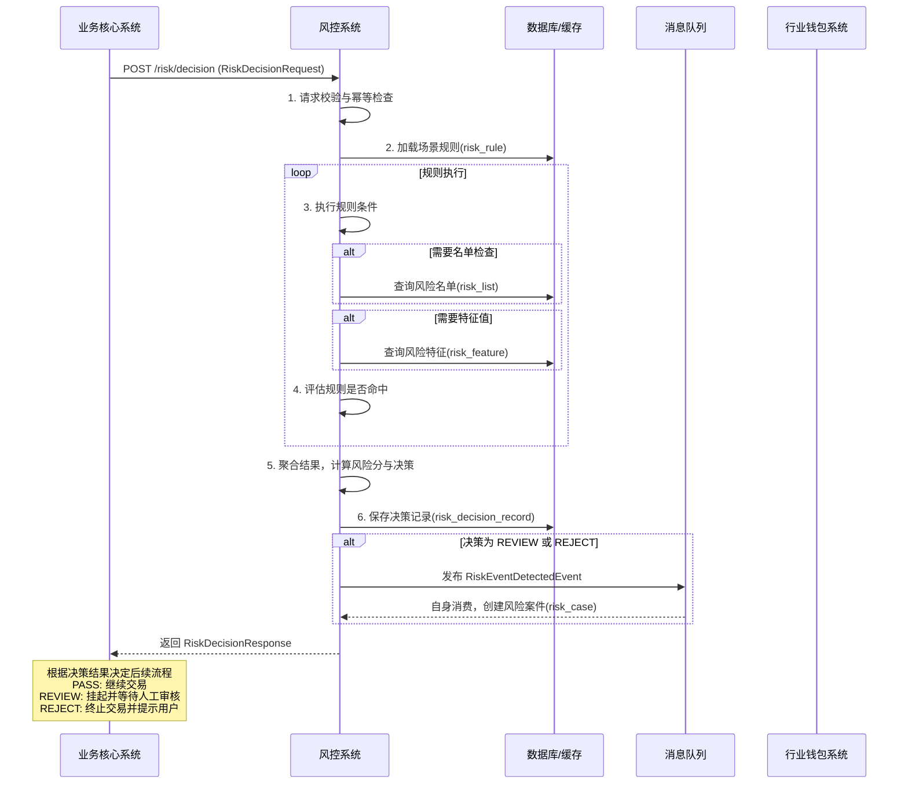
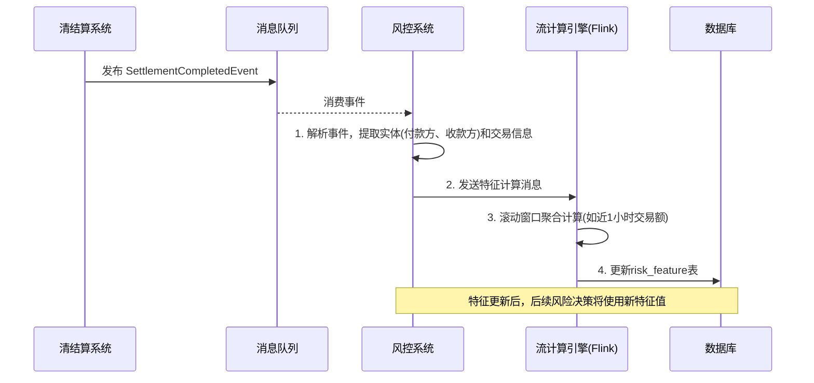

# 模块设计: 风控系统

生成时间: 2026-01-19 17:55:50

---

# 模块设计: 风控系统

生成时间: 2026-01-19 18:00:00

---

# 风控系统模块设计文档

## 1. 概述

### 1.1 目的
本模块作为支付系统“天财分账”业务的核心风险控制中枢，旨在为资金流转的各个关键环节提供实时、精准、可配置的风险识别与干预能力。其主要目的是：
- **风险识别与评估**：在交易发起、关系绑定、资金划转等关键节点，基于多维度规则和模型，实时识别潜在风险（如欺诈、洗钱、合规违规、操作风险）。
- **风险决策与处置**：根据风险等级，自动执行相应的风险处置策略（如放行、增强验证、延迟处理、拦截、告警），实现风险与体验的平衡。
- **风险监控与洞察**：持续监控业务风险态势，提供风险大盘、实时告警和深度分析报告，支持风险策略的持续优化。
- **合规与审计支持**：确保“天财分账”业务符合反洗钱、反欺诈等监管要求，并提供完整的风险处置证据链，满足审计需求。

### 1.2 范围
- **核心功能**：
    - **实时风险决策引擎**：接收来自业务核心、行业钱包等系统的风险检查请求，执行规则和模型计算，返回风险决策结果。
    - **规则与策略管理**：提供可视化界面，支持风险规则（如金额阈值、频次限制、名单校验）和处置策略（如验证、拦截）的动态配置、发布和版本管理。
    - **风险名单管理**：管理黑名单、灰名单、白名单，支持名单的增删改查、导入导出和有效期管理。
    - **风险监控与告警**：实时监控风险事件、规则命中率、处置效果等指标，对高风险事件和系统异常进行实时告警。
    - **案件调查与处置**：为运营人员提供风险案件调查工作台，支持人工复核、处置（如解冻账户、调整名单）和备注。
    - **数据采集与特征计算**：从各业务系统采集风险相关数据（如交易、账户、行为日志），并计算风险特征（如历史交易总额、近期失败率）。
- **非功能范围**：
    - 不直接执行业务操作（如冻结账户由账户系统执行，拦截交易由业务核心执行）。
    - 不替代上游系统的业务逻辑校验（如余额充足性、关系绑定有效性）。
    - 不存储完整的业务数据（如交易详情、账户余额），仅存储风险决策所需的特征和结果。

## 2. 接口设计

### 2.1 API 端点 (RESTful)

#### 2.1.1 风险决策接口 (供业务系统同步调用)
- **POST /api/v1/risk/decision** - 通用风险决策入口，根据场景执行风险检查。
- **POST /api/v1/risk/decision/batch** - 批量风险决策，用于批量付款等场景的预检。

#### 2.1.2 名单管理接口 (内部/运营)
- **POST /api/v1/risk/lists/items** - 添加名单项（黑/灰/白名单）。
- **DELETE /api/v1/risk/lists/items/{id}** - 移除名单项。
- **GET /api/v1/risk/lists/check** - 检查指定实体（账户、商户、用户）是否在名单中。

#### 2.1.3 运营与管理接口
- **GET /api/v1/risk/monitor/dashboard** - 获取风险监控大盘数据。
- **POST /api/v1/risk/cases/{caseId}/process** - 人工处理风险案件。

### 2.2 输入/输出数据结构

#### 2.2.1 风险决策请求 (RiskDecisionRequest)
```json
{
  "requestId": "RISK_DECISION_202310270001",
  "sceneCode": "TC_SPLIT_PRE_CHECK", // 风险场景码，决定使用哪组规则
  "entityInfo": {
    "payerAccountNo": "TCWALLET202310270001",
    "payerMerchantNo": "M100001",
    "payeeAccountNoList": ["TCWALLET202310270002"],
    "payerUserId": "U10001", // 操作人ID（如门店店长）
    "payerIp": "192.168.1.1",
    "payerDeviceId": "DEVICE_001"
  },
  "transactionInfo": {
    "bizScene": "FUND_POOLING",
    "totalAmount": "10000.00",
    "currency": "CNY",
    "payeeCount": 1
  },
  "timestamp": "2023-10-27T10:00:00Z"
}
```

#### 2.2.2 风险决策响应 (RiskDecisionResponse)
```json
{
  "requestId": "RISK_DECISION_202310270001",
  "decision": "PASS", // 决策结果: PASS, REVIEW, REJECT
  "riskLevel": "LOW", // 风险等级: LOW, MEDIUM, HIGH
  "riskScore": 35, // 风险评分 (0-100)
  "hitRules": [ // 命中的规则列表
    {
      "ruleId": "RULE_TC_AMOUNT_DAILY_LIMIT",
      "ruleName": "天财单日分账总额超限",
      "ruleDesc": "单个付款方账户单日向不同收款方分账总额超过10万元",
      "hitValue": "100000.00"
    }
  ],
  "actions": [ // 建议执行的风险处置动作
    {
      "actionCode": "SEND_ALERT", // 发送告警
      "actionParams": {
        "alertLevel": "WARNING",
        "alertTo": "risk_operator"
      }
    }
  ],
  "suggestions": [ // 给上游系统的建议（非强制）
    {
      "suggestionCode": "ENHANCED_AUTH",
      "suggestionMsg": "建议触发人脸验证进行二次确认"
    }
  ],
  "expireTime": "2023-10-27T10:05:00Z" // 决策结果缓存有效期
}
```

#### 2.2.3 名单检查请求 (ListCheckRequest)
```json
{
  "entityType": "ACCOUNT", // 实体类型: ACCOUNT, MERCHANT, USER, CARD, IP, DEVICE
  "entityId": "TCWALLET202310270001",
  "listTypes": ["BLACK", "GRAY"] // 检查的名单类型
}
```

### 2.3 发布/消费的事件

#### 2.3.1 发布的事件
- **RiskEventDetectedEvent**: 当风险决策结果为`REVIEW`或`REJECT`，或命中高风险规则时发布。
    - 内容：请求ID、场景码、决策结果、风险等级、命中规则、相关实体、时间。
    - 消费者：监控告警系统（触发实时告警）、案件管理系统（创建待处理案件）。
- **RiskListUpdatedEvent**: 当风险名单（黑、灰、白名单）发生增删改时发布。
    - 内容：名单类型、实体类型、实体ID、操作类型（ADD/REMOVE）、操作人、时间。
    - 消费者：规则引擎（更新本地缓存）、业务核心/账户系统（用于实时拦截或限制）。

#### 2.3.2 消费的事件
- **SettlementCompletedEvent** (来自清结算系统)：消费交易完成事件，用于事后风险分析、特征计算（如累计交易额更新）和模型训练。
- **AccountStatusChangedEvent** (来自账户系统)：消费账户状态变更事件，特别是变为`FROZEN`/`DISABLED`时，可能触发关联实体加入灰名单。
- **MerchantCreatedEvent** (来自三代系统)：消费新商户创建事件，用于初始化风险档案和进行准入风险扫描。

## 3. 数据模型

### 3.1 数据库表设计

#### 表: `risk_decision_record` (风险决策记录表)
| 字段名 | 类型 | 必填 | 默认值 | 说明 |
| :--- | :--- | :--- | :--- | :--- |
| `id` | bigint | Y | AUTO_INCREMENT | 主键 |
| `request_id` | varchar(64) | Y | | 请求流水号，唯一 |
| `scene_code` | varchar(32) | Y | | 风险场景码 |
| `decision` | varchar(20) | Y | | 决策结果: `PASS`, `REVIEW`, `REJECT` |
| `risk_level` | varchar(20) | Y | | 风险等级: `LOW`, `MEDIUM`, `HIGH` |
| `risk_score` | int | Y | | 风险评分 (0-100) |
| `hit_rules` | json | | NULL | 命中的规则ID和详情 |
| `actions` | json | | NULL | 执行的处置动作 |
| `entity_info` | json | Y | | 决策涉及的实体信息快照 |
| `transaction_info` | json | | NULL | 交易信息快照 |
| `cost_time` | int | Y | | 决策耗时(毫秒) |
| `created_at` | datetime | Y | CURRENT_TIMESTAMP | 创建时间 |
| **索引** | | | | |
| `uk_request_id` | UNIQUE(`request_id`) | | | 请求流水号索引 |
| `idx_scene_decision_time` | (`scene_code`, `decision`, `created_at`) | | | 场景与决策分析索引 |
| `idx_entity_account` | (`entity_info`->'$.payerAccountNo'`, `created_at`) | | | 付款方账户查询索引 (虚拟列) |

#### 表: `risk_rule` (风险规则表)
| 字段名 | 类型 | 必填 | 默认值 | 说明 |
| :--- | :--- | :--- | :--- | :--- |
| `id` | bigint | Y | AUTO_INCREMENT | 主键 |
| `rule_id` | varchar(64) | Y | | 规则唯一标识 |
| `rule_name` | varchar(128) | Y | | 规则名称 |
| `rule_desc` | varchar(512) | | NULL | 规则描述 |
| `scene_codes` | json | Y | | 适用的风险场景码列表 |
| `condition_expression` | text | Y | | 规则条件表达式 (如 Groovy, AVIATOR) |
| `risk_level` | varchar(20) | Y | | 规则对应的风险等级 |
| `risk_score` | int | Y | | 规则对应的风险分数 |
| `action_codes` | json | Y | | 命中后触发的动作码列表 |
| `priority` | int | Y | 0 | 规则优先级，数字越大优先级越高 |
| `status` | varchar(20) | Y | `ACTIVE` | 状态: `ACTIVE`, `INACTIVE`, `DRAFT` |
| `version` | int | Y | 1 | 规则版本 |
| `created_at` | datetime | Y | CURRENT_TIMESTAMP | 创建时间 |
| `updated_at` | datetime | Y | CURRENT_TIMESTAMP ON UPDATE | 更新时间 |
| **索引** | | | | |
| `uk_rule_id_version` | UNIQUE(`rule_id`, `version`) | | | 规则ID与版本唯一索引 |
| `idx_status_scene` | (`status`, `scene_codes`(255)) | | | 状态与场景查询索引 |

#### 表: `risk_list` (风险名单表)
| 字段名 | 类型 | 必填 | 默认值 | 说明 |
| :--- | :--- | :--- | :--- | :--- |
| `id` | bigint | Y | AUTO_INCREMENT | 主键 |
| `list_type` | varchar(20) | Y | | 名单类型: `BLACK`, `GRAY`, `WHITE` |
| `entity_type` | varchar(20) | Y | | 实体类型: `ACCOUNT`, `MERCHANT`, `USER`, `CARD`, `IP`, `DEVICE` |
| `entity_id` | varchar(64) | Y | | 实体标识 (如账户号、商户号、IP地址) |
| `entity_name` | varchar(128) | | NULL | 实体名称 (便于展示) |
| `reason` | varchar(512) | Y | | 加入名单原因 |
| `source` | varchar(64) | Y | | 来源: `MANUAL`, `RULE_AUTO`, `THIRD_PARTY` |
| `effective_time` | datetime | Y | | 生效时间 |
| `expire_time` | datetime | | NULL | 过期时间 (NULL为永久) |
| `status` | varchar(20) | Y | `VALID` | 状态: `VALID`, `INVALID` |
| `operator` | varchar(64) | Y | | 操作人 |
| `created_at` | datetime | Y | CURRENT_TIMESTAMP | 创建时间 |
| **索引** | | | | |
| `uk_entity_type_id_list` | UNIQUE(`entity_type`, `entity_id`, `list_type`) | | | 实体与名单类型唯一索引 |
| `idx_list_type_status` | (`list_type`, `status`, `expire_time`) | | | 名单查询索引 |

#### 表: `risk_feature` (风险特征表)
| 字段名 | 类型 | 必填 | 默认值 | 说明 |
| :--- | :--- | :--- | :--- | :--- |
| `id` | bigint | Y | AUTO_INCREMENT | 主键 |
| `entity_type` | varchar(20) | Y | | 实体类型 |
| `entity_id` | varchar(64) | Y | | 实体标识 |
| `feature_code` | varchar(64) | Y | | 特征码 (如: DAILY_SPLIT_AMT) |
| `feature_value` | text | Y | | 特征值 (JSON或字符串) |
| `stat_window` | varchar(20) | Y | | 统计窗口: `D1`(近1天), `H1`(近1小时), `ALL`(历史累计) |
| `calculated_at` | datetime | Y | | 计算时间 |
| `expire_at` | datetime | Y | | 特征过期时间 (用于TTL) |
| **索引** | | | | |
| `uk_entity_feature_window` | UNIQUE(`entity_type`, `entity_id`, `feature_code`, `stat_window`) | | | 唯一索引 |
| `idx_entity_id` | (`entity_id`, `calculated_at`) | | | 实体查询索引 |

#### 表: `risk_case` (风险案件表)
| 字段名 | 类型 | 必填 | 默认值 | 说明 |
| :--- | :--- | :--- | :--- | :--- |
| `id` | bigint | Y | AUTO_INCREMENT | 主键 |
| `case_no` | varchar(32) | Y | | 案件编号 |
| `case_type` | varchar(32) | Y | | 案件类型: `FRAUD_SUSPECT`, `AML_ALERT`, `OPERATION_RISK` |
| `priority` | varchar(20) | Y | `MEDIUM` | 优先级: `HIGH`, `MEDIUM`, `LOW` |
| `status` | varchar(20) | Y | `OPEN` | 状态: `OPEN`, `INVESTIGATING`, `CLOSED` |
| `related_request_id` | varchar(64) | | NULL | 关联的风险决策请求ID |
| `related_entities` | json | Y | | 关联的实体信息 |
| `risk_level` | varchar(20) | Y | | 风险等级 |
| `hit_rules` | json | | NULL | 触发案件的规则 |
| `description` | text | | NULL | 案件描述 |
| `assignee` | varchar(64) | | NULL | 当前处理人 |
| `closed_reason` | varchar(512) | | NULL | 关闭原因 |
| `closed_at` | datetime | | NULL | 关闭时间 |
| `created_at` | datetime | Y | CURRENT_TIMESTAMP | 创建时间 |
| `updated_at` | datetime | Y | CURRENT_TIMESTAMP ON UPDATE | 更新时间 |
| **索引** | | | | |
| `uk_case_no` | UNIQUE(`case_no`) | | | 案件号索引 |
| `idx_status_priority` | (`status`, `priority`, `created_at`) | | | 待处理案件查询索引 |

### 3.2 与其他模块的关系
- **业务核心系统**：主要服务对象。在发起“天财分账”交易前，业务核心系统调用风控系统进行实时风险决策。根据决策结果，业务核心决定是否继续执行交易、触发增强验证或直接拒绝。
- **行业钱包系统**：上游调用方。在关系绑定、开通付款等关键业务环节，调用风控系统进行风险检查（如检查绑定双方是否存在风险关联）。
- **账户系统**：数据消费者与影响者。风控系统消费`AccountStatusChangedEvent`以感知账户风险状态变化；同时，风控系统可通过发布风险事件，间接驱动账户系统执行冻结等操作（需通过工作流或人工）。
- **清结算系统**：数据消费者。消费`SettlementCompletedEvent`用于事后风险分析、特征计算和模型训练，形成风险防控闭环。
- **消息队列(MQ)**：核心通信媒介。通过发布和消费领域事件，实现与各业务系统的松耦合风险信息同步。
- **规则管理平台**（可能为独立运营系统）：提供规则配置界面，将配置好的规则同步至风控系统的`risk_rule`表。

## 4. 业务逻辑

### 4.1 核心算法
- **规则引擎执行算法**：
    1. **场景匹配**：根据`sceneCode`加载所有`ACTIVE`状态的规则。
    2. **规则排序**：按`priority`降序排列。
    3. **顺序执行**：依次执行规则条件表达式。
    4. **结果聚合**：
        - 若命中`REJECT`级规则，立即终止，返回`REJECT`决策。
        - 累计所有命中规则的风险分数，根据总分映射风险等级（如0-30 LOW, 31-70 MEDIUM, 71-100 HIGH）。
        - 决策映射：`HIGH`->`REJECT`, `MEDIUM`->`REVIEW`, `LOW`->`PASS`。
    5. **动作合并**：合并所有命中规则建议的动作，去重后生成最终动作列表。
- **风险特征计算**：
    - **实时特征**：在决策时实时查询或计算（如名单检查）。
    - **离线/准实时特征**：通过消费`SettlementCompletedEvent`，使用Flink/Spark Streaming计算滚动窗口内的聚合特征（如近1小时交易次数、近24小时交易总额），写入`risk_feature`表，并设置TTL。
- **风险评分模型**：
    - 初期可采用**规则加权评分卡**模型。
    - 后期可引入机器学习模型（如XGBoost），将特征向量输入模型得到风险概率，再转换为风险分数。

### 4.2 业务规则（示例）
1. **名单规则**：
    - 付款方或收款方账户在**黑名单**中，直接拒绝交易。
    - 付款方在**灰名单**中，决策升级为`REVIEW`，并提示人工审核。
    - 收款方在**白名单**中，可适当降低其他规则的风险分数。
2. **交易行为规则**：
    - **单笔限额**：单笔分账金额超过10万元，风险分数+20。
    - **日累计限额**：单个付款方账户当日累计分账金额超过50万元，风险分数+40，决策可能变为`REVIEW`。
    - **频次限制**：同一付款方账户1分钟内发起超过5笔分账，风险分数+30，触发`REVIEW`。
    - **收款方分散度**：单笔交易向超过20个不同收款方分账，风险分数+50，触发`REVIEW`（防洗钱）。
3. **关联风险规则**：
    - 付款方与收款方账户属于同一法人或存在控股关系（需接入工商信息），风险分数-10（降低内部交易风险）。
    - 付款方IP地址与常用登录地不符，风险分数+15。
4. **场景特定规则**：
    - **归集场景**：检查门店（付款方）与总部（收款方）的签约关系是否在有效期内。
    - **批量付款场景**：检查付款方（总部）是否已完成“开通付款”认证。

### 4.3 验证逻辑
- **决策请求验证**：
    1. 校验必填字段：`requestId`, `sceneCode`, `entityInfo`。
    2. 校验`sceneCode`是否在已配置的范围内。
    3. 校验`requestId`幂等性（防止重复决策消耗资源）。
- **规则执行验证**：
    1. 执行规则条件表达式前，检查语法合法性。
    2. 对于依赖外部数据（如实时特征）的规则，设置查询超时和降级策略（如默认值）。
    3. 单个规则执行失败不应导致整个决策失败，应记录错误并跳过，继续执行其他规则。
- **特征计算验证**：
    1. 确保特征计算的数据来源（如事件）的完整性和时序性。
    2. 对计算出的特征值进行合理性校验（如金额不为负）。

## 5. 时序图

### 5.1 天财分账交易前风险决策时序图


### 5.2 基于交易事件的特征更新时序图


## 6. 错误处理

| 错误码 | HTTP状态码 | 描述 | 处理策略 |
| :--- | :--- | :--- | :--- |
| `RISK_4001` | 400 Bad Request | 请求参数无效或缺失 | 客户端检查请求体，补充必要信息 |
| `RISK_4002` | 400 Bad Request | 不支持的风险场景码 | 客户端检查sceneCode是否正确 |
| `RISK_4091` | 409 Conflict | 重复请求 (requestId已处理) | 客户端查询原决策结果，无需重试 |
| `RISK_5001` | 500 Internal Server Error | 规则引擎执行异常 | 服务端告警，检查规则语法。客户端可降级为放行（根据场景）或阻塞等待修复 |
| `RISK_5002` | 500 Internal Server Error | 特征计算服务异常 | 服务端告警，决策降级为使用默认特征或跳过相关规则 |
| `RISK_5031` | 503 Service Unavailable | 依赖的缓存/数据库超时 | 服务端熔断，返回默认决策（如PASS with HIGH risk），并记录日志 |
| `RISK_5032` | 503 Service Unavailable | 消息队列发布失败 | 服务端记录日志并异步重试，不影响主决策流程响应 |

**通用策略**：
- **降级策略**：核心是保证业务不因风控系统故障而完全中断。当风控系统严重不可用时，可提供“降级开关”，由业务核心系统直接放行交易，同时记录日志供事后追查。
- **超时控制**：风险决策接口必须设置严格超时（如200ms）。超时后，风控系统应返回超时错误，由调用方（业务核心）根据预设策略（如放行或拒绝）处理。
- **监控与自愈**：对规则执行失败、特征计算延迟、接口超时率等关键指标进行监控。自动禁用频繁出错的规则。
- **审计追踪**：所有风险决策、名单操作、案件处理都必须留有完整、不可篡改的日志，满足合规审计要求。

## 7. 依赖说明

### 7.1 上游模块交互
1. **业务核心系统**：
    - **交互方式**：同步REST API调用 (`/risk/decision`)。这是风控系统最主要的流量入口。
    - **职责**：业务核心在关键业务环节（如创建分账订单前）调用风控，并根据返回的决策结果和动作建议执行业务流程。风控系统必须提供高可用、低延迟的决策服务。
    - **降级方案**：
        - **超时降级**：业务核心设置调用超时，超时后按预设策略（如“默认放行但记录告警”）处理。
        - **熔断降级**：业务核心集成熔断器，当风控接口错误率超过阈值，直接降级处理。
        - **开关降级**：运营人员可通过配置中心一键将特定场景的风控检查关闭。

2. **行业钱包系统**：
    - **交互方式**：同步REST API调用。主要用于关系绑定、开通付款等环节的风险检查。
    - **职责**：钱包系统在建立资金关系前，需评估双方风险。风控系统提供针对性的场景规则。
    - **降级方案**：同业务核心系统。

### 7.2 下游模块交互
1. **消息队列(MQ)**：
    - **交互方式**：发布 (`RiskEventDetectedEvent`, `RiskListUpdatedEvent`) 和 消费 (`SettlementCompletedEvent`, `AccountStatusChangedEvent`)。
    - **职责**：实现异步、解耦的通信。事件发布是风控系统影响其他系统（如触发告警）的主要方式。
    - **可靠性**：必须保证关键事件（如名单更新）的可靠投递，采用生产者确认和消费者手动确认机制。

2. **清结算系统 & 账户系统**：
    - **交互方式**：异步事件消费。
    - **职责**：风控系统消费其事件以获取最新的业务数据，用于风险特征计算和模型训练。这是风控系统“感知”业务世界的主要途径。
    - **数据一致性**：接受最终一致性。特征计算基于事件流，允许短暂延迟。

### 7.3 关键依赖管理
- **强依赖**：规则引擎核心库、数据库（MySQL/Redis）、业务核心系统（调用方）。
- **弱依赖**：流计算引擎（Flink）、外部数据源（如工商信息API）。这些依赖故障不应阻塞实时决策流程，可通过使用缓存数据或跳过相关规则降级。
- **缓存策略**：
    - **规则缓存**：所有`ACTIVE`规则在服务启动时加载至本地内存（如Guava Cache），并通过监听数据库变更事件实时更新。
    - **名单缓存**：高频查询的黑/白名单缓存至Redis，设置合理过期时间，并通过`RiskListUpdatedEvent`主动刷新。
    - **特征缓存**：常用风险特征（如当日累计金额）缓存至Redis，加速决策。