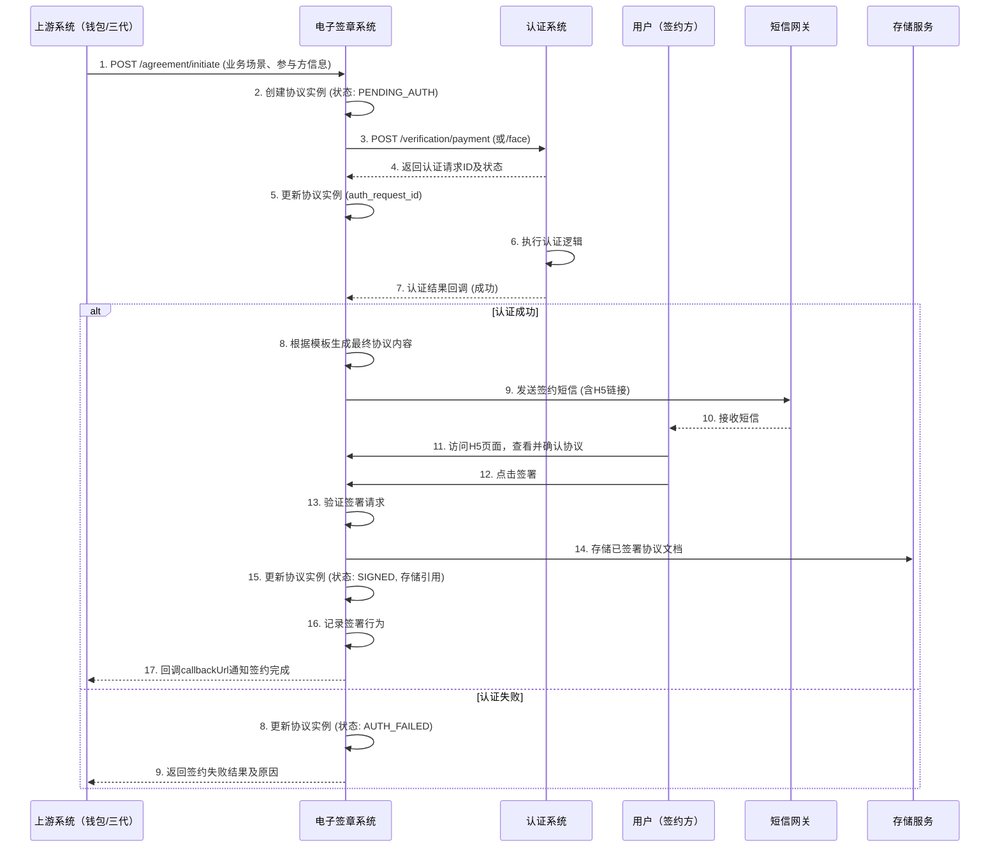

# DocuFlow-AI Project - 软件设计文档
生成时间: 2026-01-21 17:38:55

## 目录
1. [概述说明](#1-概述说明)
   - 1.1 [术语与缩略词](#11-术语与缩略词)
2. [系统设计](#2-系统设计)
3. [模块设计](#3-模块设计)
   - 3.1 [账户系统](#module-1)
   - 3.2 [计费中台](#module-2)
   - 3.3 [清结算系统](#module-3)
   - 3.4 [认证系统](#module-4)
   - 3.5 [钱包app/商服平台](#module-5)
   - 3.6 [电子签章系统](#module-6)
   - 3.7 [行业钱包系统](#module-7)
   - 3.8 [三代系统](#module-8)
   - 3.9 [业务核心](#module-9)
   - 3.10 [对账单系统](#module-10)
4. [接口设计](#4-接口设计)
5. [数据库设计](#5-数据库设计)

---
# 1 概述说明

## 1.1 术语与缩略词

## 业务实体

- **天财分账**: 满足天财商龙门店分账、会员结算、批量付款需求的业务，涉及天财专用账户的开立和分账接口。
- **天财收款账户** (别名: 天财专用账户): 为收单商户开立的专用账户，类型为行业钱包（非小微钱包），用于收款和分账。
- **天财接收方账户** (别名: 天财专用账户): 在三代、钱包系统开立的专用账户，支持绑定多张银行卡并设置默认提现卡，用于接收分账资金。
- **分账手续费承担方**: 转账手续费由哪一方承担，选项包括付方或收方统一承担，由天财接口传递。

## 角色

- **总部** (别名: 总店, 发起方): 天财分账业务中的发起方，通常为企业商户，负责发起归集、批量付款、会员结算等指令。
- **门店**: 天财分账业务中的参与方，可以是归集场景的付方或会员结算场景的收方。

## 流程

- **归集** (别名: 归集授权): 一种分账场景，指资金从门店（付方）归集到总部（收方）的业务流程。
- **批量付款** (别名: 批付): 一种分账场景，指总部（付方）分账给接收方账户的业务流程。
- **会员结算**: 一种分账场景，指总部（付方）分账给门店（收方）的业务流程。
- **关系绑定** (别名: 绑定关系, 签约与认证): 在分账前，建立收付双方授权关系的流程，包括签约与认证。
- **开通付款**: 在批量付款和会员结算场景下，付方（总部/门店-对公企业）需要额外完成的签约认证流程。
- **退货前置**: 退货流程的前置环节，查询终点账户并处理扣款。

## 技术术语

- **打款验证**: 一种认证方式，通过向绑定银行卡打小额随机金额，验证回填金额和备注是否正确。
- **人脸验证**: 一种认证方式，通过比对姓名、身份证和人脸信息，验证个人或个体接收方身份。
- **主动结算**: 一种结算模式，结算账户默认设置为商户号新开立的天财收款账户。
- **被动结算**: 一种结算模式，与主动结算相对，三代目前不允许从主动结算切换至此模式。

## 系统角色

- **电子签章系统** (别名: 电子签约平台): 负责协议模板配置、短信模板配置、调用认证系统、协议签章以及H5及短信发送的系统。
- **行业钱包系统** (别名: 钱包系统): 负责天财专用账户开户校验、角色管理、关系绑定校验、分账请求处理及数据同步的核心系统。
- **三代系统**: 负责调用钱包开通账户、校验机构号、配置结算账户、提供分账关系绑定接口的系统。
- **账户系统**: 底层系统，负责开通并标记天财专用账户，控制账户能力，支持账户升级。
- **清结算系统** (别名: 清结算): 负责接收结算账户配置、处理退货账户查询、支持专用账户冻结的系统。
- **对账单系统**: 负责生成机构层天财分账、提款、收单、结算账单的系统。
- **计费中台**: 提供转账计费能力的系统。
- **业务核心**: 接收天财分账交易的系统。

---
# 2 系统设计
## 2.1 系统结构
天财分账系统是一个基于微服务架构的业务系统，旨在为天财商龙商户提供门店分账、会员结算、批量付款等资金处理能力。系统以**行业钱包系统**为核心业务逻辑处理单元，向上对接**三代系统**以获取商户与账户配置，向下依赖**账户系统**、**清结算系统**、**计费中台**等基础服务完成账户管理、资金结算和费用计算。**电子签章系统**与**认证系统**为业务流程中的关系绑定与授权提供支持。**业务核心**作为统一的资金交易入口，负责将分账指令路由至底层支付或清结算通道执行。**对账单系统**负责聚合各模块的业务数据，生成机构层级的各类账单。**钱包app/商服平台**作为前端应用，为商户提供业务操作界面。

## 2.2 功能结构
系统功能围绕天财分账的核心业务流程进行组织，主要包括账户与配置管理、关系绑定与认证、分账交易处理、以及账单与报表四大功能域。

## 2.3 网络拓扑图
TBD

## 2.4 数据流转
数据流转描述了天财分账业务中关键流程的数据在系统各模块间的传递路径。核心流程包括：账户开通、关系绑定、分账交易执行。

## 2.5 系统模块交互关系
模块交互关系详细描述了各系统组件之间的接口调用与数据依赖，是系统集成与联调的基础。

---
# 3 模块设计

## 3.1 账户系统

### 1. 概述
- **目的与范围**: 账户系统是底层核心系统，负责为天财分账业务开立并标记天财专用账户（行业钱包），控制账户的支付、收款、冻结等核心能力，并支持账户的升级操作。其边界在于账户的底层创建、状态管理和基础能力控制，不涉及具体的分账业务逻辑和关系绑定。

### 2. 接口设计
- **API端点 (REST/GraphQL)**:
    - `POST /api/v1/accounts`: 创建天财专用账户。
    - `PUT /api/v1/accounts/{accountId}/status`: 变更账户状态（如冻结、解冻）。
    - `PUT /api/v1/accounts/{accountId}/abilities`: 控制账户能力（如支付、收款开关）。
    - `GET /api/v1/accounts/{accountId}`: 查询账户详情。
- **请求/响应结构**:
    - 创建账户请求：包含请求方标识、商户信息、业务类型标记等。
    - 创建账户响应：包含账户ID、账户状态、基础能力列表。
    - 状态/能力变更请求：包含目标状态/能力、操作原因、幂等键。
    - 通用响应：包含操作结果、错误码、错误信息。
- **发布/消费的事件**:
    - 发布事件：`AccountCreated`（账户创建）、`AccountStatusChanged`（状态变更）、`AccountAbilityChanged`（能力变更）。
    - 消费事件：TBD。

### 3. 数据模型
- **表/集合**:
    - `accounts`: 账户主表。
    - `account_abilities`: 账户能力关联表。
    - `account_status_logs`: 账户状态变更日志表。
- **关键字段**:
    - `accounts`表：账户ID、商户ID、账户类型（行业钱包）、业务标记（天财分账）、账户状态（正常/冻结/注销）、创建时间、更新时间。
    - `account_abilities`表：账户ID、能力类型（支付、收款）、能力状态（开启/关闭）、生效时间。
    - `account_status_logs`表：日志ID、账户ID、原状态、新状态、变更原因、操作人、操作时间。
- **与其他模块的关系**: 账户系统为行业钱包系统提供底层账户实体。账户系统根据三代系统的指令开通账户。账户系统将账户信息同步至清结算系统用于结算配置。

### 4. 业务逻辑
- **核心工作流/算法**:
    1.  **账户创建流程**:
        - 接收来自三代系统的开户请求。
        - 校验请求方权限与参数合法性。
        - 生成唯一账户ID，在底层创建账户实体。
        - 为账户打上"天财分账"业务标记，并设置为"行业钱包"类型。
        - 初始化账户状态为"正常"，并开启基础能力（如收款）。
        - 记录日志，并异步将账户信息同步至清结算系统。
    2.  **账户状态管理流程**:
        - 接收状态变更请求（如冻结）。
        - 校验账户当前状态是否允许变更（如正常账户可被冻结）。
        - 执行状态更新，并记录状态变更日志。
        - 若变更为冻结状态，需异步通知清结算系统。
    3.  **账户能力控制流程**:
        - 接收能力控制请求（如关闭支付能力）。
        - 校验账户当前状态（如冻结账户无法变更能力）。
        - 更新`account_abilities`表中对应能力的状态。
        - 记录操作日志。
    4.  **账户标记更新流程**:
        - 接收将普通账户升级标记为"天财专用账户"的请求。
        - 校验目标账户类型与当前标记。
        - 更新账户的业务标记字段。
        - 记录日志并同步信息。
- **业务规则与验证**: 开户时需校验请求方（如三代系统）的权限。账户标记需确保唯一性和业务类型（天财分账）的准确性。账户能力变更需进行权限和状态校验。所有写操作需支持幂等性。
- **关键边界情况处理**: 处理重复开户请求（通过请求幂等键实现幂等）。处理对已冻结账户进行操作的情况（返回明确错误）。处理标记更新过程中的数据一致性问题（使用事务）。

### 5. 时序图

### 6. 错误处理
- **预期错误情况**:
    - 客户端错误：请求方无权限、请求参数不合法、账户不存在、账户状态冲突（如对冻结账户进行操作）、重复请求（幂等键冲突）。
    - 服务端错误：数据库连接失败、下游系统（清结算）调用超时或失败、内部服务异常。
- **处理策略**:
    - 对客户端错误返回明确的4xx错误码与信息（如`ACCOUNT_FROZEN`）。
    - 对下游系统调用失败，进行有限次数的重试，并记录告警日志。
    - 对所有写操作（创建、状态变更、能力控制）要求携带幂等键，防止重复处理。
    - 系统内部错误记录详细日志并返回5xx错误，同时触发监控告警。

### 7. 依赖关系
- **上游模块**: 三代系统（调用账户系统开通账户、更新账户标记）。
- **下游模块**: 行业钱包系统（依赖账户系统提供的账户实体）、清结算系统（接收账户信息用于结算配置，接收账户冻结通知）。

## 3.2 计费中台

### 1. 概述
- **目的与范围**: 本模块是为系统内其他业务模块（如行业钱包系统）提供统一、准确的转账手续费计算能力的核心服务。其边界明确为处理与"天财分账"业务相关的转账费用计算，具体包括"归集"、"批量付款"、"会员结算"等场景。本模块不处理资金流转、账户操作或其他非计费业务逻辑。

### 2. 接口设计
- **API端点 (REST/GraphQL)**: 提供 RESTful API。
    - `POST /api/v1/fee/calculate`: 计算单笔转账手续费。
- **请求/响应结构**:
    - **请求体 (CalculateFeeRequest)**:
        - `bizScenario` (String): 业务场景，枚举值：`COLLECTION`(归集), `BATCH_PAYMENT`(批量付款), `MEMBER_SETTLEMENT`(会员结算)。
        - `amount` (BigDecimal): 转账金额。
        - `payerId` (String): 付方账户标识。
        - `payeeId` (String): 收方账户标识。
        - `feeBearer` (String): 手续费承担方，枚举值：`PAYER`(付方承担), `PAYEE`(收方承担)。由上游调用方（如行业钱包系统）根据天财接口传入的"分账手续费承担方"传递。
        - `requestId` (String): 请求唯一标识，用于幂等性控制。
    - **响应体 (CalculateFeeResponse)**:
        - `success` (Boolean): 请求是否成功。
        - `data` (FeeDetail): 成功时返回的计费详情。
            - `feeAmount` (BigDecimal): 计算出的手续费金额。
            - `actualBearer` (String): 实际承担方 (`PAYER` 或 `PAYEE`)。
            - `calculationId` (String): 本次计费唯一记录ID。
        - `error` (ErrorInfo): 失败时返回的错误信息。
            - `code` (String): 错误码。
            - `message` (String): 错误描述。
- **发布/消费的事件**: TBD。

### 3. 数据模型
- **表/集合**:
    - `fee_rule` (计费规则表): 存储不同业务场景下的计费规则。
    - `fee_calculation_log` (计费记录表): 记录每次手续费计算请求与结果，用于对账、审计和幂等。
- **关键字段**:
    - `fee_rule` 表:
        - `id` (主键)
        - `biz_scenario` (业务场景)
        - `rule_expression` (规则表达式，如：费率百分比、固定金额、阶梯费率等)
        - `min_fee` (最低手续费)
        - `max_fee` (最高手续费)
        - `rounding_rule` (舍入规则)
        - `effective_start` (生效开始时间)
        - `effective_end` (生效结束时间)
    - `fee_calculation_log` 表:
        - `calculation_id` (主键，与响应中的`calculationId`对应)
        - `request_id` (请求ID，用于幂等)
        - `biz_scenario`
        - `amount`
        - `payer_id`
        - `payee_id`
        - `fee_bearer`
        - `calculated_fee`
        - `actual_bearer`
        - `rule_applied` (所使用的规则ID或快照)
        - `status` (状态: SUCCESS, FAILED)
        - `error_code`
        - `created_at`
- **与其他模块的关系**: 本模块的数据独立管理，为行业钱包系统等调用方提供计费服务。计费规则由运营后台配置并写入`fee_rule`表。

### 4. 业务逻辑
- **核心工作流/算法**:
    1. **接收请求**: 通过`/api/v1/fee/calculate`接口接收计费请求。
    2. **幂等校验**: 根据`requestId`查询`fee_calculation_log`表。若存在成功记录，则直接返回历史结果；若存在失败记录，允许重新计算。
    3. **参数校验**: 校验请求参数完整性、金额有效性、业务场景和承担方枚举值合法性。
    4. **规则匹配**: 根据`bizScenario`、当前时间等条件，从`fee_rule`表中查询唯一生效的计费规则。
    5. **费用计算**: 根据匹配到的规则表达式（如：`amount * rate`）计算原始手续费。
    6. **边界处理**:
        - **保底/封顶**: 应用`min_fee`和`max_fee`规则。
        - **舍入**: 根据`rounding_rule`（如：四舍五入到分）进行金额舍入。
    7. **承担方确定**: 根据请求中的`feeBearer`字段，确定最终手续费由付方(`PAYER`)还是收方(`PAYEE`)承担。此逻辑直接影响上游调用方后续的资金划扣/入账逻辑。
    8. **记录日志**: 将完整的请求、计算结果、应用规则及状态记录到`fee_calculation_log`表。
    9. **返回结果**: 组装`CalculateFeeResponse`并返回。
- **业务规则与验证**: 核心是根据"分账手续费承担方"的配置，计算并确定最终的费用金额和承担方。规则本身支持基于场景、时间的动态配置。
- **关键边界情况处理**:
    - **规则缺失**: 若无匹配的生效规则，计费失败，返回明确错误。
    - **金额为零或负值**: 校验失败，返回参数错误。
    - **并发请求**: 通过`requestId`实现幂等，防止重复计费。
    - **计算精度**: 使用`BigDecimal`进行精确计算，避免浮点误差。
    - **规则切换**: 依赖规则的生效时间，确保在切换时间点前后请求计算的一致性。

### 5. 时序图

### 6. 错误处理
- **预期错误情况与处理策略**:
    - `INVALID_PARAMETER`: 请求参数缺失、格式错误或金额无效。处理：返回400状态码及具体错误信息。
    - `FEE_RULE_NOT_FOUND`: 未找到当前业务场景下生效的计费规则。处理：返回404状态码，提示规则未配置。
    - `CALCULATION_ERROR`: 费用计算过程中发生异常（如规则表达式执行错误）。处理：返回500状态码，记录详细日志。
    - `DUPLICATE_REQUEST_ID`: 请求ID冲突（极少数情况）。处理：返回409状态码，提示请求重复。
    - `DOWNSTREAM_UNAVAILABLE`: 依赖的数据库异常。处理：返回503状态码，具备重试机制的调用方可稍后重试。
- **重试与降级**: 对于因网络或下游短暂故障导致的失败，调用方（行业钱包系统）可基于`requestId`进行有限次重试。本模块自身无降级计费策略，规则缺失则计费失败。

### 7. 依赖关系
- **上游模块**: **行业钱包系统**。在处理分账请求时，调用本模块计算手续费。
- **下游模块/依赖**:
    - **数据库**: 持久化存储计费规则(`fee_rule`)和计费日志(`fee_calculation_log`)。
    - **规则配置后台** (隐含): 提供配置界面，管理`fee_rule`表数据，本模块不直接依赖其接口，但依赖其配置结果。
- **其他关系**: 本模块为纯计算服务，不主动调用其他业务系统。

## 3.3 清结算系统

### 1. 概述
- **目的与范围**: 本模块是天财分账业务中资金清算与结算处理的底层支撑系统，负责处理与账户状态和资金结算相关的核心操作。其核心职责包括：接收并处理来自三代系统的结算账户配置请求；在退货前置环节，为业务核心提供终点账户查询服务；执行对天财专用账户的冻结与解冻指令。本模块不负责分账交易处理（由行业钱包系统负责）或账单生成（由对账单系统负责），而是专注于结算规则的执行与账户状态的管控。

### 2. 接口设计
- **API端点 (REST)**:
    - `POST /api/v1/settlement/config`: 接收结算账户配置。
    - `GET /api/v1/settlement/account/query`: 查询退货终点账户信息。
    - `POST /api/v1/account/freeze`: 执行专用账户冻结操作。
    - `POST /api/v1/account/unfreeze`: 执行专用账户解冻操作。
- **请求/响应结构**:
    - 结算账户配置请求: `{"merchant_id": "string", "settlement_account_no": "string", "settlement_mode": "ACTIVE/PASSIVE"}`。响应: `{"code": "string", "msg": "string", "data": {"config_id": "string"}}`。
    - 退货账户查询请求: `{"original_order_no": "string"}`。响应: `{"code": "string", "msg": "string", "data": {"account_no": "string", "account_name": "string"}}`。
    - 账户冻结/解冻请求: `{"account_no": "string", "operation_id": "string", "reason": "string"}`。响应: `{"code": "string", "msg": "string", "data": {"freeze_id": "string"}}`。
- **发布/消费的事件**:
    - 消费: `AccountStatusChangedEvent` (来自账户系统，通知账户冻结/解冻状态变化)。
    - 发布: `SettlementConfigCompletedEvent` (结算账户配置完成后发布)。

### 3. 数据模型
- **表/集合**:
    - `settlement_account_config`: 结算账户配置表。
    - `account_freeze_record`: 账户冻结记录表。
- **关键字段**:
    - `settlement_account_config`:
        - `id` (主键), `merchant_id` (商户ID), `account_system_account_id` (账户系统账户ID), `settlement_mode` (结算模式), `status` (配置状态), `created_at`, `updated_at`。
    - `account_freeze_record`:
        - `id` (主键), `account_no` (账户号), `freeze_type` (冻结类型), `status` (冻结状态), `operation_id` (操作流水号), `reason` (原因), `created_at`, `thawed_at`。
- **与其他模块的关系**:
    - 与账户系统交互：通过`account_system_account_id`关联，依赖其提供的天财专用账户状态与基础信息。
    - 与对账单系统交互：通过结算账户配置与冻结记录，为账单生成提供结算规则与账户状态数据。

### 4. 业务逻辑
- **核心工作流/算法**:
    1.  **结算账户配置**: 接收三代系统请求，向账户系统验证目标账户状态为有效且已标记为天财专用账户。验证通过后，持久化配置并发布完成事件。
    2.  **退货账户查询**: 接收业务核心的查询请求，根据原订单号查询关联的终点账户（天财接收方账户），并返回其有效账户信息。
    3.  **专用账户冻结/解冻**: 接收指令，调用账户系统接口执行账户状态变更。成功后，本地记录冻结流水。
- **业务规则与验证**:
    - 结算账户配置时，本系统需调用账户系统接口验证账户状态。若账户状态无效（如不存在、未标记为天财专用账户、已冻结），则拒绝配置。
    - 退货账户查询时，需确保返回的账户处于可用状态（非冻结、非注销）。
    - 账户冻结操作需保证幂等性，相同的`operation_id`不重复执行。
- **关键边界情况处理**:
    - 账户系统调用超时或失败：配置、查询、冻结操作均进入重试队列，并向上游返回"处理中"状态。达到最大重试次数后标记为失败。
    - 数据不一致：定期与账户系统对账，同步账户状态。发现本地配置的账户在账户系统中已失效时，禁用本地配置并发出告警。
    - 并发冻结：通过数据库唯一索引（`account_no` + `operation_id`）或分布式锁保证同一账户的冻结操作串行化。

### 5. 时序图

### 6. 错误处理
- **预期错误情况**:
    - 账户不存在、账户状态异常（如已冻结/注销）、配置信息冲突。
    - 依赖系统（账户系统）服务超时、不可用、返回数据格式异常。
    - 并发操作冲突（如同时发起冻结与解冻）。
- **处理策略**:
    - 业务错误（如账户无效）：返回明确的错误码与信息（如 `ACCOUNT_INVALID`），终止当前流程。
    - 系统级错误（如网络超时）：进行有限次数的指数退避重试。对于配置、冻结等写操作，在重试失败后标记任务失败，并通知运营人员介入。对于查询操作，可返回缓存的上一次有效结果（若存在），否则返回服务暂时不可用。
    - 并发冲突：通过数据库锁或乐观锁机制，确保数据一致性，并向后发起操作的请求返回"操作冲突，请稍后重试"错误。

### 7. 依赖关系
- **上游模块**:
    - 账户系统：强依赖。获取账户状态、执行冻结/解冻、验证账户有效性。
    - 三代系统：强依赖。接收结算账户配置、账户冻结/解冻指令。
    - 业务核心：强依赖。接收退货账户查询请求。
- **下游模块**:
    - 对账单系统：提供结算账户配置与账户冻结记录数据，用于账单生成。
- **内部依赖**: TBD (如消息队列、数据库)。

## 3.4 认证系统

### 1. 概述
- **目的与范围**：本模块为天财分账业务中的关系绑定、开通付款等流程提供身份与授权认证能力。核心职责是处理由电子签章系统发起的打款验证和人脸验证，并返回认证结果。其边界是提供认证服务，不涉及协议签署、账户管理或分账交易处理。

### 2. 接口设计
- **API端点 (REST)**：
    - `POST /api/v1/verification/payment`：发起打款验证。
    - `POST /api/v1/verification/face`：发起人脸验证。
    - `GET /api/v1/verification/records/{requestId}`：查询认证记录状态。
- **请求/响应结构**：
    - 打款验证请求：包含接收方账户信息、订单号、待验证的金额与备注。
    - 人脸验证请求：包含姓名、身份证号、人脸图像或特征数据。
    - 通用响应：包含请求ID、认证状态（成功/失败/处理中）、时间戳、错误码（若失败）。
- **发布/消费的事件**：TBD。

### 3. 数据模型
- **表/集合**：
    - `authentication_request`：认证请求主表。
    - `verification_record`：验证过程与结果明细表。
- **关键字段**：
    - `authentication_request`：`request_id`（主键），`request_type`（打款/人脸），`applicant_info`，`status`，`create_time`，`update_time`。
    - `verification_record`：`record_id`（主键），`request_id`（外键），`verification_step`，`external_service_response`，`result`，`error_detail`。
- **与其他模块的关系**：本模块被电子签章系统调用。`authentication_request`表中的`applicant_info`可能关联到行业钱包系统或三代系统的账户信息。

### 4. 业务逻辑
- **核心工作流/算法**：
    1.  **接收请求**：电子签章系统调用认证接口。
    2.  **请求持久化与校验**：创建`authentication_request`记录，校验请求参数有效性。
    3.  **分类型执行认证**：
        - **打款验证**：调用外部支付网关或银行通道接口，验证用户回填的金额和备注是否与系统发出的随机打款信息一致。验证结果写入`verification_record`。
        - **人脸验证**：调用外部人脸识别服务API，比对请求中的姓名、身份证号和人脸信息。验证结果写入`verification_record`。
    4.  **更新状态与响应**：根据验证结果更新主请求状态，并将结果同步返回给电子签章系统。
- **业务规则与验证**：
    - 校验接收方身份（个人或个体）信息的真实性与一致性。
    - 打款验证需确保金额和备注在有效期内且未被重复验证。
    - 人脸验证需确保生物特征信息符合安全与合规标准。
- **关键边界情况处理**：
    - **外部服务调用失败**：实施指数退避重试机制（最多3次），若最终失败则标记认证为"系统异常"。
    - **信息不匹配**：记录具体不匹配的字段，返回明确的验证失败结果。
    - **请求超时**：设置异步处理机制，通过查询接口提供最终结果。

### 5. 时序图

### 6. 错误处理
- **预期错误情况**：
    - `4001`：请求参数无效（如身份证格式错误）。
    - `4002`：身份信息验证失败（打款金额不符或人脸比对不通过）。
    - `5001`：外部验证服务暂时不可用。
    - `5002`：数据库操作失败。
    - `5003`：系统内部处理超时。
- **处理策略**：
    - 对客户端错误（4xx）返回具体错误描述，不重试。
    - 对服务端及外部依赖错误（5xx）记录详细日志，并对可重试的异常（如网络超时）实施重试。
    - 所有失败操作均需在`verification_record`表中记录错误详情。

### 7. 依赖关系
- **上游模块**：电子签章系统（调用本模块进行认证）。
- **下游模块/外部服务**：
    - 外部支付验证服务（用于打款验证）。
    - 外部人脸识别服务（用于人脸验证）。
- **内部依赖**：数据库（用于持久化认证请求与记录）。

## 3.5 钱包app/商服平台

### 1. 概述
- **目的与范围**：本模块是面向商户（总部、门店）的前端单页应用（SPA），提供天财分账业务的交互界面。核心职责是引导用户完成账户开通、关系绑定、发起分账指令、查询结果等操作流程。本模块不处理核心业务逻辑，仅负责用户交互、数据收集与展示、以及向后端服务发起请求。
- **架构角色**：本模块为纯前端应用，部署在Web服务器或应用商店。用户操作产生的业务数据（如指令参数）通过API提交至后端（行业钱包系统、三代系统），仅在前端本地暂存草稿或会话状态，不进行持久化存储。

### 2. 接口设计
- **API端点 (REST)**：
    - `POST /api/v1/account/guide`：获取账户开通引导信息（调用三代或钱包系统）。
    - `POST /api/v1/binding/initiate`：发起关系绑定请求。
    - `GET /api/v1/binding/status/{bindingId}`：查询关系绑定状态。
    - `POST /api/v1/instruction/collect`：发起归集指令。
    - `POST /api/v1/instruction/batch-payment`：发起批量付款指令。
    - `POST /api/v1/instruction/member-settlement`：发起会员结算指令。
    - `GET /api/v1/instruction/{instructionId}/result`：查询指令执行结果。
    - `GET /api/v1/bill/query`：查询账单（对接对账单系统）。
    - `POST /api/v1/payment/activate`：发起开通付款流程。
- **请求/响应结构**：
    - 请求体通用结构：`{"requestId": "string", "timestamp": "number", "data": {…}}`
    - 响应体通用结构：`{"code": "string", "message": "string", "data": {…}, "timestamp": "number"}`
    - 具体数据字段TBD。
- **发布/消费的事件**：
    - 消费事件：`binding_status_updated`（关系绑定状态变更）、`instruction_processed`（分账指令处理完成）。事件通过WebSocket或长轮询从行业钱包系统接收，用于更新前端状态。
    - 发布事件：本模块为前端，不发布业务事件。

### 3. 数据模型
- **前端状态/本地存储模型**：
    - `UserSession`：存储当前用户登录态、选择的商户角色（总部/门店）。
    - `DraftInstruction`：暂存用户未提交的分账指令草稿（如归集金额、手续费承担方）。
    - `LocalOperationLog`：记录关键前端操作（如页面访问、按钮点击），用于问题追踪。
- **关键字段**：
    - `DraftInstruction`: `id`, `type`(归集/批量付款/会员结算), `payerId`, `payeeId`, `amount`, `feeBearer`, `draftTime`
    - `UserSession`: `userId`, `merchantRole`, `token`, `lastActive`
- **与其他模块的关系**：本模块不直接操作后端数据库。所有业务状态（如绑定关系、账户状态）均通过API从行业钱包系统、三代系统实时查询获取。

### 4. 业务逻辑
- **核心工作流/算法**：
    1.  **账户开通引导**：
        - 输入：商户机构号。
        - 步骤：调用三代系统接口校验机构号并获取账户开通H5页面链接或参数。
        - 输出：引导用户跳转至三代系统页面完成账户开立。
    2.  **关系绑定流程（状态机）**：
        - 状态：`初始` -> `签约中` -> `认证中` -> `已认证` / `失败`。
        - 算法：
            a. 用户选择付方与收方。
            b. 调用行业钱包系统校验绑定资格。
            c. 获取电子签章系统H5链接，引导用户完成签约。
            d. 轮询或接收回调，更新绑定状态。
            e. 状态为"已认证"后方可进行分账操作。
    3.  **分账指令发起**：
        - 前置校验：付方与收方关系绑定状态为"已认证"；付方账户状态正常。
        - 参数组装：根据指令类型（归集、批量付款、会员结算）组装请求参数，包括分账手续费承担方。
        - 提交：调用行业钱包系统对应接口。
    4.  **开通付款流程**：
        - 触发条件：当总部首次发起批量付款或会员结算时检测。
        - 流程：引导付方（总部）跳转至电子签章系统完成额外的签约认证。
    5.  **结果查询与展示**：
        - 主动查询：根据指令ID轮询行业钱包系统获取结果。
        - 被动通知：监听`instruction_processed`事件，实时更新界面。
- **业务规则与验证**：
    - 关系绑定校验：付方与收方不能为同一商户；归集场景付方必须为门店，收方必须为总部；会员结算场景付方必须为总部，收方必须为门店。
    - 金额校验：输入金额必须大于0且符合精度要求（如两位小数）。
    - 会话管理：用户会话超时（如30分钟）后需重新登录。
- **并发与同步**：
    - 同一份数据（如绑定关系状态）避免在前端多个标签页或组件中产生不一致，通过全局状态管理（如Vuex/Pinia）集中管理。
    - 本地草稿定时自动保存，防止页面意外刷新丢失数据。

### 5. 时序图

#### 5.1 账户开通引导时序图

#### 5.2 分账指令发起时序图（以归集为例）

#### 5.3 开通付款流程时序图

### 6. 错误处理
- **预期错误情况**：
    - 网络错误：连接超时、断开。
    - API业务错误：参数校验失败、余额不足、关系未绑定、账户冻结。
    - 用户输入错误：格式错误、必填项为空。
    - 认证/签约流程错误：人脸验证失败、打款验证不匹配、H5页面加载失败。
- **处理策略**：
    - 网络错误：显示"网络异常，请检查连接"提示，并提供重试按钮。对于提交类操作，本地暂存草稿。
    - API业务错误：解析后端返回的`code`和`message`，转换为用户友好的提示语（如"收款方账户状态异常，请联系客服"）。对于状态类错误（如未绑定），引导用户进入对应流程。
    - 输入错误：实施前端表单实时校验，错误字段高亮并显示提示。
    - 流程错误：记录失败步骤，允许用户从断点重试或选择其他认证方式。H5页面加载失败时提供备用链接或二维码。

### 7. 依赖关系
- **上游模块/服务**：
    - **行业钱包系统**：核心依赖。提供关系绑定、分账指令提交、状态查询所有核心接口。
    - **三代系统**：用于账户开通引导阶段的机构号校验和页面跳转。本模块与钱包系统的账户操作通过三代系统间接进行。
    - **电子签章系统**：提供关系绑定和开通付款流程所需的签约认证H5页面或接口。
    - **对账单系统**：提供账单查询数据。
- **下游模块**：无。本模块不对外提供接口。
- **前端技术依赖**：Web框架（如Vue.js）、状态管理库、HTTP客户端、WebSocket客户端。

## 3.6 电子签章系统

### 1. 概述
- **目的与范围**：本模块为天财分账业务中的关系绑定、开通付款等流程提供电子协议签署与认证发起能力。核心职责是配置协议与短信模板，调用认证系统完成身份验证，生成并管理电子协议，以及通过H5页面和短信引导用户完成签约。其边界是处理协议生命周期与认证流程的衔接，不直接处理账户、分账交易或资金结算。

### 2. 接口设计
- **API端点 (REST)**：
    - `POST /api/v1/agreement/initiate`：接收上游系统发起的签约请求，启动签约流程。
    - `GET /api/v1/agreement/{agreementId}`：根据协议ID查询协议详情及签署状态。
    - `POST /api/v1/agreement/callback/sign`：接收H5页面签署完成后的回调。
    - `GET /api/v1/template/agreement/{templateId}`：查询协议模板详情。
    - `POST /api/v1/template/agreement`：创建或更新协议模板。
- **请求/响应结构**：
    - 发起签约请求 (`POST /api/v1/agreement/initiate`)：
        - 请求体：`{ "businessScenario": "关系绑定"|"开通付款", "initiator": "总部"|"门店", "participantInfo": { … }, "callbackUrl": "TBD" }`
        - 响应体：`{ "agreementId": "string", "requestId": "string", "status": "PENDING_AUTH" }`
    - 查询协议详情 (`GET /api/v1/agreement/{agreementId}`)：
        - 响应体：`{ "agreementId": "string", "status": "SIGNED"|"EXPIRED"|"AUTH_FAILED", "partiesInfo": { … }, "signedDocumentRef": "TBD", "createTime": "timestamp" }`
- **发布/消费的事件**：TBD

### 3. 数据模型
- **表/集合**：
    - `agreement_template`：存储可配置的电子协议模板。
    - `sms_template`：存储与协议模板配套的短信通知模板。
    - `agreement_instance`：存储每次签约流程生成的协议实例。
    - `signing_record`：存储用户签署行为记录。
- **关键字段**：
    - `agreement_template`：`template_id`（主键），`business_scenario`，`template_content`，`variables_schema`，`version`，`is_active`。
    - `sms_template`：`sms_template_id`（主键），`agreement_template_id`（外键），`scenario`，`content`，`variables`。
    - `agreement_instance`：`agreement_id`（主键），`template_id`（外键），`business_scenario`，`status`，`participant_info`，`auth_request_id`，`signed_document_ref`，`expiry_time`，`create_time`。
    - `signing_record`：`record_id`（主键），`agreement_id`（外键），`signing_party`，`sign_time`，`user_agent`，`ip_address`。
- **与其他模块的关系**：本模块调用认证系统进行打款验证和人脸验证，`agreement_instance`表中的`auth_request_id`关联认证系统的`authentication_request`表。协议中涉及的账户信息关联到行业钱包系统或三代系统的账户数据。

### 4. 业务逻辑
- **核心工作流/算法**：
    1.  **协议模板配置与管理**：支持创建、更新、查询协议模板和短信模板。模板内容支持变量插值（如`{{accountNo}}`），在生成实例前根据`variables_schema`进行语法和变量校验。模板具有版本管理和启用/停用状态。
    2.  **发起签约与认证**：接收上游请求后，根据业务场景和参与方角色确定认证方式（打款验证/人脸验证）。调用认证系统对应接口（`POST /api/v1/verification/payment` 或 `POST /api/v1/verification/face`），并记录返回的`request_id`。将协议实例状态置为`PENDING_AUTH`。
    3.  **协议生成与变量替换**：在收到认证系统成功回调或轮询认证成功后，根据`template_id`获取模板，使用从上游请求和认证结果中获取的实际数据（如账户号、商户名）替换模板变量，生成最终协议内容。
    4.  **通知与签署引导**：根据协议实例ID和`business_scenario`选择对应短信模板，替换变量后通过短信网关发送含H5签约链接的短信。H5页面展示协议内容并提供签署确认功能。
    5.  **签署完成与存储**：用户签署后，通过回调接口`POST /api/v1/agreement/callback/sign`通知系统。系统验证签署有效性，更新协议实例状态为`SIGNED`，并将签署后的协议文档存储（存储服务TBD），记录`signing_record`。最后，通过`callbackUrl`通知上游系统。
    6.  **协议生命周期管理**：为每个协议实例设置`expiry_time`。定时任务扫描超时未签署的实例，将其状态更新为`EXPIRED`，并可能触发提醒（TBD）。支持对已签署协议的查询与归档。
- **业务规则与验证**：
    - 根据业务场景（关系绑定、开通付款）和参与方角色（总部、门店）确定所需的认证方式。
    - 确保协议签署必须在对应的身份认证（打款验证/人脸验证）成功之后进行。
    - 协议内容需与行业钱包系统中的账户绑定关系、分账授权等信息保持一致。在生成协议前，通过调用上游系统接口（TBD）或验证请求数据来确保一致性。
    - 协议模板启用前必须通过语法和变量校验。
- **关键边界情况处理**：
    - **认证失败**：接收认证系统返回的失败结果，更新协议实例状态为`AUTH_FAILED`，阻止协议生成与签署流程，向发起方返回明确的失败原因。
    - **用户未完成签署**：设置协议有效期（`expiry_time`），超时后流程作废，状态更新为`EXPIRED`，需重新发起。
    - **模板配置错误**：在协议生成前进行模板语法和变量校验，防止生成无效协议。若校验失败，记录错误日志，协议状态置为`FAILED`。
    - **认证系统调用异常**：对认证系统接口调用实施重试机制（如最多3次），并设置超时。若最终失败，协议状态置为`SYSTEM_ERROR`，并向上游返回系统错误。

### 5. 时序图

### 6. 错误处理
- **预期错误情况**：
    - `E4001`：请求参数无效或缺失（如缺少businessScenario）。
    - `E4002`：协议模板不存在或未启用。
    - `E4003`：模板变量校验失败。
    - `E4004`：认证失败（来自认证系统的明确失败）。
    - `E4005`：协议已过期或状态不允许签署。
    - `E5001`：认证系统调用失败或超时。
    - `E5002`：短信发送失败。
    - `E5003`：文档存储失败。
    - `E5004`：数据库操作异常。
- **处理策略**：
    - 对于客户端输入错误（`E4001`-`E4005`），记录日志，向调用方返回具体的错误码和描述，不进行重试。
    - 对于外部依赖或系统内部错误（`E5001`-`E5004`），记录详细错误日志（包括上下文信息），并进行告警。对于可重试错误（如`E5001`网络超时、`E5002`短信发送临时失败），实施有限次数的重试（如3次）。重试失败后，将协议实例状态标记为`SYSTEM_ERROR`，并通知运维。
    - 所有错误处理需保证数据状态的一致性（如更新协议实例状态）。

### 7. 依赖关系
- **上游模块**：行业钱包系统、三代系统（通过`POST /api/v1/agreement/initiate`发起签约请求，提供账户及业务信息）。
- **下游模块**：认证系统（调用其`POST /api/v1/verification/payment`和`POST /api/v1/verification/face`接口进行身份验证）。
- **外部服务**：短信网关（发送通知）、外部存储服务（存储签署后的协议文档，具体服务TBD）。

## 3.7 行业钱包系统

### 1. 概述
- **目的与范围**：行业钱包系统是天财分账业务的核心处理系统，负责天财专用账户的开户校验、角色管理、分账关系绑定校验、分账请求处理及数据同步。其边界在于处理与天财专用账户相关的业务逻辑和状态流转，不涉及底层账户的创建（由账户系统负责）和电子协议的签署（由电子签章系统负责）。

### 2. 接口设计
- **API端点 (REST/GraphQL)**:
    - `POST /api/v1/account/open`: 接收三代系统的开户请求，进行校验并调用账户系统。
    - `POST /api/v1/relationship/bind`: 发起关系绑定流程，调用电子签章系统。
    - `POST /api/v1/transfer`: 处理分账请求（归集、批量付款、会员结算）。
    - `GET /api/v1/account/{accountId}/status`: 查询账户状态及绑定关系。
- **请求/响应结构**:
    - 开户请求：包含机构号、商户信息、账户类型等。
    - 关系绑定请求：包含业务场景（关系绑定/开通付款）、发起方、参与方信息等。
    - 分账请求：包含业务场景、付方账户、收方账户、金额、分账手续费承担方等。
    - 通用响应：包含操作结果、业务数据或错误信息。
- **发布/消费的事件**:
    - 发布事件：`AccountOpened`（账户开通完成）、`RelationshipBound`（关系绑定完成）、`TransferInitiated`（分账发起）。
    - 消费事件：TBD。

### 3. 数据模型
- **表/集合**:
    - `tiancai_accounts`: 天财专用账户信息表。
    - `account_roles`: 账户角色关联表（总部、门店）。
    - `relationship_bindings`: 分账关系绑定表。
    - `transfer_records`: 分账交易记录表。
- **关键字段**:
    - `tiancai_accounts`表：账户ID（关联账户系统）、商户ID、机构号、账户状态（正常/冻结）、开户时间、更新时间。
    - `account_roles`表：账户ID、角色类型（总部/门店）、关联商户信息、生效时间。
    - `relationship_bindings`表：绑定ID、付方账户ID、收方账户ID、业务场景（归集/会员结算）、绑定状态（已签约/已认证/生效）、协议ID（关联电子签章系统）、生效时间、过期时间。
    - `transfer_records`表：交易ID、业务场景、付方账户ID、收方账户ID、金额、手续费、手续费承担方、交易状态、请求时间、完成时间。
- **与其他模块的关系**：`tiancai_accounts.account_id` 关联账户系统的 `accounts` 表。`relationship_bindings.agreement_id` 关联电子签章系统的 `agreement_instance` 表。分账记录关联计费中台的计费日志。

### 4. 业务逻辑
- **核心工作流/算法**:
    1.  **天财专用账户开户流程**:
        - 接收三代系统的开户请求，校验机构号及商户信息。
        - 调用账户系统 `POST /api/v1/accounts` 接口创建底层账户并标记为"天财分账"。
        - 在本地 `tiancai_accounts` 和 `account_roles` 表中创建记录，初始化状态。
        - 将账户信息同步至清结算系统用于结算配置。
    2.  **关系绑定流程**:
        - 接收绑定请求（如总部发起归集关系绑定）。
        - 校验付方与收方账户是否存在、角色是否匹配（如付方需为门店，收方需为总部）。
        - 调用电子签章系统 `POST /api/v1/agreement/initiate` 接口，发起签约与认证流程。
        - 接收电子签章系统的签约完成回调，更新 `relationship_bindings` 表状态为"生效"。
    3.  **分账处理流程（归集/批量付款/会员结算）**:
        - 接收分账请求，校验业务场景、付方账户状态、收方账户状态。
        - 根据场景校验关系绑定是否生效（如归集需校验门店到总部的绑定关系）。
        - 调用计费中台 `POST /api/v1/fee/calculate` 接口计算手续费。
        - 组装资金划转指令（调用业务核心或清结算系统，TBD），并扣减/增加相应账户余额（资金操作TBD）。
        - 记录分账交易记录，更新相关状态。
    4.  **账户与关系状态同步流程**:
        - 监听账户系统发布的 `AccountStatusChanged`（如冻结）事件，同步更新本地 `tiancai_accounts` 表状态。
        - 账户状态变更时，需联动冻结或失效相关的绑定关系。
- **业务规则与验证**:
    - 开户时需严格校验三代系统传递的机构号。
    - 关系绑定需确保付方与收方角色符合业务场景定义（如归集：付方门店，收方总部）。
    - 分账前必须校验对应的关系绑定协议已签署生效。
    - 分账手续费承担方（付方/收方）由上游请求传入，并传递给计费中台。
- **关键边界情况处理**:
    - **重复开户**：通过三代请求的幂等键或商户信息唯一性校验防止重复。
    - **绑定关系冲突**：同一对付方收方在同一业务场景下只允许存在一条生效绑定。
    - **分账时账户余额不足**：交易失败，返回明确错误。
    - **下游系统（账户、电子签章、计费）调用失败**：进行有限次重试，重试失败则流程中止，状态置为失败。

### 5. 时序图

### 6. 错误处理
- **预期错误情况**:
    - 客户端错误：无效的机构号、账户不存在、角色不匹配、绑定关系未生效、余额不足、重复请求。
    - 服务端错误：账户系统调用失败、电子签章系统调用失败、计费中台调用失败、数据库异常。
- **处理策略**:
    - 对客户端错误返回明确的4xx错误码与信息（如`BINDING_NOT_ACTIVE`）。
    - 对下游系统调用失败，进行有限次数（如3次）的重试，重试失败后更新业务状态为失败，并记录告警日志。
    - 涉及资金的操作需保证事务性或最终一致性，通过补偿机制处理部分失败场景（TBD）。
    - 系统内部错误记录详细日志并返回5xx错误，触发监控告警。

### 7. 依赖关系
- **上游模块**: 三代系统（发起开户、提供机构号）、业务核心（接收分账交易，TBD）。
- **下游模块**: 账户系统（创建和标记底层账户）、电子签章系统（处理关系绑定签约）、计费中台（计算分账手续费）、清结算系统（同步账户信息）。

## 3.8 三代系统

### 1. 概述
- **目的与范围**: 三代系统是天财分账业务的关键上游系统，负责商户和账户的初始化与配置。其核心职责包括：调用行业钱包系统为商户开通天财专用账户；校验并传递机构号；为商户配置结算账户模式（主动/被动）；以及提供分账关系绑定的发起接口。本模块不处理具体的分账交易、账户管理或协议签署，而是作为业务入口，将天财分账能力对接到商户侧。

### 2. 接口设计
- **API端点 (REST/GraphQL)**:
    - `POST /api/v1/tiancai/account/open`: 发起天财专用账户开户请求。
    - `POST /api/v1/tiancai/settlement/config`: 配置商户的结算账户模式。
    - `POST /api/v1/tiancai/relationship/bind`: 发起分账关系绑定（签约与认证）。
    - `GET /api/v1/tiancai/merchant/{merchantId}/status`: 查询商户的天财分账业务开通状态。
    - `POST /api/v1/tiancai/callback/wallet`: 接收行业钱包系统的异步回调（用于开户、关系绑定状态更新）。
- **请求/响应结构**:
    - 开户请求: 包含 `institution_code` (机构号)、`merchant_info`、`account_type` 等。响应包含 `account_id`、`status`。
    - 结算配置请求: 包含 `merchant_id`、`settlement_mode` (ACTIVE/PASSIVE)、`settlement_account_no` (可选，主动结算时忽略)。响应包含 `config_id`、`status`。
    - 关系绑定请求: 包含 `business_scene` (关系绑定/开通付款)、`payer_info`、`payee_info` 等。响应包含 `binding_id`、`status`。
    - 钱包回调请求: 包含 `request_id` (原请求ID)、`event_type` (ACCOUNT_OPENED/RELATIONSHIP_BOUND)、`status` (SUCCESS/FAILED)、`data` (账户ID/协议ID等)。
    - 通用响应结构: `{"code": "string", "msg": "string", "data": {...}}`。
- **发布/消费的事件**:
    - 发布事件: `MerchantAccountOpened` (商户账户开通完成)、`SettlementConfigRequested` (结算配置已发起)。
    - 消费事件: `SettlementConfigCompletedEvent` (来自清结算系统，通知结算配置完成)。

### 3. 数据模型
- **表/集合**:
    - `tiancai_merchant_config`: 商户天财分账配置表。
    - `tiancai_account_mapping`: 三代商户与天财账户映射表。
    - `settlement_config_log`: 结算账户配置记录表。
    - `relationship_binding_log`: 分账关系绑定记录表。
- **关键字段**:
    - `tiancai_merchant_config`表: `id` (主键)、`merchant_id` (商户ID)、`institution_code` (机构号)、`business_status` (业务开通状态)、`created_at`。
    - `tiancai_account_mapping`表: `id` (主键)、`merchant_id`、`tiancai_account_id` (行业钱包系统账户ID)、`account_role` (总部/门店)、`account_status` (开通中/正常/失败)、`created_at`、`updated_at`。
    - `settlement_config_log`表: `id` (主键)、`merchant_id`、`settlement_mode`、`settlement_account_no`、`config_status` (处理中/成功/失败)、`request_id`、`created_at`、`updated_at`。
    - `relationship_binding_log`表: `id` (主键)、`binding_id` (行业钱包系统返回)、`payer_merchant_id`、`payee_merchant_id`、`business_scene`、`binding_status` (发起中/签约中/已生效/失败)、`agreement_id`、`created_at`、`updated_at`。
- **与其他模块的关系**: `tiancai_account_mapping.tiancai_account_id` 关联行业钱包系统的 `tiancai_accounts` 表。结算配置记录关联清结算系统的 `settlement_account_config` 表。

### 4. 业务逻辑
- **核心工作流/算法**:
    1.  **天财专用账户开户流程**:
        - 接收商户或内部系统的开户请求。
        - 校验请求中的 `institution_code` 有效性。
        - 调用行业钱包系统 `POST /api/v1/account/open` 接口，传递机构号及商户信息。
        - 接收行业钱包系统返回的账户ID，在本地 `tiancai_account_mapping` 表中建立映射关系，状态置为"开通中"。
        - 接收行业钱包系统的异步回调（`POST /api/v1/tiancai/callback/wallet`），根据回调结果更新 `tiancai_account_mapping` 表的 `account_status` 为"正常"或"失败"。
    2.  **结算账户配置流程**:
        - 接收结算模式配置请求。
        - 根据 `merchant_id` 查询其对应的天财专用账户信息。
        - 业务规则：若 `settlement_mode` 为"主动结算"（ACTIVE），则忽略请求中的 `settlement_account_no`，使用查询到的天财专用账户号作为结算账户。若为"被动结算"（PASSIVE），则使用请求中传入的 `settlement_account_no`。
        - 调用清结算系统 `POST /api/v1/settlement/config` 接口，传递商户ID、结算模式和结算账户号。
        - 记录配置操作日志，状态置为"处理中"。
        - 消费清结算系统发布的 `SettlementConfigCompletedEvent` 事件，根据事件结果更新 `settlement_config_log` 表状态。
    3.  **分账关系绑定发起流程**:
        - 接收关系绑定请求（例如，总部发起与门店的归集绑定）。
        - 根据业务场景，校验付方与收方商户是否已成功开通天财专用账户及角色是否正确。
        - 调用行业钱包系统 `POST /api/v1/relationship/bind` 接口，发起签约与认证流程。
        - 接收行业钱包系统返回的 `binding_id`，在 `relationship_binding_log` 表中创建记录，状态置为"发起中"。
        - 接收行业钱包系统的异步回调（`POST /api/v1/tiancai/callback/wallet`），根据回调的 `event_type` 和 `status` 更新 `relationship_binding_log` 表的 `binding_status` 和 `agreement_id`。
- **业务规则与验证**:
    - 开户前必须校验 `institution_code`，确保其为有效的天财合作机构号。
    - 结算账户配置时，仅支持配置为"主动结算"模式（根据术语表，三代目前不允许切换至被动结算）。若收到被动结算请求，应拒绝。
    - 发起关系绑定时，需确保付方和收方商户均已成功开通天财专用账户且账户状态为"正常"。
    - 所有向下游系统发起的请求需支持幂等性，防止重复处理。
- **关键边界情况处理**:
    - **重复开户**: 通过商户ID和业务类型进行唯一性校验，避免为同一商户重复开通。
    - **下游系统调用失败**: 对行业钱包系统、清结算系统的调用进行有限次重试（如3次，采用指数退避）。重试失败后，将本地业务状态（账户状态、配置状态、绑定状态）置为"失败"，并记录详细日志告警。
    - **数据不一致**: 定期与行业钱包系统对账，同步账户开通状态和映射关系。提供手动状态同步接口供运营使用。
    - **异步回调丢失**: 提供补偿查询接口，允许行业钱包系统或运营手动触发状态同步。同时，`relationship_binding_log` 表记录可用于人工巡检。

### 5. 时序图

### 6. 错误处理
- **预期错误情况**:
    - 客户端错误：无效的机构号(`INVALID_INSTITUTION_CODE`)、商户信息不全(`MISSING_MERCHANT_INFO`)、重复的开户或配置请求(`DUPLICATE_REQUEST`)、不支持的结算模式（如请求被动结算）(`UNSUPPORTED_SETTLEMENT_MODE`)、绑定时账户未开通(`ACCOUNT_NOT_OPENED`)。
    - 服务端错误：行业钱包系统服务不可用(`WALLET_SERVICE_UNAVAILABLE`)、清结算系统调用超时(`SETTLEMENT_SERVICE_TIMEOUT`)、数据库操作失败(`DATABASE_ERROR`)、异步回调处理失败(`CALLBACK_PROCESSING_ERROR`)。
- **处理策略**:
    - 对于客户端输入错误，返回具体的4xx错误码与描述信息。
    - 对于下游依赖系统（行业钱包、清结算）调用失败，实施指数退避重试机制（最多3次）。若最终失败，将业务状态标记为"失败"，记录详细错误日志并触发监控告警，通知运营人工介入。
    - 对于异步回调处理失败（如数据校验不通过），记录错误日志，并向回调方返回非2xx状态码，以便其重试。
    - 系统内部异常（如数据库异常）记录完整错误堆栈，向上游返回5xx系统错误(`INTERNAL_SERVER_ERROR`)，并触发监控告警。

### 7. 依赖关系
- **上游模块**: 客户端/内部系统（业务发起方）。
- **下游模块**:
    - 行业钱包系统（强依赖）：用于开通天财专用账户、发起关系绑定。依赖其异步回调更新最终状态。
    - 清结算系统（强依赖）：用于配置商户结算账户。消费其发布的事件以更新配置状态。
- **内部依赖**: 数据库、消息队列（用于消费`SettlementConfigCompletedEvent`事件）。

## 3.9 业务核心

### 1. 概述
- **目的与范围**：业务核心是接收并处理天财分账交易请求的系统。其核心职责是作为资金划转的入口，接收来自行业钱包系统的分账指令，并协调完成后续的资金处理流程。其边界在于处理交易请求的接收、验证、路由与执行，不涉及具体的账户管理、关系绑定或手续费计算。模块将接收上游传递的`手续费承担方`指令，并在调用下游系统时传递该指令，但不负责计算手续费金额。

### 2. 接口设计
- **API端点 (REST/GraphQL)**:
    - `POST /api/v1/transfer/execute`: 接收行业钱包系统的分账（资金划转）请求。
- **请求/响应结构**:
    - 请求：包含交易ID（关联行业钱包系统`transfer_records`表）、业务场景、付方账户ID、收方账户ID、金额、手续费、手续费承担方等。
    - 响应：包含处理结果（成功/失败）、交易状态、错误码（如失败）。
- **发布/消费的事件**:
    - 发布事件：`TransferExecuted`（资金划转执行完成）、`TransferFailed`（资金划转执行失败）。
    - 消费事件：TBD。

### 3. 数据模型
- **表/集合**:
    - `transfer_execution_records`: 交易执行记录表。
- **关键字段**:
    - `transfer_execution_records`表：执行ID、交易ID（关联行业钱包系统`transfer_records.transaction_id`）、业务场景、付方账户ID、收方账户ID、金额、手续费、手续费承担方、执行状态（处理中/成功/失败）、请求时间、完成时间、错误信息、路由通道标识。
- **与其他模块的关系**：`transfer_execution_records.transaction_id` 关联行业钱包系统的 `transfer_records` 表。

### 4. 业务逻辑
- **核心工作流/算法**:
    1.  **分账交易执行流程**:
        - 接收行业钱包系统发起的资金划转请求。
        - 校验请求参数的完整性（如交易ID、账户、金额等）。
        - 根据业务场景和账户属性（如账户类型、所属机构），通过配置的路由规则映射表，确定目标底层支付或清结算通道（如"支付系统"或"清结算系统"）。
        - 调用底层通道接口，执行资金从付方账户到收方账户的扣款与入账操作，并传递`手续费承担方`指令。
        - 接收底层通道的处理结果，更新本地`transfer_execution_records`表状态。
        - 根据执行结果发布相应事件（`TransferExecuted`或`TransferFailed`）。
        - 将最终执行结果返回给行业钱包系统。
- **业务规则与验证**:
    - 必须校验交易ID的唯一性，防止重复执行。
    - 根据行业钱包系统传递的`手续费承担方`信息，在调用下游系统时传递该指令。
- **关键边界情况处理**:
    - **重复请求**：通过交易ID进行幂等性校验，避免同一笔交易被重复执行。
    - **底层通道调用失败**：进行有限次重试（如3次），采用指数退避策略。重试失败后标记交易执行失败，并记录详细错误信息。
    - **交易超时**：设置调用底层通道的超时时间为30秒。超时后，根据下游系统的最终一致性保证机制，依赖日终对账处理资金状态。

### 5. 时序图

### 6. 错误处理
- **预期错误情况**:
    - 客户端错误：请求参数缺失或无效（返回HTTP 400）、交易ID重复（返回HTTP 409）、账户状态异常（如冻结，返回HTTP 422）。
    - 服务端错误：底层支付通道调用失败（返回HTTP 502）、网络超时（返回HTTP 504）、数据库异常（返回HTTP 500）。
- **处理策略**:
    - 对客户端错误返回明确的4xx错误码与信息。
    - 对底层通道的暂时性失败，进行有限次数（3次）的指数退避重试。
    - 对于最终失败且涉及资金不确定性的交易，记录详细日志并触发告警，需通过日终对账处理。
    - 系统内部错误记录详细日志并返回5xx错误，触发监控告警。

### 7. 依赖关系
- **上游模块**: 行业钱包系统（发起分账资金划转请求）。
- **下游模块**: 支付系统或清结算系统（执行具体的资金扣划与入账操作）。

## 3.10 对账单系统

### 1. 概述
- **目的与范围**：对账单系统负责为天财分账业务生成机构层级的各类账单。其核心职责是根据上游系统提供的业务数据，生成天财分账、提款、收单、结算账单。其边界在于账单的生成、存储与查询，不涉及具体的分账交易处理、账户管理或资金结算。

### 2. 接口设计
- **API端点 (REST/GraphQL)**:
    - `GET /api/v1/statement/tiancai/transfer`: 查询天财分账账单。
    - `GET /api/v1/statement/withdrawal`: 查询提款账单。
    - `GET /api/v1/statement/acquiring`: 查询收单账单。
    - `GET /api/v1/statement/settlement`: 查询结算账单。
    - `POST /api/v1/statement/generate`: 触发账单生成任务（TBD）。
- **请求/响应结构**:
    - 账单查询请求：通常包含机构号、商户ID、账单日期范围、账单类型等筛选条件。
    - 账单查询响应：包含账单列表，每条记录包含交易时间、金额、账户、状态、手续费等信息（具体字段TBD）。
    - 账单生成请求：TBD。
    - 账单生成响应：TBD。
- **发布/消费的事件**:
    - 消费事件：`TransferExecuted`（来自业务核心，用于分账账单）、`TransferFailed`（来自业务核心）、`SettlementConfigCompletedEvent`（来自清结算系统，用于结算账单）、`AccountStatusChanged`（来自账户系统，TBD）。
    - 发布事件：TBD。

### 3. 数据模型
- **表/集合**:
    - `statement_tiancai_transfer`: 天财分账账单明细表。
    - `statement_withdrawal`: 提款账单明细表。
    - `statement_acquiring`: 收单账单明细表。
    - `statement_settlement`: 结算账单明细表。
    - `statement_summary`: 账单汇总表（TBD）。
- **关键字段**:
    - `statement_tiancai_transfer`表：账单ID、机构号、商户ID、交易ID（关联行业钱包系统`transfer_records`）、业务场景（归集/批量付款/会员结算）、付方账户、收方账户、金额、手续费、手续费承担方、交易状态、交易时间。
    - `statement_withdrawal`表：账单ID、机构号、商户ID、提款账户、提款金额、手续费、状态、提款时间（TBD）。
    - `statement_acquiring`表：账单ID、机构号、商户ID、收单订单号、交易金额、手续费、状态、交易时间（TBD）。
    - `statement_settlement`表：账单ID、机构号、商户ID、结算账户（关联清结算系统`settlement_account_config`）、结算模式（主动/被动）、结算金额、结算状态、结算周期（TBD）。
    - `statement_summary`表：TBD。
- **与其他模块的关系**：`statement_tiancai_transfer.transaction_id` 关联行业钱包系统的 `transfer_records` 表。`statement_settlement.settlement_account` 关联清结算系统的 `settlement_account_config` 表。

### 4. 业务逻辑
- **核心工作流/算法**:
    1.  **账单数据收集与生成流程**:
        - 监听相关业务事件（如`TransferExecuted`、`SettlementConfigCompletedEvent`）。
        - 根据事件类型，提取关键业务数据（如交易双方、金额、手续费、结算账户配置等）。
        - 将数据写入对应的账单明细表中，作为原始账单数据。
        - 在日终或指定周期（如T+1），触发账单汇总任务，按机构、商户、日期维度聚合数据，生成可供下载的账单文件（TBD）。
    2.  **账单查询与展示流程**:
        - 接收前端或下游系统的账单查询请求。
        - 根据查询条件（机构、商户、时间、类型）从相应的账单表中检索数据。
        - 对数据进行分页、排序处理后返回。
- **业务规则与验证**:
    - 账单数据应保证与源业务数据的一致性，需有对账机制（TBD）。
    - 分账账单需准确记录`手续费承担方`信息。
    - 结算账单需准确反映`结算模式`（主动/被动）。
- **关键边界情况处理**:
    - **事件重复消费**：通过事件ID或业务流水号实现消费幂等，防止账单数据重复。
    - **源数据延迟或丢失**：提供手动补单接口，允许根据业务时间范围重新拉取上游数据生成账单。
    - **账单生成失败**：记录失败日志并告警，支持重试。

### 5. 时序图

### 6. 错误处理
- **预期错误情况**:
    - 事件数据格式错误或缺失关键字段。
    - 数据库写入失败（主键冲突、连接超时）。
    - 依赖的上游事件服务不可用。
    - 账单汇总任务执行超时或失败。
- **处理策略**:
    - 对于格式错误的事件，记录错误日志并丢弃，同时告警。
    - 对于数据库写入失败，进行有限次重试，重试失败后记录至死信队列，人工介入处理。
    - 上游服务不可用时，记录日志并告警，系统应具备缓存机制，在服务恢复后重新拉取数据（TBD）。
    - 汇总任务失败后，记录详细错误信息，支持手动触发重跑。

### 7. 依赖关系
- **上游模块**:
    - 业务核心：消费其发布的`TransferExecuted`、`TransferFailed`等事件，作为分账账单的数据源。
    - 清结算系统：消费其发布的`SettlementConfigCompletedEvent`事件，作为结算账单的数据源；依赖其`settlement_account_config`表获取结算账户配置详情。
    - 行业钱包系统：依赖其`transfer_records`表获取分账交易详情（通过事件或直接查询，TBD）。
- **下游模块**: TBD（如运营平台、商户后台，用于账单查询与下载）。

---
# 4 接口设计
## 4.1 对外接口
本系统对外部（如商户、合作伙伴）暴露的API接口。

| Method | Path | Module | Description | Request/Response |
| :--- | :--- | :--- | :--- | :--- |
| POST | /api/v1/accounts | 账户系统 | 创建天财专用账户 | TBD |
| PUT | /api/v1/accounts/{accountId}/status | 账户系统 | 变更账户状态（如冻结、解冻） | TBD |
| PUT | /api/v1/accounts/{accountId}/abilities | 账户系统 | 控制账户能力（如支付、收款开关） | TBD |
| GET | /api/v1/accounts/{accountId} | 账户系统 | 查询账户详情 | TBD |
| POST | /api/v1/fee/calculate | 计费中台 | 计算单笔转账手续费 | TBD |
| POST | /api/v1/settlement/config | 清结算系统 | 接收结算账户配置 | TBD |
| GET | /api/v1/settlement/account/query | 清结算系统 | 查询退货终点账户信息 | TBD |
| POST | /api/v1/account/freeze | 清结算系统 | 执行专用账户冻结操作 | TBD |
| POST | /api/v1/account/unfreeze | 清结算系统 | 执行专用账户解冻操作 | TBD |
| POST | /api/v1/verification/payment | 认证系统 | 发起打款验证 | TBD |
| POST | /api/v1/verification/face | 认证系统 | 发起人脸验证 | TBD |
| GET | /api/v1/verification/records/{requestId} | 认证系统 | 查询认证记录状态 | TBD |
| POST | /api/v1/account/guide | 钱包app/商服平台 | 获取账户开通引导信息 | TBD |
| POST | /api/v1/binding/initiate | 钱包app/商服平台 | 发起关系绑定请求 | TBD |
| GET | /api/v1/binding/status/{bindingId} | 钱包app/商服平台 | 查询关系绑定状态 | TBD |
| POST | /api/v1/instruction/collect | 钱包app/商服平台 | 发起归集指令 | TBD |
| POST | /api/v1/instruction/batch-payment | 钱包app/商服平台 | 发起批量付款指令 | TBD |
| POST | /api/v1/instruction/member-settlement | 钱包app/商服平台 | 发起会员结算指令 | TBD |
| GET | /api/v1/instruction/{instructionId}/result | 钱包app/商服平台 | 查询指令执行结果 | TBD |
| GET | /api/v1/bill/query | 钱包app/商服平台 | 查询账单 | TBD |
| POST | /api/v1/payment/activate | 钱包app/商服平台 | 发起开通付款流程 | TBD |
| POST | /api/v1/agreement/initiate | 电子签章系统 | 接收上游系统发起的签约请求，启动签约流程 | TBD |
| GET | /api/v1/agreement/{agreementId} | 电子签章系统 | 根据协议ID查询协议详情及签署状态 | TBD |
| POST | /api/v1/agreement/callback/sign | 电子签章系统 | 接收H5页面签署完成后的回调 | TBD |
| GET | /api/v1/template/agreement/{templateId} | 电子签章系统 | 查询协议模板详情 | TBD |
| POST | /api/v1/template/agreement | 电子签章系统 | 创建或更新协议模板 | TBD |
| POST | /api/v1/account/open | 行业钱包系统 | 接收三代系统的开户请求，进行校验并调用账户系统 | TBD |
| POST | /api/v1/relationship/bind | 行业钱包系统 | 发起关系绑定流程，调用电子签章系统 | TBD |
| POST | /api/v1/transfer | 行业钱包系统 | 处理分账请求（归集、批量付款、会员结算） | TBD |
| GET | /api/v1/account/{accountId}/status | 行业钱包系统 | 查询账户状态及绑定关系 | TBD |
| POST | /api/v1/tiancai/account/open | 三代系统 | 发起天财专用账户开户请求 | TBD |
| POST | /api/v1/tiancai/settlement/config | 三代系统 | 配置商户的结算账户模式 | TBD |
| POST | /api/v1/tiancai/relationship/bind | 三代系统 | 发起分账关系绑定（签约与认证） | TBD |
| GET | /api/v1/tiancai/merchant/{merchantId}/status | 三代系统 | 查询商户的天财分账业务开通状态 | TBD |
| POST | /api/v1/tiancai/callback/wallet | 三代系统 | 接收行业钱包系统的异步回调（用于开户、关系绑定状态更新） | TBD |
| POST | /api/v1/transfer/execute | 业务核心 | 接收行业钱包系统的分账（资金划转）请求 | TBD |
| GET | /api/v1/statement/tiancai/transfer | 对账单系统 | 查询天财分账账单 | TBD |
| GET | /api/v1/statement/withdrawal | 对账单系统 | 查询提款账单 | TBD |
| GET | /api/v1/statement/acquiring | 对账单系统 | 查询收单账单 | TBD |
| GET | /api/v1/statement/settlement | 对账单系统 | 查询结算账单 | TBD |
| POST | /api/v1/statement/generate | 对账单系统 | 触发账单生成任务 | TBD |

## 4.2 模块间接口
本系统内部各模块之间相互调用的接口。

| Method | Path | Module (调用方) | Description | Request/Response |
| :--- | :--- | :--- | :--- | :--- |
| TBD | TBD | 行业钱包系统 -> 账户系统 | 调用账户系统创建或管理天财专用账户 | TBD |
| TBD | TBD | 行业钱包系统 -> 电子签章系统 | 发起关系绑定的签约与认证流程 | TBD |
| TBD | TBD | 行业钱包系统 -> 计费中台 | 计算分账交易的手续费 | TBD |
| TBD | TBD | 行业钱包系统 -> 清结算系统 | 查询退货账户或执行账户冻结 | TBD |
| TBD | TBD | 行业钱包系统 -> 业务核心 | 发起分账资金划转请求 | TBD |
| TBD | TBD | 三代系统 -> 行业钱包系统 | 发起开户、关系绑定等请求 | TBD |
| TBD | TBD | 三代系统 -> 清结算系统 | 配置结算账户 | TBD |
| TBD | TBD | 电子签章系统 -> 认证系统 | 发起打款验证或人脸验证 | TBD |
| TBD | TBD | 钱包app/商服平台 -> 行业钱包系统 | 发起业务请求（如指令、状态查询） | TBD |
| TBD | TBD | 钱包app/商服平台 -> 三代系统 | 查询商户状态或发起配置请求 | TBD |
| TBD | TBD | 钱包app/商服平台 -> 电子签章系统 | 获取协议签署链接或状态 | TBD |
| TBD | TBD | 钱包app/商服平台 -> 对账单系统 | 查询账单数据 | TBD |
| TBD | TBD | 业务核心 -> 支付系统 | 调用底层支付通道执行资金划转 | TBD |
| TBD | TBD | 业务核心 -> 清结算系统 | 调用清结算通道执行资金划转 | TBD |
| TBD | TBD | 对账单系统 -> 业务核心 | 监听或拉取分账交易事件 | TBD |
| TBD | TBD | 对账单系统 -> 清结算系统 | 监听或拉取结算相关事件 | TBD |
| TBD | TBD | 对账单系统 -> 行业钱包系统 | 监听或拉取账户及分账事件 | TBD |
| TBD | TBD | 对账单系统 -> 三代系统 | 监听或拉取商户配置事件 | TBD |
---
# 5 数据库设计
## 5.1 ER图

```mermaid
erDiagram
    accounts {
        string account_id PK
        string account_type
        string account_status
        string merchant_id FK
        string institution_id
        date create_time
    }
    account_abilities {
        string ability_id PK
        string account_id FK
        string ability_code
        boolean is_enabled
    }
    account_status_logs {
        string log_id PK
        string account_id FK
        string old_status
        string new_status
        date change_time
    }
    fee_rule {
        string rule_id PK
        string business_scenario
        string fee_bearer
        decimal rate
    }
    fee_calculation_log {
        string log_id PK
        string request_id
        string business_id
        decimal calculated_fee
        date create_time
    }
    settlement_account_config {
        string config_id PK
        string merchant_id FK
        string settlement_account_id FK
        string settlement_mode
        date config_time
    }
    account_freeze_record {
        string record_id PK
        string account_id FK
        string freeze_type
        string status
        date start_time
        date end_time
    }
    authentication_request {
        string request_id PK
        string verification_type
        string target_info
        string status
        date create_time
    }
    verification_record {
        string record_id PK
        string request_id FK
        string step
        string result
        date record_time
    }
    agreement_template {
        string template_id PK
        string template_name
        string template_content
        string business_type
    }
    sms_template {
        string template_id PK
        string template_name
        string template_content
        string business_type
    }
    agreement_instance {
        string agreement_id PK
        string template_id FK
        string parties_info
        string status
        date create_time
        date sign_time
    }
    signing_record {
        string record_id PK
        string agreement_id FK
        string signer_id
        string sign_action
        date sign_time
    }
    tiancai_accounts {
        string tiancai_account_id PK
        string account_id FK
        string role_type
        string default_withdraw_card
    }
    account_roles {
        string role_id PK
        string tiancai_account_id FK
        string role_code
    }
    relationship_bindings {
        string binding_id PK
        string payer_account_id FK
        string payee_account_id FK
        string binding_status
        date bind_time
        date expire_time
    }
    transfer_records {
        string transfer_id PK
        string payer_account_id FK
        string payee_account_id FK
        string scenario
        decimal amount
        string fee_bearer
        string status
        date create_time
    }
    tiancai_merchant_config {
        string config_id PK
        string merchant_id
        string tiancai_status
        date open_time
    }
    tiancai_account_mapping {
        string mapping_id PK
        string merchant_id FK
        string tiancai_account_id FK
    }
    settlement_config_log {
        string log_id PK
        string merchant_id FK
        string old_mode
        string new_mode
        date change_time
    }
    relationship_binding_log {
        string log_id PK
        string merchant_id FK
        string binding_id FK
        string action
        date log_time
    }
    transfer_execution_records {
        string execution_id PK
        string transfer_id FK
        string channel
        string channel_request_id
        string status
        date execute_time
    }
    statement_tiancai_transfer {
        string statement_id PK
        string transfer_id FK
        string institution_id
        decimal amount
        decimal fee
        date biz_date
    }
    statement_withdrawal {
        string statement_id PK
        string account_id FK
        string withdrawal_request_id
        decimal amount
        date biz_date
    }
    statement_acquiring {
        string statement_id PK
        string merchant_id
        string order_id
        decimal amount
        date biz_date
    }
    statement_settlement {
        string statement_id PK
        string merchant_id
        string settlement_account_id FK
        decimal amount
        date biz_date
    }
    statement_summary {
        string summary_id PK
        string institution_id
        string statement_type
        decimal total_amount
        date biz_date
    }

    accounts ||--o{ account_abilities : "has"
    accounts ||--o{ account_status_logs : "logs status"
    accounts ||--o{ tiancai_accounts : "is specialized as"
    tiancai_accounts ||--o{ account_roles : "has"
    tiancai_accounts ||--o{ relationship_bindings : "as payer"
    tiancai_accounts ||--o{ relationship_bindings : "as payee"
    tiancai_accounts ||--o{ transfer_records : "as payer"
    tiancai_accounts ||--o{ transfer_records : "as payee"
    tiancai_merchant_config ||--o{ tiancai_account_mapping : "maps to"
    tiancai_account_mapping }o--|| tiancai_accounts : "maps"
    relationship_bindings ||--o{ relationship_binding_log : "logs action"
    transfer_records ||--o{ transfer_execution_records : "executed by"
    agreement_template ||--o{ agreement_instance : "instantiated as"
    agreement_instance ||--o{ signing_record : "signed in"
    authentication_request ||--o{ verification_record : "records step"
    settlement_account_config }o--|| accounts : "configures"
    account_freeze_record }o--|| accounts : "freezes"
    statement_tiancai_transfer }o--|| transfer_records : "records"
    statement_withdrawal }o--|| accounts : "records for"
    statement_settlement }o--|| accounts : "records for"
```

*注：部分实体（如`fee_rule`与其他实体的关系）因信息缺失，暂未在图中体现。*

## 5.2 表结构

| 表名 | 所属模块 | 主要字段 (简述) | 关联关系 (简述) |
| :--- | :--- | :--- | :--- |
| accounts | 账户系统 | 账户ID(PK), 账户类型, 账户状态, 商户ID, 机构号, 创建时间 | 与`account_abilities`, `account_status_logs`, `tiancai_accounts`, `settlement_account_config`, `account_freeze_record`, `statement_withdrawal`, `statement_settlement`关联 |
| account_abilities | 账户系统 | 能力ID(PK), 账户ID(FK), 能力代码, 是否启用 | 关联`accounts`表 |
| account_status_logs | 账户系统 | 日志ID(PK), 账户ID(FK), 旧状态, 新状态, 变更时间 | 关联`accounts`表 |
| fee_rule | 计费中台 | 规则ID(PK), 业务场景, 手续费承担方, 费率 | TBD |
| fee_calculation_log | 计费中台 | 日志ID(PK), 请求ID, 业务ID, 计算手续费, 创建时间 | TBD |
| settlement_account_config | 清结算系统 | 配置ID(PK), 商户ID(FK), 结算账户ID(FK), 结算模式, 配置时间 | 关联`accounts`表 |
| account_freeze_record | 清结算系统 | 记录ID(PK), 账户ID(FK), 冻结类型, 状态, 开始时间, 结束时间 | 关联`accounts`表 |
| authentication_request | 认证系统 | 请求ID(PK), 验证类型, 目标信息, 状态, 创建时间 | 与`verification_record`关联 |
| verification_record | 认证系统 | 记录ID(PK), 请求ID(FK), 步骤, 结果, 记录时间 | 关联`authentication_request`表 |
| agreement_template | 电子签章系统 | 模板ID(PK), 模板名称, 模板内容, 业务类型 | 与`agreement_instance`关联 |
| sms_template | 电子签章系统 | 模板ID(PK), 模板名称, 模板内容, 业务类型 | TBD |
| agreement_instance | 电子签章系统 | 协议ID(PK), 模板ID(FK), 参与方信息, 状态, 创建时间, 签署时间 | 关联`agreement_template`和`signing_record`表 |
| signing_record | 电子签章系统 | 记录ID(PK), 协议ID(FK), 签署人ID, 签署动作, 签署时间 | 关联`agreement_instance`表 |
| tiancai_accounts | 行业钱包系统 | 天财账户ID(PK), 账户ID(FK), 角色类型, 默认提现卡 | 关联`accounts`, `account_roles`, `relationship_bindings`, `transfer_records`, `tiancai_account_mapping`表 |
| account_roles | 行业钱包系统 | 角色ID(PK), 天财账户ID(FK), 角色代码 | 关联`tiancai_accounts`表 |
| relationship_bindings | 行业钱包系统 | 绑定ID(PK), 付方账户ID(FK), 收方账户ID(FK), 绑定状态, 绑定时间, 过期时间 | 关联`tiancai_accounts`表（付方和收方），与`relationship_binding_log`关联 |
| transfer_records | 行业钱包系统 | 交易ID(PK), 付方账户ID(FK), 收方账户ID(FK), 场景, 金额, 手续费承担方, 状态, 创建时间 | 关联`tiancai_accounts`表（付方和收方），与`transfer_execution_records`, `statement_tiancai_transfer`关联 |
| tiancai_merchant_config | 三代系统 | 配置ID(PK), 商户ID, 天财状态, 开通时间 | 与`tiancai_account_mapping`, `settlement_config_log`, `relationship_binding_log`关联 |
| tiancai_account_mapping | 三代系统 | 映射ID(PK), 商户ID(FK), 天财账户ID(FK) | 关联`tiancai_merchant_config`和`tiancai_accounts`表 |
| settlement_config_log | 三代系统 | 日志ID(PK), 商户ID(FK), 旧模式, 新模式, 变更时间 | 关联`tiancai_merchant_config`表 |
| relationship_binding_log | 三代系统 | 日志ID(PK), 商户ID(FK), 绑定ID(FK), 动作, 日志时间 | 关联`tiancai_merchant_config`和`relationship_bindings`表 |
| transfer_execution_records | 业务核心 | 执行ID(PK), 交易ID(FK), 通道, 通道请求ID, 状态, 执行时间 | 关联`transfer_records`表 |
| statement_tiancai_transfer | 对账单系统 | 账单ID(PK), 交易ID(FK), 机构号, 金额, 手续费, 业务日期 | 关联`transfer_records`表 |
| statement_withdrawal | 对账单系统 | 账单ID(PK), 账户ID(FK), 提款请求ID, 金额, 业务日期 | 关联`accounts`表 |
| statement_acquiring | 对账单系统 | 账单ID(PK), 商户ID, 订单ID, 金额, 业务日期 | TBD |
| statement_settlement | 对账单系统 | 账单ID(PK), 商户ID, 结算账户ID(FK), 金额, 业务日期 | 关联`accounts`表 |
| statement_summary | 对账单系统 | 汇总ID(PK), 机构号, 账单类型, 总金额, 业务日期 | TBD |