## 5.1 ER图

```mermaid
erDiagram
    accounts {
        string account_id PK
        string account_type
        string account_status
        string merchant_id FK
        string institution_id
        date create_time
    }
    account_abilities {
        string ability_id PK
        string account_id FK
        string ability_code
        boolean is_enabled
    }
    account_status_logs {
        string log_id PK
        string account_id FK
        string old_status
        string new_status
        date change_time
    }
    fee_rule {
        string rule_id PK
        string business_scenario
        string fee_bearer
        decimal rate
    }
    fee_calculation_log {
        string log_id PK
        string request_id
        string business_id
        decimal calculated_fee
        date create_time
    }
    settlement_account_config {
        string config_id PK
        string merchant_id FK
        string settlement_account_id FK
        string settlement_mode
        date config_time
    }
    account_freeze_record {
        string record_id PK
        string account_id FK
        string freeze_type
        string status
        date start_time
        date end_time
    }
    authentication_request {
        string request_id PK
        string verification_type
        string target_info
        string status
        date create_time
    }
    verification_record {
        string record_id PK
        string request_id FK
        string step
        string result
        date record_time
    }
    agreement_template {
        string template_id PK
        string template_name
        string template_content
        string business_type
    }
    sms_template {
        string template_id PK
        string template_name
        string template_content
        string business_type
    }
    agreement_instance {
        string agreement_id PK
        string template_id FK
        string parties_info
        string status
        date create_time
        date sign_time
    }
    signing_record {
        string record_id PK
        string agreement_id FK
        string signer_id
        string sign_action
        date sign_time
    }
    tiancai_accounts {
        string tiancai_account_id PK
        string account_id FK
        string role_type
        string default_withdraw_card
    }
    account_roles {
        string role_id PK
        string tiancai_account_id FK
        string role_code
    }
    relationship_bindings {
        string binding_id PK
        string payer_account_id FK
        string payee_account_id FK
        string binding_status
        date bind_time
        date expire_time
    }
    transfer_records {
        string transfer_id PK
        string payer_account_id FK
        string payee_account_id FK
        string scenario
        decimal amount
        string fee_bearer
        string status
        date create_time
    }
    tiancai_merchant_config {
        string config_id PK
        string merchant_id
        string tiancai_status
        date open_time
    }
    tiancai_account_mapping {
        string mapping_id PK
        string merchant_id FK
        string tiancai_account_id FK
    }
    settlement_config_log {
        string log_id PK
        string merchant_id FK
        string old_mode
        string new_mode
        date change_time
    }
    relationship_binding_log {
        string log_id PK
        string merchant_id FK
        string binding_id FK
        string action
        date log_time
    }
    transfer_execution_records {
        string execution_id PK
        string transfer_id FK
        string channel
        string channel_request_id
        string status
        date execute_time
    }
    statement_tiancai_transfer {
        string statement_id PK
        string transfer_id FK
        string institution_id
        decimal amount
        decimal fee
        date biz_date
    }
    statement_withdrawal {
        string statement_id PK
        string account_id FK
        string withdrawal_request_id
        decimal amount
        date biz_date
    }
    statement_acquiring {
        string statement_id PK
        string merchant_id
        string order_id
        decimal amount
        date biz_date
    }
    statement_settlement {
        string statement_id PK
        string merchant_id
        string settlement_account_id FK
        decimal amount
        date biz_date
    }
    statement_summary {
        string summary_id PK
        string institution_id
        string statement_type
        decimal total_amount
        date biz_date
    }

    accounts ||--o{ account_abilities : "has"
    accounts ||--o{ account_status_logs : "logs status"
    accounts ||--o{ tiancai_accounts : "is specialized as"
    tiancai_accounts ||--o{ account_roles : "has"
    tiancai_accounts ||--o{ relationship_bindings : "as payer"
    tiancai_accounts ||--o{ relationship_bindings : "as payee"
    tiancai_accounts ||--o{ transfer_records : "as payer"
    tiancai_accounts ||--o{ transfer_records : "as payee"
    tiancai_merchant_config ||--o{ tiancai_account_mapping : "maps to"
    tiancai_account_mapping }o--|| tiancai_accounts : "maps"
    relationship_bindings ||--o{ relationship_binding_log : "logs action"
    transfer_records ||--o{ transfer_execution_records : "executed by"
    agreement_template ||--o{ agreement_instance : "instantiated as"
    agreement_instance ||--o{ signing_record : "signed in"
    authentication_request ||--o{ verification_record : "records step"
    settlement_account_config }o--|| accounts : "configures"
    account_freeze_record }o--|| accounts : "freezes"
    statement_tiancai_transfer }o--|| transfer_records : "records"
    statement_withdrawal }o--|| accounts : "records for"
    statement_settlement }o--|| accounts : "records for"
```

*注：部分实体（如`fee_rule`与其他实体的关系）因信息缺失，暂未在图中体现。*

## 5.2 表结构

| 表名 | 所属模块 | 主要字段 (简述) | 关联关系 (简述) |
| :--- | :--- | :--- | :--- |
| accounts | 账户系统 | 账户ID(PK), 账户类型, 账户状态, 商户ID, 机构号, 创建时间 | 与`account_abilities`, `account_status_logs`, `tiancai_accounts`, `settlement_account_config`, `account_freeze_record`, `statement_withdrawal`, `statement_settlement`关联 |
| account_abilities | 账户系统 | 能力ID(PK), 账户ID(FK), 能力代码, 是否启用 | 关联`accounts`表 |
| account_status_logs | 账户系统 | 日志ID(PK), 账户ID(FK), 旧状态, 新状态, 变更时间 | 关联`accounts`表 |
| fee_rule | 计费中台 | 规则ID(PK), 业务场景, 手续费承担方, 费率 | TBD |
| fee_calculation_log | 计费中台 | 日志ID(PK), 请求ID, 业务ID, 计算手续费, 创建时间 | TBD |
| settlement_account_config | 清结算系统 | 配置ID(PK), 商户ID(FK), 结算账户ID(FK), 结算模式, 配置时间 | 关联`accounts`表 |
| account_freeze_record | 清结算系统 | 记录ID(PK), 账户ID(FK), 冻结类型, 状态, 开始时间, 结束时间 | 关联`accounts`表 |
| authentication_request | 认证系统 | 请求ID(PK), 验证类型, 目标信息, 状态, 创建时间 | 与`verification_record`关联 |
| verification_record | 认证系统 | 记录ID(PK), 请求ID(FK), 步骤, 结果, 记录时间 | 关联`authentication_request`表 |
| agreement_template | 电子签章系统 | 模板ID(PK), 模板名称, 模板内容, 业务类型 | 与`agreement_instance`关联 |
| sms_template | 电子签章系统 | 模板ID(PK), 模板名称, 模板内容, 业务类型 | TBD |
| agreement_instance | 电子签章系统 | 协议ID(PK), 模板ID(FK), 参与方信息, 状态, 创建时间, 签署时间 | 关联`agreement_template`和`signing_record`表 |
| signing_record | 电子签章系统 | 记录ID(PK), 协议ID(FK), 签署人ID, 签署动作, 签署时间 | 关联`agreement_instance`表 |
| tiancai_accounts | 行业钱包系统 | 天财账户ID(PK), 账户ID(FK), 角色类型, 默认提现卡 | 关联`accounts`, `account_roles`, `relationship_bindings`, `transfer_records`, `tiancai_account_mapping`表 |
| account_roles | 行业钱包系统 | 角色ID(PK), 天财账户ID(FK), 角色代码 | 关联`tiancai_accounts`表 |
| relationship_bindings | 行业钱包系统 | 绑定ID(PK), 付方账户ID(FK), 收方账户ID(FK), 绑定状态, 绑定时间, 过期时间 | 关联`tiancai_accounts`表（付方和收方），与`relationship_binding_log`关联 |
| transfer_records | 行业钱包系统 | 交易ID(PK), 付方账户ID(FK), 收方账户ID(FK), 场景, 金额, 手续费承担方, 状态, 创建时间 | 关联`tiancai_accounts`表（付方和收方），与`transfer_execution_records`, `statement_tiancai_transfer`关联 |
| tiancai_merchant_config | 三代系统 | 配置ID(PK), 商户ID, 天财状态, 开通时间 | 与`tiancai_account_mapping`, `settlement_config_log`, `relationship_binding_log`关联 |
| tiancai_account_mapping | 三代系统 | 映射ID(PK), 商户ID(FK), 天财账户ID(FK) | 关联`tiancai_merchant_config`和`tiancai_accounts`表 |
| settlement_config_log | 三代系统 | 日志ID(PK), 商户ID(FK), 旧模式, 新模式, 变更时间 | 关联`tiancai_merchant_config`表 |
| relationship_binding_log | 三代系统 | 日志ID(PK), 商户ID(FK), 绑定ID(FK), 动作, 日志时间 | 关联`tiancai_merchant_config`和`relationship_bindings`表 |
| transfer_execution_records | 业务核心 | 执行ID(PK), 交易ID(FK), 通道, 通道请求ID, 状态, 执行时间 | 关联`transfer_records`表 |
| statement_tiancai_transfer | 对账单系统 | 账单ID(PK), 交易ID(FK), 机构号, 金额, 手续费, 业务日期 | 关联`transfer_records`表 |
| statement_withdrawal | 对账单系统 | 账单ID(PK), 账户ID(FK), 提款请求ID, 金额, 业务日期 | 关联`accounts`表 |
| statement_acquiring | 对账单系统 | 账单ID(PK), 商户ID, 订单ID, 金额, 业务日期 | TBD |
| statement_settlement | 对账单系统 | 账单ID(PK), 商户ID, 结算账户ID(FK), 金额, 业务日期 | 关联`accounts`表 |
| statement_summary | 对账单系统 | 汇总ID(PK), 机构号, 账单类型, 总金额, 业务日期 | TBD |