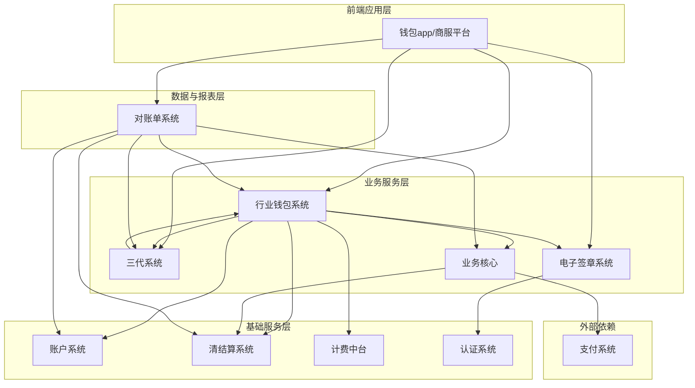
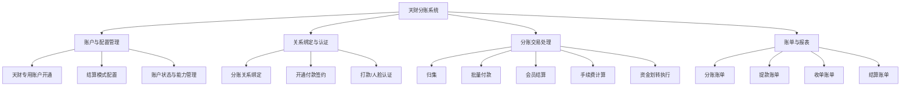
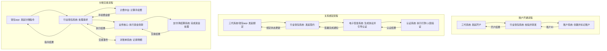
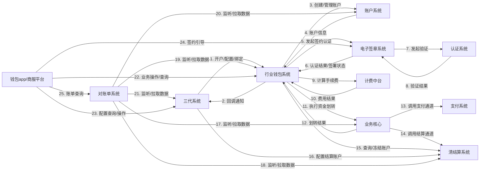

## 2.1 系统结构
天财分账系统是一个基于微服务架构的业务系统，旨在为天财商龙商户提供门店分账、会员结算、批量付款等资金处理能力。系统以**行业钱包系统**为核心业务逻辑处理单元，向上对接**三代系统**以获取商户与账户配置，向下依赖**账户系统**、**清结算系统**、**计费中台**等基础服务完成账户管理、资金结算和费用计算。**电子签章系统**与**认证系统**为业务流程中的关系绑定与授权提供支持。**业务核心**作为统一的资金交易入口，负责将分账指令路由至底层支付或清结算通道执行。**对账单系统**负责聚合各模块的业务数据，生成机构层级的各类账单。**钱包app/商服平台**作为前端应用，为商户提供业务操作界面。

## 2.2 功能结构
系统功能围绕天财分账的核心业务流程进行组织，主要包括账户与配置管理、关系绑定与认证、分账交易处理、以及账单与报表四大功能域。

## 2.3 网络拓扑图
TBD

## 2.4 数据流转
数据流转描述了天财分账业务中关键流程的数据在系统各模块间的传递路径。核心流程包括：账户开通、关系绑定、分账交易执行。

## 2.5 系统模块交互关系
模块交互关系详细描述了各系统组件之间的接口调用与数据依赖，是系统集成与联调的基础。

