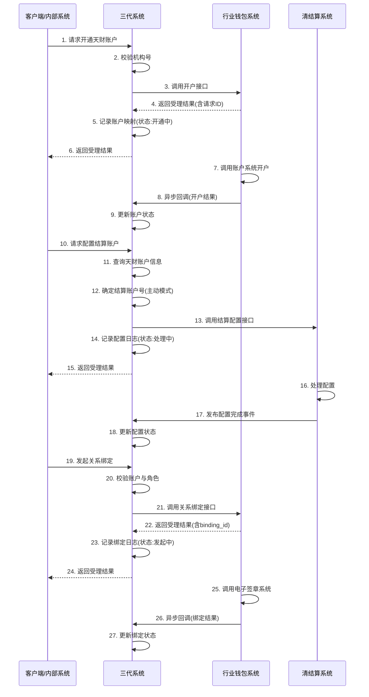

# 模块设计: 三代系统

生成时间: 2026-01-21 17:37:04
批判迭代: 2

---

# 三代系统 模块设计文档

## 1. 概述
- **目的与范围**: 三代系统是天财分账业务的关键上游系统，负责商户和账户的初始化与配置。其核心职责包括：调用行业钱包系统为商户开通天财专用账户；校验并传递机构号；为商户配置结算账户模式（主动/被动）；以及提供分账关系绑定的发起接口。本模块不处理具体的分账交易、账户管理或协议签署，而是作为业务入口，将天财分账能力对接到商户侧。

## 2. 接口设计
- **API端点 (REST/GraphQL)**:
    - `POST /api/v1/tiancai/account/open`: 发起天财专用账户开户请求。
    - `POST /api/v1/tiancai/settlement/config`: 配置商户的结算账户模式。
    - `POST /api/v1/tiancai/relationship/bind`: 发起分账关系绑定（签约与认证）。
    - `GET /api/v1/tiancai/merchant/{merchantId}/status`: 查询商户的天财分账业务开通状态。
    - `POST /api/v1/tiancai/callback/wallet`: 接收行业钱包系统的异步回调（用于开户、关系绑定状态更新）。
- **请求/响应结构**:
    - 开户请求: 包含 `institution_code` (机构号)、`merchant_info`、`account_type` 等。响应包含 `account_id`、`status`。
    - 结算配置请求: 包含 `merchant_id`、`settlement_mode` (ACTIVE/PASSIVE)、`settlement_account_no` (可选，主动结算时忽略)。响应包含 `config_id`、`status`。
    - 关系绑定请求: 包含 `business_scene` (关系绑定/开通付款)、`payer_info`、`payee_info` 等。响应包含 `binding_id`、`status`。
    - 钱包回调请求: 包含 `request_id` (原请求ID)、`event_type` (ACCOUNT_OPENED/RELATIONSHIP_BOUND)、`status` (SUCCESS/FAILED)、`data` (账户ID/协议ID等)。
    - 通用响应结构: `{"code": "string", "msg": "string", "data": {...}}`。
- **发布/消费的事件**:
    - 发布事件: `MerchantAccountOpened` (商户账户开通完成)、`SettlementConfigRequested` (结算配置已发起)。
    - 消费事件: `SettlementConfigCompletedEvent` (来自清结算系统，通知结算配置完成)。

## 3. 数据模型
- **表/集合**:
    - `tiancai_merchant_config`: 商户天财分账配置表。
    - `tiancai_account_mapping`: 三代商户与天财账户映射表。
    - `settlement_config_log`: 结算账户配置记录表。
    - `relationship_binding_log`: 分账关系绑定记录表。
- **关键字段**:
    - `tiancai_merchant_config`表: `id` (主键)、`merchant_id` (商户ID)、`institution_code` (机构号)、`business_status` (业务开通状态)、`created_at`。
    - `tiancai_account_mapping`表: `id` (主键)、`merchant_id`、`tiancai_account_id` (行业钱包系统账户ID)、`account_role` (总部/门店)、`account_status` (开通中/正常/失败)、`created_at`、`updated_at`。
    - `settlement_config_log`表: `id` (主键)、`merchant_id`、`settlement_mode`、`settlement_account_no`、`config_status` (处理中/成功/失败)、`request_id`、`created_at`、`updated_at`。
    - `relationship_binding_log`表: `id` (主键)、`binding_id` (行业钱包系统返回)、`payer_merchant_id`、`payee_merchant_id`、`business_scene`、`binding_status` (发起中/签约中/已生效/失败)、`agreement_id`、`created_at`、`updated_at`。
- **与其他模块的关系**: `tiancai_account_mapping.tiancai_account_id` 关联行业钱包系统的 `tiancai_accounts` 表。结算配置记录关联清结算系统的 `settlement_account_config` 表。

## 4. 业务逻辑
- **核心工作流/算法**:
    1.  **天财专用账户开户流程**:
        - 接收商户或内部系统的开户请求。
        - 校验请求中的 `institution_code` 有效性。
        - 调用行业钱包系统 `POST /api/v1/account/open` 接口，传递机构号及商户信息。
        - 接收行业钱包系统返回的账户ID，在本地 `tiancai_account_mapping` 表中建立映射关系，状态置为"开通中"。
        - 接收行业钱包系统的异步回调（`POST /api/v1/tiancai/callback/wallet`），根据回调结果更新 `tiancai_account_mapping` 表的 `account_status` 为"正常"或"失败"。
    2.  **结算账户配置流程**:
        - 接收结算模式配置请求。
        - 根据 `merchant_id` 查询其对应的天财专用账户信息。
        - 业务规则：若 `settlement_mode` 为"主动结算"（ACTIVE），则忽略请求中的 `settlement_account_no`，使用查询到的天财专用账户号作为结算账户。若为"被动结算"（PASSIVE），则使用请求中传入的 `settlement_account_no`。
        - 调用清结算系统 `POST /api/v1/settlement/config` 接口，传递商户ID、结算模式和结算账户号。
        - 记录配置操作日志，状态置为"处理中"。
        - 消费清结算系统发布的 `SettlementConfigCompletedEvent` 事件，根据事件结果更新 `settlement_config_log` 表状态。
    3.  **分账关系绑定发起流程**:
        - 接收关系绑定请求（例如，总部发起与门店的归集绑定）。
        - 根据业务场景，校验付方与收方商户是否已成功开通天财专用账户及角色是否正确。
        - 调用行业钱包系统 `POST /api/v1/relationship/bind` 接口，发起签约与认证流程。
        - 接收行业钱包系统返回的 `binding_id`，在 `relationship_binding_log` 表中创建记录，状态置为"发起中"。
        - 接收行业钱包系统的异步回调（`POST /api/v1/tiancai/callback/wallet`），根据回调的 `event_type` 和 `status` 更新 `relationship_binding_log` 表的 `binding_status` 和 `agreement_id`。
- **业务规则与验证**:
    - 开户前必须校验 `institution_code`，确保其为有效的天财合作机构号。
    - 结算账户配置时，仅支持配置为"主动结算"模式（根据术语表，三代目前不允许切换至被动结算）。若收到被动结算请求，应拒绝。
    - 发起关系绑定时，需确保付方和收方商户均已成功开通天财专用账户且账户状态为"正常"。
    - 所有向下游系统发起的请求需支持幂等性，防止重复处理。
- **关键边界情况处理**:
    - **重复开户**: 通过商户ID和业务类型进行唯一性校验，避免为同一商户重复开通。
    - **下游系统调用失败**: 对行业钱包系统、清结算系统的调用进行有限次重试（如3次，采用指数退避）。重试失败后，将本地业务状态（账户状态、配置状态、绑定状态）置为"失败"，并记录详细日志告警。
    - **数据不一致**: 定期与行业钱包系统对账，同步账户开通状态和映射关系。提供手动状态同步接口供运营使用。
    - **异步回调丢失**: 提供补偿查询接口，允许行业钱包系统或运营手动触发状态同步。同时，`relationship_binding_log` 表记录可用于人工巡检。

## 5. 时序图

## 6. 错误处理
- **预期错误情况**:
    - 客户端错误：无效的机构号(`INVALID_INSTITUTION_CODE`)、商户信息不全(`MISSING_MERCHANT_INFO`)、重复的开户或配置请求(`DUPLICATE_REQUEST`)、不支持的结算模式（如请求被动结算）(`UNSUPPORTED_SETTLEMENT_MODE`)、绑定时账户未开通(`ACCOUNT_NOT_OPENED`)。
    - 服务端错误：行业钱包系统服务不可用(`WALLET_SERVICE_UNAVAILABLE`)、清结算系统调用超时(`SETTLEMENT_SERVICE_TIMEOUT`)、数据库操作失败(`DATABASE_ERROR`)、异步回调处理失败(`CALLBACK_PROCESSING_ERROR`)。
- **处理策略**:
    - 对于客户端输入错误，返回具体的4xx错误码与描述信息。
    - 对于下游依赖系统（行业钱包、清结算）调用失败，实施指数退避重试机制（最多3次）。若最终失败，将业务状态标记为"失败"，记录详细错误日志并触发监控告警，通知运营人工介入。
    - 对于异步回调处理失败（如数据校验不通过），记录错误日志，并向回调方返回非2xx状态码，以便其重试。
    - 系统内部异常（如数据库异常）记录完整错误堆栈，向上游返回5xx系统错误(`INTERNAL_SERVER_ERROR`)，并触发监控告警。

## 7. 依赖关系
- **上游模块**: 客户端/内部系统（业务发起方）。
- **下游模块**:
    - 行业钱包系统（强依赖）：用于开通天财专用账户、发起关系绑定。依赖其异步回调更新最终状态。
    - 清结算系统（强依赖）：用于配置商户结算账户。消费其发布的事件以更新配置状态。
- **内部依赖**: 数据库、消息队列（用于消费`SettlementConfigCompletedEvent`事件）。