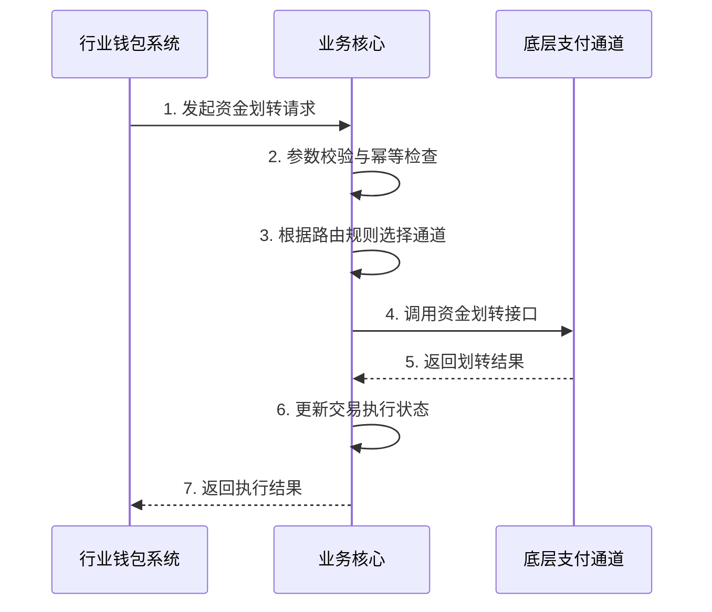

# 模块设计: 业务核心

生成时间: 2026-01-21 17:36:25
批判迭代: 2

---

# 业务核心 模块设计文档

## 1. 概述
- **目的与范围**：业务核心是接收并处理天财分账交易请求的系统。其核心职责是作为资金划转的入口，接收来自行业钱包系统的分账指令，并协调完成后续的资金处理流程。其边界在于处理交易请求的接收、验证、路由与执行，不涉及具体的账户管理、关系绑定或手续费计算。模块将接收上游传递的`手续费承担方`指令，并在调用下游系统时传递该指令，但不负责计算手续费金额。

## 2. 接口设计
- **API端点 (REST/GraphQL)**:
    - `POST /api/v1/transfer/execute`: 接收行业钱包系统的分账（资金划转）请求。
- **请求/响应结构**:
    - 请求：包含交易ID（关联行业钱包系统`transfer_records`表）、业务场景、付方账户ID、收方账户ID、金额、手续费、手续费承担方等。
    - 响应：包含处理结果（成功/失败）、交易状态、错误码（如失败）。
- **发布/消费的事件**:
    - 发布事件：`TransferExecuted`（资金划转执行完成）、`TransferFailed`（资金划转执行失败）。
    - 消费事件：TBD。

## 3. 数据模型
- **表/集合**:
    - `transfer_execution_records`: 交易执行记录表。
- **关键字段**:
    - `transfer_execution_records`表：执行ID、交易ID（关联行业钱包系统`transfer_records.transaction_id`）、业务场景、付方账户ID、收方账户ID、金额、手续费、手续费承担方、执行状态（处理中/成功/失败）、请求时间、完成时间、错误信息、路由通道标识。
- **与其他模块的关系**：`transfer_execution_records.transaction_id` 关联行业钱包系统的 `transfer_records` 表。

## 4. 业务逻辑
- **核心工作流/算法**:
    1.  **分账交易执行流程**:
        - 接收行业钱包系统发起的资金划转请求。
        - 校验请求参数的完整性（如交易ID、账户、金额等）。
        - 根据业务场景和账户属性（如账户类型、所属机构），通过配置的路由规则映射表，确定目标底层支付或清结算通道（如"支付系统"或"清结算系统"）。
        - 调用底层通道接口，执行资金从付方账户到收方账户的扣款与入账操作，并传递`手续费承担方`指令。
        - 接收底层通道的处理结果，更新本地`transfer_execution_records`表状态。
        - 根据执行结果发布相应事件（`TransferExecuted`或`TransferFailed`）。
        - 将最终执行结果返回给行业钱包系统。
- **业务规则与验证**:
    - 必须校验交易ID的唯一性，防止重复执行。
    - 根据行业钱包系统传递的`手续费承担方`信息，在调用下游系统时传递该指令。
- **关键边界情况处理**:
    - **重复请求**：通过交易ID进行幂等性校验，避免同一笔交易被重复执行。
    - **底层通道调用失败**：进行有限次重试（如3次），采用指数退避策略。重试失败后标记交易执行失败，并记录详细错误信息。
    - **交易超时**：设置调用底层通道的超时时间为30秒。超时后，根据下游系统的最终一致性保证机制，依赖日终对账处理资金状态。

## 5. 时序图

## 6. 错误处理
- **预期错误情况**:
    - 客户端错误：请求参数缺失或无效（返回HTTP 400）、交易ID重复（返回HTTP 409）、账户状态异常（如冻结，返回HTTP 422）。
    - 服务端错误：底层支付通道调用失败（返回HTTP 502）、网络超时（返回HTTP 504）、数据库异常（返回HTTP 500）。
- **处理策略**:
    - 对客户端错误返回明确的4xx错误码与信息。
    - 对底层通道的暂时性失败，进行有限次数（3次）的指数退避重试。
    - 对于最终失败且涉及资金不确定性的交易，记录详细日志并触发告警，需通过日终对账处理。
    - 系统内部错误记录详细日志并返回5xx错误，触发监控告警。

## 7. 依赖关系
- **上游模块**: 行业钱包系统（发起分账资金划转请求）。
- **下游模块**: 支付系统或清结算系统（执行具体的资金扣划与入账操作）。