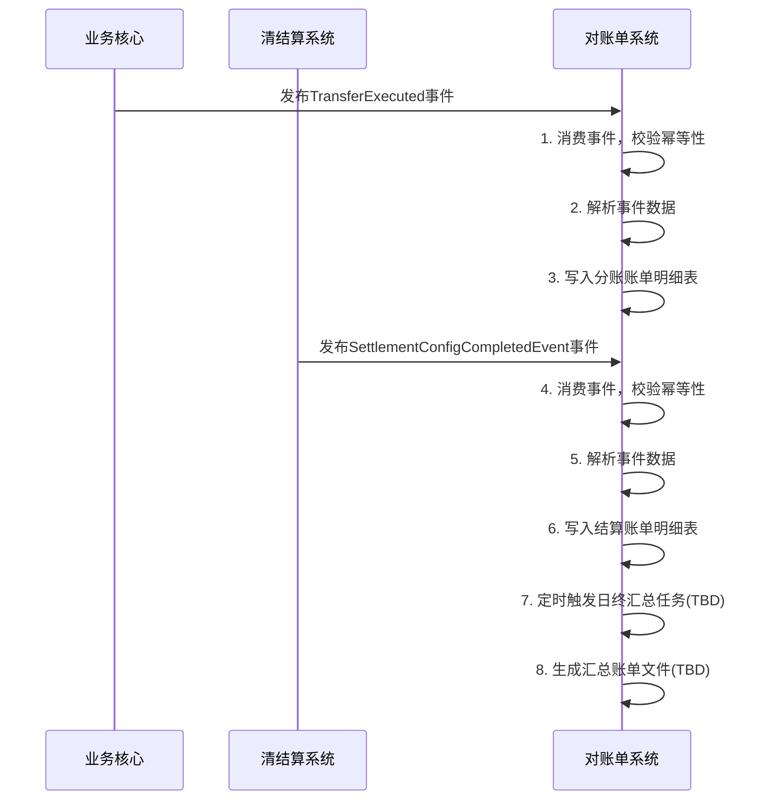

# 模块设计: 对账单系统

生成时间: 2026-01-21 17:37:27
批判迭代: 1

---

# 对账单系统 模块设计文档

## 1. 概述
- **目的与范围**：对账单系统负责为天财分账业务生成机构层级的各类账单。其核心职责是根据上游系统提供的业务数据，生成天财分账、提款、收单、结算账单。其边界在于账单的生成、存储与查询，不涉及具体的分账交易处理、账户管理或资金结算。

## 2. 接口设计
- **API端点 (REST/GraphQL)**:
    - `GET /api/v1/statement/tiancai/transfer`: 查询天财分账账单。
    - `GET /api/v1/statement/withdrawal`: 查询提款账单。
    - `GET /api/v1/statement/acquiring`: 查询收单账单。
    - `GET /api/v1/statement/settlement`: 查询结算账单。
    - `POST /api/v1/statement/generate`: 触发账单生成任务（TBD）。
- **请求/响应结构**:
    - 账单查询请求：通常包含机构号、商户ID、账单日期范围、账单类型等筛选条件。
    - 账单查询响应：包含账单列表，每条记录包含交易时间、金额、账户、状态、手续费等信息（具体字段TBD）。
    - 账单生成请求：TBD。
    - 账单生成响应：TBD。
- **发布/消费的事件**:
    - 消费事件：`TransferExecuted`（来自业务核心，用于分账账单）、`TransferFailed`（来自业务核心）、`SettlementConfigCompletedEvent`（来自清结算系统，用于结算账单）、`AccountStatusChanged`（来自账户系统，TBD）。
    - 发布事件：TBD。

## 3. 数据模型
- **表/集合**:
    - `statement_tiancai_transfer`: 天财分账账单明细表。
    - `statement_withdrawal`: 提款账单明细表。
    - `statement_acquiring`: 收单账单明细表。
    - `statement_settlement`: 结算账单明细表。
    - `statement_summary`: 账单汇总表（TBD）。
- **关键字段**:
    - `statement_tiancai_transfer`表：账单ID、机构号、商户ID、交易ID（关联行业钱包系统`transfer_records`）、业务场景（归集/批量付款/会员结算）、付方账户、收方账户、金额、手续费、手续费承担方、交易状态、交易时间。
    - `statement_withdrawal`表：账单ID、机构号、商户ID、提款账户、提款金额、手续费、状态、提款时间（TBD）。
    - `statement_acquiring`表：账单ID、机构号、商户ID、收单订单号、交易金额、手续费、状态、交易时间（TBD）。
    - `statement_settlement`表：账单ID、机构号、商户ID、结算账户（关联清结算系统`settlement_account_config`）、结算模式（主动/被动）、结算金额、结算状态、结算周期（TBD）。
    - `statement_summary`表：TBD。
- **与其他模块的关系**：`statement_tiancai_transfer.transaction_id` 关联行业钱包系统的 `transfer_records` 表。`statement_settlement.settlement_account` 关联清结算系统的 `settlement_account_config` 表。

## 4. 业务逻辑
- **核心工作流/算法**:
    1.  **账单数据收集与生成流程**:
        - 监听相关业务事件（如`TransferExecuted`、`SettlementConfigCompletedEvent`）。
        - 根据事件类型，提取关键业务数据（如交易双方、金额、手续费、结算账户配置等）。
        - 将数据写入对应的账单明细表中，作为原始账单数据。
        - 在日终或指定周期（如T+1），触发账单汇总任务，按机构、商户、日期维度聚合数据，生成可供下载的账单文件（TBD）。
    2.  **账单查询与展示流程**:
        - 接收前端或下游系统的账单查询请求。
        - 根据查询条件（机构、商户、时间、类型）从相应的账单表中检索数据。
        - 对数据进行分页、排序处理后返回。
- **业务规则与验证**:
    - 账单数据应保证与源业务数据的一致性，需有对账机制（TBD）。
    - 分账账单需准确记录`手续费承担方`信息。
    - 结算账单需准确反映`结算模式`（主动/被动）。
- **关键边界情况处理**:
    - **事件重复消费**：通过事件ID或业务流水号实现消费幂等，防止账单数据重复。
    - **源数据延迟或丢失**：提供手动补单接口，允许根据业务时间范围重新拉取上游数据生成账单。
    - **账单生成失败**：记录失败日志并告警，支持重试。

## 5. 时序图

## 6. 错误处理
- **预期错误情况**:
    - 事件数据格式错误或缺失关键字段。
    - 数据库写入失败（主键冲突、连接超时）。
    - 依赖的上游事件服务不可用。
    - 账单汇总任务执行超时或失败。
- **处理策略**:
    - 对于格式错误的事件，记录错误日志并丢弃，同时告警。
    - 对于数据库写入失败，进行有限次重试，重试失败后记录至死信队列，人工介入处理。
    - 上游服务不可用时，记录日志并告警，系统应具备缓存机制，在服务恢复后重新拉取数据（TBD）。
    - 汇总任务失败后，记录详细错误信息，支持手动触发重跑。

## 7. 依赖关系
- **上游模块**:
    - 业务核心：消费其发布的`TransferExecuted`、`TransferFailed`等事件，作为分账账单的数据源。
    - 清结算系统：消费其发布的`SettlementConfigCompletedEvent`事件，作为结算账单的数据源；依赖其`settlement_account_config`表获取结算账户配置详情。
    - 行业钱包系统：依赖其`transfer_records`表获取分账交易详情（通过事件或直接查询，TBD）。
- **下游模块**: TBD（如运营平台、商户后台，用于账单查询与下载）。