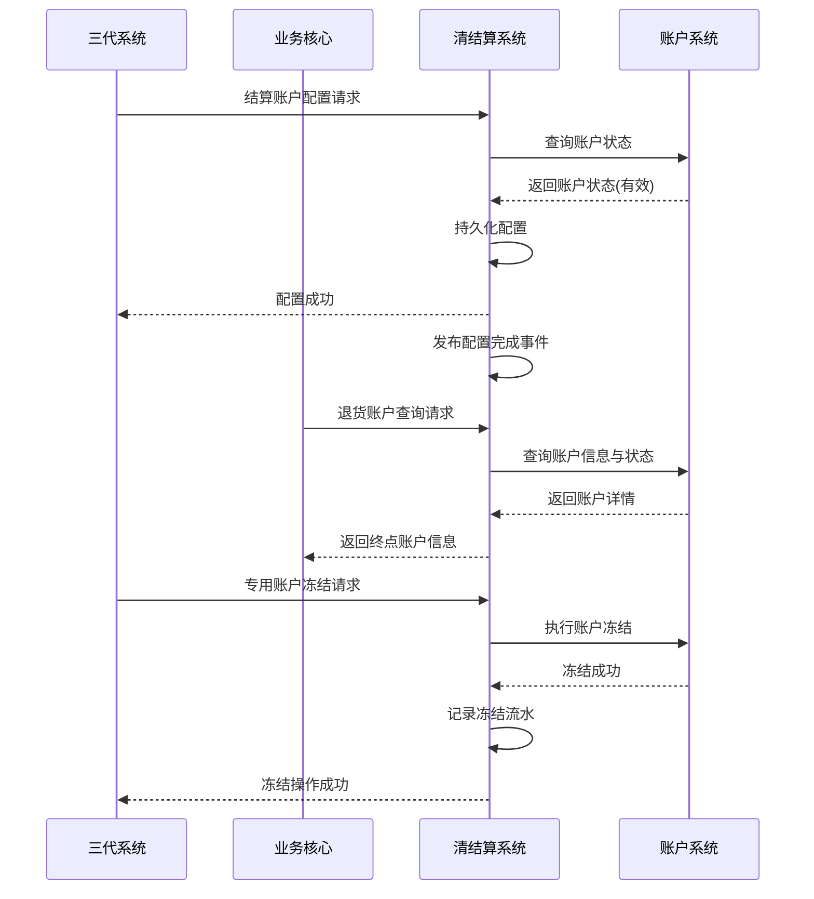

# 模块设计: 清结算系统

生成时间: 2026-01-21 17:33:32
批判迭代: 2

---

# 清结算系统模块设计文档

## 1. 概述
- **目的与范围**: 本模块是天财分账业务中资金清算与结算处理的底层支撑系统，负责处理与账户状态和资金结算相关的核心操作。其核心职责包括：接收并处理来自三代系统的结算账户配置请求；在退货前置环节，为业务核心提供终点账户查询服务；执行对天财专用账户的冻结与解冻指令。本模块不负责分账交易处理（由行业钱包系统负责）或账单生成（由对账单系统负责），而是专注于结算规则的执行与账户状态的管控。

## 2. 接口设计
- **API端点 (REST)**:
    - `POST /api/v1/settlement/config`: 接收结算账户配置。
    - `GET /api/v1/settlement/account/query`: 查询退货终点账户信息。
    - `POST /api/v1/account/freeze`: 执行专用账户冻结操作。
    - `POST /api/v1/account/unfreeze`: 执行专用账户解冻操作。
- **请求/响应结构**:
    - 结算账户配置请求: `{"merchant_id": "string", "settlement_account_no": "string", "settlement_mode": "ACTIVE/PASSIVE"}`。响应: `{"code": "string", "msg": "string", "data": {"config_id": "string"}}`。
    - 退货账户查询请求: `{"original_order_no": "string"}`。响应: `{"code": "string", "msg": "string", "data": {"account_no": "string", "account_name": "string"}}`。
    - 账户冻结/解冻请求: `{"account_no": "string", "operation_id": "string", "reason": "string"}`。响应: `{"code": "string", "msg": "string", "data": {"freeze_id": "string"}}`。
- **发布/消费的事件**:
    - 消费: `AccountStatusChangedEvent` (来自账户系统，通知账户冻结/解冻状态变化)。
    - 发布: `SettlementConfigCompletedEvent` (结算账户配置完成后发布)。

## 3. 数据模型
- **表/集合**:
    - `settlement_account_config`: 结算账户配置表。
    - `account_freeze_record`: 账户冻结记录表。
- **关键字段**:
    - `settlement_account_config`:
        - `id` (主键), `merchant_id` (商户ID), `account_system_account_id` (账户系统账户ID), `settlement_mode` (结算模式), `status` (配置状态), `created_at`, `updated_at`。
    - `account_freeze_record`:
        - `id` (主键), `account_no` (账户号), `freeze_type` (冻结类型), `status` (冻结状态), `operation_id` (操作流水号), `reason` (原因), `created_at`, `thawed_at`。
- **与其他模块的关系**:
    - 与账户系统交互：通过`account_system_account_id`关联，依赖其提供的天财专用账户状态与基础信息。
    - 与对账单系统交互：通过结算账户配置与冻结记录，为账单生成提供结算规则与账户状态数据。

## 4. 业务逻辑
- **核心工作流/算法**:
    1.  **结算账户配置**: 接收三代系统请求，向账户系统验证目标账户状态为有效且已标记为天财专用账户。验证通过后，持久化配置并发布完成事件。
    2.  **退货账户查询**: 接收业务核心的查询请求，根据原订单号查询关联的终点账户（天财接收方账户），并返回其有效账户信息。
    3.  **专用账户冻结/解冻**: 接收指令，调用账户系统接口执行账户状态变更。成功后，本地记录冻结流水。
- **业务规则与验证**:
    - 结算账户配置时，本系统需调用账户系统接口验证账户状态。若账户状态无效（如不存在、未标记为天财专用账户、已冻结），则拒绝配置。
    - 退货账户查询时，需确保返回的账户处于可用状态（非冻结、非注销）。
    - 账户冻结操作需保证幂等性，相同的`operation_id`不重复执行。
- **关键边界情况处理**:
    - 账户系统调用超时或失败：配置、查询、冻结操作均进入重试队列，并向上游返回"处理中"状态。达到最大重试次数后标记为失败。
    - 数据不一致：定期与账户系统对账，同步账户状态。发现本地配置的账户在账户系统中已失效时，禁用本地配置并发出告警。
    - 并发冻结：通过数据库唯一索引（`account_no` + `operation_id`）或分布式锁保证同一账户的冻结操作串行化。

## 5. 时序图

## 6. 错误处理
- **预期错误情况**:
    - 账户不存在、账户状态异常（如已冻结/注销）、配置信息冲突。
    - 依赖系统（账户系统）服务超时、不可用、返回数据格式异常。
    - 并发操作冲突（如同时发起冻结与解冻）。
- **处理策略**:
    - 业务错误（如账户无效）：返回明确的错误码与信息（如 `ACCOUNT_INVALID`），终止当前流程。
    - 系统级错误（如网络超时）：进行有限次数的指数退避重试。对于配置、冻结等写操作，在重试失败后标记任务失败，并通知运营人员介入。对于查询操作，可返回缓存的上一次有效结果（若存在），否则返回服务暂时不可用。
    - 并发冲突：通过数据库锁或乐观锁机制，确保数据一致性，并向后发起操作的请求返回"操作冲突，请稍后重试"错误。

## 7. 依赖关系
- **上游模块**:
    - 账户系统：强依赖。获取账户状态、执行冻结/解冻、验证账户有效性。
    - 三代系统：强依赖。接收结算账户配置、账户冻结/解冻指令。
    - 业务核心：强依赖。接收退货账户查询请求。
- **下游模块**:
    - 对账单系统：提供结算账户配置与账户冻结记录数据，用于账单生成。
- **内部依赖**: TBD (如消息队列、数据库)。