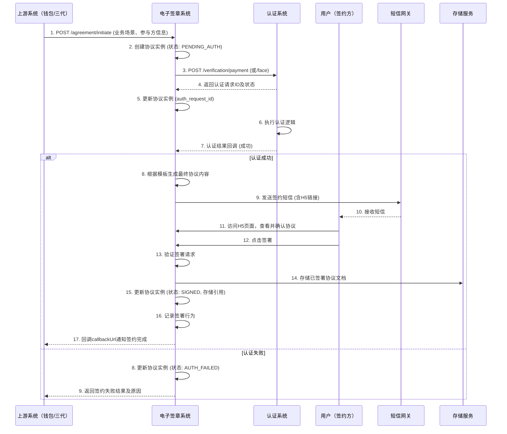

# 模块设计: 电子签章系统

生成时间: 2026-01-21 17:35:13
批判迭代: 2

---

# 电子签章系统 模块设计文档

## 1. 概述
- **目的与范围**：本模块为天财分账业务中的关系绑定、开通付款等流程提供电子协议签署与认证发起能力。核心职责是配置协议与短信模板，调用认证系统完成身份验证，生成并管理电子协议，以及通过H5页面和短信引导用户完成签约。其边界是处理协议生命周期与认证流程的衔接，不直接处理账户、分账交易或资金结算。

## 2. 接口设计
- **API端点 (REST)**：
    - `POST /api/v1/agreement/initiate`：接收上游系统发起的签约请求，启动签约流程。
    - `GET /api/v1/agreement/{agreementId}`：根据协议ID查询协议详情及签署状态。
    - `POST /api/v1/agreement/callback/sign`：接收H5页面签署完成后的回调。
    - `GET /api/v1/template/agreement/{templateId}`：查询协议模板详情。
    - `POST /api/v1/template/agreement`：创建或更新协议模板。
- **请求/响应结构**：
    - 发起签约请求 (`POST /api/v1/agreement/initiate`)：
        - 请求体：`{ "businessScenario": "关系绑定"|"开通付款", "initiator": "总部"|"门店", "participantInfo": { … }, "callbackUrl": "TBD" }`
        - 响应体：`{ "agreementId": "string", "requestId": "string", "status": "PENDING_AUTH" }`
    - 查询协议详情 (`GET /api/v1/agreement/{agreementId}`)：
        - 响应体：`{ "agreementId": "string", "status": "SIGNED"|"EXPIRED"|"AUTH_FAILED", "partiesInfo": { … }, "signedDocumentRef": "TBD", "createTime": "timestamp" }`
- **发布/消费的事件**：TBD

## 3. 数据模型
- **表/集合**：
    - `agreement_template`：存储可配置的电子协议模板。
    - `sms_template`：存储与协议模板配套的短信通知模板。
    - `agreement_instance`：存储每次签约流程生成的协议实例。
    - `signing_record`：存储用户签署行为记录。
- **关键字段**：
    - `agreement_template`：`template_id`（主键），`business_scenario`，`template_content`，`variables_schema`，`version`，`is_active`。
    - `sms_template`：`sms_template_id`（主键），`agreement_template_id`（外键），`scenario`，`content`，`variables`。
    - `agreement_instance`：`agreement_id`（主键），`template_id`（外键），`business_scenario`，`status`，`participant_info`，`auth_request_id`，`signed_document_ref`，`expiry_time`，`create_time`。
    - `signing_record`：`record_id`（主键），`agreement_id`（外键），`signing_party`，`sign_time`，`user_agent`，`ip_address`。
- **与其他模块的关系**：本模块调用认证系统进行打款验证和人脸验证，`agreement_instance`表中的`auth_request_id`关联认证系统的`authentication_request`表。协议中涉及的账户信息关联到行业钱包系统或三代系统的账户数据。

## 4. 业务逻辑
- **核心工作流/算法**：
    1.  **协议模板配置与管理**：支持创建、更新、查询协议模板和短信模板。模板内容支持变量插值（如`{{accountNo}}`），在生成实例前根据`variables_schema`进行语法和变量校验。模板具有版本管理和启用/停用状态。
    2.  **发起签约与认证**：接收上游请求后，根据业务场景和参与方角色确定认证方式（打款验证/人脸验证）。调用认证系统对应接口（`POST /api/v1/verification/payment` 或 `POST /api/v1/verification/face`），并记录返回的`request_id`。将协议实例状态置为`PENDING_AUTH`。
    3.  **协议生成与变量替换**：在收到认证系统成功回调或轮询认证成功后，根据`template_id`获取模板，使用从上游请求和认证结果中获取的实际数据（如账户号、商户名）替换模板变量，生成最终协议内容。
    4.  **通知与签署引导**：根据协议实例ID和`business_scenario`选择对应短信模板，替换变量后通过短信网关发送含H5签约链接的短信。H5页面展示协议内容并提供签署确认功能。
    5.  **签署完成与存储**：用户签署后，通过回调接口`POST /api/v1/agreement/callback/sign`通知系统。系统验证签署有效性，更新协议实例状态为`SIGNED`，并将签署后的协议文档存储（存储服务TBD），记录`signing_record`。最后，通过`callbackUrl`通知上游系统。
    6.  **协议生命周期管理**：为每个协议实例设置`expiry_time`。定时任务扫描超时未签署的实例，将其状态更新为`EXPIRED`，并可能触发提醒（TBD）。支持对已签署协议的查询与归档。
- **业务规则与验证**：
    - 根据业务场景（关系绑定、开通付款）和参与方角色（总部、门店）确定所需的认证方式。
    - 确保协议签署必须在对应的身份认证（打款验证/人脸验证）成功之后进行。
    - 协议内容需与行业钱包系统中的账户绑定关系、分账授权等信息保持一致。在生成协议前，通过调用上游系统接口（TBD）或验证请求数据来确保一致性。
    - 协议模板启用前必须通过语法和变量校验。
- **关键边界情况处理**：
    - **认证失败**：接收认证系统返回的失败结果，更新协议实例状态为`AUTH_FAILED`，阻止协议生成与签署流程，向发起方返回明确的失败原因。
    - **用户未完成签署**：设置协议有效期（`expiry_time`），超时后流程作废，状态更新为`EXPIRED`，需重新发起。
    - **模板配置错误**：在协议生成前进行模板语法和变量校验，防止生成无效协议。若校验失败，记录错误日志，协议状态置为`FAILED`。
    - **认证系统调用异常**：对认证系统接口调用实施重试机制（如最多3次），并设置超时。若最终失败，协议状态置为`SYSTEM_ERROR`，并向上游返回系统错误。

## 5. 时序图

## 6. 错误处理
- **预期错误情况**：
    - `E4001`：请求参数无效或缺失（如缺少businessScenario）。
    - `E4002`：协议模板不存在或未启用。
    - `E4003`：模板变量校验失败。
    - `E4004`：认证失败（来自认证系统的明确失败）。
    - `E4005`：协议已过期或状态不允许签署。
    - `E5001`：认证系统调用失败或超时。
    - `E5002`：短信发送失败。
    - `E5003`：文档存储失败。
    - `E5004`：数据库操作异常。
- **处理策略**：
    - 对于客户端输入错误（`E4001`-`E4005`），记录日志，向调用方返回具体的错误码和描述，不进行重试。
    - 对于外部依赖或系统内部错误（`E5001`-`E5004`），记录详细错误日志（包括上下文信息），并进行告警。对于可重试错误（如`E5001`网络超时、`E5002`短信发送临时失败），实施有限次数的重试（如3次）。重试失败后，将协议实例状态标记为`SYSTEM_ERROR`，并通知运维。
    - 所有错误处理需保证数据状态的一致性（如更新协议实例状态）。

## 7. 依赖关系
- **上游模块**：行业钱包系统、三代系统（通过`POST /api/v1/agreement/initiate`发起签约请求，提供账户及业务信息）。
- **下游模块**：认证系统（调用其`POST /api/v1/verification/payment`和`POST /api/v1/verification/face`接口进行身份验证）。
- **外部服务**：短信网关（发送通知）、外部存储服务（存储签署后的协议文档，具体服务TBD）。