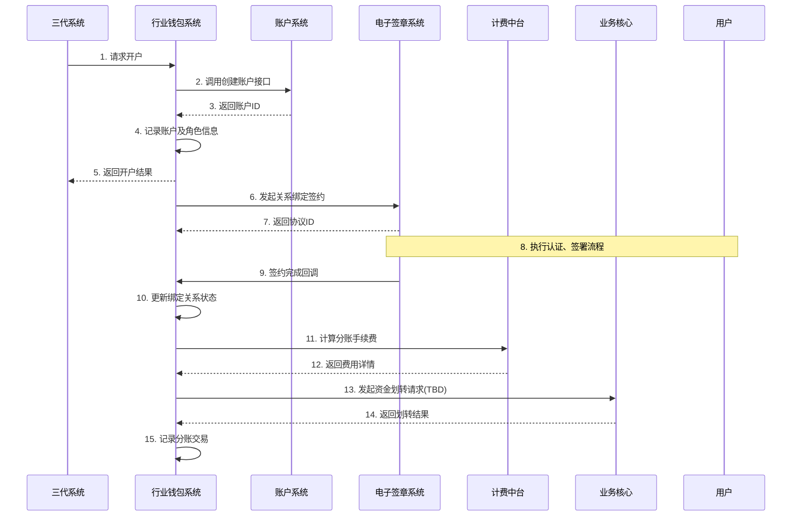

# 模块设计: 行业钱包系统

生成时间: 2026-01-21 17:35:37
批判迭代: 1

---

# 行业钱包系统 模块设计文档

## 1. 概述
- **目的与范围**：行业钱包系统是天财分账业务的核心处理系统，负责天财专用账户的开户校验、角色管理、分账关系绑定校验、分账请求处理及数据同步。其边界在于处理与天财专用账户相关的业务逻辑和状态流转，不涉及底层账户的创建（由账户系统负责）和电子协议的签署（由电子签章系统负责）。

## 2. 接口设计
- **API端点 (REST/GraphQL)**:
    - `POST /api/v1/account/open`: 接收三代系统的开户请求，进行校验并调用账户系统。
    - `POST /api/v1/relationship/bind`: 发起关系绑定流程，调用电子签章系统。
    - `POST /api/v1/transfer`: 处理分账请求（归集、批量付款、会员结算）。
    - `GET /api/v1/account/{accountId}/status`: 查询账户状态及绑定关系。
- **请求/响应结构**:
    - 开户请求：包含机构号、商户信息、账户类型等。
    - 关系绑定请求：包含业务场景（关系绑定/开通付款）、发起方、参与方信息等。
    - 分账请求：包含业务场景、付方账户、收方账户、金额、分账手续费承担方等。
    - 通用响应：包含操作结果、业务数据或错误信息。
- **发布/消费的事件**:
    - 发布事件：`AccountOpened`（账户开通完成）、`RelationshipBound`（关系绑定完成）、`TransferInitiated`（分账发起）。
    - 消费事件：TBD。

## 3. 数据模型
- **表/集合**:
    - `tiancai_accounts`: 天财专用账户信息表。
    - `account_roles`: 账户角色关联表（总部、门店）。
    - `relationship_bindings`: 分账关系绑定表。
    - `transfer_records`: 分账交易记录表。
- **关键字段**:
    - `tiancai_accounts`表：账户ID（关联账户系统）、商户ID、机构号、账户状态（正常/冻结）、开户时间、更新时间。
    - `account_roles`表：账户ID、角色类型（总部/门店）、关联商户信息、生效时间。
    - `relationship_bindings`表：绑定ID、付方账户ID、收方账户ID、业务场景（归集/会员结算）、绑定状态（已签约/已认证/生效）、协议ID（关联电子签章系统）、生效时间、过期时间。
    - `transfer_records`表：交易ID、业务场景、付方账户ID、收方账户ID、金额、手续费、手续费承担方、交易状态、请求时间、完成时间。
- **与其他模块的关系**：`tiancai_accounts.account_id` 关联账户系统的 `accounts` 表。`relationship_bindings.agreement_id` 关联电子签章系统的 `agreement_instance` 表。分账记录关联计费中台的计费日志。

## 4. 业务逻辑
- **核心工作流/算法**:
    1.  **天财专用账户开户流程**:
        - 接收三代系统的开户请求，校验机构号及商户信息。
        - 调用账户系统 `POST /api/v1/accounts` 接口创建底层账户并标记为"天财分账"。
        - 在本地 `tiancai_accounts` 和 `account_roles` 表中创建记录，初始化状态。
        - 将账户信息同步至清结算系统用于结算配置。
    2.  **关系绑定流程**:
        - 接收绑定请求（如总部发起归集关系绑定）。
        - 校验付方与收方账户是否存在、角色是否匹配（如付方需为门店，收方需为总部）。
        - 调用电子签章系统 `POST /api/v1/agreement/initiate` 接口，发起签约与认证流程。
        - 接收电子签章系统的签约完成回调，更新 `relationship_bindings` 表状态为"生效"。
    3.  **分账处理流程（归集/批量付款/会员结算）**:
        - 接收分账请求，校验业务场景、付方账户状态、收方账户状态。
        - 根据场景校验关系绑定是否生效（如归集需校验门店到总部的绑定关系）。
        - 调用计费中台 `POST /api/v1/fee/calculate` 接口计算手续费。
        - 组装资金划转指令（调用业务核心或清结算系统，TBD），并扣减/增加相应账户余额（资金操作TBD）。
        - 记录分账交易记录，更新相关状态。
    4.  **账户与关系状态同步流程**:
        - 监听账户系统发布的 `AccountStatusChanged`（如冻结）事件，同步更新本地 `tiancai_accounts` 表状态。
        - 账户状态变更时，需联动冻结或失效相关的绑定关系。
- **业务规则与验证**:
    - 开户时需严格校验三代系统传递的机构号。
    - 关系绑定需确保付方与收方角色符合业务场景定义（如归集：付方门店，收方总部）。
    - 分账前必须校验对应的关系绑定协议已签署生效。
    - 分账手续费承担方（付方/收方）由上游请求传入，并传递给计费中台。
- **关键边界情况处理**:
    - **重复开户**：通过三代请求的幂等键或商户信息唯一性校验防止重复。
    - **绑定关系冲突**：同一对付方收方在同一业务场景下只允许存在一条生效绑定。
    - **分账时账户余额不足**：交易失败，返回明确错误。
    - **下游系统（账户、电子签章、计费）调用失败**：进行有限次重试，重试失败则流程中止，状态置为失败。

## 5. 时序图

## 6. 错误处理
- **预期错误情况**:
    - 客户端错误：无效的机构号、账户不存在、角色不匹配、绑定关系未生效、余额不足、重复请求。
    - 服务端错误：账户系统调用失败、电子签章系统调用失败、计费中台调用失败、数据库异常。
- **处理策略**:
    - 对客户端错误返回明确的4xx错误码与信息（如`BINDING_NOT_ACTIVE`）。
    - 对下游系统调用失败，进行有限次数（如3次）的重试，重试失败后更新业务状态为失败，并记录告警日志。
    - 涉及资金的操作需保证事务性或最终一致性，通过补偿机制处理部分失败场景（TBD）。
    - 系统内部错误记录详细日志并返回5xx错误，触发监控告警。

## 7. 依赖关系
- **上游模块**: 三代系统（发起开户、提供机构号）、业务核心（接收分账交易，TBD）。
- **下游模块**: 账户系统（创建和标记底层账户）、电子签章系统（处理关系绑定签约）、计费中台（计算分账手续费）、清结算系统（同步账户信息）。