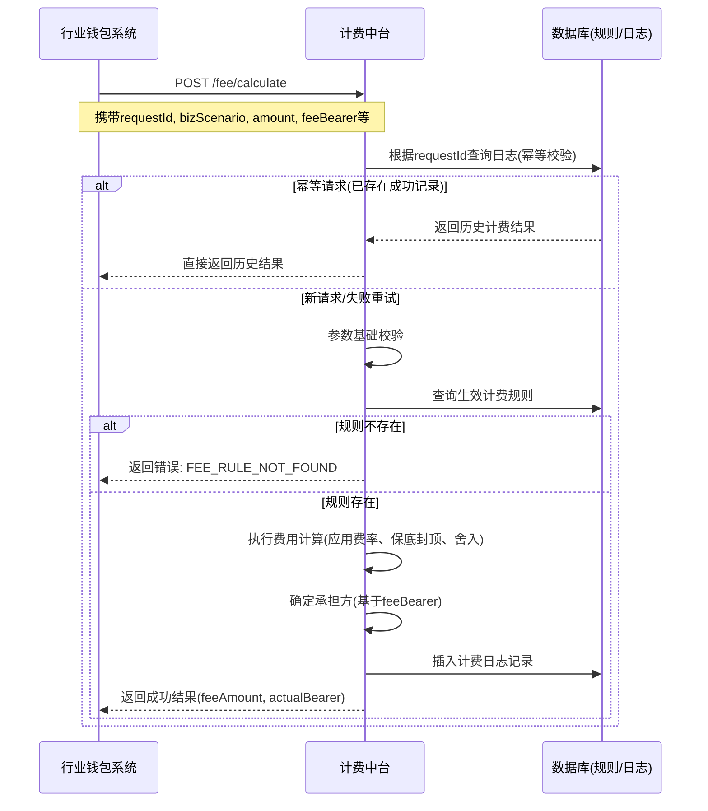

# 模块设计: 计费中台

生成时间: 2026-01-21 17:33:39
批判迭代: 2

---

# 计费中台 模块设计文档

## 1. 概述
- **目的与范围**: 本模块是为系统内其他业务模块（如行业钱包系统）提供统一、准确的转账手续费计算能力的核心服务。其边界明确为处理与"天财分账"业务相关的转账费用计算，具体包括"归集"、"批量付款"、"会员结算"等场景。本模块不处理资金流转、账户操作或其他非计费业务逻辑。

## 2. 接口设计
- **API端点 (REST/GraphQL)**: 提供 RESTful API。
    - `POST /api/v1/fee/calculate`: 计算单笔转账手续费。
- **请求/响应结构**:
    - **请求体 (CalculateFeeRequest)**:
        - `bizScenario` (String): 业务场景，枚举值：`COLLECTION`(归集), `BATCH_PAYMENT`(批量付款), `MEMBER_SETTLEMENT`(会员结算)。
        - `amount` (BigDecimal): 转账金额。
        - `payerId` (String): 付方账户标识。
        - `payeeId` (String): 收方账户标识。
        - `feeBearer` (String): 手续费承担方，枚举值：`PAYER`(付方承担), `PAYEE`(收方承担)。由上游调用方（如行业钱包系统）根据天财接口传入的"分账手续费承担方"传递。
        - `requestId` (String): 请求唯一标识，用于幂等性控制。
    - **响应体 (CalculateFeeResponse)**:
        - `success` (Boolean): 请求是否成功。
        - `data` (FeeDetail): 成功时返回的计费详情。
            - `feeAmount` (BigDecimal): 计算出的手续费金额。
            - `actualBearer` (String): 实际承担方 (`PAYER` 或 `PAYEE`)。
            - `calculationId` (String): 本次计费唯一记录ID。
        - `error` (ErrorInfo): 失败时返回的错误信息。
            - `code` (String): 错误码。
            - `message` (String): 错误描述。
- **发布/消费的事件**: TBD。

## 3. 数据模型
- **表/集合**:
    - `fee_rule` (计费规则表): 存储不同业务场景下的计费规则。
    - `fee_calculation_log` (计费记录表): 记录每次手续费计算请求与结果，用于对账、审计和幂等。
- **关键字段**:
    - `fee_rule` 表:
        - `id` (主键)
        - `biz_scenario` (业务场景)
        - `rule_expression` (规则表达式，如：费率百分比、固定金额、阶梯费率等)
        - `min_fee` (最低手续费)
        - `max_fee` (最高手续费)
        - `rounding_rule` (舍入规则)
        - `effective_start` (生效开始时间)
        - `effective_end` (生效结束时间)
    - `fee_calculation_log` 表:
        - `calculation_id` (主键，与响应中的`calculationId`对应)
        - `request_id` (请求ID，用于幂等)
        - `biz_scenario`
        - `amount`
        - `payer_id`
        - `payee_id`
        - `fee_bearer`
        - `calculated_fee`
        - `actual_bearer`
        - `rule_applied` (所使用的规则ID或快照)
        - `status` (状态: SUCCESS, FAILED)
        - `error_code`
        - `created_at`
- **与其他模块的关系**: 本模块的数据独立管理，为行业钱包系统等调用方提供计费服务。计费规则由运营后台配置并写入`fee_rule`表。

## 4. 业务逻辑
- **核心工作流/算法**:
    1. **接收请求**: 通过`/api/v1/fee/calculate`接口接收计费请求。
    2. **幂等校验**: 根据`requestId`查询`fee_calculation_log`表。若存在成功记录，则直接返回历史结果；若存在失败记录，允许重新计算。
    3. **参数校验**: 校验请求参数完整性、金额有效性、业务场景和承担方枚举值合法性。
    4. **规则匹配**: 根据`bizScenario`、当前时间等条件，从`fee_rule`表中查询唯一生效的计费规则。
    5. **费用计算**: 根据匹配到的规则表达式（如：`amount * rate`）计算原始手续费。
    6. **边界处理**:
        - **保底/封顶**: 应用`min_fee`和`max_fee`规则。
        - **舍入**: 根据`rounding_rule`（如：四舍五入到分）进行金额舍入。
    7. **承担方确定**: 根据请求中的`feeBearer`字段，确定最终手续费由付方(`PAYER`)还是收方(`PAYEE`)承担。此逻辑直接影响上游调用方后续的资金划扣/入账逻辑。
    8. **记录日志**: 将完整的请求、计算结果、应用规则及状态记录到`fee_calculation_log`表。
    9. **返回结果**: 组装`CalculateFeeResponse`并返回。
- **业务规则与验证**: 核心是根据"分账手续费承担方"的配置，计算并确定最终的费用金额和承担方。规则本身支持基于场景、时间的动态配置。
- **关键边界情况处理**:
    - **规则缺失**: 若无匹配的生效规则，计费失败，返回明确错误。
    - **金额为零或负值**: 校验失败，返回参数错误。
    - **并发请求**: 通过`requestId`实现幂等，防止重复计费。
    - **计算精度**: 使用`BigDecimal`进行精确计算，避免浮点误差。
    - **规则切换**: 依赖规则的生效时间，确保在切换时间点前后请求计算的一致性。

## 5. 时序图

## 6. 错误处理
- **预期错误情况与处理策略**:
    - `INVALID_PARAMETER`: 请求参数缺失、格式错误或金额无效。处理：返回400状态码及具体错误信息。
    - `FEE_RULE_NOT_FOUND`: 未找到当前业务场景下生效的计费规则。处理：返回404状态码，提示规则未配置。
    - `CALCULATION_ERROR`: 费用计算过程中发生异常（如规则表达式执行错误）。处理：返回500状态码，记录详细日志。
    - `DUPLICATE_REQUEST_ID`: 请求ID冲突（极少数情况）。处理：返回409状态码，提示请求重复。
    - `DOWNSTREAM_UNAVAILABLE`: 依赖的数据库异常。处理：返回503状态码，具备重试机制的调用方可稍后重试。
- **重试与降级**: 对于因网络或下游短暂故障导致的失败，调用方（行业钱包系统）可基于`requestId`进行有限次重试。本模块自身无降级计费策略，规则缺失则计费失败。

## 7. 依赖关系
- **上游模块**: **行业钱包系统**。在处理分账请求时，调用本模块计算手续费。
- **下游模块/依赖**:
    - **数据库**: 持久化存储计费规则(`fee_rule`)和计费日志(`fee_calculation_log`)。
    - **规则配置后台** (隐含): 提供配置界面，管理`fee_rule`表数据，本模块不直接依赖其接口，但依赖其配置结果。
- **其他关系**: 本模块为纯计算服务，不主动调用其他业务系统。