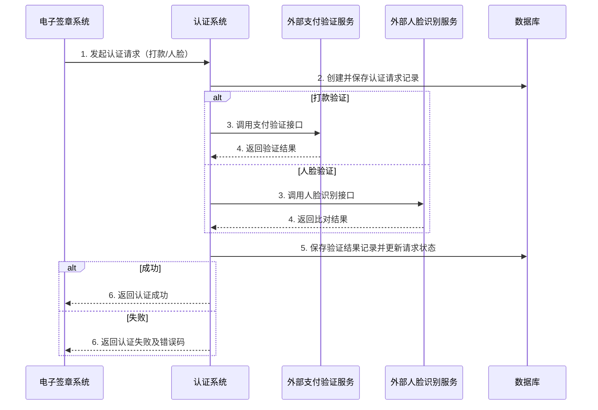

# 模块设计: 认证系统

生成时间: 2026-01-21 17:33:19
批判迭代: 2

---

# 认证系统 模块设计文档

## 1. 概述
- **目的与范围**：本模块为天财分账业务中的关系绑定、开通付款等流程提供身份与授权认证能力。核心职责是处理由电子签章系统发起的打款验证和人脸验证，并返回认证结果。其边界是提供认证服务，不涉及协议签署、账户管理或分账交易处理。

## 2. 接口设计
- **API端点 (REST)**：
    - `POST /api/v1/verification/payment`：发起打款验证。
    - `POST /api/v1/verification/face`：发起人脸验证。
    - `GET /api/v1/verification/records/{requestId}`：查询认证记录状态。
- **请求/响应结构**：
    - 打款验证请求：包含接收方账户信息、订单号、待验证的金额与备注。
    - 人脸验证请求：包含姓名、身份证号、人脸图像或特征数据。
    - 通用响应：包含请求ID、认证状态（成功/失败/处理中）、时间戳、错误码（若失败）。
- **发布/消费的事件**：TBD。

## 3. 数据模型
- **表/集合**：
    - `authentication_request`：认证请求主表。
    - `verification_record`：验证过程与结果明细表。
- **关键字段**：
    - `authentication_request`：`request_id`（主键），`request_type`（打款/人脸），`applicant_info`，`status`，`create_time`，`update_time`。
    - `verification_record`：`record_id`（主键），`request_id`（外键），`verification_step`，`external_service_response`，`result`，`error_detail`。
- **与其他模块的关系**：本模块被电子签章系统调用。`authentication_request`表中的`applicant_info`可能关联到行业钱包系统或三代系统的账户信息。

## 4. 业务逻辑
- **核心工作流/算法**：
    1.  **接收请求**：电子签章系统调用认证接口。
    2.  **请求持久化与校验**：创建`authentication_request`记录，校验请求参数有效性。
    3.  **分类型执行认证**：
        - **打款验证**：调用外部支付网关或银行通道接口，验证用户回填的金额和备注是否与系统发出的随机打款信息一致。验证结果写入`verification_record`。
        - **人脸验证**：调用外部人脸识别服务API，比对请求中的姓名、身份证号和人脸信息。验证结果写入`verification_record`。
    4.  **更新状态与响应**：根据验证结果更新主请求状态，并将结果同步返回给电子签章系统。
- **业务规则与验证**：
    - 校验接收方身份（个人或个体）信息的真实性与一致性。
    - 打款验证需确保金额和备注在有效期内且未被重复验证。
    - 人脸验证需确保生物特征信息符合安全与合规标准。
- **关键边界情况处理**：
    - **外部服务调用失败**：实施指数退避重试机制（最多3次），若最终失败则标记认证为"系统异常"。
    - **信息不匹配**：记录具体不匹配的字段，返回明确的验证失败结果。
    - **请求超时**：设置异步处理机制，通过查询接口提供最终结果。

## 5. 时序图

## 6. 错误处理
- **预期错误情况**：
    - `4001`：请求参数无效（如身份证格式错误）。
    - `4002`：身份信息验证失败（打款金额不符或人脸比对不通过）。
    - `5001`：外部验证服务暂时不可用。
    - `5002`：数据库操作失败。
    - `5003`：系统内部处理超时。
- **处理策略**：
    - 对客户端错误（4xx）返回具体错误描述，不重试。
    - 对服务端及外部依赖错误（5xx）记录详细日志，并对可重试的异常（如网络超时）实施重试。
    - 所有失败操作均需在`verification_record`表中记录错误详情。

## 7. 依赖关系
- **上游模块**：电子签章系统（调用本模块进行认证）。
- **下游模块/外部服务**：
    - 外部支付验证服务（用于打款验证）。
    - 外部人脸识别服务（用于人脸验证）。
- **内部依赖**：数据库（用于持久化认证请求与记录）。