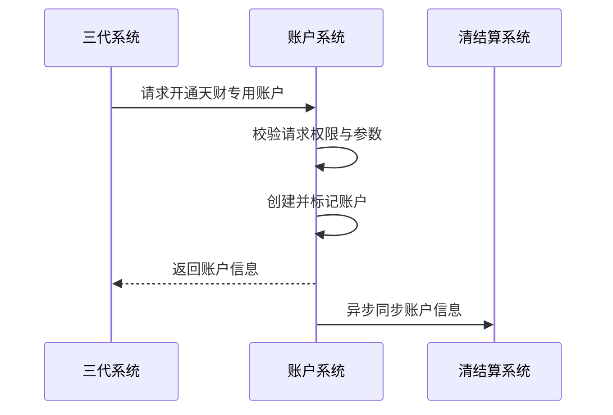
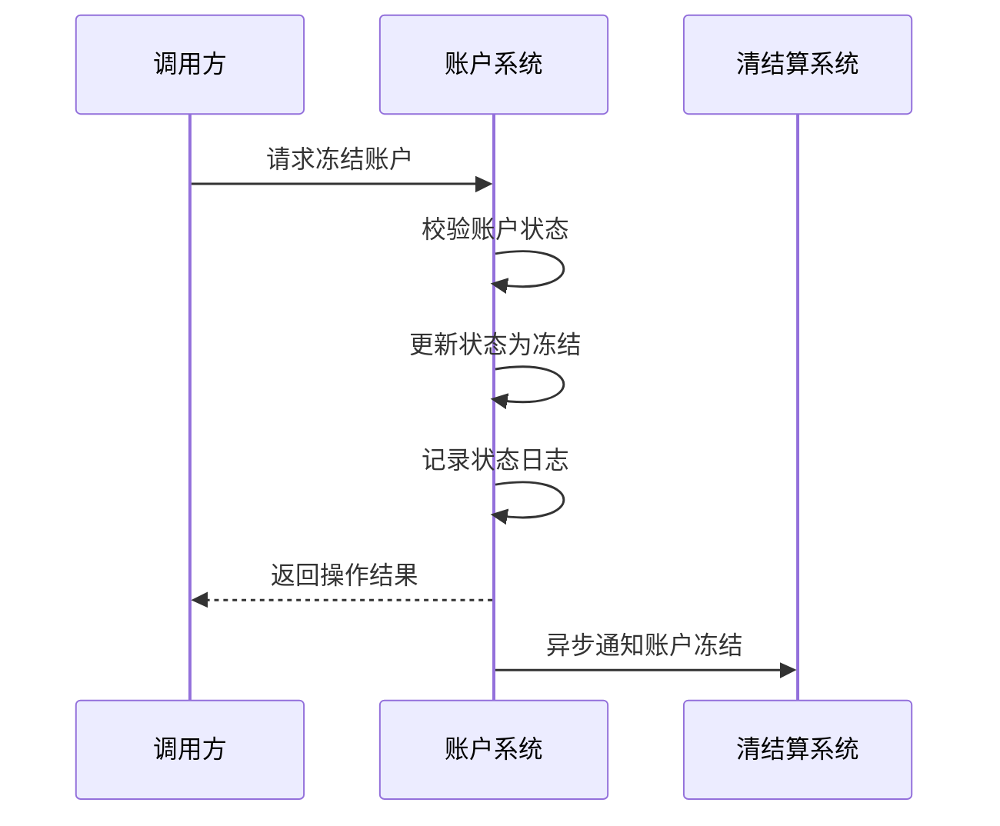
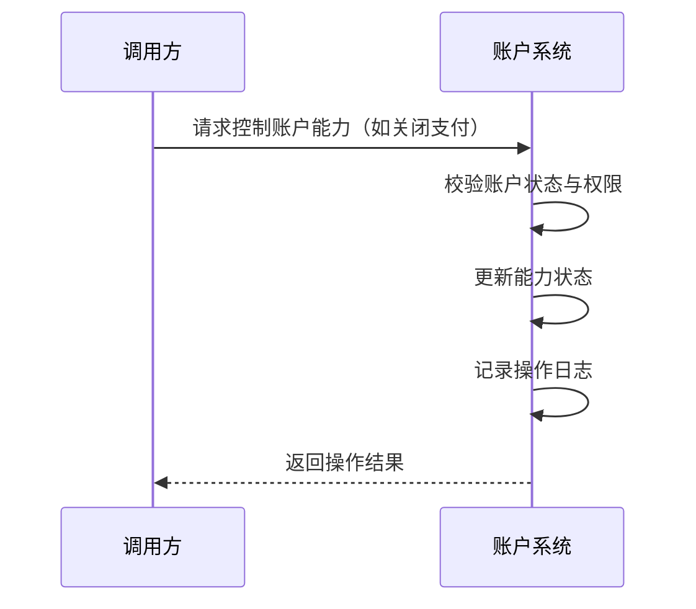
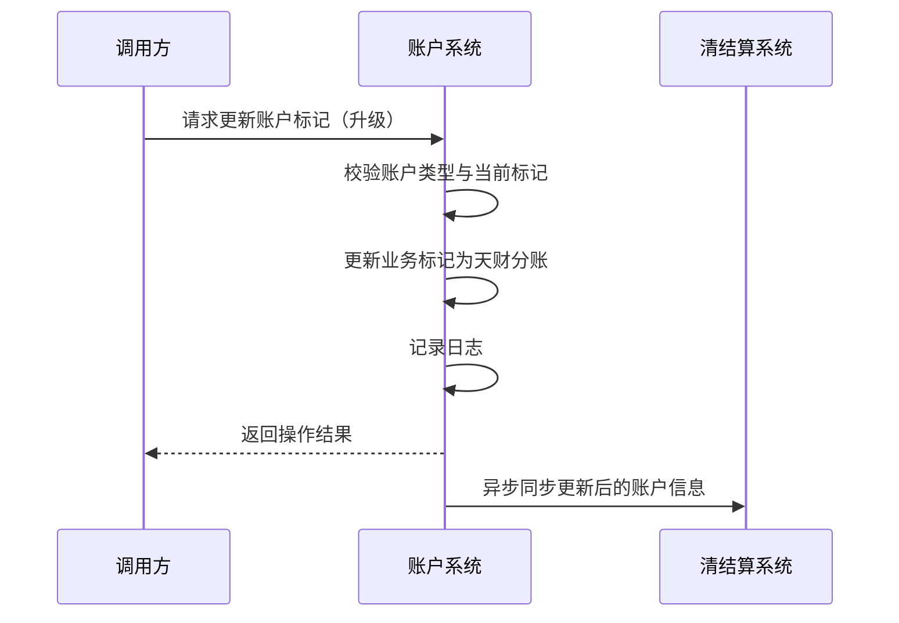

# 模块设计: 账户系统

生成时间: 2026-01-21 17:33:39
批判迭代: 2

---

# 账户系统模块设计文档

## 1. 概述
- **目的与范围**: 账户系统是底层核心系统，负责为天财分账业务开立并标记天财专用账户（行业钱包），控制账户的支付、收款、冻结等核心能力，并支持账户的升级操作。其边界在于账户的底层创建、状态管理和基础能力控制，不涉及具体的分账业务逻辑和关系绑定。

## 2. 接口设计
- **API端点 (REST/GraphQL)**:
    - `POST /api/v1/accounts`: 创建天财专用账户。
    - `PUT /api/v1/accounts/{accountId}/status`: 变更账户状态（如冻结、解冻）。
    - `PUT /api/v1/accounts/{accountId}/abilities`: 控制账户能力（如支付、收款开关）。
    - `GET /api/v1/accounts/{accountId}`: 查询账户详情。
- **请求/响应结构**:
    - 创建账户请求：包含请求方标识、商户信息、业务类型标记等。
    - 创建账户响应：包含账户ID、账户状态、基础能力列表。
    - 状态/能力变更请求：包含目标状态/能力、操作原因、幂等键。
    - 通用响应：包含操作结果、错误码、错误信息。
- **发布/消费的事件**:
    - 发布事件：`AccountCreated`（账户创建）、`AccountStatusChanged`（状态变更）、`AccountAbilityChanged`（能力变更）。
    - 消费事件：TBD。

## 3. 数据模型
- **表/集合**:
    - `accounts`: 账户主表。
    - `account_abilities`: 账户能力关联表。
    - `account_status_logs`: 账户状态变更日志表。
- **关键字段**:
    - `accounts`表：账户ID、商户ID、账户类型（行业钱包）、业务标记（天财分账）、账户状态（正常/冻结/注销）、创建时间、更新时间。
    - `account_abilities`表：账户ID、能力类型（支付、收款）、能力状态（开启/关闭）、生效时间。
    - `account_status_logs`表：日志ID、账户ID、原状态、新状态、变更原因、操作人、操作时间。
- **与其他模块的关系**: 账户系统为行业钱包系统提供底层账户实体。账户系统根据三代系统的指令开通账户。账户系统将账户信息同步至清结算系统用于结算配置。

## 4. 业务逻辑
- **核心工作流/算法**:
    1.  **账户创建流程**:
        - 接收来自三代系统的开户请求。
        - 校验请求方权限与参数合法性。
        - 生成唯一账户ID，在底层创建账户实体。
        - 为账户打上"天财分账"业务标记，并设置为"行业钱包"类型。
        - 初始化账户状态为"正常"，并开启基础能力（如收款）。
        - 记录日志，并异步将账户信息同步至清结算系统。
    2.  **账户状态管理流程**:
        - 接收状态变更请求（如冻结）。
        - 校验账户当前状态是否允许变更（如正常账户可被冻结）。
        - 执行状态更新，并记录状态变更日志。
        - 若变更为冻结状态，需异步通知清结算系统。
    3.  **账户能力控制流程**:
        - 接收能力控制请求（如关闭支付能力）。
        - 校验账户当前状态（如冻结账户无法变更能力）。
        - 更新`account_abilities`表中对应能力的状态。
        - 记录操作日志。
    4.  **账户标记更新流程**:
        - 接收将普通账户升级标记为"天财专用账户"的请求。
        - 校验目标账户类型与当前标记。
        - 更新账户的业务标记字段。
        - 记录日志并同步信息。
- **业务规则与验证**: 开户时需校验请求方（如三代系统）的权限。账户标记需确保唯一性和业务类型（天财分账）的准确性。账户能力变更需进行权限和状态校验。所有写操作需支持幂等性。
- **关键边界情况处理**: 处理重复开户请求（通过请求幂等键实现幂等）。处理对已冻结账户进行操作的情况（返回明确错误）。处理标记更新过程中的数据一致性问题（使用事务）。

## 5. 时序图

## 6. 错误处理
- **预期错误情况**:
    - 客户端错误：请求方无权限、请求参数不合法、账户不存在、账户状态冲突（如对冻结账户进行操作）、重复请求（幂等键冲突）。
    - 服务端错误：数据库连接失败、下游系统（清结算）调用超时或失败、内部服务异常。
- **处理策略**:
    - 对客户端错误返回明确的4xx错误码与信息（如`ACCOUNT_FROZEN`）。
    - 对下游系统调用失败，进行有限次数的重试，并记录告警日志。
    - 对所有写操作（创建、状态变更、能力控制）要求携带幂等键，防止重复处理。
    - 系统内部错误记录详细日志并返回5xx错误，同时触发监控告警。

## 7. 依赖关系
- **上游模块**: 三代系统（调用账户系统开通账户、更新账户标记）。
- **下游模块**: 行业钱包系统（依赖账户系统提供的账户实体）、清结算系统（接收账户信息用于结算配置，接收账户冻结通知）。