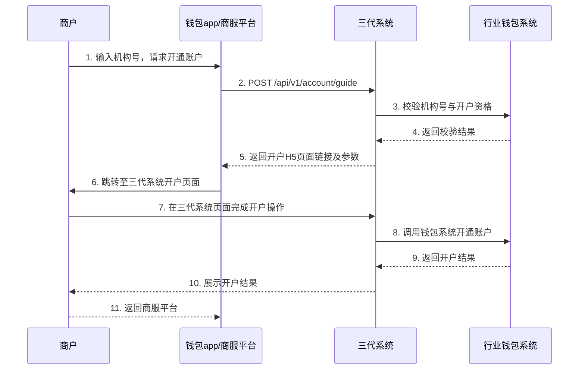
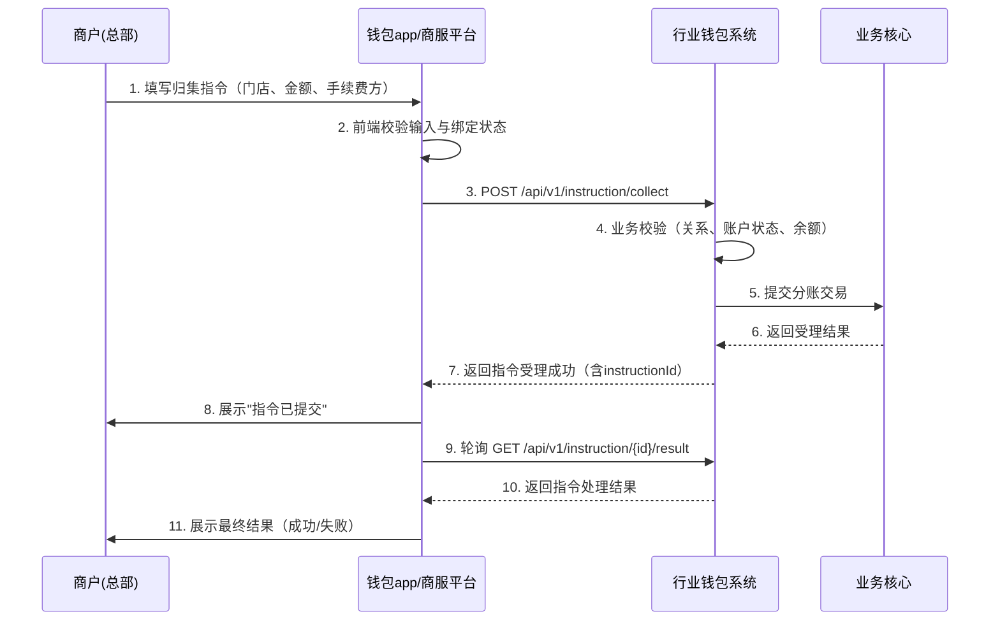
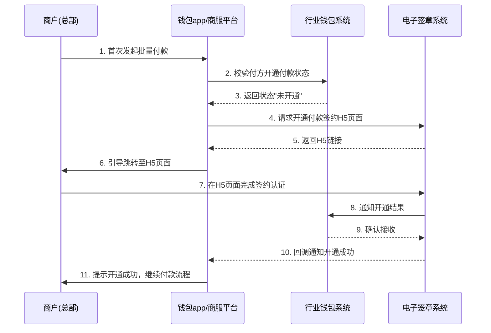

# 模块设计: 钱包app/商服平台

生成时间: 2026-01-21 17:34:22
批判迭代: 2

---

# 钱包app/商服平台 模块设计文档

## 1. 概述
- **目的与范围**：本模块是面向商户（总部、门店）的前端单页应用（SPA），提供天财分账业务的交互界面。核心职责是引导用户完成账户开通、关系绑定、发起分账指令、查询结果等操作流程。本模块不处理核心业务逻辑，仅负责用户交互、数据收集与展示、以及向后端服务发起请求。
- **架构角色**：本模块为纯前端应用，部署在Web服务器或应用商店。用户操作产生的业务数据（如指令参数）通过API提交至后端（行业钱包系统、三代系统），仅在前端本地暂存草稿或会话状态，不进行持久化存储。

## 2. 接口设计
- **API端点 (REST)**：
    - `POST /api/v1/account/guide`：获取账户开通引导信息（调用三代或钱包系统）。
    - `POST /api/v1/binding/initiate`：发起关系绑定请求。
    - `GET /api/v1/binding/status/{bindingId}`：查询关系绑定状态。
    - `POST /api/v1/instruction/collect`：发起归集指令。
    - `POST /api/v1/instruction/batch-payment`：发起批量付款指令。
    - `POST /api/v1/instruction/member-settlement`：发起会员结算指令。
    - `GET /api/v1/instruction/{instructionId}/result`：查询指令执行结果。
    - `GET /api/v1/bill/query`：查询账单（对接对账单系统）。
    - `POST /api/v1/payment/activate`：发起开通付款流程。
- **请求/响应结构**：
    - 请求体通用结构：`{"requestId": "string", "timestamp": "number", "data": {…}}`
    - 响应体通用结构：`{"code": "string", "message": "string", "data": {…}, "timestamp": "number"}`
    - 具体数据字段TBD。
- **发布/消费的事件**：
    - 消费事件：`binding_status_updated`（关系绑定状态变更）、`instruction_processed`（分账指令处理完成）。事件通过WebSocket或长轮询从行业钱包系统接收，用于更新前端状态。
    - 发布事件：本模块为前端，不发布业务事件。

## 3. 数据模型
- **前端状态/本地存储模型**：
    - `UserSession`：存储当前用户登录态、选择的商户角色（总部/门店）。
    - `DraftInstruction`：暂存用户未提交的分账指令草稿（如归集金额、手续费承担方）。
    - `LocalOperationLog`：记录关键前端操作（如页面访问、按钮点击），用于问题追踪。
- **关键字段**：
    - `DraftInstruction`: `id`, `type`(归集/批量付款/会员结算), `payerId`, `payeeId`, `amount`, `feeBearer`, `draftTime`
    - `UserSession`: `userId`, `merchantRole`, `token`, `lastActive`
- **与其他模块的关系**：本模块不直接操作后端数据库。所有业务状态（如绑定关系、账户状态）均通过API从行业钱包系统、三代系统实时查询获取。

## 4. 业务逻辑
- **核心工作流/算法**：
    1.  **账户开通引导**：
        - 输入：商户机构号。
        - 步骤：调用三代系统接口校验机构号并获取账户开通H5页面链接或参数。
        - 输出：引导用户跳转至三代系统页面完成账户开立。
    2.  **关系绑定流程（状态机）**：
        - 状态：`初始` -> `签约中` -> `认证中` -> `已认证` / `失败`。
        - 算法：
            a. 用户选择付方与收方。
            b. 调用行业钱包系统校验绑定资格。
            c. 获取电子签章系统H5链接，引导用户完成签约。
            d. 轮询或接收回调，更新绑定状态。
            e. 状态为"已认证"后方可进行分账操作。
    3.  **分账指令发起**：
        - 前置校验：付方与收方关系绑定状态为"已认证"；付方账户状态正常。
        - 参数组装：根据指令类型（归集、批量付款、会员结算）组装请求参数，包括分账手续费承担方。
        - 提交：调用行业钱包系统对应接口。
    4.  **开通付款流程**：
        - 触发条件：当总部首次发起批量付款或会员结算时检测。
        - 流程：引导付方（总部）跳转至电子签章系统完成额外的签约认证。
    5.  **结果查询与展示**：
        - 主动查询：根据指令ID轮询行业钱包系统获取结果。
        - 被动通知：监听`instruction_processed`事件，实时更新界面。
- **业务规则与验证**：
    - 关系绑定校验：付方与收方不能为同一商户；归集场景付方必须为门店，收方必须为总部；会员结算场景付方必须为总部，收方必须为门店。
    - 金额校验：输入金额必须大于0且符合精度要求（如两位小数）。
    - 会话管理：用户会话超时（如30分钟）后需重新登录。
- **并发与同步**：
    - 同一份数据（如绑定关系状态）避免在前端多个标签页或组件中产生不一致，通过全局状态管理（如Vuex/Pinia）集中管理。
    - 本地草稿定时自动保存，防止页面意外刷新丢失数据。

## 5. 时序图

### 5.1 账户开通引导时序图

### 5.2 分账指令发起时序图（以归集为例）

### 5.3 开通付款流程时序图

## 6. 错误处理
- **预期错误情况**：
    - 网络错误：连接超时、断开。
    - API业务错误：参数校验失败、余额不足、关系未绑定、账户冻结。
    - 用户输入错误：格式错误、必填项为空。
    - 认证/签约流程错误：人脸验证失败、打款验证不匹配、H5页面加载失败。
- **处理策略**：
    - 网络错误：显示"网络异常，请检查连接"提示，并提供重试按钮。对于提交类操作，本地暂存草稿。
    - API业务错误：解析后端返回的`code`和`message`，转换为用户友好的提示语（如"收款方账户状态异常，请联系客服"）。对于状态类错误（如未绑定），引导用户进入对应流程。
    - 输入错误：实施前端表单实时校验，错误字段高亮并显示提示。
    - 流程错误：记录失败步骤，允许用户从断点重试或选择其他认证方式。H5页面加载失败时提供备用链接或二维码。

## 7. 依赖关系
- **上游模块/服务**：
    - **行业钱包系统**：核心依赖。提供关系绑定、分账指令提交、状态查询所有核心接口。
    - **三代系统**：用于账户开通引导阶段的机构号校验和页面跳转。本模块与钱包系统的账户操作通过三代系统间接进行。
    - **电子签章系统**：提供关系绑定和开通付款流程所需的签约认证H5页面或接口。
    - **对账单系统**：提供账单查询数据。
- **下游模块**：无。本模块不对外提供接口。
- **前端技术依赖**：Web框架（如Vue.js）、状态管理库、HTTP客户端、WebSocket客户端。