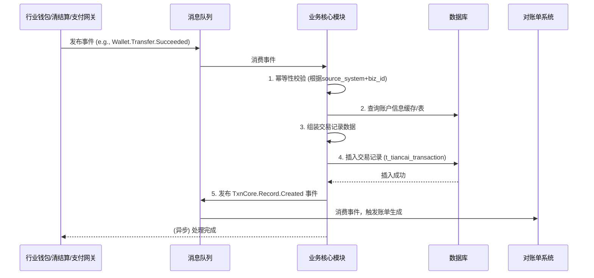

# 模块设计: 业务核心

生成时间: 2026-01-20 15:38:56
批判迭代: 1

---

# 业务核心模块设计文档

## 1. 概述

**业务核心模块**是记录和处理所有交易的核心系统，是天财分账业务中资金流转的“总账本”。它负责接收并持久化来自上游支付网关、清结算系统、行业钱包系统等模块的交易指令和结果，为下游对账单系统提供完整、准确的交易数据源。本模块不直接处理资金，而是忠实记录每一笔与天财业务相关的资金变动（如收单、分账、提现、退货），确保交易流水清晰可追溯。

**范围**：
- 记录天财商户的收单交易（包括主动结算和被动结算）。
- 记录天财分账交易（归集、批量付款、会员结算）。
- 记录天财账户的提现交易。
- 记录天财相关的退货/退款交易。
- 提供交易查询、对账、冲正等管理功能。
- 为对账单系统提供原始交易数据。

## 2. 接口设计

### 2.1 API 端点 (RESTful)

#### 2.1.1 交易记录接口
- **POST /api/v1/txn/record**： 接收并记录一笔交易。
    - **认证**： 内部服务间认证（API Key或Token）。
    - **请求体 (TransactionRecordReqDTO)**：
        ```json
        {
          "txnId": "TXN20240520123456789", // 全局唯一交易流水号
          "bizType": "COLLECTION | BATCH_PAY | MEMBER_SETTLE | ACQUIRING | WITHDRAW | REFUND",
          "bizSubType": "GATHER | SUPPLIER_PAY | ...", // 业务子类型
          "sourceSystem": "WALLET | CLEARING | PAYMENT_GATEWAY",
          "sourceBizId": "源系统业务ID",
          "payerAccountNo": "付款账户号",
          "payerAccountType": "TIANCAI_RECEIVE | TIANCAI_PAYEE | ...",
          "payerRole": "HEADQUARTERS | STORE",
          "payeeAccountNo": "收款账户号",
          "payeeAccountType": "TIANCAI_RECEIVE | TIANCAI_PAYEE | ...",
          "payeeRole": "HEADQUARTERS | STORE | EXTERNAL",
          "amount": 10000, // 单位：分
          "currency": "CNY",
          "fee": 50, // 手续费，单位分
          "feeRuleId": "FEE_RULE_001",
          "status": "SUCCESS | FAILED | PROCESSING",
          "errorCode": "错误码",
          "errorMsg": "错误信息",
          "txnTime": "2024-05-20T10:30:00Z",
          "completeTime": "2024-05-20T10:30:05Z",
          "extInfo": { // 扩展信息，JSON格式
            "originalTxnId": "原交易ID（用于退货）",
            "batchNo": "批次号（用于批量付款）",
            "storeCode": "门店编码",
            "merchantId": "收单商户ID"
          }
        }
        ```
    - **响应**： 通用成功/失败响应。

#### 2.1.2 交易查询接口
- **GET /api/v1/txn/query**： 根据条件查询交易记录。
    - **查询参数**： `txnId`, `bizType`, `payerAccountNo`, `payeeAccountNo`, `status`, `startTime`, `endTime`, `sourceBizId`。
    - **响应**： `TransactionRecordRespDTO` 列表。

#### 2.1.3 交易冲正接口
- **POST /api/v1/txn/reverse**： 对已成功的交易发起冲正（仅限于内部对账发现差错时使用）。
    - **请求体**： `{ "originalTxnId": "原交易ID", "reason": "冲正原因" }`
    - **逻辑**： 插入一条与原交易金额相反、状态为“冲正”的新记录，并更新原交易状态为“已冲正”。

### 2.2 发布/消费的事件

#### 2.2.1 消费的事件
- **Wallet.Transfer.Succeeded**： 来自行业钱包系统，分账/转账成功。
- **Wallet.Transfer.Failed**： 来自行业钱包系统，分账/转账失败。
- **Clearing.Settlement.Completed**： 来自清结算系统，结算完成（资金入账到天财收款账户）。
- **Payment.Acquiring.Succeeded**： 来自支付网关，收单交易成功。
- **Payment.Refund.Completed**： 来自支付网关/清结算，退货/退款完成。

#### 2.2.2 发布的事件
- **TxnCore.Record.Created**： 当一笔新交易记录被成功创建时发布。下游对账单系统订阅此事件以触发账单生成。
    ```json
    {
      "eventId": "EVT_...",
      "eventType": "TxnCore.Record.Created",
      "timestamp": "2024-05-20T10:30:05Z",
      "data": {
        "txnId": "TXN20240520123456789",
        "bizType": "COLLECTION",
        "payerAccountNo": "TC_PAYEE_STORE_001",
        "payeeAccountNo": "TC_PAYEE_HQ_001",
        "amount": 10000,
        "txnTime": "2024-05-20T10:30:00Z",
        "status": "SUCCESS"
      }
    }
    ```

## 3. 数据模型

### 3.1 核心表设计

#### 表：`t_tiancai_transaction` (天财交易流水表)
| 字段名 | 类型 | 必填 | 描述 | 索引 |
| :--- | :--- | :--- | :--- | :--- |
| `id` | bigint(20) | Y | 自增主键 | PK |
| `txn_id` | varchar(64) | Y | **全局唯一交易流水号**，业务主键 | UK |
| `biz_type` | varchar(32) | Y | 业务类型 | IDX |
| `biz_sub_type` | varchar(32) | N | 业务子类型 | |
| `source_system` | varchar(32) | Y | 源系统 | IDX |
| `source_biz_id` | varchar(64) | Y | 源系统业务ID | UK |
| `payer_account_no` | varchar(64) | Y | 付款账户号 | IDX |
| `payer_account_type` | varchar(32) | Y | 付款账户类型 | |
| `payer_role` | varchar(32) | N | 付款方角色 | |
| `payee_account_no` | varchar(64) | Y | 收款账户号 | IDX |
| `payee_account_type` | varchar(32) | Y | 收款账户类型 | |
| `payee_role` | varchar(32) | N | 收款方角色 | |
| `amount` | bigint(20) | Y | 交易金额（分） | |
| `currency` | char(3) | Y | 币种 | |
| `fee` | bigint(20) | N | 手续费（分） | |
| `fee_rule_id` | varchar(64) | N | 手续费规则ID | |
| `status` | varchar(32) | Y | 交易状态 | IDX |
| `error_code` | varchar(64) | N | 错误码 | |
| `error_msg` | varchar(512) | N | 错误信息 | |
| `txn_time` | datetime(3) | Y | 交易发生时间 | IDX |
| `complete_time` | datetime(3) | N | 交易完成时间 | |
| `reverse_txn_id` | varchar(64) | N | 冲正交易ID（指向自身表txn_id） | |
| `ext_info` | json | N | 扩展信息（JSON格式） | |
| `created_at` | datetime(3) | Y | 记录创建时间 | |
| `updated_at` | datetime(3) | Y | 记录更新时间 | |

**索引策略**：
- 主键： `id` (PK)
- 唯一键： `txn_id` (UK1), `source_system + source_biz_id` (UK2) 防止重复记录
- 普通索引： `payer_account_no`, `payee_account_no`, `txn_time`, `status`, `biz_type` 用于高频查询

### 3.2 与其他模块的关系
- **行业钱包系统**： 消费其分账结果事件，记录分账流水。通过 `source_system='WALLET'` 和 `source_biz_id` 关联。
- **清结算系统**： 消费其结算完成事件，记录资金入账流水。通过 `source_system='CLEARING'` 关联。
- **支付网关**： 消费其收单和退款事件，记录原始交易流水。通过 `source_system='PAYMENT_GATEWAY'` 关联。
- **对账单系统**： 为其提供最原始、最完整的交易数据源，通过发布 `TxnCore.Record.Created` 事件或提供查询接口。
- **账户系统**： 间接依赖，通过账户号关联交易双方，但本模块不直接调用账户系统。

## 4. 业务逻辑

### 4.1 核心处理流程
1. **事件/请求接收**： 监听消息队列中的事件或接收内部API调用。
2. **幂等性校验**： 根据 `source_system` 和 `source_biz_id` 检查是否已处理过该笔业务，防止重复记录。
3. **数据转换与补全**： 将上游事件数据转换为内部交易记录模型，补全账户类型、角色等信息（可通过查询缓存或本地表获取）。
4. **数据持久化**： 将交易记录插入 `t_tiancai_transaction` 表。
5. **事件发布**： 成功插入后，发布 `TxnCore.Record.Created` 事件。

### 4.2 业务规则
- **唯一性规则**： 同一 `source_system` 下的 `source_biz_id` 必须唯一，确保交易不重不漏。
- **状态同步**： 交易记录的状态必须与资金实际状态保持一致。例如，只有收到“Succeeded”事件才记录为成功。
- **金额非负**： `amount` 字段永远为正数，表示资金流向的绝对值。通过 `payer` 和 `payee` 字段体现方向。冲正交易通过插入一笔反向新记录实现。
- **信息完整性**： 对于天财业务，必须记录付款方和收款方的 `account_type` 和 `role`，以支持按角色（总部/门店）对账。

### 4.3 验证逻辑
- **请求验证**： API调用方必须提供有效的内部服务认证凭证。
- **数据验证**：
    - 必填字段缺失校验。
    - `payer_account_no` 和 `payee_account_no` 格式校验。
    - `amount` 大于0。
    - `bizType` 为枚举值内。
    - `txnTime` 不能是未来时间。

## 5. 时序图



## 6. 错误处理

| 错误场景 | 处理策略 | 监控告警 |
| :--- | :--- | :--- |
| **重复事件** (幂等性冲突) | 记录WARN日志，直接返回成功，不重复插入。 | 监控WARN日志频率，异常增高可能表示上游重复发送。 |
| **数据格式错误** | 记录ERROR日志，将事件消息转入死信队列(DLQ)供人工排查。 | 立即告警，通知开发人员。 |
| **依赖服务异常** (如数据库不可用) | 重试消费事件（配置重试次数和退避策略）。最终失败后转入DLQ。 | 监控数据库连接和DLQ堆积情况，立即告警。 |
| **账户信息缺失** | 记录ERROR日志，事件转入DLQ。需人工补全账户映射关系后重新处理。 | 告警，通知运营人员。 |
| **内部处理超时** | 配置合理的超时时间，超时后记录失败并转入DLQ。 | 监控处理耗时，超过阈值告警。 |

**降级策略**： 在极端情况下（如数据库长时间不可用），可考虑将交易记录暂存于本地文件或缓存，待恢复后同步，但需严格评估数据一致性和丢失风险。

## 7. 依赖说明

### 7.1 上游依赖
1. **行业钱包系统**：
    - **交互方式**： 异步消息（事件驱动）。
    - **依赖内容**： 分账（归集、批量付款、会员结算）的最终结果（成功/失败）。
    - **契约**： `Wallet.Transfer.Succeeded/Failed` 事件消息格式。

2. **清结算系统**：
    - **交互方式**： 异步消息（事件驱动）。
    - **依赖内容**： 资金结算到天财收款账户的结果、退货处理结果。
    - **契约**： `Clearing.Settlement.Completed`, `Clearing.Refund.Completed` 事件消息格式。

3. **支付网关**：
    - **交互方式**： 异步消息（事件驱动）。
    - **依赖内容**： 天财商户的收单交易结果。
    - **契约**： `Payment.Acquiring.Succeeded` 事件消息格式。

### 7.2 下游依赖
1. **对账单系统**：
    - **交互方式**： 本模块主动发布事件。
    - **提供内容**： 结构化的交易记录数据。
    - **契约**： `TxnCore.Record.Created` 事件消息格式。同时提供查询API作为备用数据通道。

### 7.3 弱依赖/缓存依赖
- **账户信息缓存**： 为了补全交易记录中的账户类型和角色，需要缓存或本地存储账户基本信息。此信息更新不频繁，缓存失效不影响核心记录功能（可记录为未知，后续修复）。
- **消息中间件**： 是核心通信依赖，需保证高可用。