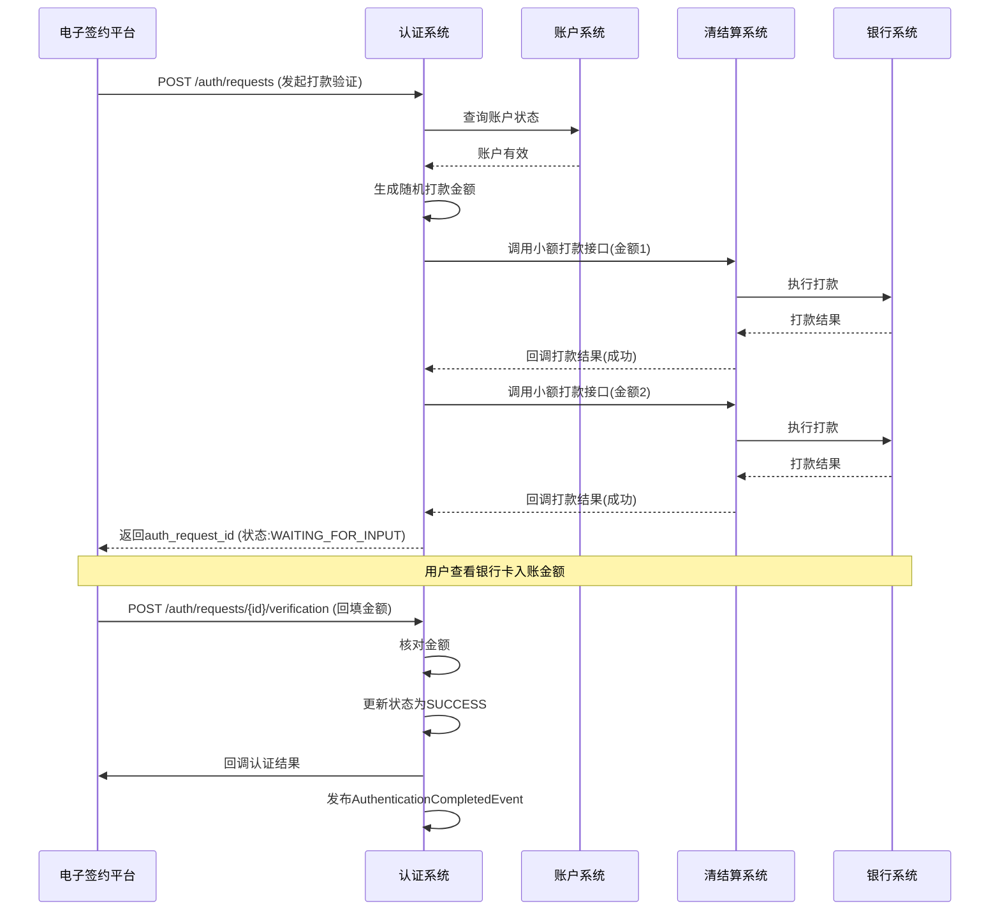
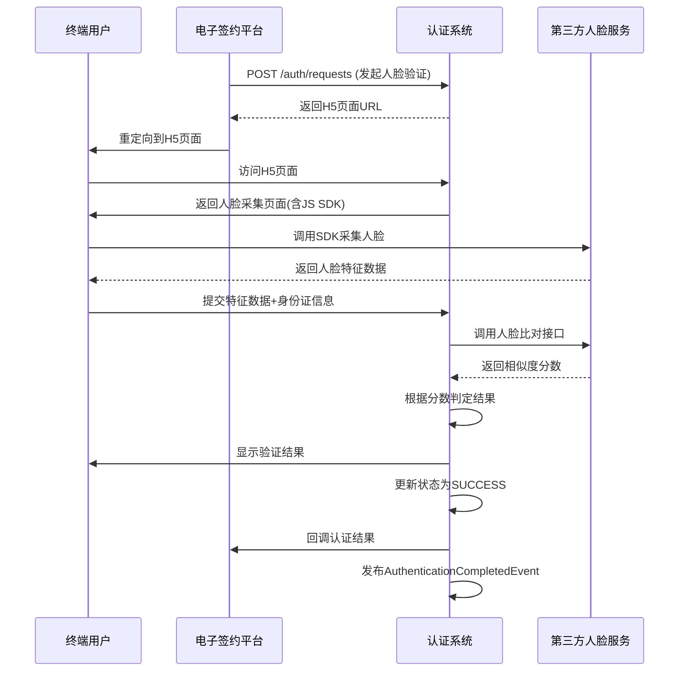

# 模块设计: 认证系统

生成时间: 2026-01-20 15:39:16
批判迭代: 1

---

# 认证系统模块设计文档

## 1. 概述

**模块名称**：认证系统

**目的**：为整个支付平台提供统一、安全、可扩展的身份与账户所有权认证能力。核心目标是验证用户（个人/企业）身份的真实性及其对指定银行账户的控制权，为高风险业务（如账户绑定、资金操作授权）提供关键的安全保障。

**范围**：
- **打款验证**：通过向指定银行卡打入随机小额款项，验证用户能否正确回填金额，以证明其对账户的所有权和控制权。主要服务于对公企业认证。
- **人脸验证**：通过比对用户提交的姓名、身份证号与人脸生物特征，验证个人或个体户身份的真实性。
- **认证流程管理**：提供认证请求发起、状态管理、结果查询与回调通知的完整生命周期管理。
- **证据链留存**：为每次认证过程生成并存储不可篡改的日志和证据，满足合规与审计要求。

**核心价值**：作为支付平台的风控基石，降低欺诈风险，确保资金操作指令的合法性，满足监管对账户实名制和操作授权的强制性要求。

## 2. 接口设计

### 2.1 API端点 (RESTful)

#### 2.1.1 发起认证请求
- **端点**：`POST /api/v1/auth/requests`
- **描述**：根据业务场景和认证类型，发起一次新的认证流程。
- **请求头**：`Content-Type: application/json`, `X-Request-ID` (请求唯一标识)
- **请求体**：
```json
{
  "auth_scene": "RELATION_BINDING", // 认证场景：RELATION_BINDING(关系绑定), OPEN_PAYMENT(开通付款), WITHDRAWAL_AUTH(提现授权)
  "auth_type": "TRANSFER_VERIFICATION", // 认证类型：TRANSFER_VERIFICATION(打款验证), FACE_VERIFICATION(人脸验证)
  "biz_reference_no": "BIND_20231025001", // 业务方唯一流水号
  "applicant_info": {
    "user_id": "user_123456",
    "user_type": "CORPORATE", // 用户类型：PERSONAL(个人), INDIVIDUAL_BUSINESS(个体户), CORPORATE(企业)
    "name": "北京天财科技有限公司",
    "id_card_no": "91110108MA01XXXXXX", // 个人为身份证号，企业为统一社会信用代码
    "id_card_type": "UNIFIED_SOCIAL_CREDIT_CODE" // 证件类型：ID_CARD, UNIFIED_SOCIAL_CREDIT_CODE
  },
  "target_account_info": {
    "account_type": "BANK_CARD", // 账户类型：BANK_CARD
    "bank_account_no": "6228480018888888888",
    "bank_name": "中国农业银行",
    "bank_branch": "北京分行朝阳支行"
  },
  "callback_url": "https://esign.example.com/callback", // 认证结果回调地址
  "metadata": { // 扩展信息，透传回传
    "relation_id": "rel_001",
    "merchant_id": "mch_888"
  }
}
```
- **响应体 (201 Created)**：
```json
{
  "code": "SUCCESS",
  "message": "认证请求已受理",
  "data": {
    "auth_request_id": "auth_req_20231025001",
    "auth_scene": "RELATION_BINDING",
    "auth_type": "TRANSFER_VERIFICATION",
    "status": "PENDING", // 状态：PENDING(待处理), PROCESSING(处理中), WAITING_FOR_INPUT(待用户输入), SUCCESS, FAILED, EXPIRED
    "next_step": "WAIT_FOR_TRANSFER", // 下一步动作：WAIT_FOR_TRANSFER(等待打款), WAIT_FOR_USER_INPUT(等待用户输入金额), REDIRECT_TO_H5(跳转H5人脸页面)
    "h5_url": null, // 当next_step为REDIRECT_TO_H5时，返回人脸识别H5页面URL
    "expire_time": "2023-10-25T15:30:00+08:00" // 认证请求过期时间
  }
}
```

#### 2.1.2 提交认证信息（打款验证金额回填）
- **端点**：`POST /api/v1/auth/requests/{auth_request_id}/verification`
- **描述**：用户回填打款验证收到的金额，或提交人脸验证的最终确认。
- **请求体**：
```json
{
  "auth_type": "TRANSFER_VERIFICATION",
  "verification_data": {
    "amount_1": "0.12", // 第一笔打款金额
    "amount_2": "0.34"  // 第二笔打款金额（可选，增强验证）
  }
}
```
- **响应体**：
```json
{
  "code": "SUCCESS",
  "message": "验证信息已提交，处理中",
  "data": {
    "auth_request_id": "auth_req_20231025001",
    "status": "PROCESSING",
    "estimated_completion_time": "2023-10-25T15:05:00+08:00"
  }
}
```

#### 2.1.3 查询认证结果
- **端点**：`GET /api/v1/auth/requests/{auth_request_id}`
- **描述**：根据认证请求ID查询详细的认证状态和结果。
- **响应体**：
```json
{
  "code": "SUCCESS",
  "message": "查询成功",
  "data": {
    "auth_request_id": "auth_req_20231025001",
    "auth_scene": "RELATION_BINDING",
    "auth_type": "TRANSFER_VERIFICATION",
    "status": "SUCCESS",
    "result": "PASS", // 最终结果：PASS, FAIL, EXPIRED
    "fail_reason": null, // 失败原因码，如：AMOUNT_MISMATCH, FACE_MISMATCH, TIMEOUT
    "applicant_info": { ... },
    "target_account_info": { ... },
    "evidence": {
      "transfer_verification": {
        "transfer_order_nos": ["transfer_001", "transfer_002"],
        "transfer_amounts": ["0.12", "0.34"],
        "user_input_amounts": ["0.12", "0.34"],
        "verification_time": "2023-10-25T15:02:30+08:00"
      }
    },
    "request_time": "2023-10-25T14:50:00+08:00",
    "complete_time": "2023-10-25T15:02:35+08:00"
  }
}
```

#### 2.1.4 接收打款结果回调（内部）
- **端点**：`POST /internal/callback/transfer/result` (内部接口，由清结算/支付系统调用)
- **描述**：接收小额打款指令的执行结果，更新认证状态。
- **请求体**：
```json
{
  "auth_request_id": "auth_req_20231025001",
  "transfer_order_no": "transfer_001",
  "transfer_status": "SUCCESS", // SUCCESS, FAILED
  "actual_amount": "0.12",
  "completion_time": "2023-10-25T14:55:30+08:00"
}
```

### 2.2 发布/消费的事件

#### 2.2.1 发布的事件
- **AuthenticationCompletedEvent**：认证流程完成时发布。
  - **Topic**: `authentication.completed`
  - **Payload**:
```json
{
  "event_id": "event_001",
  "event_time": "2023-10-25T15:02:35+08:00",
  "event_type": "AUTHENTICATION_COMPLETED",
  "data": {
    "auth_request_id": "auth_req_20231025001",
    "biz_reference_no": "BIND_20231025001",
    "auth_scene": "RELATION_BINDING",
    "auth_type": "TRANSFER_VERIFICATION",
    "result": "PASS",
    "applicant_user_id": "user_123456",
    "target_account_no": "6228480018888888888",
    "metadata": { ... } // 包含请求时的metadata
  }
}
```

#### 2.2.2 消费的事件
- **无直接消费事件**：认证系统作为基础服务，主要由上游系统（如电子签约平台）同步调用驱动。但可监听账户系统发布的`AccountFrozenEvent`，以终止相关进行中的认证流程。

## 3. 数据模型

### 3.1 数据库表设计 (MySQL)

#### 表1: auth_request (认证请求主表)
| 字段名 | 类型 | 必填 | 默认值 | 说明 |
|--------|------|------|--------|------|
| id | BIGINT UNSIGNED | Y | AUTO_INCREMENT | 主键 |
| auth_request_id | VARCHAR(64) | Y | | 业务唯一请求ID，唯一索引 |
| biz_reference_no | VARCHAR(64) | Y | | 业务方流水号，普通索引 |
| auth_scene | VARCHAR(32) | Y | | 认证场景 |
| auth_type | VARCHAR(32) | Y | | 认证类型 |
| status | VARCHAR(32) | Y | ‘PENDING’ | 认证状态 |
| result | VARCHAR(32) | N | | 最终结果 |
| applicant_user_id | VARCHAR(64) | Y | | 申请人用户ID |
| applicant_user_type | VARCHAR(32) | Y | | 申请人类型 |
| applicant_name | VARCHAR(128) | Y | | 申请人姓名/企业名 |
| applicant_id_card_no | VARCHAR(64) | Y | | 申请人证件号 |
| applicant_id_card_type | VARCHAR(32) | Y | | 证件类型 |
| target_account_no | VARCHAR(64) | Y | | 目标账户号（银行卡号） |
| target_bank_name | VARCHAR(128) | Y | | 开户行 |
| target_bank_branch | VARCHAR(256) | N | | 开户支行 |
| callback_url | VARCHAR(512) | N | | 回调地址 |
| metadata | JSON | N | | 扩展元数据 |
| expire_time | DATETIME | Y | | 过期时间 |
| fail_reason | VARCHAR(128) | N | | 失败原因码 |
| request_time | DATETIME | Y | CURRENT_TIMESTAMP | 请求时间 |
| complete_time | DATETIME | N | | 完成时间 |
| version | INT | Y | 0 | 乐观锁版本号 |

#### 表2: auth_evidence (认证证据表)
| 字段名 | 类型 | 必填 | 默认值 | 说明 |
|--------|------|------|--------|------|
| id | BIGINT UNSIGNED | Y | AUTO_INCREMENT | 主键 |
| auth_request_id | VARCHAR(64) | Y | | 关联auth_request，唯一索引 |
| evidence_type | VARCHAR(32) | Y | | 证据类型：TRANSFER_VERIFICATION, FACE_VERIFICATION |
| evidence_data | JSON | Y | | 证据详情JSON |
| create_time | DATETIME | Y | CURRENT_TIMESTAMP | 创建时间 |

#### 表3: transfer_verification_detail (打款验证明细表)
| 字段名 | 类型 | 必填 | 默认值 | 说明 |
|--------|------|------|--------|------|
| id | BIGINT UNSIGNED | Y | AUTO_INCREMENT | 主键 |
| auth_request_id | VARCHAR(64) | Y | | 关联auth_request，索引 |
| transfer_order_no | VARCHAR(64) | Y | | 打款订单号，唯一索引 |
| expected_amount | DECIMAL(10,2) | Y | | 预期打款金额 |
| actual_amount | DECIMAL(10,2) | N | | 实际打款金额 |
| transfer_status | VARCHAR(32) | Y | ‘INIT’ | 打款状态 |
| user_input_amount | DECIMAL(10,2) | N | | 用户回填金额 |
| transfer_time | DATETIME | N | | 打款时间 |
| sequence | TINYINT | Y | | 打款序号（1或2） |

#### 表4: auth_audit_log (认证审计日志表)
| 字段名 | 类型 | 必填 | 默认值 | 说明 |
|--------|------|------|--------|------|
| id | BIGINT UNSIGNED | Y | AUTO_INCREMENT | 主键 |
| auth_request_id | VARCHAR(64) | Y | | 关联auth_request，索引 |
| operator | VARCHAR(64) | N | ‘SYSTEM’ | 操作者（SYSTEM或用户ID） |
| action | VARCHAR(64) | Y | | 操作动作 |
| from_status | VARCHAR(32) | N | | 操作前状态 |
| to_status | VARCHAR(32) | N | | 操作后状态 |
| remark | VARCHAR(512) | N | | 操作备注 |
| ip_address | VARCHAR(64) | N | | 操作IP |
| user_agent | VARCHAR(512) | N | | 用户代理 |
| log_time | DATETIME | Y | CURRENT_TIMESTAMP | 日志时间 |

### 3.2 与其他模块的关系
- **电子签约平台**：主要调用方。在签约流程中，根据协议类型调用认证系统完成身份与账户验证。
- **清结算系统**：为“打款验证”提供小额打款能力。认证系统调用清结算的付款接口发起打款，并接收其异步回调。
- **账户系统**：查询账户状态（如是否冻结），确保不对无效账户发起认证。
- **行业钱包系统/三代系统**：作为认证结果的消费者，监听`AuthenticationCompletedEvent`，更新关系绑定状态或开通付款权限。

## 4. 业务逻辑

### 4.1 核心算法

#### 4.1.1 打款验证金额生成算法
```python
def generate_verification_amounts():
    # 生成两笔随机金额，范围0.01-0.99元，精度分
    import random
    amount1 = random.randint(1, 99) / 100.0
    amount2 = random.randint(1, 99) / 100.0
    # 确保两笔金额不同
    while abs(amount1 - amount2) < 0.01:
        amount2 = random.randint(1, 99) / 100.0
    return round(amount1, 2), round(amount2, 2)
```

#### 4.1.2 人脸验证分数判定
- 调用第三方人脸识别服务（如腾讯云、阿里云）获取相似度分数。
- 业务判定规则：分数 ≥ 0.8 为通过（PASS），否则为不通过（FAIL）。
- 连续失败3次则锁定该用户当日人脸验证功能。

### 4.2 业务规则

#### 4.2.1 认证类型与用户类型匹配规则
| 用户类型 | 支持的认证类型 | 说明 |
|----------|----------------|------|
| PERSONAL (个人) | FACE_VERIFICATION | 个人必须使用人脸验证 |
| INDIVIDUAL_BUSINESS (个体户) | FACE_VERIFICATION, TRANSFER_VERIFICATION | 优先人脸，对公账户可打款验证 |
| CORPORATE (企业) | TRANSFER_VERIFICATION | 企业必须使用打款验证 |

#### 4.2.2 认证有效期规则
- 认证请求默认有效期为 **30分钟**。
- 打款验证的小额打款金额在验证通过后 **72小时** 内有效，超时需重新发起。
- 人脸验证结果一次性有效，不存储人脸生物特征模板。

#### 4.2.3 重试与防刷规则
- 同一`(user_id, target_account_no, auth_scene)`组合，24小时内最多失败3次，触发后锁定24小时。
- 打款验证金额回填，最多允许错误2次，第3次错误直接失败。
- 单IP地址每分钟最多发起5次认证请求。

### 4.3 验证逻辑

#### 4.3.1 请求参数验证
1. 必填字段校验。
2. `auth_type`与`user_type`匹配性校验（见4.2.1）。
3. 银行卡号Luhn算法校验及银行BIN号合法性校验。
4. 回调URL格式校验。

#### 4.3.2 打款验证金额核对逻辑
1. 用户回填金额与实际打款金额比较。
2. 容错规则：允许 ±0.01元的系统误差。
3. 两笔金额必须全部正确才算通过。
4. 若只回填一笔金额，则只验证该笔，但安全等级降级（记录标记）。

#### 4.3.3 状态流转校验
- 严格的状态机控制，防止非法状态跃迁。
- 只有`WAITING_FOR_INPUT`状态可接受金额回填。
- 已终态（SUCCESS/FAILED/EXPIRED）的请求不可再更新。

## 5. 时序图

### 5.1 打款验证流程时序图



### 5.2 人脸验证流程时序图



## 6. 错误处理

### 6.1 预期错误码

| 错误码 | HTTP状态码 | 描述 | 处理建议 |
|--------|------------|------|----------|
| AUTH_REQUEST_INVALID | 400 | 请求参数无效 | 检查参数格式与必填项 |
| AUTH_TYPE_NOT_SUPPORTED | 400 | 认证类型不支持 | 检查user_type与auth_type匹配规则 |
| ACCOUNT_INVALID_OR_FROZEN | 400 | 账户无效或已冻结 | 联系用户检查账户状态 |
| REQUEST_LIMIT_EXCEEDED | 429 | 请求频率超限 | 客户端降频重试 |
| AUTH_REQUEST_EXPIRED | 410 | 认证请求已过期 | 重新发起认证 |
| AUTH_REQUEST_NOT_FOUND | 404 | 认证请求不存在 | 检查auth_request_id |
| VERIFICATION_AMOUNT_MISMATCH | 400 | 验证金额不匹配 | 用户重新确认金额 |
| FACE_VERIFICATION_FAILED | 400 | 人脸验证失败 | 建议用户重试或换认证方式 |
| THIRD_PARTY_SERVICE_ERROR | 502 | 第三方服务异常 | 系统自动重试，告警通知 |

### 6.2 处理策略

1. **重试策略**：
   - 对清结算打款调用，采用指数退避重试，最多3次。
   - 第三方人脸服务调用，立即重试1次，失败则整体失败。

2. **降级策略**：
   - 人脸服务不可用时，对个人用户认证流程阻塞并告警。
   - 打款验证可降级为单笔金额验证（需风控审批）。

3. **补偿机制**：
   - 定时任务扫描`PROCESSING`超时（>10分钟）的请求，主动查询状态并推进。
   - 打款验证失败时，需调用清结算进行冲正。

4. **审计与监控**：
   - 所有异常均记录至`auth_audit_log`。
   - 关键错误码（如频繁金额不匹配）触发实时风控告警。

## 7. 依赖说明

### 7.1 上游依赖

1. **电子签约平台**：
   - **交互方式**：同步HTTP调用 + 异步回调。
   - **职责**：发起认证请求，引导用户完成认证步骤，接收结果并更新签约状态。
   - **SLA要求**：P99 < 500ms。

2. **清结算系统**：
   - **交互方式**：同步HTTP调用（打款） + 异步回调（结果）。
   - **接口**：小额打款接口、冲正接口。
   - **关键要求**：打款成功率 > 99.9%，到账时间 < 2分钟。

3. **账户系统**：
   - **交互方式**：同步RPC调用。
   - **接口**：账户状态查询接口。
   - **关键要求**：实时返回账户最新状态。

4. **第三方人脸识别服务**：
   - **交互方式**：同步HTTP调用。
   - **关键要求**：比对准确率 > 99%，可用性 > 99.95%。

### 7.2 下游依赖

1. **行业钱包系统 / 三代系统**：
   - **交互方式**：异步消息（事件驱动）。
   - **职责**：消费`AuthenticationCompletedEvent`，更新业务状态（如关系绑定生效）。
   - **可靠性**：事件至少投递一次，消费者需幂等处理。

### 7.3 依赖治理

1. **熔断机制**：对清结算、人脸服务等外部依赖配置熔断器（如Hystrix），防止级联故障。
2. **超时配置**：
   - 同步调用默认超时：3秒。
   - 打款结果回调等待超时：5分钟。
3. **监控指标**：
   - 各依赖接口成功率、延迟。
   - 认证总体成功率、平均耗时。
   - 按认证类型、场景的分布统计。