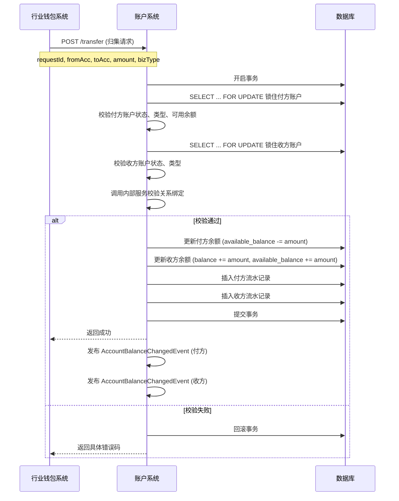

# 模块设计: 账户系统

生成时间: 2026-01-20 15:39:03
批判迭代: 1

---

# 账户系统模块设计文档

## 1. 概述

**模块名称**：账户系统

**目的**：
账户系统是支付平台的底层核心系统，负责所有类型账户（包括普通商户账户、待结算账户、退货账户以及特殊的天财专用账户）的生命周期管理、账户属性与能力控制、资金余额的原子化操作以及账户关系的维护。在本业务上下文中，其核心目标是**安全、高效、准确地支撑天财分账业务**，通过为天财商户创建具有特殊标记的专用账户，并严格控制其资金流转规则，确保分账、归集、提现等业务流程的合规性与数据一致性。

**范围**：
- **账户全生命周期管理**：创建、查询、冻结/解冻、注销天财专用账户（收款账户、接收方账户）。
- **账户属性与标记管理**：为天财专用账户打上特定标记（如`account_type: TIANCAI_RECEIVE`, `account_type: TIANCAI_RISK`），并基于标记控制账户能力（如禁止向普通账户转账）。
- **资金原子操作**：提供账户余额的增（入账）、减（出账）原子操作，确保在高并发分账场景下的数据强一致性。
- **账户关系绑定**：存储并校验分账业务中所需的账户间授权关系（如总部与门店的归集关系），作为分账指令执行的前置条件。
- **基础数据提供**：为清结算、对账单、业务核心等上游系统提供准确的账户基础信息与余额快照。

**非范围**：
- 分账业务逻辑的具体编排（由**行业钱包系统**负责）。
- 交易记录、流水明细的生成与存储（由**业务核心**或**清结算系统**负责）。
- 手续费的计算（由**计费中台**负责）。
- 用户认证与协议签署流程（由**电子签约平台**和**认证系统**负责）。

## 2. 接口设计

### 2.1 API端点 (RESTful)

#### 2.1.1 账户管理接口
- **POST /api/v1/accounts**：创建账户
- **GET /api/v1/accounts/{accountNo}**：查询账户详情
- **PUT /api/v1/accounts/{accountNo}/status**：更新账户状态（冻结/解冻/注销）
- **POST /api/v1/accounts/batch-query**：批量查询账户信息

#### 2.1.2 资金操作接口
- **POST /api/v1/accounts/{accountNo}/actions/credit**：入账（贷记）
- **POST /api/v1/accounts/{accountNo}/actions/debit**：出账（借记）
- **POST /api/v1/accounts/actions/transfer**：内部转账（原子操作）

#### 2.1.3 关系绑定接口
- **POST /api/v1/account-relations**：创建账户关系绑定
- **GET /api/v1/account-relations**：查询账户关系
- **DELETE /api/v1/account-relations/{relationId}**：解除账户关系

### 2.2 输入/输出数据结构

#### 创建天财专用账户请求 (POST /api/v1/accounts)
```json
{
  "requestId": "req_20240418001",
  "merchantNo": "M100001",
  "accountType": "TIANCAI_RECEIVE", // 或 TIANCAI_RISK
  "role": "HEADQUARTERS", // 或 STORE，仅对 RECEIVE 类型有效
  "currency": "CNY",
  "extraInfo": {
    "sourceSystem": "GENERATION_III",
    "businessLicenseNo": "91310101MA1XXXXXXX"
  }
}
```

#### 创建天财专用账户响应
```json
{
  "code": "SUCCESS",
  "message": "成功",
  "data": {
    "accountNo": "TC1000000001",
    "accountType": "TIANCAI_RECEIVE",
    "merchantNo": "M100001",
    "role": "HEADQUARTERS",
    "status": "ACTIVE",
    "balance": "0.00",
    "availableBalance": "0.00",
    "frozenBalance": "0.00",
    "currency": "CNY",
    "createTime": "2024-04-18T10:00:00Z"
  }
}
```

#### 内部转账请求 (POST /api/v1/accounts/actions/transfer)
```json
{
  "requestId": "transfer_20240418001",
  "fromAccountNo": "TC1000000001",
  "toAccountNo": "TC1000000002",
  "amount": "100.00",
  "currency": "CNY",
  "bizType": "COLLECTION", // 归集、BATCH_PAY、MEMBER_SETTLEMENT
  "bizOrderNo": "BO202404180001",
  "remark": "门店日终归集"
}
```

### 2.3 发布/消费的事件

#### 消费的事件
- **AccountCreatedEvent**：由**行业钱包系统**发布，通知账户系统创建天财专用账户。
- **AccountRelationBoundEvent**：由**电子签约平台**发布，通知账户系统记录已认证的账户关系。

#### 发布的事件
- **AccountBalanceChangedEvent**：当账户余额发生变动时发布，供**清结算系统**、**对账单系统**订阅。
```json
{
  "eventId": "event_001",
  "eventType": "ACCOUNT_BALANCE_CHANGED",
  "timestamp": "2024-04-18T10:05:00Z",
  "data": {
    "accountNo": "TC1000000001",
    "changeAmount": "100.00",
    "changeType": "CREDIT",
    "balanceAfter": "200.00",
    "availableBalanceAfter": "200.00",
    "bizOrderNo": "BO202404180001",
    "bizType": "COLLECTION"
  }
}
```
- **AccountStatusUpdatedEvent**：当账户状态（冻结/解冻）变更时发布，供**清结算系统**、**行业钱包系统**订阅。

## 3. 数据模型

### 3.1 核心表设计

#### 账户表 (`account`)
| 字段名 | 类型 | 必填 | 描述 | 索引 |
| :--- | :--- | :--- | :--- | :--- |
| `id` | bigint | Y | 自增主键 | PK |
| `account_no` | varchar(32) | Y | 账户号，全局唯一 | UK |
| `merchant_no` | varchar(32) | Y | 所属商户号 | IDX |
| `account_type` | varchar(32) | Y | 账户类型: `TIANCAI_RECEIVE`, `TIANCAI_RISK`, `PENDING_SETTLE`, `REFUND`, `NORMAL` | IDX |
| `role` | varchar(16) | N | 角色: `HEADQUARTERS`, `STORE` (仅天财收款账户有) | |
| `currency` | char(3) | Y | 币种，默认CNY | |
| `balance` | decimal(18,2) | Y | 账户余额 | |
| `available_balance` | decimal(18,2) | Y | 可用余额 | |
| `frozen_balance` | decimal(18,2) | Y | 冻结余额 | |
| `status` | varchar(16) | Y | 状态: `ACTIVE`, `FROZEN`, `CLOSED` | IDX |
| `create_time` | datetime | Y | 创建时间 | |
| `update_time` | datetime | Y | 更新时间 | |

#### 账户关系表 (`account_relation`)
| 字段名 | 类型 | 必填 | 描述 | 索引 |
| :--- | :--- | :--- | :--- | :--- |
| `id` | bigint | Y | 自增主键 | PK |
| `relation_id` | varchar(64) | Y | 关系ID，业务唯一 | UK |
| `payer_account_no` | varchar(32) | Y | 付款方账户号 | IDX |
| `payee_account_no` | varchar(32) | Y | 收款方账户号 | IDX |
| `relation_type` | varchar(32) | Y | 关系类型: `COLLECTION`(归集), `SETTLEMENT`(会员结算), `BATCH_PAY`(批量付款) | IDX |
| `auth_status` | varchar(16) | Y | 认证状态: `SIGNED`, `VERIFIED`, `INVALID` | |
| `contract_no` | varchar(64) | N | 关联的电子合同编号 | |
| `extra_config` | json | N | 扩展配置，如分账比例、限额等 | |
| `effective_time` | datetime | Y | 生效时间 | |
| `expire_time` | datetime | N | 过期时间 | |
| `create_time` | datetime | Y | 创建时间 | |

#### 账户流水表 (`account_ledger`)
| 字段名 | 类型 | 必填 | 描述 | 索引 |
| :--- | :--- | :--- | :--- | :--- |
| `id` | bigint | Y | 自增主键 | PK |
| `ledger_no` | varchar(64) | Y | 流水号，全局唯一 | UK |
| `account_no` | varchar(32) | Y | 账户号 | IDX |
| `change_amount` | decimal(18,2) | Y | 变动金额（正数为入，负数为出） | |
| `balance_before` | decimal(18,2) | Y | 变动前余额 | |
| `balance_after` | decimal(18,2) | Y | 变动后余额 | |
| `available_balance_before` | decimal(18,2) | Y | 变动前可用余额 | |
| `available_balance_after` | decimal(18,2) | Y | 变动后可用余额 | |
| `biz_type` | varchar(32) | Y | 业务类型: `COLLECTION`, `BATCH_PAY`, `MEMBER_SETTLEMENT`, `WITHDRAW`, `REFUND` | IDX |
| `biz_order_no` | varchar(64) | Y | 业务订单号 | IDX |
| `request_id` | varchar(64) | Y | 请求ID，用于幂等 | UK |
| `remark` | varchar(256) | N | 备注 | |
| `create_time` | datetime | Y | 创建时间 | IDX |

### 3.2 与其他模块的关系
- **行业钱包系统**：账户系统的直接上游调用者。钱包系统处理业务逻辑，调用账户系统执行最终的账户创建、关系绑定和资金划转。
- **清结算系统**：消费账户余额变动事件，用于生成结算单；在退货等场景下，调用账户系统进行资金扣减。
- **对账单系统**：消费账户流水事件，生成资金动账明细账单。
- **业务核心**：在交易发生时，可能直接或通过钱包系统调用账户系统进行资金冻结或扣款。
- **电子签约平台**：在关系绑定流程完成后，通过事件通知账户系统记录绑定关系。

## 4. 业务逻辑

### 4.1 核心算法
- **资金操作幂等性**：所有资金变动接口必须基于`requestId`实现幂等。通过`account_ledger`表的`request_id`唯一索引保证，重复请求直接返回上次成功结果。
- **余额更新原子性**：使用数据库事务及`SELECT ... FOR UPDATE`悲观锁（或乐观锁版本号）锁定账户行，确保并发操作下的余额计算准确。
- **账户类型校验**：在执行转账前，校验`fromAccount`和`toAccount`的类型组合是否符合天财业务规则（例如，天财账户只能与天财账户互转）。

### 4.2 业务规则
1. **天财账户创建规则**：
   - 仅能由**行业钱包系统**发起创建请求。
   - `TIANCAI_RECEIVE`（收款账户）必须指定`role`（总部或门店）。
   - `TIANCAI_RISK`（接收方账户）需关联一个已通过打款验证或人脸验证的商户。
2. **资金划转规则**：
   - **归集**：`fromAccount`必须是门店收款账户(`TIANCAI_RECEIVE`, `STORE`)，`toAccount`必须是总部收款账户(`TIANCAI_RECEIVE`, `HEADQUARTERS`)，且两者间必须有生效的`COLLECTION`类型关系绑定。
   - **会员结算**：`fromAccount`必须是总部收款账户，`toAccount`必须是门店收款账户，且两者间必须有生效的`SETTLEMENT`类型关系绑定。
   - **批量付款**：`fromAccount`必须是总部收款账户，`toAccount`必须是接收方账户(`TIANCAI_RISK`)，且两者间必须有生效的`BATCH_PAY`类型关系绑定，且总部需已完成“开通付款”授权。
3. **账户状态规则**：
   - 仅`ACTIVE`状态的账户可进行资金出入。
   - `FROZEN`状态的账户禁止所有出账操作，但可接受入账（根据清结算要求）。
4. **余额校验规则**：
   - 出账或转账前，必须校验`available_balance` >= `amount`。

### 4.3 验证逻辑
1. **创建账户验证**：检查商户号是否存在且状态正常；检查该商户是否已存在同类型账户（避免重复开户）。
2. **转账验证**：
   - 基础校验：账户存在、状态有效、币种匹配、金额为正。
   - 业务校验：调用`关系绑定服务`校验`fromAccount`和`toAccount`在指定`bizType`下是否存在生效的绑定关系。
   - 风控校验：检查单笔/日累计限额（可从`account_relation.extra_config`读取）。
3. **关系绑定验证**：当消费`AccountRelationBoundEvent`时，验证事件中的账户是否存在且为天财专用账户。

## 5. 时序图

### 5.1 天财分账（归集场景）资金划转时序



## 6. 错误处理

| 错误码 | HTTP状态码 | 描述 | 处理策略 |
| :--- | :--- | :--- | :--- |
| `ACCOUNT_NOT_FOUND` | 404 | 账户不存在 | 上游系统检查账户号是否正确，或引导用户先开户。 |
| `ACCOUNT_STATUS_INVALID` | 400 | 账户状态非ACTIVE | 上游系统提示账户已被冻结或注销，需联系运营。 |
| `ACCOUNT_TYPE_MISMATCH` | 400 | 账户类型不符合业务规则 | 上游系统校验业务场景与账户类型是否匹配。 |
| `INSUFFICIENT_AVAILABLE_BALANCE` | 400 | 可用余额不足 | 上游系统提示余额不足，或检查是否有资金被冻结。 |
| `RELATION_NOT_FOUND_OR_INVALID` | 400 | 账户关系不存在或未生效 | 上游系统引导用户完成关系绑定与认证流程。 |
| `DUPLICATED_REQUEST` | 409 | 重复的请求ID | 直接返回上一次成功执行的结果，实现幂等。 |
| `DATABASE_CONSTRAINT_VIOLATION` | 500 | 数据库约束冲突（如唯一键） | 记录告警，人工介入排查数据一致性。 |
| `DEPENDENCY_SERVICE_UNAVAILABLE` | 503 | 依赖服务（如清结算）不可用 | 触发熔断，返回可重试错误，并记录日志告警。 |

**通用策略**：
- **客户端错误(4xx)**：返回明确错误码与信息，由上游业务系统决定是否提示用户或引导流程。
- **服务端错误(5xx)**：记录详细错误日志与上下文，触发监控告警。对于资金操作，必须确保事务回滚，避免出现中间状态。
- **幂等性**：所有写操作必须基于`requestId`支持幂等，防止网络重试导致重复操作。
- **补偿与对账**：每日与清结算系统、对账单系统进行对账，发现不平及时触发人工或自动补偿流程。

## 7. 依赖说明

### 7.1 上游模块交互
1. **行业钱包系统**：
   - **交互方式**：同步RPC调用（HTTP API）。
   - **职责**：钱包系统是账户系统的主要服务消费者，负责将复杂的分账业务逻辑（如手续费计算、路由）转化为对账户系统的原子操作指令。账户系统需为其提供高可用、强一致的服务。

2. **清结算系统**：
   - **交互方式**：异步事件消费 + 同步API调用。
   - **职责**：账户系统发布余额变动事件供其订阅，用于驱动结算。同时，清结算系统在退货、手工调账等场景下，会直接调用账户系统的资金扣减接口。

3. **电子签约平台**：
   - **交互方式**：异步事件消费。
   - **职责**：账户系统消费其发布的`AccountRelationBoundEvent`，将已通过法律认证的账户关系持久化，作为后续分账的许可凭证。

### 7.2 关键依赖管理
- **数据库**：强依赖。需确保主从高可用、定期备份，并对核心表进行分库分表设计以应对数据增长。
- **内部服务（关系绑定校验）**：轻量级依赖。该服务可内置于账户系统模块中，但逻辑独立。需保证其查询性能，可使用本地缓存。
- **消息中间件**：强依赖。用于事件发布，需保证至少一次投递，确保下游系统能可靠接收到余额变动事件。

### 7.3 降级与容错
- **读操作**：如账户查询，可在数据库暂时不可用时，返回缓存中的旧数据（标记为缓存数据）。
- **写操作**：资金操作严禁降级。若数据库或关键校验服务不可用，必须快速失败，返回错误，由上游系统引导用户重试或记录待处理任务。
- **事件发布**：采用本地事务表+异步轮询发送模式，确保资金事务与事件发布的最终一致性，即使MQ暂时不可用也不丢失事件。