# DocuFlow-AI Project - 软件设计文档
生成时间: 2026-01-21 16:23:05

## 目录
1. [概述说明](#1-概述说明)
   - 1.1 [术语与缩略词](#11-术语与缩略词)
2. [系统设计](#2-系统设计)
3. [模块设计](#3-模块设计)
   - 3.1 [账户系统](#module-1)
   - 3.2 [认证系统](#module-2)
   - 3.3 [清结算系统](#module-3)
   - 3.4 [计费中台](#module-4)
   - 3.5 [业务核心系统](#module-5)
   - 3.6 [钱包APP/商服平台](#module-6)
   - 3.7 [三代系统](#module-7)
   - 3.8 [电子签约平台](#module-8)
   - 3.9 [行业钱包系统](#module-9)
   - 3.10 [对账单系统](#module-10)
4. [接口设计](#4-接口设计)
5. [数据库设计](#5-数据库设计)

---
# 1 概述说明

## 1.1 术语与缩略词


## 业务实体

- **天财分账**: 为满足天财商龙门店分账、会员结算、批量付款需求而设计的资金处理业务。
- **天财收款账户** (别名: 天财专用账户): 为天财业务开立的专用收款账户，类型为行业钱包（非小微钱包），用于接收资金。
- **天财接收方账户** (别名: 天财专用账户): 为天财业务开立的专用接收方账户，支持绑定多张银行卡并设置默认提现卡。
- **分账手续费承担方**: 指定由付方或收方统一承担转账手续费的业务参数。

## 角色

- **总部** (别名: 总店, 发起方): 天财业务中的品牌方或总店，通常是分账、归集、批量付款的发起方。
- **门店** (别名: 被归集方, 付方, 收方): 天财业务中的分店或下属单位，可以是资金归集的付方或会员结算的收方。

## 流程

- **归集** (别名: 归集授权): 资金从门店（付方）流向总部（收方）的业务场景。
- **批量付款** (别名: 批付): 总部（付方）向接收方账户进行分账付款的业务场景。
- **会员结算**: 总部（付方）向门店（收方）进行分账结算的业务场景。
- **关系绑定** (别名: 签约与认证, 绑定关系): 在特定业务场景（归集、批量付款、会员结算）下，建立收付双方授权关系的流程，包含签约与认证。
- **开通付款**: 在批量付款和会员结算场景下，付方（总部/门店-对公企业）需要额外完成的授权签约流程。

## 技术术语

- **打款验证**: 通过向指定银行卡发起小额随机打款，并验证回填金额与备注，以确认账户有效性的认证方式。
- **人脸验证** (别名: 人脸核验): 通过比对姓名、身份证和人脸信息，以确认个人身份一致性的认证方式。
- **主动结算**: 一种结算模式，资金结算至商户指定的收款账户（如天财收款账户）。
- **被动结算**: 一种结算模式，资金结算至系统默认的待结算账户。

## 系统角色

- **电子签约平台** (别名: 电子签章系统): 负责协议模板管理、短信推送、H5封装、并调用认证系统完成签约与认证全流程的系统。
- **行业钱包系统** (别名: 钱包系统): 处理天财专用账户开户、关系绑定校验、分账请求处理及数据同步的核心业务系统。
- **三代系统**: 负责商户管理、调用开户接口、配置结算账户与手续费，并对天财机构进行标识的系统。
- **账户系统**: 底层账户服务，负责开立和标记天财专用账户，并控制其专属能力。
- **清结算系统** (别名: 清结算): 处理结算配置、退货账户查询、专用账户冻结及计费信息同步的系统。
- **对账单系统**: 生成并提供机构层天财分账、提款、收单、结算等各类账单的系统。
- **业务核心系统** (别名: 业务核心): 接收并处理天财分账交易记录的系统。
- **计费中台**: 提供转账计费能力的中心化服务。
- **认证系统**: 提供打款验证和人脸验证接口的系统。

---
# 2 系统设计
## 2.1 系统结构
天财分账系统采用分层与模块化架构，以行业钱包系统为核心业务处理引擎，整合了账户、签约、认证、结算、计费等多个专业系统。系统整体遵循职责分离原则，通过清晰的接口定义和事件驱动机制进行协作，确保资金处理业务的合规性、安全性与可扩展性。

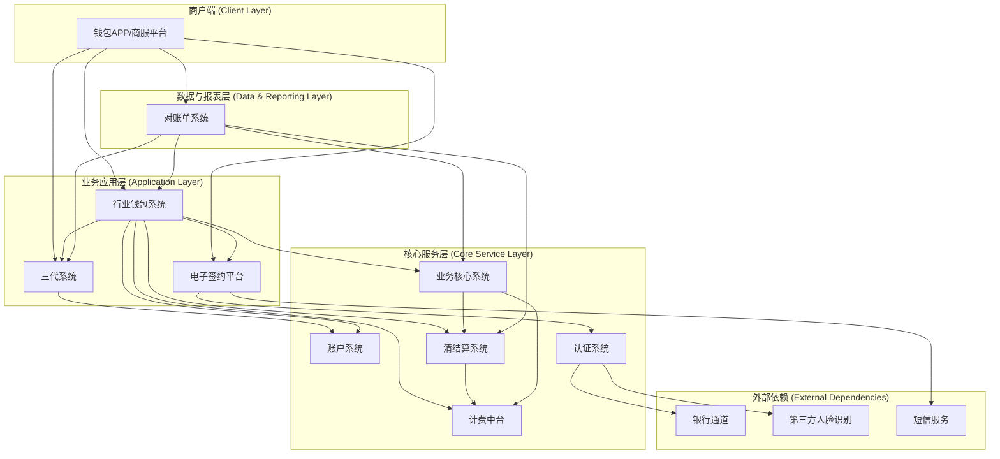
```mermaid
graph TB
    subgraph "商户端 (Client Layer)"
        APP[钱包APP/商服平台]
    end

    subgraph "业务应用层 (Application Layer)"
        GEN[三代系统]
        WALLET[行业钱包系统]
        SIGN[电子签约平台]
    end

    subgraph "核心服务层 (Core Service Layer)"
        ACCT[账户系统]
        AUTH[认证系统]
        SETTLE[清结算系统]
        FEE[计费中台]
        CORE[业务核心系统]
    end

    subgraph "数据与报表层 (Data & Reporting Layer)"
        STMT[对账单系统]
    end

    subgraph "外部依赖 (External Dependencies)"
        BANK[银行通道]
        FACE[第三方人脸识别]
        SMS[短信服务]
    end

    APP --> WALLET
    APP --> SIGN
    APP --> GEN
    APP --> STMT

    GEN --> ACCT
    WALLET --> ACCT
    WALLET --> GEN
    WALLET --> SIGN
    WALLET --> FEE
    WALLET --> SETTLE
    WALLET --> CORE

    SIGN --> AUTH
    SIGN --> SMS

    AUTH --> BANK
    AUTH --> FACE

    SETTLE --> FEE
    CORE --> SETTLE
    CORE --> FEE

    STMT --> CORE
    STMT --> SETTLE
    STMT --> WALLET
    STMT --> GEN
```

## 2.2 功能结构
系统功能围绕天财分账的核心业务流程（关系绑定、资金处理、账单管理）进行组织。主要功能模块包括商户与账户管理、签约认证、分账处理、结算计费以及账单服务。

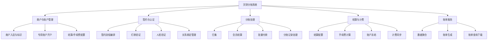
```mermaid
graph TD
    Root[天财分账系统] --> FM1[商户与账户管理]
    Root --> FM2[签约与认证]
    Root --> FM3[分账处理]
    Root --> FM4[结算与计费]
    Root --> FM5[账单服务]

    FM1 --> SFM1_1[商户入驻与标识]
    FM1 --> SFM1_2[专用账户开户]
    FM1 --> SFM1_3[结算/手续费配置]

    FM2 --> SFM2_1[签约流程编排]
    FM2 --> SFM2_2[打款验证]
    FM2 --> SFM2_3[人脸验证]
    FM2 --> SFM2_4[关系绑定管理]

    FM3 --> SFM3_1[归集]
    FM3 --> SFM3_2[会员结算]
    FM3 --> SFM3_3[批量付款]
    FM3 --> SFM3_4[分账记录处理]

    FM4 --> SFM4_1[结算配置]
    FM4 --> SFM4_2[手续费计算]
    FM4 --> SFM4_3[账户冻结]
    FM4 --> SFM4_4[计费同步]

    FM5 --> SFM5_1[数据聚合]
    FM5 --> SFM5_2[账单生成]
    FM5 --> SFM5_3[账单查询下载]
```

## 2.3 网络拓扑图
TBD

## 2.4 数据流转
数据流转描述了关键业务数据在系统各模块间的传递路径，主要包括配置数据、验证数据、交易数据和结算数据。流转通过同步API调用和异步事件驱动两种方式完成。

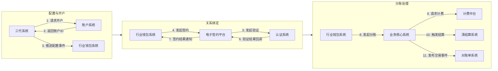
```mermaid
flowchart LR
    subgraph S1[配置与开户]
        direction LR
        GEN_1[三代系统] -- 1. 请求开户 --> ACCT_1[账户系统]
        ACCT_1 -- 2. 返回账户ID --> GEN_1
        GEN_1 -- 3. 推送配置事件 --> WALLET_1[行业钱包系统]
    end

    subgraph S2[关系绑定]
        direction LR
        WALLET_2[行业钱包系统] -- 4. 发起签约 --> SIGN_1[电子签约平台]
        SIGN_1 -- 5. 发起验证 --> AUTH_1[认证系统]
        AUTH_1 -- 6. 验证结果回调 --> SIGN_1
        SIGN_1 -- 7. 签约结果通知 --> WALLET_2
    end

    subgraph S3[分账处理]
        direction LR
        WALLET_3[行业钱包系统] -- 8. 发起分账 --> CORE_1[业务核心系统]
        CORE_1 -- 9. 请求计费 --> FEE_1[计费中台]
        CORE_1 -- 10. 触发结算 --> SETTLE_1[清结算系统]
        CORE_1 -- 11. 发布交易事件 --> STMT_1[对账单系统]
    end

    S1 --> S2
    S2 --> S3
```

## 2.5 系统模块交互关系
模块间交互关系基于依赖方向（调用/被调用）和核心业务流程进行定义。行业钱包系统作为业务枢纽，与最多模块交互；账户系统和认证系统作为底层能力提供者，被上层模块依赖。

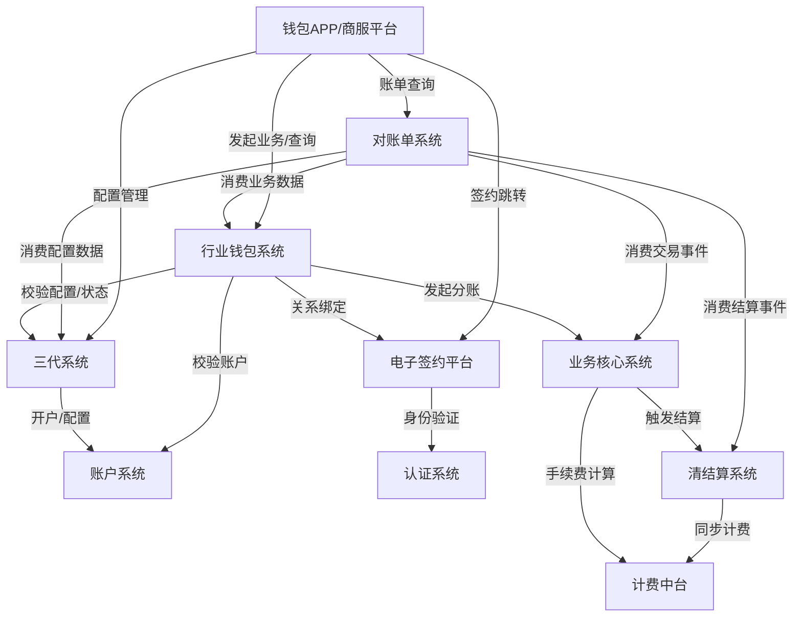
```mermaid
graph TD
    APP[钱包APP/商服平台]
    GEN[三代系统]
    WALLET[行业钱包系统]
    SIGN[电子签约平台]
    ACCT[账户系统]
    AUTH[认证系统]
    SETTLE[清结算系统]
    FEE[计费中台]
    CORE[业务核心系统]
    STMT[对账单系统]

    %% 核心业务调用流
    GEN -- 开户/配置 --> ACCT
    WALLET -- 关系绑定 --> SIGN
    SIGN -- 身份验证 --> AUTH
    WALLET -- 发起分账 --> CORE
    CORE -- 手续费计算 --> FEE
    CORE -- 触发结算 --> SETTLE

    %% 数据同步与查询
    WALLET -- 校验配置/状态 --> GEN
    WALLET -- 校验账户 --> ACCT
    SETTLE -- 同步计费 --> FEE
    STMT -- 消费交易事件 --> CORE
    STMT -- 消费结算事件 --> SETTLE
    STMT -- 消费业务数据 --> WALLET
    STMT -- 消费配置数据 --> GEN

    %% 前端交互
    APP -- 发起业务/查询 --> WALLET
    APP -- 签约跳转 --> SIGN
    APP -- 配置管理 --> GEN
    APP -- 账单查询 --> STMT
```
---
# 3 模块设计

<a id="module-1"></a>

## 3.1 账户系统


### 1. 概述
- **目的与范围**: 账户系统是底层账户服务，负责为天财业务开立和标记专用的"天财收款账户"（行业钱包类型），并控制其专属能力。其核心职责包括账户的创建、状态管理、能力标记，并向上游系统提供账户服务。其边界止于账户的底层数据操作，不包含业务层面的分账、归集等流程。账户系统是"行业钱包系统"的一个底层服务组件，专注于账户实体本身的创建与标记，而"行业钱包系统"则负责基于此账户实体进行业务层面的关系绑定、分账处理等。

### 2. 接口设计
- **API端点 (REST)**:
    - `POST /v1/accounts`: 创建天财专用账户。
    - `GET /v1/accounts/{accountId}`: 查询账户详情。
    - `PATCH /v1/accounts/{accountId}/status`: 更新账户状态（如冻结、解冻）。
- **请求/响应结构**:
    - **创建账户请求体**:
        ```json
        {
          "request_id": "string, 请求唯一标识，用于幂等",
          "business_id": "string, 天财业务标识（来自三代系统）",
          "merchant_id": "string, 商户ID",
          "account_type": "INDUSTRY_WALLET",
          "capabilities": ["ACTIVE_SETTLEMENT", "TIANCAI_SPECIAL"]
        }
        ```
    - **创建账户成功响应体**:
        ```json
        {
          "code": "SUCCESS",
          "message": "ok",
          "data": {
            "account_id": "string, 生成的账户唯一ID",
            "business_id": "string",
            "merchant_id": "string",
            "account_type": "INDUSTRY_WALLET",
            "status": "ACTIVE",
            "capabilities": ["ACTIVE_SETTLEMENT", "TIANCAI_SPECIAL"],
            "creation_time": "2023-10-01T12:00:00Z"
          }
        }
        ```
- **发布/消费的事件**:
    - **发布事件**: `AccountCreated`。当账户创建成功后，发布此事件，供行业钱包系统等下游消费者订阅。
        - 事件载荷: 包含 `account_id`, `business_id`, `merchant_id`, `account_type`, `status`, `capabilities`, `creation_time`。
    - **消费事件**: TBD。

### 3. 数据模型
- **表/集合**: `tiancai_accounts`
- **关键字段**:
    - `account_id` (主键): 账户唯一标识。
    - `business_id`: 关联的天财业务标识。
    - `merchant_id`: 关联的商户ID。
    - `account_type`: 账户类型，固定为 `INDUSTRY_WALLET`。
    - `status`: 账户状态，如 `ACTIVE`, `FROZEN`, `CLOSED`。
    - `capabilities`: 账户能力列表，如 `["ACTIVE_SETTLEMENT", "TIANCAI_SPECIAL"]`。
    - `creation_time`: 创建时间。
    - `update_time`: 更新时间。
- **与其他模块的关系**: 本表是账户系统的核心存储。`account_id` 将作为关键标识被"行业钱包系统"的业务表（如关系绑定表）所引用。"三代系统"通过 `business_id` 或 `merchant_id` 进行关联查询。

### 4. 业务逻辑
- **核心工作流/算法**:
    1.  **接收请求**: 接收来自"三代系统"的创建账户请求。
    2.  **幂等校验**: 使用请求中的 `request_id` 进行幂等性检查，防止重复创建。
    3.  **请求验证**:
        - 校验必填字段 (`business_id`, `merchant_id`, `account_type`) 是否存在。
        - 校验 `account_type` 必须为 `INDUSTRY_WALLET`。
        - 校验同一 `business_id` 和 `merchant_id` 组合下是否已存在有效的行业钱包账户（根据业务规则，可能限制唯一性）。
    4.  **账户创建**: 生成唯一 `account_id`，在 `tiancai_accounts` 表中插入记录。状态初始化为 `ACTIVE`。
    5.  **能力标记**: 将请求中的 `capabilities`（如支持"主动结算"）持久化到账户记录中。
    6.  **发布事件**: 异步发布 `AccountCreated` 事件。
    7.  **返回响应**: 将创建的账户信息返回给调用方。
- **业务规则与验证**:
    - 账户创建需确保 `(business_id, merchant_id, account_type)` 组合的唯一性（或根据业务要求调整）。
    - "专属能力"通过 `capabilities` 字段定义和存储，在创建时由请求指定并固化。
    - 账户状态变更（如冻结）需记录操作日志，并可能触发对下游系统的通知。
- **关键边界情况处理**:
    - **重复请求**: 通过 `request_id` 实现幂等，若已存在相同 `request_id` 的成功记录，则直接返回已创建的账户信息。
    - **依赖服务不可用**: 如数据库写入失败，应明确失败并向上游返回系统错误，由上游决定是否重试。
    - **账户状态异常**: 当账户处于 `FROZEN` 或 `CLOSED` 状态时，拒绝部分业务操作（具体拒绝逻辑由调用方业务系统处理）。

### 5. 时序图
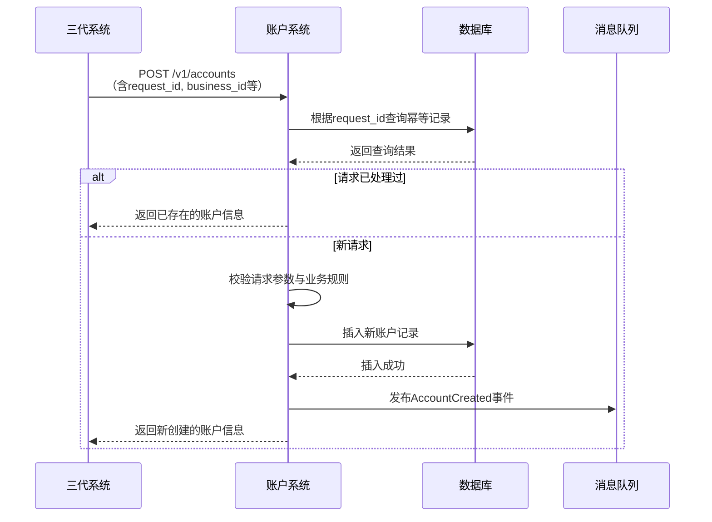
```mermaid
sequenceDiagram
    participant 三代系统
    participant 账户系统
    participant 数据库
    participant 消息队列

    三代系统->>账户系统: POST /v1/accounts<br/>（含request_id, business_id等）
    账户系统->>数据库: 根据request_id查询幂等记录
    数据库-->>账户系统: 返回查询结果
    alt 请求已处理过
        账户系统-->>三代系统: 返回已存在的账户信息
    else 新请求
        账户系统->>账户系统: 校验请求参数与业务规则
        账户系统->>数据库: 插入新账户记录
        数据库-->>账户系统: 插入成功
        账户系统->>消息队列: 发布AccountCreated事件
        账户系统-->>三代系统: 返回新创建的账户信息
    end
```

### 6. 错误处理
- **预期错误情况与处理策略**:
    - `INVALID_PARAMETER` (HTTP 400): 请求参数缺失或格式错误。返回具体字段错误信息。
    - `ACCOUNT_CONFLICT` (HTTP 409): 违反账户唯一性规则（如重复开户）。返回冲突的账户ID。
    - `IDEMPOTENCY_CONFLICT` (HTTP 409): `request_id` 冲突，但业务数据不一致。需人工介入处理。
    - `DEPENDENCY_UNAVAILABLE` (HTTP 503): 依赖服务（如数据库、消息队列）暂时不可用。系统应记录错误日志，并向上游返回可重试的错误。可配置有限次数的重试机制。
    - `INTERNAL_ERROR` (HTTP 500): 未预期的系统内部错误。记录详细日志并告警。
- **重试策略**: 对于因依赖服务短暂故障导致的失败，调用方（三代系统）可按照退避策略进行重试。账户系统自身对下游（如消息队列）的调用也应具备重试机制。

### 7. 依赖关系
- **上游模块**:
    - **三代系统**: 调用本系统的开户接口，是主要的服务消费者。
- **下游模块**:
    - **行业钱包系统**: 订阅 `AccountCreated` 事件，获取账户数据以进行后续的业务关系绑定与处理。账户系统是其底层账户数据的提供者。
    - **清结算系统**: 可能通过行业钱包系统或直接查询账户信息，用于执行账户冻结等操作。依赖关系为间接依赖。
- **内部依赖**:
    - 数据库 (用于持久化 `tiancai_accounts`)
    - 消息队列 (用于发布 `AccountCreated` 事件)

<a id="module-2"></a>

## 3.2 认证系统


### 1. 概述
- **目的与范围**: 认证系统是提供身份与账户有效性验证能力的中心化服务。其核心职责是为电子签约平台等上游系统提供"打款验证"和"人脸验证"接口，以支持天财分账业务中"关系绑定"流程的身份认证环节。本模块不负责协议签署、流程编排或业务逻辑处理，仅专注于验证本身。验证结果由电子签约平台接收，并由其负责更新行业钱包系统中的绑定关系状态。

### 2. 接口设计
- **API端点 (REST/GraphQL)**:
    - `POST /api/v1/payment-verification/initiate`: 发起打款验证。
    - `POST /api/v1/payment-verification/confirm`: 确认（回填）打款验证。
    - `POST /api/v1/face-verification`: 发起人脸验证。
    - `GET /api/v1/verifications/{id}`: 查询验证请求状态。
- **请求/响应结构**:
    - 发起打款验证请求 (`POST /api/v1/payment-verification/initiate`):
        - 请求体: `{ "requestId": "string", "userId": "string", "bankAccount": { "accountNo": "string", "accountName": "string", "bankCode": "string" }, "callbackUrl": "string" }`
        - 响应体: `{ "verificationId": "string", "status": "PENDING" }`
    - 确认打款验证请求 (`POST /api/v1/payment-verification/confirm`):
        - 请求体: `{ "verificationId": "string", "filledAmount": "string", "remark": "string" }`
        - 响应体: `{ "verificationId": "string", "status": "SUCCESS/FAILED", "message": "string" }`
    - 人脸验证请求 (`POST /api/v1/face-verification`):
        - 请求体: `{ "requestId": "string", "userId": "string", "name": "string", "idNumber": "string", "faceImage": "base64_string", "callbackUrl": "string" }`
        - 响应体: `{ "verificationId": "string", "status": "PROCESSING" }`
- **发布/消费的事件**: TBD

### 3. 数据模型
- **表/集合**:
    - `verification_requests`: 验证请求主表。
        - 关键字段: `id` (主键), `type` (ENUM: `PAYMENT`, `FACE`), `user_id`, `request_id` (外部请求ID), `status` (ENUM: `PENDING`, `PROCESSING`, `SUCCESS`, `FAILED`, `EXPIRED`), `callback_url`, `result_data` (JSON), `expires_at`, `created_at`, `updated_at`。
    - `payment_attempts`: 打款验证详情表。
        - 关键字段: `id` (主键), `verification_id` (外键), `bank_account_info` (JSON), `random_amount` (加密存储), `payment_status`, `external_payment_ref`, `created_at`。
- **与其他模块的关系**: 本模块由电子签约平台调用，以完成签约与认证流程。验证结果（如打款验证回填金额、人脸核验结果）需返回给调用方（电子签约平台），并由电子签约平台负责更新行业钱包系统中的绑定关系状态。

### 4. 业务逻辑
- **核心工作流/算法**:
    1.  **打款验证流程**:
        - 接收调用方请求，包含待验证的银行卡信息。
        - 生成并安全存储一笔随机金额。
        - 向指定银行卡发起小额打款。
        - 将验证请求状态置为 `PENDING`，并设置过期时间（如24小时）。
        - 等待并接收用户回填的金额与备注信息。
        - 比对回填信息与发起打款的信息，验证账户的有效性与控制权。
        - 更新验证请求状态为 `SUCCESS` 或 `FAILED`，并通过回调URL通知调用方。
    2.  **人脸验证流程**:
        - 接收调用方请求，包含姓名、身份证号和人脸图像信息。
        - 将验证请求状态置为 `PROCESSING`。
        - 调用底层人脸识别服务，比对姓名、身份证和人脸信息的一致性。
        - 接收核验结果，更新验证请求状态为 `SUCCESS` 或 `FAILED`，并通过回调URL通知调用方。
- **业务规则与验证**:
    - 打款验证的金额需为随机生成，并在传输和存储过程中加密，确保安全性。
    - 人脸验证需遵循相关法规，确保个人信息安全。人脸图像等敏感个人身份信息（PII）在处理完成后的一段有限时间（如7天）内必须被安全删除。
    - 需记录验证请求与结果日志，用于审计。
    - 所有验证请求均应有状态（`PENDING`, `PROCESSING`, `SUCCESS`, `FAILED`, `EXPIRED`）和生命周期管理，过期请求自动标记为 `EXPIRED`。
- **关键边界情况处理**:
    - 打款验证中，用户多次回填错误：应设置尝试次数上限（如3次），达到上限后将验证状态标记为 `FAILED`。
    - 人脸验证网络超时或服务不可用：应实现熔断机制，返回明确的错误码，并允许调用方根据策略重试。
    - 验证请求参数非法：应进行参数校验（如身份证格式、银行卡号Luhn校验），并返回具体错误信息。

### 5. 时序图
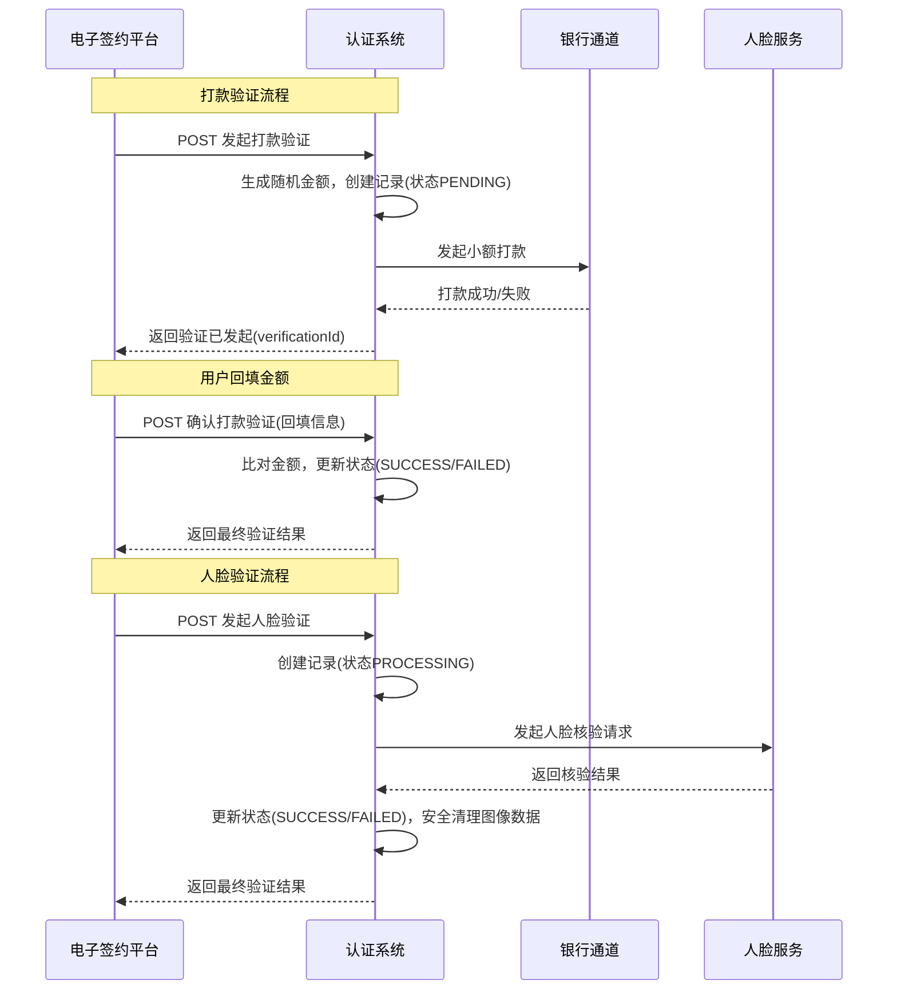
```mermaid
sequenceDiagram
    participant 电子签约平台
    participant 认证系统
    participant 银行通道
    participant 人脸服务

    Note over 电子签约平台, 认证系统: 打款验证流程
    电子签约平台->>认证系统: POST 发起打款验证
    认证系统->>认证系统: 生成随机金额，创建记录(状态PENDING)
    认证系统->>银行通道: 发起小额打款
    银行通道-->>认证系统: 打款成功/失败
    认证系统-->>电子签约平台: 返回验证已发起(verificationId)

    Note over 电子签约平台, 认证系统: 用户回填金额
    电子签约平台->>认证系统: POST 确认打款验证(回填信息)
    认证系统->>认证系统: 比对金额，更新状态(SUCCESS/FAILED)
    认证系统-->>电子签约平台: 返回最终验证结果

    Note over 电子签约平台, 认证系统: 人脸验证流程
    电子签约平台->>认证系统: POST 发起人脸验证
    认证系统->>认证系统: 创建记录(状态PROCESSING)
    认证系统->>人脸服务: 发起人脸核验请求
    人脸服务-->>认证系统: 返回核验结果
    认证系统->>认证系统: 更新状态(SUCCESS/FAILED)，安全清理图像数据
    认证系统-->>电子签约平台: 返回最终验证结果
```

### 6. 错误处理
- **预期错误情况**:
    - `400 Bad Request`: 输入参数校验失败（如身份证格式错误、银行卡号无效、请求体格式错误）。
    - `404 Not Found`: 验证记录 (`verificationId`) 不存在。
    - `409 Conflict`: 验证请求已过期或处于不可回填状态。
    - `422 Unprocessable Entity`: 业务逻辑错误（如回填金额不匹配、人脸比对失败）。
    - `502 Bad Gateway`: 下游服务（银行通道、人脸服务）调用失败或返回不可用。
    - `504 Gateway Timeout`: 调用下游服务网络超时。
- **处理策略**:
    - 对依赖的外部服务（银行通道、人脸服务）实现熔断器模式，防止级联故障。配置熔断阈值（如5分钟内失败50%请求）和半开状态探测。
    - 定义清晰的错误码枚举（如 `INVALID_PARAMETER`, `VERIFICATION_EXPIRED`, `PAYMENT_MISMATCH`, `FACE_MATCH_FAILED`, `EXTERNAL_SERVICE_UNAVAILABLE`）和用户友好的错误信息。
    - 对于网络波动导致的失败，对下游服务调用实现带退避策略的重试机制（如最多3次，指数退避）。
    - 所有错误均记录详细日志（包含请求ID、验证ID、错误码和上下文），但敏感信息需脱敏。

### 7. 依赖关系
- **上游模块**: 电子签约平台（主要调用方，负责发起验证请求并接收结果，进而更新行业钱包系统状态）。
- **下游模块**:
    - 银行通道服务（用于执行小额打款）。
    - 第三方人脸识别服务（用于执行人脸核验）。
- **数据与流程关联**:
    - 行业钱包系统：不直接依赖。认证系统的验证结果是"关系绑定"流程的关键输入，由电子签约平台在认证通过后，调用行业钱包系统的接口更新绑定关系状态。

<a id="module-3"></a>

## 3.3 清结算系统


### 1. 概述
- **目的与范围**: 本模块是天财分账业务的核心资金处理模块，负责处理结算配置、退货账户查询、专用账户冻结及计费信息同步。其边界在于接收来自**三代系统**的结算配置指令、来自**业务核心系统**的交易触发指令，执行与资金清分、结算相关的操作，并与底层**账户系统**、**计费中台**等协同，确保资金流转的正确性与合规性。

### 2. 接口设计
- **API端点 (REST/GraphQL)**:
    - `POST /api/v1/settlement/config`: 创建或更新结算配置。
    - `GET /api/v1/account/refund/{accountId}`: 查询用于退货/退款的天财专用账户信息。
    - `POST /api/v1/account/freeze`: 对天财专用账户执行冻结或解冻操作。
    - `POST /api/v1/billing/sync`: 同步单笔交易的计费信息。
- **请求/响应结构**:
    - 结算配置请求: `{ "merchantId": "string", "settlementMode": "ACTIVE/PASSIVE", "settlementAccountId": "string", "feeBearer": "PAYER/PAYEE" }`
    - 退货账户查询响应: `{ "accountId": "string", "accountType": "string", "status": "NORMAL/FROZEN" }`
    - 账户冻结请求: `{ "accountId": "string", "operation": "FREEZE/UNFREEZE", "reason": "string" }`
    - 计费信息同步请求: `{ "transactionId": "string", "feeAmount": "number", "feeType": "string" }`
    - 通用响应: `{ "code": "string", "message": "string", "data": "object" }`
- **发布/消费的事件**:
    - 消费事件: `SettlementTriggeredEvent` (由业务核心系统发布，包含交易ID、金额、参与方信息，用于触发结算流程)。
    - 发布事件: `SettlementCompletedEvent` (结算完成后发布，包含结算结果、关联账户及费用信息)。

### 3. 数据模型
- **表/集合**:
    - `settlement_config`: 结算配置表。
    - `account_freeze_record`: 账户冻结操作记录表。
    - `billing_sync_log`: 计费信息同步日志表。
- **关键字段**:
    - `settlement_config`: `id`, `merchant_id` (关联三代系统商户), `settlement_mode` (主动/被动), `settlement_account_id` (天财收款账户ID), `fee_bearer` (手续费承担方), `status`, `created_at`, `updated_at`。
    - `account_freeze_record`: `id`, `account_id` (天财专用账户ID), `operation`, `reason`, `operator`, `created_at`。
    - `billing_sync_log`: `id`, `transaction_id`, `fee_amount`, `fee_type`, `sync_status`, `error_message`, `created_at`。
- **与其他模块的关系**: 本模块需要与**账户系统**交互以操作天财专用账户（如冻结、查询状态），与**计费中台**交互以同步计费信息，与**三代系统**交互以获取结算账户与手续费配置，与**业务核心系统**交互以接收结算触发事件。

### 4. 业务逻辑
- **核心工作流/算法**:
    1.  **结算配置处理**: 根据三代系统的配置请求，为天财业务设置结算规则，包括区分主动结算（至天财收款账户）与被动结算（至默认待结算账户）。配置需与商户ID强关联并持久化。
    2.  **退货账户查询**: 在处理退款或退货业务时，根据提供的账户标识，查询**账户系统**并返回对应的天财专用账户（即天财接收方账户）的详细信息及状态。
    3.  **专用账户冻结**: 接收指令，对指定的天财专用账户执行冻结或解冻操作。操作前需校验账户状态及操作权限，操作后需记录审计日志。
    4.  **计费信息同步**: 在结算流程中，将转账交易中产生的计费信息（如手续费）异步同步至计费中台，并记录同步状态以备核查。
    5.  **交易触发结算**: 监听来自**业务核心系统**的`SettlementTriggeredEvent`事件，根据事件中的商户ID查找对应的结算配置，驱动资金清分与结算流程。
- **业务规则与验证**:
    - 冻结/解冻操作需验证操作权限及账户当前状态（如不可重复冻结已冻结账户）。
    - 结算配置需与天财业务的商户标识（来自三代系统）唯一关联。
    - 触发结算前，必须验证目标天财专用账户状态正常（非冻结）。
- **关键边界情况与一致性考虑**:
    - **并发控制**: 对同一账户的冻结与结算请求需通过数据库乐观锁或分布式锁进行串行化处理，防止状态冲突。
    - **数据一致性**: 结算配置的保存与向计费中台的初次信息同步，应通过本地事务表与异步重试机制确保最终一致性。
    - 处理结算时，若目标天财专用账户状态异常（如冻结），需阻断结算流程并返回明确错误。

### 5. 时序图

#### 5.1 结算配置处理
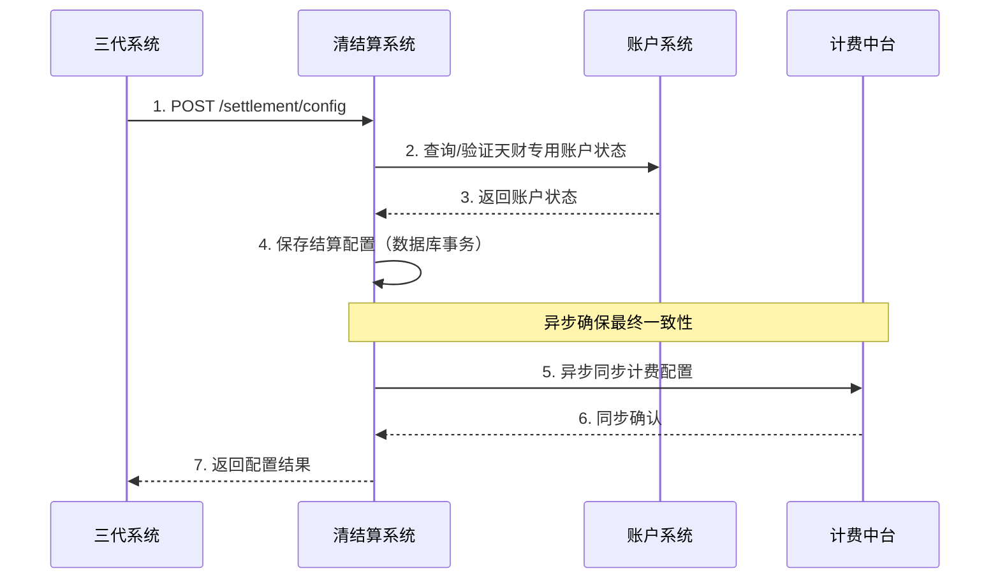
```mermaid
sequenceDiagram
    participant 三代系统
    participant 清结算系统
    participant 账户系统
    participant 计费中台

    三代系统->>清结算系统: 1. POST /settlement/config
    清结算系统->>账户系统: 2. 查询/验证天财专用账户状态
    账户系统-->>清结算系统: 3. 返回账户状态
    清结算系统->>清结算系统: 4. 保存结算配置（数据库事务）
    Note over 清结算系统,计费中台: 异步确保最终一致性
    清结算系统->>计费中台: 5. 异步同步计费配置
    计费中台-->>清结算系统: 6. 同步确认
    清结算系统-->>三代系统: 7. 返回配置结果
```

#### 5.2 退货账户查询
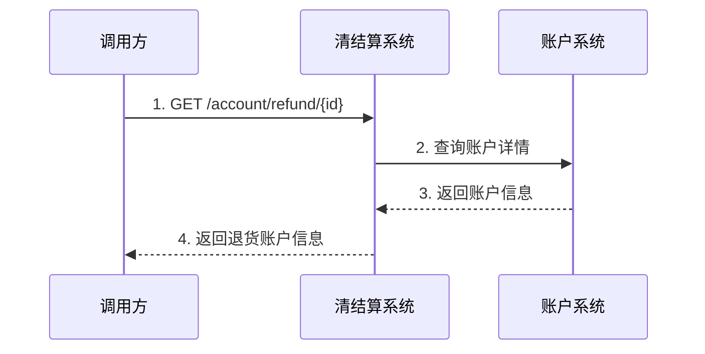
```mermaid
sequenceDiagram
    participant 调用方
    participant 清结算系统
    participant 账户系统

    调用方->>清结算系统: 1. GET /account/refund/{id}
    清结算系统->>账户系统: 2. 查询账户详情
    账户系统-->>清结算系统: 3. 返回账户信息
    清结算系统-->>调用方: 4. 返回退货账户信息
```

#### 5.3 专用账户冻结
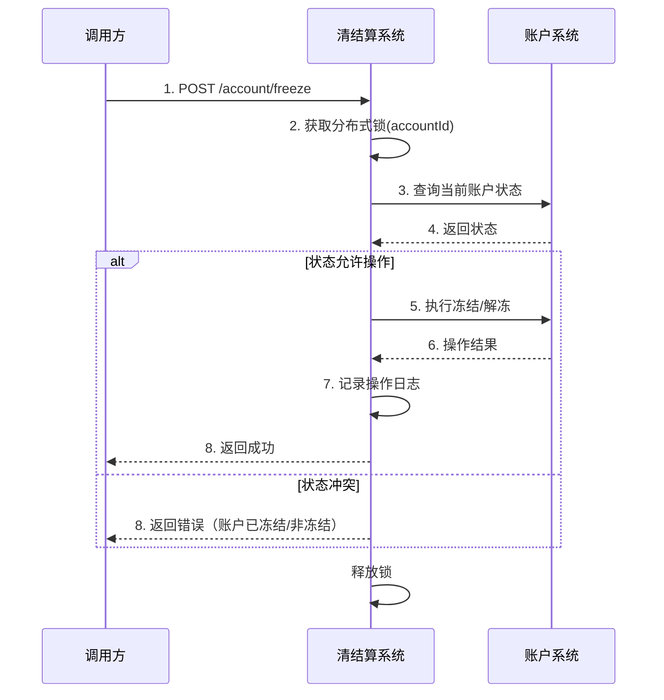
```mermaid
sequenceDiagram
    participant 调用方
    participant 清结算系统
    participant 账户系统

    调用方->>清结算系统: 1. POST /account/freeze
    清结算系统->>清结算系统: 2. 获取分布式锁(accountId)
    清结算系统->>账户系统: 3. 查询当前账户状态
    账户系统-->>清结算系统: 4. 返回状态
    alt 状态允许操作
        清结算系统->>账户系统: 5. 执行冻结/解冻
        账户系统-->>清结算系统: 6. 操作结果
        清结算系统->>清结算系统: 7. 记录操作日志
        清结算系统-->>调用方: 8. 返回成功
    else 状态冲突
        清结算系统-->>调用方: 8. 返回错误（账户已冻结/非冻结）
    end
    清结算系统->>清结算系统: 释放锁
```

#### 5.4 交易触发结算与计费同步
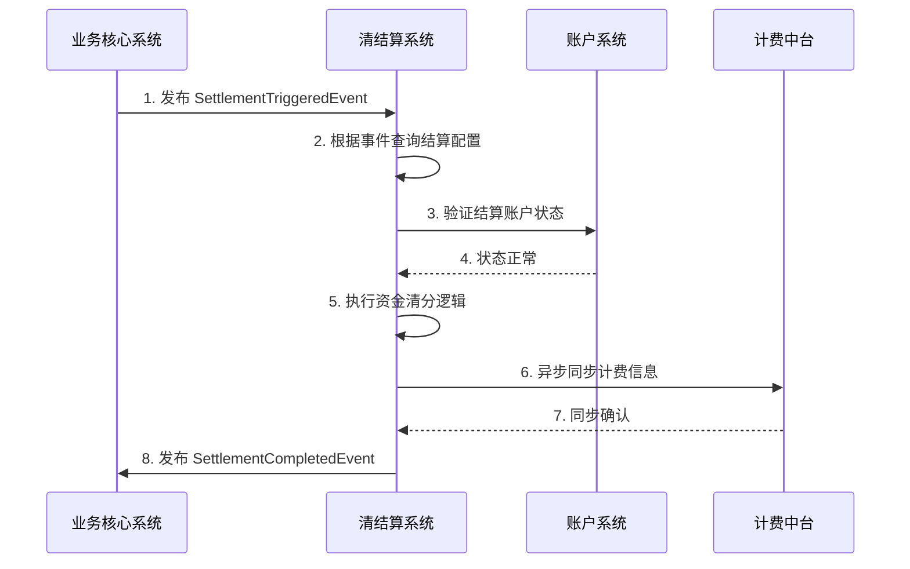
```mermaid
sequenceDiagram
    participant 业务核心系统
    participant 清结算系统
    participant 账户系统
    participant 计费中台

    业务核心系统->>清结算系统: 1. 发布 SettlementTriggeredEvent
    清结算系统->>清结算系统: 2. 根据事件查询结算配置
    清结算系统->>账户系统: 3. 验证结算账户状态
    账户系统-->>清结算系统: 4. 状态正常
    清结算系统->>清结算系统: 5. 执行资金清分逻辑
    清结算系统->>计费中台: 6. 异步同步计费信息
    计费中台-->>清结算系统: 7. 同步确认
    清结算系统->>业务核心系统: 8. 发布 SettlementCompletedEvent
```

### 6. 错误处理
- **预期错误情况**:
    - 目标账户不存在或状态异常（如已冻结）。
    - 与下游系统（账户系统、计费中台）通信失败或超时。
    - 结算配置参数不合法或与现有配置冲突。
    - 并发操作冲突（如同时冻结与结算）。
- **处理策略**:
    - **重试与退避**: 对下游系统非幂等的查询类接口，设置最大3次重试，采用指数退避策略（如 1s, 2s, 4s）。对计费同步等幂等操作，采用更积极的重试策略。
    - **熔断机制**: 对账户系统、计费中台依赖配置熔断器（如连续5次失败后熔断30秒），防止级联故障。
    - **错误码与日志**: 定义结构化错误码（如 `ACCOUNT_FROZEN`, `DOWNSTREAM_TIMEOUT`），并记录包含请求ID、账户ID、错误详情在内的全链路日志。
    - **事务补偿**: 对于因下游系统失败导致的不一致状态（如配置已保存但计费同步失败），通过后台作业定期扫描`billing_sync_log`表中的失败记录进行补偿同步。

### 7. 依赖关系
- **上游模块**:
    - **三代系统**: 提供商户标识，发起结算配置的创建与更新。
    - **业务核心系统**: 发布`SettlementTriggeredEvent`事件，触发具体的结算执行流程。
- **下游模块**:
    - **账户系统**: 提供天财专用账户的状态查询、冻结/解冻操作能力。
    - **计费中台**: 接收并处理交易产生的计费信息同步请求。

<a id="module-4"></a>

## 3.4 计费中台


### 1. 概述
- **目的与范围**: 计费中台模块的核心职责是为系统内其他业务模块提供中心化的转账计费能力。其边界在于接收计费请求，根据业务规则计算转账手续费，并返回计费结果。它不负责具体的资金划转、账户管理或交易处理。
- **与其他系统的关系**: 本模块主要服务于**行业钱包系统**，为其处理的分账请求提供计费服务。计费规则可能由**三代系统**进行配置。计费结果可能需要同步给**清结算系统**用于结算。**电子签约平台**在签约流程中可能不直接调用本模块，但签约生成的业务场景和手续费承担方配置是计费计算的关键输入。

### 2. 接口设计
- **API端点 (REST/GraphQL)**:
    - `POST /api/v1/fee/calculate`: 计算手续费。
- **请求/响应结构**:
    - **请求体**:
        - `business_scenario` (String): 业务场景，枚举值：`COLLECTION`（归集）、`BATCH_PAYMENT`（批量付款）、`MEMBER_SETTLEMENT`（会员结算）。
        - `amount` (Decimal): 交易金额。
        - `fee_payer` (String): 手续费承担方，枚举值：`PAYER`（付方）、`RECEIVER`（收方）。
        - `settlement_mode` (String): 结算模式，枚举值：`ACTIVE`（主动结算）、`PASSIVE`（被动结算）。
        - `merchant_id` (String): 商户标识。
    - **响应体**:
        - `fee_amount` (Decimal): 计算出的手续费金额。
        - `currency` (String): 币种。
        - `calculation_rule_id` (String): 所应用的计费规则ID。
- **发布/消费的事件**: TBD

### 3. 数据模型
- **表/集合**:
    - `fee_rule` (计费规则表): 存储不同业务场景和模式下的费率配置。
    - `fee_transaction_log` (计费交易日志表): 记录每次计费请求和结果，用于对账和审计。
- **关键字段**:
    - `fee_rule` 表:
        - `id` (主键)
        - `business_scenario` (业务场景)
        - `settlement_mode` (结算模式)
        - `fee_payer` (手续费承担方)
        - `rate_type` (费率类型，如：百分比、固定额)
        - `rate_value` (费率值)
        - `min_fee` (最低手续费)
        - `max_fee` (最高手续费)
        - `effective_date` (生效日期)
        - `expiry_date` (失效日期)
        - `merchant_group` (商户组标识，可能来自三代系统配置)
    - `fee_transaction_log` 表:
        - `id` (主键)
        - `request_id` (请求ID)
        - `merchant_id` (商户ID)
        - `business_scenario` (业务场景)
        - `amount` (交易金额)
        - `calculated_fee` (计算手续费)
        - `applied_rule_id` (应用的规则ID)
        - `request_time` (请求时间)
        - `response_time` (响应时间)
        - `status` (状态：成功/失败)
- **与其他模块的关系**: 计费规则的基础配置信息可能源自**三代系统**的商户与手续费配置模块。计费日志可为**对账单系统**提供数据源。

### 4. 业务逻辑
- **核心工作流/算法**:
    1.  接收来自行业钱包系统的计费请求。
    2.  根据请求中的 `business_scenario`、`settlement_mode`、`fee_payer` 以及 `merchant_id`，查询 `fee_rule` 表获取匹配的、且在有效期内的计费规则。
    3.  应用计费规则计算手续费：
        - **百分比费率**: `fee = amount * rate_value`。若 `fee < min_fee`，则 `fee = min_fee`；若定义了 `max_fee` 且 `fee > max_fee`，则 `fee = max_fee`。
        - **固定费率**: `fee = rate_value`。
    4.  返回计算结果，并异步记录日志到 `fee_transaction_log`。
- **业务规则与验证**:
    - **手续费承担方 (`fee_payer`)**: 该参数决定手续费计算结果归属于哪一方，但不影响计算逻辑本身。计算出的 `fee_amount` 将标记由该方承担。
    - **结算模式 (`settlement_mode`)**: 主动结算与被动结算可能对应不同的费率规则。例如，主动结算至天财收款账户与被动结算至默认账户可能适用不同费率。系统通过此字段区分并查找对应规则。
    - **业务场景 (`business_scenario`)**: 归集、批量付款、会员结算等场景有独立的费率规则。
- **关键边界情况处理**:
    - **零金额或极小金额**: 即使金额为0，若规则有最低手续费 (`min_fee`)，则按最低手续费计。
    - **费率配置缺失**: 若无匹配的、生效的计费规则，则视为配置错误，返回明确错误。
    - **无效参数**: 对金额为负等无效参数，请求验证阶段即拒绝。

### 5. 时序图

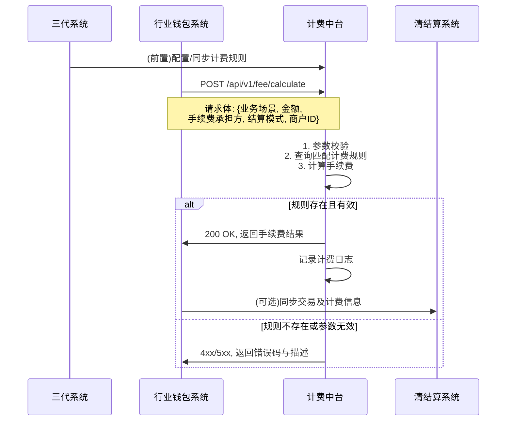
```mermaid
sequenceDiagram
    participant 三代系统 as 三代系统
    participant 钱包系统 as 行业钱包系统
    participant 计费中台 as 计费中台
    participant 清结算 as 清结算系统

    三代系统->>计费中台: (前置)配置/同步计费规则
    钱包系统->>计费中台: POST /api/v1/fee/calculate
    Note over 钱包系统,计费中台: 请求体: {业务场景, 金额,<br/>手续费承担方, 结算模式, 商户ID}
    计费中台->>计费中台: 1. 参数校验<br/>2. 查询匹配计费规则<br/>3. 计算手续费
    alt 规则存在且有效
        计费中台->>钱包系统: 200 OK, 返回手续费结果
        计费中台->>计费中台: 记录计费日志
        钱包系统->>清结算: (可选)同步交易及计费信息
    else 规则不存在或参数无效
        计费中台->>钱包系统: 4xx/5xx, 返回错误码与描述
    end
```

### 6. 错误处理
- **预期错误情况**:
    1.  `FEE_RULE_NOT_FOUND` (404): 未找到匹配的、生效的计费规则。
    2.  `INVALID_PARAMETER` (400): 请求参数无效，如金额为负、枚举值不合法。
    3.  `DEPENDENCY_UNAVAILABLE` (503): 依赖的数据库或内部服务暂时不可用。
- **处理策略**:
    - 对于 `FEE_RULE_NOT_FOUND` 和 `INVALID_PARAMETER`，立即失败，返回明确的错误码和描述，引导调用方检查请求或配置。
    - 对于 `DEPENDENCY_UNAVAILABLE`，采用快速失败策略，返回服务不可用错误。**降级策略（TBD）**：可考虑在架构演进中引入本地缓存，在依赖服务故障时使用最后已知的有效规则进行计算，但当前版本不实现。

### 7. 依赖关系
- **上游模块 (调用方)**:
    - **行业钱包系统**: 主要调用方，在处理分账、归集、批量付款等交易前调用本模块计算手续费。
- **下游模块/服务 (被依赖方)**:
    - **数据库**: 存储计费规则和日志。
    - **清结算系统**: 作为计费结果的潜在消费者，接收行业钱包系统同步的计费信息用于资金结算（此依赖关系由行业钱包系统主导）。
- **配置关联方**:
    - **三代系统**: 作为商户和业务规则的配置中心，其配置的结算账户与手续费信息是本模块 `fee_rule` 数据的重要来源。数据同步机制为 TBD。

<a id="module-5"></a>

## 3.5 业务核心系统


### 1. 概述
- **目的与范围**：业务核心系统是天财分账业务中接收并处理天财分账交易记录的核心模块。其职责是处理由行业钱包系统发起的各类分账交易（归集、批量付款、会员结算）的记录，进行业务校验、状态管理与数据持久化，并为下游系统（如计费中台、清结算系统、对账单系统）提供数据。它不负责账户管理、签约认证或资金流转的直接执行。

### 2. 接口设计
- **API端点 (REST)**：
    - `POST /api/v1/tiancai/split-record`：接收行业钱包系统推送的分账交易记录。
- **请求/响应结构**：
    - **请求体 (application/json)**：
        ```json
        {
          "transaction_id": "string，交易流水号，全局唯一",
          "business_type": "string，业务类型（COLLECTION/BATCH_PAY/MEMBER_SETTLEMENT）",
          "total_amount": "number，交易总金额（单位：分）",
          "status": "string，交易状态（PROCESSING/SUCCESS/FAILED）",
          "payer_id": "string，付方ID（总部或门店）",
          "payee_id": "string，收方ID（总部或门店）",
          "request_time": "string，请求时间戳（ISO 8601）",
          "ext_info": "object，扩展信息（业务特定字段）"
        }
        ```
    - **成功响应 (200)**：
        ```json
        {
          "code": "SUCCESS",
          "message": "处理成功",
          "data": {
            "record_id": "系统生成的记录ID"
          }
        }
        ```
    - **错误响应 (4xx/5xx)**：
        ```json
        {
          "code": "INVALID_DATA",
          "message": "具体错误描述"
        }
        ```
- **发布/消费的事件**：
    - **消费事件**：TBD（从行业钱包系统接收事件）。
    - **发布事件**：交易记录处理完成事件（供对账单系统等下游消费）。事件结构TBD。

### 3. 数据模型
- **核心表**：`tiancai_split_record`（天财分账交易记录表）
- **关键字段**：
    - `id`：主键，记录ID。
    - `transaction_id`：交易流水号，唯一索引。
    - `business_type`：业务类型（枚举：归集、批量付款、会员结算）。
    - `total_amount`：交易总金额（分）。
    - `status`：记录状态（枚举：待处理、处理中、成功、失败）。
    - `payer_id`：付方ID。
    - `payee_id`：收方ID。
    - `request_time`：请求时间。
    - `process_time`：处理完成时间。
    - `fee_amount`：手续费金额（分），TBD。
    - `settlement_ref`：结算参考号，TBD。
    - `error_code`：错误码。
    - `error_message`：错误信息。
    - `created_at`：创建时间。
    - `updated_at`：更新时间。
- **与其他模块的关系**：
    - 接收来自行业钱包系统的分账交易记录数据。
    - 为对账单系统提供交易记录数据以生成账单。
    - 调用计费中台进行转账计费（如适用）。
    - 与清结算系统交互结算配置信息（如适用）。

### 4. 业务逻辑
- **核心工作流**：
    1.  接收行业钱包系统推送的交易记录。
    2.  执行**记录有效性校验**（见下文规则）。
    3.  校验通过后，持久化记录，状态置为"处理中"。
    4.  根据`business_type`触发后续处理：
        - 若业务类型为"批量付款"或"会员结算"，则调用计费中台计算手续费。
        - 若涉及结算配置，则同步信息至清结算系统。
    5.  更新记录状态为"成功"或"失败"，并记录处理时间。
    6.  发布交易记录处理完成事件。
- **业务规则与验证**：
    - **通用校验**：
        1.  必填字段检查：`transaction_id`, `business_type`, `total_amount`, `status`, `payer_id`, `payee_id`, `request_time` 不得为空。
        2.  金额有效性：`total_amount` 必须为正整数。
        3.  业务类型枚举值检查：必须为"归集(COLLECTION)"、"批量付款(BATCH_PAY)"、"会员结算(MEMBER_SETTLEMENT)"之一。
        4.  状态枚举值检查：必须为"处理中(PROCESSING)"、"成功(SUCCESS)"、"失败(FAILED)"之一。
        5.  **幂等性/重复记录检查**：基于`transaction_id`查询数据库，若已存在成功记录，则直接返回成功响应；若存在处理中记录，需根据策略处理（如等待或返回处理中）。
    - **业务类型特定规则**：
        - **归集(COLLECTION)**：验证付方(`payer_id`)为门店，收方(`payee_id`)为总部。
        - **批量付款(BATCH_PAY)**：验证付方(`payer_id`)为总部，收方(`payee_id`)为天财接收方账户。需触发计费。
        - **会员结算(MEMBER_SETTLEMENT)**：验证付方(`payer_id`)为总部，收方(`payee_id`)为门店。需触发计费。
    - **状态与金额一致性校验**：将接收到的记录状态与系统内可能存在的该交易前置状态进行比对，若状态回退或金额不一致，则记录异常并告警。
- **关键边界情况处理**：
    - **重复推送**：通过`transaction_id`实现幂等处理。
    - **下游系统调用失败**：采用重试机制（见错误处理章节）。
    - **数据不一致**：记录异常日志，并触发人工复核流程。

### 5. 时序图

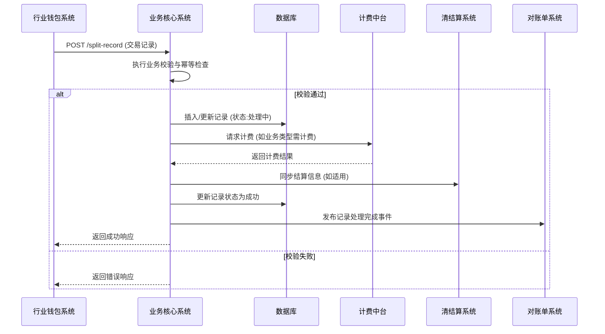
```mermaid
sequenceDiagram
    participant 行业钱包系统
    participant 业务核心系统
    participant 数据库
    participant 计费中台
    participant 清结算系统
    participant 对账单系统

    行业钱包系统->>业务核心系统: POST /split-record (交易记录)
    业务核心系统->>业务核心系统: 执行业务校验与幂等检查
    alt 校验通过
        业务核心系统->>数据库: 插入/更新记录 (状态:处理中)
        业务核心系统->>计费中台: 请求计费 (如业务类型需计费)
        计费中台-->>业务核心系统: 返回计费结果
        业务核心系统->>清结算系统: 同步结算信息 (如适用)
        业务核心系统->>数据库: 更新记录状态为成功
        业务核心系统->>对账单系统: 发布记录处理完成事件
        业务核心系统-->>行业钱包系统: 返回成功响应
    else 校验失败
        业务核心系统-->>行业钱包系统: 返回错误响应
    end
```

### 6. 错误处理
- **预期错误情况**：
    1.  **数据错误**：请求数据格式错误、字段缺失、值无效。
    2.  **业务错误**：违反业务规则（如身份不符、重复交易）。
    3.  **系统错误**：数据库操作失败、下游服务（计费中台、清结算系统）调用超时或失败。
- **处理策略**：
    - **数据/业务错误**：立即向行业钱包系统返回4xx错误，包含明确错误码（如`INVALID_DATA`, `DUPLICATE_TRANSACTION`）和描述。
    - **下游系统调用失败**：
        - **重试机制**：采用指数退避策略进行重试。最大重试次数：3次。初始延迟：1秒，后续延迟依次为2秒、4秒。
        - **幂等性**：所有向下游系统的调用需携带唯一请求ID，确保重试的幂等性。
        - **失败降级**：若重试后仍失败，则将交易记录状态标记为"失败"，记录详细错误日志，并触发告警通知人工介入。
    - **数据库错误**：进行事务回滚，返回5xx系统错误，并告警。

### 7. 依赖关系
- **上游模块**：
    - **行业钱包系统（核心依赖）**：提供分账交易记录。
- **下游模块**：
    - **计费中台**：依赖其进行批量付款和会员结算业务的转账计费。
    - **清结算系统**：依赖其同步结算配置信息。
    - **对账单系统**：为其提供处理完成的交易记录数据以生成账单。

<a id="module-6"></a>

## 3.6 钱包APP/商服平台


### 1. 概述
- **目的与范围**：本模块是面向商户（如天财业务中的总部与门店）的操作平台。它是一个独立的商服平台，可通过H5或小程序等形式集成到钱包APP中，也可作为独立的Web应用部署。其核心职责是为商户提供天财分账业务相关的操作界面与前端逻辑，例如查看账户信息、发起或管理归集/批量付款/会员结算流程、处理关系绑定与开通付款的授权签约、查询账单等。其边界在于提供用户交互界面、前端状态管理以及与后端服务的接口调用，不包含底层业务处理与核心系统逻辑。
- **部署与集成**：本模块是一个独立的前端应用。它通过API与后端服务通信，并通过WebView或SDK方式嵌入到钱包APP中，为商户提供统一的业务操作入口。

### 2. 接口设计
- **API端点 (REST)**：本模块作为前端应用，主要消费后端服务提供的RESTful API。关键接口类别包括：
    - **商户信息接口**：从三代系统获取商户基础信息、角色（总部/门店）及业务配置。
    - **账户与绑定状态接口**：从行业钱包系统查询天财专用账户信息、关系绑定状态及授权开通状态。
    - **业务发起接口**：向行业钱包系统提交归集、批量付款、会员结算的请求。
    - **账单查询接口**：从对账单系统获取天财分账、提款、收单、结算等各类账单。
    - **签约跳转接口**：从电子签约平台获取特定业务场景的签约H5页面地址。
- **请求/响应结构**：TBD（由各后端服务定义）。
- **发布/消费的事件**：本模块作为前端，主要监听用户交互事件和网络状态事件，不主动发布业务领域事件。它消费后端服务通过接口返回的业务状态变更信息。

### 3. 数据模型
本节描述前端应用内部管理的客户端数据结构和状态模型，不涉及服务端持久化。
- **客户端状态模型**：
    - **用户会话 (UserSession)**: 存储登录态、用户标识（商户ID）、角色（总部/门店）、令牌等信息。
    - **应用配置 (AppConfig)**: 存储API端点、功能开关、静态文案等配置信息。
    - **商户上下文 (MerchantContext)**: 缓存当前商户的基础信息、所属天财机构标识、可用业务场景列表。
- **业务视图模型 (View Models)**：
    - **账户视图 (AccountView)**: 用于界面展示的天财收款/接收方账户信息，包括账户状态、绑定银行卡列表、默认提现卡等。
    - **绑定关系视图 (BindingView)**: 展示当前商户在归集、批量付款、会员结算各场景下的关系绑定状态（未绑定/已绑定/已过期）及付方开通状态。
    - **业务单视图 (OrderView)**: 用于展示和提交归集、批量付款、会员结算请求的表单数据模型及结果状态。
    - **账单视图 (BillView)**: 用于展示账单列表和详情的视图模型，包含账单类型、周期、金额、状态等字段。
- **本地持久化策略**：
    - **持久化数据**：用户登录令牌、用户偏好设置（如上次查询的账单类型）将使用本地存储（如LocalStorage）进行持久化，以提升用户体验。
    - **缓存策略**：对相对静态的数据（如商户信息、业务配置）和频繁查询的数据（如账户状态）实施内存缓存，并设置合理的过期时间。账单列表等数据使用分页加载，不进行全量缓存。

### 4. 业务逻辑
- **核心工作流/算法**：
    1.  **关系绑定流程**：
        - **入口**：商户在功能入口（如"归集管理"、"批量付款"）点击"去签约"。
        - **角色判断**：根据当前用户角色（总部/门店）和业务场景，确定绑定关系中的身份（付方或收方）。
        - **状态检查**：调用行业钱包系统接口，检查是否已存在有效绑定。
        - **跳转签约**：若未绑定，调用电子签约平台接口，获取携带了场景、身份等参数的签约H5页面地址，并在应用内WebView中加载。
        - **结果同步**：监听WebView回调或轮询绑定状态，成功后更新本地状态并提示用户。
    2.  **开通付款流程**（适用于批量付款和会员结算场景）：
        - **前提**：付方（总部或门店-对公企业）已完成基础的关系绑定。
        - **触发**：当付方首次尝试发起批量付款或会员结算时，若检测到未开通付款授权，则引导进入开通流程。
        - **流程**：与关系绑定流程类似，但签约协议内容为付款专项授权。调用电子签约平台特定接口获取开通付款的H5页面。
        - **状态管理**：独立于关系绑定状态，专门记录"付款开通状态"。
    3.  **业务发起与查询流程**：
        - **归集发起**（总部操作）：
            - 校验：总部角色、已绑定归集关系、门店账户状态正常。
            - 表单：选择门店（付方）、输入归集金额、选择手续费承担方。
            - 提交：调用行业钱包系统归集接口。
        - **批量付款发起**（总部操作）：
            - 校验：总部角色、已绑定批量付款关系、已开通付款授权、接收方账户状态正常。
            - 表单：上传付款文件（或录入列表）、选择接收方账户、确认总金额。
            - 提交：调用行业钱包系统批量付款接口。
        - **会员结算发起**（总部操作）：
            - 校验：总部角色、已绑定会员结算关系、已开通付款授权、门店（收方）账户状态正常。
            - 表单：选择结算周期、确认结算金额明细。
            - 提交：调用行业钱包系统会员结算接口。
        - **账单查询**（总部/门店均可）：
            - 根据角色过滤可查看的账单类型（如门店可能只能查看被归集账单）。
            - 提供按时间、类型、状态等多维度查询和分页加载。
- **业务规则与验证**：
    - **角色权限映射**：
        - **总部**：可操作归集发起、批量付款发起、会员结算发起；可查看所有关联门店的账单及自身发起的业务记录。
        - **门店**：不可发起归集、批量付款、会员结算；仅可查看与本门店相关的账单（如被归集记录、会员结算到账记录）及账户信息。
    - **前置状态校验**：在进入每个业务功能页或发起请求前，调用接口校验必要的绑定关系与付款开通状态，并引导未完成的用户前往办理。
    - **前端表单校验**：对金额（格式、范围）、必填项、文件格式（如批量付款文件）进行即时校验。
- **关键边界情况处理**：
    - 网络异常或后端服务不可用时，显示统一网络错误提示页，并提供重试机制。
    - 在签约或认证H5页面中，用户操作中断或失败时，捕获回调并引导用户返回平台重试或查看帮助。
    - 处理业务异步处理状态：提交后显示"处理中"，通过轮询或WebSocket（若支持）获取最终状态（成功/失败），并展示相应结果页。

### 5. 时序图

#### 5.1 关系绑定时序图
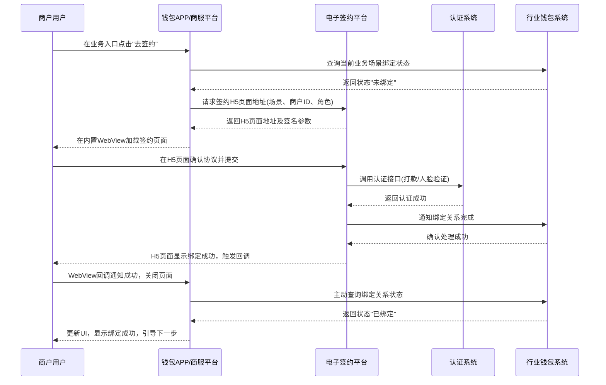
```mermaid
sequenceDiagram
    participant U as 商户用户
    participant A as 钱包APP/商服平台
    participant E as 电子签约平台
    participant V as 认证系统
    participant W as 行业钱包系统

    U->>A: 在业务入口点击"去签约"
    A->>W: 查询当前业务场景绑定状态
    W-->>A: 返回状态"未绑定"
    A->>E: 请求签约H5页面地址(场景、商户ID、角色)
    E-->>A: 返回H5页面地址及签名参数
    A-->>U: 在内置WebView加载签约页面
    U->>E: 在H5页面确认协议并提交
    E->>V: 调用认证接口(打款/人脸验证)
    V-->>E: 返回认证成功
    E->>W: 通知绑定关系完成
    W-->>E: 确认处理成功
    E-->>U: H5页面显示绑定成功，触发回调
    U->>A: WebView回调通知成功，关闭页面
    A->>W: 主动查询绑定关系状态
    W-->>A: 返回状态"已绑定"
    A-->>U: 更新UI，显示绑定成功，引导下一步
```

#### 5.2 批量付款发起时序图
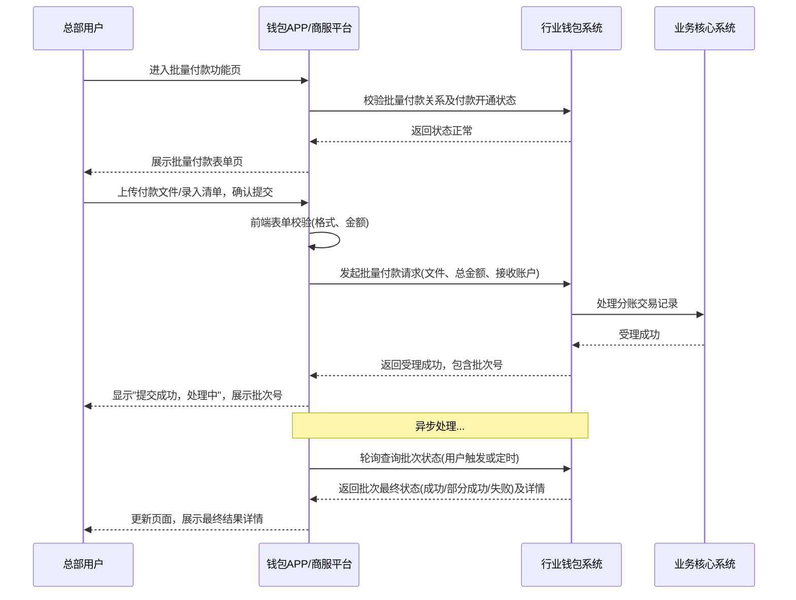
```mermaid
sequenceDiagram
    participant U as 总部用户
    participant A as 钱包APP/商服平台
    participant W as 行业钱包系统
    participant C as 业务核心系统

    U->>A: 进入批量付款功能页
    A->>W: 校验批量付款关系及付款开通状态
    W-->>A: 返回状态正常
    A-->>U: 展示批量付款表单页
    U->>A: 上传付款文件/录入清单，确认提交
    A->>A: 前端表单校验(格式、金额)
    A->>W: 发起批量付款请求(文件、总金额、接收账户)
    W->>C: 处理分账交易记录
    C-->>W: 受理成功
    W-->>A: 返回受理成功，包含批次号
    A-->>U: 显示"提交成功，处理中"，展示批次号
    Note over A, W: 异步处理...
    A->>W: 轮询查询批次状态(用户触发或定时)
    W-->>A: 返回批次最终状态(成功/部分成功/失败)及详情
    A-->>U: 更新页面，展示最终结果详情
```

### 6. 错误处理
- **预期错误情况**：
    - **网络与接口错误**：API调用超时、4xx（如认证失败、参数错误）、5xx（服务端异常）。
    - **业务逻辑错误**：前置条件不满足（如未绑定、未开通付款、账户冻结）、业务规则校验失败（如余额不足、金额超限）。
    - **第三方集成错误**：电子签约平台H5页面加载失败、认证流程异常中断、回调签名验证失败。
    - **客户端错误**：本地存储读写异常、表单数据格式错误。
- **处理策略**：
    - **网络/接口错误**：展示友好的全局错误提示（如"网络开小差，请重试"），并提供重试按钮。记录错误日志（含请求上下文）。
    - **业务逻辑错误**：展示后端返回的、经过处理的友好错误信息，并明确引导用户下一步操作（如"您尚未开通付款权限，请先开通"）。
    - **第三方集成错误**：捕获WebView加载错误或回调异常，引导用户返回平台重试，或提供客服联系渠道。
    - **降级与兼容**：对于非核心功能依赖的接口失败（如部分账单类型查询失败），允许部分功能可用，并给出提示。

### 7. 依赖关系
- **上游模块/服务**：
    - **电子签约平台**：提供签约流程的H5封装与协议管理。**依赖接口**：获取签约页面地址、接收签约结果回调。
    - **行业钱包系统**：提供账户信息、绑定状态查询、业务发起与状态查询接口。**核心依赖**。
    - **三代系统**：提供商户基础信息、角色、业务配置查询接口。**核心依赖**。
    - **对账单系统**：提供各类账单查询与下载接口。**核心依赖**。
    - **认证系统**：能力通过电子签约平台间接调用，不直接依赖。
- **下游模块**：无。本模块为前端表示层，不向其他业务模块提供服务接口。
- **集成方**：
    - **钱包APP**：作为宿主容器，提供WebView环境、用户登录态共享、原生能力（如推送）调用。

<a id="module-7"></a>

## 3.7 三代系统


### 1. 概述
- **目的与范围**: 三代系统是天财分账业务的核心管理平台，负责商户管理、调用账户系统接口为商户开立天财专用账户、配置结算账户与手续费，并对天财机构进行标识。其边界止于业务配置与流程发起，不处理具体的分账、认证等执行逻辑。

### 2. 接口设计
- **API端点 (REST)**:
    - `POST /v1/merchants/tiancai-config`: 为商户配置天财业务并请求开户。
    - `GET /v1/merchants/{merchantId}/tiancai-config`: 查询商户的天财业务配置信息。
    - `PATCH /v1/merchants/{merchantId}/settlement-config`: 更新商户的结算账户与手续费配置。
- **请求/响应结构**:
    - **创建/配置请求体**:
        ```json
        {
          "request_id": "string, 请求唯一标识，用于幂等",
          "business_id": "string, 天财业务标识",
          "merchant_id": "string, 商户ID",
          "settlement_account": "object, 结算账户配置信息",
          "fee_payer": "string, 分账手续费承担方（PAYER/RECEIVER）"
        }
        ```
    - **创建/配置成功响应体**:
        ```json
        {
          "code": "SUCCESS",
          "message": "ok",
          "data": {
            "config_id": "string, 配置记录ID",
            "business_id": "string",
            "merchant_id": "string",
            "tiancai_institution_flag": true,
            "account_id": "string, 关联的天财专用账户ID（如已开户）",
            "settlement_account": "object",
            "fee_payer": "string",
            "status": "string, 配置状态"
          }
        }
        ```
- **发布/消费的事件**:
    - **消费事件**: `AccountCreated`。消费来自账户系统的账户创建成功事件，用于更新本地账户ID。
    - **发布事件**: `MerchantTiancaiConfigured`。当商户天财业务配置完成（包括开户结果）后发布此事件，供行业钱包系统等下游消费者订阅。

### 3. 数据模型
- **表/集合**: `tiancai_merchant_configs`
- **关键字段**:
    - `config_id` (主键): 配置记录唯一标识。
    - `business_id`: 天财业务标识。
    - `merchant_id`: 商户ID。
    - `tiancai_institution_flag`: 布尔值，天财机构标识。`true`表示该商户参与天财业务。
    - `account_id`: 关联的天财专用账户ID（来自账户系统），可为空。
    - `settlement_account`: JSON对象，结算账户配置信息。
    - `fee_payer`: 字符串，分账手续费承担方（PAYER/RECEIVER）。
    - `status`: 配置状态，如 `PENDING`（待开户）、`ACTIVE`（生效）、`FAILED`（开户失败）。
    - `creation_time`: 创建时间。
    - `update_time`: 更新时间。
- **与其他模块的关系**: 本表通过 `account_id` 与账户系统的 `tiancai_accounts` 表关联。通过 `merchant_id` 等字段与行业钱包系统的业务表关联。

### 4. 业务逻辑
- **核心工作流/算法**:
    1.  **商户入驻与标识**: 接收商户天财业务配置请求，校验信息完整性，在`tiancai_merchant_configs`表中创建记录，并将`tiancai_institution_flag`设置为`true`。
    2.  **发起开户**: 为需要天财专用账户的商户，组装请求参数（包括从上游设计已知的`capabilities`字段，如`["ACTIVE_SETTLEMENT", "TIANCAI_SPECIAL"]`），调用账户系统的 `POST /v1/accounts` 接口。使用`request_id`保证幂等。
    3.  **处理开户结果**:
        - 同步结果：接收账户系统接口返回，更新本地`account_id`和`status`。
        - 异步事件：消费`AccountCreated`事件，再次确认并更新本地账户信息。
    4.  **配置管理**: 为商户配置结算账户（如绑定天财收款账户）和分账手续费承担方，更新`settlement_account`和`fee_payer`字段。
    5.  **信息同步**: 当商户配置状态变为`ACTIVE`（开户成功且配置完成）时，发布`MerchantTiancaiConfigured`事件，将商户标识、账户ID及业务配置信息通知给行业钱包系统等下游模块。
- **业务规则与验证**:
    - 确保只有被标识为天财机构（`tiancai_institution_flag`为`true`）的商户才能发起天财专用账户的开户请求。
    - 在调用账户系统开户前，需校验商户信息的完整性与有效性。
    - 手续费承担方的配置需符合业务规则（如归集、批量付款等场景的默认设置）。
    - 调用账户系统时，必须构造包含`capabilities`字段的请求体。
- **关键边界情况处理**:
    - **账户系统调用失败**: 需记录失败日志，将本地配置状态置为`FAILED`，并可能提供重试机制或人工干预入口。
    - **配置冲突**: 同一商户的结算账户或手续费配置发生变更时，需考虑业务生效时间与数据一致性。
    - **事件处理**: 需处理`AccountCreated`事件的重复消费和乱序到达问题，通过幂等和状态机保证最终一致性。

### 5. 时序图
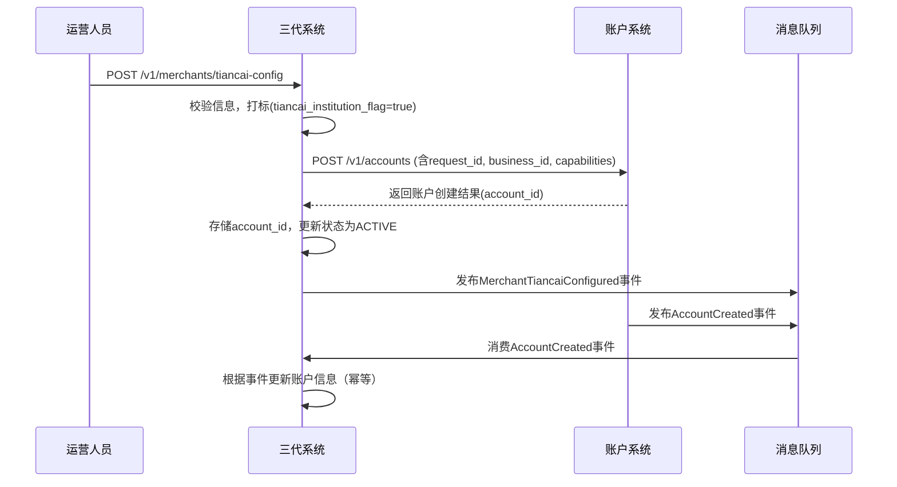
```mermaid
sequenceDiagram
    participant 运营人员
    participant 三代系统
    participant 账户系统
    participant 消息队列

    运营人员->>三代系统: POST /v1/merchants/tiancai-config
    三代系统->>三代系统: 校验信息，打标(tiancai_institution_flag=true)
    三代系统->>账户系统: POST /v1/accounts (含request_id, business_id, capabilities)
    账户系统-->>三代系统: 返回账户创建结果(account_id)
    三代系统->>三代系统: 存储account_id，更新状态为ACTIVE
    三代系统->>消息队列: 发布MerchantTiancaiConfigured事件
    账户系统->>消息队列: 发布AccountCreated事件
    消息队列->>三代系统: 消费AccountCreated事件
    三代系统->>三代系统: 根据事件更新账户信息（幂等）
```

### 6. 错误处理
- **预期错误情况**:
    - `MERCHANT_INFO_INCOMPLETE`: 商户信息不完整，无法发起开户。
    - `ACCOUNT_SERVICE_UNAVAILABLE`: 调用账户系统服务失败或超时。
    - `CONFIGURATION_VALIDATION_FAILED`: 结算账户或手续费配置校验失败。
    - `ACCOUNT_CREATION_FAILED`: 账户系统返回开户失败。
    - `EVENT_PROCESSING_ERROR`: 处理异步事件时发生错误。
- **处理策略**:
    - 对于参数校验失败，直接向操作人员返回错误信息。
    - 对于外部依赖（账户系统）调用失败，记录详细日志并告警，支持操作人员手动重试。
    - 对于异步事件处理失败，记录错误并告警，确保消息队列的重试机制生效。
    - 系统内部错误应记录完整堆栈信息，并进行告警。

### 7. 依赖关系
- **上游模块**:
    - **账户系统**: 依赖其 `POST /v1/accounts` 接口为商户开立天财专用账户，并消费其发布的 `AccountCreated` 事件。
- **下游模块**:
    - **行业钱包系统**: 消费本模块发布的 `MerchantTiancaiConfigured` 事件，获取商户天财标识、账户ID及业务配置，以进行关系绑定、分账处理等业务。
    - **清结算系统**: 可能依赖本模块配置的结算账户与手续费承担方信息（通常通过行业钱包系统间接获取）。
- **内部依赖**:
    - 数据库 (用于持久化 `tiancai_merchant_configs`)
    - 消息队列 (用于发布事件和消费 `AccountCreated` 事件)

<a id="module-8"></a>

## 3.8 电子签约平台


### 1. 概述
- **目的与范围**: 电子签约平台是为天财分账业务提供签约与认证流程编排的中心化服务。其核心职责是管理协议模板、封装H5页面、推送签约短信，并作为流程中枢，调用认证系统完成打款验证和人脸验证，最终将认证结果同步至行业钱包系统以完成关系绑定。本模块不负责具体的资金处理、账户管理或分账逻辑，专注于签约流程的引导、认证的发起与结果处理。

### 2. 接口设计
- **API端点 (REST/GraphQL)**:
    - `POST /api/v1/sign/initiate`: 上游系统（行业钱包系统/三代系统）发起签约流程。
    - `GET /api/v1/sign/status/{signRequestId}`: 查询签约流程状态。
    - `POST /api/v1/sign/callback/payment`: 接收认证系统打款验证结果回调。
    - `POST /api/v1/sign/callback/face`: 接收认证系统人脸验证结果回调。
- **请求/响应结构**:
    - 发起签约请求 (`POST /api/v1/sign/initiate`):
        - 请求体: `{ "requestId": "string", "businessScenario": "ENUM(COLLECTION, BATCH_PAYMENT, MEMBER_SETTLEMENT)", "payerInfo": { "type": "ENUM(HEADQUARTERS, STORE_INDIVIDUAL, STORE_CORPORATE, PERSONAL)", "userId": "string", "name": "string" }, "payeeInfo": { ... }, "extraParams": "JSON" }`
        - 响应体: `{ "signRequestId": "string", "status": "INITIATED", "h5Url": "string" }`
    - 查询状态响应 (`GET /api/v1/sign/status/{signRequestId}`):
        - 响应体: `{ "signRequestId": "string", "status": "ENUM(INITIATED, SIGNED, PAYMENT_VERIFYING, FACE_VERIFYING, ALL_SUCCESS, PARTIAL_FAILURE, FAILED)", "authResults": { "payment": "ENUM(PENDING, SUCCESS, FAILED)", "face": "ENUM(PROCESSING, SUCCESS, FAILED)" }, "message": "string" }`
    - 认证回调请求 (`POST /api/v1/sign/callback/payment` 和 `POST /api/v1/sign/callback/face`):
        - 请求体: `{ "verificationId": "string", "signRequestId": "string", "status": "SUCCESS/FAILED", "message": "string" }`
        - 响应体: `{ "code": "SUCCESS", "message": "string" }`
- **发布/消费的事件**: TBD

### 3. 数据模型
- **表/集合**:
    - `sign_requests`: 签约请求主表。
        - 关键字段: `id` (主键, signRequestId), `external_request_id`, `business_scenario`, `payer_type`, `payer_user_id`, `payee_user_id`, `template_id`, `template_version`, `h5_url`, `sms_sent`, `current_status`, `auth_payment_status`, `auth_face_status`, `wallet_sync_status`, `callback_url`, `expires_at`, `created_at`, `updated_at`。
    - `sign_records`: 签约记录表。
        - 关键字段: `id` (主键), `sign_request_id` (外键), `user_id`, `sign_time`, `ip_address`, `user_agent`, `signed_content_hash`。
    - `auth_attempts`: 认证尝试记录表。
        - 关键字段: `id` (主键), `sign_request_id` (外键), `auth_type` (ENUM: `PAYMENT`, `FACE`), `verification_id` (关联认证系统), `requested_at`, `callback_received_at`, `result_status`, `result_message`。
- **与其他模块的关系**: 本模块是签约流程的编排者。它接收来自上游（如行业钱包系统或三代系统）的签约请求，调用认证系统完成验证，并将最终的签约与认证结果回传给行业钱包系统，以更新绑定关系状态。依赖短信服务推送签约链接。

### 4. 业务逻辑
- **核心工作流/算法**:
    1.  **签约流程编排**:
        - 接收上游系统发起的签约请求，校验必要参数。
        - 根据 `businessScenario` 和 `payerInfo.type` 确定所需的协议模板ID及版本。
        - 生成唯一的 `signRequestId` 和签约H5页面链接，将流程状态初始化为 `INITIATED`。
        - 调用短信服务，向目标用户推送包含H5链接的短信。
    2.  **认证方法决策**:
        - **规则集**:
            - 场景为 `COLLECTION` (归集): 付方（门店）为个人时，需人脸验证；为企业时，需打款验证。
            - 场景为 `BATCH_PAYMENT` (批量付款): 付方（总部）必须完成"开通付款"流程（内含打款验证）。收方若为个人，需人脸验证。
            - 场景为 `MEMBER_SETTLEMENT` (会员结算): 付方（总部）必须完成"开通付款"流程（内含打款验证）。收方（门店）为个人时，需人脸验证。
        - 根据规则，在用户签署协议后，按需调用认证系统接口。
    3.  **认证流程集成**:
        - **打款验证**: 调用认证系统 `POST /api/v1/payment-verification/initiate`，传入银行卡信息及本平台的回调地址。将 `auth_payment_status` 置为 `PENDING`。在H5页面引导用户回填金额，并调用认证系统 `POST /api/v1/payment-verification/confirm` 进行确认。
        - **人脸验证**: 调用认证系统 `POST /api/v1/face-verification`，传入身份信息及本平台的回调地址。将 `auth_face_status` 置为 `PROCESSING`。
        - 接收认证系统的回调 (`/api/v1/sign/callback/payment` 或 `/api/v1/sign/callback/face`)，更新对应的 `auth_payment_status` 或 `auth_face_status`。
    4.  **状态同步与完成**:
        - 监听所有必需认证的回调结果。当全部必需认证状态均为 `SUCCESS` 时，将 `current_status` 更新为 `ALL_SUCCESS`。
        - 调用行业钱包系统的绑定关系更新接口，通知其更新对应业务场景下的绑定关系状态为"已绑定"。
        - 若任一必需认证失败，将 `current_status` 更新为 `PARTIAL_FAILURE` 或 `FAILED`，并记录失败原因。可通过H5页面通知用户。
- **业务规则与验证**:
    - 协议模板需进行版本管理，签约时锁定具体版本。
    - "开通付款"是批量付款和会员结算场景下付方的强制前置流程，其本质是一次特殊的签约与打款验证。
    - 签约H5链接应具备时效性（如24小时），过期后需重新生成。
    - 支持流程状态查询，便于上游系统轮询或用户查看进度。
- **关键边界情况处理**:
    - 用户中途退出：H5链接在有效期内可继续流程，根据 `signRequestId` 恢复状态。
    - 认证系统调用失败：实现带指数退避的异步重试机制（最多3次）。若最终失败，更新认证状态为 `FAILED`，整体流程失败。
    - 接收认证回调后，调用行业钱包系统失败：将同步操作放入可靠消息队列进行异步重试，确保最终一致性。
    - 多次认证回调：基于 `verificationId` 和当前状态进行幂等处理，避免重复更新。

### 5. 时序图
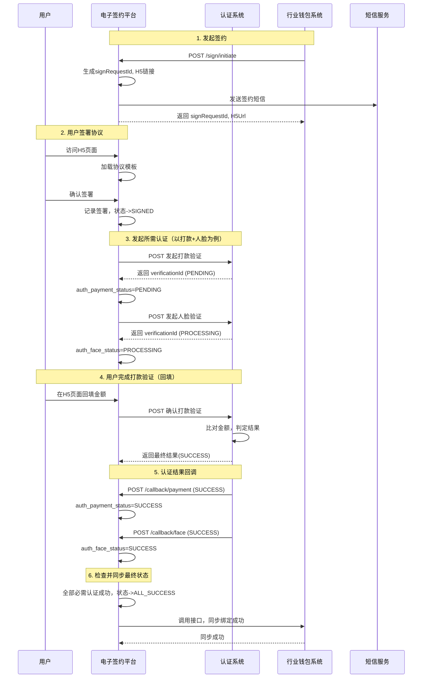
```mermaid
sequenceDiagram
    participant 用户
    participant 电子签约平台
    participant 认证系统
    participant 行业钱包系统
    participant 短信服务

    Note over 行业钱包系统,电子签约平台: 1. 发起签约
    行业钱包系统->>电子签约平台: POST /sign/initiate
    电子签约平台->>电子签约平台: 生成signRequestId, H5链接
    电子签约平台->>短信服务: 发送签约短信
    电子签约平台-->>行业钱包系统: 返回 signRequestId, H5Url

    Note over 用户,电子签约平台: 2. 用户签署协议
    用户->>电子签约平台: 访问H5页面
    电子签约平台->>电子签约平台: 加载协议模板
    用户->>电子签约平台: 确认签署
    电子签约平台->>电子签约平台: 记录签署，状态->SIGNED

    Note over 电子签约平台,认证系统: 3. 发起所需认证（以打款+人脸为例）
    电子签约平台->>认证系统: POST 发起打款验证
    认证系统-->>电子签约平台: 返回 verificationId (PENDING)
    电子签约平台->>电子签约平台: auth_payment_status=PENDING
    电子签约平台->>认证系统: POST 发起人脸验证
    认证系统-->>电子签约平台: 返回 verificationId (PROCESSING)
    电子签约平台->>电子签约平台: auth_face_status=PROCESSING

    Note over 用户,认证系统: 4. 用户完成打款验证（回填）
    用户->>电子签约平台: 在H5页面回填金额
    电子签约平台->>认证系统: POST 确认打款验证
    认证系统->>认证系统: 比对金额，判定结果
    认证系统-->>电子签约平台: 返回最终结果(SUCCESS)

    Note over 认证系统,电子签约平台: 5. 认证结果回调
    认证系统->>电子签约平台: POST /callback/payment (SUCCESS)
    电子签约平台->>电子签约平台: auth_payment_status=SUCCESS
    认证系统->>电子签约平台: POST /callback/face (SUCCESS)
    电子签约平台->>电子签约平台: auth_face_status=SUCCESS

    Note over 电子签约平台,电子签约平台: 6. 检查并同步最终状态
    电子签约平台->>电子签约平台: 全部必需认证成功，状态->ALL_SUCCESS
    电子签约平台->>行业钱包系统: 调用接口，同步绑定成功
    行业钱包系统-->>电子签约平台: 同步成功
```

### 6. 错误处理
- **预期错误情况**:
    - `400 Bad Request`: 发起签约请求参数缺失、格式错误或业务场景不支持。
    - `404 Not Found`: 查询的 `signRequestId` 不存在。
    - `409 Conflict`: 签约流程已过期或处于不可重复发起状态。
    - `424 Failed Dependency`: 依赖的下游服务（认证系统、短信服务）调用失败，导致流程无法继续。
    - `502 Bad Gateway`: 调用行业钱包系统接口失败。
    - `504 Gateway Timeout`: 调用下游服务网络超时。
- **处理策略**:
    - 对认证系统、行业钱包系统等下游依赖配置熔断器，防止雪崩。
    - 定义平台内部错误码（如 `TEMPLATE_NOT_FOUND`, `SCENARIO_RULE_MISMATCH`, `AUTH_INITIATE_FAILED`, `WALLET_SYNC_FAILED`）。
    - 关键操作（如状态同步）失败后，进入延迟重试队列，至少重试3次，使用指数退避。
    - 向用户H5页面返回友好的错误提示，并根据错误类型提供"重新尝试"或"联系客服"的引导。
    - 所有错误记录结构化日志，包含 `signRequestId`, `userId`, `errorCode`, `stackTrace`（生产环境脱敏）。

### 7. 依赖关系
- **上游模块**:
    - 行业钱包系统：接收其发起的签约请求，并在流程完成后向其同步结果。
    - 三代系统：可能作为业务入口，发起商户相关的签约配置请求。
- **下游模块**:
    - 认证系统：核心依赖，调用其接口完成打款验证和人脸验证，并接收其回调。
    - 短信服务：用于向用户推送签约链接。
    - 协议模板存储服务：用于存储和获取协议模板内容（如未独立则为平台内置能力）。
- **数据与流程关联**:
    - 本模块是"关系绑定"流程的编排中心，连接上游业务发起方和下游认证能力，最终驱动行业钱包系统完成状态更新。

<a id="module-9"></a>

## 3.9 行业钱包系统


### 1. 概述
- **目的与范围**: 行业钱包系统是天财分账业务的核心业务系统，负责处理天财专用账户开户后的业务逻辑。其核心职责包括：接收并校验来自三代系统的商户配置信息、管理收付双方的关系绑定（签约与认证）、处理分账请求（归集、会员结算、批量付款）、以及与清结算、计费中台等系统协同完成资金处理。其边界止于业务层面的流程控制与数据同步，不包含底层账户的创建（由账户系统负责）和商户的初始配置（由三代系统负责）。

### 2. 接口设计
- **API端点 (REST)**:
    - `POST /v1/relationship/bind`: 发起关系绑定（签约与认证）。
    - `GET /v1/relationship/{relationshipId}`: 查询关系绑定状态。
    - `POST /v1/ledger/split`: 发起分账（归集、会员结算、批量付款）。
    - `GET /v1/ledger/records/{recordId}`: 查询分账记录详情。
- **请求/响应结构**:
    - **关系绑定请求体**:
        ```json
        {
          "request_id": "string, 请求唯一标识",
          "business_scenario": "string, 业务场景（归集/批量付款/会员结算）",
          "payer_id": "string, 付方ID（总部或门店）",
          "receiver_id": "string, 收方ID（门店或总部）",
          "authentication_method": "string, 认证方式（打款验证/人脸验证）"
        }
        ```
    - **分账请求体**:
        ```json
        {
          "request_id": "string, 请求唯一标识",
          "business_scenario": "string, 业务场景",
          "payer_account_id": "string, 付方账户ID",
          "receiver_account_id": "string, 收方账户ID",
          "amount": "number, 分账金额",
          "fee_payer": "string, 手续费承担方"
        }
        ```
    - **成功响应体**:
        ```json
        {
          "code": "SUCCESS",
          "message": "ok",
          "data": "TBD"
        }
        ```
- **发布/消费的事件**:
    - **消费事件**:
        - `AccountCreated`: 来自账户系统，用于建立账户与业务的关联。
        - `MerchantTiancaiConfigured`: 来自三代系统，用于获取商户的天财业务标识、账户ID及业务配置。
    - **发布事件**: TBD。

### 3. 数据模型
- **表/集合**:
    - `tiancai_business_relationships` (关系绑定表)
    - `tiancai_ledger_records` (分账记录表)
- **关键字段**:
    - **`tiancai_business_relationships`**:
        - `relationship_id` (主键): 关系唯一标识。
        - `business_scenario`: 业务场景。
        - `payer_id`: 付方ID。
        - `receiver_id`: 收方ID。
        - `payer_account_id`: 付方账户ID（引用账户系统）。
        - `receiver_account_id`: 收方账户ID（引用账户系统）。
        - `authentication_status`: 认证状态。
        - `contract_status`: 签约状态。
        - `creation_time`: 创建时间。
        - `update_time`: 更新时间。
    - **`tiancai_ledger_records`**:
        - `record_id` (主键): 分账记录唯一标识。
        - `business_scenario`: 业务场景。
        - `relationship_id`: 关联的关系绑定ID。
        - `payer_account_id`: 付方账户ID。
        - `receiver_account_id`: 收方账户ID。
        - `amount`: 分账金额。
        - `fee_payer`: 手续费承担方。
        - `status`: 分账状态（如处理中、成功、失败）。
        - `creation_time`: 创建时间。
- **与其他模块的关系**:
    - 通过 `payer_account_id` 和 `receiver_account_id` 与账户系统的 `tiancai_accounts` 表关联。
    - 通过 `payer_id` 和 `receiver_id` 与三代系统的 `tiancai_merchant_configs` 表（或更基础的商户表）关联。
    - 分账记录可能被业务核心系统、对账单系统消费。

### 4. 业务逻辑
- **核心工作流/算法**:
    1.  **初始化与数据同步**: 消费 `MerchantTiancaiConfigured` 和 `AccountCreated` 事件，建立本地商户、账户与业务场景的映射关系。
    2.  **关系绑定流程**:
        - 接收关系绑定请求，校验付方和收方是否均为已标识的天财机构且账户状态有效。
        - 根据业务场景和认证方式，调用电子签约平台或认证系统完成签约与认证流程。
        - 更新关系绑定表中的认证与签约状态。
    3.  **分账处理流程**:
        - 接收分账请求，校验付方账户、收方账户状态及双方关系绑定是否已生效。
        - 根据业务场景和手续费承担方配置，调用计费中台计算手续费。
        - 调用清结算系统或业务核心系统执行资金划转。
        - 记录分账流水，更新状态。
    4.  **开通付款处理**: 在批量付款和会员结算场景，若付方为对公企业，需校验其是否已完成"开通付款"授权。
- **业务规则与验证**:
    - 发起关系绑定前，必须确保付方和收方均已在天财业务中完成开户和配置。
    - 不同业务场景（归集、批量付款、会员结算）对关系绑定的要求可能不同。
    - 分账请求必须基于已生效的关系绑定。
    - 手续费承担方逻辑需遵循三代系统的配置。
- **关键边界情况处理**:
    - **关系绑定失败**: 认证或签约失败时，记录失败原因，允许发起方重试。
    - **分账过程异常**: 如调用清结算系统失败，需记录详细日志，将分账记录置为失败，并支持人工对账与冲正。
    - **事件乱序或重复**: 处理来自账户系统和三代系统的事件时，需实现幂等性，并通过状态机保证数据最终一致性。

### 5. 时序图
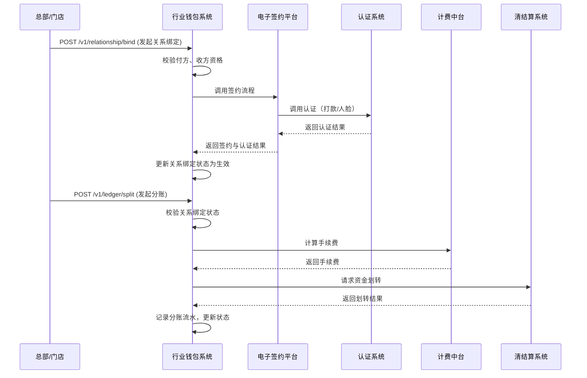
```mermaid
sequenceDiagram
    participant 总部/门店
    participant 行业钱包系统
    participant 电子签约平台
    participant 认证系统
    participant 计费中台
    participant 清结算系统

    总部/门店->>行业钱包系统: POST /v1/relationship/bind (发起关系绑定)
    行业钱包系统->>行业钱包系统: 校验付方、收方资格
    行业钱包系统->>电子签约平台: 调用签约流程
    电子签约平台->>认证系统: 调用认证（打款/人脸）
    认证系统-->>电子签约平台: 返回认证结果
    电子签约平台-->>行业钱包系统: 返回签约与认证结果
    行业钱包系统->>行业钱包系统: 更新关系绑定状态为生效

    总部/门店->>行业钱包系统: POST /v1/ledger/split (发起分账)
    行业钱包系统->>行业钱包系统: 校验关系绑定状态
    行业钱包系统->>计费中台: 计算手续费
    计费中台-->>行业钱包系统: 返回手续费
    行业钱包系统->>清结算系统: 请求资金划转
    清结算系统-->>行业钱包系统: 返回划转结果
    行业钱包系统->>行业钱包系统: 记录分账流水，更新状态
```

### 6. 错误处理
- **预期错误情况**:
    - `RELATIONSHIP_VALIDATION_FAILED`: 付方或收方不具备天财业务资格或账户无效。
    - `BINDING_NOT_ACTIVE`: 尝试分账时，对应的关系绑定未生效。
    - `AUTHENTICATION_FAILED`: 认证流程失败。
    - `FEE_CALCULATION_ERROR`: 计费中台返回错误。
    - `SETTLEMENT_FAILED`: 清结算系统资金划转失败。
    - `DUPLICATE_REQUEST`: 检测到重复的 `request_id`。
- **处理策略**:
    - 对于业务校验失败，直接向调用方返回明确的错误码和提示。
    - 对于外部系统依赖（电子签约、认证、计费、清结算）的调用失败，记录错误日志并告警，将业务流程置为失败状态，支持人工介入或后续重试。
    - 实现请求幂等性，对重复请求返回已存在的结果。

### 7. 依赖关系
- **上游模块**:
    - **账户系统**: 依赖其账户数据（通过事件或查询）来验证账户状态和能力。
    - **三代系统**: 依赖其发布的 `MerchantTiancaiConfigured` 事件获取商户业务配置和账户关联信息。
- **下游模块**:
    - **电子签约平台**: 调用其服务完成关系绑定的签约流程。
    - **认证系统**: 调用其接口完成打款验证或人脸验证。
    - **计费中台**: 调用其服务计算分账手续费。
    - **清结算系统**: 调用其服务执行资金结算与划转。
    - **业务核心系统**: 向其同步分账交易记录。
    - **对账单系统**: 为其提供分账、提款等原始数据以生成账单。
- **内部依赖**:
    - 数据库 (用于持久化关系绑定和分账记录)
    - 消息队列 (用于消费上游事件)

<a id="module-10"></a>

## 3.10 对账单系统


### 1. 概述
- **目的与范围**：对账单系统负责生成并提供机构层天财分账、提款、收单、结算等各类账单。其核心职责是聚合来自业务核心系统、行业钱包系统、清结算系统等上游模块的交易与结算数据，按机构、时间等维度进行汇总与核对，生成标准格式的对账单文件或提供查询接口。其边界止于账单数据的生成、存储与提供，不涉及原始交易的处理或资金流转。

### 2. 接口设计
- **API端点 (REST)**：
    - `GET /api/v1/statements`: 查询对账单列表。
    - `GET /api/v1/statements/{statementId}/download`: 下载指定对账单文件。
    - `POST /api/v1/statements/generate`: 触发对账单生成（如按日/月批量生成）。
- **请求/响应结构**：
    - **查询对账单列表请求参数**：
        ```
        institution_id: string, 机构ID
        statement_type: string, 账单类型（如分账、提款、收单、结算）
        start_date: string, 开始日期 (YYYY-MM-DD)
        end_date: string, 结束日期 (YYYY-MM-DD)
        ```
    - **查询对账单列表成功响应体**：
        ```json
        {
          "code": "SUCCESS",
          "message": "ok",
          "data": {
            "statements": [
              {
                "statement_id": "string, 账单唯一ID",
                "institution_id": "string",
                "statement_type": "string",
                "period": "string, 账单周期",
                "total_amount": "number, 总金额",
                "status": "string, 账单状态",
                "download_url": "string, 下载链接",
                "created_at": "string"
              }
            ]
          }
        }
        ```
    - **触发生成账单请求体**：
        ```json
        {
          "trigger_type": "DAILY/MONTHLY/MANUAL",
          "statement_date": "string, 账单日期 (YYYY-MM-DD)",
          "institution_ids": ["string"], 
          "statement_types": ["string"]
        }
        ```
- **发布/消费的事件**：
    - **消费事件**：
        - 来自业务核心系统的"交易记录处理完成事件"。
        - 来自清结算系统的"SettlementCompletedEvent"。
    - **发布事件**：TBD。

### 3. 数据模型
- **表/集合**：
    - `tiancai_statements` (对账单主表)
    - `tiancai_statement_items` (对账单明细表)
- **关键字段**：
    - **`tiancai_statements`**：
        - `statement_id` (主键): 账单唯一标识。
        - `institution_id`: 机构ID（如总部或门店ID）。
        - `statement_type`: 账单类型（枚举：分账、提款、收单、结算）。
        - `period`: 账单周期（如2024-01-01至2024-01-31）。
        - `total_amount`: 账单总金额（分）。
        - `status`: 账单状态（如生成中、已生成、已发送）。
        - `file_path`: 账单文件存储路径。
        - `generated_at`: 生成时间。
        - `created_at`: 创建时间。
        - `updated_at`: 更新时间。
    - **`tiancai_statement_items`**：
        - `item_id` (主键): 明细项ID。
        - `statement_id`: 关联的对账单ID。
        - `transaction_id`: 关联的交易流水号（来自业务核心系统等）。
        - `business_type`: 业务类型（如归集、批量付款、会员结算）。
        - `amount`: 交易金额（分）。
        - `fee_amount`: 手续费金额（分）。
        - `transaction_time`: 交易时间。
        - `payer_id`: 付方ID。
        - `payee_id`: 收方ID。
        - `settlement_ref`: 结算参考号（TBD）。
        - `created_at`: 创建时间。
- **与其他模块的关系**：
    - 通过 `transaction_id`、`payer_id`、`payee_id` 等字段与业务核心系统的 `tiancai_split_record` 表关联。
    - 通过 `institution_id` 与三代系统的商户/机构信息关联。
    - 通过消费的事件与清结算系统进行数据同步。

### 4. 业务逻辑
- **核心工作流/算法**：
    1.  **数据收集**：持续消费来自业务核心系统、清结算系统的事件，将原始交易、结算等记录存储或关联至明细表 (`tiancai_statement_items`)。
    2.  **账单生成触发**：
        - **定时任务**：根据预设周期（如每日凌晨）自动触发指定机构、指定类型的账单生成。
        - **手动触发**：通过API接收手动生成请求。
    3.  **账单生成流程**：
        - 根据触发条件（机构、类型、日期范围），从明细表中聚合数据。
        - 执行**数据核对**：对指定周期内的数据进行完整性检查，确保所有预期事件（如SettlementCompletedEvent）均已处理，并计算明细金额汇总。
        - 生成标准格式的账单文件（CSV格式），文件结构包含：账单周期、机构ID、交易流水号、业务类型、交易时间、付方ID、收方ID、交易金额、手续费、结算参考号。存储至文件系统或对象存储，并记录文件路径。
        - 更新主表 (`tiancai_statements`) 状态为"已生成"，并记录总金额等信息。
    4.  **账单提供**：通过查询接口提供账单列表和下载链接。
- **业务规则与验证**：
    - 账单生成前，需确保指定周期内的所有上游事件已处理完成（通过检查事件时间戳或状态）。
    - 同一机构、同一类型、同一周期的账单应具有唯一性。
    - 账单总金额必须与明细项金额汇总一致。
    - 需支持按不同业务类型（分账、提款、收单、结算）生成独立或合并的账单。
- **关键边界情况处理**：
    - **数据延迟或丢失**：当消费事件延迟或丢失时，账单生成任务通过检查事件时间戳和设置数据完整性水印（如每日结算完成标志）来检测数据不完整，并延迟生成或触发告警。
    - **数据不一致**：若明细数据汇总结果与从上游系统直接查询的汇总结果不一致，应记录对账差异并告警，支持人工复核。
    - **重复生成**：通过检查 `tiancai_statements` 表实现幂等，防止同一账单被重复生成。

### 5. 时序图

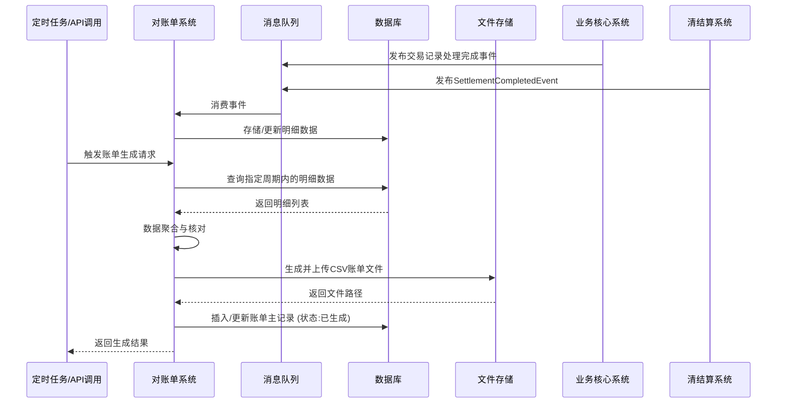
```mermaid
sequenceDiagram
    participant 定时任务/API调用
    participant 对账单系统
    participant 消息队列
    participant 数据库
    participant 文件存储
    participant 业务核心系统
    participant 清结算系统

    业务核心系统->>消息队列: 发布交易记录处理完成事件
    清结算系统->>消息队列: 发布SettlementCompletedEvent
    消息队列->>对账单系统: 消费事件
    对账单系统->>数据库: 存储/更新明细数据

    定时任务/API调用->>对账单系统: 触发账单生成请求
    对账单系统->>数据库: 查询指定周期内的明细数据
    数据库-->>对账单系统: 返回明细列表
    对账单系统->>对账单系统: 数据聚合与核对
    对账单系统->>文件存储: 生成并上传CSV账单文件
    文件存储-->>对账单系统: 返回文件路径
    对账单系统->>数据库: 插入/更新账单主记录 (状态:已生成)
    对账单系统-->>定时任务/API调用: 返回生成结果
```

### 6. 错误处理
- **预期错误情况**：
    1.  **数据源异常**：消费上游事件失败或事件数据格式错误。
    2.  **生成过程异常**：数据聚合时发现不一致，或文件生成、存储失败。
    3.  **依赖服务异常**：数据库、文件存储服务不可用。
    4.  **对账不一致**：本系统汇总数据与上游系统查询结果不一致。
    5.  **数据延迟或丢失**：检测到指定账单周期内数据不完整。
- **处理策略**：
    - **事件消费失败**：记录错误日志，利用消息队列的重试机制。若持续失败则告警。
    - **数据不一致告警**：记录对账差异详情，触发告警通知运营人员人工核查。
    - **文件生成/存储失败**：进行有限次重试（如3次），若仍失败则将账单状态置为"生成失败"并告警。
    - **依赖服务不可用**：对数据库、存储的依赖操作进行重试和熔断保护。返回系统错误给调用方。
    - **数据不完整**：当检测到数据完整性水印未达成或事件时间戳缺失时，延迟账单生成任务，并记录日志。若超过最大延迟时间仍不完整，则触发告警。

### 7. 依赖关系
- **上游模块**：
    - **业务核心系统**：依赖其"交易记录处理完成事件"作为分账交易账单的主要数据源。
    - **清结算系统**：依赖其发布的"SettlementCompletedEvent"作为结算账单的数据源。
    - **三代系统**：间接依赖，通过机构ID关联获取机构信息。
- **下游模块**：
    - 本模块主要为外部系统或运营人员提供账单查询与下载服务，下游消费者TBD。
- **内部依赖**：
    - 数据库（用于持久化账单及明细数据）。
    - 文件存储/对象存储（用于存储生成的账单文件）。
    - 消息队列（用于消费上游事件）。

---
# 4 接口设计
## 4.1 对外接口
系统对外部（如商户、合作伙伴）暴露的API接口。

| Method | Path | Module | Description | Request/Response |
| :--- | :--- | :--- | :--- | :--- |
| POST | `/v1/accounts` | 账户系统 | 创建天财专用账户 | TBD |
| GET | `/v1/accounts/{accountId}` | 账户系统 | 查询账户详情 | TBD |
| PATCH | `/v1/accounts/{accountId}/status` | 账户系统 | 更新账户状态 | TBD |
| POST | `/api/v1/payment-verification/initiate` | 认证系统 | 发起打款验证 | TBD |
| POST | `/api/v1/payment-verification/confirm` | 认证系统 | 确认（回填）打款验证 | TBD |
| POST | `/api/v1/face-verification` | 认证系统 | 发起人脸验证 | TBD |
| GET | `/api/v1/verifications/{id}` | 认证系统 | 查询验证请求状态 | TBD |
| POST | `/api/v1/settlement/config` | 清结算系统 | 创建或更新结算配置 | TBD |
| GET | `/api/v1/account/refund/{accountId}` | 清结算系统 | 查询用于退货/退款的天财专用账户信息 | TBD |
| POST | `/api/v1/account/freeze` | 清结算系统 | 对天财专用账户执行冻结或解冻操作 | TBD |
| POST | `/api/v1/billing/sync` | 清结算系统 | 同步单笔交易的计费信息 | TBD |
| POST | `/api/v1/fee/calculate` | 计费中台 | 计算手续费 | TBD |
| POST | `/api/v1/tiancai/split-record` | 业务核心系统 | 接收行业钱包系统推送的分账交易记录 | TBD |
| POST | `/v1/merchants/tiancai-config` | 三代系统 | 为商户配置天财业务并请求开户 | TBD |
| GET | `/v1/merchants/{merchantId}/tiancai-config` | 三代系统 | 查询商户的天财业务配置信息 | TBD |
| PATCH | `/v1/merchants/{merchantId}/settlement-config` | 三代系统 | 更新商户的结算账户与手续费配置 | TBD |
| POST | `/api/v1/sign/initiate` | 电子签约平台 | 上游系统（行业钱包系统/三代系统）发起签约流程 | TBD |
| GET | `/api/v1/sign/status/{signRequestId}` | 电子签约平台 | 查询签约流程状态 | TBD |
| POST | `/v1/relationship/bind` | 行业钱包系统 | 发起关系绑定（签约与认证） | TBD |
| GET | `/v1/relationship/{relationshipId}` | 行业钱包系统 | 查询关系绑定状态 | TBD |
| POST | `/v1/ledger/split` | 行业钱包系统 | 发起分账（归集、会员结算、批量付款） | TBD |
| GET | `/v1/ledger/records/{recordId}` | 行业钱包系统 | 查询分账记录详情 | TBD |
| GET | `/api/v1/statements` | 对账单系统 | 查询对账单列表 | TBD |
| GET | `/api/v1/statements/{statementId}/download` | 对账单系统 | 下载指定对账单文件 | TBD |
| POST | `/api/v1/statements/generate` | 对账单系统 | 触发对账单生成（如按日/月批量生成） | TBD |

## 4.2 模块间接口
系统内部各模块之间的调用接口。

| Method | Path | Module (Caller) | Description | Request/Response |
| :--- | :--- | :--- | :--- | :--- |
| TBD | TBD | 三代系统 | 调用账户系统接口为商户开立天财专用账户 | TBD |
| TBD | TBD | 行业钱包系统 | 调用电子签约平台发起签约流程 | TBD |
| TBD | TBD | 电子签约平台 | 调用认证系统发起打款验证 | TBD |
| TBD | TBD | 电子签约平台 | 调用认证系统发起人脸验证 | TBD |
| POST | `/api/v1/sign/callback/payment` | 认证系统 | 向电子签约平台回调打款验证结果 | TBD |
| POST | `/api/v1/sign/callback/face` | 认证系统 | 向电子签约平台回调人脸验证结果 | TBD |
| TBD | TBD | 行业钱包系统 | 调用计费中台计算手续费 | TBD |
| TBD | TBD | 清结算系统 | 调用计费中台获取计费信息 | TBD |
| TBD | TBD | 业务核心系统 | 调用计费中台计算手续费 | TBD |
| TBD | TBD | 业务核心系统 | 调用清结算系统触发结算流程 | TBD |
| TBD | TBD | 行业钱包系统 | 调用清结算系统同步计费信息 | TBD |
| TBD | TBD | 行业钱包系统 | 向业务核心系统推送分账交易记录 | TBD |
| TBD | TBD | 对账单系统 | 从业务核心系统消费交易数据 | TBD |
| TBD | TBD | 对账单系统 | 从清结算系统消费结算数据 | TBD |
| TBD | TBD | 对账单系统 | 从账户系统消费账户数据 | TBD |
| TBD | TBD | 对账单系统 | 从行业钱包系统消费分账数据 | TBD |
| TBD | TBD | 对账单系统 | 从三代系统消费商户配置数据 | TBD |
---
# 5 数据库设计
## 5.1 ER图
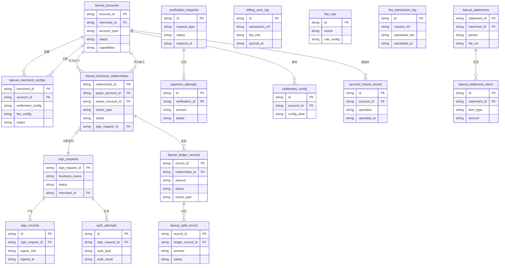
```mermaid
erDiagram
    tiancai_accounts {
        string account_id PK
        string merchant_id FK
        string account_type
        string status
        string capabilities
    }

    tiancai_merchant_configs {
        string merchant_id PK
        string account_id FK
        string settlement_config
        string fee_config
        string status
    }

    tiancai_business_relationships {
        string relationship_id PK
        string payer_account_id FK
        string payee_account_id FK
        string scene_type
        string status
        string sign_request_id FK
    }

    tiancai_ledger_records {
        string record_id PK
        string relationship_id FK
        string amount
        string status
        string scene_type
    }

    tiancai_split_record {
        string record_id PK
        string ledger_record_id FK
        string amount
        string status
    }

    verification_requests {
        string id PK
        string request_type
        string status
        string external_id
    }

    payment_attempts {
        string id PK
        string verification_id FK
        string amount
        string status
    }

    sign_requests {
        string sign_request_id PK
        string business_scene
        string status
        string merchant_id FK
    }

    sign_records {
        string id PK
        string sign_request_id FK
        string signer_info
        string signed_at
    }

    auth_attempts {
        string id PK
        string sign_request_id FK
        string auth_type
        string auth_result
    }

    settlement_config {
        string id PK
        string account_id FK
        string config_data
    }

    account_freeze_record {
        string id PK
        string account_id FK
        string operation
        string operated_at
    }

    billing_sync_log {
        string id PK
        string transaction_ref
        string fee_info
        string synced_at
    }

    fee_rule {
        string id PK
        string scene
        string rule_config
    }

    fee_transaction_log {
        string id PK
        string request_ref
        string calculated_fee
        string calculated_at
    }

    tiancai_statements {
        string statement_id PK
        string merchant_id FK
        string period
        string file_url
    }

    tiancai_statement_items {
        string id PK
        string statement_id FK
        string item_type
        string amount
    }

    tiancai_accounts ||--o{ tiancai_merchant_configs : "配置"
    tiancai_accounts ||--o{ tiancai_business_relationships : "作为付方"
    tiancai_accounts ||--o{ tiancai_business_relationships : "作为收方"
    tiancai_accounts ||--o{ settlement_config : "拥有"
    tiancai_accounts ||--o{ account_freeze_record : "被操作"
    tiancai_merchant_configs }o--|| tiancai_accounts : "关联"
    tiancai_business_relationships }o--|| sign_requests : "关联签约"
    tiancai_business_relationships ||--o{ tiancai_ledger_records : "发起"
    tiancai_ledger_records ||--o{ tiancai_split_record : "对应"
    verification_requests ||--o{ payment_attempts : "包含"
    sign_requests ||--o{ sign_records : "产生"
    sign_requests ||--o{ auth_attempts : "包含"
    tiancai_statements ||--o{ tiancai_statement_items : "包含"
```
*注：部分实体间关系（如`tiancai_merchant_configs`与`sign_requests`）因信息缺失，暂未在图中体现。*

## 5.2 表结构

| 表名 | 所属模块 | 主要字段（简述） | 关联关系（简述） |
| :--- | :--- | :--- | :--- |
| `tiancai_accounts` | 账户系统 | `account_id`(主键), `merchant_id`, `account_type`, `status`, `capabilities` | 被`tiancai_merchant_configs`、`tiancai_business_relationships`、`settlement_config`、`account_freeze_record`关联 |
| `tiancai_merchant_configs` | 三代系统 | `merchant_id`(主键), `account_id`, `settlement_config`, `fee_config`, `status` | 关联`tiancai_accounts`表 |
| `tiancai_business_relationships` | 行业钱包系统 | `relationship_id`(主键), `payer_account_id`, `payee_account_id`, `scene_type`, `status`, `sign_request_id` | 关联`tiancai_accounts`（付方/收方）、`sign_requests`、`tiancai_ledger_records`表 |
| `tiancai_ledger_records` | 行业钱包系统 | `record_id`(主键), `relationship_id`, `amount`, `status`, `scene_type` | 关联`tiancai_business_relationships`、`tiancai_split_record`表 |
| `tiancai_split_record` | 业务核心系统 | `record_id`(主键), `ledger_record_id`, `amount`, `status` | 关联`tiancai_ledger_records`表 |
| `verification_requests` | 认证系统 | `id`(主键), `request_type`, `status`, `external_id` | 关联`payment_attempts`表 |
| `payment_attempts` | 认证系统 | `id`(主键), `verification_id`, `amount`, `status` | 关联`verification_requests`表 |
| `sign_requests` | 电子签约平台 | `sign_request_id`(主键), `business_scene`, `status`, `merchant_id` | 关联`tiancai_business_relationships`、`sign_records`、`auth_attempts`表 |
| `sign_records` | 电子签约平台 | `id`(主键), `sign_request_id`, `signer_info`, `signed_at` | 关联`sign_requests`表 |
| `auth_attempts` | 电子签约平台 | `id`(主键), `sign_request_id`, `auth_type`, `auth_result` | 关联`sign_requests`表 |
| `settlement_config` | 清结算系统 | `id`(主键), `account_id`, `config_data` | 关联`tiancai_accounts`表 |
| `account_freeze_record` | 清结算系统 | `id`(主键), `account_id`, `operation`, `operated_at` | 关联`tiancai_accounts`表 |
| `billing_sync_log` | 清结算系统 | `id`(主键), `transaction_ref`, `fee_info`, `synced_at` | TBD |
| `fee_rule` | 计费中台 | `id`(主键), `scene`, `rule_config` | TBD |
| `fee_transaction_log` | 计费中台 | `id`(主键), `request_ref`, `calculated_fee`, `calculated_at` | TBD |
| `tiancai_statements` | 对账单系统 | `statement_id`(主键), `merchant_id`, `period`, `file_url` | 关联`tiancai_statement_items`表 |
| `tiancai_statement_items` | 对账单系统 | `id`(主键), `statement_id`, `item_type`, `amount` | 关联`tiancai_statements`表 |