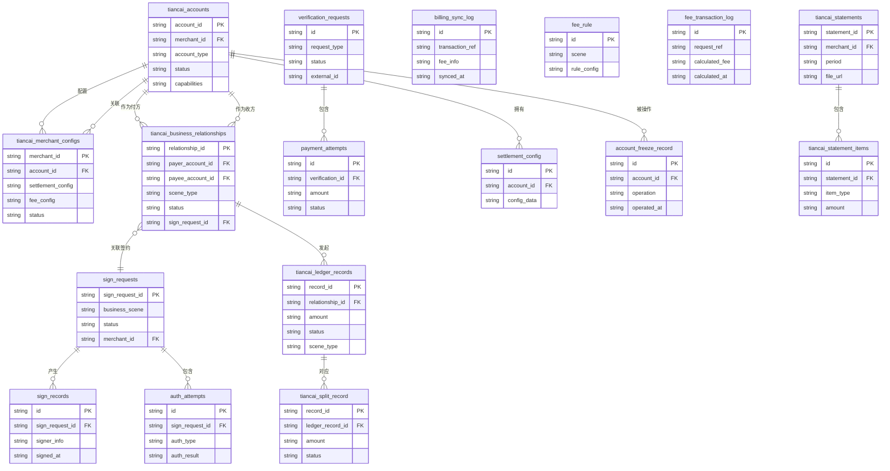

## 5.1 ER图

*注：部分实体间关系（如`tiancai_merchant_configs`与`sign_requests`）因信息缺失，暂未在图中体现。*

## 5.2 表结构

| 表名 | 所属模块 | 主要字段（简述） | 关联关系（简述） |
| :--- | :--- | :--- | :--- |
| `tiancai_accounts` | 账户系统 | `account_id`(主键), `merchant_id`, `account_type`, `status`, `capabilities` | 被`tiancai_merchant_configs`、`tiancai_business_relationships`、`settlement_config`、`account_freeze_record`关联 |
| `tiancai_merchant_configs` | 三代系统 | `merchant_id`(主键), `account_id`, `settlement_config`, `fee_config`, `status` | 关联`tiancai_accounts`表 |
| `tiancai_business_relationships` | 行业钱包系统 | `relationship_id`(主键), `payer_account_id`, `payee_account_id`, `scene_type`, `status`, `sign_request_id` | 关联`tiancai_accounts`（付方/收方）、`sign_requests`、`tiancai_ledger_records`表 |
| `tiancai_ledger_records` | 行业钱包系统 | `record_id`(主键), `relationship_id`, `amount`, `status`, `scene_type` | 关联`tiancai_business_relationships`、`tiancai_split_record`表 |
| `tiancai_split_record` | 业务核心系统 | `record_id`(主键), `ledger_record_id`, `amount`, `status` | 关联`tiancai_ledger_records`表 |
| `verification_requests` | 认证系统 | `id`(主键), `request_type`, `status`, `external_id` | 关联`payment_attempts`表 |
| `payment_attempts` | 认证系统 | `id`(主键), `verification_id`, `amount`, `status` | 关联`verification_requests`表 |
| `sign_requests` | 电子签约平台 | `sign_request_id`(主键), `business_scene`, `status`, `merchant_id` | 关联`tiancai_business_relationships`、`sign_records`、`auth_attempts`表 |
| `sign_records` | 电子签约平台 | `id`(主键), `sign_request_id`, `signer_info`, `signed_at` | 关联`sign_requests`表 |
| `auth_attempts` | 电子签约平台 | `id`(主键), `sign_request_id`, `auth_type`, `auth_result` | 关联`sign_requests`表 |
| `settlement_config` | 清结算系统 | `id`(主键), `account_id`, `config_data` | 关联`tiancai_accounts`表 |
| `account_freeze_record` | 清结算系统 | `id`(主键), `account_id`, `operation`, `operated_at` | 关联`tiancai_accounts`表 |
| `billing_sync_log` | 清结算系统 | `id`(主键), `transaction_ref`, `fee_info`, `synced_at` | TBD |
| `fee_rule` | 计费中台 | `id`(主键), `scene`, `rule_config` | TBD |
| `fee_transaction_log` | 计费中台 | `id`(主键), `request_ref`, `calculated_fee`, `calculated_at` | TBD |
| `tiancai_statements` | 对账单系统 | `statement_id`(主键), `merchant_id`, `period`, `file_url` | 关联`tiancai_statement_items`表 |
| `tiancai_statement_items` | 对账单系统 | `id`(主键), `statement_id`, `item_type`, `amount` | 关联`tiancai_statements`表 |