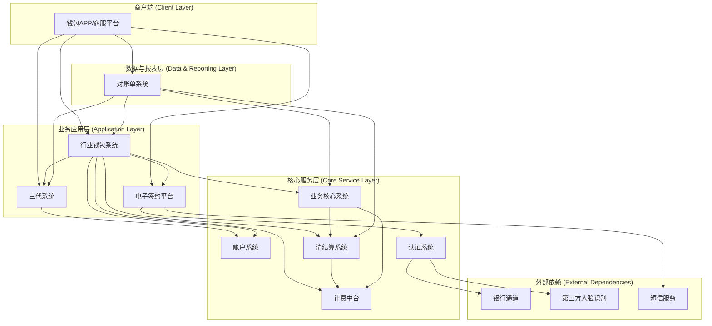
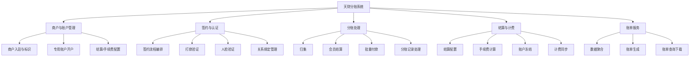
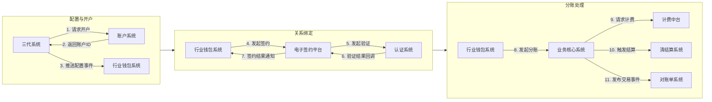
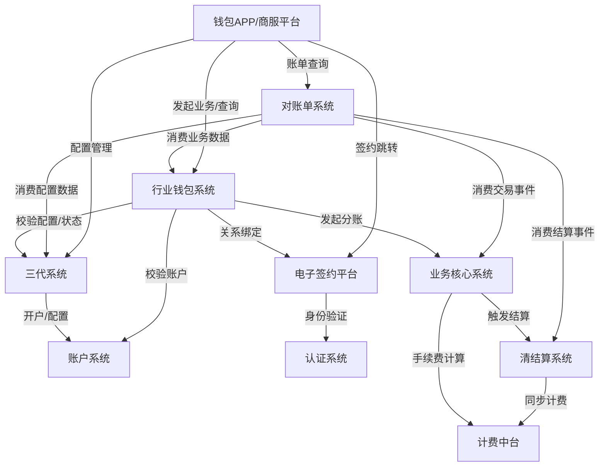

## 2.1 系统结构
天财分账系统采用分层与模块化架构，以行业钱包系统为核心业务处理引擎，整合了账户、签约、认证、结算、计费等多个专业系统。系统整体遵循职责分离原则，通过清晰的接口定义和事件驱动机制进行协作，确保资金处理业务的合规性、安全性与可扩展性。

## 2.2 功能结构
系统功能围绕天财分账的核心业务流程（关系绑定、资金处理、账单管理）进行组织。主要功能模块包括商户与账户管理、签约认证、分账处理、结算计费以及账单服务。

## 2.3 网络拓扑图
TBD

## 2.4 数据流转
数据流转描述了关键业务数据在系统各模块间的传递路径，主要包括配置数据、验证数据、交易数据和结算数据。流转通过同步API调用和异步事件驱动两种方式完成。

## 2.5 系统模块交互关系
模块间交互关系基于依赖方向（调用/被调用）和核心业务流程进行定义。行业钱包系统作为业务枢纽，与最多模块交互；账户系统和认证系统作为底层能力提供者，被上层模块依赖。

