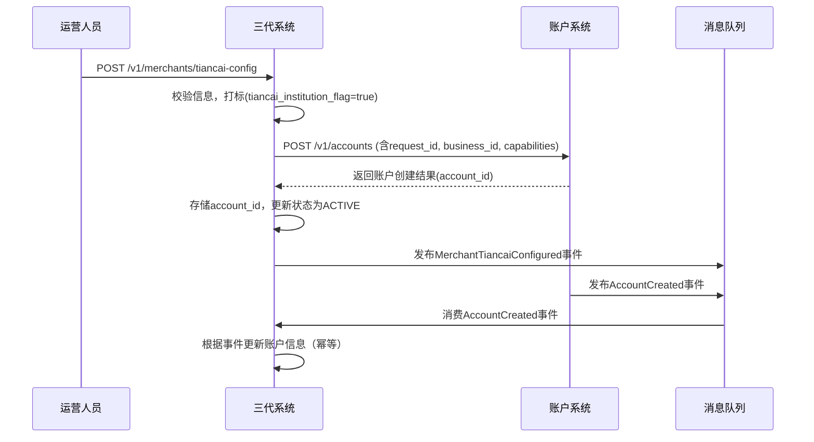

# 模块设计: 三代系统

生成时间: 2026-01-21 16:19:41
批判迭代: 2

---

# 三代系统模块设计文档

## 1. 概述
- **目的与范围**: 三代系统是天财分账业务的核心管理平台，负责商户管理、调用账户系统接口为商户开立天财专用账户、配置结算账户与手续费，并对天财机构进行标识。其边界止于业务配置与流程发起，不处理具体的分账、认证等执行逻辑。

## 2. 接口设计
- **API端点 (REST)**:
    - `POST /v1/merchants/tiancai-config`: 为商户配置天财业务并请求开户。
    - `GET /v1/merchants/{merchantId}/tiancai-config`: 查询商户的天财业务配置信息。
    - `PATCH /v1/merchants/{merchantId}/settlement-config`: 更新商户的结算账户与手续费配置。
- **请求/响应结构**:
    - **创建/配置请求体**:
        ```json
        {
          "request_id": "string, 请求唯一标识，用于幂等",
          "business_id": "string, 天财业务标识",
          "merchant_id": "string, 商户ID",
          "settlement_account": "object, 结算账户配置信息",
          "fee_payer": "string, 分账手续费承担方（PAYER/RECEIVER）"
        }
        ```
    - **创建/配置成功响应体**:
        ```json
        {
          "code": "SUCCESS",
          "message": "ok",
          "data": {
            "config_id": "string, 配置记录ID",
            "business_id": "string",
            "merchant_id": "string",
            "tiancai_institution_flag": true,
            "account_id": "string, 关联的天财专用账户ID（如已开户）",
            "settlement_account": "object",
            "fee_payer": "string",
            "status": "string, 配置状态"
          }
        }
        ```
- **发布/消费的事件**:
    - **消费事件**: `AccountCreated`。消费来自账户系统的账户创建成功事件，用于更新本地账户ID。
    - **发布事件**: `MerchantTiancaiConfigured`。当商户天财业务配置完成（包括开户结果）后发布此事件，供行业钱包系统等下游消费者订阅。

## 3. 数据模型
- **表/集合**: `tiancai_merchant_configs`
- **关键字段**:
    - `config_id` (主键): 配置记录唯一标识。
    - `business_id`: 天财业务标识。
    - `merchant_id`: 商户ID。
    - `tiancai_institution_flag`: 布尔值，天财机构标识。`true`表示该商户参与天财业务。
    - `account_id`: 关联的天财专用账户ID（来自账户系统），可为空。
    - `settlement_account`: JSON对象，结算账户配置信息。
    - `fee_payer`: 字符串，分账手续费承担方（PAYER/RECEIVER）。
    - `status`: 配置状态，如 `PENDING`（待开户）、`ACTIVE`（生效）、`FAILED`（开户失败）。
    - `creation_time`: 创建时间。
    - `update_time`: 更新时间。
- **与其他模块的关系**: 本表通过 `account_id` 与账户系统的 `tiancai_accounts` 表关联。通过 `merchant_id` 等字段与行业钱包系统的业务表关联。

## 4. 业务逻辑
- **核心工作流/算法**:
    1.  **商户入驻与标识**: 接收商户天财业务配置请求，校验信息完整性，在`tiancai_merchant_configs`表中创建记录，并将`tiancai_institution_flag`设置为`true`。
    2.  **发起开户**: 为需要天财专用账户的商户，组装请求参数（包括从上游设计已知的`capabilities`字段，如`["ACTIVE_SETTLEMENT", "TIANCAI_SPECIAL"]`），调用账户系统的 `POST /v1/accounts` 接口。使用`request_id`保证幂等。
    3.  **处理开户结果**:
        - 同步结果：接收账户系统接口返回，更新本地`account_id`和`status`。
        - 异步事件：消费`AccountCreated`事件，再次确认并更新本地账户信息。
    4.  **配置管理**: 为商户配置结算账户（如绑定天财收款账户）和分账手续费承担方，更新`settlement_account`和`fee_payer`字段。
    5.  **信息同步**: 当商户配置状态变为`ACTIVE`（开户成功且配置完成）时，发布`MerchantTiancaiConfigured`事件，将商户标识、账户ID及业务配置信息通知给行业钱包系统等下游模块。
- **业务规则与验证**:
    - 确保只有被标识为天财机构（`tiancai_institution_flag`为`true`）的商户才能发起天财专用账户的开户请求。
    - 在调用账户系统开户前，需校验商户信息的完整性与有效性。
    - 手续费承担方的配置需符合业务规则（如归集、批量付款等场景的默认设置）。
    - 调用账户系统时，必须构造包含`capabilities`字段的请求体。
- **关键边界情况处理**:
    - **账户系统调用失败**: 需记录失败日志，将本地配置状态置为`FAILED`，并可能提供重试机制或人工干预入口。
    - **配置冲突**: 同一商户的结算账户或手续费配置发生变更时，需考虑业务生效时间与数据一致性。
    - **事件处理**: 需处理`AccountCreated`事件的重复消费和乱序到达问题，通过幂等和状态机保证最终一致性。

## 5. 时序图


## 6. 错误处理
- **预期错误情况**:
    - `MERCHANT_INFO_INCOMPLETE`: 商户信息不完整，无法发起开户。
    - `ACCOUNT_SERVICE_UNAVAILABLE`: 调用账户系统服务失败或超时。
    - `CONFIGURATION_VALIDATION_FAILED`: 结算账户或手续费配置校验失败。
    - `ACCOUNT_CREATION_FAILED`: 账户系统返回开户失败。
    - `EVENT_PROCESSING_ERROR`: 处理异步事件时发生错误。
- **处理策略**:
    - 对于参数校验失败，直接向操作人员返回错误信息。
    - 对于外部依赖（账户系统）调用失败，记录详细日志并告警，支持操作人员手动重试。
    - 对于异步事件处理失败，记录错误并告警，确保消息队列的重试机制生效。
    - 系统内部错误应记录完整堆栈信息，并进行告警。

## 7. 依赖关系
- **上游模块**:
    - **账户系统**: 依赖其 `POST /v1/accounts` 接口为商户开立天财专用账户，并消费其发布的 `AccountCreated` 事件。
- **下游模块**:
    - **行业钱包系统**: 消费本模块发布的 `MerchantTiancaiConfigured` 事件，获取商户天财标识、账户ID及业务配置，以进行关系绑定、分账处理等业务。
    - **清结算系统**: 可能依赖本模块配置的结算账户与手续费承担方信息（通常通过行业钱包系统间接获取）。
- **内部依赖**:
    - 数据库 (用于持久化 `tiancai_merchant_configs`)
    - 消息队列 (用于发布事件和消费 `AccountCreated` 事件)