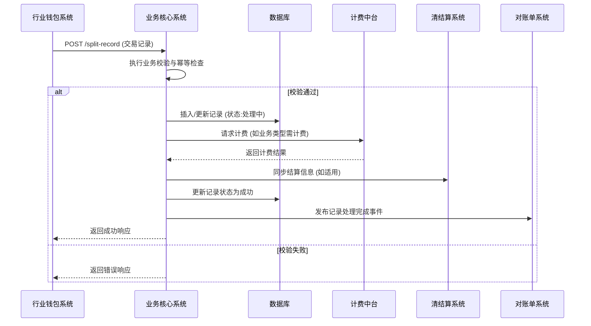

# 模块设计: 业务核心系统

生成时间: 2026-01-21 16:18:21
批判迭代: 2

---

# 业务核心系统设计文档

## 1. 概述
- **目的与范围**：业务核心系统是天财分账业务中接收并处理天财分账交易记录的核心模块。其职责是处理由行业钱包系统发起的各类分账交易（归集、批量付款、会员结算）的记录，进行业务校验、状态管理与数据持久化，并为下游系统（如计费中台、清结算系统、对账单系统）提供数据。它不负责账户管理、签约认证或资金流转的直接执行。

## 2. 接口设计
- **API端点 (REST)**：
    - `POST /api/v1/tiancai/split-record`：接收行业钱包系统推送的分账交易记录。
- **请求/响应结构**：
    - **请求体 (application/json)**：
        ```json
        {
          "transaction_id": "string，交易流水号，全局唯一",
          "business_type": "string，业务类型（COLLECTION/BATCH_PAY/MEMBER_SETTLEMENT）",
          "total_amount": "number，交易总金额（单位：分）",
          "status": "string，交易状态（PROCESSING/SUCCESS/FAILED）",
          "payer_id": "string，付方ID（总部或门店）",
          "payee_id": "string，收方ID（总部或门店）",
          "request_time": "string，请求时间戳（ISO 8601）",
          "ext_info": "object，扩展信息（业务特定字段）"
        }
        ```
    - **成功响应 (200)**：
        ```json
        {
          "code": "SUCCESS",
          "message": "处理成功",
          "data": {
            "record_id": "系统生成的记录ID"
          }
        }
        ```
    - **错误响应 (4xx/5xx)**：
        ```json
        {
          "code": "INVALID_DATA",
          "message": "具体错误描述"
        }
        ```
- **发布/消费的事件**：
    - **消费事件**：TBD（从行业钱包系统接收事件）。
    - **发布事件**：交易记录处理完成事件（供对账单系统等下游消费）。事件结构TBD。

## 3. 数据模型
- **核心表**：`tiancai_split_record`（天财分账交易记录表）
- **关键字段**：
    - `id`：主键，记录ID。
    - `transaction_id`：交易流水号，唯一索引。
    - `business_type`：业务类型（枚举：归集、批量付款、会员结算）。
    - `total_amount`：交易总金额（分）。
    - `status`：记录状态（枚举：待处理、处理中、成功、失败）。
    - `payer_id`：付方ID。
    - `payee_id`：收方ID。
    - `request_time`：请求时间。
    - `process_time`：处理完成时间。
    - `fee_amount`：手续费金额（分），TBD。
    - `settlement_ref`：结算参考号，TBD。
    - `error_code`：错误码。
    - `error_message`：错误信息。
    - `created_at`：创建时间。
    - `updated_at`：更新时间。
- **与其他模块的关系**：
    - 接收来自行业钱包系统的分账交易记录数据。
    - 为对账单系统提供交易记录数据以生成账单。
    - 调用计费中台进行转账计费（如适用）。
    - 与清结算系统交互结算配置信息（如适用）。

## 4. 业务逻辑
- **核心工作流**：
    1.  接收行业钱包系统推送的交易记录。
    2.  执行**记录有效性校验**（见下文规则）。
    3.  校验通过后，持久化记录，状态置为"处理中"。
    4.  根据`business_type`触发后续处理：
        - 若业务类型为"批量付款"或"会员结算"，则调用计费中台计算手续费。
        - 若涉及结算配置，则同步信息至清结算系统。
    5.  更新记录状态为"成功"或"失败"，并记录处理时间。
    6.  发布交易记录处理完成事件。
- **业务规则与验证**：
    - **通用校验**：
        1.  必填字段检查：`transaction_id`, `business_type`, `total_amount`, `status`, `payer_id`, `payee_id`, `request_time` 不得为空。
        2.  金额有效性：`total_amount` 必须为正整数。
        3.  业务类型枚举值检查：必须为"归集(COLLECTION)"、"批量付款(BATCH_PAY)"、"会员结算(MEMBER_SETTLEMENT)"之一。
        4.  状态枚举值检查：必须为"处理中(PROCESSING)"、"成功(SUCCESS)"、"失败(FAILED)"之一。
        5.  **幂等性/重复记录检查**：基于`transaction_id`查询数据库，若已存在成功记录，则直接返回成功响应；若存在处理中记录，需根据策略处理（如等待或返回处理中）。
    - **业务类型特定规则**：
        - **归集(COLLECTION)**：验证付方(`payer_id`)为门店，收方(`payee_id`)为总部。
        - **批量付款(BATCH_PAY)**：验证付方(`payer_id`)为总部，收方(`payee_id`)为天财接收方账户。需触发计费。
        - **会员结算(MEMBER_SETTLEMENT)**：验证付方(`payer_id`)为总部，收方(`payee_id`)为门店。需触发计费。
    - **状态与金额一致性校验**：将接收到的记录状态与系统内可能存在的该交易前置状态进行比对，若状态回退或金额不一致，则记录异常并告警。
- **关键边界情况处理**：
    - **重复推送**：通过`transaction_id`实现幂等处理。
    - **下游系统调用失败**：采用重试机制（见错误处理章节）。
    - **数据不一致**：记录异常日志，并触发人工复核流程。

## 5. 时序图



## 6. 错误处理
- **预期错误情况**：
    1.  **数据错误**：请求数据格式错误、字段缺失、值无效。
    2.  **业务错误**：违反业务规则（如身份不符、重复交易）。
    3.  **系统错误**：数据库操作失败、下游服务（计费中台、清结算系统）调用超时或失败。
- **处理策略**：
    - **数据/业务错误**：立即向行业钱包系统返回4xx错误，包含明确错误码（如`INVALID_DATA`, `DUPLICATE_TRANSACTION`）和描述。
    - **下游系统调用失败**：
        - **重试机制**：采用指数退避策略进行重试。最大重试次数：3次。初始延迟：1秒，后续延迟依次为2秒、4秒。
        - **幂等性**：所有向下游系统的调用需携带唯一请求ID，确保重试的幂等性。
        - **失败降级**：若重试后仍失败，则将交易记录状态标记为"失败"，记录详细错误日志，并触发告警通知人工介入。
    - **数据库错误**：进行事务回滚，返回5xx系统错误，并告警。

## 7. 依赖关系
- **上游模块**：
    - **行业钱包系统（核心依赖）**：提供分账交易记录。
- **下游模块**：
    - **计费中台**：依赖其进行批量付款和会员结算业务的转账计费。
    - **清结算系统**：依赖其同步结算配置信息。
    - **对账单系统**：为其提供处理完成的交易记录数据以生成账单。