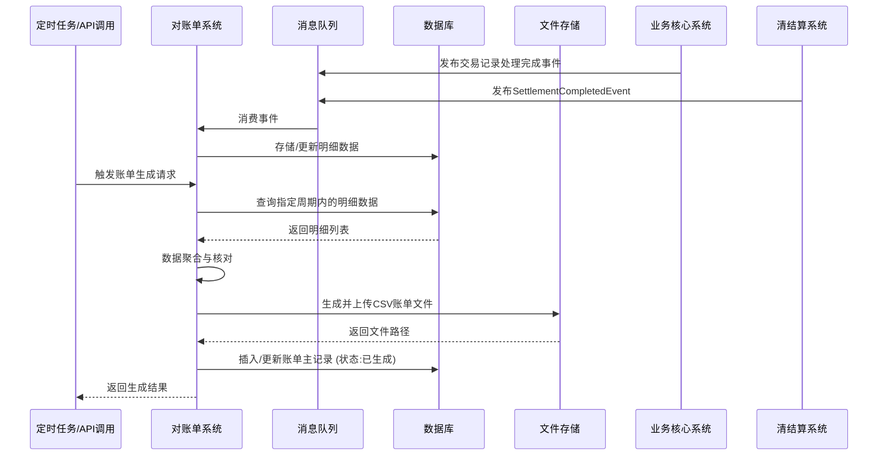

# 模块设计: 对账单系统

生成时间: 2026-01-21 16:21:33
批判迭代: 2

---

# 模块设计: 对账单系统

生成时间: TBD
批判迭代: TBD

---

# 对账单系统设计文档

## 1. 概述
- **目的与范围**：对账单系统负责生成并提供机构层天财分账、提款、收单、结算等各类账单。其核心职责是聚合来自业务核心系统、行业钱包系统、清结算系统等上游模块的交易与结算数据，按机构、时间等维度进行汇总与核对，生成标准格式的对账单文件或提供查询接口。其边界止于账单数据的生成、存储与提供，不涉及原始交易的处理或资金流转。

## 2. 接口设计
- **API端点 (REST)**：
    - `GET /api/v1/statements`: 查询对账单列表。
    - `GET /api/v1/statements/{statementId}/download`: 下载指定对账单文件。
    - `POST /api/v1/statements/generate`: 触发对账单生成（如按日/月批量生成）。
- **请求/响应结构**：
    - **查询对账单列表请求参数**：
        ```
        institution_id: string, 机构ID
        statement_type: string, 账单类型（如分账、提款、收单、结算）
        start_date: string, 开始日期 (YYYY-MM-DD)
        end_date: string, 结束日期 (YYYY-MM-DD)
        ```
    - **查询对账单列表成功响应体**：
        ```json
        {
          "code": "SUCCESS",
          "message": "ok",
          "data": {
            "statements": [
              {
                "statement_id": "string, 账单唯一ID",
                "institution_id": "string",
                "statement_type": "string",
                "period": "string, 账单周期",
                "total_amount": "number, 总金额",
                "status": "string, 账单状态",
                "download_url": "string, 下载链接",
                "created_at": "string"
              }
            ]
          }
        }
        ```
    - **触发生成账单请求体**：
        ```json
        {
          "trigger_type": "DAILY/MONTHLY/MANUAL",
          "statement_date": "string, 账单日期 (YYYY-MM-DD)",
          "institution_ids": ["string"], 
          "statement_types": ["string"]
        }
        ```
- **发布/消费的事件**：
    - **消费事件**：
        - 来自业务核心系统的"交易记录处理完成事件"。
        - 来自清结算系统的"SettlementCompletedEvent"。
    - **发布事件**：TBD。

## 3. 数据模型
- **表/集合**：
    - `tiancai_statements` (对账单主表)
    - `tiancai_statement_items` (对账单明细表)
- **关键字段**：
    - **`tiancai_statements`**：
        - `statement_id` (主键): 账单唯一标识。
        - `institution_id`: 机构ID（如总部或门店ID）。
        - `statement_type`: 账单类型（枚举：分账、提款、收单、结算）。
        - `period`: 账单周期（如2024-01-01至2024-01-31）。
        - `total_amount`: 账单总金额（分）。
        - `status`: 账单状态（如生成中、已生成、已发送）。
        - `file_path`: 账单文件存储路径。
        - `generated_at`: 生成时间。
        - `created_at`: 创建时间。
        - `updated_at`: 更新时间。
    - **`tiancai_statement_items`**：
        - `item_id` (主键): 明细项ID。
        - `statement_id`: 关联的对账单ID。
        - `transaction_id`: 关联的交易流水号（来自业务核心系统等）。
        - `business_type`: 业务类型（如归集、批量付款、会员结算）。
        - `amount`: 交易金额（分）。
        - `fee_amount`: 手续费金额（分）。
        - `transaction_time`: 交易时间。
        - `payer_id`: 付方ID。
        - `payee_id`: 收方ID。
        - `settlement_ref`: 结算参考号（TBD）。
        - `created_at`: 创建时间。
- **与其他模块的关系**：
    - 通过 `transaction_id`、`payer_id`、`payee_id` 等字段与业务核心系统的 `tiancai_split_record` 表关联。
    - 通过 `institution_id` 与三代系统的商户/机构信息关联。
    - 通过消费的事件与清结算系统进行数据同步。

## 4. 业务逻辑
- **核心工作流/算法**：
    1.  **数据收集**：持续消费来自业务核心系统、清结算系统的事件，将原始交易、结算等记录存储或关联至明细表 (`tiancai_statement_items`)。
    2.  **账单生成触发**：
        - **定时任务**：根据预设周期（如每日凌晨）自动触发指定机构、指定类型的账单生成。
        - **手动触发**：通过API接收手动生成请求。
    3.  **账单生成流程**：
        - 根据触发条件（机构、类型、日期范围），从明细表中聚合数据。
        - 执行**数据核对**：对指定周期内的数据进行完整性检查，确保所有预期事件（如SettlementCompletedEvent）均已处理，并计算明细金额汇总。
        - 生成标准格式的账单文件（CSV格式），文件结构包含：账单周期、机构ID、交易流水号、业务类型、交易时间、付方ID、收方ID、交易金额、手续费、结算参考号。存储至文件系统或对象存储，并记录文件路径。
        - 更新主表 (`tiancai_statements`) 状态为"已生成"，并记录总金额等信息。
    4.  **账单提供**：通过查询接口提供账单列表和下载链接。
- **业务规则与验证**：
    - 账单生成前，需确保指定周期内的所有上游事件已处理完成（通过检查事件时间戳或状态）。
    - 同一机构、同一类型、同一周期的账单应具有唯一性。
    - 账单总金额必须与明细项金额汇总一致。
    - 需支持按不同业务类型（分账、提款、收单、结算）生成独立或合并的账单。
- **关键边界情况处理**：
    - **数据延迟或丢失**：当消费事件延迟或丢失时，账单生成任务通过检查事件时间戳和设置数据完整性水印（如每日结算完成标志）来检测数据不完整，并延迟生成或触发告警。
    - **数据不一致**：若明细数据汇总结果与从上游系统直接查询的汇总结果不一致，应记录对账差异并告警，支持人工复核。
    - **重复生成**：通过检查 `tiancai_statements` 表实现幂等，防止同一账单被重复生成。

## 5. 时序图



## 6. 错误处理
- **预期错误情况**：
    1.  **数据源异常**：消费上游事件失败或事件数据格式错误。
    2.  **生成过程异常**：数据聚合时发现不一致，或文件生成、存储失败。
    3.  **依赖服务异常**：数据库、文件存储服务不可用。
    4.  **对账不一致**：本系统汇总数据与上游系统查询结果不一致。
    5.  **数据延迟或丢失**：检测到指定账单周期内数据不完整。
- **处理策略**：
    - **事件消费失败**：记录错误日志，利用消息队列的重试机制。若持续失败则告警。
    - **数据不一致告警**：记录对账差异详情，触发告警通知运营人员人工核查。
    - **文件生成/存储失败**：进行有限次重试（如3次），若仍失败则将账单状态置为"生成失败"并告警。
    - **依赖服务不可用**：对数据库、存储的依赖操作进行重试和熔断保护。返回系统错误给调用方。
    - **数据不完整**：当检测到数据完整性水印未达成或事件时间戳缺失时，延迟账单生成任务，并记录日志。若超过最大延迟时间仍不完整，则触发告警。

## 7. 依赖关系
- **上游模块**：
    - **业务核心系统**：依赖其"交易记录处理完成事件"作为分账交易账单的主要数据源。
    - **清结算系统**：依赖其发布的"SettlementCompletedEvent"作为结算账单的数据源。
    - **三代系统**：间接依赖，通过机构ID关联获取机构信息。
- **下游模块**：
    - 本模块主要为外部系统或运营人员提供账单查询与下载服务，下游消费者TBD。
- **内部依赖**：
    - 数据库（用于持久化账单及明细数据）。
    - 文件存储/对象存储（用于存储生成的账单文件）。
    - 消息队列（用于消费上游事件）。