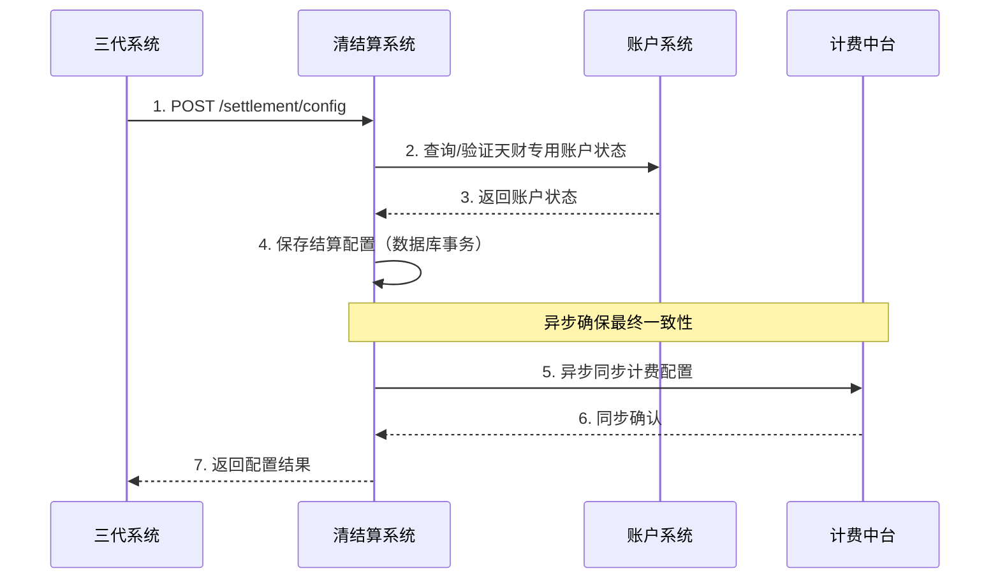
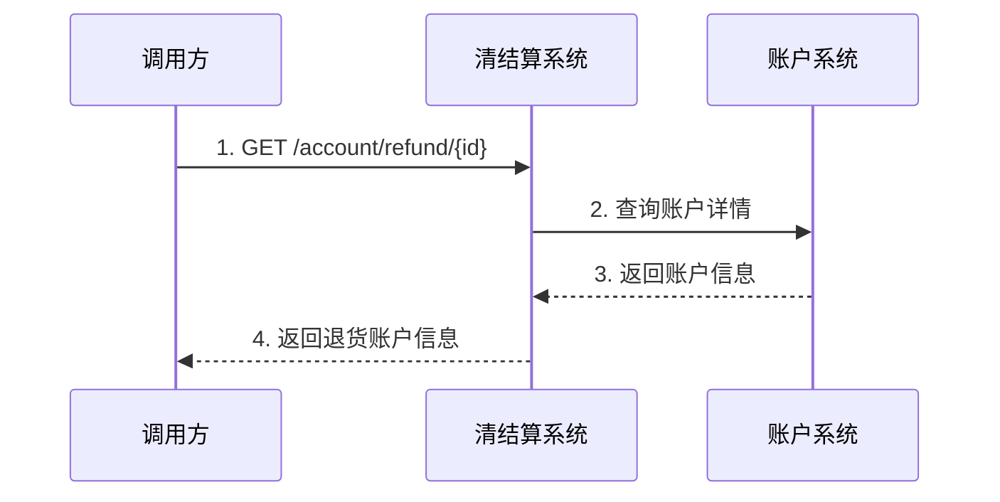
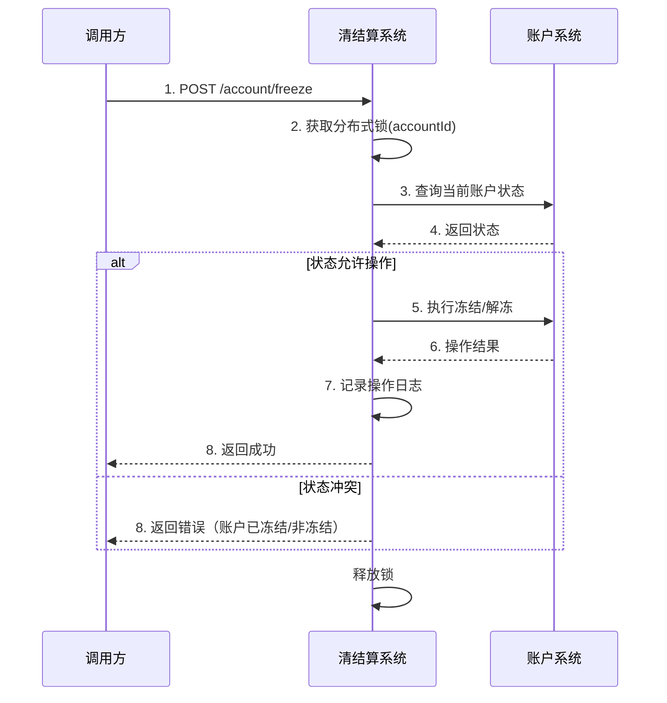
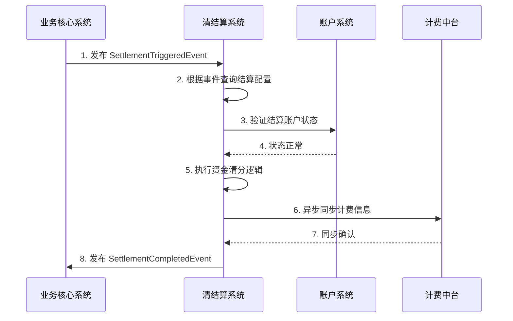

# 模块设计: 清结算系统

生成时间: 2026-01-21 16:18:14
批判迭代: 2

---

# 清结算系统 设计文档

## 1. 概述
- **目的与范围**: 本模块是天财分账业务的核心资金处理模块，负责处理结算配置、退货账户查询、专用账户冻结及计费信息同步。其边界在于接收来自**三代系统**的结算配置指令、来自**业务核心系统**的交易触发指令，执行与资金清分、结算相关的操作，并与底层**账户系统**、**计费中台**等协同，确保资金流转的正确性与合规性。

## 2. 接口设计
- **API端点 (REST/GraphQL)**:
    - `POST /api/v1/settlement/config`: 创建或更新结算配置。
    - `GET /api/v1/account/refund/{accountId}`: 查询用于退货/退款的天财专用账户信息。
    - `POST /api/v1/account/freeze`: 对天财专用账户执行冻结或解冻操作。
    - `POST /api/v1/billing/sync`: 同步单笔交易的计费信息。
- **请求/响应结构**:
    - 结算配置请求: `{ "merchantId": "string", "settlementMode": "ACTIVE/PASSIVE", "settlementAccountId": "string", "feeBearer": "PAYER/PAYEE" }`
    - 退货账户查询响应: `{ "accountId": "string", "accountType": "string", "status": "NORMAL/FROZEN" }`
    - 账户冻结请求: `{ "accountId": "string", "operation": "FREEZE/UNFREEZE", "reason": "string" }`
    - 计费信息同步请求: `{ "transactionId": "string", "feeAmount": "number", "feeType": "string" }`
    - 通用响应: `{ "code": "string", "message": "string", "data": "object" }`
- **发布/消费的事件**:
    - 消费事件: `SettlementTriggeredEvent` (由业务核心系统发布，包含交易ID、金额、参与方信息，用于触发结算流程)。
    - 发布事件: `SettlementCompletedEvent` (结算完成后发布，包含结算结果、关联账户及费用信息)。

## 3. 数据模型
- **表/集合**:
    - `settlement_config`: 结算配置表。
    - `account_freeze_record`: 账户冻结操作记录表。
    - `billing_sync_log`: 计费信息同步日志表。
- **关键字段**:
    - `settlement_config`: `id`, `merchant_id` (关联三代系统商户), `settlement_mode` (主动/被动), `settlement_account_id` (天财收款账户ID), `fee_bearer` (手续费承担方), `status`, `created_at`, `updated_at`。
    - `account_freeze_record`: `id`, `account_id` (天财专用账户ID), `operation`, `reason`, `operator`, `created_at`。
    - `billing_sync_log`: `id`, `transaction_id`, `fee_amount`, `fee_type`, `sync_status`, `error_message`, `created_at`。
- **与其他模块的关系**: 本模块需要与**账户系统**交互以操作天财专用账户（如冻结、查询状态），与**计费中台**交互以同步计费信息，与**三代系统**交互以获取结算账户与手续费配置，与**业务核心系统**交互以接收结算触发事件。

## 4. 业务逻辑
- **核心工作流/算法**:
    1.  **结算配置处理**: 根据三代系统的配置请求，为天财业务设置结算规则，包括区分主动结算（至天财收款账户）与被动结算（至默认待结算账户）。配置需与商户ID强关联并持久化。
    2.  **退货账户查询**: 在处理退款或退货业务时，根据提供的账户标识，查询**账户系统**并返回对应的天财专用账户（即天财接收方账户）的详细信息及状态。
    3.  **专用账户冻结**: 接收指令，对指定的天财专用账户执行冻结或解冻操作。操作前需校验账户状态及操作权限，操作后需记录审计日志。
    4.  **计费信息同步**: 在结算流程中，将转账交易中产生的计费信息（如手续费）异步同步至计费中台，并记录同步状态以备核查。
    5.  **交易触发结算**: 监听来自**业务核心系统**的`SettlementTriggeredEvent`事件，根据事件中的商户ID查找对应的结算配置，驱动资金清分与结算流程。
- **业务规则与验证**:
    - 冻结/解冻操作需验证操作权限及账户当前状态（如不可重复冻结已冻结账户）。
    - 结算配置需与天财业务的商户标识（来自三代系统）唯一关联。
    - 触发结算前，必须验证目标天财专用账户状态正常（非冻结）。
- **关键边界情况与一致性考虑**:
    - **并发控制**: 对同一账户的冻结与结算请求需通过数据库乐观锁或分布式锁进行串行化处理，防止状态冲突。
    - **数据一致性**: 结算配置的保存与向计费中台的初次信息同步，应通过本地事务表与异步重试机制确保最终一致性。
    - 处理结算时，若目标天财专用账户状态异常（如冻结），需阻断结算流程并返回明确错误。

## 5. 时序图

### 5.1 结算配置处理

### 5.2 退货账户查询

### 5.3 专用账户冻结

### 5.4 交易触发结算与计费同步

## 6. 错误处理
- **预期错误情况**:
    - 目标账户不存在或状态异常（如已冻结）。
    - 与下游系统（账户系统、计费中台）通信失败或超时。
    - 结算配置参数不合法或与现有配置冲突。
    - 并发操作冲突（如同时冻结与结算）。
- **处理策略**:
    - **重试与退避**: 对下游系统非幂等的查询类接口，设置最大3次重试，采用指数退避策略（如 1s, 2s, 4s）。对计费同步等幂等操作，采用更积极的重试策略。
    - **熔断机制**: 对账户系统、计费中台依赖配置熔断器（如连续5次失败后熔断30秒），防止级联故障。
    - **错误码与日志**: 定义结构化错误码（如 `ACCOUNT_FROZEN`, `DOWNSTREAM_TIMEOUT`），并记录包含请求ID、账户ID、错误详情在内的全链路日志。
    - **事务补偿**: 对于因下游系统失败导致的不一致状态（如配置已保存但计费同步失败），通过后台作业定期扫描`billing_sync_log`表中的失败记录进行补偿同步。

## 7. 依赖关系
- **上游模块**:
    - **三代系统**: 提供商户标识，发起结算配置的创建与更新。
    - **业务核心系统**: 发布`SettlementTriggeredEvent`事件，触发具体的结算执行流程。
- **下游模块**:
    - **账户系统**: 提供天财专用账户的状态查询、冻结/解冻操作能力。
    - **计费中台**: 接收并处理交易产生的计费信息同步请求。