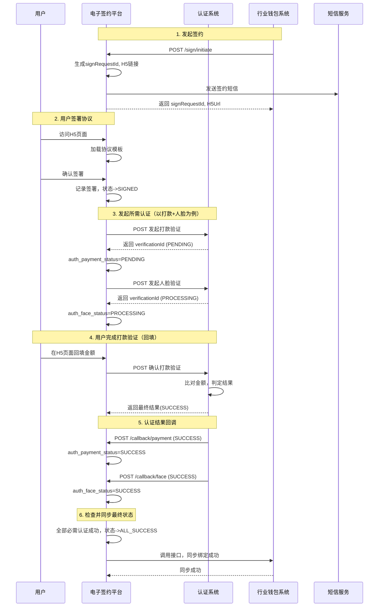

# 模块设计: 电子签约平台

生成时间: 2026-01-21 16:19:48
批判迭代: 2

---

# 模块设计: 电子签约平台

生成时间: TBD
批判迭代: TBD

---

## 1. 概述
- **目的与范围**: 电子签约平台是为天财分账业务提供签约与认证流程编排的中心化服务。其核心职责是管理协议模板、封装H5页面、推送签约短信，并作为流程中枢，调用认证系统完成打款验证和人脸验证，最终将认证结果同步至行业钱包系统以完成关系绑定。本模块不负责具体的资金处理、账户管理或分账逻辑，专注于签约流程的引导、认证的发起与结果处理。

## 2. 接口设计
- **API端点 (REST/GraphQL)**:
    - `POST /api/v1/sign/initiate`: 上游系统（行业钱包系统/三代系统）发起签约流程。
    - `GET /api/v1/sign/status/{signRequestId}`: 查询签约流程状态。
    - `POST /api/v1/sign/callback/payment`: 接收认证系统打款验证结果回调。
    - `POST /api/v1/sign/callback/face`: 接收认证系统人脸验证结果回调。
- **请求/响应结构**:
    - 发起签约请求 (`POST /api/v1/sign/initiate`):
        - 请求体: `{ "requestId": "string", "businessScenario": "ENUM(COLLECTION, BATCH_PAYMENT, MEMBER_SETTLEMENT)", "payerInfo": { "type": "ENUM(HEADQUARTERS, STORE_INDIVIDUAL, STORE_CORPORATE, PERSONAL)", "userId": "string", "name": "string" }, "payeeInfo": { ... }, "extraParams": "JSON" }`
        - 响应体: `{ "signRequestId": "string", "status": "INITIATED", "h5Url": "string" }`
    - 查询状态响应 (`GET /api/v1/sign/status/{signRequestId}`):
        - 响应体: `{ "signRequestId": "string", "status": "ENUM(INITIATED, SIGNED, PAYMENT_VERIFYING, FACE_VERIFYING, ALL_SUCCESS, PARTIAL_FAILURE, FAILED)", "authResults": { "payment": "ENUM(PENDING, SUCCESS, FAILED)", "face": "ENUM(PROCESSING, SUCCESS, FAILED)" }, "message": "string" }`
    - 认证回调请求 (`POST /api/v1/sign/callback/payment` 和 `POST /api/v1/sign/callback/face`):
        - 请求体: `{ "verificationId": "string", "signRequestId": "string", "status": "SUCCESS/FAILED", "message": "string" }`
        - 响应体: `{ "code": "SUCCESS", "message": "string" }`
- **发布/消费的事件**: TBD

## 3. 数据模型
- **表/集合**:
    - `sign_requests`: 签约请求主表。
        - 关键字段: `id` (主键, signRequestId), `external_request_id`, `business_scenario`, `payer_type`, `payer_user_id`, `payee_user_id`, `template_id`, `template_version`, `h5_url`, `sms_sent`, `current_status`, `auth_payment_status`, `auth_face_status`, `wallet_sync_status`, `callback_url`, `expires_at`, `created_at`, `updated_at`。
    - `sign_records`: 签约记录表。
        - 关键字段: `id` (主键), `sign_request_id` (外键), `user_id`, `sign_time`, `ip_address`, `user_agent`, `signed_content_hash`。
    - `auth_attempts`: 认证尝试记录表。
        - 关键字段: `id` (主键), `sign_request_id` (外键), `auth_type` (ENUM: `PAYMENT`, `FACE`), `verification_id` (关联认证系统), `requested_at`, `callback_received_at`, `result_status`, `result_message`。
- **与其他模块的关系**: 本模块是签约流程的编排者。它接收来自上游（如行业钱包系统或三代系统）的签约请求，调用认证系统完成验证，并将最终的签约与认证结果回传给行业钱包系统，以更新绑定关系状态。依赖短信服务推送签约链接。

## 4. 业务逻辑
- **核心工作流/算法**:
    1.  **签约流程编排**:
        - 接收上游系统发起的签约请求，校验必要参数。
        - 根据 `businessScenario` 和 `payerInfo.type` 确定所需的协议模板ID及版本。
        - 生成唯一的 `signRequestId` 和签约H5页面链接，将流程状态初始化为 `INITIATED`。
        - 调用短信服务，向目标用户推送包含H5链接的短信。
    2.  **认证方法决策**:
        - **规则集**:
            - 场景为 `COLLECTION` (归集): 付方（门店）为个人时，需人脸验证；为企业时，需打款验证。
            - 场景为 `BATCH_PAYMENT` (批量付款): 付方（总部）必须完成"开通付款"流程（内含打款验证）。收方若为个人，需人脸验证。
            - 场景为 `MEMBER_SETTLEMENT` (会员结算): 付方（总部）必须完成"开通付款"流程（内含打款验证）。收方（门店）为个人时，需人脸验证。
        - 根据规则，在用户签署协议后，按需调用认证系统接口。
    3.  **认证流程集成**:
        - **打款验证**: 调用认证系统 `POST /api/v1/payment-verification/initiate`，传入银行卡信息及本平台的回调地址。将 `auth_payment_status` 置为 `PENDING`。在H5页面引导用户回填金额，并调用认证系统 `POST /api/v1/payment-verification/confirm` 进行确认。
        - **人脸验证**: 调用认证系统 `POST /api/v1/face-verification`，传入身份信息及本平台的回调地址。将 `auth_face_status` 置为 `PROCESSING`。
        - 接收认证系统的回调 (`/api/v1/sign/callback/payment` 或 `/api/v1/sign/callback/face`)，更新对应的 `auth_payment_status` 或 `auth_face_status`。
    4.  **状态同步与完成**:
        - 监听所有必需认证的回调结果。当全部必需认证状态均为 `SUCCESS` 时，将 `current_status` 更新为 `ALL_SUCCESS`。
        - 调用行业钱包系统的绑定关系更新接口，通知其更新对应业务场景下的绑定关系状态为"已绑定"。
        - 若任一必需认证失败，将 `current_status` 更新为 `PARTIAL_FAILURE` 或 `FAILED`，并记录失败原因。可通过H5页面通知用户。
- **业务规则与验证**:
    - 协议模板需进行版本管理，签约时锁定具体版本。
    - "开通付款"是批量付款和会员结算场景下付方的强制前置流程，其本质是一次特殊的签约与打款验证。
    - 签约H5链接应具备时效性（如24小时），过期后需重新生成。
    - 支持流程状态查询，便于上游系统轮询或用户查看进度。
- **关键边界情况处理**:
    - 用户中途退出：H5链接在有效期内可继续流程，根据 `signRequestId` 恢复状态。
    - 认证系统调用失败：实现带指数退避的异步重试机制（最多3次）。若最终失败，更新认证状态为 `FAILED`，整体流程失败。
    - 接收认证回调后，调用行业钱包系统失败：将同步操作放入可靠消息队列进行异步重试，确保最终一致性。
    - 多次认证回调：基于 `verificationId` 和当前状态进行幂等处理，避免重复更新。

## 5. 时序图

## 6. 错误处理
- **预期错误情况**:
    - `400 Bad Request`: 发起签约请求参数缺失、格式错误或业务场景不支持。
    - `404 Not Found`: 查询的 `signRequestId` 不存在。
    - `409 Conflict`: 签约流程已过期或处于不可重复发起状态。
    - `424 Failed Dependency`: 依赖的下游服务（认证系统、短信服务）调用失败，导致流程无法继续。
    - `502 Bad Gateway`: 调用行业钱包系统接口失败。
    - `504 Gateway Timeout`: 调用下游服务网络超时。
- **处理策略**:
    - 对认证系统、行业钱包系统等下游依赖配置熔断器，防止雪崩。
    - 定义平台内部错误码（如 `TEMPLATE_NOT_FOUND`, `SCENARIO_RULE_MISMATCH`, `AUTH_INITIATE_FAILED`, `WALLET_SYNC_FAILED`）。
    - 关键操作（如状态同步）失败后，进入延迟重试队列，至少重试3次，使用指数退避。
    - 向用户H5页面返回友好的错误提示，并根据错误类型提供"重新尝试"或"联系客服"的引导。
    - 所有错误记录结构化日志，包含 `signRequestId`, `userId`, `errorCode`, `stackTrace`（生产环境脱敏）。

## 7. 依赖关系
- **上游模块**:
    - 行业钱包系统：接收其发起的签约请求，并在流程完成后向其同步结果。
    - 三代系统：可能作为业务入口，发起商户相关的签约配置请求。
- **下游模块**:
    - 认证系统：核心依赖，调用其接口完成打款验证和人脸验证，并接收其回调。
    - 短信服务：用于向用户推送签约链接。
    - 协议模板存储服务：用于存储和获取协议模板内容（如未独立则为平台内置能力）。
- **数据与流程关联**:
    - 本模块是"关系绑定"流程的编排中心，连接上游业务发起方和下游认证能力，最终驱动行业钱包系统完成状态更新。