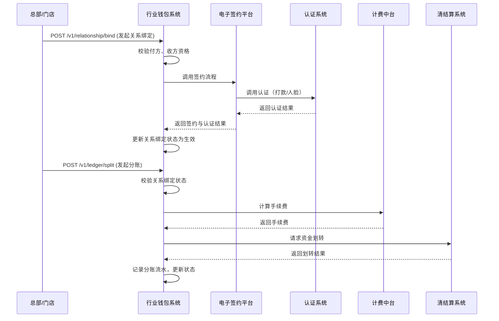

# 模块设计: 行业钱包系统

生成时间: 2026-01-21 16:20:22
批判迭代: 1

---

# 行业钱包系统模块设计文档

## 1. 概述
- **目的与范围**: 行业钱包系统是天财分账业务的核心业务系统，负责处理天财专用账户开户后的业务逻辑。其核心职责包括：接收并校验来自三代系统的商户配置信息、管理收付双方的关系绑定（签约与认证）、处理分账请求（归集、会员结算、批量付款）、以及与清结算、计费中台等系统协同完成资金处理。其边界止于业务层面的流程控制与数据同步，不包含底层账户的创建（由账户系统负责）和商户的初始配置（由三代系统负责）。

## 2. 接口设计
- **API端点 (REST)**:
    - `POST /v1/relationship/bind`: 发起关系绑定（签约与认证）。
    - `GET /v1/relationship/{relationshipId}`: 查询关系绑定状态。
    - `POST /v1/ledger/split`: 发起分账（归集、会员结算、批量付款）。
    - `GET /v1/ledger/records/{recordId}`: 查询分账记录详情。
- **请求/响应结构**:
    - **关系绑定请求体**:
        ```json
        {
          "request_id": "string, 请求唯一标识",
          "business_scenario": "string, 业务场景（归集/批量付款/会员结算）",
          "payer_id": "string, 付方ID（总部或门店）",
          "receiver_id": "string, 收方ID（门店或总部）",
          "authentication_method": "string, 认证方式（打款验证/人脸验证）"
        }
        ```
    - **分账请求体**:
        ```json
        {
          "request_id": "string, 请求唯一标识",
          "business_scenario": "string, 业务场景",
          "payer_account_id": "string, 付方账户ID",
          "receiver_account_id": "string, 收方账户ID",
          "amount": "number, 分账金额",
          "fee_payer": "string, 手续费承担方"
        }
        ```
    - **成功响应体**:
        ```json
        {
          "code": "SUCCESS",
          "message": "ok",
          "data": "TBD"
        }
        ```
- **发布/消费的事件**:
    - **消费事件**:
        - `AccountCreated`: 来自账户系统，用于建立账户与业务的关联。
        - `MerchantTiancaiConfigured`: 来自三代系统，用于获取商户的天财业务标识、账户ID及业务配置。
    - **发布事件**: TBD。

## 3. 数据模型
- **表/集合**:
    - `tiancai_business_relationships` (关系绑定表)
    - `tiancai_ledger_records` (分账记录表)
- **关键字段**:
    - **`tiancai_business_relationships`**:
        - `relationship_id` (主键): 关系唯一标识。
        - `business_scenario`: 业务场景。
        - `payer_id`: 付方ID。
        - `receiver_id`: 收方ID。
        - `payer_account_id`: 付方账户ID（引用账户系统）。
        - `receiver_account_id`: 收方账户ID（引用账户系统）。
        - `authentication_status`: 认证状态。
        - `contract_status`: 签约状态。
        - `creation_time`: 创建时间。
        - `update_time`: 更新时间。
    - **`tiancai_ledger_records`**:
        - `record_id` (主键): 分账记录唯一标识。
        - `business_scenario`: 业务场景。
        - `relationship_id`: 关联的关系绑定ID。
        - `payer_account_id`: 付方账户ID。
        - `receiver_account_id`: 收方账户ID。
        - `amount`: 分账金额。
        - `fee_payer`: 手续费承担方。
        - `status`: 分账状态（如处理中、成功、失败）。
        - `creation_time`: 创建时间。
- **与其他模块的关系**:
    - 通过 `payer_account_id` 和 `receiver_account_id` 与账户系统的 `tiancai_accounts` 表关联。
    - 通过 `payer_id` 和 `receiver_id` 与三代系统的 `tiancai_merchant_configs` 表（或更基础的商户表）关联。
    - 分账记录可能被业务核心系统、对账单系统消费。

## 4. 业务逻辑
- **核心工作流/算法**:
    1.  **初始化与数据同步**: 消费 `MerchantTiancaiConfigured` 和 `AccountCreated` 事件，建立本地商户、账户与业务场景的映射关系。
    2.  **关系绑定流程**:
        - 接收关系绑定请求，校验付方和收方是否均为已标识的天财机构且账户状态有效。
        - 根据业务场景和认证方式，调用电子签约平台或认证系统完成签约与认证流程。
        - 更新关系绑定表中的认证与签约状态。
    3.  **分账处理流程**:
        - 接收分账请求，校验付方账户、收方账户状态及双方关系绑定是否已生效。
        - 根据业务场景和手续费承担方配置，调用计费中台计算手续费。
        - 调用清结算系统或业务核心系统执行资金划转。
        - 记录分账流水，更新状态。
    4.  **开通付款处理**: 在批量付款和会员结算场景，若付方为对公企业，需校验其是否已完成"开通付款"授权。
- **业务规则与验证**:
    - 发起关系绑定前，必须确保付方和收方均已在天财业务中完成开户和配置。
    - 不同业务场景（归集、批量付款、会员结算）对关系绑定的要求可能不同。
    - 分账请求必须基于已生效的关系绑定。
    - 手续费承担方逻辑需遵循三代系统的配置。
- **关键边界情况处理**:
    - **关系绑定失败**: 认证或签约失败时，记录失败原因，允许发起方重试。
    - **分账过程异常**: 如调用清结算系统失败，需记录详细日志，将分账记录置为失败，并支持人工对账与冲正。
    - **事件乱序或重复**: 处理来自账户系统和三代系统的事件时，需实现幂等性，并通过状态机保证数据最终一致性。

## 5. 时序图


## 6. 错误处理
- **预期错误情况**:
    - `RELATIONSHIP_VALIDATION_FAILED`: 付方或收方不具备天财业务资格或账户无效。
    - `BINDING_NOT_ACTIVE`: 尝试分账时，对应的关系绑定未生效。
    - `AUTHENTICATION_FAILED`: 认证流程失败。
    - `FEE_CALCULATION_ERROR`: 计费中台返回错误。
    - `SETTLEMENT_FAILED`: 清结算系统资金划转失败。
    - `DUPLICATE_REQUEST`: 检测到重复的 `request_id`。
- **处理策略**:
    - 对于业务校验失败，直接向调用方返回明确的错误码和提示。
    - 对于外部系统依赖（电子签约、认证、计费、清结算）的调用失败，记录错误日志并告警，将业务流程置为失败状态，支持人工介入或后续重试。
    - 实现请求幂等性，对重复请求返回已存在的结果。

## 7. 依赖关系
- **上游模块**:
    - **账户系统**: 依赖其账户数据（通过事件或查询）来验证账户状态和能力。
    - **三代系统**: 依赖其发布的 `MerchantTiancaiConfigured` 事件获取商户业务配置和账户关联信息。
- **下游模块**:
    - **电子签约平台**: 调用其服务完成关系绑定的签约流程。
    - **认证系统**: 调用其接口完成打款验证或人脸验证。
    - **计费中台**: 调用其服务计算分账手续费。
    - **清结算系统**: 调用其服务执行资金结算与划转。
    - **业务核心系统**: 向其同步分账交易记录。
    - **对账单系统**: 为其提供分账、提款等原始数据以生成账单。
- **内部依赖**:
    - 数据库 (用于持久化关系绑定和分账记录)
    - 消息队列 (用于消费上游事件)