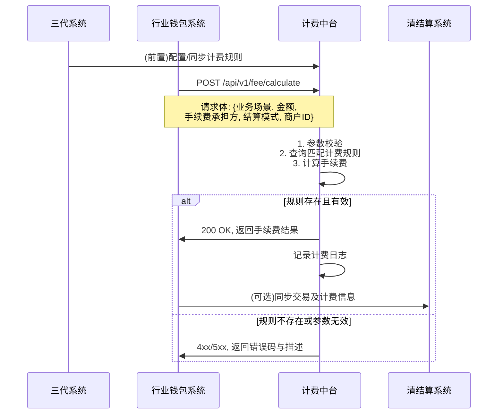

# 模块设计: 计费中台

生成时间: 2026-01-21 16:18:14
批判迭代: 2

---

# 计费中台模块设计文档

## 1. 概述
- **目的与范围**: 计费中台模块的核心职责是为系统内其他业务模块提供中心化的转账计费能力。其边界在于接收计费请求，根据业务规则计算转账手续费，并返回计费结果。它不负责具体的资金划转、账户管理或交易处理。
- **与其他系统的关系**: 本模块主要服务于**行业钱包系统**，为其处理的分账请求提供计费服务。计费规则可能由**三代系统**进行配置。计费结果可能需要同步给**清结算系统**用于结算。**电子签约平台**在签约流程中可能不直接调用本模块，但签约生成的业务场景和手续费承担方配置是计费计算的关键输入。

## 2. 接口设计
- **API端点 (REST/GraphQL)**:
    - `POST /api/v1/fee/calculate`: 计算手续费。
- **请求/响应结构**:
    - **请求体**:
        - `business_scenario` (String): 业务场景，枚举值：`COLLECTION`（归集）、`BATCH_PAYMENT`（批量付款）、`MEMBER_SETTLEMENT`（会员结算）。
        - `amount` (Decimal): 交易金额。
        - `fee_payer` (String): 手续费承担方，枚举值：`PAYER`（付方）、`RECEIVER`（收方）。
        - `settlement_mode` (String): 结算模式，枚举值：`ACTIVE`（主动结算）、`PASSIVE`（被动结算）。
        - `merchant_id` (String): 商户标识。
    - **响应体**:
        - `fee_amount` (Decimal): 计算出的手续费金额。
        - `currency` (String): 币种。
        - `calculation_rule_id` (String): 所应用的计费规则ID。
- **发布/消费的事件**: TBD

## 3. 数据模型
- **表/集合**:
    - `fee_rule` (计费规则表): 存储不同业务场景和模式下的费率配置。
    - `fee_transaction_log` (计费交易日志表): 记录每次计费请求和结果，用于对账和审计。
- **关键字段**:
    - `fee_rule` 表:
        - `id` (主键)
        - `business_scenario` (业务场景)
        - `settlement_mode` (结算模式)
        - `fee_payer` (手续费承担方)
        - `rate_type` (费率类型，如：百分比、固定额)
        - `rate_value` (费率值)
        - `min_fee` (最低手续费)
        - `max_fee` (最高手续费)
        - `effective_date` (生效日期)
        - `expiry_date` (失效日期)
        - `merchant_group` (商户组标识，可能来自三代系统配置)
    - `fee_transaction_log` 表:
        - `id` (主键)
        - `request_id` (请求ID)
        - `merchant_id` (商户ID)
        - `business_scenario` (业务场景)
        - `amount` (交易金额)
        - `calculated_fee` (计算手续费)
        - `applied_rule_id` (应用的规则ID)
        - `request_time` (请求时间)
        - `response_time` (响应时间)
        - `status` (状态：成功/失败)
- **与其他模块的关系**: 计费规则的基础配置信息可能源自**三代系统**的商户与手续费配置模块。计费日志可为**对账单系统**提供数据源。

## 4. 业务逻辑
- **核心工作流/算法**:
    1.  接收来自行业钱包系统的计费请求。
    2.  根据请求中的 `business_scenario`、`settlement_mode`、`fee_payer` 以及 `merchant_id`，查询 `fee_rule` 表获取匹配的、且在有效期内的计费规则。
    3.  应用计费规则计算手续费：
        - **百分比费率**: `fee = amount * rate_value`。若 `fee < min_fee`，则 `fee = min_fee`；若定义了 `max_fee` 且 `fee > max_fee`，则 `fee = max_fee`。
        - **固定费率**: `fee = rate_value`。
    4.  返回计算结果，并异步记录日志到 `fee_transaction_log`。
- **业务规则与验证**:
    - **手续费承担方 (`fee_payer`)**: 该参数决定手续费计算结果归属于哪一方，但不影响计算逻辑本身。计算出的 `fee_amount` 将标记由该方承担。
    - **结算模式 (`settlement_mode`)**: 主动结算与被动结算可能对应不同的费率规则。例如，主动结算至天财收款账户与被动结算至默认账户可能适用不同费率。系统通过此字段区分并查找对应规则。
    - **业务场景 (`business_scenario`)**: 归集、批量付款、会员结算等场景有独立的费率规则。
- **关键边界情况处理**:
    - **零金额或极小金额**: 即使金额为0，若规则有最低手续费 (`min_fee`)，则按最低手续费计。
    - **费率配置缺失**: 若无匹配的、生效的计费规则，则视为配置错误，返回明确错误。
    - **无效参数**: 对金额为负等无效参数，请求验证阶段即拒绝。

## 5. 时序图

## 6. 错误处理
- **预期错误情况**:
    1.  `FEE_RULE_NOT_FOUND` (404): 未找到匹配的、生效的计费规则。
    2.  `INVALID_PARAMETER` (400): 请求参数无效，如金额为负、枚举值不合法。
    3.  `DEPENDENCY_UNAVAILABLE` (503): 依赖的数据库或内部服务暂时不可用。
- **处理策略**:
    - 对于 `FEE_RULE_NOT_FOUND` 和 `INVALID_PARAMETER`，立即失败，返回明确的错误码和描述，引导调用方检查请求或配置。
    - 对于 `DEPENDENCY_UNAVAILABLE`，采用快速失败策略，返回服务不可用错误。**降级策略（TBD）**：可考虑在架构演进中引入本地缓存，在依赖服务故障时使用最后已知的有效规则进行计算，但当前版本不实现。

## 7. 依赖关系
- **上游模块 (调用方)**:
    - **行业钱包系统**: 主要调用方，在处理分账、归集、批量付款等交易前调用本模块计算手续费。
- **下游模块/服务 (被依赖方)**:
    - **数据库**: 存储计费规则和日志。
    - **清结算系统**: 作为计费结果的潜在消费者，接收行业钱包系统同步的计费信息用于资金结算（此依赖关系由行业钱包系统主导）。
- **配置关联方**:
    - **三代系统**: 作为商户和业务规则的配置中心，其配置的结算账户与手续费信息是本模块 `fee_rule` 数据的重要来源。数据同步机制为 TBD。