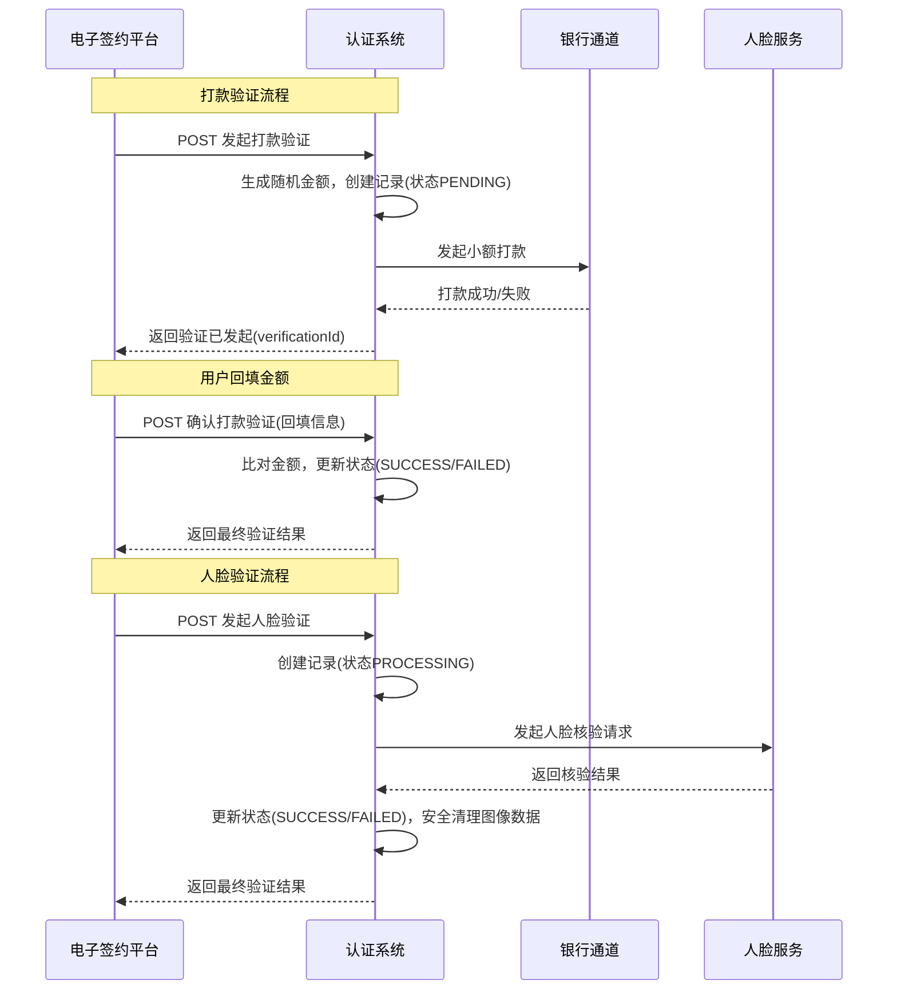

# 模块设计: 认证系统

生成时间: 2026-01-21 16:18:28
批判迭代: 2

---

# 认证系统设计文档

## 1. 概述
- **目的与范围**: 认证系统是提供身份与账户有效性验证能力的中心化服务。其核心职责是为电子签约平台等上游系统提供"打款验证"和"人脸验证"接口，以支持天财分账业务中"关系绑定"流程的身份认证环节。本模块不负责协议签署、流程编排或业务逻辑处理，仅专注于验证本身。验证结果由电子签约平台接收，并由其负责更新行业钱包系统中的绑定关系状态。

## 2. 接口设计
- **API端点 (REST/GraphQL)**:
    - `POST /api/v1/payment-verification/initiate`: 发起打款验证。
    - `POST /api/v1/payment-verification/confirm`: 确认（回填）打款验证。
    - `POST /api/v1/face-verification`: 发起人脸验证。
    - `GET /api/v1/verifications/{id}`: 查询验证请求状态。
- **请求/响应结构**:
    - 发起打款验证请求 (`POST /api/v1/payment-verification/initiate`):
        - 请求体: `{ "requestId": "string", "userId": "string", "bankAccount": { "accountNo": "string", "accountName": "string", "bankCode": "string" }, "callbackUrl": "string" }`
        - 响应体: `{ "verificationId": "string", "status": "PENDING" }`
    - 确认打款验证请求 (`POST /api/v1/payment-verification/confirm`):
        - 请求体: `{ "verificationId": "string", "filledAmount": "string", "remark": "string" }`
        - 响应体: `{ "verificationId": "string", "status": "SUCCESS/FAILED", "message": "string" }`
    - 人脸验证请求 (`POST /api/v1/face-verification`):
        - 请求体: `{ "requestId": "string", "userId": "string", "name": "string", "idNumber": "string", "faceImage": "base64_string", "callbackUrl": "string" }`
        - 响应体: `{ "verificationId": "string", "status": "PROCESSING" }`
- **发布/消费的事件**: TBD

## 3. 数据模型
- **表/集合**:
    - `verification_requests`: 验证请求主表。
        - 关键字段: `id` (主键), `type` (ENUM: `PAYMENT`, `FACE`), `user_id`, `request_id` (外部请求ID), `status` (ENUM: `PENDING`, `PROCESSING`, `SUCCESS`, `FAILED`, `EXPIRED`), `callback_url`, `result_data` (JSON), `expires_at`, `created_at`, `updated_at`。
    - `payment_attempts`: 打款验证详情表。
        - 关键字段: `id` (主键), `verification_id` (外键), `bank_account_info` (JSON), `random_amount` (加密存储), `payment_status`, `external_payment_ref`, `created_at`。
- **与其他模块的关系**: 本模块由电子签约平台调用，以完成签约与认证流程。验证结果（如打款验证回填金额、人脸核验结果）需返回给调用方（电子签约平台），并由电子签约平台负责更新行业钱包系统中的绑定关系状态。

## 4. 业务逻辑
- **核心工作流/算法**:
    1.  **打款验证流程**:
        - 接收调用方请求，包含待验证的银行卡信息。
        - 生成并安全存储一笔随机金额。
        - 向指定银行卡发起小额打款。
        - 将验证请求状态置为 `PENDING`，并设置过期时间（如24小时）。
        - 等待并接收用户回填的金额与备注信息。
        - 比对回填信息与发起打款的信息，验证账户的有效性与控制权。
        - 更新验证请求状态为 `SUCCESS` 或 `FAILED`，并通过回调URL通知调用方。
    2.  **人脸验证流程**:
        - 接收调用方请求，包含姓名、身份证号和人脸图像信息。
        - 将验证请求状态置为 `PROCESSING`。
        - 调用底层人脸识别服务，比对姓名、身份证和人脸信息的一致性。
        - 接收核验结果，更新验证请求状态为 `SUCCESS` 或 `FAILED`，并通过回调URL通知调用方。
- **业务规则与验证**:
    - 打款验证的金额需为随机生成，并在传输和存储过程中加密，确保安全性。
    - 人脸验证需遵循相关法规，确保个人信息安全。人脸图像等敏感个人身份信息（PII）在处理完成后的一段有限时间（如7天）内必须被安全删除。
    - 需记录验证请求与结果日志，用于审计。
    - 所有验证请求均应有状态（`PENDING`, `PROCESSING`, `SUCCESS`, `FAILED`, `EXPIRED`）和生命周期管理，过期请求自动标记为 `EXPIRED`。
- **关键边界情况处理**:
    - 打款验证中，用户多次回填错误：应设置尝试次数上限（如3次），达到上限后将验证状态标记为 `FAILED`。
    - 人脸验证网络超时或服务不可用：应实现熔断机制，返回明确的错误码，并允许调用方根据策略重试。
    - 验证请求参数非法：应进行参数校验（如身份证格式、银行卡号Luhn校验），并返回具体错误信息。

## 5. 时序图

## 6. 错误处理
- **预期错误情况**:
    - `400 Bad Request`: 输入参数校验失败（如身份证格式错误、银行卡号无效、请求体格式错误）。
    - `404 Not Found`: 验证记录 (`verificationId`) 不存在。
    - `409 Conflict`: 验证请求已过期或处于不可回填状态。
    - `422 Unprocessable Entity`: 业务逻辑错误（如回填金额不匹配、人脸比对失败）。
    - `502 Bad Gateway`: 下游服务（银行通道、人脸服务）调用失败或返回不可用。
    - `504 Gateway Timeout`: 调用下游服务网络超时。
- **处理策略**:
    - 对依赖的外部服务（银行通道、人脸服务）实现熔断器模式，防止级联故障。配置熔断阈值（如5分钟内失败50%请求）和半开状态探测。
    - 定义清晰的错误码枚举（如 `INVALID_PARAMETER`, `VERIFICATION_EXPIRED`, `PAYMENT_MISMATCH`, `FACE_MATCH_FAILED`, `EXTERNAL_SERVICE_UNAVAILABLE`）和用户友好的错误信息。
    - 对于网络波动导致的失败，对下游服务调用实现带退避策略的重试机制（如最多3次，指数退避）。
    - 所有错误均记录详细日志（包含请求ID、验证ID、错误码和上下文），但敏感信息需脱敏。

## 7. 依赖关系
- **上游模块**: 电子签约平台（主要调用方，负责发起验证请求并接收结果，进而更新行业钱包系统状态）。
- **下游模块**:
    - 银行通道服务（用于执行小额打款）。
    - 第三方人脸识别服务（用于执行人脸核验）。
- **数据与流程关联**:
    - 行业钱包系统：不直接依赖。认证系统的验证结果是"关系绑定"流程的关键输入，由电子签约平台在认证通过后，调用行业钱包系统的接口更新绑定关系状态。