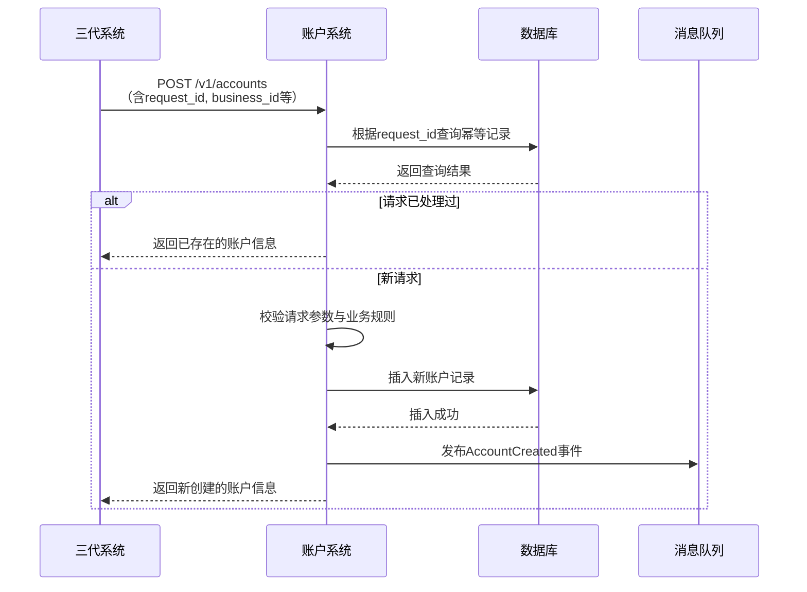

# 模块设计: 账户系统

生成时间: 2026-01-21 16:18:04
批判迭代: 2

---

# 账户系统模块设计文档

## 1. 概述
- **目的与范围**: 账户系统是底层账户服务，负责为天财业务开立和标记专用的"天财收款账户"（行业钱包类型），并控制其专属能力。其核心职责包括账户的创建、状态管理、能力标记，并向上游系统提供账户服务。其边界止于账户的底层数据操作，不包含业务层面的分账、归集等流程。账户系统是"行业钱包系统"的一个底层服务组件，专注于账户实体本身的创建与标记，而"行业钱包系统"则负责基于此账户实体进行业务层面的关系绑定、分账处理等。

## 2. 接口设计
- **API端点 (REST)**:
    - `POST /v1/accounts`: 创建天财专用账户。
    - `GET /v1/accounts/{accountId}`: 查询账户详情。
    - `PATCH /v1/accounts/{accountId}/status`: 更新账户状态（如冻结、解冻）。
- **请求/响应结构**:
    - **创建账户请求体**:
        ```json
        {
          "request_id": "string, 请求唯一标识，用于幂等",
          "business_id": "string, 天财业务标识（来自三代系统）",
          "merchant_id": "string, 商户ID",
          "account_type": "INDUSTRY_WALLET",
          "capabilities": ["ACTIVE_SETTLEMENT", "TIANCAI_SPECIAL"]
        }
        ```
    - **创建账户成功响应体**:
        ```json
        {
          "code": "SUCCESS",
          "message": "ok",
          "data": {
            "account_id": "string, 生成的账户唯一ID",
            "business_id": "string",
            "merchant_id": "string",
            "account_type": "INDUSTRY_WALLET",
            "status": "ACTIVE",
            "capabilities": ["ACTIVE_SETTLEMENT", "TIANCAI_SPECIAL"],
            "creation_time": "2023-10-01T12:00:00Z"
          }
        }
        ```
- **发布/消费的事件**:
    - **发布事件**: `AccountCreated`。当账户创建成功后，发布此事件，供行业钱包系统等下游消费者订阅。
        - 事件载荷: 包含 `account_id`, `business_id`, `merchant_id`, `account_type`, `status`, `capabilities`, `creation_time`。
    - **消费事件**: TBD。

## 3. 数据模型
- **表/集合**: `tiancai_accounts`
- **关键字段**:
    - `account_id` (主键): 账户唯一标识。
    - `business_id`: 关联的天财业务标识。
    - `merchant_id`: 关联的商户ID。
    - `account_type`: 账户类型，固定为 `INDUSTRY_WALLET`。
    - `status`: 账户状态，如 `ACTIVE`, `FROZEN`, `CLOSED`。
    - `capabilities`: 账户能力列表，如 `["ACTIVE_SETTLEMENT", "TIANCAI_SPECIAL"]`。
    - `creation_time`: 创建时间。
    - `update_time`: 更新时间。
- **与其他模块的关系**: 本表是账户系统的核心存储。`account_id` 将作为关键标识被"行业钱包系统"的业务表（如关系绑定表）所引用。"三代系统"通过 `business_id` 或 `merchant_id` 进行关联查询。

## 4. 业务逻辑
- **核心工作流/算法**:
    1.  **接收请求**: 接收来自"三代系统"的创建账户请求。
    2.  **幂等校验**: 使用请求中的 `request_id` 进行幂等性检查，防止重复创建。
    3.  **请求验证**:
        - 校验必填字段 (`business_id`, `merchant_id`, `account_type`) 是否存在。
        - 校验 `account_type` 必须为 `INDUSTRY_WALLET`。
        - 校验同一 `business_id` 和 `merchant_id` 组合下是否已存在有效的行业钱包账户（根据业务规则，可能限制唯一性）。
    4.  **账户创建**: 生成唯一 `account_id`，在 `tiancai_accounts` 表中插入记录。状态初始化为 `ACTIVE`。
    5.  **能力标记**: 将请求中的 `capabilities`（如支持"主动结算"）持久化到账户记录中。
    6.  **发布事件**: 异步发布 `AccountCreated` 事件。
    7.  **返回响应**: 将创建的账户信息返回给调用方。
- **业务规则与验证**:
    - 账户创建需确保 `(business_id, merchant_id, account_type)` 组合的唯一性（或根据业务要求调整）。
    - "专属能力"通过 `capabilities` 字段定义和存储，在创建时由请求指定并固化。
    - 账户状态变更（如冻结）需记录操作日志，并可能触发对下游系统的通知。
- **关键边界情况处理**:
    - **重复请求**: 通过 `request_id` 实现幂等，若已存在相同 `request_id` 的成功记录，则直接返回已创建的账户信息。
    - **依赖服务不可用**: 如数据库写入失败，应明确失败并向上游返回系统错误，由上游决定是否重试。
    - **账户状态异常**: 当账户处于 `FROZEN` 或 `CLOSED` 状态时，拒绝部分业务操作（具体拒绝逻辑由调用方业务系统处理）。

## 5. 时序图


## 6. 错误处理
- **预期错误情况与处理策略**:
    - `INVALID_PARAMETER` (HTTP 400): 请求参数缺失或格式错误。返回具体字段错误信息。
    - `ACCOUNT_CONFLICT` (HTTP 409): 违反账户唯一性规则（如重复开户）。返回冲突的账户ID。
    - `IDEMPOTENCY_CONFLICT` (HTTP 409): `request_id` 冲突，但业务数据不一致。需人工介入处理。
    - `DEPENDENCY_UNAVAILABLE` (HTTP 503): 依赖服务（如数据库、消息队列）暂时不可用。系统应记录错误日志，并向上游返回可重试的错误。可配置有限次数的重试机制。
    - `INTERNAL_ERROR` (HTTP 500): 未预期的系统内部错误。记录详细日志并告警。
- **重试策略**: 对于因依赖服务短暂故障导致的失败，调用方（三代系统）可按照退避策略进行重试。账户系统自身对下游（如消息队列）的调用也应具备重试机制。

## 7. 依赖关系
- **上游模块**:
    - **三代系统**: 调用本系统的开户接口，是主要的服务消费者。
- **下游模块**:
    - **行业钱包系统**: 订阅 `AccountCreated` 事件，获取账户数据以进行后续的业务关系绑定与处理。账户系统是其底层账户数据的提供者。
    - **清结算系统**: 可能通过行业钱包系统或直接查询账户信息，用于执行账户冻结等操作。依赖关系为间接依赖。
- **内部依赖**:
    - 数据库 (用于持久化 `tiancai_accounts`)
    - 消息队列 (用于发布 `AccountCreated` 事件)