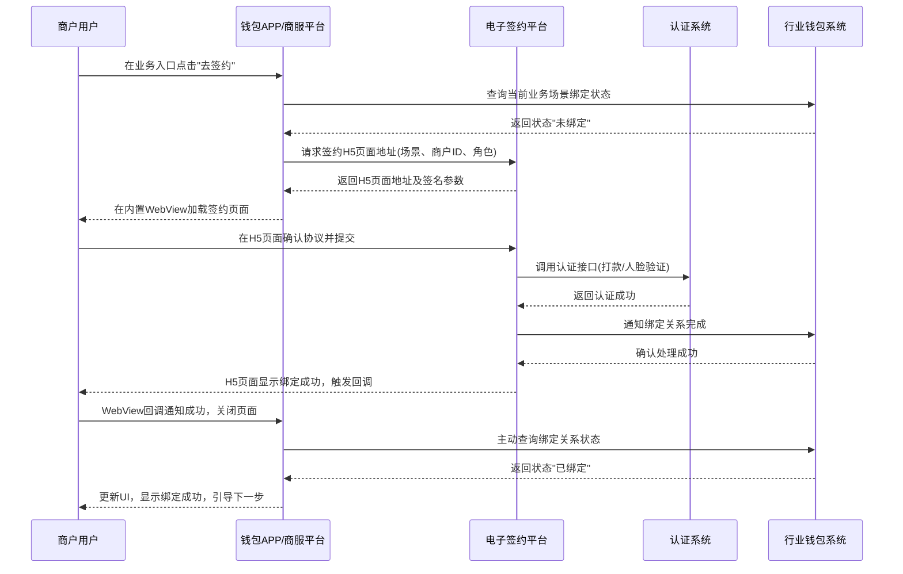
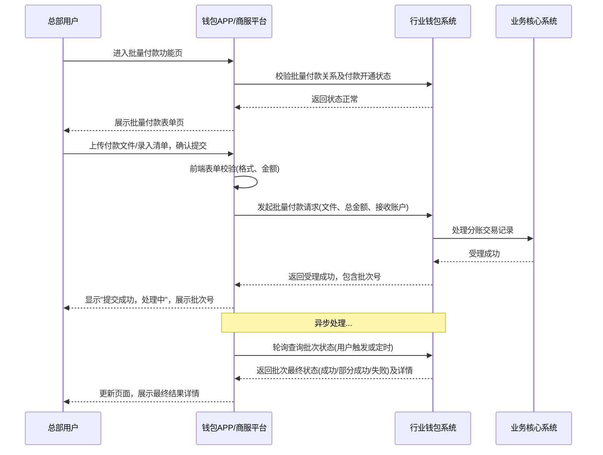

# 模块设计: 钱包APP/商服平台

生成时间: 2026-01-21 16:18:50
批判迭代: 2

---

# 钱包APP/商服平台 模块设计文档

## 1. 概述
- **目的与范围**：本模块是面向商户（如天财业务中的总部与门店）的操作平台。它是一个独立的商服平台，可通过H5或小程序等形式集成到钱包APP中，也可作为独立的Web应用部署。其核心职责是为商户提供天财分账业务相关的操作界面与前端逻辑，例如查看账户信息、发起或管理归集/批量付款/会员结算流程、处理关系绑定与开通付款的授权签约、查询账单等。其边界在于提供用户交互界面、前端状态管理以及与后端服务的接口调用，不包含底层业务处理与核心系统逻辑。
- **部署与集成**：本模块是一个独立的前端应用。它通过API与后端服务通信，并通过WebView或SDK方式嵌入到钱包APP中，为商户提供统一的业务操作入口。

## 2. 接口设计
- **API端点 (REST)**：本模块作为前端应用，主要消费后端服务提供的RESTful API。关键接口类别包括：
    - **商户信息接口**：从三代系统获取商户基础信息、角色（总部/门店）及业务配置。
    - **账户与绑定状态接口**：从行业钱包系统查询天财专用账户信息、关系绑定状态及授权开通状态。
    - **业务发起接口**：向行业钱包系统提交归集、批量付款、会员结算的请求。
    - **账单查询接口**：从对账单系统获取天财分账、提款、收单、结算等各类账单。
    - **签约跳转接口**：从电子签约平台获取特定业务场景的签约H5页面地址。
- **请求/响应结构**：TBD（由各后端服务定义）。
- **发布/消费的事件**：本模块作为前端，主要监听用户交互事件和网络状态事件，不主动发布业务领域事件。它消费后端服务通过接口返回的业务状态变更信息。

## 3. 数据模型
本节描述前端应用内部管理的客户端数据结构和状态模型，不涉及服务端持久化。
- **客户端状态模型**：
    - **用户会话 (UserSession)**: 存储登录态、用户标识（商户ID）、角色（总部/门店）、令牌等信息。
    - **应用配置 (AppConfig)**: 存储API端点、功能开关、静态文案等配置信息。
    - **商户上下文 (MerchantContext)**: 缓存当前商户的基础信息、所属天财机构标识、可用业务场景列表。
- **业务视图模型 (View Models)**：
    - **账户视图 (AccountView)**: 用于界面展示的天财收款/接收方账户信息，包括账户状态、绑定银行卡列表、默认提现卡等。
    - **绑定关系视图 (BindingView)**: 展示当前商户在归集、批量付款、会员结算各场景下的关系绑定状态（未绑定/已绑定/已过期）及付方开通状态。
    - **业务单视图 (OrderView)**: 用于展示和提交归集、批量付款、会员结算请求的表单数据模型及结果状态。
    - **账单视图 (BillView)**: 用于展示账单列表和详情的视图模型，包含账单类型、周期、金额、状态等字段。
- **本地持久化策略**：
    - **持久化数据**：用户登录令牌、用户偏好设置（如上次查询的账单类型）将使用本地存储（如LocalStorage）进行持久化，以提升用户体验。
    - **缓存策略**：对相对静态的数据（如商户信息、业务配置）和频繁查询的数据（如账户状态）实施内存缓存，并设置合理的过期时间。账单列表等数据使用分页加载，不进行全量缓存。

## 4. 业务逻辑
- **核心工作流/算法**：
    1.  **关系绑定流程**：
        - **入口**：商户在功能入口（如"归集管理"、"批量付款"）点击"去签约"。
        - **角色判断**：根据当前用户角色（总部/门店）和业务场景，确定绑定关系中的身份（付方或收方）。
        - **状态检查**：调用行业钱包系统接口，检查是否已存在有效绑定。
        - **跳转签约**：若未绑定，调用电子签约平台接口，获取携带了场景、身份等参数的签约H5页面地址，并在应用内WebView中加载。
        - **结果同步**：监听WebView回调或轮询绑定状态，成功后更新本地状态并提示用户。
    2.  **开通付款流程**（适用于批量付款和会员结算场景）：
        - **前提**：付方（总部或门店-对公企业）已完成基础的关系绑定。
        - **触发**：当付方首次尝试发起批量付款或会员结算时，若检测到未开通付款授权，则引导进入开通流程。
        - **流程**：与关系绑定流程类似，但签约协议内容为付款专项授权。调用电子签约平台特定接口获取开通付款的H5页面。
        - **状态管理**：独立于关系绑定状态，专门记录"付款开通状态"。
    3.  **业务发起与查询流程**：
        - **归集发起**（总部操作）：
            - 校验：总部角色、已绑定归集关系、门店账户状态正常。
            - 表单：选择门店（付方）、输入归集金额、选择手续费承担方。
            - 提交：调用行业钱包系统归集接口。
        - **批量付款发起**（总部操作）：
            - 校验：总部角色、已绑定批量付款关系、已开通付款授权、接收方账户状态正常。
            - 表单：上传付款文件（或录入列表）、选择接收方账户、确认总金额。
            - 提交：调用行业钱包系统批量付款接口。
        - **会员结算发起**（总部操作）：
            - 校验：总部角色、已绑定会员结算关系、已开通付款授权、门店（收方）账户状态正常。
            - 表单：选择结算周期、确认结算金额明细。
            - 提交：调用行业钱包系统会员结算接口。
        - **账单查询**（总部/门店均可）：
            - 根据角色过滤可查看的账单类型（如门店可能只能查看被归集账单）。
            - 提供按时间、类型、状态等多维度查询和分页加载。
- **业务规则与验证**：
    - **角色权限映射**：
        - **总部**：可操作归集发起、批量付款发起、会员结算发起；可查看所有关联门店的账单及自身发起的业务记录。
        - **门店**：不可发起归集、批量付款、会员结算；仅可查看与本门店相关的账单（如被归集记录、会员结算到账记录）及账户信息。
    - **前置状态校验**：在进入每个业务功能页或发起请求前，调用接口校验必要的绑定关系与付款开通状态，并引导未完成的用户前往办理。
    - **前端表单校验**：对金额（格式、范围）、必填项、文件格式（如批量付款文件）进行即时校验。
- **关键边界情况处理**：
    - 网络异常或后端服务不可用时，显示统一网络错误提示页，并提供重试机制。
    - 在签约或认证H5页面中，用户操作中断或失败时，捕获回调并引导用户返回平台重试或查看帮助。
    - 处理业务异步处理状态：提交后显示"处理中"，通过轮询或WebSocket（若支持）获取最终状态（成功/失败），并展示相应结果页。

## 5. 时序图

### 5.1 关系绑定时序图

### 5.2 批量付款发起时序图

## 6. 错误处理
- **预期错误情况**：
    - **网络与接口错误**：API调用超时、4xx（如认证失败、参数错误）、5xx（服务端异常）。
    - **业务逻辑错误**：前置条件不满足（如未绑定、未开通付款、账户冻结）、业务规则校验失败（如余额不足、金额超限）。
    - **第三方集成错误**：电子签约平台H5页面加载失败、认证流程异常中断、回调签名验证失败。
    - **客户端错误**：本地存储读写异常、表单数据格式错误。
- **处理策略**：
    - **网络/接口错误**：展示友好的全局错误提示（如"网络开小差，请重试"），并提供重试按钮。记录错误日志（含请求上下文）。
    - **业务逻辑错误**：展示后端返回的、经过处理的友好错误信息，并明确引导用户下一步操作（如"您尚未开通付款权限，请先开通"）。
    - **第三方集成错误**：捕获WebView加载错误或回调异常，引导用户返回平台重试，或提供客服联系渠道。
    - **降级与兼容**：对于非核心功能依赖的接口失败（如部分账单类型查询失败），允许部分功能可用，并给出提示。

## 7. 依赖关系
- **上游模块/服务**：
    - **电子签约平台**：提供签约流程的H5封装与协议管理。**依赖接口**：获取签约页面地址、接收签约结果回调。
    - **行业钱包系统**：提供账户信息、绑定状态查询、业务发起与状态查询接口。**核心依赖**。
    - **三代系统**：提供商户基础信息、角色、业务配置查询接口。**核心依赖**。
    - **对账单系统**：提供各类账单查询与下载接口。**核心依赖**。
    - **认证系统**：能力通过电子签约平台间接调用，不直接依赖。
- **下游模块**：无。本模块为前端表示层，不向其他业务模块提供服务接口。
- **集成方**：
    - **钱包APP**：作为宿主容器，提供WebView环境、用户登录态共享、原生能力（如推送）调用。