# DocuFlow-AI Project - 软件设计文档
生成时间: 2026-01-21 14:42:23

## 目录
1. [概述说明](#1-概述说明)
   - 1.1 [术语与缩略词](#11-术语与缩略词)
2. [系统设计](#2-系统设计)
3. [模块设计](#3-模块设计)
   - 3.1 [账户系统](#31-账户系统)
   - 3.2 [认证系统](#32-认证系统)
   - 3.3 [清结算系统](#33-清结算系统)
   - 3.4 [计费中台](#34-计费中台)
   - 3.5 [业务核心系统](#35-业务核心系统)
   - 3.6 [钱包app/商服平台](#36-钱包app商服平台)
   - 3.7 [三代系统](#37-三代系统)
   - 3.8 [电子签约平台](#38-电子签约平台)
   - 3.9 [行业钱包系统](#39-行业钱包系统)
   - 3.10 [对账单系统](#310-对账单系统)
4. [接口设计](#4-接口设计)
5. [数据库设计](#5-数据库设计)

---
# 1 概述说明

## 1.1 术语与缩略词


## 业务实体

- **天财分账**: 天财商龙门店分账、会员结算、批量付款的业务需求，涉及天财专用账户及分账接口。
- **天财收款账户** (别名: 天财专用账户): 为收单商户开立的专用账户，类型为行业钱包（非小微钱包），用于收款和分账。
- **天财接收方账户** (别名: 天财专用账户): 在三代、钱包系统开立的专用账户，支持绑定多张银行卡并设置默认提现卡，用于接收分账资金。
- **分账手续费承担方**: 指定由付方或收方统一承担转账手续费的业务规则。
- **资金用途**: 用于区分不同业务场景下的转账目的，如缴纳品牌费、供应商付款、会员结算等，影响协议内容。

## 角色

- **总部** (别名: 总店, 发起方): 业务中的发起方和管理方，通常为企业商户，负责发起归集、批量付款、会员结算等指令。
- **门店** (别名: 被归集方, 付方, 收方): 业务中的被归集方或收款方，可以是企业或个人商户，接受总部的归集或分账指令。

## 流程

- **归集** (别名: 归集授权): 资金从门店（付方）的收款账户归集到总部（收方）的收款账户的业务场景。
- **批量付款** (别名: 批付): 总部从天财收款账户分账给天财接收方账户的业务场景，如供应商付款、股东分红等。
- **会员结算**: 总部从天财收款账户分账给门店的天财收款账户的业务场景，用于会员相关的资金结算。
- **关系绑定** (别名: 签约与认证): 在归集、批量付款、会员结算场景下，建立收付双方授权关系并进行签约认证的流程。
- **开通付款**: 在批量付款和会员结算场景下，付方（总部/门店）需要额外完成的签约认证流程，以开通付款能力。

## 技术术语

- **打款验证**: 认证系统发起小额随机金额打款，通过验证回填金额和备注来确认账户信息有效性的认证方式。
- **人脸验证**: 通过比对姓名、身份证和人脸信息，确认个人或个体接收方身份一致性的认证方式。
- **主动结算**: 一种结算模式，资金结算至商户指定的收款账户（如天财收款账户）。
- **被动结算**: 一种结算模式，资金暂存于待结算账户，后续根据指令处理。

## 系统角色

- **电子签约平台** (别名: 电子签章系统): 负责协议模板管理、短信推送、H5页面封装、以及留存协议和认证过程证据链的系统。
- **行业钱包系统** (别名: 钱包系统): 负责天财专用账户管理、关系绑定校验、分账请求处理及与各系统交互的核心业务系统。
- **三代系统**: 负责商户管理、开户接口调用、结算模式配置、分账关系绑定接口提供的系统。
- **账户系统**: 底层账户服务系统，负责开立和标记天财专用账户，控制账户能力。
- **清结算系统** (别名: 清结算): 负责结算账户配置、退货账户查询、专用账户冻结及计费处理的系统。
- **对账单系统**: 负责生成天财机构层的分账、提款、收单、结算等各类对账单的系统。
- **计费中台**: 提供转账计费能力，接收三代系统同步的手续费配置并进行计费处理的系统。
- **业务核心系统** (别名: 业务核心): 接收并处理'天财分账'交易记录的系统。
- **认证系统**: 提供打款验证和人脸验证接口，进行身份核验的系统。

---
# 2 系统设计
## 2.1 系统结构
天财分账系统采用分层架构，旨在为天财商龙商户提供门店分账、会员结算与批量付款服务。系统以行业钱包系统为核心业务处理引擎，整合账户、认证、签约、清结算等能力，通过三代系统作为统一业务入口，为钱包App/商服平台提供前端服务支持。

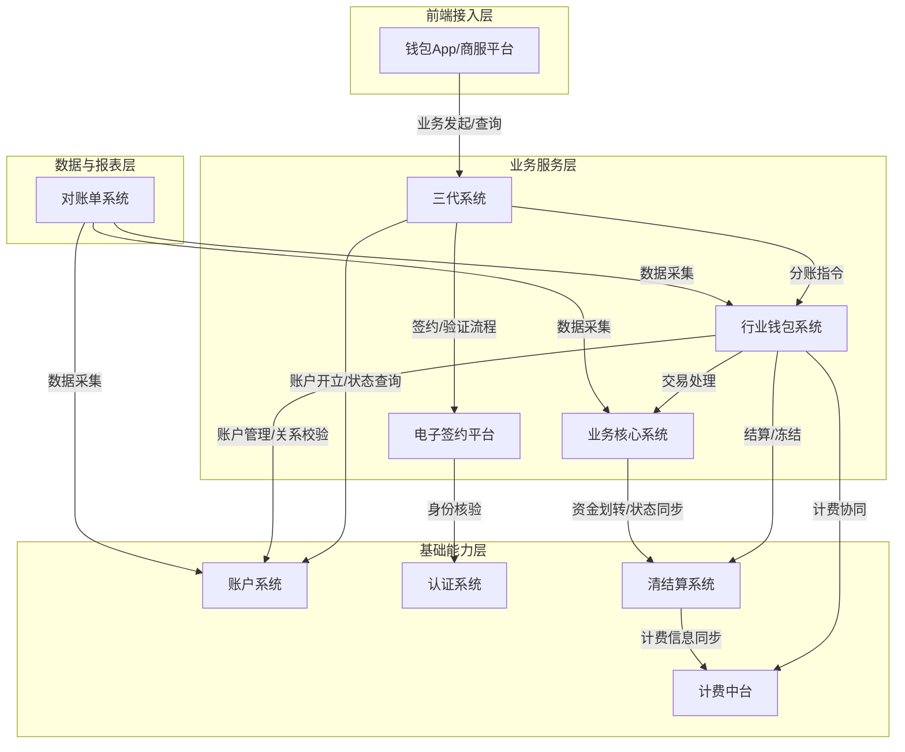
```mermaid
graph TB
    subgraph "前端接入层"
        A[钱包App/商服平台]
    end

    subgraph "业务服务层"
        B1[三代系统]
        B2[行业钱包系统]
        B3[电子签约平台]
        B4[业务核心系统]
    end

    subgraph "基础能力层"
        C1[账户系统]
        C2[认证系统]
        C3[清结算系统]
        C4[计费中台]
    end

    subgraph "数据与报表层"
        D[对账单系统]
    end

    A -- 业务发起/查询 --> B1
    B1 -- 账户开立/状态查询 --> C1
    B1 -- 签约/验证流程 --> B3
    B1 -- 分账指令 --> B2
    B2 -- 账户管理/关系校验 --> C1
    B2 -- 交易处理 --> B4
    B2 -- 结算/冻结 --> C3
    B2 -- 计费协同 --> C4
    B3 -- 身份核验 --> C2
    B4 -- 资金划转/状态同步 --> C3
    C3 -- 计费信息同步 --> C4
    D -- 数据采集 --> B2
    D -- 数据采集 --> C1
    D -- 数据采集 --> B4
```

## 2.2 功能结构
系统功能围绕天财分账的核心业务流程展开，主要划分为账户与商户管理、关系绑定与认证、资金分账处理、清结算与计费、以及数据对账五大功能域。

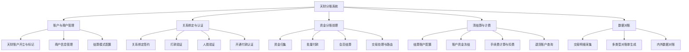
```mermaid
graph TD
    Root[天财分账系统] --> F1[账户与商户管理]
    Root --> F2[关系绑定与认证]
    Root --> F3[资金分账处理]
    Root --> F4[清结算与计费]
    Root --> F5[数据对账]

    F1 --> F1_1[天财账户开立与标记]
    F1 --> F1_2[商户信息管理]
    F1 --> F1_3[结算模式配置]

    F2 --> F2_1[关系绑定签约]
    F2 --> F2_2[打款验证]
    F2 --> F2_3[人脸验证]
    F2 --> F2_4[开通付款认证]

    F3 --> F3_1[资金归集]
    F3 --> F3_2[批量付款]
    F3 --> F3_3[会员结算]
    F3 --> F3_4[交易处理与路由]

    F4 --> F4_1[结算账户配置]
    F4 --> F4_2[账户资金冻结]
    F4 --> F4_3[手续费计算与扣费]
    F4 --> F4_4[退货账户查询]

    F5 --> F5_1[交易明细采集]
    F5 --> F5_2[多类型对账单生成]
    F5 --> F5_3[内外数据对账]
```

## 2.3 网络拓扑图
TBD

## 2.4 数据流转
数据流转以核心业务流程驱动，涉及商户信息、账户信息、关系绑定数据、交易指令及资金流水在多系统间的传递与状态同步。

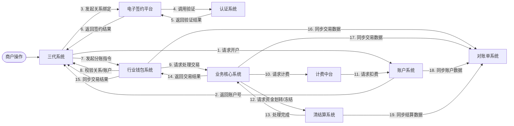
```mermaid
flowchart LR
    Start([商户操作]) --> Step1[三代系统]
    Step1 -- 1. 请求开户 --> Step2[账户系统]
    Step2 -- 2. 返回账户号 --> Step1
    Step1 -- 3. 发起关系绑定 --> Step3[电子签约平台]
    Step3 -- 4. 调用验证 --> Step4[认证系统]
    Step4 -- 5. 返回验证结果 --> Step3
    Step3 -- 6. 返回签约结果 --> Step1
    Step1 -- 7. 发起分账指令 --> Step5[行业钱包系统]
    Step5 -- 8. 校验关系/账户 --> Step1
    Step5 -- 9. 请求处理交易 --> Step6[业务核心系统]
    Step6 -- 10. 请求计费 --> Step7[计费中台]
    Step7 -- 11. 请求扣费 --> Step2
    Step6 -- 12. 请求资金划转/冻结 --> Step8[清结算系统]
    Step8 -- 13. 处理完成 --> Step6
    Step6 -- 14. 返回交易结果 --> Step5
    Step5 -- 15. 同步交易结果 --> Step1
    Step5 -- 16. 同步交易数据 --> Step9[对账单系统]
    Step6 -- 17. 同步交易数据 --> Step9
    Step2 -- 18. 同步账户数据 --> Step9
    Step8 -- 19. 同步结算数据 --> Step9
```

## 2.5 系统模块交互关系
模块间通过定义清晰的接口进行协作。三代系统作为主要业务入口，依赖行业钱包系统处理核心分账逻辑；行业钱包系统作为枢纽，协调账户、清结算、计费等底层能力；对账单系统作为数据汇总端，依赖多个业务模块提供数据。

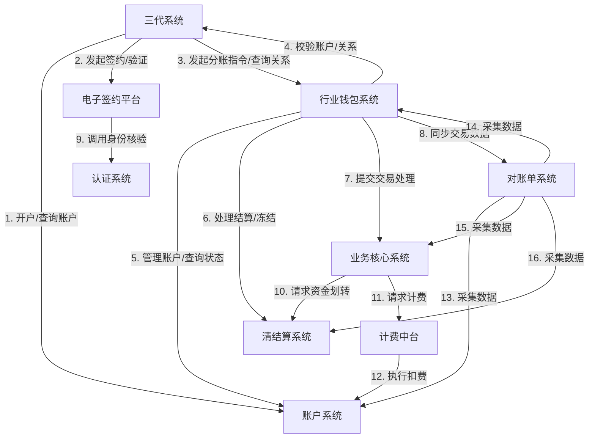
```mermaid
graph TD
    A[三代系统]
    B[行业钱包系统]
    C[账户系统]
    D[电子签约平台]
    E[认证系统]
    F[清结算系统]
    G[计费中台]
    H[业务核心系统]
    I[对账单系统]

    A -- 1. 开户/查询账户 --> C
    A -- 2. 发起签约/验证 --> D
    A -- 3. 发起分账指令/查询关系 --> B
    B -- 4. 校验账户/关系 --> A
    B -- 5. 管理账户/查询状态 --> C
    B -- 6. 处理结算/冻结 --> F
    B -- 7. 提交交易处理 --> H
    B -- 8. 同步交易数据 --> I
    D -- 9. 调用身份核验 --> E
    H -- 10. 请求资金划转 --> F
    H -- 11. 请求计费 --> G
    G -- 12. 执行扣费 --> C
    I -- 13. 采集数据 --> C
    I -- 14. 采集数据 --> B
    I -- 15. 采集数据 --> H
    I -- 16. 采集数据 --> F
```
---
# 3 模块设计

## 3.1 账户系统

批判迭代: 2


# 账户系统模块设计文档

## 1. Overview
- **Purpose and scope**: 账户系统是底层账户服务系统，负责开立和标记天财专用账户，控制账户能力。其核心职责是为天财分账业务提供专用的行业钱包账户（非小微钱包）的创建、标识和管理功能。

## 2. Interface Design
- **API endpoints (REST/GraphQL)**:
    1.  `POST /api/v1/accounts/tiancai`: 开立天财专用账户。
    2.  `POST /api/v1/accounts/{accountId}/tags`: 为账户添加标记。
    3.  `PUT /api/v1/accounts/{accountId}/status`: 更新账户状态（如冻结/解冻）。
    4.  `GET /api/v1/accounts/{accountId}`: 查询账户详情。
- **Request/response structures**:
    - **开立账户请求 (`POST /api/v1/accounts/tiancai`)**:
        ```json
        {
          "requestId": "string, 请求唯一标识",
          "merchantId": "string, 商户ID",
          "merchantType": "string, 商户类型 (HEADQUARTERS/STORE)",
          "businessSource": "string, 业务来源 (e.g., THIRD_GENERATION_SYSTEM)"
        }
        ```
    - **开立账户响应**:
        ```json
        {
          "code": "string, 响应码",
          "message": "string, 响应信息",
          "data": {
            "accountId": "string, 账户系统唯一账户ID",
            "walletAccountNo": "string, 行业钱包账户号",
            "status": "string, 账户状态"
          }
        }
        ```
    - **更新账户状态请求 (`PUT /api/v1/accounts/{accountId}/status`)**:
        ```json
        {
          "operation": "string, 操作类型 (FREEZE/UNFREEZE)",
          "reason": "string, 操作原因",
          "requestSource": "string, 请求来源系统 (e.g., SETTLEMENT_SYSTEM)"
        }
        ```
- **Published/consumed events (if any)**:
    - **Published Event**: `ACCOUNT_CREATED`
        - 当成功开立并标记天财专用账户后发布。
        - Payload: `{ "accountId": "string", "merchantId": "string", "accountType": "INDUSTRY_WALLET", "tag": "TIANCAI_SPECIAL" }`
    - **Consumed Event**: TBD

## 3. Data Model
- **Tables/collections**:
    1.  `tiancai_account`: 存储天财专用账户核心信息。
    2.  `account_status_log`: 记录账户状态变更历史。
- **Key fields**:
    - `tiancai_account` 表:
        - `id` (PK): 主键，账户系统内部ID。
        - `account_no`: 账户系统生成的账户号。
        - `wallet_account_no`: 对应的行业钱包系统账户号。
        - `merchant_id`: 商户ID。
        - `merchant_type`: 商户类型 (总部/门店)。
        - `account_type`: 账户类型 (固定为 `INDUSTRY_WALLET`)。
        - `status`: 账户状态 (`ACTIVE`, `FROZEN`, `CLOSED`)。
        - `tag`: 账户标记 (固定为 `TIANCAI_SPECIAL`)。
        - `created_at`, `updated_at`: 时间戳。
    - `account_status_log` 表:
        - `id` (PK): 主键。
        - `account_id`: 关联的账户ID。
        - `old_status`: 原状态。
        - `new_status`: 新状态。
        - `operation`: 操作类型。
        - `operator`: 操作者/系统。
        - `reason`: 原因。
        - `created_at`: 操作时间。
- **Relationships with other modules**:
    - 为**行业钱包系统**提供天财专用账户的底层账户服务。
    - 接收**三代系统**的开户接口调用，开立天财专用账户。
    - 与**清结算系统**交互，支持专用账户的冻结操作。

## 4. Business Logic
- **Core workflows / algorithms**:
    1.  **账户开立**: 根据三代系统的请求，为收单商户开立类型为行业钱包的"天财专用账户"。
        - 调用底层账户服务创建行业钱包账户。
        - 在账户记录中设置 `account_type='INDUSTRY_WALLET'` 和 `tag='TIANCAI_SPECIAL'`。
        - 发布 `ACCOUNT_CREATED` 事件。
    2.  **账户标记**: 对开立的专用账户进行特殊标记，以标识其用于天财分账业务。
        - 标记在开户流程中自动完成，作为账户的一个固有属性。
    3.  **能力控制**: 管理账户的基础能力，如状态（正常、冻结）、交易权限等。
        - 提供冻结/解冻接口，供清结算等系统调用。
        - 状态变更时记录审计日志。
- **Business rules and validations**:
    - 天财专用账户必须为行业钱包类型，而非小微钱包。
    - 账户开立需关联到正确的商户（总部或门店）。
    - 同一商户（在相同业务来源下）只能开立一个天财专用账户。
    - 只有状态为 `ACTIVE` 的账户才能被冻结。
    - 只有状态为 `FROZEN` 的账户才能被解冻。
- **Key edge cases**:
    - **重复开户请求**: 基于 `requestId` 和 `merchantId` 进行幂等性处理，避免创建重复账户。
    - **商户信息无效**: 调用开户请求时，若关联的商户ID不存在或状态异常，则拒绝开户。
    - **底层账户创建失败**: 若调用行业钱包底层服务失败，整个开户事务回滚，向调用方返回失败。
    - **事件发布失败**: 账户创建成功但事件发布失败，需有补偿机制（如定时任务重试）确保下游系统感知。

## 5. Sequence Diagrams

### 5.1 账户开立流程
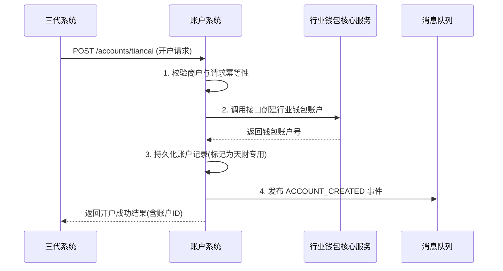
```mermaid
sequenceDiagram
    participant ThirdGen as 三代系统
    participant Account as 账户系统
    participant WalletCore as 行业钱包核心服务
    participant MQ as 消息队列

    ThirdGen->>Account: POST /accounts/tiancai (开户请求)
    Account->>Account: 1. 校验商户与请求幂等性
    Account->>WalletCore: 2. 调用接口创建行业钱包账户
    WalletCore-->>Account: 返回钱包账户号
    Account->>Account: 3. 持久化账户记录(标记为天财专用)
    Account->>MQ: 4. 发布 ACCOUNT_CREATED 事件
    Account-->>ThirdGen: 返回开户成功结果(含账户ID)
```

### 5.2 账户冻结流程 (与清结算系统交互)
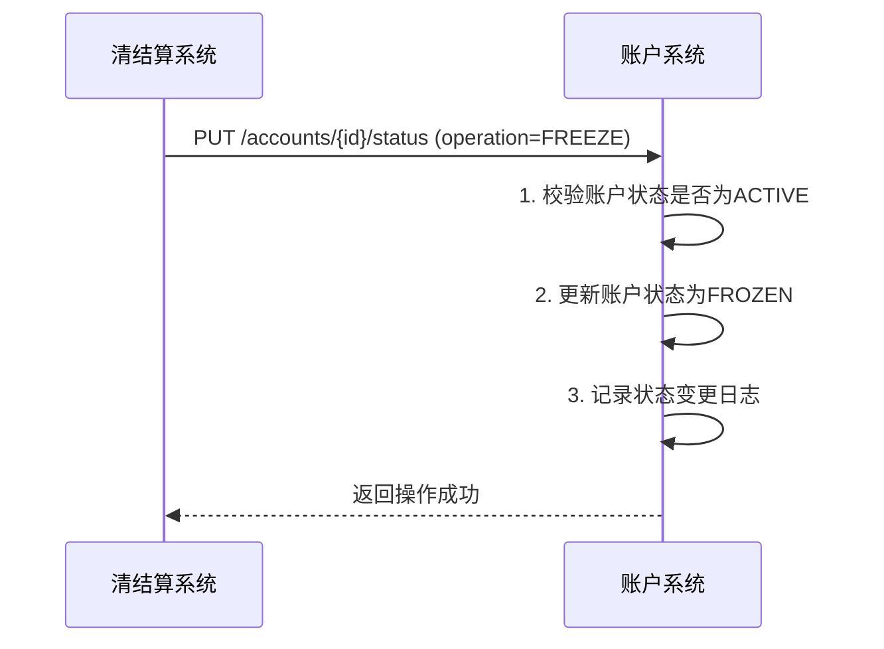
```mermaid
sequenceDiagram
    participant Settlement as 清结算系统
    participant Account as 账户系统

    Settlement->>Account: PUT /accounts/{id}/status (operation=FREEZE)
    Account->>Account: 1. 校验账户状态是否为ACTIVE
    Account->>Account: 2. 更新账户状态为FROZEN
    Account->>Account: 3. 记录状态变更日志
    Account-->>Settlement: 返回操作成功
```

## 6. Error Handling
- **Expected error cases**:
    1.  `INVALID_MERCHANT`: 请求开户的商户ID不存在或状态异常。
    2.  `DUPLICATE_ACCOUNT`: 同一商户已存在天财专用账户。
    3.  `WALLET_SERVICE_UNAVAILABLE`: 底层行业钱包服务不可用或超时。
    4.  `ACCOUNT_NOT_FOUND`: 操作（如冻结）指定的账户不存在。
    5.  `INVALID_STATUS_TRANSITION`: 非法的状态变更请求（如解冻一个活跃账户）。
    6.  `DUPLICATE_REQUEST`: 重复的请求ID。
- **Handling strategies**:
    - **输入校验错误** (`INVALID_MERCHANT`, `DUPLICATE_REQUEST`): 直接返回错误，提示调用方检查请求参数。
    - **业务逻辑错误** (`DUPLICATE_ACCOUNT`, `INVALID_STATUS_TRANSITION`): 返回明确的业务错误码和描述，不进行重试。
    - **外部依赖失败** (`WALLET_SERVICE_UNAVAILABLE`): 实现重试机制（如最多3次指数退避重试），若最终失败则整体事务回滚，并触发告警。
    - **系统异常**: 捕获未预期异常，记录详细日志，返回通用系统错误，并触发监控告警。

## 7. Dependencies
- **上游模块**:
    - **三代系统**: 调用账户系统的接口发起天财专用账户的开户请求。
- **下游模块**:
    - **行业钱包系统**: 依赖账户系统开立和标记的底层账户，通过事件驱动或接口查询获取账户信息，进行业务层的账户管理和关系绑定。
    - **清结算系统**: 调用账户系统进行专用账户的冻结等控制操作。根据术语表，清结算系统负责"专用账户冻结"，此交互是合理的。

## 3.2 认证系统

批判迭代: 2


# 认证系统 模块设计文档

## 1. Overview
- **Purpose and scope**: 认证系统负责提供打款验证和人脸验证接口，进行身份核验。其核心目的是通过小额打款或人脸比对的方式，确认账户信息有效性或接收方身份一致性，为关系绑定、开通付款等业务流程提供身份认证能力。

## 2. Interface Design
- **API endpoints (REST/GraphQL) if applicable**:
    1. `POST /api/v1/auth/payment-verification`: 发起打款验证。
    2. `POST /api/v1/auth/payment-verification/confirm`: 确认打款验证。
    3. `POST /api/v1/auth/face-verification`: 发起人脸验证。
- **Request/response structures (if known)**:
    - `POST /api/v1/auth/payment-verification`:
        - Request: `{ "account_number": "string", "account_name": "string", "bank_code": "string", "biz_scene": "string", "biz_id": "string" }`
        - Response: `{ "verification_id": "string", "status": "PENDING" }`
    - `POST /api/v1/auth/payment-verification/confirm`:
        - Request: `{ "verification_id": "string", "amount": "decimal", "remark_code": "string" }`
        - Response: `{ "status": "SUCCESS/FAILED" }`
    - `POST /api/v1/auth/face-verification`:
        - Request: `{ "name": "string", "id_number": "string", "face_image": "base64_string", "biz_scene": "string", "biz_id": "string" }`
        - Response: `{ "verification_id": "string", "status": "SUCCESS/FAILED", "score": "decimal" }`
- **Published/consumed events (if any)**: TBD

## 3. Data Model
- **Tables/collections**:
    1. `payment_verification_records`: 存储打款验证记录。
    2. `face_verification_records`: 存储人脸验证记录。
- **Key fields (only if present in context; otherwise TBD)**:
    - `payment_verification_records`: `id`, `verification_id`, `account_number`, `account_name`, `bank_code`, `amount`, `remark_code`, `status`, `biz_scene`, `biz_id`, `expires_at`, `created_at`, `updated_at`
    - `face_verification_records`: `id`, `verification_id`, `name`, `id_number`, `face_image_hash`, `status`, `score`, `biz_scene`, `biz_id`, `created_at`
- **Relationships with other modules**: 认证系统为电子签约平台、行业钱包系统等上游模块提供身份核验服务接口。

## 4. Business Logic
- **Core workflows / algorithms**:
    1. **打款验证流程**:
        - 接收认证请求，验证必要参数。
        - 生成一个在0.01元至1.00元之间的随机金额（保留两位小数）和一个6位数字验证码。
        - 将验证记录（含金额、验证码、状态、过期时间）持久化到`payment_verification_records`表。
        - 调用银行/支付通道接口，发起一笔包含该随机金额和验证码备注的打款。
        - 返回验证流水号(`verification_id`)给调用方。
        - 等待用户回填信息。收到确认请求后，根据`verification_id`查询记录，比对回填金额和验证码是否完全匹配，且请求在有效期内（如5分钟）。验证通过则更新状态为成功，否则为失败。
    2. **人脸验证流程**:
        - 接收包含姓名、身份证号和人脸图像（Base64编码）的请求。
        - 对图像进行基本校验（格式、大小）。
        - 调用底层人脸识别服务的比对接口，传入姓名、身份证号和图像。
        - 接收比对服务返回的相似度分数。
        - 根据预设阈值（如0.8）判断是否通过。将请求、结果和分数持久化到`face_verification_records`表。
        - 返回验证结果。
- **Business rules and validations**:
    1. 打款验证的金额需为随机生成（0.01-1.00元），且验证记录在5分钟内有效。
    2. 人脸验证需确保姓名、身份证号与人脸信息属于同一自然人，比对分数需达到预设阈值。
    3. 同一业务ID(`biz_id`)在一定时间内对同一验证类型有尝试次数限制。
- **Key edge cases**:
    1. 打款验证时，用户多次输错金额或超时未验证的处理：记录失败次数，达到上限（如3次）则锁定该验证记录，需重新发起。
    2. 人脸验证时，图像质量差、非活体攻击或信息不匹配的处理：返回具体的错误码，并可能触发风险标记。

## 5. Sequence Diagrams

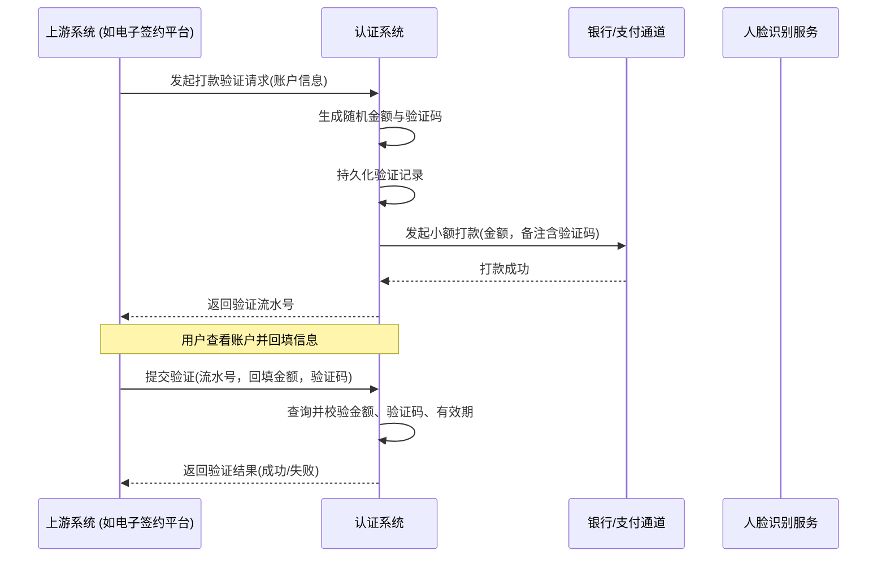
```mermaid
sequenceDiagram
    participant Client as 上游系统 (如电子签约平台)
    participant Auth as 认证系统
    participant Bank as 银行/支付通道
    participant FaceService as 人脸识别服务

    Client->>Auth: 发起打款验证请求(账户信息)
    Auth->>Auth: 生成随机金额与验证码
    Auth->>Auth: 持久化验证记录
    Auth->>Bank: 发起小额打款(金额，备注含验证码)
    Bank-->>Auth: 打款成功
    Auth-->>Client: 返回验证流水号
    Note over Client,Auth: 用户查看账户并回填信息
    Client->>Auth: 提交验证(流水号，回填金额，验证码)
    Auth->>Auth: 查询并校验金额、验证码、有效期
    Auth-->>Client: 返回验证结果(成功/失败)
```

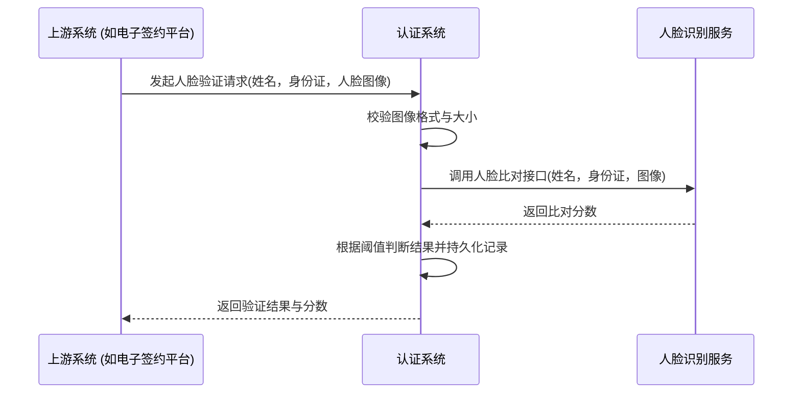
```mermaid
sequenceDiagram
    participant Client as 上游系统 (如电子签约平台)
    participant Auth as 认证系统
    participant FaceService as 人脸识别服务

    Client->>Auth: 发起人脸验证请求(姓名，身份证，人脸图像)
    Auth->>Auth: 校验图像格式与大小
    Auth->>FaceService: 调用人脸比对接口(姓名，身份证，图像)
    FaceService-->>Auth: 返回比对分数
    Auth->>Auth: 根据阈值判断结果并持久化记录
    Auth-->>Client: 返回验证结果与分数
```

## 6. Error Handling
- **Expected error cases**:
    1. 打款验证：打款失败（账户异常、余额不足）、验证信息不匹配、验证超时、尝试次数超限。
    2. 人脸验证：图像解析失败、人脸比对分数低于阈值、身份信息查询失败、活体检测未通过。
- **Handling strategies**:
    1. 对可重试的错误（如网络超时、下游服务暂时不可用）进行有限次重试（最多3次，指数退避）。
    2. 验证失败时，返回明确的错误码（如`PAYMENT_FAILED`, `FACE_MATCH_LOW_SCORE`, `VERIFICATION_EXPIRED`, `ATTEMPTS_EXCEEDED`）和提示信息，并记录失败日志。
    3. 对于疑似欺诈行为（如同一账户短时间内多次验证失败），在验证记录中标记风险等级，并可能通知上游系统。

## 7. Dependencies
- **How this module interacts with upstream/downstream modules**:
    1. **上游调用方**: 电子签约平台在签约流程中调用认证系统进行打款验证或人脸验证。行业钱包系统在关系绑定、开通付款等流程中作为客户端调用认证系统。
    2. **下游依赖**: 依赖银行或支付通道执行小额打款操作。依赖底层的人脸识别服务进行人脸比对。

## 3.3 清结算系统

批判迭代: 2


# 清结算系统 模块设计文档

## 1. 概述

### 目的与范围
清结算系统负责处理与天财分账业务相关的结算账户配置、专用账户资金冻结、退货账户查询以及计费处理。它是资金流转和结算控制的核心模块，确保分账、归集等业务的资金能够正确、安全地结算到指定的天财专用账户，并处理相关的费用计算。

## 2. 接口设计

### API端点
- `POST /api/settlement/account/freeze`: 对指定的天财专用账户执行资金冻结或解冻操作。
- `GET /api/refund/account`: 根据交易信息查询对应的原收款账户（天财收款账户）。
- `POST /api/settlement/config/sync`: 接收并处理由三代系统同步的商户结算模式配置。
- `POST /api/settlement/fee/sync`: 向计费中台同步涉及手续费的交易信息。

### 请求/响应结构
- **账户冻结请求 (`POST /api/settlement/account/freeze`)**:
    - 请求体: `{ "accountNo": "string", "operation": "FREEZE"|"UNFREEZE", "bizScene": "string", "idempotentKey": "string" }`
    - 响应体: `{ "success": boolean, "code": "string", "message": "string" }`
- **退货账户查询请求 (`GET /api/refund/account`)**:
    - 查询参数: `originalOrderNo` (原交易订单号), `bizType` (业务类型)
    - 响应体: `{ "accountNo": "string", "accountName": "string", "status": "string" }`
- **结算配置同步请求 (`POST /api/settlement/config/sync`)**:
    - 请求体: `{ "merchantId": "string", "settlementMode": "ACTIVE"|"PASSIVE", "receiverAccountNo": "string" }`
    - 响应体: `{ "success": boolean }`
- **计费信息同步请求 (`POST /api/settlement/fee/sync`)**:
    - 请求体: `{ "transactionId": "string", "payerAccountNo": "string", "receiverAccountNo": "string", "amount": number, "feeBearer": "PAYER"|"RECEIVER" }`
    - 响应体: `{ "feeId": "string", "status": "SUCCESS"|"PENDING" }`

### 发布/消费的事件
- **消费的事件**:
    - `SettlementModeConfigured`: 由三代系统发布，包含商户结算模式信息。
    - `TransactionCreated`: 由行业钱包系统发布，包含分账交易详情。
- **发布的事件**:
    - `AccountFrozen`: 账户冻结/解冻操作完成后发布。
    - `FeeInfoSynced`: 计费信息同步至计费中台后发布。

## 3. 数据模型

### 表/集合
- **`settlement_config` (结算配置表)**: 存储商户的结算模式与账户映射。
- **`account_freeze_record` (账户冻结记录表)**: 记录天财专用账户的冻结/解冻操作流水。
- **`refund_account_mapping` (退货账户映射表)**: 存储交易订单与原收款账户的映射关系。

### 关键字段
- **`settlement_config`**:
    - `id` (主键)
    - `merchant_id` (商户ID)
    - `settlement_mode` (结算模式: ACTIVE, PASSIVE)
    - `receiver_account_no` (天财收款账户号)
    - `created_at`
    - `updated_at`
- **`account_freeze_record`**:
    - `id` (主键)
    - `account_no` (账户号)
    - `operation` (操作: FREEZE, UNFREEZE)
    - `biz_scene` (业务场景)
    - `idempotent_key` (幂等键)
    - `operator` (操作人)
    - `created_at`
- **`refund_account_mapping`**:
    - `id` (主键)
    - `original_order_no` (原交易订单号)
    - `biz_type` (业务类型)
    - `payer_account_no` (付方账户号)
    - `receiver_account_no` (收方/原收款账户号)
    - `created_at`

### 与其他模块的关系
清结算系统与以下模块存在交互：
- **账户系统**: 负责开立和标记天财专用账户，清结算系统需基于账户系统的账户信息进行结算配置和冻结操作。
- **行业钱包系统**: 作为核心业务系统，在处理分账请求时，会与清结算系统交互以确认结算账户状态、执行冻结或查询退货账户。同时，消费其发布的交易事件。
- **三代系统**: 向清结算系统同步结算模式配置（如主动结算、被动结算）以及分账关系绑定信息。
- **计费中台**: 清结算系统将涉及手续费的分账交易信息传递给计费中台进行计费处理。

## 4. 业务逻辑

### 核心工作流/算法
1.  **结算账户配置**:
    - **触发**: 消费来自三代系统的 `SettlementModeConfigured` 事件。
    - **逻辑**: 根据事件中的商户ID和结算模式，更新或创建 `settlement_config` 记录。主动结算模式需记录指定的 `receiver_account_no`；被动结算模式该字段可为空。
    - **数据流**: 事件数据 -> `settlement_config` 表。

2.  **退货账户查询**:
    - **触发**: 行业钱包系统在处理退款/退货业务时，调用 `GET /api/refund/account` 接口。
    - **逻辑**: 根据请求中的 `originalOrderNo` 和 `bizType`，查询 `refund_account_mapping` 表，返回匹配的 `receiver_account_no`（即原收款账户）。
    - **数据流**: 接口请求 -> 查询 `refund_account_mapping` -> 返回账户信息。

3.  **专用账户冻结**:
    - **触发**: 行业钱包系统或风控系统调用 `POST /api/settlement/account/freeze` 接口。
    - **逻辑**:
        - 使用请求中的 `idempotentKey` 查询 `account_freeze_record`，实现操作幂等性。
        - 调用账户系统接口，执行实际的账户状态变更（冻结/解冻）。
        - 在 `account_freeze_record` 中记录操作流水。
        - 发布 `AccountFrozen` 事件。
    - **并发控制**: 基于 `account_no` 和 `idempotentKey` 实现数据库唯一索引，防止重复操作；关键状态变更使用乐观锁。

4.  **计费处理协同**:
    - **触发**: 消费来自行业钱包系统的 `TransactionCreated` 事件，当交易涉及手续费时触发。
    - **逻辑**: 解析事件，提取计费所需信息（交易双方、金额、手续费承担方），调用 `POST /api/settlement/fee/sync` 接口同步至计费中台。记录同步状态。
    - **补偿机制**: 若同步失败，将事件和失败原因存入重试表，由后台定时任务进行重试。

### 业务规则与验证
- 主动结算模式下，资金必须结算至商户在 `settlement_config` 中预先指定的天财收款账户。
- 被动结算模式下，资金应暂存于待结算账户，等待后续指令。
- 执行冻结操作前，必须验证操作权限和业务场景的合法性。
- 查询退货账户时，需确保交易信息的完整性和准确性，以匹配到正确的原收款账户。
- 所有对外接口调用需携带幂等键 (`idempotentKey`) 以防止重复处理。

### 关键边界情况处理
- **账户状态异常**: 当结算账户状态为已注销或已冻结时，拒绝后续的结算请求，并向调用方返回明确错误码。
- **并发冻结/解冻**: 通过数据库唯一索引 (`account_no`, `idempotentKey`) 和乐观锁版本号确保最终一致性。
- **计费信息同步失败**: 采用"存储-转发"模式，失败事件进入重试队列，最多重试3次，最终失败则告警并人工介入。
- **配置缺失**: 当处理交易时未找到对应的 `settlement_config`，视为配置错误，交易失败。

## 5. 序列图

### 核心工作流序列图

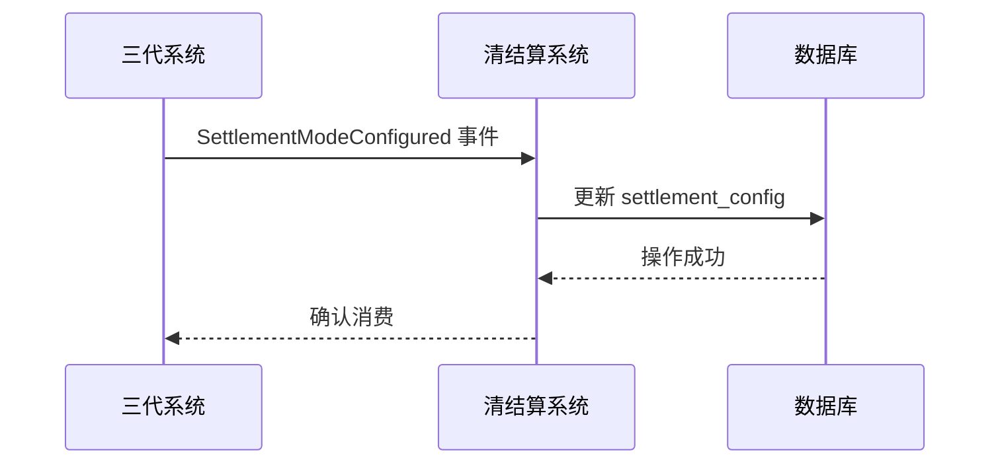
```mermaid
sequenceDiagram
    participant 三代系统
    participant 清结算系统
    participant DB as 数据库
    三代系统->>清结算系统: SettlementModeConfigured 事件
    清结算系统->>DB: 更新 settlement_config
    DB-->>清结算系统: 操作成功
    清结算系统-->>三代系统: 确认消费
```

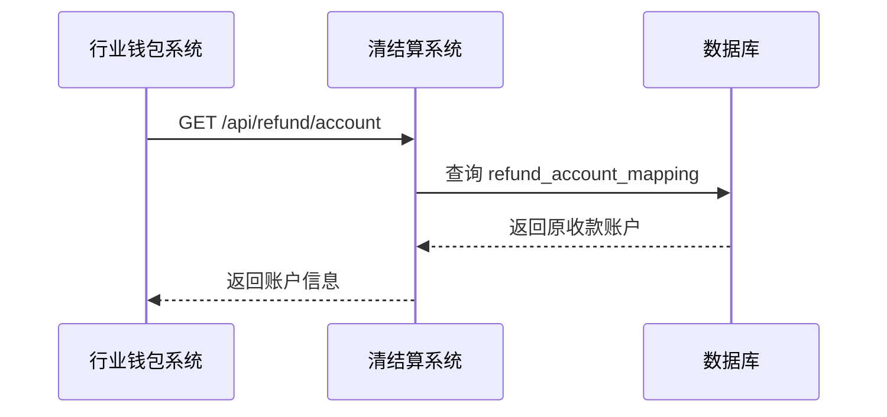
```mermaid
sequenceDiagram
    participant 行业钱包系统
    participant 清结算系统
    participant DB as 数据库
    行业钱包系统->>清结算系统: GET /api/refund/account
    清结算系统->>DB: 查询 refund_account_mapping
    DB-->>清结算系统: 返回原收款账户
    清结算系统-->>行业钱包系统: 返回账户信息
```

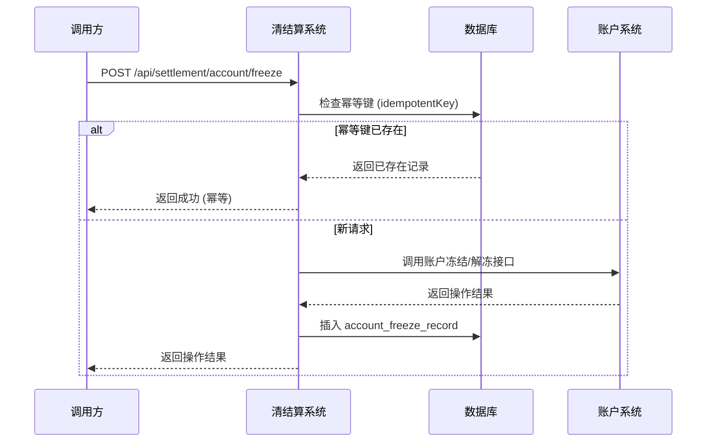
```mermaid
sequenceDiagram
    participant 调用方
    participant 清结算系统
    participant DB as 数据库
    participant 账户系统
    调用方->>清结算系统: POST /api/settlement/account/freeze
    清结算系统->>DB: 检查幂等键 (idempotentKey)
    alt 幂等键已存在
        DB-->>清结算系统: 返回已存在记录
        清结算系统-->>调用方: 返回成功 (幂等)
    else 新请求
        清结算系统->>账户系统: 调用账户冻结/解冻接口
        账户系统-->>清结算系统: 返回操作结果
        清结算系统->>DB: 插入 account_freeze_record
        清结算系统-->>调用方: 返回操作结果
    end
```

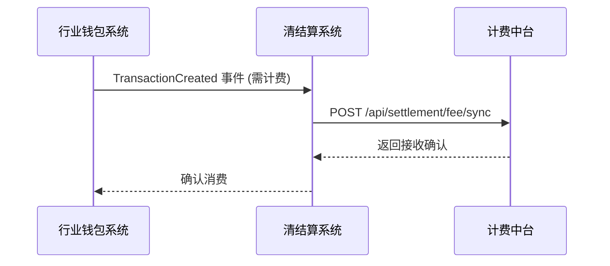
```mermaid
sequenceDiagram
    participant 行业钱包系统
    participant 清结算系统
    participant 计费中台
    行业钱包系统->>清结算系统: TransactionCreated 事件 (需计费)
    清结算系统->>计费中台: POST /api/settlement/fee/sync
    计费中台-->>清结算系统: 返回接收确认
    清结算系统-->>行业钱包系统: 确认消费
```

## 6. 错误处理

### 预期错误情况
- **业务错误**:
    - `ACCOUNT_NOT_FOUND`: 账户不存在或状态异常（冻结、注销）。
    - `CONFIG_MISSING`: 结算模式配置缺失或冲突。
    - `REFUND_ACCOUNT_NOT_MATCHED`: 退货账户查询无匹配结果。
    - `DUPLICATED_REQUEST`: 检测到重复请求（幂等键冲突）。
- **系统错误**:
    - `DOWNSTREAM_TIMEOUT`: 与下游系统（账户系统、计费中台）通信超时。
    - `DOWNSTREAM_ERROR`: 下游系统返回业务失败或内部错误。
    - `DATABASE_ERROR`: 数据库操作失败。

### 处理策略
- **业务错误**: 立即向调用方返回明确的错误码和描述，不进行重试。
- **系统间通信故障**:
    - 对于同步接口调用（如账户冻结），采用有限次重试（如3次），每次间隔递增。
    - 对于事件消费后的异步处理（如计费同步），采用"存储-转发"模式，失败事件进入重试队列，由后台任务周期性重试。
- **数据一致性**: 所有关键操作（如冻结）需记录操作流水 (`account_freeze_record`)，并支持基于流水进行对账与补偿。
- **监控与告警**: 所有错误均记录详细的错误日志、上下文和请求ID。系统错误达到阈值触发告警。

## 7. 依赖关系

### 上游模块
- **行业钱包系统**: 核心调用方，发起退货账户查询、账户冻结操作请求，并发布 `TransactionCreated` 事件。
- **三代系统**: 提供商户的结算模式配置信息（通过事件），并提供分账关系绑定接口。

### 下游模块
- **账户系统**: 依赖其提供准确的账户信息和执行账户状态控制（冻结/解冻）。
- **计费中台**: 依赖其完成交易手续费的最终计算。

## 3.4 计费中台

批判迭代: 1


# 计费中台模块设计文档

## 1. 概述

### 目的与范围
计费中台模块为"天财分账"业务提供统一的转账计费能力。其核心职责是接收来自三代系统同步的手续费配置，并在处理分账、归集、批量付款、会员结算等资金流转交易时，根据业务规则（如"分账手续费承担方"）进行计费处理。本模块不涉及费率策略的制定，仅负责执行计费计算与扣费。

## 2. 接口设计

### API端点
- TBD

### 发布/消费的事件
- **消费的事件**:
    - 事件来源：三代系统
    - 事件内容：手续费配置同步事件。当三代系统为商户或特定业务场景配置或更新手续费规则（如指定手续费承担方）时，会发布此事件，计费中台需监听并更新本地配置缓存。
- **发布的事件**:
    - TBD

## 3. 数据模型

### 表/集合
- **手续费配置表** (`fee_config`)
    - 用于存储从三代系统同步的计费规则。
- **计费记录表** (`fee_record`)
    - 用于记录每一笔交易产生的计费详情。

### 关键字段
- **`fee_config` 表**:
    - `id`: 主键
    - `merchant_id`: 商户ID（关联总部或门店）
    - `business_scenario`: 业务场景（如：归集、批量付款、会员结算）
    - `fee_payer`: 手续费承担方（付方/收方）
    - `fee_rule`: 费率规则详情（JSON格式，如固定金额、百分比等）
    - `effective_time`: 生效时间
    - `sync_source`: 同步来源（如"三代系统"）
    - `sync_time`: 配置同步时间
- **`fee_record` 表**:
    - `id`: 主键
    - `transaction_id`: 关联的交易流水号（来自业务核心系统或行业钱包系统）
    - `fee_config_id`: 关联的手续费配置ID
    - `calculated_amount`: 计算出的手续费金额
    - `actual_deducted_amount`: 实际扣费金额（可能因余额不足等调整）
    - `payer_identity`: 手续费支付方身份（总部/门店）
    - `payer_account`: 手续费支付方账户
    - `status`: 状态（待扣费、已扣费、扣费失败）
    - `create_time`: 记录创建时间

### 与其他模块的关系
- **三代系统**: 是计费规则配置的源头，通过事件将配置同步至计费中台。
- **行业钱包系统/业务核心系统**: 在处理涉及资金流转的交易时，调用计费中台进行计费计算与扣费。
- **账户系统**: 计费中台在执行实际扣费时，需与账户系统交互，从指定的"手续费承担方"账户中扣减资金。

## 4. 业务逻辑

### 核心工作流/算法
1.  **配置同步**:
    - 监听三代系统发布的"手续费配置同步事件"。
    - 解析事件数据，更新或插入本地`fee_config`表。需处理配置的版本与生效时间。
2.  **计费触发与计算**:
    - 接收来自行业钱包系统或业务核心系统的计费请求。请求应包含：交易流水号、业务场景、付方信息、收方信息、交易金额等。
    - 根据`merchant_id`和`business_scenario`查询当前生效的`fee_config`。
    - 根据配置中的`fee_payer`（付方/收方）确定手续费承担方。
    - 根据`fee_rule`和交易金额，计算手续费`calculated_amount`。
3.  **扣费执行**:
    - 根据确定的承担方，调用账户系统接口，从其对应的账户（如天财收款账户）中扣减`calculated_amount`。
    - 根据扣费结果，更新`fee_record`表中的状态和实际扣费金额。
    - 将扣费结果（成功/失败及原因）返回给调用方。

### 业务规则与验证
- **规则匹配**: 必须精确匹配商户、业务场景和生效时间，以找到正确的计费配置。
- **承担方校验**: 验证`fee_payer`指定的承担方账户是否存在且状态正常。
- **余额校验**: 在执行扣费前，应确认承担方账户余额充足（或由账户系统保障）。
- **幂等性**: 针对同一笔`transaction_id`的计费请求，应保证计费操作只执行一次。

### 关键边界情况
- **配置缺失**: 若未找到对应计费配置，应返回明确错误，由上游业务系统决定是否阻断交易或按默认规则处理。
- **扣费失败**: 若账户系统扣费失败（如余额不足、账户冻结），需准确记录失败原因并通知上游。
- **配置冲突**: 当同一商户同一场景存在多条时间重叠的生效配置时，需要有明确的冲突解决策略（如取最新同步的配置）。

## 5. 序列图

```mermaid
sequenceDiagram
    participant A as 三代系统
    participant B as 计费中台
    participant C as 行业钱包系统
    participant D as 账户系统

    Note over A,B: 配置同步流程
    A->>B: 发布事件：手续费配置更新
    B->>B: 解析并持久化配置(fee_config)

    Note over C,B,D: 交易计费流程
    C->>B: 请求计费(交易号,场景,金额,付方,收方)
    B->>B: 查询生效计费配置
    B->>B: 计算手续费及承担方
    B->>D: 请求扣费(承担方账户,手续费金额)
    D->>D: 执行账户扣款
    D->>B: 返回扣费结果
    B->>B: 记录计费结果(fee_record)
    B->>C: 返回计费结果(成功/失败)
```

## 6. 错误处理

### 预期错误案例
1.  **配置查询失败**: 未找到匹配的计费配置。
2.  **计算错误**: 费率规则非法或计算过程出现异常。
3.  **账户交互失败**: 调用账户系统超时、网络异常或返回业务失败（余额不足、账户不存在）。
4.  **数据一致性错误**: 重复的`transaction_id`请求导致重复计费风险。

### 处理策略
- **优雅降级**: 对于配置缺失，可向上游返回特定错误码，而非系统异常。
- **重试机制**: 对账户系统等外部依赖的调用失败，应有策略性重试（特别是对于网络超时）。
- **事务与补偿**: 确保计费记录与账户扣费状态的一致性。若扣费成功但记录失败，需有对账与补偿机制（如定时核对账户流水与`fee_record`）。
- **幂等控制**: 通过`transaction_id`唯一键约束或业务逻辑校验，防止重复计费。

## 7. 依赖关系

### 上游模块
- **三代系统**: 核心依赖。计费中台所有业务计费规则均来源于此。通过异步事件接收配置变更。
- **行业钱包系统 / 业务核心系统**: 服务调用方。在处理"天财分账"相关交易时，同步调用计费中台完成计费环节。

### 下游模块
- **账户系统**: 核心依赖。计费中台需调用账户系统完成实际资金的扣划操作。

### 交互方式
- 与**三代系统**采用异步事件驱动（消息队列）进行配置同步，保证最终一致性。
- 与**行业钱包系统/业务核心系统**采用同步RPC调用，确保在交易处理流程中实时完成计费。
- 与**账户系统**采用同步RPC调用，实时完成资金扣减。

## 3.5 业务核心系统

批判迭代: 2


# 业务核心系统模块设计文档

## 1. Overview

### Purpose and scope
业务核心系统是接收并处理'天财分账'交易记录的系统。其核心目的是作为天财分账业务的后端处理引擎，负责处理由归集、批量付款、会员结算等业务场景产生的交易指令，并与行业钱包系统、三代系统、清结算系统等下游模块协作，完成资金流转、状态更新和记录持久化。其范围限定于天财分账相关的交易处理，不涉及商户管理、账户开立或协议签约等前置流程。

**与行业钱包系统的职责边界澄清**：根据术语表定义，行业钱包系统是"负责天财专用账户管理、关系绑定校验、分账请求处理及与各系统交互的核心业务系统"。因此，业务核心系统是行业钱包系统在处理分账请求时，为执行具体的资金处理逻辑而调用的下游系统。业务核心系统专注于交易处理、资金路由和状态管理，不负责账户管理和关系绑定校验。

## 2. Interface Design

### API endpoints (REST/GraphQL) if applicable
业务核心系统作为下游服务，主要提供以下REST API供行业钱包系统调用：

1.  **POST /api/v1/transaction/process**
    *   **描述**：处理天财分账交易请求。
    *   **调用方**：行业钱包系统。
2.  **POST /api/v1/transaction/query**
    *   **描述**：查询交易处理状态。
    *   **调用方**：行业钱包系统。

### Request/response structures (if known)
**请求体 (POST /api/v1/transaction/process):**
```json
{
  "requestId": "string，幂等键，由上游生成",
  "bizScene": "string，业务场景：COLLECTION(归集)/BATCH_PAY(批量付款)/MEMBER_SETTLEMENT(会员结算)",
  "payerAccountNo": "string，付方天财专用账户号",
  "payeeAccountNo": "string，收方天财专用账户号",
  "amount": "number，交易金额(分)",
  "fundPurpose": "string，资金用途",
  "feeBearer": "string，手续费承担方：PAYER(付方)/PAYEE(收方)",
  "originalOrderInfo": "object，原始订单信息，用于对账"
}
```

**响应体 (通用):**
```json
{
  "code": "string，响应码",
  "message": "string，响应信息",
  "data": {
    "transactionId": "string，业务核心系统生成的唯一交易流水号",
    "status": "string，交易状态：PROCESSING/SUCCESS/FAILED",
    "finishTime": "string，交易完成时间(若完成)",
    "feeAmount": "number，手续费金额(分)"
  }
}
```

### Published/consumed events (if any)
TBD

## 3. Data Model

### Tables/collections
核心数据表设计如下：

1.  **transaction_record (交易记录表)**
    *   持久化每一笔分账交易的核心信息与状态。
2.  **transaction_step_log (交易步骤日志表)**
    *   记录交易处理过程中的关键步骤与调用下游系统的结果，用于问题排查与对账。

### Key fields (only if present in context; otherwise TBD)
**transaction_record 表关键字段:**
*   `id` / `transaction_id`: 主键，业务核心系统生成的唯一交易流水号。
*   `request_id`: 上游请求ID，用于幂等性控制。
*   `biz_scene`: 业务场景。
*   `payer_account_no`: 付方账户。
*   `payee_account_no`: 收方账户。
*   `amount`: 交易金额。
*   `fund_purpose`: 资金用途。
*   `fee_bearer`: 手续费承担方。
*   `fee_amount`: 手续费金额。
*   `status`: 交易状态 (INIT, PROCESSING, SUCCESS, FAILED, REVERSED)。
*   `channel_order_no`: 下游系统（如清结算）返回的渠道订单号。
*   `create_time` / `update_time`: 创建与更新时间。

**transaction_step_log 表关键字段:**
*   `id`: 主键。
*   `transaction_id`: 关联的交易记录ID。
*   `step`: 步骤名称 (如：VALIDATE, CALCULATE_FEE, TRANSFER_FUND)。
*   `invoke_target`: 调用的目标系统或服务。
*   `request_data`: 请求数据快照。
*   `response_data`: 响应数据快照。
*   `status`: 步骤执行状态 (SUCCESS/FAILED)。
*   `create_time`: 日志创建时间。

### Relationships with other modules
- **行业钱包系统**: 业务核心系统接收来自行业钱包系统的分账请求，并返回处理结果。行业钱包系统负责前置的账户校验与关系绑定校验。
- **三代系统**: 业务核心系统通过行业钱包系统间接获取商户及手续费配置信息。不直接交互。
- **清结算系统**: 在处理涉及资金划转的分账交易时，调用清结算系统执行资金操作。
- **对账单系统**: 业务核心系统持久化的交易记录是对账单系统生成天财机构层分账对账单的重要数据来源。
- **计费中台**: 在处理涉及手续费的交易时，调用计费中台进行手续费计算。

## 4. Business Logic

### Core workflows / algorithms
1.  **交易接收与幂等校验**: 接收请求，通过`requestId`检查是否已处理，确保幂等性。
2.  **交易记录创建与持久化**: 创建初始状态(INIT)的交易记录。
3.  **交易处理与路由**: 根据`bizScene`和`fundPurpose`，编排处理步骤。核心步骤包括：
    a. **手续费计算**: 若交易涉及手续费，调用计费中台。
    b. **资金划转**: 调用清结算系统，执行包含本金与手续费的划转指令。
4.  **状态同步与更新**: 根据各步骤结果，更新交易最终状态(SUCCESS/FAILED)，并记录渠道订单号。
5.  **日切处理**: 在系统日切期间，暂停处理新交易或将其置为待处理状态，待日切完成后继续。日切前后的交易需明确区分会计日期。

### Business rules and validations
- **账户有效性**: 交易关联的付方与收方账户号必须为有效的天财专用账户（此校验主要由上游行业钱包系统负责）。
- **场景路由**: 根据`资金用途`字段，路由至对应的内部处理逻辑。
- **手续费处理**: 根据`分账手续费承担方`，在调用计费中台和清结算系统时传递正确的计费方信息。
- **状态机管理**: 交易状态必须严格按照定义的状态机流转（INIT -> PROCESSING -> SUCCESS/FAILED/REVERSED）。

### Key edge cases
- **下游系统超时/失败**: 实现带退避策略的重试机制。对于清结算系统等资金操作，需有明确的冲正（REVERSED）逻辑。
- **重复请求**: 通过`requestId`实现幂等，避免重复处理。
- **日切期间交易**: 明确交易所属的会计日期，避免跨日切点交易数据混乱。日切时点到达前，可暂停接收新交易或将其标记为"日切待处理"。
- **交易冲正**: 当资金划转失败或需要撤销时，需能发起冲正交易，并将原交易状态更新为REVERSED。

## 5. Sequence Diagrams

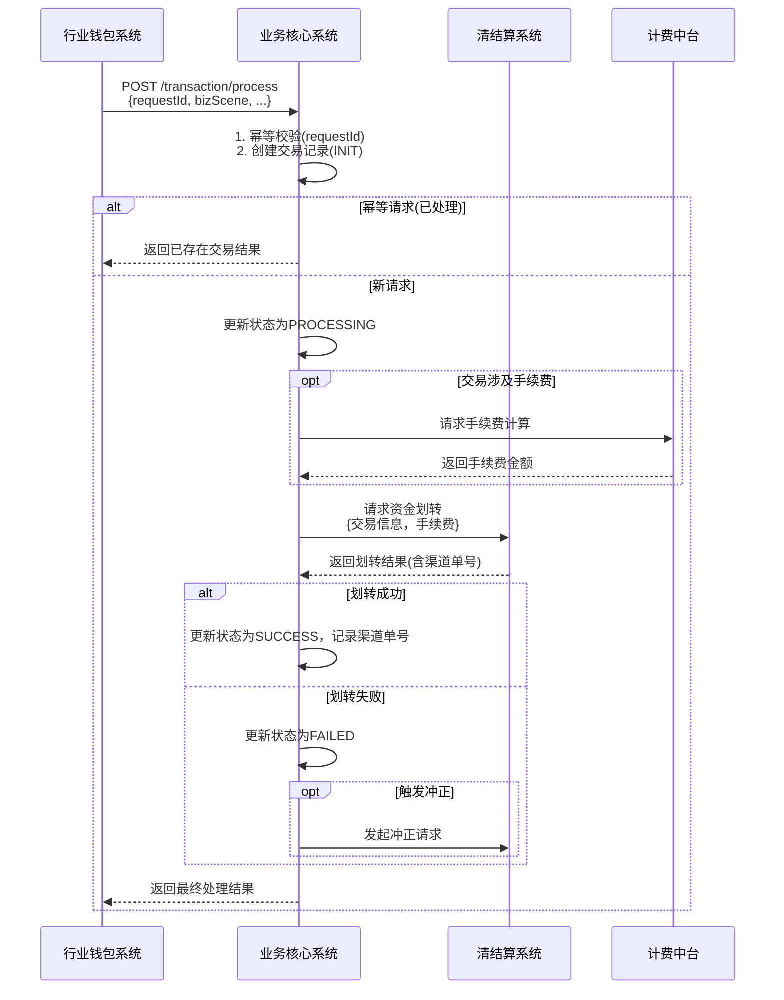
```mermaid
sequenceDiagram
    participant Wallet as 行业钱包系统
    participant Core as 业务核心系统
    participant Clearing as 清结算系统
    participant Fee as 计费中台

    Wallet->>Core: POST /transaction/process<br/>{requestId, bizScene, ...}
    Core->>Core: 1. 幂等校验(requestId)<br/>2. 创建交易记录(INIT)
    alt 幂等请求(已处理)
        Core-->>Wallet: 返回已存在交易结果
    else 新请求
        Core->>Core: 更新状态为PROCESSING
        opt 交易涉及手续费
            Core->>Fee: 请求手续费计算
            Fee-->>Core: 返回手续费金额
        end
        Core->>Clearing: 请求资金划转<br/>{交易信息，手续费}
        Clearing-->>Core: 返回划转结果(含渠道单号)
        alt 划转成功
            Core->>Core: 更新状态为SUCCESS，记录渠道单号
        else 划转失败
            Core->>Core: 更新状态为FAILED
            opt 触发冲正
                Core->>Clearing: 发起冲正请求
            end
        end
        Core-->>Wallet: 返回最终处理结果
    end
```

## 6. Error Handling

### Expected error cases
- **下游系统调用失败**: 清结算系统、计费中台服务不可用、超时或返回业务失败。
- **网络或超时异常**: 与外部系统通信中断。
- **数据持久化失败**: 数据库异常，导致交易状态更新失败。
- **日切冲突**: 交易处理过程中遭遇系统日切。

### Handling strategies
- **重试机制**: 对下游系统的暂时性故障（如网络超时），实施指数退避重试。
- **状态回查与补偿**: 对于超时未知结果的调用（如清结算），通过定时任务回查下游状态，并进行本地状态同步补偿。
- **冲正交易**: 资金划转失败后，若需回滚，则发起冲正交易，确保资金一致性。
- **告警与人工介入**: 对于多次重试失败、冲正失败等严重错误，记录详细日志并触发告警，支持人工干预。
- **幂等性保证**: 所有API通过`requestId`保证幂等，防止重复执行造成资金风险。

## 7. Dependencies

### How this module interacts with upstream/downstream modules
- **上游 - 行业钱包系统**: 行业钱包系统在完成账户、关系绑定等前置校验后，调用业务核心系统执行交易处理。业务核心系统处理完毕后返回结果。行业钱包系统是业务核心系统的唯一直接上游调用方。
- **下游 - 清结算系统**: 业务核心系统依赖清结算系统执行所有资金冻结、划转、冲正操作。这是最关键的资金操作依赖。
- **下游 - 计费中台**: 业务核心系统在处理涉及手续费的交易时，同步调用计费中台计算费用。
- **下游 - 对账单系统**: 业务核心系统通过数据同步或接口方式，为对账单系统提供已持久化的完整交易记录，作为对账数据源。
- **下游 - 三代系统**: 无直接依赖。商户及手续费配置信息通过行业钱包系统传递。

## 3.6 钱包app/商服平台

批判迭代: 2


# 钱包app/商服平台 模块设计文档

## 1. Overview
- **Purpose and scope**: 本模块作为面向商户（总部、门店）的前端应用与服务平台，提供天财分账业务（归集、批量付款、会员结算）的发起、管理、查询及关系绑定等核心功能。它是行业钱包系统与商户之间的交互界面，负责业务流程的引导、数据收集与指令下发。
- **与行业钱包系统的关系**: 本模块是行业钱包系统的前端服务层。它接收商户操作指令，调用行业钱包系统的业务接口，并将处理结果呈现给商户。核心业务逻辑（如账户校验、分账处理）由行业钱包系统承载。

## 2. Interface Design
- **API endpoints (REST/GraphQL if applicable)**: TBD (由行业钱包系统定义并暴露给本模块调用)
- **Request/response structures (if known)**: TBD
- **Published/consumed events (if any)**: TBD

## 3. Data Model
- **Tables/collections**: TBD (本模块作为前端应用，主要数据模型由后端系统（如行业钱包系统、三代系统）维护。本模块可能维护用户会话、操作日志等非核心业务数据。)
- **Key fields (only if present in context; otherwise TBD)**: TBD
- **Relationships with other modules**: 本模块依赖行业钱包系统提供的业务接口。商户、账户、分账关系等核心数据模型定义在行业钱包系统、三代系统和账户系统中。

## 4. Business Logic
- **Core workflows / algorithms**:
    1.  **关系绑定流程**: 引导商户（总部或门店）完成签约认证。
        - 调用行业钱包系统接口，获取待签约关系及协议信息。
        - 引导用户通过电子签约平台完成协议签署（短信推送、H5页面）。
        - 根据业务场景（批量付款、会员结算），如需"开通付款"，则引导付方完成打款验证或人脸验证。
        - 将认证结果回调至行业钱包系统。
    2.  **归集流程**: 总部发起资金归集。
        - 总部选择门店（被归集方）及金额。
        - 调用行业钱包系统接口，校验归集关系有效性及账户状态。
        - 发起归集指令，并展示处理结果。
    3.  **批量付款/会员结算流程**: 总部发起分账。
        - 总部上传付款清单（含接收方、金额、资金用途等）。
        - 调用行业钱包系统接口，校验付款能力（是否已开通付款）、账户余额及手续费承担方。
        - 发起批量付款/会员结算指令，并展示批次处理进度及结果。
- **Business rules and validations**:
    - 发起操作前，必须校验当前登录商户身份（总部或门店）与操作权限是否匹配。
    - 归集、付款前必须确保对应的收付方"关系绑定"已完成且状态有效。
    - 批量付款、会员结算场景下，付方（总部/门店）必须额外完成"开通付款"认证。
    - 资金用途需与业务场景绑定，并在协议中明确。
- **Key edge cases**:
    - 网络中断或超时：操作指令需有明确的提交中状态，并提供结果查询与重试机制。
    - 账户状态异常（如冻结）：调用行业钱包系统接口时返回明确错误，引导用户联系客服。
    - 认证过程中用户放弃：记录中断节点，支持用户从断点继续或重新发起。

## 5. Sequence Diagrams

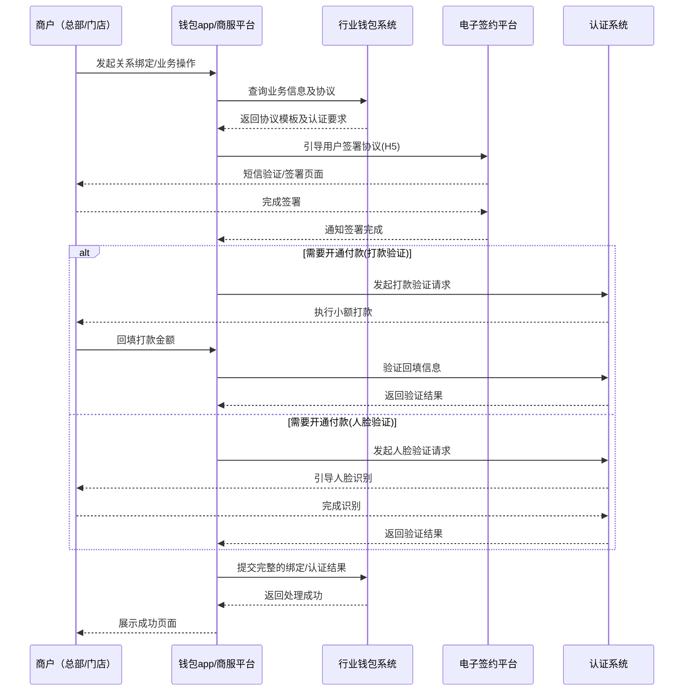
```mermaid
sequenceDiagram
    participant M as 商户（总部/门店）
    participant S as 钱包app/商服平台
    participant W as 行业钱包系统
    participant E as 电子签约平台
    participant A as 认证系统

    M->>S: 发起关系绑定/业务操作
    S->>W: 查询业务信息及协议
    W-->>S: 返回协议模板及认证要求
    S->>E: 引导用户签署协议(H5)
    E-->>M: 短信验证/签署页面
    M-->>E: 完成签署
    E-->>S: 通知签署完成
    alt 需要开通付款(打款验证)
        S->>A: 发起打款验证请求
        A-->>M: 执行小额打款
        M->>S: 回填打款金额
        S->>A: 验证回填信息
        A-->>S: 返回验证结果
    else 需要开通付款(人脸验证)
        S->>A: 发起人脸验证请求
        A-->>M: 引导人脸识别
        M-->>A: 完成识别
        A-->>S: 返回验证结果
    end
    S->>W: 提交完整的绑定/认证结果
    W-->>S: 返回处理成功
    S-->>M: 展示成功页面
```

## 6. Error Handling
- **Expected error cases**:
    - 接口调用失败（网络超时、服务不可用）。
    - 业务校验失败（账户不存在、关系未绑定、余额不足、无操作权限）。
    - 认证失败（打款金额错误、人脸比对不通过）。
    - 用户输入数据格式错误。
- **Handling strategies**:
    - 网络类错误：前端进行友好提示，并提供"重试"按钮。
    - 业务校验错误：直接展示行业钱包系统返回的具体错误码和描述，引导用户进行正确操作（如先去完成绑定）。
    - 认证失败：明确提示失败原因，并允许用户重新发起认证流程。
    - 系统级错误：记录错误日志，展示通用错误页，提示用户稍后重试或联系技术支持。

## 7. Dependencies
- **How this module interacts with upstream/downstream modules**:
    - **上游依赖 (核心服务提供方)**:
        - **行业钱包系统**: 核心依赖。提供所有业务接口（关系绑定校验、分账请求处理等）。本模块是其主要调用方。
        - **电子签约平台**: 强依赖。用于在关系绑定流程中封装协议签署H5页面并管理签署过程。
        - **认证系统**: 强依赖。在"开通付款"环节，调用其打款验证或人脸验证接口。
    - **下游依赖 (服务使用方)**:
        - **商户（总部/门店）**: 本模块的服务对象，通过Web页面或App使用服务。
    - **数据与状态同步**: 本模块不持久化核心业务状态，所有状态通过调用行业钱包系统接口实时获取。

## 3.7 三代系统

批判迭代: 1


# 三代系统模块设计文档

## 1. Overview
- **Purpose and scope**: 三代系统负责商户管理、开户接口调用、结算模式配置、分账关系绑定接口提供。它是天财分账业务中连接业务前端与底层账户、钱包系统的关键枢纽，负责处理商户侧的业务配置与指令发起。

## 2. Interface Design
- **API endpoints (REST/GraphQL)**:
    1.  `POST /api/v1/merchants/{merchantId}/tiancai-accounts`: 为指定商户开立天财专用账户。
    2.  `POST /api/v1/merchants/{merchantId}/settlement-mode`: 配置商户的结算模式（主动结算/被动结算）。
    3.  `POST /api/v1/relationship/bind`: 建立分账关系绑定（签约与认证）。
    4.  `GET /api/v1/merchants/{merchantId}/relationship`: 查询商户的绑定关系。
    5.  `POST /api/v1/batch-payment`: 发起批量付款指令。
    6.  `POST /api/v1/member-settlement`: 发起会员结算指令。
    7.  `POST /api/v1/collection`: 发起归集指令。
- **Request/response structures**:
    - **开立天财账户请求 (`POST /api/v1/merchants/{merchantId}/tiancai-accounts`)**:
        ```json
        {
          "requestId": "string, 请求唯一标识",
          "merchantType": "string, 商户类型 (HEADQUARTERS/STORE)",
          "operator": "string, 操作员"
        }
        ```
    - **配置结算模式请求 (`POST /api/v1/merchants/{merchantId}/settlement-mode`)**:
        ```json
        {
          "mode": "string, 结算模式 (ACTIVE/PASSIVE)",
          "tiancaiAccountNo": "string, 天财专用账户号 (mode=ACTIVE时必填)"
        }
        ```
    - **关系绑定请求 (`POST /api/v1/relationship/bind`)**:
        ```json
        {
          "payerMerchantId": "string, 付方商户ID",
          "payerAccountNo": "string, 付方天财账户号",
          "payeeMerchantId": "string, 收方商户ID",
          "payeeAccountNo": "string, 收方天财账户号",
          "scene": "string, 业务场景 (COLLECTION/BATCH_PAYMENT/MEMBER_SETTLEMENT)",
          "feeBearer": "string, 手续费承担方 (PAYER/PAYEE)"
        }
        ```
- **Published/consumed events (if any)**:
    - **Published Event**: `MERCHANT_SETTLEMENT_MODE_UPDATED`
        - 当商户的结算模式配置成功更新后发布。
        - Payload: `{ "merchantId": "string", "settlementMode": "string", "tiancaiAccountNo": "string" }`
    - **Published Event**: `RELATIONSHIP_BOUND`
        - 当分账关系绑定（签约与认证）成功后发布。
        - Payload: `{ "relationshipId": "string", "payerMerchantId": "string", "payeeMerchantId": "string", "scene": "string", "status": "ACTIVE" }`
    - **Consumed Event**: `ACCOUNT_CREATED`
        - 消费账户系统发布的事件，用于更新本地商户与天财账户的关联信息。

## 3. Data Model
- **Tables/collections**:
    1.  `merchant`: 存储商户核心信息。
    2.  `merchant_tiancai_account`: 存储商户与天财专用账户的关联关系。
    3.  `settlement_config`: 存储商户的结算模式配置。
    4.  `relationship_binding`: 存储分账关系绑定记录。
    5.  `payment_order`: 存储发起的付款指令（批量付款、会员结算、归集）。
- **Key fields**:
    - `merchant` 表:
        - `id` (PK): 主键，商户ID。
        - `name`: 商户名称。
        - `type`: 商户类型 (`HEADQUARTERS`/`STORE`)。
        - `status`: 商户状态。
    - `merchant_tiancai_account` 表:
        - `id` (PK): 主键。
        - `merchant_id`: 关联商户ID。
        - `account_id`: 账户系统返回的账户ID。
        - `wallet_account_no`: 行业钱包账户号。
        - `status`: 账户状态。
    - `settlement_config` 表:
        - `id` (PK): 主键。
        - `merchant_id`: 关联商户ID。
        - `mode`: 结算模式 (`ACTIVE`/`PASSIVE`)。
        - `tiancai_account_no`: 绑定的天财专用账户号（主动结算时有效）。
    - `relationship_binding` 表:
        - `id` (PK): 主键，关系ID。
        - `payer_merchant_id`: 付方商户ID。
        - `payer_account_no`: 付方天财账户号。
        - `payee_merchant_id`: 收方商户ID。
        - `payee_account_no`: 收方天财账户号。
        - `scene`: 业务场景。
        - `fee_bearer`: 手续费承担方。
        - `status`: 绑定状态 (`PENDING`/`ACTIVE`/`INACTIVE`)。
        - `contract_id`: 电子签约协议ID。
- **Relationships with other modules**:
    - 调用**账户系统**接口，为商户开立天财专用账户。
    - 与**行业钱包系统**交互，进行关系绑定校验和分账指令处理。
    - 向**计费中台**同步手续费配置。
    - 与**电子签约平台**交互，完成关系绑定的签约与认证流程。
    - 将交易记录发送至**业务核心系统**。

## 4. Business Logic
- **Core workflows / algorithms**:
    1.  **商户天财账户开立**: 接收业务请求，校验商户信息，调用账户系统接口开立天财专用账户，并维护本地关联关系。
    2.  **结算模式配置**: 为商户配置主动或被动结算模式。若为主动结算，需绑定其天财专用账户号。
    3.  **分账关系绑定（签约与认证）**: 根据业务场景（归集、批量付款、会员结算），协调付方与收方完成关系建立。此流程涉及调用电子签约平台完成协议签署与身份认证（打款验证/人脸验证），最终在行业钱包系统完成关系绑定。
    4.  **付款指令发起**: 根据业务场景（批量付款、会员结算、归集），校验关系与账户状态，构造请求并调用行业钱包系统的分账接口。
    5.  **手续费配置同步**: 将分账手续费承担方等计费规则同步至计费中台。
- **Business rules and validations**:
    - 只有状态正常的商户才能开立天财账户。
    - 同一商户只能配置一种结算模式。
    - 关系绑定时，付方和收方的天财账户必须已开立且状态正常。
    - 发起付款指令前，必须存在对应场景下已激活（`ACTIVE`）的关系绑定。
    - 批量付款和会员结算场景下，付方（总部/门店）需额外完成"开通付款"的签约认证流程。
- **Key edge cases**:
    - **账户开立失败**: 调用账户系统失败，需回滚本地操作，并向用户返回明确错误。
    - **关系绑定认证失败**: 电子签约平台的打款验证或人脸验证失败，关系绑定状态置为失败，需支持重试或人工处理。
    - **重复绑定**: 同一付方、收方、场景下已存在有效绑定关系，应拒绝重复绑定或进行更新。
    - **指令发起时关系失效**: 发起付款时，发现对应的关系绑定已解除或失效，指令应被拒绝。

## 5. Sequence Diagrams

### 5.1 分账关系绑定与签约认证流程
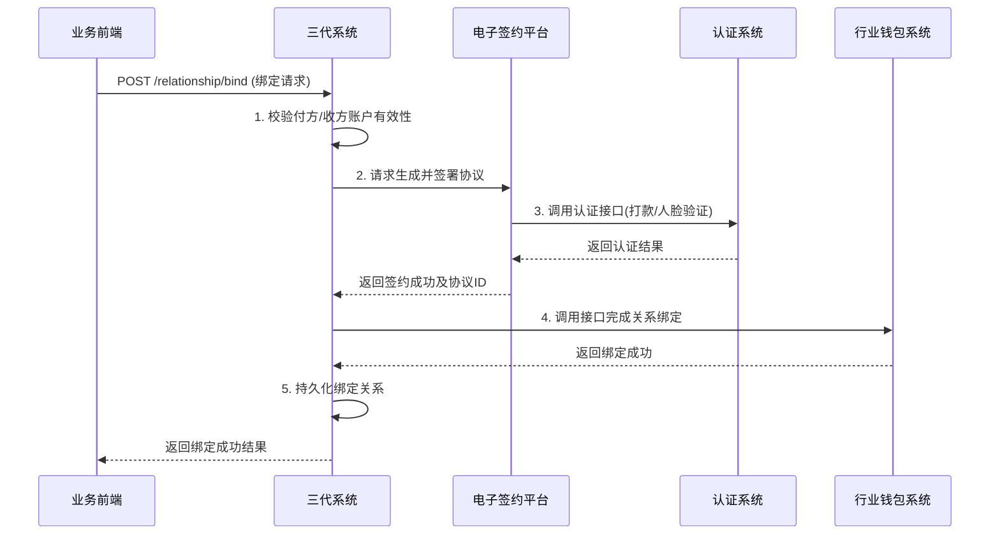
```mermaid
sequenceDiagram
    participant Client as 业务前端
    participant ThirdGen as 三代系统
    participant ESign as 电子签约平台
    participant Auth as 认证系统
    participant Wallet as 行业钱包系统

    Client->>ThirdGen: POST /relationship/bind (绑定请求)
    ThirdGen->>ThirdGen: 1. 校验付方/收方账户有效性
    ThirdGen->>ESign: 2. 请求生成并签署协议
    ESign->>Auth: 3. 调用认证接口(打款/人脸验证)
    Auth-->>ESign: 返回认证结果
    ESign-->>ThirdGen: 返回签约成功及协议ID
    ThirdGen->>Wallet: 4. 调用接口完成关系绑定
    Wallet-->>ThirdGen: 返回绑定成功
    ThirdGen->>ThirdGen: 5. 持久化绑定关系
    ThirdGen-->>Client: 返回绑定成功结果
```

## 6. Error Handling
- **Expected error cases**:
    1.  `MERCHANT_NOT_FOUND_OR_INACTIVE`: 指定的商户不存在或状态异常。
    2.  `TIANCAI_ACCOUNT_NOT_EXISTS`: 商户未开立天财专用账户。
    3.  `DUPLICATE_RELATIONSHIP`: 试图重复绑定已存在且有效的关系。
    4.  `ESIGN_SERVICE_FAILED`: 电子签约平台服务调用失败（生成协议、认证失败等）。
    5.  `WALLET_BINDING_FAILED`: 行业钱包系统关系绑定接口调用失败。
    6.  `INVALID_SETTLEMENT_MODE`: 结算模式配置非法（如被动结算模式绑定了账户号）。
    7.  `RELATIONSHIP_INACTIVE`: 发起付款时，对应的绑定关系未激活或已失效。
- **Handling strategies**:
    - **业务校验错误** (`MERCHANT_NOT_FOUND`, `DUPLICATE_RELATIONSHIP`): 直接返回错误，引导用户检查。
    - **外部依赖业务失败** (`ESIGN_SERVICE_FAILED`认证失败): 返回具体的业务失败原因，支持用户重新发起。
    - **外部依赖系统异常** (`WALLET_BINDING_FAILED`系统错误): 记录日志并告警，返回系统错误，建议用户稍后重试。对于关键操作（如绑定），需实现异步补偿或状态对账机制。
    - **数据不一致**: 定期执行对账任务，确保三代系统、钱包系统、账户系统间的商户、账户、关系状态一致。

## 7. Dependencies
- **上游模块**:
    - **业务前端/接入方**: 向三代系统发起开户、配置、绑定、付款等业务请求。
- **下游模块**:
    - **账户系统**: 调用其接口开立天财专用账户。
    - **行业钱包系统**: 调用其接口完成关系绑定和分账指令处理。
    - **电子签约平台**: 调用其服务完成协议签署与身份认证流程。
    - **认证系统**: 通过电子签约平台间接依赖，完成打款验证和人脸验证。
    - **计费中台**: 向其同步手续费配置信息。
    - **业务核心系统**: 向其发送天财分账交易记录。
    - **清结算系统**: 根据术语表，三代系统负责"结算模式配置"，清结算系统负责"结算账户配置"，两者存在配置信息的关联与同步需求。

## 3.8 电子签约平台

批判迭代: 1


# 电子签约平台 模块设计文档

## 1. Overview
- **Purpose and scope**: 电子签约平台负责协议模板管理、短信推送、H5页面封装、以及留存协议和认证过程证据链的系统。它为天财分账业务中的关系绑定、开通付款等流程提供电子签约与身份认证的集成服务，确保业务流程合规且证据可追溯。

## 2. Interface Design
- **API endpoints (REST/GraphQL) if applicable**:
    1. `POST /api/v1/esign/contract/generate`: 生成签约协议并初始化流程。
    2. `POST /api/v1/esign/contract/sign`: 提交签约确认。
    3. `POST /api/v1/esign/verification/initiate`: 发起身份验证流程。
    4. `POST /api/v1/esign/verification/callback`: 接收认证结果回调。
    5. `GET /api/v1/esign/contract/{contractId}`: 查询协议状态与详情。
- **Request/response structures (if known)**:
    - `POST /api/v1/esign/contract/generate`:
        - Request: `{ "template_id": "string", "biz_scene": "string", "biz_id": "string", "parties": [{"role": "string", "name": "string", "account_info": "object"}]， "variables": "object" }`
        - Response: `{ "contract_id": "string", "sign_url": "string", "expires_at": "timestamp" }`
    - `POST /api/v1/esign/contract/sign`:
        - Request: `{ "contract_id": "string", "party_role": "string", "signature": "string" }`
        - Response: `{ "status": "SIGNED/PENDING/FAILED" }`
    - `POST /api/v1/esign/verification/initiate`:
        - Request: `{ "contract_id": "string", "party_role": "string", "verification_type": "PAYMENT/FACE", "target_info": "object" }`
        - Response: `{ "verification_id": "string", "next_step": "string" }`
    - `POST /api/v1/esign/verification/callback`:
        - Request: `{ "verification_id": "string", "status": "string", "details": "object" }`
        - Response: `{ "ack": "true" }`
    - `GET /api/v1/esign/contract/{contractId}`:
        - Response: `{ "contract_id": "string", "status": "string", "parties": "array", "signed_at": "timestamp", "evidence_chain": "object" }`
- **Published/consumed events (if any)**: TBD

## 3. Data Model
- **Tables/collections**:
    1. `contract_templates`: 存储协议模板。
    2. `contracts`: 存储生成的协议实例。
    3. `signing_records`: 存储签约记录。
    4. `verification_records`: 存储与协议关联的验证记录。
    5. `evidence_chain`: 存储协议与验证过程的证据链。
- **Key fields (only if present in context; otherwise TBD)**:
    - `contract_templates`: `id`, `template_id`, `biz_scene`, `content`, `version`, `is_active`, `created_at`
    - `contracts`: `id`, `contract_id`, `template_id`, `biz_scene`, `biz_id`, `status`, `parties_info`, `variables`, `sign_url`, `expires_at`, `created_at`, `updated_at`
    - `signing_records`: `id`, `contract_id`, `party_role`, `signature`, `signed_at`, `ip_address`, `user_agent`
    - `verification_records`: `id`, `contract_id`, `verification_id`, `verification_type`, `party_role`, `target_info`, `status`, `external_ref_id`, `details`, `created_at`, `updated_at`
    - `evidence_chain`: `id`, `contract_id`, `action`, `actor`, `timestamp`, `data_snapshot`, `hash`
- **Relationships with other modules**: 电子签约平台调用认证系统进行打款验证和人脸验证。它为行业钱包系统、三代系统提供签约与认证流程的封装服务。

## 4. Business Logic
- **Core workflows / algorithms**:
    1. **协议生成与签约流程**:
        - 接收上游系统（如行业钱包）的请求，根据业务场景(`biz_scene`)和模板ID(`template_id`)获取协议模板。
        - 使用传入的变量(`variables`)和参与方信息(`parties`)填充模板，生成最终协议内容。
        - 创建协议实例(`contracts`)，生成唯一的`contract_id`和带有时效的签约H5页面链接(`sign_url`)。
        - 通过短信或其它方式将签约链接推送给相关参与方。
        - 参与方访问H5页面查看协议并确认签约，平台记录签约动作(`signing_records`)并更新协议状态。
        - 将所有关键操作（生成、查看、签约）记录到证据链(`evidence_chain`)。
    2. **集成身份验证流程**:
        - 在签约流程中或签约后，根据业务规则（如开通付款），需要为特定参与方发起身份验证。
        - 调用`/api/v1/esign/verification/initiate`，平台根据`verification_type`（打款验证或人脸验证）调用对应的认证系统接口。
        - 对于打款验证，平台调用认证系统发起打款，并将返回的`verification_id`与当前协议关联。
        - 引导用户完成验证（如回填金额）。认证系统通过回调接口`/api/v1/esign/verification/callback`通知平台验证结果。
        - 平台更新`verification_records`状态，并将验证请求与结果记录到证据链。
        - 验证成功是协议生效或进行下一步业务操作（如关系绑定）的前提条件之一。
- **Business rules and validations**:
    1. 协议签约链接具有有效期（如24小时），超时后需重新生成。
    2. 协议所有必需参与方均完成签约后，协议状态才变为"已生效"。
    3. 对于需要身份验证的场景，必须在协议生效前或关联业务操作前完成验证。
    4. 证据链记录不可篡改，每次记录需计算数据快照的哈希。
- **Key edge cases**:
    1. 用户未在有效期内完成签约：协议状态置为"已过期"，需上游业务判断是否重新发起。
    2. 身份验证失败：根据业务规则，可能允许重试验证，或导致整个协议流程失败。
    3. 签约过程中协议内容变更：一旦协议生成，内容应锁定。如需变更，应作废原协议并生成新协议。

## 5. Sequence Diagrams

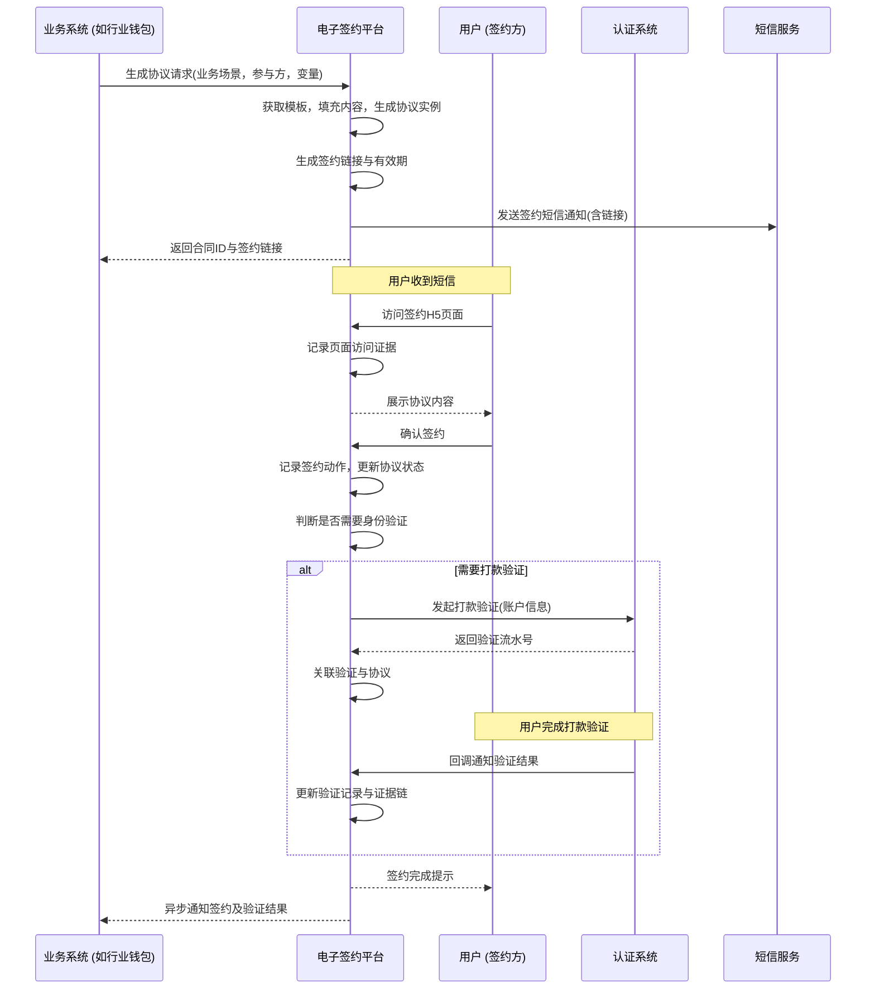
```mermaid
sequenceDiagram
    participant Biz as 业务系统 (如行业钱包)
    participant Esign as 电子签约平台
    participant User as 用户 (签约方)
    participant Auth as 认证系统
    participant SMS as 短信服务

    Biz->>Esign: 生成协议请求(业务场景，参与方，变量)
    Esign->>Esign: 获取模板，填充内容，生成协议实例
    Esign->>Esign: 生成签约链接与有效期
    Esign->>SMS: 发送签约短信通知(含链接)
    Esign-->>Biz: 返回合同ID与签约链接
    Note over User,Esign: 用户收到短信
    User->>Esign: 访问签约H5页面
    Esign->>Esign: 记录页面访问证据
    Esign-->>User: 展示协议内容
    User->>Esign: 确认签约
    Esign->>Esign: 记录签约动作，更新协议状态
    Esign->>Esign: 判断是否需要身份验证
    alt 需要打款验证
        Esign->>Auth: 发起打款验证(账户信息)
        Auth-->>Esign: 返回验证流水号
        Esign->>Esign: 关联验证与协议
        Note over User,Auth: 用户完成打款验证
        Auth->>Esign: 回调通知验证结果
        Esign->>Esign: 更新验证记录与证据链
    end
    Esign-->>User: 签约完成提示
    Esign-->>Biz: 异步通知签约及验证结果
```

## 6. Error Handling
- **Expected error cases**:
    1. 协议生成失败：模板不存在、模板变量缺失或格式错误、参与方信息不完整。
    2. 签约失败：签约链接过期、用户重复签约、签名信息无效。
    3. 身份验证集成失败：调用认证系统超时或返回错误、验证结果回调数据异常。
    4. 证据链记录失败：数据存储异常、哈希计算失败。
- **Handling strategies**:
    1. 对于输入参数错误，返回具体的业务错误码（如`TEMPLATE_NOT_FOUND`, `INVALID_PARTY_INFO`）并记录日志。
    2. 对于依赖服务（认证系统、短信服务）的暂时性故障，进行有限次重试（如3次）。
    3. 确保关键操作（如最终签约确认、验证结果更新）的幂等性，防止重复处理。
    4. 证据链记录失败应视为严重错误，需触发告警并阻止业务流程继续，确保数据完整性。

## 7. Dependencies
- **How this module interacts with upstream/downstream modules**:
    1. **上游调用方/业务驱动方**: 行业钱包系统在关系绑定、开通付款流程中调用电子签约平台生成协议并集成认证。三代系统可能在某些商户管理场景下触发签约。
    2. **下游服务依赖**: 依赖认证系统提供打款验证和人脸验证的具体执行能力。依赖内部或外部的短信服务发送通知。依赖底层的存储服务持久化协议与证据数据。
    3. **回调通知**: 在协议状态变更（如签约完成、验证完成）时，异步通知上游业务系统（如行业钱包）。

## 3.9 行业钱包系统

批判迭代: 1


# 行业钱包系统模块设计文档

## 1. Overview
- **Purpose and scope**: 行业钱包系统是天财分账业务的核心业务系统，负责天财专用账户管理、关系绑定校验、分账请求处理及与各系统交互。其核心职责包括：管理天财专用账户的业务层信息、处理分账关系绑定请求、执行归集/批量付款/会员结算等分账指令、以及与清结算、对账单等系统进行资金和数据的协同。

## 2. Interface Design
- **API endpoints (REST/GraphQL)**:
    1.  `POST /api/v1/wallet/relationship/bind`: 接收并处理分账关系绑定请求。
    2.  `POST /api/v1/wallet/transfer`: 接收并处理分账转账请求（归集、批量付款、会员结算）。
    3.  `GET /api/v1/wallet/accounts/{walletAccountNo}`: 查询天财专用账户详情及状态。
    4.  `POST /api/v1/wallet/accounts/{walletAccountNo}/withdraw-cards`: 绑定或设置默认提现卡（用于天财接收方账户）。
    5.  `PUT /api/v1/wallet/accounts/{walletAccountNo}/status`: 更新账户业务状态（如暂停/恢复分账能力）。
- **Request/response structures**:
    - **关系绑定请求 (`POST /api/v1/wallet/relationship/bind`)**:
        ```json
        {
          "requestId": "string, 请求唯一标识",
          "payerWalletAccountNo": "string, 付方天财钱包账户号",
          "payeeWalletAccountNo": "string, 收方天财钱包账户号",
          "scene": "string, 业务场景 (COLLECTION/BATCH_PAYMENT/MEMBER_SETTLEMENT)",
          "feeBearer": "string, 手续费承担方 (PAYER/PAYEE)",
          "contractId": "string, 电子签约协议ID"
        }
        ```
    - **分账转账请求 (`POST /api/v1/wallet/transfer`)**:
        ```json
        {
          "requestId": "string, 请求唯一标识",
          "payerWalletAccountNo": "string, 付方天财钱包账户号",
          "payeeWalletAccountNo": "string, 收方天财钱包账户号",
          "scene": "string, 业务场景",
          "amount": "number, 金额",
          "currency": "string, 币种",
          "purpose": "string, 资金用途",
          "remark": "string, 备注"
        }
        ```
    - **绑定提现卡请求 (`POST /api/v1/wallet/accounts/{walletAccountNo}/withdraw-cards`)**:
        ```json
        {
          "operation": "string, 操作 (BIND/SET_DEFAULT)",
          "bankCardNo": "string, 银行卡号 (BIND时必填)",
          "bankCardId": "string, 已绑定银行卡ID (SET_DEFAULT时必填)"
        }
        ```
- **Published/consumed events (if any)**:
    - **Published Event**: `WALLET_TRANSFER_PROCESSED`
        - 当分账转账（归集、批量付款、会员结算）请求处理完成后发布（无论成功或失败）。
        - Payload: `{ "requestId": "string", "transferId": "string", "payerAccountNo": "string", "payeeAccountNo": "string", "amount": "number", "scene": "string", "status": "string", "completionTime": "timestamp" }`
    - **Published Event**: `RELATIONSHIP_BINDING_SYNC`
        - 当关系绑定在钱包系统侧成功创建或更新后发布。
        - Payload: `{ "relationshipId": "string", "payerWalletAccountNo": "string", "payeeWalletAccountNo": "string", "scene": "string", "status": "string" }`
    - **Consumed Event**: `ACCOUNT_CREATED`
        - 消费账户系统发布的事件，用于在钱包系统创建或更新对应的天财专用账户业务层信息。
    - **Consumed Event**: `MERCHANT_SETTLEMENT_MODE_UPDATED`
        - 消费三代系统发布的事件，用于更新对应商户天财账户的结算模式信息。

## 3. Data Model
- **Tables/collections**:
    1.  `wallet_account`: 存储天财专用账户的业务层信息。
    2.  `wallet_relationship`: 存储分账关系绑定记录。
    3.  `wallet_withdraw_card`: 存储天财接收方账户绑定的提现银行卡。
    4.  `wallet_transfer_order`: 存储分账转账指令记录。
- **Key fields**:
    - `wallet_account` 表:
        - `id` (PK): 主键。
        - `wallet_account_no` (UK): 行业钱包账户号，与账户系统一致。
        - `merchant_id`: 关联商户ID。
        - `merchant_type`: 商户类型。
        - `account_status`: 账户业务状态 (`NORMAL`, `SUSPENDED`)。
        - `settlement_mode`: 结算模式 (`ACTIVE`, `PASSIVE`)。
        - `is_tiancai_special`: 是否天财专用账户标记。
        - `created_at`, `updated_at`: 时间戳。
    - `wallet_relationship` 表:
        - `id` (PK): 主键，关系ID。
        - `payer_wallet_account_no`: 付方钱包账户号。
        - `payee_wallet_account_no`: 收方钱包账户号。
        - `scene`: 业务场景。
        - `fee_bearer`: 手续费承担方。
        - `contract_id`: 电子签约协议ID。
        - `status`: 绑定状态 (`ACTIVE`, `INACTIVE`)。
        - `created_at`, `updated_at`: 时间戳。
    - `wallet_withdraw_card` 表:
        - `id` (PK): 主键。
        - `wallet_account_no`: 关联的钱包账户号。
        - `bank_card_no`: 银行卡号 (加密存储)。
        - `bank_name`: 银行名称。
        - `is_default`: 是否默认提现卡。
        - `status`: 状态 (`VALID`, `INVALID`)。
    - `wallet_transfer_order` 表:
        - `id` (PK): 主键。
        - `transfer_id` (UK): 转账流水号。
        - `request_id`: 上游请求ID。
        - `payer_wallet_account_no`: 付方账户号。
        - `payee_wallet_account_no`: 收方账户号。
        - `scene`: 业务场景。
        - `amount`: 金额。
        - `purpose`: 资金用途。
        - `status`: 处理状态 (`PROCESSING`, `SUCCESS`, `FAILED`)。
        - `completion_time`: 完成时间。
        - `created_at`: 创建时间。
- **Relationships with other modules**:
    - 消费**账户系统**的事件，同步天财专用账户基础信息。
    - 消费**三代系统**的事件，同步结算模式信息；接收其调用的关系绑定和分账请求。
    - 与**清结算系统**交互，处理资金结算、账户冻结请求、获取退货账户信息。
    - 与**计费中台**交互，触发转账手续费计费。
    - 与**对账单系统**交互，提供分账、提款等对账数据。
    - 与**业务核心系统**交互，同步交易记录（可能通过事件或接口）。

## 4. Business Logic
- **Core workflows / algorithms**:
    1.  **账户信息同步与维护**: 监听账户系统的 `ACCOUNT_CREATED` 事件，在本地创建或更新 `wallet_account` 记录。监听三代系统的 `MERCHANT_SETTLEMENT_MODE_UPDATED` 事件，更新对应账户的结算模式。
    2.  **分账关系绑定处理**: 接收三代系统的绑定请求，校验付方和收方账户是否存在、状态是否正常、是否已存在冲突绑定。校验通过后，持久化绑定关系，并发布 `RELATIONSHIP_BINDING_SYNC` 事件。
    3.  **分账转账处理**:
        - **归集**: 资金从门店（付方）的天财收款账户转到总部（收方）的天财收款账户。
        - **批量付款**: 资金从总部（付方）的天财收款账户转到供应商等（收方）的天财接收方账户。
        - **会员结算**: 资金从总部（付方）的天财收款账户转到门店（收方）的天财收款账户。
        - 处理流程：校验关系绑定有效性、账户状态、余额/额度；调用清结算系统进行资金划转；调用计费中台计费；更新订单状态并发布事件。
    4.  **天财接收方账户管理**: 提供接口为天财接收方账户绑定多张银行卡，并设置其中一张为默认提现卡，用于资金提现。
- **Business rules and validations**:
    - 关系绑定时，付方和收方账户必须都是已标记的天财专用账户 (`is_tiancai_special=true`)。
    - 发起分账转账前，必须存在对应场景下状态为 `ACTIVE` 的关系绑定。
    - 批量付款和会员结算场景下，需校验付方是否已完成"开通付款"的额外签约认证（可通过检查关系绑定中的协议ID或特定标识实现）。
    - 归集场景下，付方（门店）的结算模式必须为主动结算 (`ACTIVE`)。
    - 资金用途 (`purpose`) 必须符合预定义的业务场景（如品牌费、供应商付款、会员结算），影响与清结算系统的交互协议。
    - 天财接收方账户可绑定多张银行卡，但有且只有一张默认提现卡。
- **Key edge cases**:
    - **事件消费顺序**: `ACCOUNT_CREATED` 事件可能早于或晚于三代系统发起的业务请求。需处理账户信息尚未同步时的请求，可返回"账户不存在"或采用异步补偿。
    - **关系绑定冲突**: 同一付方、收方、场景下已存在有效绑定，应拒绝新绑定或进行覆盖更新（需业务规则明确）。
    - **分账时资金不足**: 付方账户余额或可用额度不足，转账订单标记为失败，并返回明确错误。
    - **清结算处理超时或失败**: 调用清结算系统划转资金时发生超时或明确失败，需有重试机制，并最终将订单置为失败，发布事件。
    - **状态不一致**: 定期与账户系统、三代系统对账，确保账户、关系状态一致。

## 5. Sequence Diagrams

### 5.1 分账转账（以归集为例）处理流程
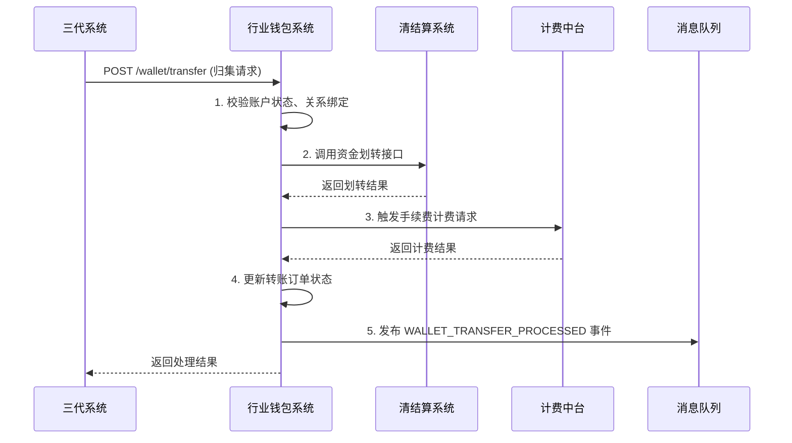
```mermaid
sequenceDiagram
    participant ThirdGen as 三代系统
    participant Wallet as 行业钱包系统
    participant Settlement as 清结算系统
    participant Billing as 计费中台
    participant MQ as 消息队列

    ThirdGen->>Wallet: POST /wallet/transfer (归集请求)
    Wallet->>Wallet: 1. 校验账户状态、关系绑定
    Wallet->>Settlement: 2. 调用资金划转接口
    Settlement-->>Wallet: 返回划转结果
    Wallet->>Billing: 3. 触发手续费计费请求
    Billing-->>Wallet: 返回计费结果
    Wallet->>Wallet: 4. 更新转账订单状态
    Wallet->>MQ: 5. 发布 WALLET_TRANSFER_PROCESSED 事件
    Wallet-->>ThirdGen: 返回处理结果
```

## 6. Error Handling
- **Expected error cases**:
    1.  `ACCOUNT_NOT_FOUND`: 指定的付方或收方天财账户在钱包系统中不存在。
    2.  `ACCOUNT_SUSPENDED`: 账户业务状态为暂停，无法进行绑定或交易。
    3.  `RELATIONSHIP_NOT_FOUND_OR_INACTIVE`: 分账转账时，对应的有效关系绑定不存在。
    4.  `INSUFFICIENT_BALANCE`: 付方账户余额不足。
    5.  `SETTLEMENT_SERVICE_FAILED`: 清结算系统服务调用失败或返回业务失败。
    6.  `DUPLICATE_REQUEST_ID`: 重复的请求ID。
    7.  `INVALID_WITHDRAW_CARD_OPERATION`: 提现卡操作非法（如设置非本账户的卡为默认卡）。
- **Handling strategies**:
    - **业务校验错误** (`ACCOUNT_NOT_FOUND`, `RELATIONSHIP_NOT_FOUND`): 直接返回错误，由上游系统处理。
    - **资金不足错误** (`INSUFFICIENT_BALANCE`): 返回明确错误，交易失败，不进行重试。
    - **外部依赖业务失败** (`SETTLEMENT_SERVICE_FAILED` 包含业务规则拒绝): 返回具体的业务错误原因，交易失败。
    - **外部依赖系统异常** (`SETTLEMENT_SERVICE_FAILED` 系统超时或故障): 进行有限次数的重试（需考虑幂等性），若最终失败则将订单标记为系统失败，发布事件，并触发告警以便人工介入。
    - **幂等性处理**: 对所有写操作（绑定、转账）基于 `requestId` 实现幂等，避免重复处理。

## 7. Dependencies
- **上游模块**:
    - **账户系统**: 消费其 `ACCOUNT_CREATED` 事件，作为天财专用账户信息的权威来源。
    - **三代系统**: 接收其发起的 `关系绑定` 和 `分账转账` 请求；消费其 `MERCHANT_SETTLEMENT_MODE_UPDATED` 事件。
- **下游模块**:
    - **清结算系统**: 调用其接口完成实际的资金划转、查询退货账户、处理账户冻结请求。
    - **计费中台**: 调用其接口触发转账手续费的计费处理。
    - **对账单系统**: 为其提供分账、提款等业务对账数据（可能通过文件或接口）。
    - **业务核心系统**: 通过发布 `WALLET_TRANSFER_PROCESSED` 事件或直接调用接口，同步交易记录。
    - **消息队列**: 用于发布事件，实现与下游系统的异步解耦。

## 3.10 对账单系统

批判迭代: 2


# 对账单系统模块设计文档

## 1. 概述

### 目的与范围
对账单系统负责为天财分账业务生成准确、完整、可追溯的资金交易明细汇总，支持商户、运营及财务人员进行资金核对与账务管理。其核心目的是提供机构层及商户层的各类对账单，包括分账、提款、收单、结算等。系统范围涵盖从天财专用账户开立、关系绑定到归集、批量付款、会员结算等全链路业务产生的资金变动记录，通过消费上游系统事件、聚合交易数据、生成标准格式文件，并提供对账功能以识别内部数据与外部渠道数据之间的差异。

## 2. 接口设计

### API端点 (REST/GraphQL)
1.  `POST /api/v1/statement/generate`: 触发生成指定类型和周期的对账单。
2.  `GET /api/v1/statement/download/{statementId}`: 下载已生成的对账单文件。
3.  `GET /api/v1/statement/query`: 查询对账单生成记录及状态。
4.  `POST /api/v1/statement/reconcile`: 发起对账任务，比对内部交易记录与外部渠道数据。
5.  `GET /api/v1/statement/reconcile/task/{taskId}`: 查询对账任务结果。

### 请求/响应结构
- **生成对账单请求 (`POST /api/v1/statement/generate`)**:
    ```json
    {
      "statementType": "string, 对账单类型 (ALLOCATION/WITHDRAWAL/ACQUIRING/SETTLEMENT)",
      "merchantId": "string, 商户ID (可选，不传则生成机构层汇总账单)",
      "startDate": "string, 开始日期 (YYYY-MM-DD)",
      "endDate": "string, 结束日期 (YYYY-MM-DD)",
      "currency": "string, 币种 (默认CNY)"
    }
    ```
- **生成对账单响应**:
    ```json
    {
      "code": "string, 响应码",
      "message": "string, 响应信息",
      "data": {
        "statementId": "string, 对账单唯一ID",
        "status": "string, 生成状态 (PROCESSING/SUCCESS/FAILED)",
        "estimatedCompletionTime": "string, 预计完成时间"
      }
    }
    ```
- **查询对账单请求 (`GET /api/v1/statement/query`)**:
    - 查询参数: `statementId` (可选), `merchantId` (可选), `statementType` (可选), `date` (可选, YYYY-MM-DD)
- **查询对账单响应**:
    ```json
    {
      "code": "string",
      "message": "string",
      "data": {
        "statementId": "string",
        "statementType": "string",
        "merchantId": "string",
        "period": "string",
        "status": "string",
        "fileUrl": "string (生成成功时)",
        "generateTime": "string",
        "itemCount": "number"
      }
    }
    ```
- **发起对账请求 (`POST /api/v1/statement/reconcile`)**:
    ```json
    {
      "reconcileDate": "string, 对账日期 (YYYY-MM-DD)",
      "dataSourceA": "string, 数据源A描述 (如: INTERNAL_TRANSACTION)",
      "dataSourceB": "string, 数据源B描述 (如: CHANNEL_SETTLEMENT_FILE)",
      "channelType": "string, 渠道类型 (如: BANK_A)",
      "fileUrl": "string, 外部对账文件下载地址"
    }
    ```
- **发起对账响应**:
    ```json
    {
      "code": "string",
      "message": "string",
      "data": {
        "taskId": "string, 对账任务ID",
        "status": "string, 任务状态 (RUNNING)"
      }
    }
    ```
- **查询对账任务结果请求 (`GET /api/v1/statement/reconcile/task/{taskId}`)**:
    - 路径参数: `taskId`
- **查询对账任务结果响应**:
    ```json
    {
      "code": "string",
      "message": "string",
      "data": {
        "taskId": "string",
        "reconcileDate": "string",
        "status": "string (RUNNING/COMPLETED/FAILED)",
        "resultSummary": {
          "totalCountA": "number",
          "totalCountB": "number",
          "matchedCount": "number",
          "missingInACount": "number",
          "missingInBCount": "number",
          "amountMismatchCount": "number"
        },
        "reportUrl": "string (对账报告文件地址，任务完成时)"
      }
    }
    ```

### 发布/消费的事件
- **消费的事件**:
    - `ACCOUNT_CREATED`: 消费账户系统发布的事件，用于记录天财专用账户开立信息。
    - `WALLET_TRANSFER_PROCESSED`: 消费行业钱包系统发布的事件，用于获取分账（归集、批量付款、会员结算）交易明细。
    - `RELATIONSHIP_BINDING_SYNC`: 消费行业钱包系统发布的事件，用于记录关系绑定状态变更。
    - `TransactionCreated`: 消费业务核心系统发布的事件，作为分账交易记录的权威来源。
- **发布的事件**: TBD

## 3. 数据模型

### 表/集合
1.  `statement_metadata`: 对账单元数据表，记录账单生成任务。
2.  `statement_detail`: 对账单明细数据表，存储构成账单的每笔交易记录。
3.  `reconciliation_task`: 对账任务记录表。
4.  `reconciliation_result`: 对账结果明细表。

### 关键字段
- **`statement_metadata` 表**:
    - `statement_id` (PK): 对账单唯一ID。
    - `statement_type`: 对账单类型 (ALLOCATION, WITHDRAWAL, ACQUIRING, SETTLEMENT)。
    - `merchant_id`: 关联商户ID（机构层账单可为空）。
    - `period_start`: 账单周期开始日期。
    - `period_end`: 账单周期结束日期。
    - `status`: 状态 (GENERATING, GENERATED, FAILED)。
    - `file_storage_path`: 生成文件存储路径。
    - `item_count`: 明细条目数。
    - `generate_start_time`: 生成开始时间。
    - `generate_end_time`: 生成结束时间。
    - `created_at`: 创建时间。
- **`statement_detail` 表**:
    - `id` (PK): 主键。
    - `statement_id`: 关联的对账单ID。
    - `transaction_time`: 交易发生时间。
    - `transaction_id`: 业务系统交易流水号。
    - `biz_scene`: 业务场景 (COLLECTION, BATCH_PAYMENT, MEMBER_SETTLEMENT)。
    - `payer_account_no`: 付方账户号。
    - `payee_account_no`: 收方账户号。
    - `amount`: 交易金额。
    - `fee_amount`: 手续费金额。
    - `fee_bearer`: 手续费承担方 (PAYER, PAYEE)。
    - `balance_after`: 交易后账户余额（若可获取）。
    - `fund_purpose`: 资金用途。
    - `status`: 交易状态。
    - `channel_order_no`: 渠道订单号。
    - `created_at`: 创建时间。
- **`reconciliation_task` 表**:
    - `task_id` (PK): 对账任务ID。
    - `reconcile_date`: 对账日期。
    - `data_source_a`: 数据源A描述。
    - `data_source_b`: 数据源B描述。
    - `channel_type`: 渠道类型。
    - `status`: 任务状态 (RUNNING, COMPLETED, FAILED)。
    - `result_summary`: 结果摘要JSON。
    - `report_file_path`: 对账报告文件路径。
    - `start_time`: 任务开始时间。
    - `end_time`: 任务结束时间。
- **`reconciliation_result` 表**:
    - `id` (PK): 主键。
    - `task_id`: 关联的对账任务ID。
    - `transaction_id`: 交易ID。
    - `reconcile_status`: 对账状态 (MATCHED, MISSING_IN_A, MISSING_IN_B, AMOUNT_MISMATCH)。
    - `amount_a`: 数据源A金额。
    - `amount_b`: 数据源B金额。
    - `difference_amount`: 差异金额。
    - `remark`: 备注。

### 与其他模块的关系
- **行业钱包系统**: 消费其发布的 `WALLET_TRANSFER_PROCESSED` 和 `RELATIONSHIP_BINDING_SYNC` 事件，作为分账交易明细和关系变动的主要数据源。
- **账户系统**: 消费其发布的 `ACCOUNT_CREATED` 事件，记录账户开立信息。
- **业务核心系统**: 消费其发布的 `TransactionCreated` 事件，作为分账交易记录的权威来源。
- **清结算系统**: 通过接口获取渠道结算文件，用于外部对账。根据上游设计，清结算系统未发布交易事件，因此不消费其事件。
- **文件存储服务**: 依赖其存储生成的对账单文件和对账报告。
- **消息队列**: 依赖其接收来自上游模块的业务事件。

## 4. 业务逻辑

### 核心工作流/算法
1.  **交易明细采集（事件消费）**:
    - **事件监听**: 持续监听消息队列中的 `ACCOUNT_CREATED`, `WALLET_TRANSFER_PROCESSED`, `RELATIONSHIP_BINDING_SYNC`, `TransactionCreated` 事件。
    - **幂等性处理**: 使用 `transaction_id` 或事件唯一标识作为去重键，确保同一笔交易明细只被记录一次。通过查询 `statement_detail` 表检查重复记录。
    - **数据持久化**: 解析事件负载，将交易信息（交易时间、账户、金额、场景等）持久化到 `statement_detail` 表中。对于信息不全的记录，可异步调用业务核心系统接口补全。
    - **数据分区**: 为 `statement_detail` 表设计按 `transaction_time` 的分区策略（如按月分区），以支持海量数据的高效查询和管理。

2.  **对账单生成**:
    - **触发**: 接收定时任务或手动API调用 (`POST /api/v1/statement/generate`)。
    - **数据拉取与聚合**:
        - 根据 `statementType` 和日期范围，从 `statement_detail` 表中查询相关交易记录。
        - **分账对账单**: 筛选 `biz_scene` 为 `COLLECTION`（归集）、`BATCH_PAYMENT`（批量付款）、`MEMBER_SETTLEMENT`（会员结算）的交易。
        - **提款对账单**: 筛选业务场景为提现的交易（需根据业务定义明确场景值）。
        - **收单对账单**: 筛选业务场景为收单的交易（需根据业务定义明确场景值）。
        - **结算对账单**: 筛选与清结算相关的资金划转记录（需根据业务定义明确场景值）。
        - 采用分页查询方式处理大数据量，避免内存溢出。
    - **数据加工**:
        - 计算周期内交易汇总金额、手续费总额。
        - 尝试计算期初/期末余额：通过查询该账户在周期开始前最后一笔交易的 `balance_after` 作为期初余额，周期结束后最后一笔交易的 `balance_after` 作为期末余额。
        - 格式化每条明细，包含所有必要字段。
    - **文件生成**:
        - 将加工后的数据生成标准格式文件（如CSV）。
        - 文件包含固定格式的表头、明细列表、汇总信息（总笔数、总金额、手续费总额、期初余额、期末余额）。
        - 将文件上传至文件存储服务（如OSS）。
    - **元数据更新**:
        - 在 `statement_metadata` 表中创建初始记录，状态为 `GENERATING`。
        - 文件生成成功后，更新记录状态为 `GENERATED`，记录文件路径和 `item_count`。
        - 若任何步骤失败，更新状态为 `FAILED`，并记录错误信息。

3.  **对账（内部与外部）**:
    - **触发**: 接收手动API调用 (`POST /api/v1/statement/reconcile`) 或定时任务。
    - **外部文件解析**:
        - 根据 `channelType` 加载对应的文件解析规则配置。
        - 从 `fileUrl` 下载渠道结算文件，并解析为内部标准交易记录格式。
    - **数据匹配算法**:
        - 以 `transaction_id` 和 `channel_order_no` 作为关键匹配字段。
        - 遍历内部数据源（`statement_detail`）和外部数据源（解析后的文件记录）。
        - 匹配逻辑：优先通过 `transaction_id` 匹配，若无则尝试通过 `channel_order_no`、交易时间、金额进行模糊匹配。
        - 对于匹配成功的记录，比较金额。若差异绝对值小于对账阈值（如0.01元），则标记为 `MATCHED`；否则标记为 `AMOUNT_MISMATCH`，并计算差异金额。
        - 对于仅存在于内部数据源的记录，标记为 `MISSING_IN_B`（渠道缺失）。
        - 对于仅存在于外部数据源的记录，标记为 `MISSING_IN_A`（内部缺失）。
    - **结果持久化与报告生成**:
        - 将每条对账结果记录到 `reconciliation_result` 表。
        - 汇总对账结果（总笔数、平账笔数、各类差异笔数），更新 `reconciliation_task` 表的 `result_summary`。
        - 生成对账报告文件（CSV格式），包含差异明细及汇总，上传至文件存储服务，并更新 `report_file_path`。
        - 更新任务状态为 `COMPLETED`。

### 业务规则与验证
- **账单周期**: 开始日期必须早于或等于结束日期，周期跨度需在系统允许范围内（如不超过31天）。结束日期不能晚于当前日期。
- **数据一致性**: 消费事件时需保证至少一次交付，并通过唯一键去重，避免明细重复。
- **文件格式**: 生成的对账单文件需包含固定格式的表头、明细、汇总信息。
- **对账阈值**: 金额差异小于配置的阈值（如0.01元）可视为平账。
- **数据保留**: 明细数据和对账单文件需根据监管和业务要求保留一定期限（如5年），过期数据可归档或清理。

### 关键边界情况处理
- **事件丢失或延迟**: 采用"事件消费+定时数据补偿"机制。定时（如每天凌晨）扫描业务核心系统特定时间窗口内（如过去72小时）的交易，与本地 `statement_detail` 表比对，通过接口拉取缺失记录并补录。
- **大数据量生成**: 对于海量交易明细的账单生成，采用分页查询、分批处理、异步生成的方式。生成任务状态持久化，支持进度查询。
- **生成过程中系统故障**: 账单生成任务记录中间状态 (`GENERATING`)。若任务失败，支持基于 `statement_id` 的重试。重试前需清理可能已生成的部分文件。
- **外部文件格式变更**: 渠道结算文件解析模块支持可配置的解析规则（如正则表达式、列映射）。配置变更可通过管理界面更新，无需代码发布。
- **对账匹配率低**: 当对账匹配率低于预设阈值（如95%）时，在对账报告中高亮提示，并触发告警通知运营人员核查。

## 5. 序列图

### 5.1 对账单生成流程
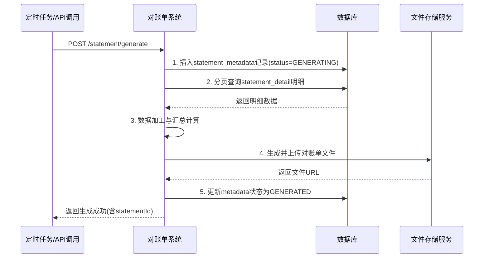
```mermaid
sequenceDiagram
    participant Scheduler as 定时任务/API调用
    participant Statement as 对账单系统
    participant DB as 数据库
    participant FS as 文件存储服务

    Scheduler->>Statement: POST /statement/generate
    Statement->>DB: 1. 插入statement_metadata记录(status=GENERATING)
    Statement->>DB: 2. 分页查询statement_detail明细
    DB-->>Statement: 返回明细数据
    Statement->>Statement: 3. 数据加工与汇总计算
    Statement->>FS: 4. 生成并上传对账单文件
    FS-->>Statement: 返回文件URL
    Statement->>DB: 5. 更新metadata状态为GENERATED
    Statement-->>Scheduler: 返回生成成功(含statementId)
```

### 5.2 交易明细采集流程（事件消费）
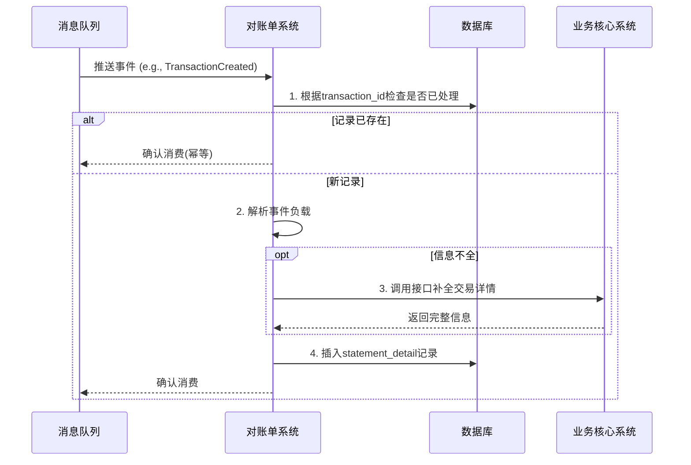
```mermaid
sequenceDiagram
    participant MQ as 消息队列
    participant Statement as 对账单系统
    participant DB as 数据库
    participant Core as 业务核心系统

    MQ->>Statement: 推送事件 (e.g., TransactionCreated)
    Statement->>DB: 1. 根据transaction_id检查是否已处理
    alt 记录已存在
        Statement-->>MQ: 确认消费(幂等)
    else 新记录
        Statement->>Statement: 2. 解析事件负载
        opt 信息不全
            Statement->>Core: 3. 调用接口补全交易详情
            Core-->>Statement: 返回完整信息
        end
        Statement->>DB: 4. 插入statement_detail记录
        Statement-->>MQ: 确认消费
    end
```

### 5.3 对账流程
```mermaid
sequenceDiagram
    participant Scheduler as 定时任务/API调用
    participant Statement as 对账单系统
    participant FS as 文件存储服务
    participant DB as 数据库

    Scheduler->>Statement: POST /statement/reconcile
    Statement->>DB: 1. 插入reconciliation_task记录(status=RUNNING)
    Statement->>FS: 2. 下载外部对账文件
    FS-->>Statement: 返回文件内容
    Statement->>Statement: 3. 解析外部文件数据
    Statement->>DB: 4. 查询内部交易明细(statement_detail)
    Statement->>Statement: 5. 执行数据匹配算法
    Statement->>DB: 6. 批量插入reconciliation_result记录
    Statement->>Statement: 7. 生成对账报告文件
    Statement->>FS: 8. 上传对账报告
    FS-->>Statement: 返回报告URL
    Statement->>DB: 9. 更新task状态为COMPLETED
    Statement-->>Scheduler: 返回对账任务结果
```

## 6. 错误处理

### 预期错误情况
1.  `INVALID_STATEMENT_PERIOD`: 请求的账单周期非法（开始日期晚于结束日期、周期超长、结束日期晚于当前日期）。
2.  `DATA_QUERY_FAILED`: 查询明细数据时数据库异常或超时。
3.  `FILE_GENERATE_FAILED`: 文件生成或上传至存储服务失败。
4.  `FILE_PARSE_ERROR`: 外部对账文件解析失败（格式错误、编码问题）。
5.  `EVENT_CONSUME_FAILED`: 消费业务事件时解析失败或持久化失败。
6.  `DUPLICATE_GENERATE_REQUEST`: 检测到相同参数（类型、商户、周期）的对账单生成任务正在执行。
7.  `DOWNSTREAM_SERVICE_UNAVAILABLE`: 调用业务核心系统补全数据时服务不可用。
8.  `RECONCILE_TASK_RUNNING`: 指定日期的对账任务正在执行中。

### 处理策略
- **`INVALID_STATEMENT_PERIOD`**: 向API调用方返回明确的错误码和描述，拒绝请求。
- **`DATA_QUERY_FAILED`**: 记录错误日志，对账单生成任务标记为`FAILED`。支持手动重试。对于查询超时，优化查询语句和索引，考虑对大数据量表进行分区。
- **`FILE_GENERATE_FAILED`**: 重试文件操作（最多3次），若仍失败则任务标记为`FAILED`，触发告警通知运维人员。
- **`FILE_PARSE_ERROR`**: 记录解析错误的具体行和内容，对账任务标记为`FAILED`，生成错误报告，触发告警通知运营人员检查文件格式。
- **`EVENT_CONSUME_FAILED`**: 记录失败事件及原因，消息进入死信队列。提供管理界面供人工查看与重新处理。同时，依赖定时数据补偿机制弥补数据缺失。
- **`DUPLICATE_GENERATE_REQUEST`**: 返回错误，提示用户已有任务在执行，并提供任务ID供查询。
- **`DOWNSTREAM_SERVICE_UNAVAILABLE`**: 事件消费流程中，若补全数据失败，仍将已有信息入库，并标记为"信息待补全"。由定时补偿任务后续处理。
- **`RECONCILE_TASK_RUNNING`**: 返回错误，提示对账任务正在执行，请勿重复提交。
- **系统级异常**: 捕获未预期异常，记录完整堆栈日志，触发监控告警。API请求返回通用系统错误码，异步任务标记为`FAILED`。

## 7. 依赖关系

### 上游模块
- **行业钱包系统**: 核心数据提供方。消费其发布的 `WALLET_TRANSFER_PROCESSED` 和 `RELATIONSHIP_BINDING_SYNC` 事件，获取分账交易和关系绑定的流水记录。
- **账户系统**: 消费其发布的 `ACCOUNT_CREATED` 事件，获取天财专用账户开立记录。
- **业务核心系统**: 核心数据提供方。消费其发布的 `TransactionCreated` 事件，作为分账交易记录的权威来源。在事件数据不全时，调用其接口补全交易详情。

### 下游模块
- **文件存储服务**: 依赖其存储生成的对账单文件和对账报告文件。
- **消息队列**: 依赖其接收来自上游模块的业务事件。
- **（商户/运营平台）**: 通过API为前端提供对账单查询、下载以及对账任务管理服务。

### 依赖澄清
- **清结算系统**: 根据上游设计，清结算系统未发布交易事件。对账单系统仅通过其接口（如有）或运营手动上传获取渠道结算文件，用于外部对账。不依赖其事件流。
- **三代系统**: 无直接接口或事件依赖。商户基础信息可通过行业钱包或业务核心系统间接获取。

---
# 4 接口设计
## 4.1 对外接口
系统对外暴露的API接口，主要面向商户客户端（如钱包app/商服平台）或外部合作系统。

| Method | Path | Module | Description | Request/Response |
| :--- | :--- | :--- | :--- | :--- |
| POST | `/api/v1/accounts/tiancai` | 账户系统 | 开立天财专用账户 | TBD |
| PUT | `/api/v1/accounts/{accountId}/status` | 账户系统 | 更新账户状态（如冻结/解冻） | TBD |
| GET | `/api/v1/accounts/{accountId}` | 账户系统 | 查询账户详情 | TBD |
| POST | `/api/v1/auth/payment-verification` | 认证系统 | 发起打款验证 | TBD |
| POST | `/api/v1/auth/payment-verification/confirm` | 认证系统 | 确认打款验证 | TBD |
| POST | `/api/v1/auth/face-verification` | 认证系统 | 发起人脸验证 | TBD |
| POST | `/api/v1/merchants/{merchantId}/tiancai-accounts` | 三代系统 | 为指定商户开立天财专用账户 | TBD |
| POST | `/api/v1/merchants/{merchantId}/settlement-mode` | 三代系统 | 配置商户的结算模式（主动结算/被动结算） | TBD |
| POST | `/api/v1/relationship/bind` | 三代系统 | 建立分账关系绑定（签约与认证） | TBD |
| GET | `/api/v1/merchants/{merchantId}/relationship` | 三代系统 | 查询商户的绑定关系 | TBD |
| POST | `/api/v1/batch-payment` | 三代系统 | 发起批量付款指令 | TBD |
| POST | `/api/v1/member-settlement` | 三代系统 | 发起会员结算指令 | TBD |
| POST | `/api/v1/collection` | 三代系统 | 发起归集指令 | TBD |
| POST | `/api/v1/esign/contract/generate` | 电子签约平台 | 生成签约协议并初始化流程 | TBD |
| POST | `/api/v1/esign/contract/sign` | 电子签约平台 | 提交签约确认 | TBD |
| GET | `/api/v1/esign/contract/{contractId}` | 电子签约平台 | 查询协议状态与详情 | TBD |
| POST | `/api/v1/wallet/relationship/bind` | 行业钱包系统 | 接收并处理分账关系绑定请求 | TBD |
| POST | `/api/v1/wallet/transfer` | 行业钱包系统 | 接收并处理分账转账请求（归集、批量付款、会员结算） | TBD |
| GET | `/api/v1/wallet/accounts/{walletAccountNo}` | 行业钱包系统 | 查询天财专用账户详情及状态 | TBD |
| POST | `/api/v1/wallet/accounts/{walletAccountNo}/withdraw-cards` | 行业钱包系统 | 绑定或设置默认提现卡（用于天财接收方账户） | TBD |
| PUT | `/api/v1/wallet/accounts/{walletAccountNo}/status` | 行业钱包系统 | 更新账户业务状态（如暂停/恢复分账能力） | TBD |
| POST | `/api/v1/statement/generate` | 对账单系统 | 触发生成指定类型和周期的对账单 | TBD |
| GET | `/api/v1/statement/download/{statementId}` | 对账单系统 | 下载已生成的对账单文件 | TBD |
| GET | `/api/v1/statement/query` | 对账单系统 | 查询对账单生成记录及状态 | TBD |
| POST | `/api/v1/statement/reconcile` | 对账单系统 | 发起对账任务，比对内部交易记录与外部渠道数据 | TBD |
| GET | `/api/v1/statement/reconcile/task/{taskId}` | 对账单系统 | 查询对账任务结果 | TBD |

## 4.2 模块间接口
系统内部各模块之间相互调用的接口。

| Method | Path | Module (调用方) | Description | Request/Response |
| :--- | :--- | :--- | :--- | :--- |
| POST | `/api/v1/accounts/{accountId}/tags` | 三代系统 | 为账户添加标记 | TBD |
| POST | `/api/settlement/account/freeze` | 行业钱包系统 | 对指定的天财专用账户执行资金冻结或解冻操作。 | TBD |
| GET | `/api/refund/account` | 行业钱包系统 | 根据交易信息查询对应的原收款账户（天财收款账户）。 | TBD |
| POST | `/api/settlement/config/sync` | 三代系统 | 接收并处理由三代系统同步的商户结算模式配置。 | TBD |
| POST | `/api/settlement/fee/sync` | 清结算系统 | 向计费中台同步涉及手续费的交易信息。 | TBD |
| POST | `/api/v1/esign/verification/initiate` | 三代系统 | 发起身份验证流程 | TBD |
| POST | `/api/v1/esign/verification/callback` | 认证系统 | 接收认证结果回调 | TBD |
| POST | `/api/v1/transaction/process` | 行业钱包系统 | 处理天财分账交易请求 | TBD |
| POST | `/api/v1/transaction/query` | 行业钱包系统 | 查询交易处理状态 | TBD |
---
# 5 数据库设计
## 5.1 ER图

```mermaid
erDiagram
    merchant {
        bigint id PK
        varchar merchant_no
        varchar merchant_name
        varchar tiancai_org_no
    }

    merchant_tiancai_account {
        bigint id PK
        bigint merchant_id FK
        varchar account_id
        varchar account_type
    }

    tiancai_account {
        varchar account_id PK
        varchar account_no
        varchar account_type
        varchar status
    }

    account_status_log {
        bigint id PK
        varchar account_id FK
        varchar old_status
        varchar new_status
        datetime change_time
    }

    wallet_account {
        bigint id PK
        varchar wallet_account_no
        varchar account_id FK
        varchar business_status
    }

    wallet_withdraw_card {
        bigint id PK
        varchar wallet_account_no FK
        varchar card_no
        boolean is_default
    }

    settlement_config {
        bigint id PK
        bigint merchant_id FK
        varchar settlement_mode
        varchar settlement_account
    }

    relationship_binding {
        bigint id PK
        bigint payer_merchant_id FK
        bigint payee_merchant_id FK
        varchar bind_status
        varchar contract_id FK
    }

    payment_order {
        bigint id PK
        varchar order_no
        bigint merchant_id FK
        varchar order_type
        varchar amount
        varchar status
    }

    wallet_relationship {
        bigint id PK
        varchar payer_wallet_account_no FK
        varchar payee_wallet_account_no FK
        varchar bind_type
        varchar status
    }

    wallet_transfer_order {
        bigint id PK
        varchar transfer_no
        varchar payer_account_no FK
        varchar payee_account_no FK
        varchar amount
        varchar status
    }

    transaction_record {
        bigint id PK
        varchar transaction_no
        varchar order_no FK
        varchar amount
        varchar fee
        varchar status
    }

    transaction_step_log {
        bigint id PK
        bigint transaction_id FK
        varchar step_name
        varchar result
        datetime execute_time
    }

    contract_templates {
        bigint id PK
        varchar template_code
        varchar template_content
    }

    contracts {
        bigint id PK
        varchar contract_id
        bigint template_id FK
        varchar parties_info
        varchar status
    }

    signing_records {
        bigint id PK
        bigint contract_id FK
        varchar signer
        datetime sign_time
    }

    verification_records {
        bigint id PK
        varchar related_id
        varchar verify_type
        varchar result
    }

    evidence_chain {
        bigint id PK
        varchar business_id
        varchar evidence_type
        varchar evidence_content
    }

    payment_verification_records {
        bigint id PK
        varchar order_no
        varchar account_no
        decimal amount
        varchar status
    }

    face_verification_records {
        bigint id PK
        varchar name
        varchar id_card
        varchar result
    }

    account_freeze_record {
        bigint id PK
        varchar account_id FK
        varchar freeze_type
        datetime operate_time
    }

    refund_account_mapping {
        bigint id PK
        varchar trade_no
        varchar original_account_no
    }

    fee_config {
        bigint id PK
        varchar merchant_no
        varchar fee_rule
    }

    fee_record {
        bigint id PK
        varchar transaction_no FK
        decimal fee_amount
    }

    statement_metadata {
        bigint id PK
        varchar statement_no
        varchar statement_type
        varchar period
        varchar status
    }

    statement_detail {
        bigint id PK
        bigint statement_id FK
        varchar transaction_no FK
        varchar amount
    }

    reconciliation_task {
        bigint id PK
        varchar task_no
        varchar data_source
        datetime task_time
    }

    reconciliation_result {
        bigint id PK
        bigint task_id FK
        varchar record_no
        varchar match_status
    }

    merchant ||--o{ merchant_tiancai_account : "拥有"
    merchant_tiancai_account }o--|| tiancai_account : "对应"
    tiancai_account ||--o{ account_status_log : "状态变更"
    tiancai_account ||--|| wallet_account : "业务映射"
    wallet_account ||--o{ wallet_withdraw_card : "绑定"
    merchant ||--o{ settlement_config : "配置"
    merchant ||--o{ relationship_binding : "作为付方绑定"
    merchant ||--o{ relationship_binding : "作为收方绑定"
    merchant ||--o{ payment_order : "发起"
    wallet_account ||--o{ wallet_relationship : "作为付方"
    wallet_account ||--o{ wallet_relationship : "作为收方"
    payment_order ||--o{ wallet_transfer_order : "生成"
    wallet_account ||--o{ wallet_transfer_order : "作为付方账户"
    wallet_account ||--o{ wallet_transfer_order : "作为收方账户"
    payment_order ||--o{ transaction_record : "产生"
    transaction_record ||--o{ transaction_step_log : "记录步骤"
    contract_templates ||--o{ contracts : "生成"
    contracts ||--o{ signing_records : "签约"
    contracts ||--o{ verification_records : "关联验证"
    relationship_binding }o--|| contracts : "引用协议"
    tiancai_account ||--o{ account_freeze_record : "被冻结"
    transaction_record ||--o{ fee_record : "产生费用"
    statement_metadata ||--o{ statement_detail : "包含明细"
    reconciliation_task ||--o{ reconciliation_result : "产生结果"
```

## 5.2 表结构

| 表名 | 所属模块 | 主要字段（简述） | 关联关系（简述） |
| :--- | :--- | :--- | :--- |
| merchant | 三代系统 | id, merchant_no, merchant_name, tiancai_org_no | 与 merchant_tiancai_account, settlement_config, relationship_binding, payment_order 关联 |
| merchant_tiancai_account | 三代系统 | id, merchant_id, account_id, account_type | 关联 merchant 和 tiancai_account |
| tiancai_account | 账户系统 | account_id, account_no, account_type, status | 与 merchant_tiancai_account, wallet_account, account_status_log 关联 |
| account_status_log | 账户系统 | id, account_id, old_status, new_status, change_time | 关联 tiancai_account |
| wallet_account | 行业钱包系统 | id, wallet_account_no, account_id, business_status | 关联 tiancai_account, wallet_withdraw_card, wallet_relationship, wallet_transfer_order |
| wallet_withdraw_card | 行业钱包系统 | id, wallet_account_no, card_no, is_default | 关联 wallet_account |
| settlement_config | 三代系统/清结算系统 | id, merchant_id, settlement_mode, settlement_account | 关联 merchant |
| relationship_binding | 三代系统 | id, payer_merchant_id, payee_merchant_id, bind_status, contract_id | 关联 merchant (付方/收方) 和 contracts |
| payment_order | 三代系统 | id, order_no, merchant_id, order_type, amount, status | 关联 merchant, wallet_transfer_order, transaction_record |
| wallet_relationship | 行业钱包系统 | id, payer_wallet_account_no, payee_wallet_account_no, bind_type, status | 关联 wallet_account (付方/收方) |
| wallet_transfer_order | 行业钱包系统 | id, transfer_no, payer_account_no, payee_account_no, amount, status | 关联 wallet_account (付方/收方) 和 payment_order |
| transaction_record | 业务核心系统 | id, transaction_no, order_no, amount, fee, status | 关联 payment_order, transaction_step_log, fee_record |
| transaction_step_log | 业务核心系统 | id, transaction_id, step_name, result, execute_time | 关联 transaction_record |
| contract_templates | 电子签约平台 | id, template_code, template_content | 关联 contracts |
| contracts | 电子签约平台 | id, contract_id, template_id, parties_info, status | 关联 contract_templates, signing_records, verification_records |
| signing_records | 电子签约平台 | id, contract_id, signer, sign_time | 关联 contracts |
| verification_records | 电子签约平台 | id, related_id, verify_type, result | 关联 contracts 或其他业务实体 |
| evidence_chain | 电子签约平台 | id, business_id, evidence_type, evidence_content | TBD |
| payment_verification_records | 认证系统 | id, order_no, account_no, amount, status | TBD |
| face_verification_records | 认证系统 | id, name, id_card, result | TBD |
| account_freeze_record | 清结算系统 | id, account_id, freeze_type, operate_time | 关联 tiancai_account |
| refund_account_mapping | 清结算系统 | id, trade_no, original_account_no | TBD |
| fee_config | 计费中台 | id, merchant_no, fee_rule | TBD |
| fee_record | 计费中台 | id, transaction_no, fee_amount | 关联 transaction_record |
| statement_metadata | 对账单系统 | id, statement_no, statement_type, period, status | 关联 statement_detail |
| statement_detail | 对账单系统 | id, statement_id, transaction_no, amount | 关联 statement_metadata 和 transaction_record |
| reconciliation_task | 对账单系统 | id, task_no, data_source, task_time | 关联 reconciliation_result |
| reconciliation_result | 对账单系统 | id, task_id, record_no, match_status | 关联 reconciliation_task |