## 5.1 ER图

```mermaid
erDiagram
    merchant {
        bigint id PK
        varchar merchant_no
        varchar merchant_name
        varchar tiancai_org_no
    }

    merchant_tiancai_account {
        bigint id PK
        bigint merchant_id FK
        varchar account_id
        varchar account_type
    }

    tiancai_account {
        varchar account_id PK
        varchar account_no
        varchar account_type
        varchar status
    }

    account_status_log {
        bigint id PK
        varchar account_id FK
        varchar old_status
        varchar new_status
        datetime change_time
    }

    wallet_account {
        bigint id PK
        varchar wallet_account_no
        varchar account_id FK
        varchar business_status
    }

    wallet_withdraw_card {
        bigint id PK
        varchar wallet_account_no FK
        varchar card_no
        boolean is_default
    }

    settlement_config {
        bigint id PK
        bigint merchant_id FK
        varchar settlement_mode
        varchar settlement_account
    }

    relationship_binding {
        bigint id PK
        bigint payer_merchant_id FK
        bigint payee_merchant_id FK
        varchar bind_status
        varchar contract_id FK
    }

    payment_order {
        bigint id PK
        varchar order_no
        bigint merchant_id FK
        varchar order_type
        varchar amount
        varchar status
    }

    wallet_relationship {
        bigint id PK
        varchar payer_wallet_account_no FK
        varchar payee_wallet_account_no FK
        varchar bind_type
        varchar status
    }

    wallet_transfer_order {
        bigint id PK
        varchar transfer_no
        varchar payer_account_no FK
        varchar payee_account_no FK
        varchar amount
        varchar status
    }

    transaction_record {
        bigint id PK
        varchar transaction_no
        varchar order_no FK
        varchar amount
        varchar fee
        varchar status
    }

    transaction_step_log {
        bigint id PK
        bigint transaction_id FK
        varchar step_name
        varchar result
        datetime execute_time
    }

    contract_templates {
        bigint id PK
        varchar template_code
        varchar template_content
    }

    contracts {
        bigint id PK
        varchar contract_id
        bigint template_id FK
        varchar parties_info
        varchar status
    }

    signing_records {
        bigint id PK
        bigint contract_id FK
        varchar signer
        datetime sign_time
    }

    verification_records {
        bigint id PK
        varchar related_id
        varchar verify_type
        varchar result
    }

    evidence_chain {
        bigint id PK
        varchar business_id
        varchar evidence_type
        varchar evidence_content
    }

    payment_verification_records {
        bigint id PK
        varchar order_no
        varchar account_no
        decimal amount
        varchar status
    }

    face_verification_records {
        bigint id PK
        varchar name
        varchar id_card
        varchar result
    }

    account_freeze_record {
        bigint id PK
        varchar account_id FK
        varchar freeze_type
        datetime operate_time
    }

    refund_account_mapping {
        bigint id PK
        varchar trade_no
        varchar original_account_no
    }

    fee_config {
        bigint id PK
        varchar merchant_no
        varchar fee_rule
    }

    fee_record {
        bigint id PK
        varchar transaction_no FK
        decimal fee_amount
    }

    statement_metadata {
        bigint id PK
        varchar statement_no
        varchar statement_type
        varchar period
        varchar status
    }

    statement_detail {
        bigint id PK
        bigint statement_id FK
        varchar transaction_no FK
        varchar amount
    }

    reconciliation_task {
        bigint id PK
        varchar task_no
        varchar data_source
        datetime task_time
    }

    reconciliation_result {
        bigint id PK
        bigint task_id FK
        varchar record_no
        varchar match_status
    }

    merchant ||--o{ merchant_tiancai_account : "拥有"
    merchant_tiancai_account }o--|| tiancai_account : "对应"
    tiancai_account ||--o{ account_status_log : "状态变更"
    tiancai_account ||--|| wallet_account : "业务映射"
    wallet_account ||--o{ wallet_withdraw_card : "绑定"
    merchant ||--o{ settlement_config : "配置"
    merchant ||--o{ relationship_binding : "作为付方绑定"
    merchant ||--o{ relationship_binding : "作为收方绑定"
    merchant ||--o{ payment_order : "发起"
    wallet_account ||--o{ wallet_relationship : "作为付方"
    wallet_account ||--o{ wallet_relationship : "作为收方"
    payment_order ||--o{ wallet_transfer_order : "生成"
    wallet_account ||--o{ wallet_transfer_order : "作为付方账户"
    wallet_account ||--o{ wallet_transfer_order : "作为收方账户"
    payment_order ||--o{ transaction_record : "产生"
    transaction_record ||--o{ transaction_step_log : "记录步骤"
    contract_templates ||--o{ contracts : "生成"
    contracts ||--o{ signing_records : "签约"
    contracts ||--o{ verification_records : "关联验证"
    relationship_binding }o--|| contracts : "引用协议"
    tiancai_account ||--o{ account_freeze_record : "被冻结"
    transaction_record ||--o{ fee_record : "产生费用"
    statement_metadata ||--o{ statement_detail : "包含明细"
    reconciliation_task ||--o{ reconciliation_result : "产生结果"
```

## 5.2 表结构

| 表名 | 所属模块 | 主要字段（简述） | 关联关系（简述） |
| :--- | :--- | :--- | :--- |
| merchant | 三代系统 | id, merchant_no, merchant_name, tiancai_org_no | 与 merchant_tiancai_account, settlement_config, relationship_binding, payment_order 关联 |
| merchant_tiancai_account | 三代系统 | id, merchant_id, account_id, account_type | 关联 merchant 和 tiancai_account |
| tiancai_account | 账户系统 | account_id, account_no, account_type, status | 与 merchant_tiancai_account, wallet_account, account_status_log 关联 |
| account_status_log | 账户系统 | id, account_id, old_status, new_status, change_time | 关联 tiancai_account |
| wallet_account | 行业钱包系统 | id, wallet_account_no, account_id, business_status | 关联 tiancai_account, wallet_withdraw_card, wallet_relationship, wallet_transfer_order |
| wallet_withdraw_card | 行业钱包系统 | id, wallet_account_no, card_no, is_default | 关联 wallet_account |
| settlement_config | 三代系统/清结算系统 | id, merchant_id, settlement_mode, settlement_account | 关联 merchant |
| relationship_binding | 三代系统 | id, payer_merchant_id, payee_merchant_id, bind_status, contract_id | 关联 merchant (付方/收方) 和 contracts |
| payment_order | 三代系统 | id, order_no, merchant_id, order_type, amount, status | 关联 merchant, wallet_transfer_order, transaction_record |
| wallet_relationship | 行业钱包系统 | id, payer_wallet_account_no, payee_wallet_account_no, bind_type, status | 关联 wallet_account (付方/收方) |
| wallet_transfer_order | 行业钱包系统 | id, transfer_no, payer_account_no, payee_account_no, amount, status | 关联 wallet_account (付方/收方) 和 payment_order |
| transaction_record | 业务核心系统 | id, transaction_no, order_no, amount, fee, status | 关联 payment_order, transaction_step_log, fee_record |
| transaction_step_log | 业务核心系统 | id, transaction_id, step_name, result, execute_time | 关联 transaction_record |
| contract_templates | 电子签约平台 | id, template_code, template_content | 关联 contracts |
| contracts | 电子签约平台 | id, contract_id, template_id, parties_info, status | 关联 contract_templates, signing_records, verification_records |
| signing_records | 电子签约平台 | id, contract_id, signer, sign_time | 关联 contracts |
| verification_records | 电子签约平台 | id, related_id, verify_type, result | 关联 contracts 或其他业务实体 |
| evidence_chain | 电子签约平台 | id, business_id, evidence_type, evidence_content | TBD |
| payment_verification_records | 认证系统 | id, order_no, account_no, amount, status | TBD |
| face_verification_records | 认证系统 | id, name, id_card, result | TBD |
| account_freeze_record | 清结算系统 | id, account_id, freeze_type, operate_time | 关联 tiancai_account |
| refund_account_mapping | 清结算系统 | id, trade_no, original_account_no | TBD |
| fee_config | 计费中台 | id, merchant_no, fee_rule | TBD |
| fee_record | 计费中台 | id, transaction_no, fee_amount | 关联 transaction_record |
| statement_metadata | 对账单系统 | id, statement_no, statement_type, period, status | 关联 statement_detail |
| statement_detail | 对账单系统 | id, statement_id, transaction_no, amount | 关联 statement_metadata 和 transaction_record |
| reconciliation_task | 对账单系统 | id, task_no, data_source, task_time | 关联 reconciliation_result |
| reconciliation_result | 对账单系统 | id, task_id, record_no, match_status | 关联 reconciliation_task |