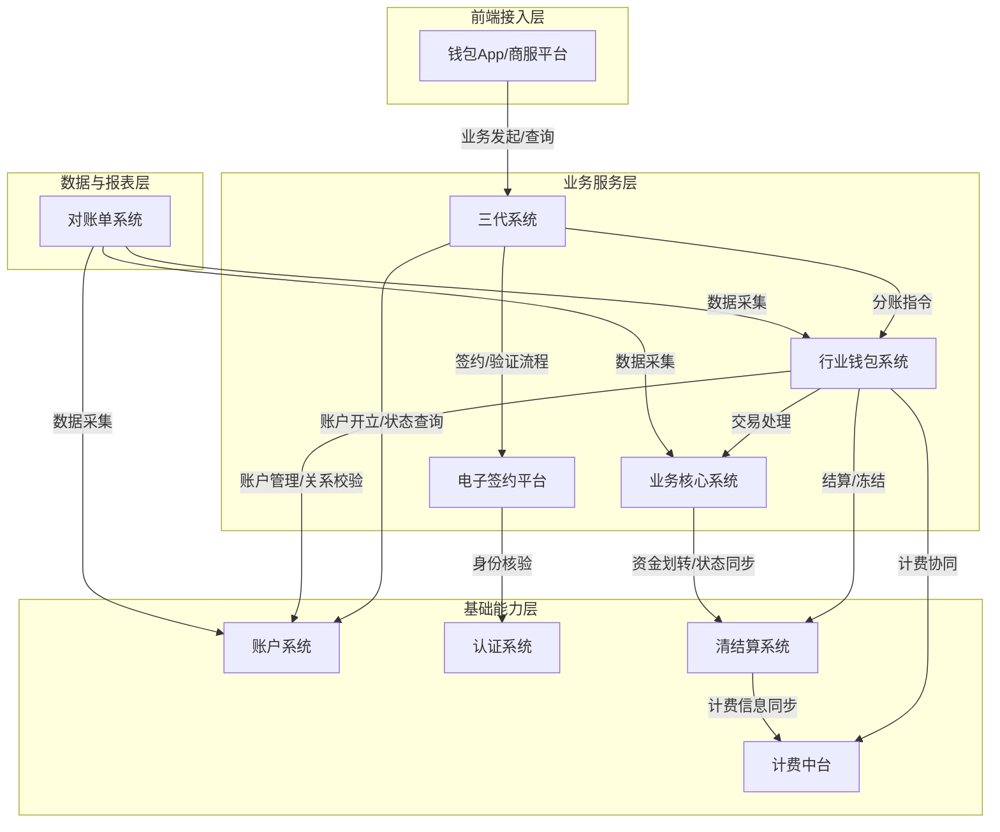
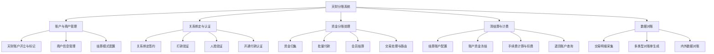
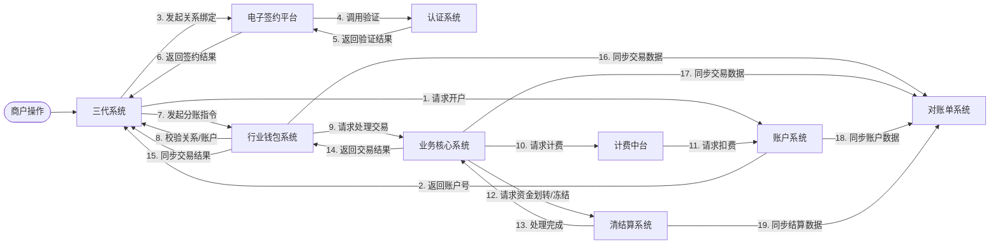
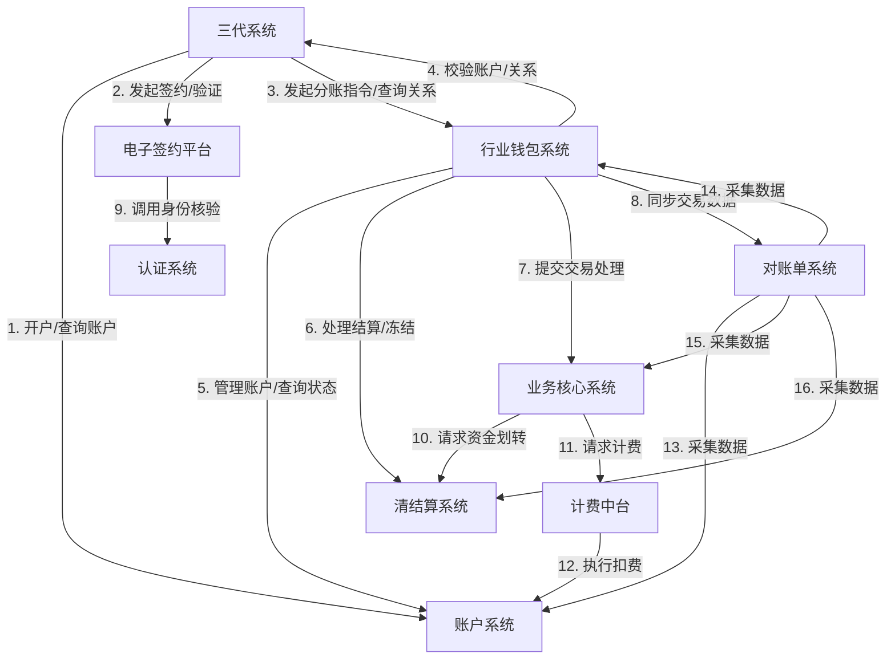

## 2.1 系统结构
天财分账系统采用分层架构，旨在为天财商龙商户提供门店分账、会员结算与批量付款服务。系统以行业钱包系统为核心业务处理引擎，整合账户、认证、签约、清结算等能力，通过三代系统作为统一业务入口，为钱包App/商服平台提供前端服务支持。

## 2.2 功能结构
系统功能围绕天财分账的核心业务流程展开，主要划分为账户与商户管理、关系绑定与认证、资金分账处理、清结算与计费、以及数据对账五大功能域。

## 2.3 网络拓扑图
TBD

## 2.4 数据流转
数据流转以核心业务流程驱动，涉及商户信息、账户信息、关系绑定数据、交易指令及资金流水在多系统间的传递与状态同步。

## 2.5 系统模块交互关系
模块间通过定义清晰的接口进行协作。三代系统作为主要业务入口，依赖行业钱包系统处理核心分账逻辑；行业钱包系统作为枢纽，协调账户、清结算、计费等底层能力；对账单系统作为数据汇总端，依赖多个业务模块提供数据。

