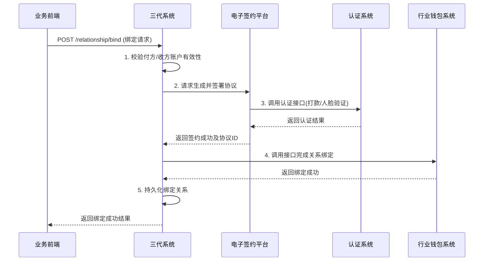

# 模块设计: 三代系统

生成时间: 2026-01-21 14:38:29
批判迭代: 1

---

# 三代系统模块设计文档

## 1. Overview
- **Purpose and scope**: 三代系统负责商户管理、开户接口调用、结算模式配置、分账关系绑定接口提供。它是天财分账业务中连接业务前端与底层账户、钱包系统的关键枢纽，负责处理商户侧的业务配置与指令发起。

## 2. Interface Design
- **API endpoints (REST/GraphQL)**:
    1.  `POST /api/v1/merchants/{merchantId}/tiancai-accounts`: 为指定商户开立天财专用账户。
    2.  `POST /api/v1/merchants/{merchantId}/settlement-mode`: 配置商户的结算模式（主动结算/被动结算）。
    3.  `POST /api/v1/relationship/bind`: 建立分账关系绑定（签约与认证）。
    4.  `GET /api/v1/merchants/{merchantId}/relationship`: 查询商户的绑定关系。
    5.  `POST /api/v1/batch-payment`: 发起批量付款指令。
    6.  `POST /api/v1/member-settlement`: 发起会员结算指令。
    7.  `POST /api/v1/collection`: 发起归集指令。
- **Request/response structures**:
    - **开立天财账户请求 (`POST /api/v1/merchants/{merchantId}/tiancai-accounts`)**:
        ```json
        {
          "requestId": "string, 请求唯一标识",
          "merchantType": "string, 商户类型 (HEADQUARTERS/STORE)",
          "operator": "string, 操作员"
        }
        ```
    - **配置结算模式请求 (`POST /api/v1/merchants/{merchantId}/settlement-mode`)**:
        ```json
        {
          "mode": "string, 结算模式 (ACTIVE/PASSIVE)",
          "tiancaiAccountNo": "string, 天财专用账户号 (mode=ACTIVE时必填)"
        }
        ```
    - **关系绑定请求 (`POST /api/v1/relationship/bind`)**:
        ```json
        {
          "payerMerchantId": "string, 付方商户ID",
          "payerAccountNo": "string, 付方天财账户号",
          "payeeMerchantId": "string, 收方商户ID",
          "payeeAccountNo": "string, 收方天财账户号",
          "scene": "string, 业务场景 (COLLECTION/BATCH_PAYMENT/MEMBER_SETTLEMENT)",
          "feeBearer": "string, 手续费承担方 (PAYER/PAYEE)"
        }
        ```
- **Published/consumed events (if any)**:
    - **Published Event**: `MERCHANT_SETTLEMENT_MODE_UPDATED`
        - 当商户的结算模式配置成功更新后发布。
        - Payload: `{ "merchantId": "string", "settlementMode": "string", "tiancaiAccountNo": "string" }`
    - **Published Event**: `RELATIONSHIP_BOUND`
        - 当分账关系绑定（签约与认证）成功后发布。
        - Payload: `{ "relationshipId": "string", "payerMerchantId": "string", "payeeMerchantId": "string", "scene": "string", "status": "ACTIVE" }`
    - **Consumed Event**: `ACCOUNT_CREATED`
        - 消费账户系统发布的事件，用于更新本地商户与天财账户的关联信息。

## 3. Data Model
- **Tables/collections**:
    1.  `merchant`: 存储商户核心信息。
    2.  `merchant_tiancai_account`: 存储商户与天财专用账户的关联关系。
    3.  `settlement_config`: 存储商户的结算模式配置。
    4.  `relationship_binding`: 存储分账关系绑定记录。
    5.  `payment_order`: 存储发起的付款指令（批量付款、会员结算、归集）。
- **Key fields**:
    - `merchant` 表:
        - `id` (PK): 主键，商户ID。
        - `name`: 商户名称。
        - `type`: 商户类型 (`HEADQUARTERS`/`STORE`)。
        - `status`: 商户状态。
    - `merchant_tiancai_account` 表:
        - `id` (PK): 主键。
        - `merchant_id`: 关联商户ID。
        - `account_id`: 账户系统返回的账户ID。
        - `wallet_account_no`: 行业钱包账户号。
        - `status`: 账户状态。
    - `settlement_config` 表:
        - `id` (PK): 主键。
        - `merchant_id`: 关联商户ID。
        - `mode`: 结算模式 (`ACTIVE`/`PASSIVE`)。
        - `tiancai_account_no`: 绑定的天财专用账户号（主动结算时有效）。
    - `relationship_binding` 表:
        - `id` (PK): 主键，关系ID。
        - `payer_merchant_id`: 付方商户ID。
        - `payer_account_no`: 付方天财账户号。
        - `payee_merchant_id`: 收方商户ID。
        - `payee_account_no`: 收方天财账户号。
        - `scene`: 业务场景。
        - `fee_bearer`: 手续费承担方。
        - `status`: 绑定状态 (`PENDING`/`ACTIVE`/`INACTIVE`)。
        - `contract_id`: 电子签约协议ID。
- **Relationships with other modules**:
    - 调用**账户系统**接口，为商户开立天财专用账户。
    - 与**行业钱包系统**交互，进行关系绑定校验和分账指令处理。
    - 向**计费中台**同步手续费配置。
    - 与**电子签约平台**交互，完成关系绑定的签约与认证流程。
    - 将交易记录发送至**业务核心系统**。

## 4. Business Logic
- **Core workflows / algorithms**:
    1.  **商户天财账户开立**: 接收业务请求，校验商户信息，调用账户系统接口开立天财专用账户，并维护本地关联关系。
    2.  **结算模式配置**: 为商户配置主动或被动结算模式。若为主动结算，需绑定其天财专用账户号。
    3.  **分账关系绑定（签约与认证）**: 根据业务场景（归集、批量付款、会员结算），协调付方与收方完成关系建立。此流程涉及调用电子签约平台完成协议签署与身份认证（打款验证/人脸验证），最终在行业钱包系统完成关系绑定。
    4.  **付款指令发起**: 根据业务场景（批量付款、会员结算、归集），校验关系与账户状态，构造请求并调用行业钱包系统的分账接口。
    5.  **手续费配置同步**: 将分账手续费承担方等计费规则同步至计费中台。
- **Business rules and validations**:
    - 只有状态正常的商户才能开立天财账户。
    - 同一商户只能配置一种结算模式。
    - 关系绑定时，付方和收方的天财账户必须已开立且状态正常。
    - 发起付款指令前，必须存在对应场景下已激活（`ACTIVE`）的关系绑定。
    - 批量付款和会员结算场景下，付方（总部/门店）需额外完成"开通付款"的签约认证流程。
- **Key edge cases**:
    - **账户开立失败**: 调用账户系统失败，需回滚本地操作，并向用户返回明确错误。
    - **关系绑定认证失败**: 电子签约平台的打款验证或人脸验证失败，关系绑定状态置为失败，需支持重试或人工处理。
    - **重复绑定**: 同一付方、收方、场景下已存在有效绑定关系，应拒绝重复绑定或进行更新。
    - **指令发起时关系失效**: 发起付款时，发现对应的关系绑定已解除或失效，指令应被拒绝。

## 5. Sequence Diagrams

### 5.1 分账关系绑定与签约认证流程


## 6. Error Handling
- **Expected error cases**:
    1.  `MERCHANT_NOT_FOUND_OR_INACTIVE`: 指定的商户不存在或状态异常。
    2.  `TIANCAI_ACCOUNT_NOT_EXISTS`: 商户未开立天财专用账户。
    3.  `DUPLICATE_RELATIONSHIP`: 试图重复绑定已存在且有效的关系。
    4.  `ESIGN_SERVICE_FAILED`: 电子签约平台服务调用失败（生成协议、认证失败等）。
    5.  `WALLET_BINDING_FAILED`: 行业钱包系统关系绑定接口调用失败。
    6.  `INVALID_SETTLEMENT_MODE`: 结算模式配置非法（如被动结算模式绑定了账户号）。
    7.  `RELATIONSHIP_INACTIVE`: 发起付款时，对应的绑定关系未激活或已失效。
- **Handling strategies**:
    - **业务校验错误** (`MERCHANT_NOT_FOUND`, `DUPLICATE_RELATIONSHIP`): 直接返回错误，引导用户检查。
    - **外部依赖业务失败** (`ESIGN_SERVICE_FAILED`认证失败): 返回具体的业务失败原因，支持用户重新发起。
    - **外部依赖系统异常** (`WALLET_BINDING_FAILED`系统错误): 记录日志并告警，返回系统错误，建议用户稍后重试。对于关键操作（如绑定），需实现异步补偿或状态对账机制。
    - **数据不一致**: 定期执行对账任务，确保三代系统、钱包系统、账户系统间的商户、账户、关系状态一致。

## 7. Dependencies
- **上游模块**:
    - **业务前端/接入方**: 向三代系统发起开户、配置、绑定、付款等业务请求。
- **下游模块**:
    - **账户系统**: 调用其接口开立天财专用账户。
    - **行业钱包系统**: 调用其接口完成关系绑定和分账指令处理。
    - **电子签约平台**: 调用其服务完成协议签署与身份认证流程。
    - **认证系统**: 通过电子签约平台间接依赖，完成打款验证和人脸验证。
    - **计费中台**: 向其同步手续费配置信息。
    - **业务核心系统**: 向其发送天财分账交易记录。
    - **清结算系统**: 根据术语表，三代系统负责"结算模式配置"，清结算系统负责"结算账户配置"，两者存在配置信息的关联与同步需求。