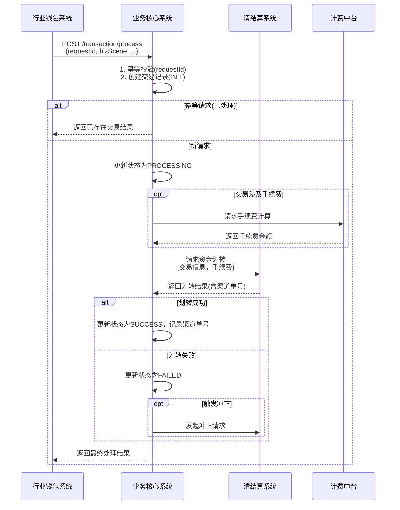

# 模块设计: 业务核心系统

生成时间: 2026-01-21 14:37:55
批判迭代: 2

---

# 业务核心系统模块设计文档

## 1. Overview

### Purpose and scope
业务核心系统是接收并处理'天财分账'交易记录的系统。其核心目的是作为天财分账业务的后端处理引擎，负责处理由归集、批量付款、会员结算等业务场景产生的交易指令，并与行业钱包系统、三代系统、清结算系统等下游模块协作，完成资金流转、状态更新和记录持久化。其范围限定于天财分账相关的交易处理，不涉及商户管理、账户开立或协议签约等前置流程。

**与行业钱包系统的职责边界澄清**：根据术语表定义，行业钱包系统是"负责天财专用账户管理、关系绑定校验、分账请求处理及与各系统交互的核心业务系统"。因此，业务核心系统是行业钱包系统在处理分账请求时，为执行具体的资金处理逻辑而调用的下游系统。业务核心系统专注于交易处理、资金路由和状态管理，不负责账户管理和关系绑定校验。

## 2. Interface Design

### API endpoints (REST/GraphQL) if applicable
业务核心系统作为下游服务，主要提供以下REST API供行业钱包系统调用：

1.  **POST /api/v1/transaction/process**
    *   **描述**：处理天财分账交易请求。
    *   **调用方**：行业钱包系统。
2.  **POST /api/v1/transaction/query**
    *   **描述**：查询交易处理状态。
    *   **调用方**：行业钱包系统。

### Request/response structures (if known)
**请求体 (POST /api/v1/transaction/process):**
```json
{
  "requestId": "string，幂等键，由上游生成",
  "bizScene": "string，业务场景：COLLECTION(归集)/BATCH_PAY(批量付款)/MEMBER_SETTLEMENT(会员结算)",
  "payerAccountNo": "string，付方天财专用账户号",
  "payeeAccountNo": "string，收方天财专用账户号",
  "amount": "number，交易金额(分)",
  "fundPurpose": "string，资金用途",
  "feeBearer": "string，手续费承担方：PAYER(付方)/PAYEE(收方)",
  "originalOrderInfo": "object，原始订单信息，用于对账"
}
```

**响应体 (通用):**
```json
{
  "code": "string，响应码",
  "message": "string，响应信息",
  "data": {
    "transactionId": "string，业务核心系统生成的唯一交易流水号",
    "status": "string，交易状态：PROCESSING/SUCCESS/FAILED",
    "finishTime": "string，交易完成时间(若完成)",
    "feeAmount": "number，手续费金额(分)"
  }
}
```

### Published/consumed events (if any)
TBD

## 3. Data Model

### Tables/collections
核心数据表设计如下：

1.  **transaction_record (交易记录表)**
    *   持久化每一笔分账交易的核心信息与状态。
2.  **transaction_step_log (交易步骤日志表)**
    *   记录交易处理过程中的关键步骤与调用下游系统的结果，用于问题排查与对账。

### Key fields (only if present in context; otherwise TBD)
**transaction_record 表关键字段:**
*   `id` / `transaction_id`: 主键，业务核心系统生成的唯一交易流水号。
*   `request_id`: 上游请求ID，用于幂等性控制。
*   `biz_scene`: 业务场景。
*   `payer_account_no`: 付方账户。
*   `payee_account_no`: 收方账户。
*   `amount`: 交易金额。
*   `fund_purpose`: 资金用途。
*   `fee_bearer`: 手续费承担方。
*   `fee_amount`: 手续费金额。
*   `status`: 交易状态 (INIT, PROCESSING, SUCCESS, FAILED, REVERSED)。
*   `channel_order_no`: 下游系统（如清结算）返回的渠道订单号。
*   `create_time` / `update_time`: 创建与更新时间。

**transaction_step_log 表关键字段:**
*   `id`: 主键。
*   `transaction_id`: 关联的交易记录ID。
*   `step`: 步骤名称 (如：VALIDATE, CALCULATE_FEE, TRANSFER_FUND)。
*   `invoke_target`: 调用的目标系统或服务。
*   `request_data`: 请求数据快照。
*   `response_data`: 响应数据快照。
*   `status`: 步骤执行状态 (SUCCESS/FAILED)。
*   `create_time`: 日志创建时间。

### Relationships with other modules
- **行业钱包系统**: 业务核心系统接收来自行业钱包系统的分账请求，并返回处理结果。行业钱包系统负责前置的账户校验与关系绑定校验。
- **三代系统**: 业务核心系统通过行业钱包系统间接获取商户及手续费配置信息。不直接交互。
- **清结算系统**: 在处理涉及资金划转的分账交易时，调用清结算系统执行资金操作。
- **对账单系统**: 业务核心系统持久化的交易记录是对账单系统生成天财机构层分账对账单的重要数据来源。
- **计费中台**: 在处理涉及手续费的交易时，调用计费中台进行手续费计算。

## 4. Business Logic

### Core workflows / algorithms
1.  **交易接收与幂等校验**: 接收请求，通过`requestId`检查是否已处理，确保幂等性。
2.  **交易记录创建与持久化**: 创建初始状态(INIT)的交易记录。
3.  **交易处理与路由**: 根据`bizScene`和`fundPurpose`，编排处理步骤。核心步骤包括：
    a. **手续费计算**: 若交易涉及手续费，调用计费中台。
    b. **资金划转**: 调用清结算系统，执行包含本金与手续费的划转指令。
4.  **状态同步与更新**: 根据各步骤结果，更新交易最终状态(SUCCESS/FAILED)，并记录渠道订单号。
5.  **日切处理**: 在系统日切期间，暂停处理新交易或将其置为待处理状态，待日切完成后继续。日切前后的交易需明确区分会计日期。

### Business rules and validations
- **账户有效性**: 交易关联的付方与收方账户号必须为有效的天财专用账户（此校验主要由上游行业钱包系统负责）。
- **场景路由**: 根据`资金用途`字段，路由至对应的内部处理逻辑。
- **手续费处理**: 根据`分账手续费承担方`，在调用计费中台和清结算系统时传递正确的计费方信息。
- **状态机管理**: 交易状态必须严格按照定义的状态机流转（INIT -> PROCESSING -> SUCCESS/FAILED/REVERSED）。

### Key edge cases
- **下游系统超时/失败**: 实现带退避策略的重试机制。对于清结算系统等资金操作，需有明确的冲正（REVERSED）逻辑。
- **重复请求**: 通过`requestId`实现幂等，避免重复处理。
- **日切期间交易**: 明确交易所属的会计日期，避免跨日切点交易数据混乱。日切时点到达前，可暂停接收新交易或将其标记为"日切待处理"。
- **交易冲正**: 当资金划转失败或需要撤销时，需能发起冲正交易，并将原交易状态更新为REVERSED。

## 5. Sequence Diagrams



## 6. Error Handling

### Expected error cases
- **下游系统调用失败**: 清结算系统、计费中台服务不可用、超时或返回业务失败。
- **网络或超时异常**: 与外部系统通信中断。
- **数据持久化失败**: 数据库异常，导致交易状态更新失败。
- **日切冲突**: 交易处理过程中遭遇系统日切。

### Handling strategies
- **重试机制**: 对下游系统的暂时性故障（如网络超时），实施指数退避重试。
- **状态回查与补偿**: 对于超时未知结果的调用（如清结算），通过定时任务回查下游状态，并进行本地状态同步补偿。
- **冲正交易**: 资金划转失败后，若需回滚，则发起冲正交易，确保资金一致性。
- **告警与人工介入**: 对于多次重试失败、冲正失败等严重错误，记录详细日志并触发告警，支持人工干预。
- **幂等性保证**: 所有API通过`requestId`保证幂等，防止重复执行造成资金风险。

## 7. Dependencies

### How this module interacts with upstream/downstream modules
- **上游 - 行业钱包系统**: 行业钱包系统在完成账户、关系绑定等前置校验后，调用业务核心系统执行交易处理。业务核心系统处理完毕后返回结果。行业钱包系统是业务核心系统的唯一直接上游调用方。
- **下游 - 清结算系统**: 业务核心系统依赖清结算系统执行所有资金冻结、划转、冲正操作。这是最关键的资金操作依赖。
- **下游 - 计费中台**: 业务核心系统在处理涉及手续费的交易时，同步调用计费中台计算费用。
- **下游 - 对账单系统**: 业务核心系统通过数据同步或接口方式，为对账单系统提供已持久化的完整交易记录，作为对账数据源。
- **下游 - 三代系统**: 无直接依赖。商户及手续费配置信息通过行业钱包系统传递。