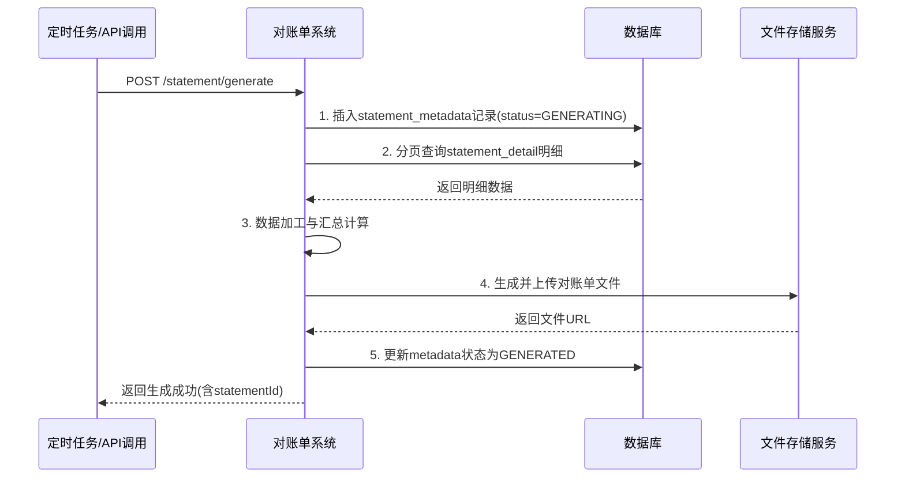
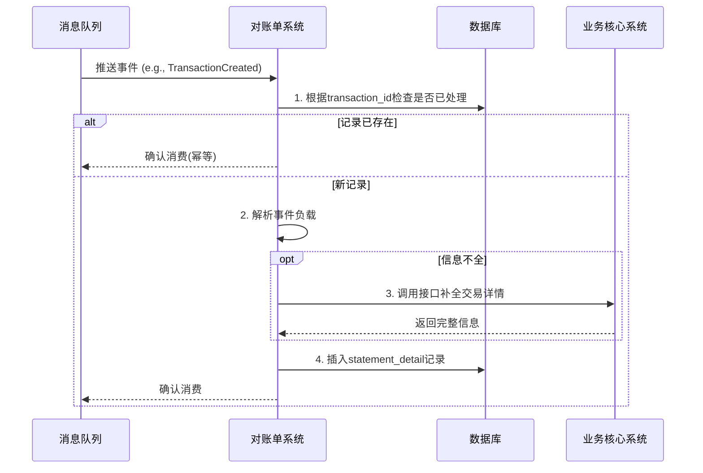
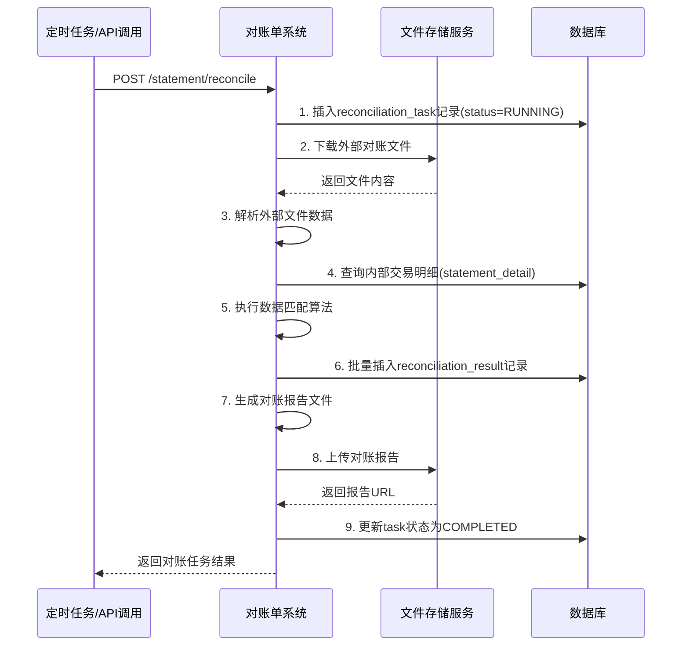

# 模块设计: 对账单系统

生成时间: 2026-01-21 14:40:49
批判迭代: 2

---

# 对账单系统模块设计文档

## 1. 概述

### 目的与范围
对账单系统负责为天财分账业务生成准确、完整、可追溯的资金交易明细汇总，支持商户、运营及财务人员进行资金核对与账务管理。其核心目的是提供机构层及商户层的各类对账单，包括分账、提款、收单、结算等。系统范围涵盖从天财专用账户开立、关系绑定到归集、批量付款、会员结算等全链路业务产生的资金变动记录，通过消费上游系统事件、聚合交易数据、生成标准格式文件，并提供对账功能以识别内部数据与外部渠道数据之间的差异。

## 2. 接口设计

### API端点 (REST/GraphQL)
1.  `POST /api/v1/statement/generate`: 触发生成指定类型和周期的对账单。
2.  `GET /api/v1/statement/download/{statementId}`: 下载已生成的对账单文件。
3.  `GET /api/v1/statement/query`: 查询对账单生成记录及状态。
4.  `POST /api/v1/statement/reconcile`: 发起对账任务，比对内部交易记录与外部渠道数据。
5.  `GET /api/v1/statement/reconcile/task/{taskId}`: 查询对账任务结果。

### 请求/响应结构
- **生成对账单请求 (`POST /api/v1/statement/generate`)**:
    ```json
    {
      "statementType": "string, 对账单类型 (ALLOCATION/WITHDRAWAL/ACQUIRING/SETTLEMENT)",
      "merchantId": "string, 商户ID (可选，不传则生成机构层汇总账单)",
      "startDate": "string, 开始日期 (YYYY-MM-DD)",
      "endDate": "string, 结束日期 (YYYY-MM-DD)",
      "currency": "string, 币种 (默认CNY)"
    }
    ```
- **生成对账单响应**:
    ```json
    {
      "code": "string, 响应码",
      "message": "string, 响应信息",
      "data": {
        "statementId": "string, 对账单唯一ID",
        "status": "string, 生成状态 (PROCESSING/SUCCESS/FAILED)",
        "estimatedCompletionTime": "string, 预计完成时间"
      }
    }
    ```
- **查询对账单请求 (`GET /api/v1/statement/query`)**:
    - 查询参数: `statementId` (可选), `merchantId` (可选), `statementType` (可选), `date` (可选, YYYY-MM-DD)
- **查询对账单响应**:
    ```json
    {
      "code": "string",
      "message": "string",
      "data": {
        "statementId": "string",
        "statementType": "string",
        "merchantId": "string",
        "period": "string",
        "status": "string",
        "fileUrl": "string (生成成功时)",
        "generateTime": "string",
        "itemCount": "number"
      }
    }
    ```
- **发起对账请求 (`POST /api/v1/statement/reconcile`)**:
    ```json
    {
      "reconcileDate": "string, 对账日期 (YYYY-MM-DD)",
      "dataSourceA": "string, 数据源A描述 (如: INTERNAL_TRANSACTION)",
      "dataSourceB": "string, 数据源B描述 (如: CHANNEL_SETTLEMENT_FILE)",
      "channelType": "string, 渠道类型 (如: BANK_A)",
      "fileUrl": "string, 外部对账文件下载地址"
    }
    ```
- **发起对账响应**:
    ```json
    {
      "code": "string",
      "message": "string",
      "data": {
        "taskId": "string, 对账任务ID",
        "status": "string, 任务状态 (RUNNING)"
      }
    }
    ```
- **查询对账任务结果请求 (`GET /api/v1/statement/reconcile/task/{taskId}`)**:
    - 路径参数: `taskId`
- **查询对账任务结果响应**:
    ```json
    {
      "code": "string",
      "message": "string",
      "data": {
        "taskId": "string",
        "reconcileDate": "string",
        "status": "string (RUNNING/COMPLETED/FAILED)",
        "resultSummary": {
          "totalCountA": "number",
          "totalCountB": "number",
          "matchedCount": "number",
          "missingInACount": "number",
          "missingInBCount": "number",
          "amountMismatchCount": "number"
        },
        "reportUrl": "string (对账报告文件地址，任务完成时)"
      }
    }
    ```

### 发布/消费的事件
- **消费的事件**:
    - `ACCOUNT_CREATED`: 消费账户系统发布的事件，用于记录天财专用账户开立信息。
    - `WALLET_TRANSFER_PROCESSED`: 消费行业钱包系统发布的事件，用于获取分账（归集、批量付款、会员结算）交易明细。
    - `RELATIONSHIP_BINDING_SYNC`: 消费行业钱包系统发布的事件，用于记录关系绑定状态变更。
    - `TransactionCreated`: 消费业务核心系统发布的事件，作为分账交易记录的权威来源。
- **发布的事件**: TBD

## 3. 数据模型

### 表/集合
1.  `statement_metadata`: 对账单元数据表，记录账单生成任务。
2.  `statement_detail`: 对账单明细数据表，存储构成账单的每笔交易记录。
3.  `reconciliation_task`: 对账任务记录表。
4.  `reconciliation_result`: 对账结果明细表。

### 关键字段
- **`statement_metadata` 表**:
    - `statement_id` (PK): 对账单唯一ID。
    - `statement_type`: 对账单类型 (ALLOCATION, WITHDRAWAL, ACQUIRING, SETTLEMENT)。
    - `merchant_id`: 关联商户ID（机构层账单可为空）。
    - `period_start`: 账单周期开始日期。
    - `period_end`: 账单周期结束日期。
    - `status`: 状态 (GENERATING, GENERATED, FAILED)。
    - `file_storage_path`: 生成文件存储路径。
    - `item_count`: 明细条目数。
    - `generate_start_time`: 生成开始时间。
    - `generate_end_time`: 生成结束时间。
    - `created_at`: 创建时间。
- **`statement_detail` 表**:
    - `id` (PK): 主键。
    - `statement_id`: 关联的对账单ID。
    - `transaction_time`: 交易发生时间。
    - `transaction_id`: 业务系统交易流水号。
    - `biz_scene`: 业务场景 (COLLECTION, BATCH_PAYMENT, MEMBER_SETTLEMENT)。
    - `payer_account_no`: 付方账户号。
    - `payee_account_no`: 收方账户号。
    - `amount`: 交易金额。
    - `fee_amount`: 手续费金额。
    - `fee_bearer`: 手续费承担方 (PAYER, PAYEE)。
    - `balance_after`: 交易后账户余额（若可获取）。
    - `fund_purpose`: 资金用途。
    - `status`: 交易状态。
    - `channel_order_no`: 渠道订单号。
    - `created_at`: 创建时间。
- **`reconciliation_task` 表**:
    - `task_id` (PK): 对账任务ID。
    - `reconcile_date`: 对账日期。
    - `data_source_a`: 数据源A描述。
    - `data_source_b`: 数据源B描述。
    - `channel_type`: 渠道类型。
    - `status`: 任务状态 (RUNNING, COMPLETED, FAILED)。
    - `result_summary`: 结果摘要JSON。
    - `report_file_path`: 对账报告文件路径。
    - `start_time`: 任务开始时间。
    - `end_time`: 任务结束时间。
- **`reconciliation_result` 表**:
    - `id` (PK): 主键。
    - `task_id`: 关联的对账任务ID。
    - `transaction_id`: 交易ID。
    - `reconcile_status`: 对账状态 (MATCHED, MISSING_IN_A, MISSING_IN_B, AMOUNT_MISMATCH)。
    - `amount_a`: 数据源A金额。
    - `amount_b`: 数据源B金额。
    - `difference_amount`: 差异金额。
    - `remark`: 备注。

### 与其他模块的关系
- **行业钱包系统**: 消费其发布的 `WALLET_TRANSFER_PROCESSED` 和 `RELATIONSHIP_BINDING_SYNC` 事件，作为分账交易明细和关系变动的主要数据源。
- **账户系统**: 消费其发布的 `ACCOUNT_CREATED` 事件，记录账户开立信息。
- **业务核心系统**: 消费其发布的 `TransactionCreated` 事件，作为分账交易记录的权威来源。
- **清结算系统**: 通过接口获取渠道结算文件，用于外部对账。根据上游设计，清结算系统未发布交易事件，因此不消费其事件。
- **文件存储服务**: 依赖其存储生成的对账单文件和对账报告。
- **消息队列**: 依赖其接收来自上游模块的业务事件。

## 4. 业务逻辑

### 核心工作流/算法
1.  **交易明细采集（事件消费）**:
    - **事件监听**: 持续监听消息队列中的 `ACCOUNT_CREATED`, `WALLET_TRANSFER_PROCESSED`, `RELATIONSHIP_BINDING_SYNC`, `TransactionCreated` 事件。
    - **幂等性处理**: 使用 `transaction_id` 或事件唯一标识作为去重键，确保同一笔交易明细只被记录一次。通过查询 `statement_detail` 表检查重复记录。
    - **数据持久化**: 解析事件负载，将交易信息（交易时间、账户、金额、场景等）持久化到 `statement_detail` 表中。对于信息不全的记录，可异步调用业务核心系统接口补全。
    - **数据分区**: 为 `statement_detail` 表设计按 `transaction_time` 的分区策略（如按月分区），以支持海量数据的高效查询和管理。

2.  **对账单生成**:
    - **触发**: 接收定时任务或手动API调用 (`POST /api/v1/statement/generate`)。
    - **数据拉取与聚合**:
        - 根据 `statementType` 和日期范围，从 `statement_detail` 表中查询相关交易记录。
        - **分账对账单**: 筛选 `biz_scene` 为 `COLLECTION`（归集）、`BATCH_PAYMENT`（批量付款）、`MEMBER_SETTLEMENT`（会员结算）的交易。
        - **提款对账单**: 筛选业务场景为提现的交易（需根据业务定义明确场景值）。
        - **收单对账单**: 筛选业务场景为收单的交易（需根据业务定义明确场景值）。
        - **结算对账单**: 筛选与清结算相关的资金划转记录（需根据业务定义明确场景值）。
        - 采用分页查询方式处理大数据量，避免内存溢出。
    - **数据加工**:
        - 计算周期内交易汇总金额、手续费总额。
        - 尝试计算期初/期末余额：通过查询该账户在周期开始前最后一笔交易的 `balance_after` 作为期初余额，周期结束后最后一笔交易的 `balance_after` 作为期末余额。
        - 格式化每条明细，包含所有必要字段。
    - **文件生成**:
        - 将加工后的数据生成标准格式文件（如CSV）。
        - 文件包含固定格式的表头、明细列表、汇总信息（总笔数、总金额、手续费总额、期初余额、期末余额）。
        - 将文件上传至文件存储服务（如OSS）。
    - **元数据更新**:
        - 在 `statement_metadata` 表中创建初始记录，状态为 `GENERATING`。
        - 文件生成成功后，更新记录状态为 `GENERATED`，记录文件路径和 `item_count`。
        - 若任何步骤失败，更新状态为 `FAILED`，并记录错误信息。

3.  **对账（内部与外部）**:
    - **触发**: 接收手动API调用 (`POST /api/v1/statement/reconcile`) 或定时任务。
    - **外部文件解析**:
        - 根据 `channelType` 加载对应的文件解析规则配置。
        - 从 `fileUrl` 下载渠道结算文件，并解析为内部标准交易记录格式。
    - **数据匹配算法**:
        - 以 `transaction_id` 和 `channel_order_no` 作为关键匹配字段。
        - 遍历内部数据源（`statement_detail`）和外部数据源（解析后的文件记录）。
        - 匹配逻辑：优先通过 `transaction_id` 匹配，若无则尝试通过 `channel_order_no`、交易时间、金额进行模糊匹配。
        - 对于匹配成功的记录，比较金额。若差异绝对值小于对账阈值（如0.01元），则标记为 `MATCHED`；否则标记为 `AMOUNT_MISMATCH`，并计算差异金额。
        - 对于仅存在于内部数据源的记录，标记为 `MISSING_IN_B`（渠道缺失）。
        - 对于仅存在于外部数据源的记录，标记为 `MISSING_IN_A`（内部缺失）。
    - **结果持久化与报告生成**:
        - 将每条对账结果记录到 `reconciliation_result` 表。
        - 汇总对账结果（总笔数、平账笔数、各类差异笔数），更新 `reconciliation_task` 表的 `result_summary`。
        - 生成对账报告文件（CSV格式），包含差异明细及汇总，上传至文件存储服务，并更新 `report_file_path`。
        - 更新任务状态为 `COMPLETED`。

### 业务规则与验证
- **账单周期**: 开始日期必须早于或等于结束日期，周期跨度需在系统允许范围内（如不超过31天）。结束日期不能晚于当前日期。
- **数据一致性**: 消费事件时需保证至少一次交付，并通过唯一键去重，避免明细重复。
- **文件格式**: 生成的对账单文件需包含固定格式的表头、明细、汇总信息。
- **对账阈值**: 金额差异小于配置的阈值（如0.01元）可视为平账。
- **数据保留**: 明细数据和对账单文件需根据监管和业务要求保留一定期限（如5年），过期数据可归档或清理。

### 关键边界情况处理
- **事件丢失或延迟**: 采用"事件消费+定时数据补偿"机制。定时（如每天凌晨）扫描业务核心系统特定时间窗口内（如过去72小时）的交易，与本地 `statement_detail` 表比对，通过接口拉取缺失记录并补录。
- **大数据量生成**: 对于海量交易明细的账单生成，采用分页查询、分批处理、异步生成的方式。生成任务状态持久化，支持进度查询。
- **生成过程中系统故障**: 账单生成任务记录中间状态 (`GENERATING`)。若任务失败，支持基于 `statement_id` 的重试。重试前需清理可能已生成的部分文件。
- **外部文件格式变更**: 渠道结算文件解析模块支持可配置的解析规则（如正则表达式、列映射）。配置变更可通过管理界面更新，无需代码发布。
- **对账匹配率低**: 当对账匹配率低于预设阈值（如95%）时，在对账报告中高亮提示，并触发告警通知运营人员核查。

## 5. 序列图

### 5.1 对账单生成流程


### 5.2 交易明细采集流程（事件消费）


### 5.3 对账流程


## 6. 错误处理

### 预期错误情况
1.  `INVALID_STATEMENT_PERIOD`: 请求的账单周期非法（开始日期晚于结束日期、周期超长、结束日期晚于当前日期）。
2.  `DATA_QUERY_FAILED`: 查询明细数据时数据库异常或超时。
3.  `FILE_GENERATE_FAILED`: 文件生成或上传至存储服务失败。
4.  `FILE_PARSE_ERROR`: 外部对账文件解析失败（格式错误、编码问题）。
5.  `EVENT_CONSUME_FAILED`: 消费业务事件时解析失败或持久化失败。
6.  `DUPLICATE_GENERATE_REQUEST`: 检测到相同参数（类型、商户、周期）的对账单生成任务正在执行。
7.  `DOWNSTREAM_SERVICE_UNAVAILABLE`: 调用业务核心系统补全数据时服务不可用。
8.  `RECONCILE_TASK_RUNNING`: 指定日期的对账任务正在执行中。

### 处理策略
- **`INVALID_STATEMENT_PERIOD`**: 向API调用方返回明确的错误码和描述，拒绝请求。
- **`DATA_QUERY_FAILED`**: 记录错误日志，对账单生成任务标记为`FAILED`。支持手动重试。对于查询超时，优化查询语句和索引，考虑对大数据量表进行分区。
- **`FILE_GENERATE_FAILED`**: 重试文件操作（最多3次），若仍失败则任务标记为`FAILED`，触发告警通知运维人员。
- **`FILE_PARSE_ERROR`**: 记录解析错误的具体行和内容，对账任务标记为`FAILED`，生成错误报告，触发告警通知运营人员检查文件格式。
- **`EVENT_CONSUME_FAILED`**: 记录失败事件及原因，消息进入死信队列。提供管理界面供人工查看与重新处理。同时，依赖定时数据补偿机制弥补数据缺失。
- **`DUPLICATE_GENERATE_REQUEST`**: 返回错误，提示用户已有任务在执行，并提供任务ID供查询。
- **`DOWNSTREAM_SERVICE_UNAVAILABLE`**: 事件消费流程中，若补全数据失败，仍将已有信息入库，并标记为"信息待补全"。由定时补偿任务后续处理。
- **`RECONCILE_TASK_RUNNING`**: 返回错误，提示对账任务正在执行，请勿重复提交。
- **系统级异常**: 捕获未预期异常，记录完整堆栈日志，触发监控告警。API请求返回通用系统错误码，异步任务标记为`FAILED`。

## 7. 依赖关系

### 上游模块
- **行业钱包系统**: 核心数据提供方。消费其发布的 `WALLET_TRANSFER_PROCESSED` 和 `RELATIONSHIP_BINDING_SYNC` 事件，获取分账交易和关系绑定的流水记录。
- **账户系统**: 消费其发布的 `ACCOUNT_CREATED` 事件，获取天财专用账户开立记录。
- **业务核心系统**: 核心数据提供方。消费其发布的 `TransactionCreated` 事件，作为分账交易记录的权威来源。在事件数据不全时，调用其接口补全交易详情。

### 下游模块
- **文件存储服务**: 依赖其存储生成的对账单文件和对账报告文件。
- **消息队列**: 依赖其接收来自上游模块的业务事件。
- **（商户/运营平台）**: 通过API为前端提供对账单查询、下载以及对账任务管理服务。

### 依赖澄清
- **清结算系统**: 根据上游设计，清结算系统未发布交易事件。对账单系统仅通过其接口（如有）或运营手动上传获取渠道结算文件，用于外部对账。不依赖其事件流。
- **三代系统**: 无直接接口或事件依赖。商户基础信息可通过行业钱包或业务核心系统间接获取。