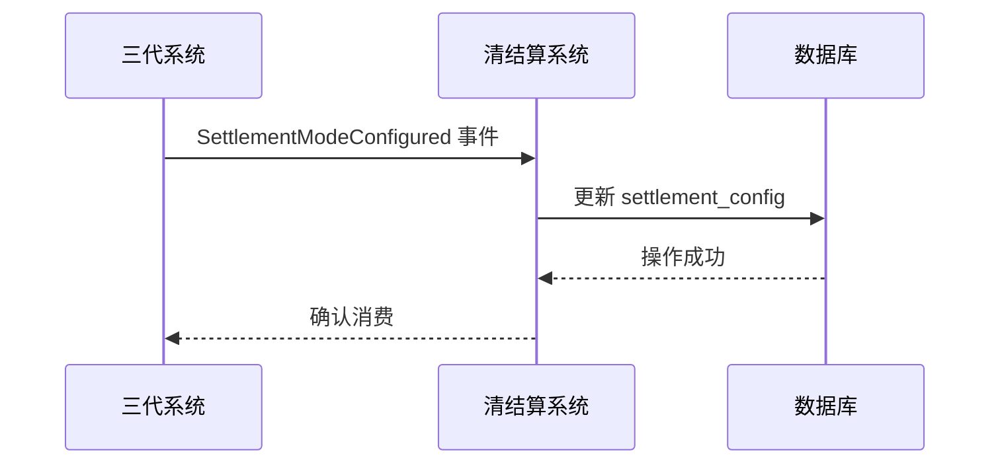
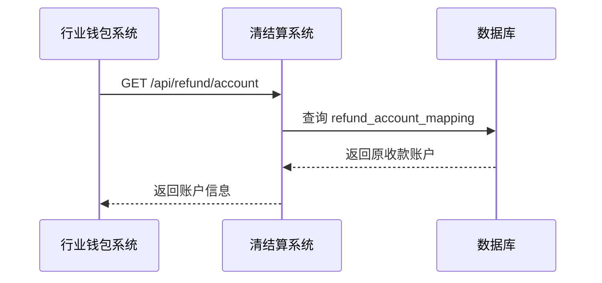
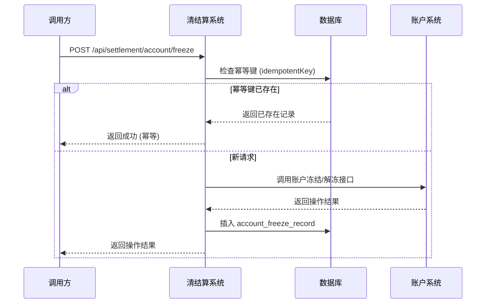
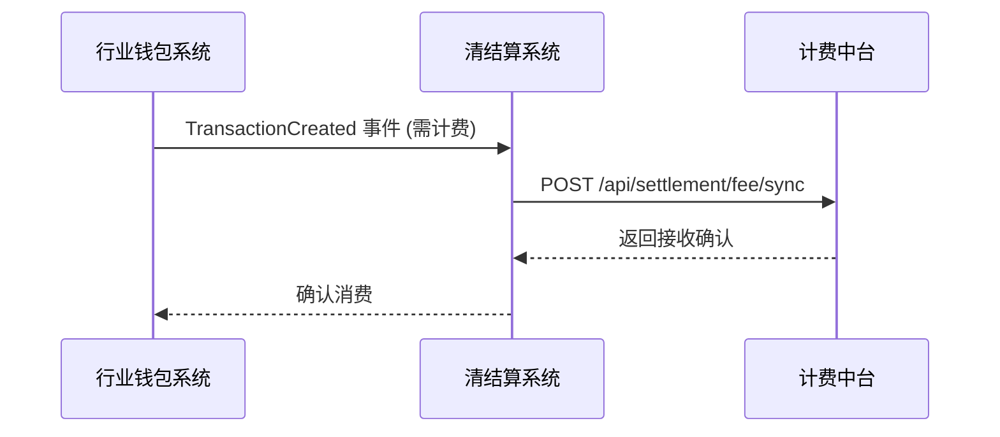

# 模块设计: 清结算系统

生成时间: 2026-01-21 14:38:01
批判迭代: 2

---

# 清结算系统 模块设计文档

## 1. 概述

### 目的与范围
清结算系统负责处理与天财分账业务相关的结算账户配置、专用账户资金冻结、退货账户查询以及计费处理。它是资金流转和结算控制的核心模块，确保分账、归集等业务的资金能够正确、安全地结算到指定的天财专用账户，并处理相关的费用计算。

## 2. 接口设计

### API端点
- `POST /api/settlement/account/freeze`: 对指定的天财专用账户执行资金冻结或解冻操作。
- `GET /api/refund/account`: 根据交易信息查询对应的原收款账户（天财收款账户）。
- `POST /api/settlement/config/sync`: 接收并处理由三代系统同步的商户结算模式配置。
- `POST /api/settlement/fee/sync`: 向计费中台同步涉及手续费的交易信息。

### 请求/响应结构
- **账户冻结请求 (`POST /api/settlement/account/freeze`)**:
    - 请求体: `{ "accountNo": "string", "operation": "FREEZE"|"UNFREEZE", "bizScene": "string", "idempotentKey": "string" }`
    - 响应体: `{ "success": boolean, "code": "string", "message": "string" }`
- **退货账户查询请求 (`GET /api/refund/account`)**:
    - 查询参数: `originalOrderNo` (原交易订单号), `bizType` (业务类型)
    - 响应体: `{ "accountNo": "string", "accountName": "string", "status": "string" }`
- **结算配置同步请求 (`POST /api/settlement/config/sync`)**:
    - 请求体: `{ "merchantId": "string", "settlementMode": "ACTIVE"|"PASSIVE", "receiverAccountNo": "string" }`
    - 响应体: `{ "success": boolean }`
- **计费信息同步请求 (`POST /api/settlement/fee/sync`)**:
    - 请求体: `{ "transactionId": "string", "payerAccountNo": "string", "receiverAccountNo": "string", "amount": number, "feeBearer": "PAYER"|"RECEIVER" }`
    - 响应体: `{ "feeId": "string", "status": "SUCCESS"|"PENDING" }`

### 发布/消费的事件
- **消费的事件**:
    - `SettlementModeConfigured`: 由三代系统发布，包含商户结算模式信息。
    - `TransactionCreated`: 由行业钱包系统发布，包含分账交易详情。
- **发布的事件**:
    - `AccountFrozen`: 账户冻结/解冻操作完成后发布。
    - `FeeInfoSynced`: 计费信息同步至计费中台后发布。

## 3. 数据模型

### 表/集合
- **`settlement_config` (结算配置表)**: 存储商户的结算模式与账户映射。
- **`account_freeze_record` (账户冻结记录表)**: 记录天财专用账户的冻结/解冻操作流水。
- **`refund_account_mapping` (退货账户映射表)**: 存储交易订单与原收款账户的映射关系。

### 关键字段
- **`settlement_config`**:
    - `id` (主键)
    - `merchant_id` (商户ID)
    - `settlement_mode` (结算模式: ACTIVE, PASSIVE)
    - `receiver_account_no` (天财收款账户号)
    - `created_at`
    - `updated_at`
- **`account_freeze_record`**:
    - `id` (主键)
    - `account_no` (账户号)
    - `operation` (操作: FREEZE, UNFREEZE)
    - `biz_scene` (业务场景)
    - `idempotent_key` (幂等键)
    - `operator` (操作人)
    - `created_at`
- **`refund_account_mapping`**:
    - `id` (主键)
    - `original_order_no` (原交易订单号)
    - `biz_type` (业务类型)
    - `payer_account_no` (付方账户号)
    - `receiver_account_no` (收方/原收款账户号)
    - `created_at`

### 与其他模块的关系
清结算系统与以下模块存在交互：
- **账户系统**: 负责开立和标记天财专用账户，清结算系统需基于账户系统的账户信息进行结算配置和冻结操作。
- **行业钱包系统**: 作为核心业务系统，在处理分账请求时，会与清结算系统交互以确认结算账户状态、执行冻结或查询退货账户。同时，消费其发布的交易事件。
- **三代系统**: 向清结算系统同步结算模式配置（如主动结算、被动结算）以及分账关系绑定信息。
- **计费中台**: 清结算系统将涉及手续费的分账交易信息传递给计费中台进行计费处理。

## 4. 业务逻辑

### 核心工作流/算法
1.  **结算账户配置**:
    - **触发**: 消费来自三代系统的 `SettlementModeConfigured` 事件。
    - **逻辑**: 根据事件中的商户ID和结算模式，更新或创建 `settlement_config` 记录。主动结算模式需记录指定的 `receiver_account_no`；被动结算模式该字段可为空。
    - **数据流**: 事件数据 -> `settlement_config` 表。

2.  **退货账户查询**:
    - **触发**: 行业钱包系统在处理退款/退货业务时，调用 `GET /api/refund/account` 接口。
    - **逻辑**: 根据请求中的 `originalOrderNo` 和 `bizType`，查询 `refund_account_mapping` 表，返回匹配的 `receiver_account_no`（即原收款账户）。
    - **数据流**: 接口请求 -> 查询 `refund_account_mapping` -> 返回账户信息。

3.  **专用账户冻结**:
    - **触发**: 行业钱包系统或风控系统调用 `POST /api/settlement/account/freeze` 接口。
    - **逻辑**:
        - 使用请求中的 `idempotentKey` 查询 `account_freeze_record`，实现操作幂等性。
        - 调用账户系统接口，执行实际的账户状态变更（冻结/解冻）。
        - 在 `account_freeze_record` 中记录操作流水。
        - 发布 `AccountFrozen` 事件。
    - **并发控制**: 基于 `account_no` 和 `idempotentKey` 实现数据库唯一索引，防止重复操作；关键状态变更使用乐观锁。

4.  **计费处理协同**:
    - **触发**: 消费来自行业钱包系统的 `TransactionCreated` 事件，当交易涉及手续费时触发。
    - **逻辑**: 解析事件，提取计费所需信息（交易双方、金额、手续费承担方），调用 `POST /api/settlement/fee/sync` 接口同步至计费中台。记录同步状态。
    - **补偿机制**: 若同步失败，将事件和失败原因存入重试表，由后台定时任务进行重试。

### 业务规则与验证
- 主动结算模式下，资金必须结算至商户在 `settlement_config` 中预先指定的天财收款账户。
- 被动结算模式下，资金应暂存于待结算账户，等待后续指令。
- 执行冻结操作前，必须验证操作权限和业务场景的合法性。
- 查询退货账户时，需确保交易信息的完整性和准确性，以匹配到正确的原收款账户。
- 所有对外接口调用需携带幂等键 (`idempotentKey`) 以防止重复处理。

### 关键边界情况处理
- **账户状态异常**: 当结算账户状态为已注销或已冻结时，拒绝后续的结算请求，并向调用方返回明确错误码。
- **并发冻结/解冻**: 通过数据库唯一索引 (`account_no`, `idempotentKey`) 和乐观锁版本号确保最终一致性。
- **计费信息同步失败**: 采用"存储-转发"模式，失败事件进入重试队列，最多重试3次，最终失败则告警并人工介入。
- **配置缺失**: 当处理交易时未找到对应的 `settlement_config`，视为配置错误，交易失败。

## 5. 序列图

### 核心工作流序列图

## 6. 错误处理

### 预期错误情况
- **业务错误**:
    - `ACCOUNT_NOT_FOUND`: 账户不存在或状态异常（冻结、注销）。
    - `CONFIG_MISSING`: 结算模式配置缺失或冲突。
    - `REFUND_ACCOUNT_NOT_MATCHED`: 退货账户查询无匹配结果。
    - `DUPLICATED_REQUEST`: 检测到重复请求（幂等键冲突）。
- **系统错误**:
    - `DOWNSTREAM_TIMEOUT`: 与下游系统（账户系统、计费中台）通信超时。
    - `DOWNSTREAM_ERROR`: 下游系统返回业务失败或内部错误。
    - `DATABASE_ERROR`: 数据库操作失败。

### 处理策略
- **业务错误**: 立即向调用方返回明确的错误码和描述，不进行重试。
- **系统间通信故障**:
    - 对于同步接口调用（如账户冻结），采用有限次重试（如3次），每次间隔递增。
    - 对于事件消费后的异步处理（如计费同步），采用"存储-转发"模式，失败事件进入重试队列，由后台任务周期性重试。
- **数据一致性**: 所有关键操作（如冻结）需记录操作流水 (`account_freeze_record`)，并支持基于流水进行对账与补偿。
- **监控与告警**: 所有错误均记录详细的错误日志、上下文和请求ID。系统错误达到阈值触发告警。

## 7. 依赖关系

### 上游模块
- **行业钱包系统**: 核心调用方，发起退货账户查询、账户冻结操作请求，并发布 `TransactionCreated` 事件。
- **三代系统**: 提供商户的结算模式配置信息（通过事件），并提供分账关系绑定接口。

### 下游模块
- **账户系统**: 依赖其提供准确的账户信息和执行账户状态控制（冻结/解冻）。
- **计费中台**: 依赖其完成交易手续费的最终计算。