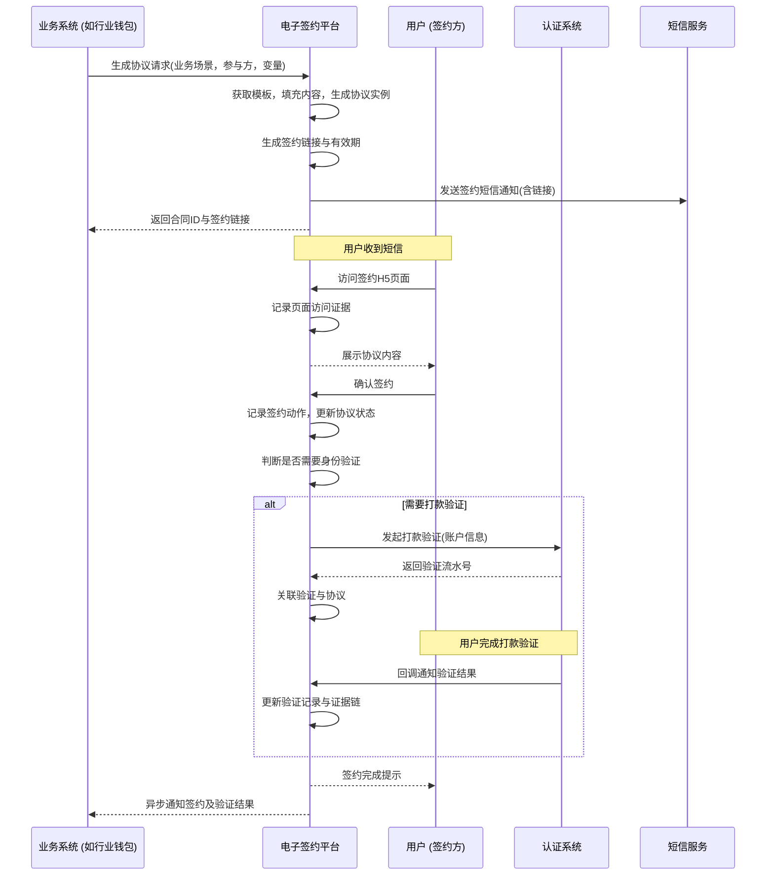

# 模块设计: 电子签约平台

生成时间: 2026-01-21 14:38:35
批判迭代: 1

---

# 电子签约平台 模块设计文档

## 1. Overview
- **Purpose and scope**: 电子签约平台负责协议模板管理、短信推送、H5页面封装、以及留存协议和认证过程证据链的系统。它为天财分账业务中的关系绑定、开通付款等流程提供电子签约与身份认证的集成服务，确保业务流程合规且证据可追溯。

## 2. Interface Design
- **API endpoints (REST/GraphQL) if applicable**:
    1. `POST /api/v1/esign/contract/generate`: 生成签约协议并初始化流程。
    2. `POST /api/v1/esign/contract/sign`: 提交签约确认。
    3. `POST /api/v1/esign/verification/initiate`: 发起身份验证流程。
    4. `POST /api/v1/esign/verification/callback`: 接收认证结果回调。
    5. `GET /api/v1/esign/contract/{contractId}`: 查询协议状态与详情。
- **Request/response structures (if known)**:
    - `POST /api/v1/esign/contract/generate`:
        - Request: `{ "template_id": "string", "biz_scene": "string", "biz_id": "string", "parties": [{"role": "string", "name": "string", "account_info": "object"}]， "variables": "object" }`
        - Response: `{ "contract_id": "string", "sign_url": "string", "expires_at": "timestamp" }`
    - `POST /api/v1/esign/contract/sign`:
        - Request: `{ "contract_id": "string", "party_role": "string", "signature": "string" }`
        - Response: `{ "status": "SIGNED/PENDING/FAILED" }`
    - `POST /api/v1/esign/verification/initiate`:
        - Request: `{ "contract_id": "string", "party_role": "string", "verification_type": "PAYMENT/FACE", "target_info": "object" }`
        - Response: `{ "verification_id": "string", "next_step": "string" }`
    - `POST /api/v1/esign/verification/callback`:
        - Request: `{ "verification_id": "string", "status": "string", "details": "object" }`
        - Response: `{ "ack": "true" }`
    - `GET /api/v1/esign/contract/{contractId}`:
        - Response: `{ "contract_id": "string", "status": "string", "parties": "array", "signed_at": "timestamp", "evidence_chain": "object" }`
- **Published/consumed events (if any)**: TBD

## 3. Data Model
- **Tables/collections**:
    1. `contract_templates`: 存储协议模板。
    2. `contracts`: 存储生成的协议实例。
    3. `signing_records`: 存储签约记录。
    4. `verification_records`: 存储与协议关联的验证记录。
    5. `evidence_chain`: 存储协议与验证过程的证据链。
- **Key fields (only if present in context; otherwise TBD)**:
    - `contract_templates`: `id`, `template_id`, `biz_scene`, `content`, `version`, `is_active`, `created_at`
    - `contracts`: `id`, `contract_id`, `template_id`, `biz_scene`, `biz_id`, `status`, `parties_info`, `variables`, `sign_url`, `expires_at`, `created_at`, `updated_at`
    - `signing_records`: `id`, `contract_id`, `party_role`, `signature`, `signed_at`, `ip_address`, `user_agent`
    - `verification_records`: `id`, `contract_id`, `verification_id`, `verification_type`, `party_role`, `target_info`, `status`, `external_ref_id`, `details`, `created_at`, `updated_at`
    - `evidence_chain`: `id`, `contract_id`, `action`, `actor`, `timestamp`, `data_snapshot`, `hash`
- **Relationships with other modules**: 电子签约平台调用认证系统进行打款验证和人脸验证。它为行业钱包系统、三代系统提供签约与认证流程的封装服务。

## 4. Business Logic
- **Core workflows / algorithms**:
    1. **协议生成与签约流程**:
        - 接收上游系统（如行业钱包）的请求，根据业务场景(`biz_scene`)和模板ID(`template_id`)获取协议模板。
        - 使用传入的变量(`variables`)和参与方信息(`parties`)填充模板，生成最终协议内容。
        - 创建协议实例(`contracts`)，生成唯一的`contract_id`和带有时效的签约H5页面链接(`sign_url`)。
        - 通过短信或其它方式将签约链接推送给相关参与方。
        - 参与方访问H5页面查看协议并确认签约，平台记录签约动作(`signing_records`)并更新协议状态。
        - 将所有关键操作（生成、查看、签约）记录到证据链(`evidence_chain`)。
    2. **集成身份验证流程**:
        - 在签约流程中或签约后，根据业务规则（如开通付款），需要为特定参与方发起身份验证。
        - 调用`/api/v1/esign/verification/initiate`，平台根据`verification_type`（打款验证或人脸验证）调用对应的认证系统接口。
        - 对于打款验证，平台调用认证系统发起打款，并将返回的`verification_id`与当前协议关联。
        - 引导用户完成验证（如回填金额）。认证系统通过回调接口`/api/v1/esign/verification/callback`通知平台验证结果。
        - 平台更新`verification_records`状态，并将验证请求与结果记录到证据链。
        - 验证成功是协议生效或进行下一步业务操作（如关系绑定）的前提条件之一。
- **Business rules and validations**:
    1. 协议签约链接具有有效期（如24小时），超时后需重新生成。
    2. 协议所有必需参与方均完成签约后，协议状态才变为"已生效"。
    3. 对于需要身份验证的场景，必须在协议生效前或关联业务操作前完成验证。
    4. 证据链记录不可篡改，每次记录需计算数据快照的哈希。
- **Key edge cases**:
    1. 用户未在有效期内完成签约：协议状态置为"已过期"，需上游业务判断是否重新发起。
    2. 身份验证失败：根据业务规则，可能允许重试验证，或导致整个协议流程失败。
    3. 签约过程中协议内容变更：一旦协议生成，内容应锁定。如需变更，应作废原协议并生成新协议。

## 5. Sequence Diagrams

## 6. Error Handling
- **Expected error cases**:
    1. 协议生成失败：模板不存在、模板变量缺失或格式错误、参与方信息不完整。
    2. 签约失败：签约链接过期、用户重复签约、签名信息无效。
    3. 身份验证集成失败：调用认证系统超时或返回错误、验证结果回调数据异常。
    4. 证据链记录失败：数据存储异常、哈希计算失败。
- **Handling strategies**:
    1. 对于输入参数错误，返回具体的业务错误码（如`TEMPLATE_NOT_FOUND`, `INVALID_PARTY_INFO`）并记录日志。
    2. 对于依赖服务（认证系统、短信服务）的暂时性故障，进行有限次重试（如3次）。
    3. 确保关键操作（如最终签约确认、验证结果更新）的幂等性，防止重复处理。
    4. 证据链记录失败应视为严重错误，需触发告警并阻止业务流程继续，确保数据完整性。

## 7. Dependencies
- **How this module interacts with upstream/downstream modules**:
    1. **上游调用方/业务驱动方**: 行业钱包系统在关系绑定、开通付款流程中调用电子签约平台生成协议并集成认证。三代系统可能在某些商户管理场景下触发签约。
    2. **下游服务依赖**: 依赖认证系统提供打款验证和人脸验证的具体执行能力。依赖内部或外部的短信服务发送通知。依赖底层的存储服务持久化协议与证据数据。
    3. **回调通知**: 在协议状态变更（如签约完成、验证完成）时，异步通知上游业务系统（如行业钱包）。