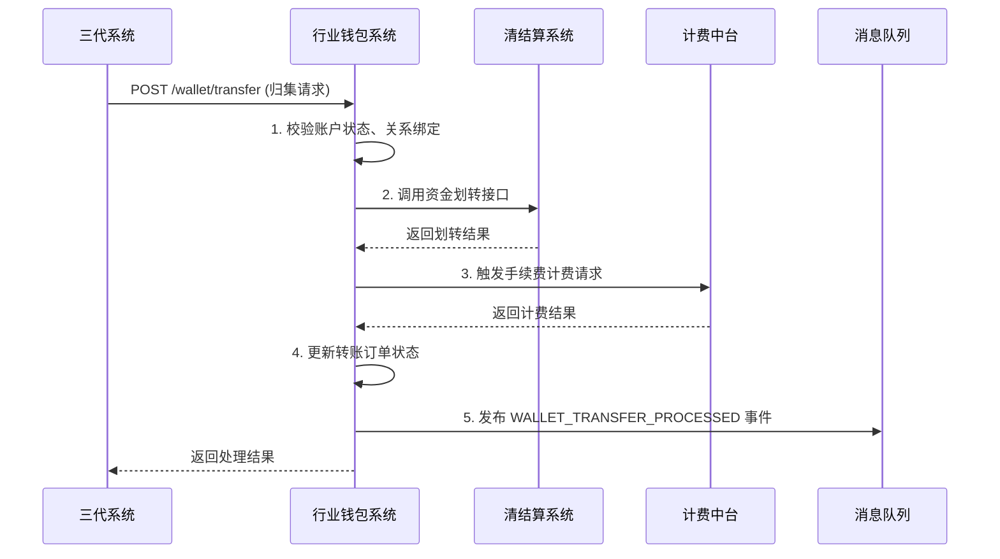

# 模块设计: 行业钱包系统

生成时间: 2026-01-21 14:39:14
批判迭代: 1

---

# 行业钱包系统模块设计文档

## 1. Overview
- **Purpose and scope**: 行业钱包系统是天财分账业务的核心业务系统，负责天财专用账户管理、关系绑定校验、分账请求处理及与各系统交互。其核心职责包括：管理天财专用账户的业务层信息、处理分账关系绑定请求、执行归集/批量付款/会员结算等分账指令、以及与清结算、对账单等系统进行资金和数据的协同。

## 2. Interface Design
- **API endpoints (REST/GraphQL)**:
    1.  `POST /api/v1/wallet/relationship/bind`: 接收并处理分账关系绑定请求。
    2.  `POST /api/v1/wallet/transfer`: 接收并处理分账转账请求（归集、批量付款、会员结算）。
    3.  `GET /api/v1/wallet/accounts/{walletAccountNo}`: 查询天财专用账户详情及状态。
    4.  `POST /api/v1/wallet/accounts/{walletAccountNo}/withdraw-cards`: 绑定或设置默认提现卡（用于天财接收方账户）。
    5.  `PUT /api/v1/wallet/accounts/{walletAccountNo}/status`: 更新账户业务状态（如暂停/恢复分账能力）。
- **Request/response structures**:
    - **关系绑定请求 (`POST /api/v1/wallet/relationship/bind`)**:
        ```json
        {
          "requestId": "string, 请求唯一标识",
          "payerWalletAccountNo": "string, 付方天财钱包账户号",
          "payeeWalletAccountNo": "string, 收方天财钱包账户号",
          "scene": "string, 业务场景 (COLLECTION/BATCH_PAYMENT/MEMBER_SETTLEMENT)",
          "feeBearer": "string, 手续费承担方 (PAYER/PAYEE)",
          "contractId": "string, 电子签约协议ID"
        }
        ```
    - **分账转账请求 (`POST /api/v1/wallet/transfer`)**:
        ```json
        {
          "requestId": "string, 请求唯一标识",
          "payerWalletAccountNo": "string, 付方天财钱包账户号",
          "payeeWalletAccountNo": "string, 收方天财钱包账户号",
          "scene": "string, 业务场景",
          "amount": "number, 金额",
          "currency": "string, 币种",
          "purpose": "string, 资金用途",
          "remark": "string, 备注"
        }
        ```
    - **绑定提现卡请求 (`POST /api/v1/wallet/accounts/{walletAccountNo}/withdraw-cards`)**:
        ```json
        {
          "operation": "string, 操作 (BIND/SET_DEFAULT)",
          "bankCardNo": "string, 银行卡号 (BIND时必填)",
          "bankCardId": "string, 已绑定银行卡ID (SET_DEFAULT时必填)"
        }
        ```
- **Published/consumed events (if any)**:
    - **Published Event**: `WALLET_TRANSFER_PROCESSED`
        - 当分账转账（归集、批量付款、会员结算）请求处理完成后发布（无论成功或失败）。
        - Payload: `{ "requestId": "string", "transferId": "string", "payerAccountNo": "string", "payeeAccountNo": "string", "amount": "number", "scene": "string", "status": "string", "completionTime": "timestamp" }`
    - **Published Event**: `RELATIONSHIP_BINDING_SYNC`
        - 当关系绑定在钱包系统侧成功创建或更新后发布。
        - Payload: `{ "relationshipId": "string", "payerWalletAccountNo": "string", "payeeWalletAccountNo": "string", "scene": "string", "status": "string" }`
    - **Consumed Event**: `ACCOUNT_CREATED`
        - 消费账户系统发布的事件，用于在钱包系统创建或更新对应的天财专用账户业务层信息。
    - **Consumed Event**: `MERCHANT_SETTLEMENT_MODE_UPDATED`
        - 消费三代系统发布的事件，用于更新对应商户天财账户的结算模式信息。

## 3. Data Model
- **Tables/collections**:
    1.  `wallet_account`: 存储天财专用账户的业务层信息。
    2.  `wallet_relationship`: 存储分账关系绑定记录。
    3.  `wallet_withdraw_card`: 存储天财接收方账户绑定的提现银行卡。
    4.  `wallet_transfer_order`: 存储分账转账指令记录。
- **Key fields**:
    - `wallet_account` 表:
        - `id` (PK): 主键。
        - `wallet_account_no` (UK): 行业钱包账户号，与账户系统一致。
        - `merchant_id`: 关联商户ID。
        - `merchant_type`: 商户类型。
        - `account_status`: 账户业务状态 (`NORMAL`, `SUSPENDED`)。
        - `settlement_mode`: 结算模式 (`ACTIVE`, `PASSIVE`)。
        - `is_tiancai_special`: 是否天财专用账户标记。
        - `created_at`, `updated_at`: 时间戳。
    - `wallet_relationship` 表:
        - `id` (PK): 主键，关系ID。
        - `payer_wallet_account_no`: 付方钱包账户号。
        - `payee_wallet_account_no`: 收方钱包账户号。
        - `scene`: 业务场景。
        - `fee_bearer`: 手续费承担方。
        - `contract_id`: 电子签约协议ID。
        - `status`: 绑定状态 (`ACTIVE`, `INACTIVE`)。
        - `created_at`, `updated_at`: 时间戳。
    - `wallet_withdraw_card` 表:
        - `id` (PK): 主键。
        - `wallet_account_no`: 关联的钱包账户号。
        - `bank_card_no`: 银行卡号 (加密存储)。
        - `bank_name`: 银行名称。
        - `is_default`: 是否默认提现卡。
        - `status`: 状态 (`VALID`, `INVALID`)。
    - `wallet_transfer_order` 表:
        - `id` (PK): 主键。
        - `transfer_id` (UK): 转账流水号。
        - `request_id`: 上游请求ID。
        - `payer_wallet_account_no`: 付方账户号。
        - `payee_wallet_account_no`: 收方账户号。
        - `scene`: 业务场景。
        - `amount`: 金额。
        - `purpose`: 资金用途。
        - `status`: 处理状态 (`PROCESSING`, `SUCCESS`, `FAILED`)。
        - `completion_time`: 完成时间。
        - `created_at`: 创建时间。
- **Relationships with other modules**:
    - 消费**账户系统**的事件，同步天财专用账户基础信息。
    - 消费**三代系统**的事件，同步结算模式信息；接收其调用的关系绑定和分账请求。
    - 与**清结算系统**交互，处理资金结算、账户冻结请求、获取退货账户信息。
    - 与**计费中台**交互，触发转账手续费计费。
    - 与**对账单系统**交互，提供分账、提款等对账数据。
    - 与**业务核心系统**交互，同步交易记录（可能通过事件或接口）。

## 4. Business Logic
- **Core workflows / algorithms**:
    1.  **账户信息同步与维护**: 监听账户系统的 `ACCOUNT_CREATED` 事件，在本地创建或更新 `wallet_account` 记录。监听三代系统的 `MERCHANT_SETTLEMENT_MODE_UPDATED` 事件，更新对应账户的结算模式。
    2.  **分账关系绑定处理**: 接收三代系统的绑定请求，校验付方和收方账户是否存在、状态是否正常、是否已存在冲突绑定。校验通过后，持久化绑定关系，并发布 `RELATIONSHIP_BINDING_SYNC` 事件。
    3.  **分账转账处理**:
        - **归集**: 资金从门店（付方）的天财收款账户转到总部（收方）的天财收款账户。
        - **批量付款**: 资金从总部（付方）的天财收款账户转到供应商等（收方）的天财接收方账户。
        - **会员结算**: 资金从总部（付方）的天财收款账户转到门店（收方）的天财收款账户。
        - 处理流程：校验关系绑定有效性、账户状态、余额/额度；调用清结算系统进行资金划转；调用计费中台计费；更新订单状态并发布事件。
    4.  **天财接收方账户管理**: 提供接口为天财接收方账户绑定多张银行卡，并设置其中一张为默认提现卡，用于资金提现。
- **Business rules and validations**:
    - 关系绑定时，付方和收方账户必须都是已标记的天财专用账户 (`is_tiancai_special=true`)。
    - 发起分账转账前，必须存在对应场景下状态为 `ACTIVE` 的关系绑定。
    - 批量付款和会员结算场景下，需校验付方是否已完成"开通付款"的额外签约认证（可通过检查关系绑定中的协议ID或特定标识实现）。
    - 归集场景下，付方（门店）的结算模式必须为主动结算 (`ACTIVE`)。
    - 资金用途 (`purpose`) 必须符合预定义的业务场景（如品牌费、供应商付款、会员结算），影响与清结算系统的交互协议。
    - 天财接收方账户可绑定多张银行卡，但有且只有一张默认提现卡。
- **Key edge cases**:
    - **事件消费顺序**: `ACCOUNT_CREATED` 事件可能早于或晚于三代系统发起的业务请求。需处理账户信息尚未同步时的请求，可返回"账户不存在"或采用异步补偿。
    - **关系绑定冲突**: 同一付方、收方、场景下已存在有效绑定，应拒绝新绑定或进行覆盖更新（需业务规则明确）。
    - **分账时资金不足**: 付方账户余额或可用额度不足，转账订单标记为失败，并返回明确错误。
    - **清结算处理超时或失败**: 调用清结算系统划转资金时发生超时或明确失败，需有重试机制，并最终将订单置为失败，发布事件。
    - **状态不一致**: 定期与账户系统、三代系统对账，确保账户、关系状态一致。

## 5. Sequence Diagrams

### 5.1 分账转账（以归集为例）处理流程


## 6. Error Handling
- **Expected error cases**:
    1.  `ACCOUNT_NOT_FOUND`: 指定的付方或收方天财账户在钱包系统中不存在。
    2.  `ACCOUNT_SUSPENDED`: 账户业务状态为暂停，无法进行绑定或交易。
    3.  `RELATIONSHIP_NOT_FOUND_OR_INACTIVE`: 分账转账时，对应的有效关系绑定不存在。
    4.  `INSUFFICIENT_BALANCE`: 付方账户余额不足。
    5.  `SETTLEMENT_SERVICE_FAILED`: 清结算系统服务调用失败或返回业务失败。
    6.  `DUPLICATE_REQUEST_ID`: 重复的请求ID。
    7.  `INVALID_WITHDRAW_CARD_OPERATION`: 提现卡操作非法（如设置非本账户的卡为默认卡）。
- **Handling strategies**:
    - **业务校验错误** (`ACCOUNT_NOT_FOUND`, `RELATIONSHIP_NOT_FOUND`): 直接返回错误，由上游系统处理。
    - **资金不足错误** (`INSUFFICIENT_BALANCE`): 返回明确错误，交易失败，不进行重试。
    - **外部依赖业务失败** (`SETTLEMENT_SERVICE_FAILED` 包含业务规则拒绝): 返回具体的业务错误原因，交易失败。
    - **外部依赖系统异常** (`SETTLEMENT_SERVICE_FAILED` 系统超时或故障): 进行有限次数的重试（需考虑幂等性），若最终失败则将订单标记为系统失败，发布事件，并触发告警以便人工介入。
    - **幂等性处理**: 对所有写操作（绑定、转账）基于 `requestId` 实现幂等，避免重复处理。

## 7. Dependencies
- **上游模块**:
    - **账户系统**: 消费其 `ACCOUNT_CREATED` 事件，作为天财专用账户信息的权威来源。
    - **三代系统**: 接收其发起的 `关系绑定` 和 `分账转账` 请求；消费其 `MERCHANT_SETTLEMENT_MODE_UPDATED` 事件。
- **下游模块**:
    - **清结算系统**: 调用其接口完成实际的资金划转、查询退货账户、处理账户冻结请求。
    - **计费中台**: 调用其接口触发转账手续费的计费处理。
    - **对账单系统**: 为其提供分账、提款等业务对账数据（可能通过文件或接口）。
    - **业务核心系统**: 通过发布 `WALLET_TRANSFER_PROCESSED` 事件或直接调用接口，同步交易记录。
    - **消息队列**: 用于发布事件，实现与下游系统的异步解耦。