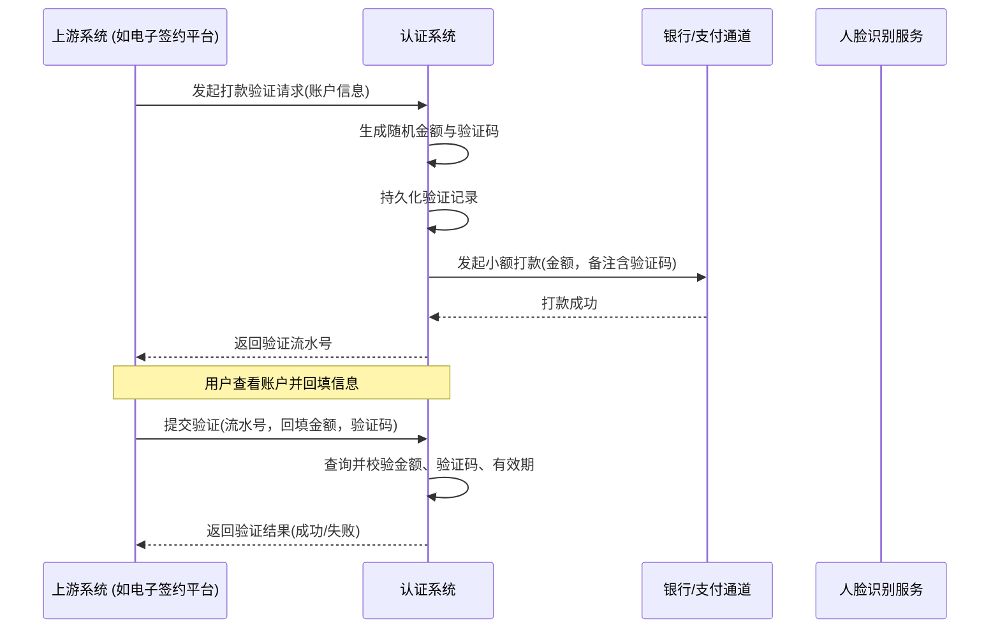
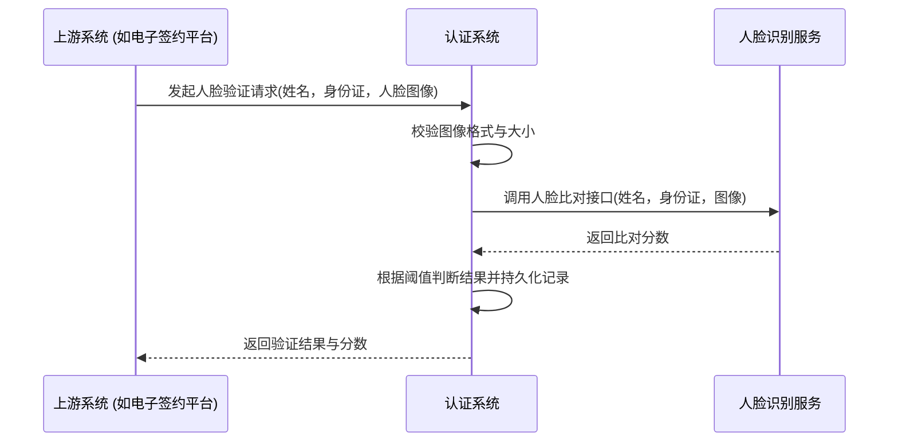

# 模块设计: 认证系统

生成时间: 2026-01-21 14:37:58
批判迭代: 2

---

# 认证系统 模块设计文档

## 1. Overview
- **Purpose and scope**: 认证系统负责提供打款验证和人脸验证接口，进行身份核验。其核心目的是通过小额打款或人脸比对的方式，确认账户信息有效性或接收方身份一致性，为关系绑定、开通付款等业务流程提供身份认证能力。

## 2. Interface Design
- **API endpoints (REST/GraphQL) if applicable**:
    1. `POST /api/v1/auth/payment-verification`: 发起打款验证。
    2. `POST /api/v1/auth/payment-verification/confirm`: 确认打款验证。
    3. `POST /api/v1/auth/face-verification`: 发起人脸验证。
- **Request/response structures (if known)**:
    - `POST /api/v1/auth/payment-verification`:
        - Request: `{ "account_number": "string", "account_name": "string", "bank_code": "string", "biz_scene": "string", "biz_id": "string" }`
        - Response: `{ "verification_id": "string", "status": "PENDING" }`
    - `POST /api/v1/auth/payment-verification/confirm`:
        - Request: `{ "verification_id": "string", "amount": "decimal", "remark_code": "string" }`
        - Response: `{ "status": "SUCCESS/FAILED" }`
    - `POST /api/v1/auth/face-verification`:
        - Request: `{ "name": "string", "id_number": "string", "face_image": "base64_string", "biz_scene": "string", "biz_id": "string" }`
        - Response: `{ "verification_id": "string", "status": "SUCCESS/FAILED", "score": "decimal" }`
- **Published/consumed events (if any)**: TBD

## 3. Data Model
- **Tables/collections**:
    1. `payment_verification_records`: 存储打款验证记录。
    2. `face_verification_records`: 存储人脸验证记录。
- **Key fields (only if present in context; otherwise TBD)**:
    - `payment_verification_records`: `id`, `verification_id`, `account_number`, `account_name`, `bank_code`, `amount`, `remark_code`, `status`, `biz_scene`, `biz_id`, `expires_at`, `created_at`, `updated_at`
    - `face_verification_records`: `id`, `verification_id`, `name`, `id_number`, `face_image_hash`, `status`, `score`, `biz_scene`, `biz_id`, `created_at`
- **Relationships with other modules**: 认证系统为电子签约平台、行业钱包系统等上游模块提供身份核验服务接口。

## 4. Business Logic
- **Core workflows / algorithms**:
    1. **打款验证流程**:
        - 接收认证请求，验证必要参数。
        - 生成一个在0.01元至1.00元之间的随机金额（保留两位小数）和一个6位数字验证码。
        - 将验证记录（含金额、验证码、状态、过期时间）持久化到`payment_verification_records`表。
        - 调用银行/支付通道接口，发起一笔包含该随机金额和验证码备注的打款。
        - 返回验证流水号(`verification_id`)给调用方。
        - 等待用户回填信息。收到确认请求后，根据`verification_id`查询记录，比对回填金额和验证码是否完全匹配，且请求在有效期内（如5分钟）。验证通过则更新状态为成功，否则为失败。
    2. **人脸验证流程**:
        - 接收包含姓名、身份证号和人脸图像（Base64编码）的请求。
        - 对图像进行基本校验（格式、大小）。
        - 调用底层人脸识别服务的比对接口，传入姓名、身份证号和图像。
        - 接收比对服务返回的相似度分数。
        - 根据预设阈值（如0.8）判断是否通过。将请求、结果和分数持久化到`face_verification_records`表。
        - 返回验证结果。
- **Business rules and validations**:
    1. 打款验证的金额需为随机生成（0.01-1.00元），且验证记录在5分钟内有效。
    2. 人脸验证需确保姓名、身份证号与人脸信息属于同一自然人，比对分数需达到预设阈值。
    3. 同一业务ID(`biz_id`)在一定时间内对同一验证类型有尝试次数限制。
- **Key edge cases**:
    1. 打款验证时，用户多次输错金额或超时未验证的处理：记录失败次数，达到上限（如3次）则锁定该验证记录，需重新发起。
    2. 人脸验证时，图像质量差、非活体攻击或信息不匹配的处理：返回具体的错误码，并可能触发风险标记。

## 5. Sequence Diagrams

## 6. Error Handling
- **Expected error cases**:
    1. 打款验证：打款失败（账户异常、余额不足）、验证信息不匹配、验证超时、尝试次数超限。
    2. 人脸验证：图像解析失败、人脸比对分数低于阈值、身份信息查询失败、活体检测未通过。
- **Handling strategies**:
    1. 对可重试的错误（如网络超时、下游服务暂时不可用）进行有限次重试（最多3次，指数退避）。
    2. 验证失败时，返回明确的错误码（如`PAYMENT_FAILED`, `FACE_MATCH_LOW_SCORE`, `VERIFICATION_EXPIRED`, `ATTEMPTS_EXCEEDED`）和提示信息，并记录失败日志。
    3. 对于疑似欺诈行为（如同一账户短时间内多次验证失败），在验证记录中标记风险等级，并可能通知上游系统。

## 7. Dependencies
- **How this module interacts with upstream/downstream modules**:
    1. **上游调用方**: 电子签约平台在签约流程中调用认证系统进行打款验证或人脸验证。行业钱包系统在关系绑定、开通付款等流程中作为客户端调用认证系统。
    2. **下游依赖**: 依赖银行或支付通道执行小额打款操作。依赖底层的人脸识别服务进行人脸比对。