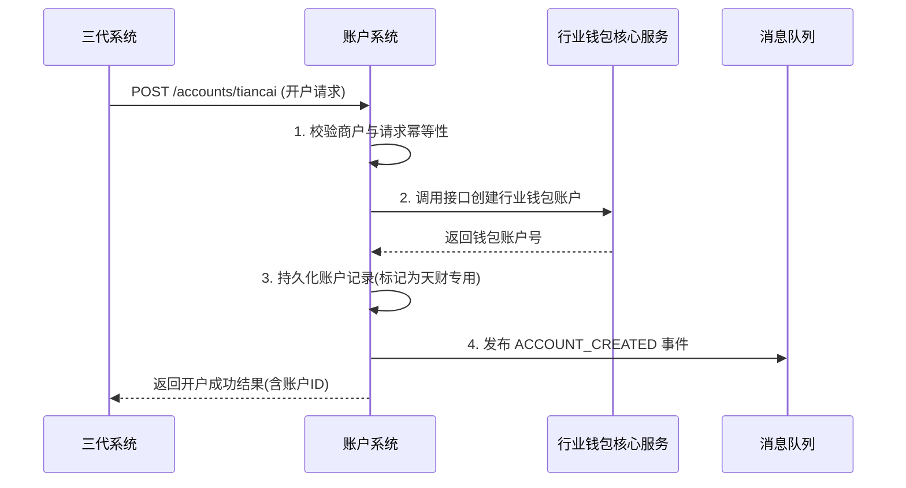
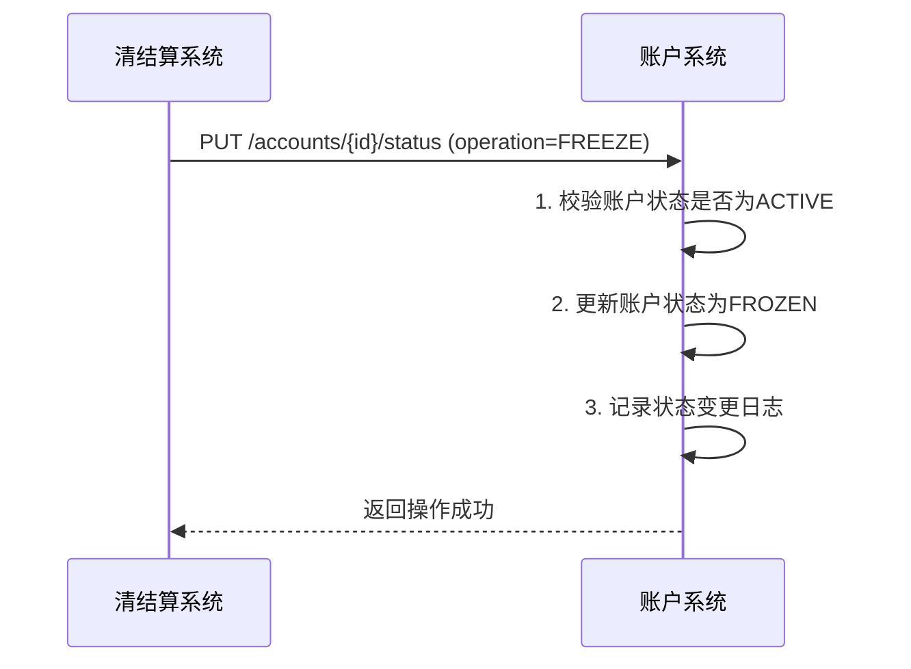

# 模块设计: 账户系统

生成时间: 2026-01-21 14:37:49
批判迭代: 2

---

# 账户系统模块设计文档

## 1. Overview
- **Purpose and scope**: 账户系统是底层账户服务系统，负责开立和标记天财专用账户，控制账户能力。其核心职责是为天财分账业务提供专用的行业钱包账户（非小微钱包）的创建、标识和管理功能。

## 2. Interface Design
- **API endpoints (REST/GraphQL)**:
    1.  `POST /api/v1/accounts/tiancai`: 开立天财专用账户。
    2.  `POST /api/v1/accounts/{accountId}/tags`: 为账户添加标记。
    3.  `PUT /api/v1/accounts/{accountId}/status`: 更新账户状态（如冻结/解冻）。
    4.  `GET /api/v1/accounts/{accountId}`: 查询账户详情。
- **Request/response structures**:
    - **开立账户请求 (`POST /api/v1/accounts/tiancai`)**:
        ```json
        {
          "requestId": "string, 请求唯一标识",
          "merchantId": "string, 商户ID",
          "merchantType": "string, 商户类型 (HEADQUARTERS/STORE)",
          "businessSource": "string, 业务来源 (e.g., THIRD_GENERATION_SYSTEM)"
        }
        ```
    - **开立账户响应**:
        ```json
        {
          "code": "string, 响应码",
          "message": "string, 响应信息",
          "data": {
            "accountId": "string, 账户系统唯一账户ID",
            "walletAccountNo": "string, 行业钱包账户号",
            "status": "string, 账户状态"
          }
        }
        ```
    - **更新账户状态请求 (`PUT /api/v1/accounts/{accountId}/status`)**:
        ```json
        {
          "operation": "string, 操作类型 (FREEZE/UNFREEZE)",
          "reason": "string, 操作原因",
          "requestSource": "string, 请求来源系统 (e.g., SETTLEMENT_SYSTEM)"
        }
        ```
- **Published/consumed events (if any)**:
    - **Published Event**: `ACCOUNT_CREATED`
        - 当成功开立并标记天财专用账户后发布。
        - Payload: `{ "accountId": "string", "merchantId": "string", "accountType": "INDUSTRY_WALLET", "tag": "TIANCAI_SPECIAL" }`
    - **Consumed Event**: TBD

## 3. Data Model
- **Tables/collections**:
    1.  `tiancai_account`: 存储天财专用账户核心信息。
    2.  `account_status_log`: 记录账户状态变更历史。
- **Key fields**:
    - `tiancai_account` 表:
        - `id` (PK): 主键，账户系统内部ID。
        - `account_no`: 账户系统生成的账户号。
        - `wallet_account_no`: 对应的行业钱包系统账户号。
        - `merchant_id`: 商户ID。
        - `merchant_type`: 商户类型 (总部/门店)。
        - `account_type`: 账户类型 (固定为 `INDUSTRY_WALLET`)。
        - `status`: 账户状态 (`ACTIVE`, `FROZEN`, `CLOSED`)。
        - `tag`: 账户标记 (固定为 `TIANCAI_SPECIAL`)。
        - `created_at`, `updated_at`: 时间戳。
    - `account_status_log` 表:
        - `id` (PK): 主键。
        - `account_id`: 关联的账户ID。
        - `old_status`: 原状态。
        - `new_status`: 新状态。
        - `operation`: 操作类型。
        - `operator`: 操作者/系统。
        - `reason`: 原因。
        - `created_at`: 操作时间。
- **Relationships with other modules**:
    - 为**行业钱包系统**提供天财专用账户的底层账户服务。
    - 接收**三代系统**的开户接口调用，开立天财专用账户。
    - 与**清结算系统**交互，支持专用账户的冻结操作。

## 4. Business Logic
- **Core workflows / algorithms**:
    1.  **账户开立**: 根据三代系统的请求，为收单商户开立类型为行业钱包的"天财专用账户"。
        - 调用底层账户服务创建行业钱包账户。
        - 在账户记录中设置 `account_type='INDUSTRY_WALLET'` 和 `tag='TIANCAI_SPECIAL'`。
        - 发布 `ACCOUNT_CREATED` 事件。
    2.  **账户标记**: 对开立的专用账户进行特殊标记，以标识其用于天财分账业务。
        - 标记在开户流程中自动完成，作为账户的一个固有属性。
    3.  **能力控制**: 管理账户的基础能力，如状态（正常、冻结）、交易权限等。
        - 提供冻结/解冻接口，供清结算等系统调用。
        - 状态变更时记录审计日志。
- **Business rules and validations**:
    - 天财专用账户必须为行业钱包类型，而非小微钱包。
    - 账户开立需关联到正确的商户（总部或门店）。
    - 同一商户（在相同业务来源下）只能开立一个天财专用账户。
    - 只有状态为 `ACTIVE` 的账户才能被冻结。
    - 只有状态为 `FROZEN` 的账户才能被解冻。
- **Key edge cases**:
    - **重复开户请求**: 基于 `requestId` 和 `merchantId` 进行幂等性处理，避免创建重复账户。
    - **商户信息无效**: 调用开户请求时，若关联的商户ID不存在或状态异常，则拒绝开户。
    - **底层账户创建失败**: 若调用行业钱包底层服务失败，整个开户事务回滚，向调用方返回失败。
    - **事件发布失败**: 账户创建成功但事件发布失败，需有补偿机制（如定时任务重试）确保下游系统感知。

## 5. Sequence Diagrams

### 5.1 账户开立流程


### 5.2 账户冻结流程 (与清结算系统交互)


## 6. Error Handling
- **Expected error cases**:
    1.  `INVALID_MERCHANT`: 请求开户的商户ID不存在或状态异常。
    2.  `DUPLICATE_ACCOUNT`: 同一商户已存在天财专用账户。
    3.  `WALLET_SERVICE_UNAVAILABLE`: 底层行业钱包服务不可用或超时。
    4.  `ACCOUNT_NOT_FOUND`: 操作（如冻结）指定的账户不存在。
    5.  `INVALID_STATUS_TRANSITION`: 非法的状态变更请求（如解冻一个活跃账户）。
    6.  `DUPLICATE_REQUEST`: 重复的请求ID。
- **Handling strategies**:
    - **输入校验错误** (`INVALID_MERCHANT`, `DUPLICATE_REQUEST`): 直接返回错误，提示调用方检查请求参数。
    - **业务逻辑错误** (`DUPLICATE_ACCOUNT`, `INVALID_STATUS_TRANSITION`): 返回明确的业务错误码和描述，不进行重试。
    - **外部依赖失败** (`WALLET_SERVICE_UNAVAILABLE`): 实现重试机制（如最多3次指数退避重试），若最终失败则整体事务回滚，并触发告警。
    - **系统异常**: 捕获未预期异常，记录详细日志，返回通用系统错误，并触发监控告警。

## 7. Dependencies
- **上游模块**:
    - **三代系统**: 调用账户系统的接口发起天财专用账户的开户请求。
- **下游模块**:
    - **行业钱包系统**: 依赖账户系统开立和标记的底层账户，通过事件驱动或接口查询获取账户信息，进行业务层的账户管理和关系绑定。
    - **清结算系统**: 调用账户系统进行专用账户的冻结等控制操作。根据术语表，清结算系统负责"专用账户冻结"，此交互是合理的。