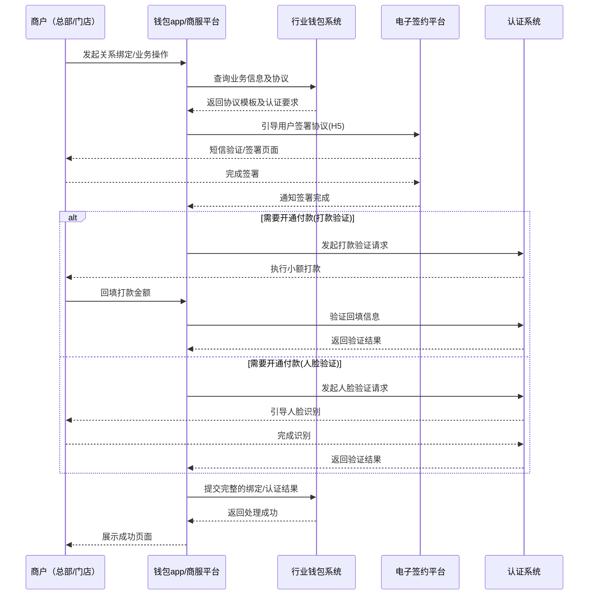

# 模块设计: 钱包app/商服平台

生成时间: 2026-01-21 14:37:49
批判迭代: 2

---

# 钱包app/商服平台 模块设计文档

## 1. Overview
- **Purpose and scope**: 本模块作为面向商户（总部、门店）的前端应用与服务平台，提供天财分账业务（归集、批量付款、会员结算）的发起、管理、查询及关系绑定等核心功能。它是行业钱包系统与商户之间的交互界面，负责业务流程的引导、数据收集与指令下发。
- **与行业钱包系统的关系**: 本模块是行业钱包系统的前端服务层。它接收商户操作指令，调用行业钱包系统的业务接口，并将处理结果呈现给商户。核心业务逻辑（如账户校验、分账处理）由行业钱包系统承载。

## 2. Interface Design
- **API endpoints (REST/GraphQL if applicable)**: TBD (由行业钱包系统定义并暴露给本模块调用)
- **Request/response structures (if known)**: TBD
- **Published/consumed events (if any)**: TBD

## 3. Data Model
- **Tables/collections**: TBD (本模块作为前端应用，主要数据模型由后端系统（如行业钱包系统、三代系统）维护。本模块可能维护用户会话、操作日志等非核心业务数据。)
- **Key fields (only if present in context; otherwise TBD)**: TBD
- **Relationships with other modules**: 本模块依赖行业钱包系统提供的业务接口。商户、账户、分账关系等核心数据模型定义在行业钱包系统、三代系统和账户系统中。

## 4. Business Logic
- **Core workflows / algorithms**:
    1.  **关系绑定流程**: 引导商户（总部或门店）完成签约认证。
        - 调用行业钱包系统接口，获取待签约关系及协议信息。
        - 引导用户通过电子签约平台完成协议签署（短信推送、H5页面）。
        - 根据业务场景（批量付款、会员结算），如需"开通付款"，则引导付方完成打款验证或人脸验证。
        - 将认证结果回调至行业钱包系统。
    2.  **归集流程**: 总部发起资金归集。
        - 总部选择门店（被归集方）及金额。
        - 调用行业钱包系统接口，校验归集关系有效性及账户状态。
        - 发起归集指令，并展示处理结果。
    3.  **批量付款/会员结算流程**: 总部发起分账。
        - 总部上传付款清单（含接收方、金额、资金用途等）。
        - 调用行业钱包系统接口，校验付款能力（是否已开通付款）、账户余额及手续费承担方。
        - 发起批量付款/会员结算指令，并展示批次处理进度及结果。
- **Business rules and validations**:
    - 发起操作前，必须校验当前登录商户身份（总部或门店）与操作权限是否匹配。
    - 归集、付款前必须确保对应的收付方"关系绑定"已完成且状态有效。
    - 批量付款、会员结算场景下，付方（总部/门店）必须额外完成"开通付款"认证。
    - 资金用途需与业务场景绑定，并在协议中明确。
- **Key edge cases**:
    - 网络中断或超时：操作指令需有明确的提交中状态，并提供结果查询与重试机制。
    - 账户状态异常（如冻结）：调用行业钱包系统接口时返回明确错误，引导用户联系客服。
    - 认证过程中用户放弃：记录中断节点，支持用户从断点继续或重新发起。

## 5. Sequence Diagrams

## 6. Error Handling
- **Expected error cases**:
    - 接口调用失败（网络超时、服务不可用）。
    - 业务校验失败（账户不存在、关系未绑定、余额不足、无操作权限）。
    - 认证失败（打款金额错误、人脸比对不通过）。
    - 用户输入数据格式错误。
- **Handling strategies**:
    - 网络类错误：前端进行友好提示，并提供"重试"按钮。
    - 业务校验错误：直接展示行业钱包系统返回的具体错误码和描述，引导用户进行正确操作（如先去完成绑定）。
    - 认证失败：明确提示失败原因，并允许用户重新发起认证流程。
    - 系统级错误：记录错误日志，展示通用错误页，提示用户稍后重试或联系技术支持。

## 7. Dependencies
- **How this module interacts with upstream/downstream modules**:
    - **上游依赖 (核心服务提供方)**:
        - **行业钱包系统**: 核心依赖。提供所有业务接口（关系绑定校验、分账请求处理等）。本模块是其主要调用方。
        - **电子签约平台**: 强依赖。用于在关系绑定流程中封装协议签署H5页面并管理签署过程。
        - **认证系统**: 强依赖。在"开通付款"环节，调用其打款验证或人脸验证接口。
    - **下游依赖 (服务使用方)**:
        - **商户（总部/门店）**: 本模块的服务对象，通过Web页面或App使用服务。
    - **数据与状态同步**: 本模块不持久化核心业务状态，所有状态通过调用行业钱包系统接口实时获取。