# DocuFlow-AI Project - 软件设计文档
生成时间: 2026-01-23 15:32:36

## 目录
1. [概述说明](#1-概述说明)
   - 1.1 [术语与缩略词](#11-术语与缩略词)
2. [系统设计](#2-系统设计)
3. [模块设计](#3-模块设计)
   - 3.1 [三代](#module-1)
   - 3.2 [行业钱包](#module-2)
   - 3.3 [账户系统](#module-3)
   - 3.4 [清结算](#module-4)
   - 3.5 [账务核心](#module-5)
   - 3.6 [电子签约平台](#module-6)
   - 3.7 [认证系统](#module-7)
   - 3.8 [计费中台](#module-8)
   - 3.9 [对账单系统](#module-9)
   - 3.10 [业务核心](#module-10)
   - 3.11 [风控](#module-11)
   - 3.12 [交易系统](#module-12)
   - 3.13 [代付系统](#module-13)
   - 3.14 [钱包APP/商服平台](#module-14)
4. [接口设计](#4-接口设计)
5. [数据库设计](#5-数据库设计)

---
# 1 概述说明

## 1.1 术语与缩略词


## 业务实体

- **天财**: 一个平台或业务方，负责发起分账、开户、转账等业务请求，与拉卡拉系统对接。
- **天财收款账户** (别名: 天财专用账户): 为收单商户开立的专用账户，用于收款、分账、转账和提现，是行业钱包类型，非小微钱包。
- **天财接收方账户** (别名: 接收方账户): 为非收单商户或个人开立的专用账户，主要用于接收分账和提现。
- **收单商户**: 通过拉卡拉进行收款交易的商户，分为总部和门店角色，需具备企业或个体资质。
- **非收单商户** (别名: 一般接收方): 不通过拉卡拉进行收款交易，但可作为分账接收方的企业、个体或个人。
- **待结算账户** (别名: 01待结算账户): 收单交易资金在清分后、结算前暂存的账户，类型为01。
- **退货账户** (别名: 04退货账户): 用于处理退货资金的账户，类型为04。
- **终点账户**: 交易结算的最终目标账户，在退货流程中用于判断扣款来源。

## 角色

- **总部** (别名: 品牌, 总店): 收单商户中的上级机构，负责归集门店资金、发起分账和批量付款。
- **门店**: 收单商户中的下级门店，资金可被总部归集，也可作为分账接收方。
- **接收方** (别名: 入账方): 分账资金的接收方，可以是天财收款账户（门店）或天财接收方账户（非收单商户/个人）。
- **三代**: 拉卡拉内部的一个系统或运营方，负责机构号分配、开户审核、关系绑定和接口调用控制。
- **行业钱包** (别名: 钱包系统): 一个系统或模块，负责用户ID生成、账户开户、关系绑定、分账请求处理和计费校验。
- **清结算** (别名: 清结算系统): 负责交易清分、结算、账户冻结、退货扣款和生成结算单的系统模块。
- **账户系统**: 底层系统，负责账户的开立、升级、余额扣减、转账执行和账户状态管理。
- **账务核心**: 负责记账分录生成和账务处理的底层核心系统。
- **风控**: 负责风险判定，可发起商户冻结和交易冻结的系统或模块。
- **电子签约平台** (别名: 电子签章系统): 负责协议模板管理、短信推送、H5页面封装、打款验证和人脸验证调用的系统。
- **计费中台**: 负责计费流水生成、手续费计算和费率信息同步的系统。
- **对账单系统**: 负责生成和提供各类账户和交易维度对账单的系统。
- **业务核心**: 负责接收和处理天财分账交易数据的系统。

## 技术术语

- **机构号**: 由三代运营分配给天财或ISV的唯一标识，用于区分不同业务机构。
- **APPID**: 由开放平台分配的应用标识，用于接口调用的身份验证。
- **主动结算**: 一种结算模式，交易资金结算到商户指定的收款账户（如天财收款账户）。
- **被动结算**: 一种结算模式，交易资金结算到默认的待结算账户。
- **净额转账**: 一种转账计费模式，手续费从转账金额中扣除，收方收到扣除手续费后的净额。
- **全额转账**: 一种转账计费模式，手续费由付方或收方额外承担，收方收到全额转账金额。

## 流程

- **分账** (别名: 天财分账, 转账): 从天财收款账户向其他天财收款账户或天财接收方账户进行资金划转的业务过程。
- **归集** (别名: 资金归集): 将多个门店的资金汇总到总部账户的业务场景。
- **会员结算**: 总部根据会员消费规则，将资金分账给门店的业务场景。
- **批量付款** (别名: 批付): 总部统一向多个外部收款方（如供应商）进行付款的业务场景。
- **关系绑定** (别名: 绑定关系): 在收付双方之间建立授权关系的过程，通常涉及协议签署和身份认证，是分账的前提。
- **开通付款**: 在批量付款和会员结算场景下，付方（总部/门店）需要额外完成的签约与认证流程，以授权付款能力。
- **打款验证**: 通过向目标银行卡打入随机金额，并要求回填正确金额来完成身份或账户有效性认证的方法。
- **人脸验证**: 通过比对姓名、身份证和人脸信息来完成个人或个体户负责人身份认证的方法。
- **商户冻结**: 风控发起的针对整个商户及其关联账户（如天财收款账户）的资金冻结流程。
- **交易冻结**: 风控发起的针对单笔已结算至天财收款账户的资金的冻结流程。
- **退货前置**: 退货处理流程中，查询终点账户和账户余额以决定扣款来源的环节。

---
# 2 系统设计
## 2.1 系统结构
系统采用分层架构，核心是业务处理与底层服务分离。上层业务模块（如三代、行业钱包、业务核心）负责处理业务流程、规则校验和状态管理。底层服务模块（如账户系统、账务核心、清结算）提供原子化的资金操作、记账和结算能力。认证、计费等中台服务提供通用能力支撑。模块间通过定义清晰的API进行同步或异步通信，确保职责清晰、松耦合。

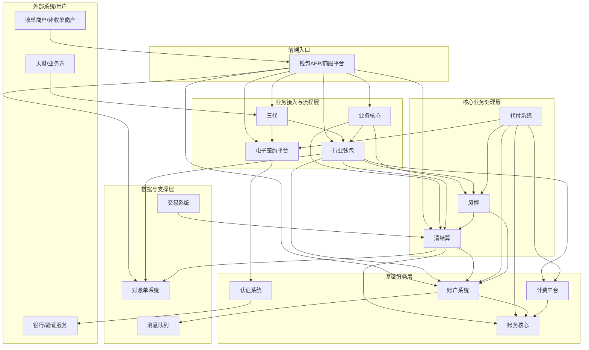
```mermaid
flowchart TD
    subgraph "外部系统/用户"
        A[天财/业务方]
        B[收单商户/非收单商户]
        C[银行/验证服务]
    end

    subgraph "业务接入与流程层"
        D[三代]
        E[业务核心]
        F[行业钱包]
        G[电子签约平台]
    end

    subgraph "核心业务处理层"
        H[清结算]
        I[代付系统]
        J[风控]
    end

    subgraph "基础服务层"
        K[账户系统]
        L[账务核心]
        M[计费中台]
        N[认证系统]
    end

    subgraph "数据与支撑层"
        O[对账单系统]
        P[交易系统]
        Q[消息队列]
    end

    subgraph "前端入口"
        R[钱包APP/商服平台]
    end

    A --> D
    B --> R
    R --> D & F & G & H & E & O & K
    D --> F & G
    E --> F & H & J
    F --> H & K & M & J & O
    G --> N
    H --> K & L & O
    I --> K & L & M & G & J
    J --> H & K
    K --> L & Q
    M --> L
    N --> C
    P --> H
```

## 2.2 功能结构
系统功能围绕天财分账业务的核心流程展开，主要包括机构与账户管理、关系绑定与认证、资金分账与结算、风险控制、以及账单服务五大功能域。每个功能域由相应的系统模块协同完成。

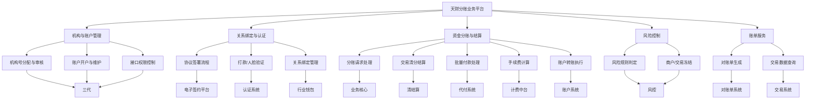
```mermaid
flowchart TD
    A[天财分账业务平台]

    A --> B1[机构与账户管理]
    A --> B2[关系绑定与认证]
    A --> B3[资金分账与结算]
    A --> B4[风险控制]
    A --> B5[账单服务]

    B1 --> C1[机构号分配与审核]
    B1 --> C2[账户开户与维护]
    B1 --> C3[接口权限控制]

    B2 --> C4[协议签署流程]
    B2 --> C5[打款/人脸验证]
    B2 --> C6[关系绑定管理]

    B3 --> C7[分账请求处理]
    B3 --> C8[交易清分结算]
    B3 --> C9[批量付款处理]
    B3 --> C10[手续费计算]
    B3 --> C11[账户转账执行]

    B4 --> C12[风险规则判定]
    B4 --> C13[商户/交易冻结]

    B5 --> C14[对账单生成]
    B5 --> C15[交易数据查询]

    C1 --> D[三代]
    C2 --> D
    C3 --> D
    C4 --> E[电子签约平台]
    C5 --> F[认证系统]
    C6 --> G[行业钱包]
    C7 --> H[业务核心]
    C8 --> I[清结算]
    C9 --> J[代付系统]
    C10 --> K[计费中台]
    C11 --> L[账户系统]
    C12 --> M[风控]
    C13 --> M
    C14 --> N[对账单系统]
    C15 --> O[交易系统]
```

## 2.3 网络拓扑图
TBD

## 2.4 数据流转
数据流转以核心业务流程驱动，主要包括开户、关系绑定、分账、结算和冻结流程。数据在模块间按顺序传递，关键状态和结果被记录并同步，确保业务状态的一致性。

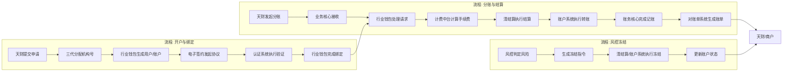
```mermaid
flowchart LR
    subgraph "流程: 开户与绑定"
        direction LR
        P1[天财提交申请] --> P2[三代分配机构号]
        P2 --> P3[行业钱包生成用户/账户]
        P3 --> P4[电子签约发起协议]
        P4 --> P5[认证系统执行验证]
        P5 --> P6[行业钱包完成绑定]
    end

    subgraph "流程: 分账与结算"
        direction LR
        Q1[天财发起分账] --> Q2[业务核心接收]
        Q2 --> Q3[行业钱包处理请求]
        Q3 --> Q4[计费中台计算手续费]
        Q4 --> Q5[清结算执行结算]
        Q5 --> Q6[账户系统执行转账]
        Q6 --> Q7[账务核心完成记账]
        Q7 --> Q8[对账单系统生成账单]
    end

    subgraph "流程: 风控冻结"
        direction LR
        R1[风控判定风险] --> R2[生成冻结指令]
        R2 --> R3[清结算/账户系统执行冻结]
        R3 --> R4[更新账户状态]
    end

    P6 --> Q3
    Q8 --> TBD[天财/商户]
    R4 --> TBD
```

## 2.5 系统模块交互关系
模块交互关系基于职责划分，形成服务调用与事件驱动的混合模式。三代作为总入口，协调开户与绑定；业务核心与行业钱包处理主要业务逻辑；底层系统提供原子操作；中台系统提供支撑能力。

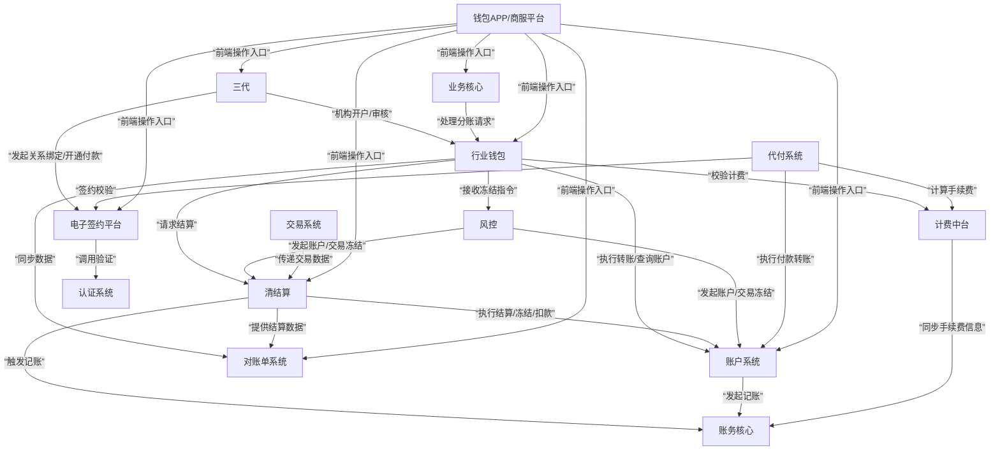
```mermaid
flowchart TD
    A[三代]
    B[业务核心]
    C[行业钱包]
    D[清结算]
    E[账户系统]
    F[账务核心]
    G[电子签约平台]
    H[认证系统]
    I[计费中台]
    J[对账单系统]
    K[风控]
    L[代付系统]
    M[交易系统]
    N[钱包APP/商服平台]

    A -- “机构开户/审核” --> C
    A -- “发起关系绑定/开通付款” --> G
    B -- “处理分账请求” --> C
    C -- “请求结算” --> D
    C -- “执行转账/查询账户” --> E
    C -- “校验计费” --> I
    C -- “同步数据” --> J
    C -- “接收冻结指令” --> K
    D -- “执行结算/冻结/扣款” --> E
    D -- “触发记账” --> F
    D -- “提供结算数据” --> J
    E -- “发起记账” --> F
    G -- “调用验证” --> H
    I -- “同步手续费信息” --> F
    K -- “发起账户/交易冻结” --> D & E
    L -- “执行付款转账” --> E
    L -- “计算手续费” --> I
    L -- “签约校验” --> G
    M -- “传递交易数据” --> D
    N -- “前端操作入口” --> A & C & G & D & B & J & E
```
---
# 3 模块设计

<a id="module-1"></a>

## 3.1 三代


### 1. 概述
- **目的与范围**: 本模块是拉卡拉内部的一个系统或运营方，负责机构号分配、开户审核、关系绑定和接口调用控制。它是连接外部业务方（天财）与内部各系统（如行业钱包、清结算等）的枢纽，负责业务准入、权限控制和流程协调。
- **运营模式**: 三代是一个自动化系统，提供API供外部调用，并配备内部运营管理后台用于人工审核、配置与监控。核心业务流程（如接口鉴权、机构号生成）为自动化，部分审核环节（如开户资质审核）支持人工介入。

### 2. 接口设计
- **API端点 (REST/GraphQL)**:
    - `POST /api/v1/institution/create`: 接收天财提交的机构开户申请。
    - `POST /api/v1/audit/submit`: 提交业务审核（开户、关系绑定）。
    - `GET /api/v1/audit/result/{auditNo}`: 查询审核结果。
    - `POST /api/v1/auth/validate`: （内部）接口调用鉴权验证。
    - `GET /api/v1/institution/{institutionId}/permissions`: 查询机构接口权限。
- **请求/响应结构**:
    - `/api/v1/institution/create` 请求: `{ "appId": "string", "businessName": "string", "contactInfo": "TBD", "qualificationDocs": "TBD" }`
    - `/api/v1/institution/create` 响应: `{ "code": "string", "message": "string", "data": { "institutionId": "string", "status": "PENDING_AUDIT" } }`
    - `/api/v1/auth/validate` 请求: `{ "institutionId": "string", "appId": "string", "apiPath": "string", "httpMethod": "string" }`
    - `/api/v1/auth/validate` 响应: `{ "isAllowed": boolean, "reason": "string" }`
- **发布/消费的事件**:
    - 发布事件: `InstitutionCreated`, `AuditCompleted`, `InstitutionStatusChanged`。
    - 消费事件: TBD。

### 3. 数据模型
- **表/集合**:
    1.  `机构信息表 (institution_info)`:
        - `机构号 (institution_id)`: VARCHAR(32)， PRIMARY KEY， 唯一标识。
        - `机构名称 (name)`: VARCHAR(128)， NOT NULL。
        - `业务方类型 (business_type)`: VARCHAR(32)， 如 `TIANCAI`。
        - `关联APPID (app_id)`: VARCHAR(64)， NOT NULL， FOREIGN KEY (app_auth表)。
        - `状态 (status)`: ENUM('PENDING_AUDIT', 'ACTIVE', 'SUSPENDED', 'CLOSED')， NOT NULL。
        - `创建时间 (created_at)`: DATETIME， NOT NULL。
        - `更新时间 (updated_at)`: DATETIME。
        - **索引**: `idx_app_id` ON (`app_id`), `idx_status` ON (`status`)。
    2.  `接口权限表 (api_permission)`:
        - `id`: BIGINT， PRIMARY KEY， AUTO_INCREMENT。
        - `机构号 (institution_id)`: VARCHAR(32)， NOT NULL， FOREIGN KEY (institution_info表)。
        - `接口标识 (api_identifier)`: VARCHAR(255)， NOT NULL (如 `wallet.account.create`)。
        - `权限状态 (permission_status)`: ENUM('GRANTED', 'REVOKED')， DEFAULT 'GRANTED'。
        - `生效时间 (effective_from)`: DATETIME。
        - `失效时间 (effective_to)`: DATETIME。
        - **索引**: `idx_institution_api` ON (`institution_id`, `api_identifier`)。
    3.  `审核记录表 (audit_record)`:
        - `审核流水号 (audit_no)`: VARCHAR(64)， PRIMARY KEY。
        - `业务类型 (business_type)`: ENUM('INSTITUTION_CREATE', 'ACCOUNT_OPEN', 'RELATION_BIND')， NOT NULL。
        - `关联业务ID (ref_business_id)`: VARCHAR(128)， NOT NULL (如机构号、账户申请ID)。
        - `审核状态 (audit_status)`: ENUM('PENDING', 'APPROVED', 'REJECTED')， NOT NULL。
        - `审核意见 (comment)`: TEXT。
        - `审核人 (auditor)`: VARCHAR(64) (人工审核时填写)。
        - `审核时间 (audit_time)`: DATETIME。
        - `创建时间 (created_at)`: DATETIME， NOT NULL。
        - **索引**: `idx_ref_business` ON (`business_type`, `ref_business_id`), `idx_status` ON (`audit_status`)。
    4.  `APP授权表 (app_auth)`:
        - `APPID (app_id)`: VARCHAR(64)， PRIMARY KEY。
        - `关联机构号 (institution_id)`: VARCHAR(32)， NOT NULL， FOREIGN KEY (institution_info表)。
        - `密钥 (secret_key)`: VARCHAR(256)， NOT NULL (加密存储)。
        - `状态 (status)`: ENUM('ACTIVE', 'INACTIVE')， NOT NULL。
        - `创建时间 (created_at)`: DATETIME， NOT NULL。
- **与其他模块的关系**:
    - 通过`机构号`与行业钱包、清结算等模块的业务数据关联。
    - 审核记录与账户系统、电子签约平台的业务申请相关联。

### 4. 业务逻辑
- **核心工作流/算法**:
    1.  **机构号分配**:
        - **触发**: 天财通过`/api/v1/institution/create`提交申请。
        - **生成逻辑**: 采用`TC`(前缀) + `YYMMDD`(日期) + `7位递增序列`的规则生成唯一机构号（如`TC2401010000001`）。序列号通过分布式序列生成器保证集群内唯一。
        - **持久化**: 生成后，与申请信息一并存入`机构信息表`，状态为`PENDING_AUDIT`。
    2.  **开户审核**:
        - **接收请求**: 接收行业钱包转发的开户请求（针对天财收款账户/接收方账户）。
        - **审核内容**: 校验关联的机构号状态是否为`ACTIVE`；根据预设的商户资质规则（如营业执照、法人信息完备性）进行自动化校验，或流转至人工审核台。
        - **电子签约集成**: 对于需要协议签署的开户场景（如企业账户），审核通过后，调用**电子签约平台**的协议签署接口，生成签署链接或触发短信推送。开户流程的最终完成以协议签署成功为前提。
        - **结果通知**: 将审核结果（通过/驳回）及原因通知行业钱包。
    3.  **关系绑定控制**:
        - 在收付双方（如总部与门店）发起关系绑定时，校验双方账户状态及所属机构权限，控制流程的发起。必要时，触发涉及**电子签约平台**的协议签署流程。
    4.  **接口调用鉴权**:
        - **拦截**: 作为网关或拦截器，拦截所有来自天财的API请求。
        - **校验步骤**:
            a. 解析请求头或参数中的`机构号(institutionId)`和`APPID`。
            b. 查询`app_auth`表，验证`APPID`与`机构号`的绑定关系及状态。
            c. 查询`api_permission`表，验证该`机构号`对目标接口（`api_identifier`）是否有`GRANTED`权限且在有效期内。
            d. 若机构在`机构信息表`中状态非`ACTIVE`，直接拒绝。
        - **决策**: 所有校验通过则放行，任一失败则立即拒绝并返回具体错误码。
- **业务规则与验证**:
    - 一个业务方（天财）通过一个`APPID`仅能绑定一个状态为`ACTIVE`的机构号。
    - 接口调用必须携带有效的机构号和APPID，且该机构号在`接口权限表`中拥有对应接口的调用权限。
    - 开户审核需根据预设的商户资质规则进行校验。
- **关键边界情况处理**:
    - 机构号被禁用后，其所有接口调用应立即被拒绝。
    - 审核驳回时，需明确驳回原因并通知上游业务模块。

### 5. 时序图

#### 5.1 机构开户与审核时序图
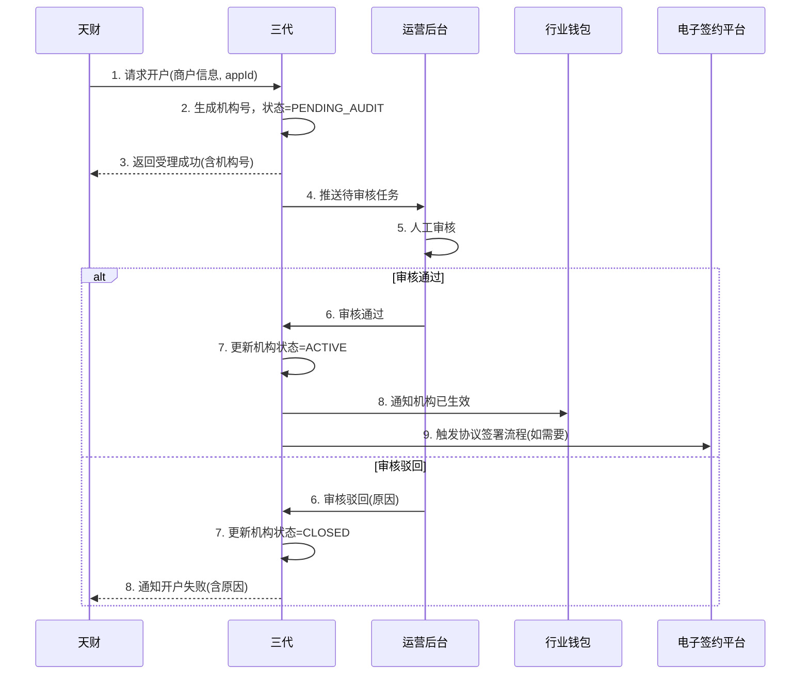
```mermaid
sequenceDiagram
    participant 天财
    participant 三代
    participant 运营后台
    participant 行业钱包
    participant 电子签约平台

    天财->>三代: 1. 请求开户(商户信息, appId)
    三代->>三代: 2. 生成机构号，状态=PENDING_AUDIT
    三代-->>天财: 3. 返回受理成功(含机构号)
    
    三代->>运营后台: 4. 推送待审核任务
    运营后台->>运营后台: 5. 人工审核
    alt 审核通过
        运营后台->>三代: 6. 审核通过
        三代->>三代: 7. 更新机构状态=ACTIVE
        三代->>行业钱包: 8. 通知机构已生效
        三代->>电子签约平台: 9. 触发协议签署流程(如需要)
    else 审核驳回
        运营后台->>三代: 6. 审核驳回(原因)
        三代->>三代: 7. 更新机构状态=CLOSED
        三代-->>天财: 8. 通知开户失败(含原因)
    end
```

#### 5.2 接口调用鉴权时序图
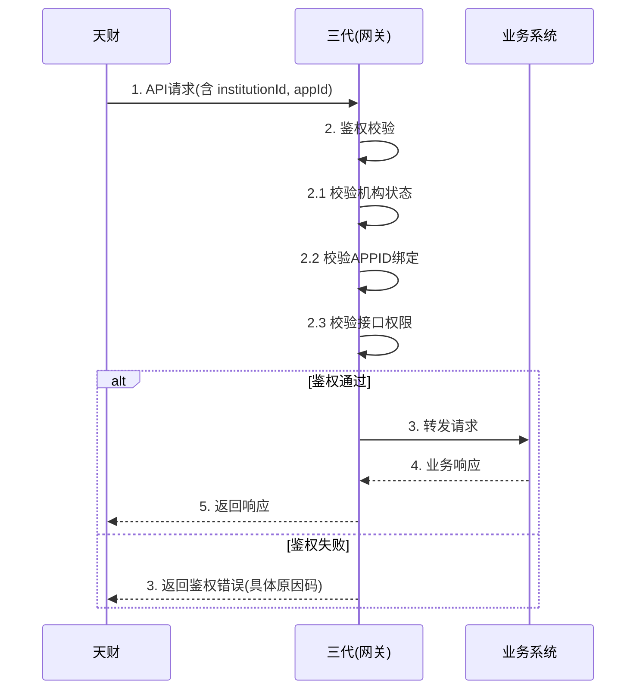
```mermaid
sequenceDiagram
    participant 天财
    participant 三代(网关)
    participant 业务系统

    天财->>三代(网关): 1. API请求(含 institutionId, appId)
    三代(网关)->>三代(网关): 2. 鉴权校验
    三代(网关)->>三代(网关): 2.1 校验机构状态
    三代(网关)->>三代(网关): 2.2 校验APPID绑定
    三代(网关)->>三代(网关): 2.3 校验接口权限
    alt 鉴权通过
        三代(网关)->>业务系统: 3. 转发请求
        业务系统-->>三代(网关): 4. 业务响应
        三代(网关)-->>天财: 5. 返回响应
    else 鉴权失败
        三代(网关)-->>天财: 3. 返回鉴权错误(具体原因码)
    end
```

### 6. 错误处理
- **预期错误情况**:
    1.  无效的机构号或APPID。
    2.  接口调用权限不足。
    3.  开户申请信息不完整或不符合资质要求。
    4.  系统内部处理超时或失败（如数据库连接失败、下游服务不可用）。
- **处理策略**:
    - **权限类错误（1，2）**: 直接返回明确的鉴权失败错误码（如`AUTH_1001`, `AUTH_1002`），阻止请求继续，并记录安全日志。
    - **业务规则错误（3）**: 在审核环节驳回，通过审核记录保存具体原因，并同步通知上游调用方。
    - **系统错误（4）**:
        - **重试机制**: 对于非幂等的写操作（如开户申请），依赖上游重试；对于内部可重试调用（如查询权限），采用带退避策略的有限次重试。
        - **降级/熔断**: 对依赖的下游服务（如数据库、电子签约平台）设置熔断器，防止级联故障。在熔断期间，可根据场景返回默认值（如查询时）或快速失败（如审核时）。
        - **告警机制**: 监控系统错误率、延迟和熔断状态。当错误率超过阈值或发生熔断时，实时触发告警（短信、钉钉、邮件）至运维与开发人员。
        - **事务与补偿**: 关键业务流程（如机构状态变更）保证本地事务。涉及多个系统的分布式操作，记录详细操作日志，便于人工介入补偿。

### 7. 依赖关系
- **上游模块**: 天财（业务请求方）。
- **下游模块**: 行业钱包（转发开户、绑定请求）、清结算（可能传递机构信息）、账户系统（间接通过行业钱包依赖）、电子签约平台（协议签署）。
- **内部依赖**: 数据库、分布式序列服务、配置中心、监控告警系统。

<a id="module-2"></a>

## 3.2 行业钱包


### 1. 概述
- **目的与范围**: 本模块是负责用户ID生成、账户开户、关系绑定、分账请求处理和计费校验的核心系统。它作为天财业务与底层账户、清结算系统之间的桥梁，处理与账户生命周期、资金划转授权及交易处理相关的业务逻辑。
- **范围澄清**: 本文档描述的“行业钱包”是一个具体的业务模块，其功能与术语表中定义的“行业钱包（钱包系统）”系统/模块概念一致。本模块不包含底层账户的物理记账功能，该功能由“账户系统”和“账务核心”负责。

### 2. 接口设计
- **API端点 (REST/GraphQL)**: TBD
- **请求/响应结构**: TBD
- **发布/消费的事件**:
    - **消费事件**:
        - `MerchantFreezeInstruction`: 来自风控模块的商户冻结指令。
        - `TransactionFreezeInstruction`: 来自风控模块的交易冻结指令。
    - **发布事件**:
        - `AccountOpened`: 账户开户成功事件。
        - `BindingRelationshipEstablished`: 关系绑定成功事件。
        - `SplitRequestProcessed`: 分账请求处理完成事件（包含成功或失败结果）。

### 3. 数据模型
- **表/集合**:
    - `users`: 用户信息表。
    - `accounts`: 账户信息表。
    - `binding_relationships`: 关系绑定表。
    - `split_requests`: 分账请求记录表。
- **关键字段**:
    - `users`:
        - `user_id` (PK): 用户ID，由本模块生成。
        - `institution_id`: 机构号。
        - `merchant_type`: 商户类型（企业、个体、个人）。
        - `role`: 角色（总部、门店、非收单商户、个人）。
        - `status`: 状态（正常、冻结）。
    - `accounts`:
        - `account_id` (PK): 账户ID。
        - `user_id` (FK): 关联的用户ID。
        - `account_type`: 账户类型（天财收款账户、天财接收方账户）。
        - `balance`: 账户余额。
        - `status`: 账户状态（正常、冻结、注销）。
    - `binding_relationships`:
        - `binding_id` (PK): 绑定关系ID。
        - `payer_user_id` (FK): 付方用户ID。
        - `receiver_user_id` (FK): 收方用户ID。
        - `agreement_status`: 协议状态（已签署、未签署、已失效）。
        - `is_valid`: 绑定是否有效。
    - `split_requests`:
        - `request_id` (PK): 请求ID。
        - `payer_account_id` (FK): 付方账户ID。
        - `receiver_account_id` (FK): 收方账户ID。
        - `amount`: 分账金额。
        - `fee`: 手续费。
        - `status`: 处理状态（处理中、成功、失败）。
        - `settlement_ref`: 清结算系统返回的参考号。
- **与其他模块的关系**:
    - 与`账户系统`：通过账户ID关联，同步账户状态与余额。
    - 与`清结算系统`：通过分账请求记录关联，传递分账指令并接收结果。
    - 与`电子签约平台`：通过绑定关系ID关联，验证协议签署状态。
    - 与`计费中台`：通过分账请求关联，获取费率信息。
    - 与`业务核心`：接收分账请求。

### 4. 业务逻辑
- **核心工作流/算法**:
    1.  **用户ID生成**:
        - **算法**: 结合机构号(`institution_id`)、商户类型(`merchant_type`)和序列号生成唯一用户ID。格式示例：`INST_{institution_id}_TYPE_{type}_SEQ_{sequence}`。
        - **规则**: 同一机构号下，用户ID需保证唯一性。
    2.  **账户开户**:
        - **天财收款账户**: 为收单商户（企业或个体）开立。开户前需校验商户资质（通过三代审核）。调用账户系统接口开立行业钱包类型账户。
        - **天财接收方账户**: 为非收单商户或个人开立。开户流程相对简化，主要依赖身份信息验证。
        - **状态管理**: 开户成功后，账户状态初始化为“正常”。
    3.  **关系绑定**:
        - **前提**: 付方（如总部）与收方（如门店、供应商）均已完成开户。
        - **流程**: 调用电子签约平台完成协议签署（可能涉及打款验证或人脸验证）。签署成功后，在本模块记录绑定关系，状态为“有效”。
        - **校验**: 分账前必须校验付方与收方之间存在有效的绑定关系。
    4.  **分账请求处理**:
        - **校验序列**:
            a. 校验付方账户状态（正常、未冻结）与余额（大于等于分账金额+手续费）。
            b. 校验付方与收方的绑定关系有效。
            c. 调用计费中台获取费率，计算并校验手续费。
        - **执行**: 通过清结算系统执行分账/转账。
    5.  **冻结指令处理**:
        - **商户冻结**: 收到风控`MerchantFreezeInstruction`事件后，更新相应用户及其名下所有账户的状态为“冻结”，并通知账户系统。
        - **交易冻结**: 收到风控`TransactionFreezeInstruction`事件后，对指定交易关联的账户资金进行冻结操作（需与清结算系统协同）。
- **业务规则与验证**:
    1.  开户需校验商户资质（企业、个体或个人）。
    2.  关系绑定是分账的前提。
    3.  分账需校验付方账户（天财收款账户）状态、余额及与收方的关系。
    4.  校验计费中台返回的费率信息。
- **关键边界情况处理**:
    1.  处理风控发起的商户冻结或交易冻结指令，更新账户状态。
    2.  处理清结算系统返回的结算失败、账户状态异常等情况。

### 5. 时序图

#### 5.1 账户开户时序图
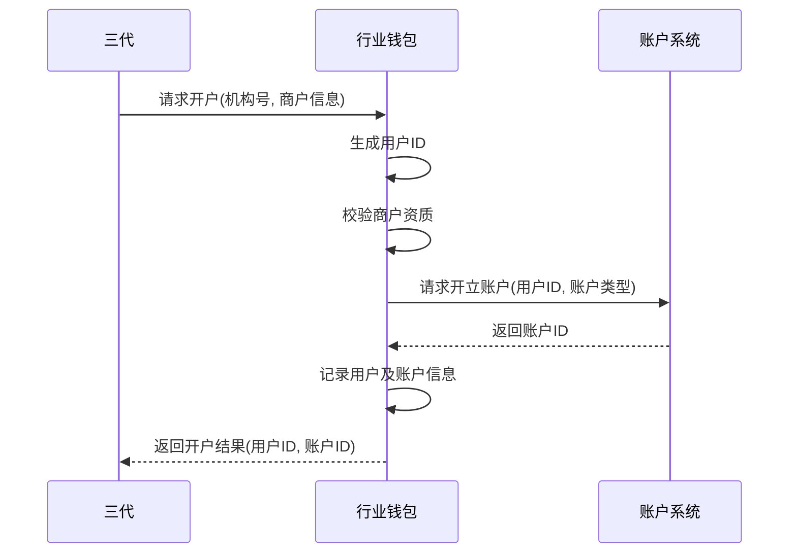
```mermaid
sequenceDiagram
    participant 三代
    participant 行业钱包
    participant 账户系统

    三代->>行业钱包: 请求开户(机构号, 商户信息)
    行业钱包->>行业钱包: 生成用户ID
    行业钱包->>行业钱包: 校验商户资质
    行业钱包->>账户系统: 请求开立账户(用户ID, 账户类型)
    账户系统-->>行业钱包: 返回账户ID
    行业钱包->>行业钱包: 记录用户及账户信息
    行业钱包-->>三代: 返回开户结果(用户ID, 账户ID)
```

#### 5.2 关系绑定时序图
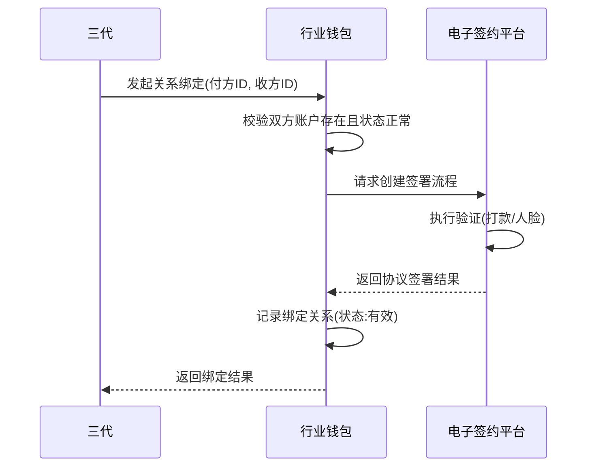
```mermaid
sequenceDiagram
    participant 三代
    participant 行业钱包
    participant 电子签约平台

    三代->>行业钱包: 发起关系绑定(付方ID, 收方ID)
    行业钱包->>行业钱包: 校验双方账户存在且状态正常
    行业钱包->>电子签约平台: 请求创建签署流程
    电子签约平台->>电子签约平台: 执行验证(打款/人脸)
    电子签约平台-->>行业钱包: 返回协议签署结果
    行业钱包->>行业钱包: 记录绑定关系(状态:有效)
    行业钱包-->>三代: 返回绑定结果
```

#### 5.3 分账请求处理时序图
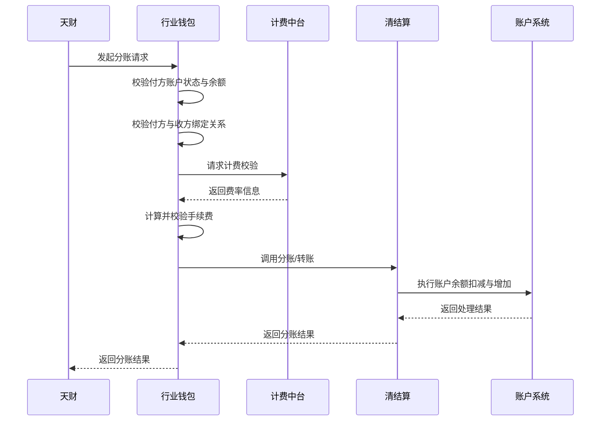
```mermaid
sequenceDiagram
    participant 天财
    participant 行业钱包
    participant 计费中台
    participant 清结算
    participant 账户系统

    天财->>行业钱包: 发起分账请求
    行业钱包->>行业钱包: 校验付方账户状态与余额
    行业钱包->>行业钱包: 校验付方与收方绑定关系
    行业钱包->>计费中台: 请求计费校验
    计费中台-->>行业钱包: 返回费率信息
    行业钱包->>行业钱包: 计算并校验手续费
    行业钱包->>清结算: 调用分账/转账
    清结算->>账户系统: 执行账户余额扣减与增加
    账户系统-->>清结算: 返回处理结果
    清结算-->>行业钱包: 返回分账结果
    行业钱包-->>天财: 返回分账结果
```

#### 5.4 处理冻结指令时序图
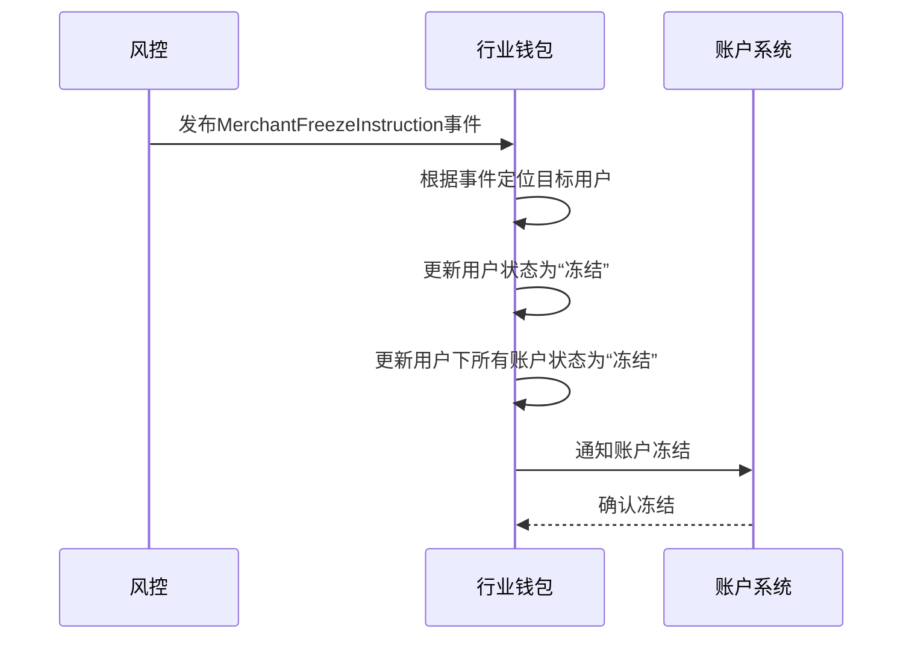
```mermaid
sequenceDiagram
    participant 风控
    participant 行业钱包
    participant 账户系统

    风控->>行业钱包: 发布MerchantFreezeInstruction事件
    行业钱包->>行业钱包: 根据事件定位目标用户
    行业钱包->>行业钱包: 更新用户状态为“冻结”
    行业钱包->>行业钱包: 更新用户下所有账户状态为“冻结”
    行业钱包->>账户系统: 通知账户冻结
    账户系统-->>行业钱包: 确认冻结
```

### 6. 错误处理
- **预期错误情况**:
    1.  **开户流程**: 商户资质不合法、机构号无效、账户系统开立失败。
    2.  **绑定流程**: 付方或收方账户不存在/已冻结、电子签约平台验证失败。
    3.  **分账流程**: 付方账户不存在、已冻结或余额不足；付方与收方未建立有效绑定关系；计费校验失败或费率信息异常；清结算系统处理失败（如账户状态异常、系统错误）；网络或下游服务超时。
    4.  **冻结流程**: 接收到的冻结指令目标不存在、与账户系统同步状态失败。
- **处理策略**:
    1.  对业务规则校验失败（如余额不足、无绑定关系），立即返回明确的错误码和提示，流程终止。
    2.  对下游系统（电子签约平台、计费中台、清结算、账户系统）调用失败，根据错误类型决定：
        - 对于网络超时或可重试的系统错误，进行有限次重试。
        - 对于明确的业务失败（如验证不通过、账户不存在），记录日志并返回失败。
    3.  对于关键资金操作（如分账扣款），确保与清结算系统的状态同步。在调用清结算后，需根据其明确结果更新本模块的分账请求状态，避免状态不一致。
    4.  处理风控冻结指令时，需确保本模块的用户/账户状态与账户系统的状态最终一致。若通知账户系统失败，需记录异常并告警，启动人工干预流程。
    5.  所有错误均需记录详细的日志，包含请求ID、用户ID、账户ID、错误码和错误信息，用于问题追踪和审计。

### 7. 依赖关系
- **上游模块**: 业务核心（发起分账）、三代（发起开户、绑定）、风控（发起冻结）、电子签约平台（绑定验证）、计费中台（费率计算）。
- **下游模块**: 清结算系统（执行分账）、账户系统（管理账户实体与余额）、对账单系统（提供对账数据）。

<a id="module-3"></a>

## 3.3 账户系统


### 1. 概述
- **目的与范围**: 账户系统是底层核心系统，负责账户的开立、升级、余额扣减、转账执行和账户状态管理等原子操作。它为上层业务（如行业钱包、清结算）提供基础的账户操作能力，但不处理业务逻辑（如分账规则、计费）。其边界止于账户层面的原子操作，例如执行一笔从A账户到B账户的转账，但不关心转账的业务原因。

### 2. 接口设计
- **API端点 (REST/GraphQL)**: TBD
- **请求/响应结构**: TBD
- **发布/消费的事件**:
    - **消费事件**:
        - `MerchantFrozenEvent` (来自风控): 包含商户ID。触发冻结该商户关联的所有账户。
    - **发布事件**:
        - `AccountOpenedEvent`: 账户开立成功后发布，包含账户ID、类型、所属商户ID。
        - `BalanceChangedEvent`: 账户余额发生变动后发布，包含账户ID、变动金额、变动后余额、业务流水号。
        - `AccountStatusChangedEvent`: 账户状态（启用/禁用/冻结）变更后发布，包含账户ID、变更前状态、变更后状态。

### 3. 数据模型
- **表/集合**: TBD
- **关键字段**: TBD
- **与其他模块的关系**: 账户系统为行业钱包、清结算系统提供账户数据支撑和操作接口。账户系统在完成资金变动后，需要通知账务核心进行记账。

### 4. 业务逻辑
- **核心工作流/算法**:
    1.  **账户开立**: 根据请求（来自行业钱包）创建指定类型的账户（如天财收款账户、天财接收方账户、待结算账户、退货账户）。
    2.  **账户升级**: 根据业务需要，变更账户的等级或属性。
    3.  **余额操作**: 执行账户余额的扣减、增加、冻结、解冻。扣减前需校验余额是否充足。
    4.  **转账执行**: 执行从付方账户到收方账户的资金划转，确保原子性（要么全成功，要么全失败）。
    5.  **状态管理**: 管理账户的启用、禁用、冻结（由风控事件触发）等状态。
- **业务规则与验证**:
    1.  开立账户时，需校验账户类型的合法性。
    2.  执行余额扣减或转账前，必须校验付方账户状态是否正常、余额是否充足。
    3.  转账操作需保证事务一致性。
- **关键边界情况处理**:
    1.  **并发扣款**: 对同一账户的并发扣款操作通过数据库行级锁（悲观锁）防止超扣。每次扣减操作在一个数据库事务内完成，锁定目标账户行。
    2.  **系统故障与冲正**: 在转账等关键操作中，采用本地事务确保付方扣减和收方增加的原子性。若后续调用账务核心失败，系统记录失败日志并发出告警，由对账系统在日终进行核对与修复，确保最终一致性。
    3.  **风控冻结**: 订阅`MerchantFrozenEvent`事件。收到事件后，根据商户ID查询其关联的所有账户，并批量将其状态更新为“冻结”。
    4.  **与账务核心的集成**: 资金操作（转账、余额变动）与记账操作解耦。账户系统在成功完成资金变动后，异步发出记账请求（如通过消息队列）给账务核心。记账请求需包含唯一业务流水号以保证幂等性。账户系统不等待记账结果即向上游返回资金操作成功，记账的最终一致性由对账机制保障。

### 5. 时序图

#### 5.1 转账执行时序图
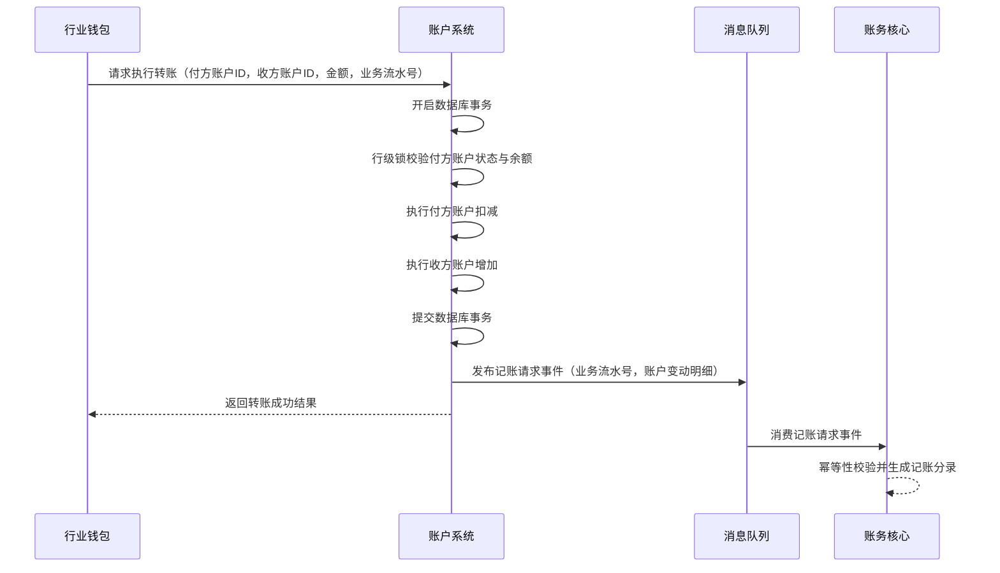
```mermaid
sequenceDiagram
    participant 行业钱包
    participant 账户系统
    participant 消息队列
    participant 账务核心

    行业钱包->>账户系统: 请求执行转账（付方账户ID，收方账户ID，金额，业务流水号）
    账户系统->>账户系统: 开启数据库事务
    账户系统->>账户系统: 行级锁校验付方账户状态与余额
    账户系统->>账户系统: 执行付方账户扣减
    账户系统->>账户系统: 执行收方账户增加
    账户系统->>账户系统: 提交数据库事务
    账户系统->>消息队列: 发布记账请求事件（业务流水号，账户变动明细）
    账户系统-->>行业钱包: 返回转账成功结果
    消息队列->>账务核心: 消费记账请求事件
    账务核心-->>账务核心: 幂等性校验并生成记账分录
```

#### 5.2 处理风控冻结指令时序图
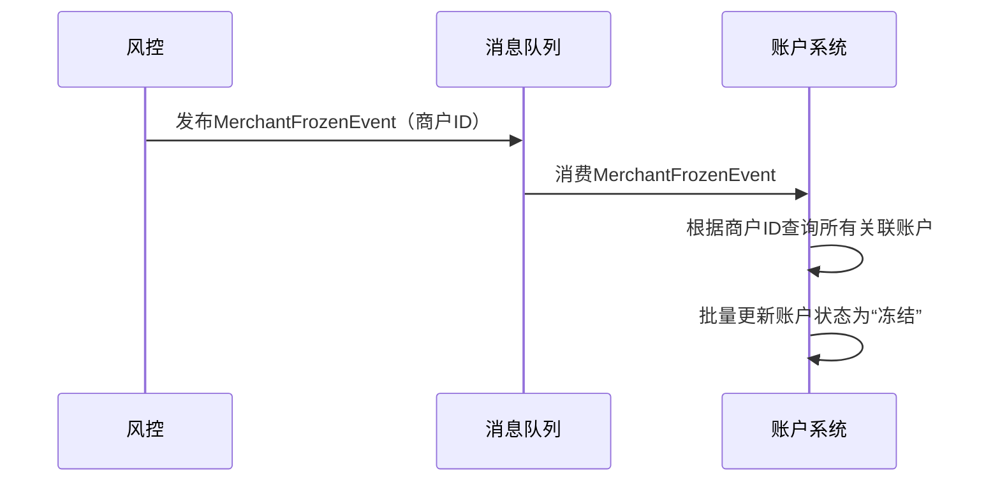
```mermaid
sequenceDiagram
    participant 风控
    participant 消息队列
    participant 账户系统

    风控->>消息队列: 发布MerchantFrozenEvent（商户ID）
    消息队列->>账户系统: 消费MerchantFrozenEvent
    账户系统->>账户系统: 根据商户ID查询所有关联账户
    账户系统->>账户系统: 批量更新账户状态为“冻结”
```

### 6. 错误处理
- **预期错误情况**:
    1.  付方账户不存在或状态异常（禁用、冻结）。
    2.  付方账户余额不足。
    3.  收方账户不存在或状态异常。
    4.  系统内部错误（如数据库连接失败）。
    5.  调用下游系统（如消息队列）失败。
- **处理策略**:
    1.  对于账户状态或余额问题，返回明确的业务错误码和提示，事务回滚。
    2.  对于数据库等系统内部错误，记录详细日志，向上游返回系统错误，触发告警，事务回滚。
    3.  发布事件到消息队列失败时，记录本地失败日志并重试，同时触发告警。由补偿作业定期扫描并重发未成功事件。

### 7. 依赖关系
- **上游模块**:
    1.  **行业钱包**: 调用账户系统进行开户、转账等操作。
    2.  **清结算系统**: 调用账户系统进行结算、退货扣款等资金操作。
    3.  **风控**: 通过消息事件向账户系统发送商户冻结/解冻指令。
- **下游模块**:
    1.  **账务核心**: 账户系统在完成资金变动后，通过异步事件通知账务核心进行记账。
    2.  **消息队列**: 用于解耦与风控、账务核心的通信。

<a id="module-4"></a>

## 3.4 清结算


### 1. 概述
- **目的与范围**: 本模块负责处理交易资金的清分、结算、账户冻结、退货扣款和结算单生成。它是资金流转的核心处理环节，连接业务核心、账户系统和风控等模块。

### 2. 接口设计
- **API端点 (REST/GraphQL)**:
    - `POST /api/v1/settlement/process`: 处理分账交易结算。
    - `POST /api/v1/settlement/refund/deduct`: 执行退货扣款。
    - `POST /api/v1/settlement/freeze`: 执行账户冻结。
    - `GET /api/v1/settlement/statement/generate`: 触发结算单生成。
- **请求/响应结构**: TBD
- **发布/消费的事件**:
    - 消费事件: `TradeSettledEvent` (来自业务核心)， `RiskFreezeCommandEvent` (来自风控)。
    - 发布事件: `SettlementCompletedEvent`， `RefundDeductedEvent`， `FreezeAppliedEvent`， `StatementGeneratedEvent`。

### 3. 数据模型
- **表/集合**:
    - `settlement_order` (结算订单表): 记录每笔结算请求。
    - `settlement_detail` (结算明细表): 记录结算涉及的账户与金额明细。
    - `freeze_record` (冻结记录表): 记录风控发起的冻结操作。
    - `refund_deduction` (退货扣款记录表): 记录退货扣款操作。
- **关键字段**:
    - `settlement_order`: `id`, `trade_id`, `settlement_mode` (主动结算/被动结算), `target_account_id`, `amount`, `status`, `created_at`。
    - `settlement_detail`: `id`, `settlement_order_id`, `from_account_id`, `to_account_id`, `amount`, `fee`。
    - `freeze_record`: `id`, `account_id`, `freeze_type` (商户冻结/交易冻结), `risk_order_id`, `status`, `created_at`。
    - `refund_deduction`: `id`, `refund_id`, `deduct_from_account_id`, `amount`, `status`, `created_at`。
- **与其他模块的关系**: 与账户系统交互进行账户余额扣减和转账执行；与业务核心交互处理分账交易数据；与风控交互处理冻结指令；与对账单系统交互生成结算单。

### 4. 业务逻辑
- **核心工作流/算法**:
    1.  **清分与结算**: 接收业务核心的分账交易数据，进行清分处理。根据结算模式将资金结算至目标账户。
        - **结算模式决策规则**: 若交易关联的商户已配置并启用了“主动结算”且指定了有效的“天财收款账户”，则执行主动结算至该账户；否则，执行被动结算至默认的“待结算账户”。
    2.  **账户冻结**: 处理风控发起的商户冻结和交易冻结指令，调用账户系统冻结指定账户或资金。
    3.  **退货扣款**: 执行退货流程。
        - **扣款来源决策逻辑**: 首先查询“终点账户”类型和余额。
            - 若终点账户为“天财收款账户”且余额充足，则直接从此账户扣款。
            - 若终点账户为“待结算账户”或余额不足，则尝试从关联的“退货账户”扣款。
            - 若均失败，则流程失败。
    4.  **结算单生成**: 定时或手动触发，汇总指定周期内的结算与退货记录，生成账户维度和交易维度的结算单，并调用对账单系统进行持久化与分发。
- **业务规则与验证**:
    1.  校验结算目标账户的状态是否正常（非冻结、非注销）。
    2.  验证分账请求的金额、账户关系及业务合法性。
    3.  所有核心操作（结算、扣款、冻结）需支持幂等性，通过业务唯一ID（如`trade_id`, `freeze_order_id`）保证。
- **关键边界情况处理**:
    1.  结算时目标账户被冻结：中断流程，返回账户冻结错误。
    2.  退货时终点账户及退货账户余额均不足：中断流程，返回余额不足错误。
    3.  清分过程中交易数据异常：记录异常，通知业务核心，流程失败。
- **技术考量**:
    1.  **幂等性**: 所有写操作接口需基于上游传递的唯一业务流水号实现幂等。
    2.  **分布式事务**: 涉及多系统调用（如账户系统扣款+账务核心记账）时，采用Saga模式，通过补偿操作保证最终一致性。
    3.  **弹性设计**: 对账户系统、账务核心等下游调用配置重试机制（如指数退避）和熔断器，防止级联故障。

### 5. 时序图

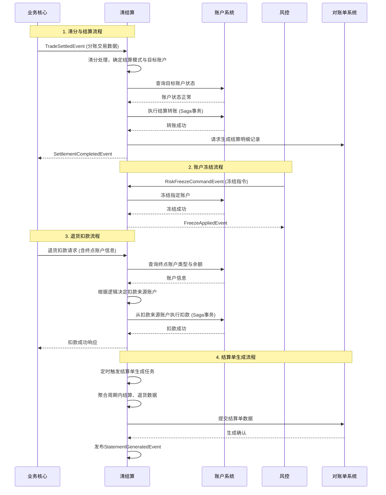
```mermaid
sequenceDiagram
    participant 业务核心
    participant 清结算
    participant 账户系统
    participant 风控
    participant 对账单系统

    Note over 业务核心,清结算: 1. 清分与结算流程
    业务核心->>清结算: TradeSettledEvent (分账交易数据)
    清结算->>清结算: 清分处理，确定结算模式与目标账户
    清结算->>账户系统: 查询目标账户状态
    账户系统-->>清结算: 账户状态正常
    清结算->>账户系统: 执行结算转账 (Saga事务)
    账户系统-->>清结算: 转账成功
    清结算->>对账单系统: 请求生成结算明细记录
    清结算-->>业务核心: SettlementCompletedEvent

    Note over 风控,清结算: 2. 账户冻结流程
    风控->>清结算: RiskFreezeCommandEvent (冻结指令)
    清结算->>账户系统: 冻结指定账户
    账户系统-->>清结算: 冻结成功
    清结算-->>风控: FreezeAppliedEvent

    Note over 业务核心,清结算: 3. 退货扣款流程
    业务核心->>清结算: 退货扣款请求 (含终点账户信息)
    清结算->>账户系统: 查询终点账户类型与余额
    账户系统-->>清结算: 账户信息
    清结算->>清结算: 根据逻辑决定扣款来源账户
    清结算->>账户系统: 从扣款来源账户执行扣款 (Saga事务)
    账户系统-->>清结算: 扣款成功
    清结算-->>业务核心: 扣款成功响应

    Note over 清结算,对账单系统: 4. 结算单生成流程
    清结算->>清结算: 定时触发结算单生成任务
    清结算->>清结算: 聚合周期内结算、退货数据
    清结算->>对账单系统: 提交结算单数据
    对账单系统-->>清结算: 生成确认
    清结算->>清结算: 发布StatementGeneratedEvent
```

### 6. 错误处理
- **预期错误情况**:
    1.  账户状态异常（冻结、注销）。
    2.  账户余额不足。
    3.  系统间调用超时或失败（如账户系统、账务核心）。
    4.  交易数据格式错误或业务规则校验失败。
    5.  幂等键冲突。
- **处理策略**:
    1.  对于业务错误（账户异常、余额不足、规则校验失败），返回明确的业务错误码并中断当前流程，不进行重试。
    2.  对于下游系统调用失败（网络超时、服务不可用），根据配置的重试策略进行有限次重试。重试失败后，记录异常日志，流程失败，必要时触发Saga补偿。
    3.  对于数据格式错误，记录异常并通知上游系统（业务核心）。
    4.  对于幂等键冲突，视为重复请求，直接返回之前的处理结果。

### 7. 依赖关系
- **上游模块**: 业务核心（提供交易数据）、风控（提供冻结指令）。
- **下游模块**: 账户系统（执行账户操作）、账务核心（账务处理）、对账单系统（结算单持久化与生成）。

<a id="module-5"></a>

## 3.5 账务核心


### 1. 概述
- **目的与范围**: 本模块是负责记账分录生成和账务处理的底层核心系统。其核心职责是接收来自上游系统的记账指令，根据会计规则生成准确、完整的会计分录，并完成账户余额的更新。其边界在于处理纯粹的账务逻辑，不涉及业务规则校验、风险控制或账户管理。本模块负责验证记账指令的要素完整性，但账户状态等业务规则校验委托给上游系统或依赖的账户系统完成。

### 2. 接口设计
- **API端点 (REST/GraphQL)**: TBD
- **请求/响应结构**: TBD
- **发布/消费的事件**: TBD

### 3. 数据模型
- **表/集合**: TBD
- **关键字段**: TBD
- **与其他模块的关系**: 本模块处理的数据与**账户系统**管理的账户余额直接相关，为**对账单系统**提供原始的账务流水数据。

### 4. 业务逻辑
- **核心工作流/算法**: 接收记账请求 -> 验证记账要素（账户、金额、借贷方向）-> 应用会计规则生成分录 -> 调用底层服务更新账户余额 -> 持久化记账凭证。
- **业务规则与验证**: 确保所有会计分录遵循“有借必有贷，借贷必相等”的会计恒等式。验证记账指令中账户、金额等要素的完整性。账户状态是否可用等业务规则由上游调用方（如清结算系统、行业钱包）或下游账户系统负责校验。
- **关键边界情况处理**: 处理分布式事务场景下的账务一致性。采用补偿事务（Saga）模式确保涉及多账户余额变动的操作（如分账、转账）的最终一致性。为所有请求提供幂等性支持。
- **幂等与重试机制**: 通过业务唯一键（如请求ID+业务类型）实现接口幂等。对于可重试的系统级错误，采用指数退避策略进行重试。

### 5. 时序图
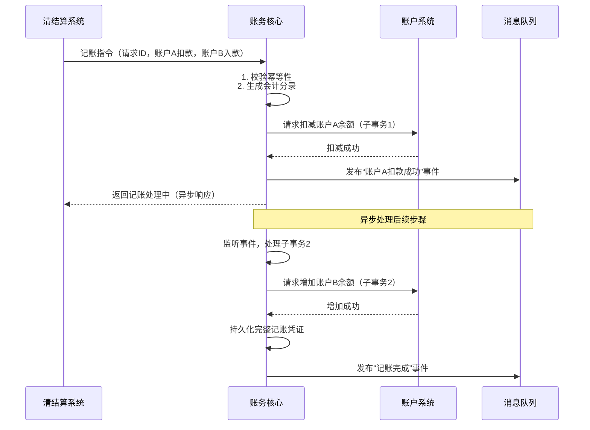
```mermaid
sequenceDiagram
    participant A as 清结算系统
    participant B as 账务核心
    participant C as 账户系统
    participant D as 消息队列

    A->>B: 记账指令（请求ID，账户A扣款，账户B入款）
    B->>B: 1. 校验幂等性<br>2. 生成会计分录
    B->>C: 请求扣减账户A余额（子事务1）
    C-->>B: 扣减成功
    B->>D: 发布“账户A扣款成功”事件
    B-->>A: 返回记账处理中（异步响应）
    
    Note over B,D: 异步处理后续步骤
    B->>B: 监听事件，处理子事务2
    B->>C: 请求增加账户B余额（子事务2）
    C-->>B: 增加成功
    B->>B: 持久化完整记账凭证
    B->>D: 发布“记账完成”事件
```

### 6. 错误处理
- **预期错误情况**: 账户不存在、账户状态异常（如冻结）、账户余额不足、记账要素不完整、网络或数据库异常、幂等冲突。
- **处理策略**: 对于业务性错误（如余额不足、账户不存在），立即失败并返回明确错误码，由上游系统处理。对于系统级异常，记录详细日志，并根据Saga模式触发已成功子事务的补偿操作，确保最终一致性。所有操作支持幂等重试。

### 7. 依赖关系
- **上游模块**: **清结算系统**（触发结算、退货等记账请求）、**行业钱包**（触发分账记账请求）。上游模块需保证传入的记账指令业务正确，并处理业务校验失败场景。
- **下游模块**: **账户系统**（依赖其进行账户余额的原子性更新）。通过异步事件和补偿机制保证分布式事务的最终一致性。

<a id="module-6"></a>

## 3.6 电子签约平台


### 1. 概述
- **目的与范围**：本模块负责协议模板管理、签约流程的发起与执行，包括短信推送、H5页面封装、打款验证和人脸验证的调用。它为“三代”发起的“关系绑定”和“开通付款”流程提供身份认证与协议签署的流程管理服务，不直接处理资金交易。
- **核心职责**：
    1.  协议模板的存储、版本管理与动态渲染。
    2.  接收“三代”的签约请求，创建并管理签约流程实例。
    3.  封装并下发包含签约流程状态的H5页面链接。
    4.  根据认证类型，协调调用外部验证服务（打款验证/人脸验证）。
    5.  记录签约结果，并将最终状态同步回“三代”。

### 2. 接口设计
- **API端点 (REST)**：
    1.  `POST /api/v1/signing/process`：创建签约流程。
        - **请求方**：三代。
        - **请求体**：`{“biz_scene”: “RELATION_BIND” | “OPEN_PAYMENT”, “template_id”: “string”, “parties”: [{“role”: “PAYER” | “PAYEE”, “user_id”: “string”, “name”: “string”, “id_no”: “string?”, “bank_card_no”: “string?”}, …], “callback_url”: “string”}`
        - **响应体**：`{“process_id”: “string”, “h5_url”: “string”}`
    2.  `GET /api/v1/signing/process/{process_id}`：查询签约流程状态。
        - **请求方**：三代 / 内部管理。
        - **响应体**：`{“process_id”: “string”, “status”: “INIT” | “SMS_SENT” | “VERIFYING” | “SIGNED” | “FAILED” | “EXPIRED”, “parties_status”: {“user_id”: “string”, “status”: “PENDING” | “VERIFIED” | “SIGNED” | “FAILED”}, …}`
    3.  `POST /api/v1/signing/template`：上传协议模板。
        - **请求方**：内部管理后台。
        - **请求体**：`{“template_id”: “string”, “version”: “string”, “biz_scene”: “string”, “content”: “string (HTML)”, “variables”: [“var1”, “var2”]}`
- **发布/消费的事件**：
    - **消费事件**：TBD（从“三代”接收签约指令的事件，如“RelationBindRequested”）。
    - **发布事件**：`SigningProcessCompleted`（签约流程完成时发布，包含process_id, status, parties等信息）。

### 3. 数据模型
- **表/集合**：
    1.  **协议模板表 (agreement_template)**：
        - `id` (PK)， `template_id`， `version`， `biz_scene`， `content_html`， `variables_config` (JSON)， `is_active` (boolean)， `created_at`， `created_by`。
    2.  **签约流程表 (signing_process)**：
        - `process_id` (PK)， `biz_scene`， `template_id`， `template_version`， `status`， `h5_session_token`， `callback_url`， `expires_at`， `created_at`， `updated_at`。
    3.  **签约方表 (signing_party)**：
        - `id` (PK)， `process_id` (FK)， `user_id`， `role`， `name`， `id_no`， `bank_card_no`， `verification_type`， `verification_status`， `signed_at`， `meta_info` (JSON)。
    4.  **流程日志表 (process_audit_log)**：
        - `id` (PK)， `process_id`， `event_type` (如“SMS_SENT”, “VERIFICATION_INITIATED”, “VERIFICATION_RESULT”)， `event_data` (JSON)， `created_at`。
- **与其他模块的关系**：本模块的数据模型通过`process_id`、`user_id`与“三代”和“行业钱包”的业务上下文关联。“三代”通过`process_id`查询状态，“行业钱包”在关系绑定生效后可能关联此处的签约记录。

### 4. 业务逻辑
- **核心工作流**：
    1.  **流程创建**：“三代”调用接口发起签约。系统校验模板与场景，生成唯一`process_id`和`h5_session_token`，初始化流程状态为`INIT`。
    2.  **H5页面封装**：根据`process_id`和`h5_session_token`生成动态H5 URL。该页面逻辑负责：a) 根据session加载用户身份与协议内容；b) 引导用户选择/确认验证方式；c) 管理前端状态，并与后端保持心跳/状态同步。
    3.  **短信推送**：向签约方发送包含动态H5链接的短信。流程状态更新为`SMS_SENT`。
    4.  **用户验证**：
        - **打款验证**：用户选择后，系统调用“银行/验证服务”的API，请求向指定银行卡发送随机金额。**本模块不发起实际打款，仅调用验证服务的接口**。用户回填金额后，系统再次调用验证服务进行校验。
        - **人脸验证**：用户选择后，系统调用“人脸识别服务”的API，引导用户完成人脸采集与比对。
    5.  **协议签署**：验证通过后，用户在H5页面确认协议并签署。系统记录签署时间，更新签约方状态为`SIGNED`。
    6.  **流程完成**：所有必要方签署完成后，流程状态更新为`SIGNED`。通过回调`callback_url`通知“三代”，并发布`SigningProcessCompleted`事件。
- **业务规则**：
    1.  协议模板选择基于`biz_scene`（如`RELATION_BIND`）和签约方角色。
    2.  验证方式选择规则：企业通常使用打款验证，个人/个体户负责人可使用人脸验证。
    3.  H5会话有效期（如30分钟），超时后流程状态置为`EXPIRED`。
    4.  同一对签约方在特定业务场景下，仅允许存在一个`INIT`或`SMS_SENT`状态的流程。
- **关键边界情况处理**：
    1.  **用户中途放弃**：H5会话超时管理。支持通过原链接在一定时间内恢复流程。
    2.  **验证失败**：提供有限次数的重试（如3次）。超过次数，流程状态置为`FAILED`。
    3.  **外部服务不可用**：对“银行/验证服务”和“人脸识别服务”的调用配置熔断器与降级策略。服务不可用时，流程阻塞并记录，前端提示“服务繁忙，请稍后重试”。

### 5. 时序图
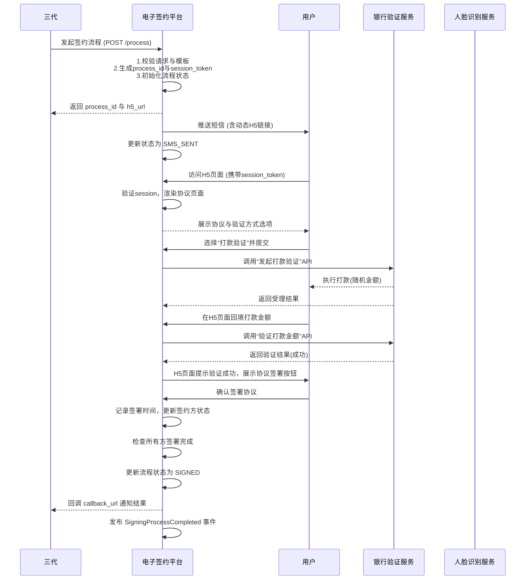
```mermaid
sequenceDiagram
    participant 三代
    participant 电子签约平台
    participant 用户
    participant 银行验证服务
    participant 人脸识别服务

    三代->>电子签约平台: 发起签约流程 (POST /process)
    电子签约平台->>电子签约平台: 1.校验请求与模板<br/>2.生成process_id与session_token<br/>3.初始化流程状态
    电子签约平台-->>三代: 返回 process_id 与 h5_url
    电子签约平台->>用户: 推送短信 (含动态H5链接)
    电子签约平台->>电子签约平台: 更新状态为 SMS_SENT

    用户->>电子签约平台: 访问H5页面 (携带session_token)
    电子签约平台->>电子签约平台: 验证session，渲染协议页面
    电子签约平台-->>用户: 展示协议与验证方式选项

    用户->>电子签约平台: 选择“打款验证”并提交
    电子签约平台->>银行验证服务: 调用“发起打款验证”API
    银行验证服务-->>用户: 执行打款(随机金额)
    银行验证服务-->>电子签约平台: 返回受理结果
    用户->>电子签约平台: 在H5页面回填打款金额
    电子签约平台->>银行验证服务: 调用“验证打款金额”API
    银行验证服务-->>电子签约平台: 返回验证结果(成功)

    电子签约平台->>用户: H5页面提示验证成功，展示协议签署按钮
    用户->>电子签约平台: 确认签署协议
    电子签约平台->>电子签约平台: 记录签署时间，更新签约方状态

    电子签约平台->>电子签约平台: 检查所有方签署完成
    电子签约平台->>电子签约平台: 更新流程状态为 SIGNED
    电子签约平台-->>三代: 回调 callback_url 通知结果
    电子签约平台->>电子签约平台: 发布 SigningProcessCompleted 事件
```

### 6. 错误处理
- **预期错误情况**：
    1.  **请求错误**：模板不存在、签约方信息不全、重复发起。
    2.  **流程错误**：H5会话过期、验证失败超次、用户取消。
    3.  **外部依赖错误**：短信服务失败、银行验证服务超时或不可用、人脸识别服务调用失败。
    4.  **系统错误**：数据库异常、网络中断。
- **处理策略**：
    1.  **输入校验**：接口层进行严格参数校验，返回明确的错误码（如`INVALID_TEMPLATE`, `MISSING_PARTY_INFO`）。
    2.  **流程状态机**：定义清晰的流程状态（`INIT` -> `SMS_SENT` -> `VERIFYING` -> `SIGNED`/`FAILED`/`EXPIRED`），确保状态转换的原子性与一致性。
    3.  **外部调用容错**：
        - **重试**：对可重试的第三方服务错误（如网络超时），采用指数退避策略进行重试（最多3次）。
        - **熔断**：配置熔断器（如基于失败率），当外部服务持续不可用时快速失败，避免资源耗尽。
        - **降级**：服务不可用时，流程无法继续，记录日志并通知运维。前端展示友好错误提示。
    4.  **监控与告警**：记录所有关键操作和错误日志。对流程失败率、第三方服务可用性设置监控指标与告警。

### 7. 依赖关系
- **上游模块**：**三代**。本模块作为服务被“三代”调用，用于执行其控制的“关系绑定”与“开通付款”流程中的签约环节。
- **下游模块/服务**：
    1.  **银行/验证服务**：提供打款验证能力的第三方或内部服务。本模块调用其API发起验证请求与校验结果。
    2.  **人脸识别服务**：提供人脸采集与比对能力的第三方或内部服务。
    3.  **短信推送服务**：用于向用户发送签约链接。
- **数据依赖**：协议模板数据（内部管理）。

<a id="module-7"></a>

## 3.7 认证系统


### 1. 概述
- **目的与范围**：本模块负责处理用户身份认证与账户授权验证。其核心职责包括执行打款验证以确认银行卡有效性，以及执行人脸验证以核实个人或个体户负责人的身份。本模块是关系绑定、开通付款等业务流程中身份认证环节的执行者，不负责协议管理或流程编排。本模块由电子签约平台调用，提供标准化的验证服务。
- **关键非功能性要求**：
    - **安全性**：需对传输和存储的个人身份信息（PII）及生物特征数据进行加密处理，并遵循相关数据保护法规。
    - **合规性**：人脸验证需符合国家关于生物特征信息采集与使用的规定，数据保留期限需根据法规和业务要求设定。
    - **性能**：单次验证请求的端到端响应时间P95应低于5秒。
    - **幂等性**：支持基于唯一请求ID的幂等调用，防止重复验证。

### 2. 接口设计
- **API端点 (REST)**：
    - `POST /api/v1/verification/payment`：发起打款验证。
    - `POST /api/v1/verification/face`：发起人脸验证。
    - `GET /api/v1/verification/result/{requestId}`：查询验证结果。
- **请求/响应结构**：
    - **打款验证请求**：
        ```json
        {
          "requestId": "唯一请求标识，用于幂等",
          "userId": "用户ID",
          "userName": "姓名",
          "bankCardNo": "银行卡号",
          "idCardNo": "身份证号",
          "mobile": "银行预留手机号（可选）",
          "callbackUrl": "异步回调地址（可选）"
        }
        ```
    - **人脸验证请求**：
        ```json
        {
          "requestId": "唯一请求标识，用于幂等",
          "userId": "用户ID",
          "userName": "姓名",
          "idCardNo": "身份证号",
          "faceImage": "Base64编码的人脸图片或活体检测数据",
          "scene": "验证场景，如：RELATION_BINDING"
        }
        ```
    - **通用响应**：
        ```json
        {
          "code": "业务状态码",
          "message": "描述信息",
          "data": {
            "requestId": "请求ID",
            "status": "状态（PROCESSING/SUCCESS/FAILED）",
            "result": "验证结果（PASS/REJECT）",
            "failReason": "失败原因（可选）",
            "verifyTime": "验证完成时间"
          }
        }
        ```
- **发布/消费的事件**：
    - **消费事件**：TBD（例如，接收来自电子签约平台的验证指令事件）。
    - **发布事件**：`VerificationCompletedEvent`，当验证完成时发布，包含请求ID、用户ID、验证类型和结果。

### 3. 数据模型
- **表/集合**：
    - **verification_request（验证请求表）**：存储所有验证请求的主记录。
    - **payment_verification_detail（打款验证详情表）**：存储打款验证的特定信息。
    - **face_verification_detail（人脸验证详情表）**：存储人脸验证的特定信息。
    - **verification_audit_log（验证审计日志表）**：存储所有操作的审计日志。
- **关键字段**：
    - **verification_request**：
        - `id` / `request_id`：主键，与请求ID一致。
        - `user_id`：用户ID。
        - `type`：验证类型（PAYMENT/FACE）。
        - `status`：状态（INIT， PROCESSING， SUCCESS， FAILED）。
        - `result`：最终结果（PASS， REJECT）。
        - `scene`：业务场景。
        - `created_at`， `updated_at`：时间戳。
    - **payment_verification_detail**：
        - `request_id`：外键，关联验证请求。
        - `bank_card_no`：银行卡号（加密存储）。
        - `amount`：打款金额（分）。
        - `external_trade_no`：外部通道交易流水号。
        - `callback_confirmed`：回调是否已确认。
    - **face_verification_detail**：
        - `request_id`：外键，关联验证请求。
        - `id_card_no`：身份证号（加密存储）。
        - `face_image_hash`：人脸特征信息哈希（不存储原始图片）。
        - `score`：人脸比对分数。
        - `liveness_result`：活体检测结果。
- **与其他模块的关系**：本模块由**电子签约平台**调用，验证结果可供**行业钱包**在关系绑定时查询。本模块依赖外部验证服务。

### 4. 业务逻辑
- **核心工作流/算法**：
    1.  **接收与校验**：接收验证请求，校验参数完整性、业务规则（如身份证格式）及幂等性（根据`requestId`判断是否已处理）。
    2.  **调用外部服务**：
        - **打款验证**：
            a. 生成随机小额金额（如0.01-0.99元）。
            b. 调用银行/支付通道的打款接口，向目标银行卡转账。
            c. 记录外部交易流水号，等待用户回填金额或通道异步回调。
            d. 比对用户回填金额或回调通知中的金额，判断是否匹配。
        - **人脸验证**：
            a. 调用公安人脸库或第三方人脸识别服务，传入姓名、身份证号和人脸特征。
            b. 服务返回比对分数和活体检测结果。
            c. 根据预设阈值（如比对分数>0.8且活体检测通过）判断验证结果。
    3.  **状态更新与通知**：更新验证状态和结果，若请求指定了`callbackUrl`，则异步回调通知调用方。发布`VerificationCompletedEvent`事件。
- **业务规则与验证**：
    - **打款验证匹配规则**：用户回填金额需与系统打款金额完全一致（单位：分）。
    - **人脸验证匹配规则**：需同时满足：1) 比对分数 > 预设阈值（可配置）；2) 活体检测结果为通过。
    - **验证时效性**：打款验证回填有效期通常为24小时；人脸验证响应实时处理。
- **关键边界情况处理**：
    - **外部服务不可用**：触发熔断机制，并返回“服务暂时不可用”错误。
    - **网络超时**：设置合理的接口超时时间，并具备重试机制。
    - **验证信息不匹配**：记录详细的不匹配原因（如金额错误、人脸比对分数低），并返回明确的失败结果。
    - **重复请求**：基于`requestId`实现幂等，直接返回已存在的验证结果。

### 5. 时序图

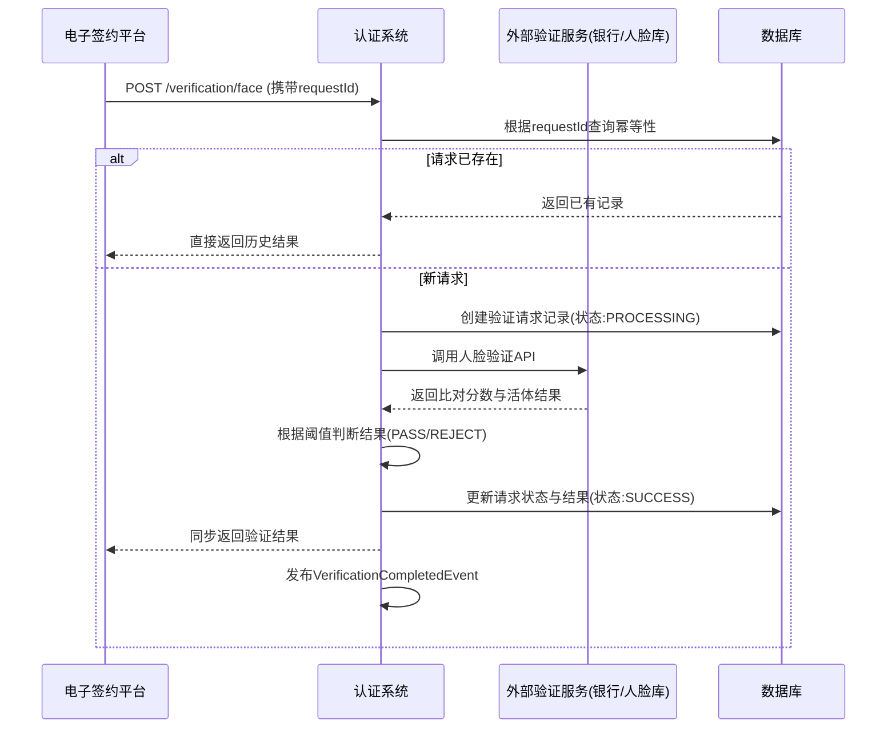
```mermaid
sequenceDiagram
    participant A as 电子签约平台
    participant B as 认证系统
    participant C as 外部验证服务(银行/人脸库)
    participant D as 数据库

    A->>B: POST /verification/face (携带requestId)
    B->>D: 根据requestId查询幂等性
    alt 请求已存在
        D-->>B: 返回已有记录
        B-->>A: 直接返回历史结果
    else 新请求
        B->>D: 创建验证请求记录(状态:PROCESSING)
        B->>C: 调用人脸验证API
        C-->>B: 返回比对分数与活体结果
        B->>B: 根据阈值判断结果(PASS/REJECT)
        B->>D: 更新请求状态与结果(状态:SUCCESS)
        B-->>A: 同步返回验证结果
        B->>B: 发布VerificationCompletedEvent
    end
```

### 6. 错误处理
- **预期错误情况与错误码**：
    - `4000`：请求参数无效（如身份证格式错误）。
    - `4001`：重复的请求（幂等性冲突）。
    - `5001`：外部验证服务调用失败。
    - `5002`：外部验证服务响应超时。
    - `5003`：外部验证服务返回业务错误（如账户不存在）。
    - `5004`：系统内部错误（如数据库异常）。
- **处理策略**：
    - **重试机制**：对于网络超时（`5002`）等可重试错误，采用指数退避策略进行最多3次重试。
    - **熔断器**：针对外部验证服务，当失败率超过阈值时，开启熔断，直接快速失败，定期尝试恢复。
    - **降级与回退**：TBD（在极端情况下，是否提供降级验证方案，如仅依赖基础信息校验）。
    - **错误传递**：向上游返回结构化的错误信息，包含错误码、可读消息及请求ID，便于排查。
    - **审计与监控**：所有错误均记录至审计日志，并接入监控告警系统。

### 7. 依赖关系
- **上游模块**：**电子签约平台**。本模块作为其下游服务，被调用来执行具体的身份与银行卡验证。
- **下游模块/服务**：
    - **外部验证服务**：银行打款通道、公安人脸识别系统或合规的第三方人脸验证服务商。
    - **内部依赖**：数据库、消息中间件（用于发布事件）、配置中心（用于管理阈值、开关等）。
- **澄清**：本模块是独立的服务，由电子签约平台在需要执行打款或人脸验证时同步或异步调用。不存在循环依赖。验证结果状态由本模块持久化存储。

<a id="module-8"></a>

## 3.8 计费中台


### 1. 概述
- **目的与范围**: 负责计费流水生成、手续费计算和费率信息同步的系统。其核心职责是处理与分账、转账等资金流转业务相关的费用计算，并生成相应的计费流水记录。
- **上游调用方角色澄清**:
    - **业务核心**: 作为交易发起方，在处理天财分账交易时，请求计算手续费。
    - **清结算系统**: 作为结算发起方，在清分结算流程中，请求计算相关手续费。
- **费率同步目标**: 将计算出的手续费信息，通过异步消息等方式同步给**账务核心**，用于记账。

### 2. 接口设计
- **API端点 (REST)**:
    - `POST /api/v1/fee/calculate`: 手续费计算接口。
    - `GET /api/v1/fee/rules/{ruleId}`: 查询费率规则详情接口。
- **请求/响应结构**:
    - **计算手续费请求体**:
        - `originalTxId` (string): 原交易ID。
        - `scenario` (string): 计费场景，如 `SPLIT`（分账）、`COLLECTION`（归集）、`BATCH_PAY`（批量付款）。
        - `payerAccountNo` (string): 付款方账户号。
        - `receiverAccountNo` (string): 收款方账户号。
        - `amount` (BigDecimal): 交易金额。
        - `feeBearer` (string): 手续费承担方，如 `PAYER`、`RECEIVER`。
        - `idempotencyKey` (string): 幂等键。
    - **计算手续费响应体**:
        - `feeTxId` (string): 计费流水ID。
        - `originalTxId` (string): 原交易ID。
        - `calculatedFee` (BigDecimal): 计算出的手续费金额。
        - `netAmount` (BigDecimal): 净额（适用于净额转账场景）。
        - `status` (string): 计费状态，如 `CALCULATED`、`DEDUCTED`。
        - `ruleId` (string): 使用的费率规则ID。
- **发布/消费的事件**:
    - **消费事件**: TBD（例如，监听费率规则更新事件）。
    - **发布事件**: `FeeCalculatedEvent`，包含手续费计算结果及流水信息，供账务核心等下游模块消费。

### 3. 数据模型
- **表/集合**:
    - **费率规则表 (fee_rule)**:
        - `rule_id` (PK, string): 规则唯一标识。
        - `scenario` (string): 适用业务场景。
        - `rate_type` (string): 费率类型（如比例费率、固定费率）。
        - `rate_value` (decimal): 费率值。
        - `fee_bearer` (string): 默认手续费承担方。
        - `effective_date` (datetime): 生效时间。
        - `expiry_date` (datetime): 失效时间。
        - `min_fee` (decimal): 最低手续费。
        - `max_fee` (decimal): 最高手续费。
    - **计费流水表 (fee_transaction)**:
        - `fee_id` (PK, string): 计费流水唯一标识。
        - `original_tx_id` (string): 关联的原交易ID。
        - `scenario` (string): 业务场景。
        - `amount` (decimal): 交易原金额。
        - `calculated_fee` (decimal): 计算出的手续费。
        - `net_amount` (decimal): 净额。
        - `status` (string): 状态（CALCULATED， DEDUCT_FAILED， DEDUCTED）。
        - `payer_account_no` (string): 付款方账户。
        - `receiver_account_no` (string): 收款方账户。
        - `fee_bearer` (string): 手续费承担方。
        - `rule_id` (string): 使用的费率规则ID。
        - `idempotency_key` (string, unique): 幂等键。
        - `created_at` (datetime): 创建时间。
- **与其他模块的关系**:
    - 通过 `original_tx_id` 与**业务核心**或**清结算系统**的交易记录关联。
    - 计费结果通过事件同步至**账务核心**。
    - 手续费扣减需调用**账户系统**。

### 4. 业务逻辑
- **核心工作流/算法**:
    1. **接收请求**: 接收来自业务核心或清结算系统的计费请求。
    2. **幂等校验**: 检查请求中的 `idempotencyKey`，若已存在相同流水则直接返回历史结果。
    3. **查询费率规则**: 根据请求的 `scenario`、`payerAccountNo`、`receiverAccountNo` 以及当前时间，查询生效的费率规则。支持从缓存读取，缓存未命中则查数据库。
    4. **手续费计算**:
        - **比例费率**: `fee = amount * rate_value`。
        - **固定费率**: `fee = rate_value`。
        - 计算结果需与规则中的 `min_fee` 和 `max_fee` 比较并钳制。
        - **精度与舍入**: 金额计算使用 `BigDecimal`，最终手续费金额舍入规则为 `HALF_UP`（四舍五入），精度为分（0.01元）。
    5. **净额计算**: 若为`净额转账`模式，则 `netAmount = amount - fee`；若为`全额转账`模式，则 `netAmount = amount`。
    6. **生成流水**: 将计算结果持久化至 `fee_transaction` 表，状态初始为 `CALCULATED`。
    7. **同步信息**: 发布 `FeeCalculatedEvent` 事件。
    8. **返回结果**: 将计算结果返回给调用方。
- **业务规则与验证**:
    - 校验请求参数合法性（如金额为正数）。
    - 验证计费场景（`scenario`）是否在支持范围内。
    - 验证费率规则是否存在且有效，若缺失则视为关键错误。
- **关键边界情况处理**:
    - **费率规则并发更新**: 采用乐观锁或分布式锁（如基于 `rule_id`）确保计算时规则状态一致。
    - **手续费计算溢出**: 使用 `BigDecimal` 防止精度丢失和溢出，计算前后进行合理性校验（如手续费不大于本金）。
    - **下游扣费失败**: 若需实时扣费（由账户系统执行），扣费失败后更新计费流水状态为 `DEDUCT_FAILED`，并通知上游业务方。

### 5. 时序图

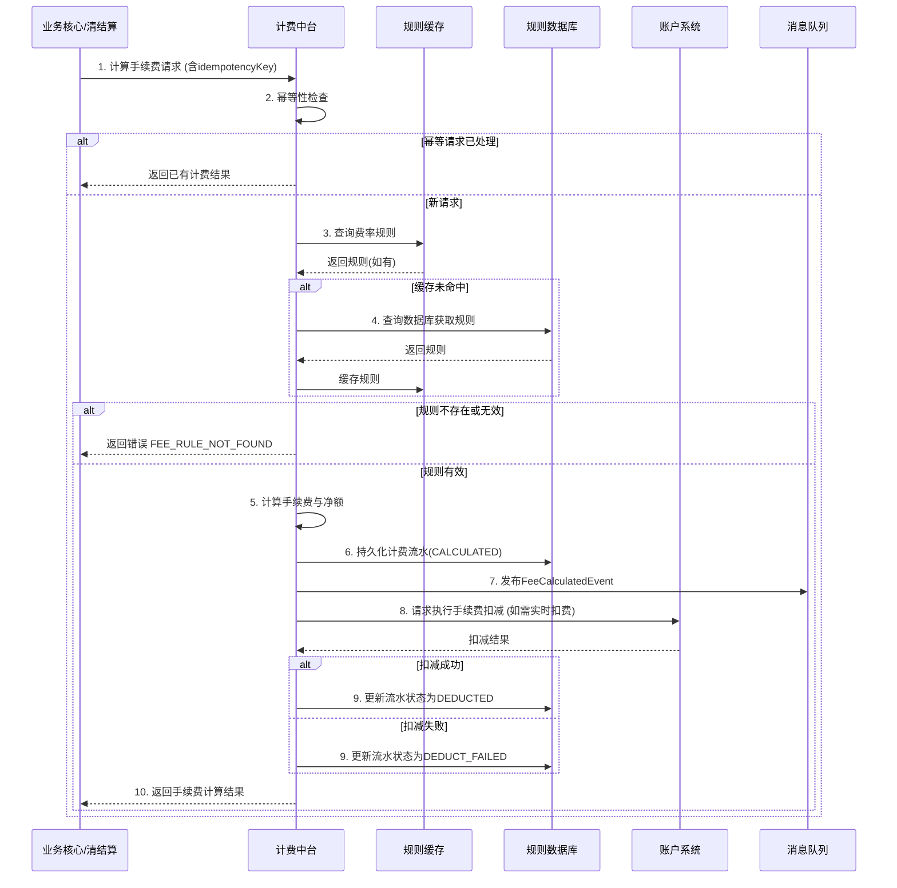
```mermaid
sequenceDiagram
    participant Caller as 业务核心/清结算
    participant Fee as 计费中台
    participant Cache as 规则缓存
    participant DB as 规则数据库
    participant Account as 账户系统
    participant MQ as 消息队列

    Caller->>Fee: 1. 计算手续费请求 (含idempotencyKey)
    Fee->>Fee: 2. 幂等性检查
    alt 幂等请求已处理
        Fee-->>Caller: 返回已有计费结果
    else 新请求
        Fee->>Cache: 3. 查询费率规则
        Cache-->>Fee: 返回规则(如有)
        alt 缓存未命中
            Fee->>DB: 4. 查询数据库获取规则
            DB-->>Fee: 返回规则
            Fee->>Cache: 缓存规则
        end
        alt 规则不存在或无效
            Fee-->>Caller: 返回错误 FEE_RULE_NOT_FOUND
        else 规则有效
            Fee->>Fee: 5. 计算手续费与净额
            Fee->>DB: 6. 持久化计费流水(CALCULATED)
            Fee->>MQ: 7. 发布FeeCalculatedEvent
            Fee->>Account: 8. 请求执行手续费扣减 (如需实时扣费)
            Account-->>Fee: 扣减结果
            alt 扣减成功
                Fee->>DB: 9. 更新流水状态为DEDUCTED
            else 扣减失败
                Fee->>DB: 9. 更新流水状态为DEDUCT_FAILED
            end
            Fee-->>Caller: 10. 返回手续费计算结果
        end
    end
```

### 6. 错误处理
- **预期错误情况与错误码**:
    - `FEE_RULE_NOT_FOUND` (400): 未找到适用的有效费率规则。
    - `INVALID_FEE_SCENARIO` (400): 不支持的计费场景。
    - `CALCULATION_OVERFLOW` (500): 手续费计算溢出或结果不合理。
    - `ACCOUNT_DEDUCT_FAILED` (500): 账户系统手续费扣减失败（如余额不足）。
    - `DOWNSTREAM_SERVICE_UNAVAILABLE` (503): 下游服务（如账户系统、数据库）暂时不可用。
    - `IDEMPOTENCY_KEY_CONFLICT` (409): 幂等键冲突（罕见，内部处理机制触发）。
- **处理策略**:
    - 对于 `FEE_RULE_NOT_FOUND` 等业务规则错误，返回明确错误，阻断业务流程。
    - 对于 `ACCOUNT_DEDUCT_FAILED`，记录详细日志并通知上游，由业务决定重试或终止。
    - 对于 `DOWNSTREAM_SERVICE_UNAVAILABLE` 等暂时性故障，实现指数退避重试机制（如调用账户系统扣费）。
    - 所有错误均记录结构化日志，包含请求ID、错误码和上下文信息。

### 7. 依赖关系
- **上游模块**:
    - **业务核心**: 提供分账等交易请求，触发手续费计算。
    - **清结算系统**: 在结算流程中触发手续费计算。
- **下游模块**:
    - **账户系统**: 执行实际的手续费余额扣减操作。
    - **账务核心**: 消费 `FeeCalculatedEvent`，完成手续费相关的账务处理。
- **内部/基础设施依赖**:
    - 规则数据库、缓存服务、消息中间件。

<a id="module-9"></a>

## 3.9 对账单系统


### 1. 概述
- **目的与范围**：本模块负责生成和提供各类账户和交易维度的对账单。其核心职责是聚合来自清结算、账务核心等模块的数据，按需生成标准格式的对账单文件或数据流，供天财、商户或内部运营查询下载。边界在于数据聚合与呈现，不涉及原始交易数据的处理或资金结算。

### 2. 接口设计
- **API端点 (REST/GraphQL)**：
    - `POST /api/v1/statements/generate`：异步生成对账单。
    - `GET /api/v1/statements`：查询对账单列表。
    - `GET /api/v1/statements/{statementId}/download`：下载对账单文件。
    - `GET /api/v1/statements/{statementId}/status`：查询对账单生成状态。
- **请求/响应结构**：
    - 生成对账单请求：`{ “merchantId”: “string”, “accountNo”: “string”, “startDate”: “YYYY-MM-DD”, “endDate”: “YYYY-MM-DD”, “type”: “SETTLEMENT|ACCOUNT” }`
    - 生成对账单响应：`{ “jobId”: “string”, “status”: “PENDING” }`
    - 对账单列表项：`{ “statementId”: “string”, “merchantId”: “string”, “generatedAt”: “timestamp”, “period”: “string”, “downloadUrl”: “string”, “status”: “COMPLETED|FAILED|PROCESSING” }`
- **发布/消费的事件**：
    - 消费事件：TBD（例如，消费来自业务核心的原始交易数据事件，或清结算的结算完成事件）。
    - 发布事件：TBD（例如，发布对账单生成成功或失败事件）。

### 3. 数据模型
- **表/集合**：
    - `statement_jobs`：对账单生成任务表。字段：`job_id`（主键），`request_params`（JSON），`status`，`error_message`，`created_at`，`updated_at`。
    - `statement_metadata`：对账单元数据表。字段：`statement_id`（主键），`job_id`，`merchant_id`，`account_no`，`period_start`，`period_end`，`statement_type`，`file_storage_path`，`file_size`，`generated_at`。
    - `statement_items`：对账单明细条目表（可选，用于支持明细查询）。字段：`id`（主键），`statement_id`，`transaction_time`，`transaction_type`，`amount`，`balance`，`counterparty`，`remark`。
- **关键字段**：`statement_id`（对账单唯一标识），`merchant_id`（商户标识），`account_no`（账户号），`period_start/end`（对账周期），`statement_type`（对账单类型：结算单或资金流水单）。
- **与其他模块的关系**：依赖清结算系统获取结算单数据；依赖账务核心获取账户余额变动流水（会计分录数据）。

### 4. 业务逻辑
- **核心工作流/算法**：
    1.  **触发**：接收来自API的生成请求或定时任务触发。
    2.  **数据获取**：
        - 结算数据：根据商户、账户、时间范围，调用清结算系统接口获取结算单明细。
        - 资金流水数据：根据账户、时间范围，调用账务核心接口获取会计分录流水。
    3.  **数据聚合与核对**：
        - 将获取的结算明细与资金流水按交易号或关联ID进行关联。
        - 执行账实核对算法：计算结算单中的交易总额，并与账务核心中对应账户同期的资金流入流出净额进行比对。若差额超过阈值，则标记异常并记录日志。
    4.  **文件生成**：将核对后的数据按标准格式（CSV）组装，生成对账单文件，并上传至文件存储服务。
    5.  **状态更新与通知**：更新任务状态，存储文件元数据，并通过事件或回调通知调用方。
- **业务规则与验证**：
    - 对账单数据需与清结算系统的结算单总额、账务核心的账户余额变动总额进行核对，确保账实相符。核对不通过时，对账单状态标记为“核对异常”，但文件仍可生成并附带异常说明。
    - 输入参数校验：日期格式、商户ID、账户号的有效性校验。
- **关键边界情况处理**：
    - **上游数据延迟或缺失**：采用指数退避策略进行重试（如最多3次）。若最终无法获取完整数据，则任务失败，记录缺失的数据范围，并触发告警。
    - **大商户数据量处理**：
        - 采用分页方式从上游系统拉取数据。
        - 对账单生成采用流式写入文件的方式，避免内存溢出。
        - 对于超大规模数据，支持按日或按小时分批生成多个文件。
    - **异步任务管理**：长时间生成任务采用异步队列处理，提供任务ID供查询状态和结果。

### 5. 时序图
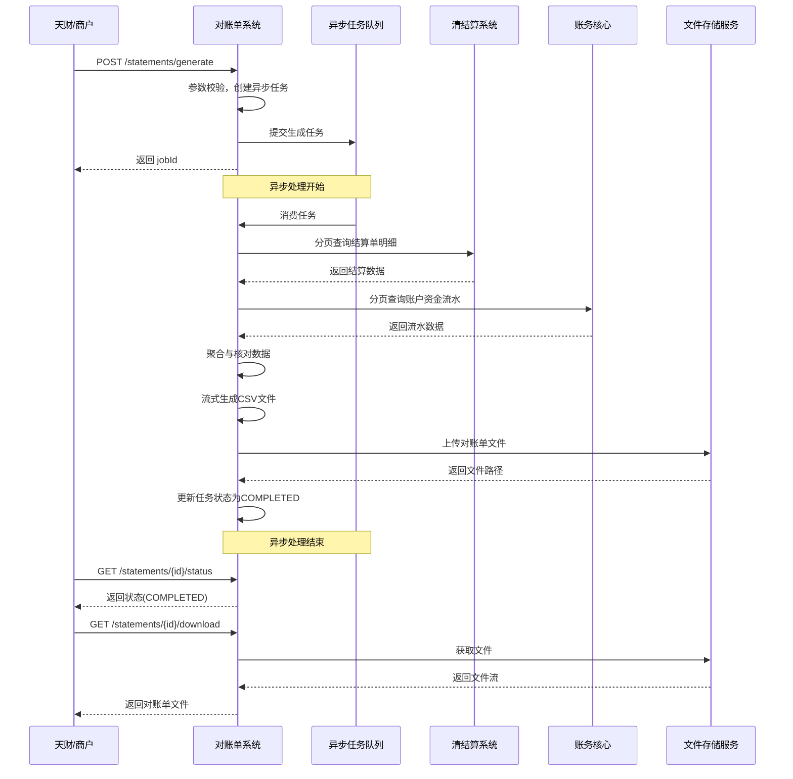
```mermaid
sequenceDiagram
    participant A as 天财/商户
    participant B as 对账单系统
    participant Queue as 异步任务队列
    participant C as 清结算系统
    participant D as 账务核心
    participant Storage as 文件存储服务

    A->>B: POST /statements/generate
    B->>B: 参数校验，创建异步任务
    B->>Queue: 提交生成任务
    B-->>A: 返回 jobId

    Note over Queue,B: 异步处理开始
    Queue->>B: 消费任务
    B->>C: 分页查询结算单明细
    C-->>B: 返回结算数据
    B->>D: 分页查询账户资金流水
    D-->>B: 返回流水数据
    B->>B: 聚合与核对数据
    B->>B: 流式生成CSV文件
    B->>Storage: 上传对账单文件
    Storage-->>B: 返回文件路径
    B->>B: 更新任务状态为COMPLETED
    Note over Queue,B: 异步处理结束

    A->>B: GET /statements/{id}/status
    B-->>A: 返回状态(COMPLETED)
    A->>B: GET /statements/{id}/download
    B->>Storage: 获取文件
    Storage-->>B: 返回文件流
    B-->>A: 返回对账单文件
```
### 6. 错误处理
- **预期错误情况**：
    1.  上游服务（清结算、账务核心）不可用或超时。
    2.  查询参数不合法（如日期格式错误、账户不存在）。
    3.  对账单生成过程中文件存储服务异常。
    4.  数据核对不一致，账实不符。
    5.  异步任务处理超时。
- **处理策略**：
    - 对上游依赖调用设置连接超时和读取超时，并配置重试机制（带指数退避）。
    - 对输入参数进行严格校验，无效请求立即返回4xx错误。
    - 文件存储异常时，记录错误日志并告警，任务状态标记为“失败”。
    - 数据核对异常时，在对账单文件中添加显式警告标记，并记录详细差异日志供运营核查，任务状态标记为“完成（有警告）”。
    - 异步任务设置全局超时时间，超时后任务状态标记为“超时失败”。

### 7. 依赖关系
- **上游模块**：
    - 清结算系统：提供结算单和交易明细数据。
    - 账务核心：提供账户会计分录（资金流水）数据。
    - （可选）业务核心：TBD，作为可能的原始交易数据源。
- **下游模块**：
    - 天财：通过API查询和下载对账单。
    - 内部运营平台：消费对账单数据或文件。
    - 文件存储服务：存储生成的对账单文件。

<a id="module-10"></a>

## 3.10 业务核心


### 1. 概述
- **目的与范围**: 业务核心模块负责接收和处理来自“天财”的分账交易数据。它是连接外部业务方与内部清结算、账户等系统的中枢，负责交易请求的接收、路由、状态管理及结果返回。其边界止于将处理后的交易指令传递给下游系统，并接收下游系统的处理结果。

### 2. 接口设计
- **API端点 (REST/GraphQL)**: 提供 RESTful API 端点，如 `POST /api/v1/split` 用于处理分账请求。
- **请求/响应结构**: 请求体包含机构号、APPID、业务类型（归集/会员结算/批量付款）、付款方信息、收款方列表、金额、请求流水号等字段。响应体包含处理状态码、业务流水号、处理结果或错误信息。
- **发布/消费的事件**: 消费上游“天财”的请求事件。在处理关键状态变更（如交易创建、处理成功、处理失败）时，发布内部事件供其他模块（如监控、对账）订阅。

### 3. 数据模型
- **表/集合**: 核心表包括 `transaction_request`（交易请求记录表）和 `idempotency_token`（幂等令牌表）。
- **关键字段**:
    - `transaction_request`: 请求流水号、机构号、APPID、业务类型、付款方账户、收款方信息、金额、状态（待处理/处理中/成功/失败）、创建时间、更新时间、错误码、下游系统响应。
    - `idempotency_token`: 幂等键（由机构号+请求流水号生成）、对应的业务流水号、创建时间、过期时间。
- **与其他模块的关系**: 业务核心模块处理的数据与“天财”的请求直接相关，处理后需传递给“清结算”或“行业钱包”等系统执行。`transaction_request` 表记录与下游系统交互的完整链路。

### 4. 业务逻辑
- **核心工作流/算法**: 接收天财的分账请求，验证基础参数（如机构号、APPID），根据业务场景（如归集、会员结算、批量付款）将请求转换为内部系统可识别的指令，并调用相应下游系统（如清结算系统执行转账、行业钱包处理关系绑定校验）进行处理。
- **业务规则与验证**: 验证请求的合法性，包括但不限于商户状态（是否被冻结）、账户状态、分账关系是否已绑定、付款方是否已“开通付款”等。
- **关键边界情况处理**:
    - **幂等性处理**: 基于请求中的机构号和请求流水号生成唯一幂等键。在处理请求前，先查询 `idempotency_token` 表。若已存在且未过期，则直接返回已记录的业务结果，避免重复处理。
    - **下游失败重试策略**: 对于清结算、行业钱包等下游系统的可重试错误（如网络超时、暂时性服务不可用），采用指数退避策略进行有限次重试（如最多3次）。对于明确的业务失败（如账户余额不足、关系未绑定），则不重试，直接失败。
    - **交易状态管理与补偿**: 维护交易状态机（待处理 -> 处理中 -> 成功/失败）。在调用下游系统前，将状态置为“处理中”并持久化。若下游调用最终失败，将状态更新为“失败”并记录错误原因。对于涉及多个步骤的复杂交易，若部分步骤成功，需记录上下文，并触发补偿流程（如调用清结算的冲正接口）或告警人工干预。

### 5. 时序图

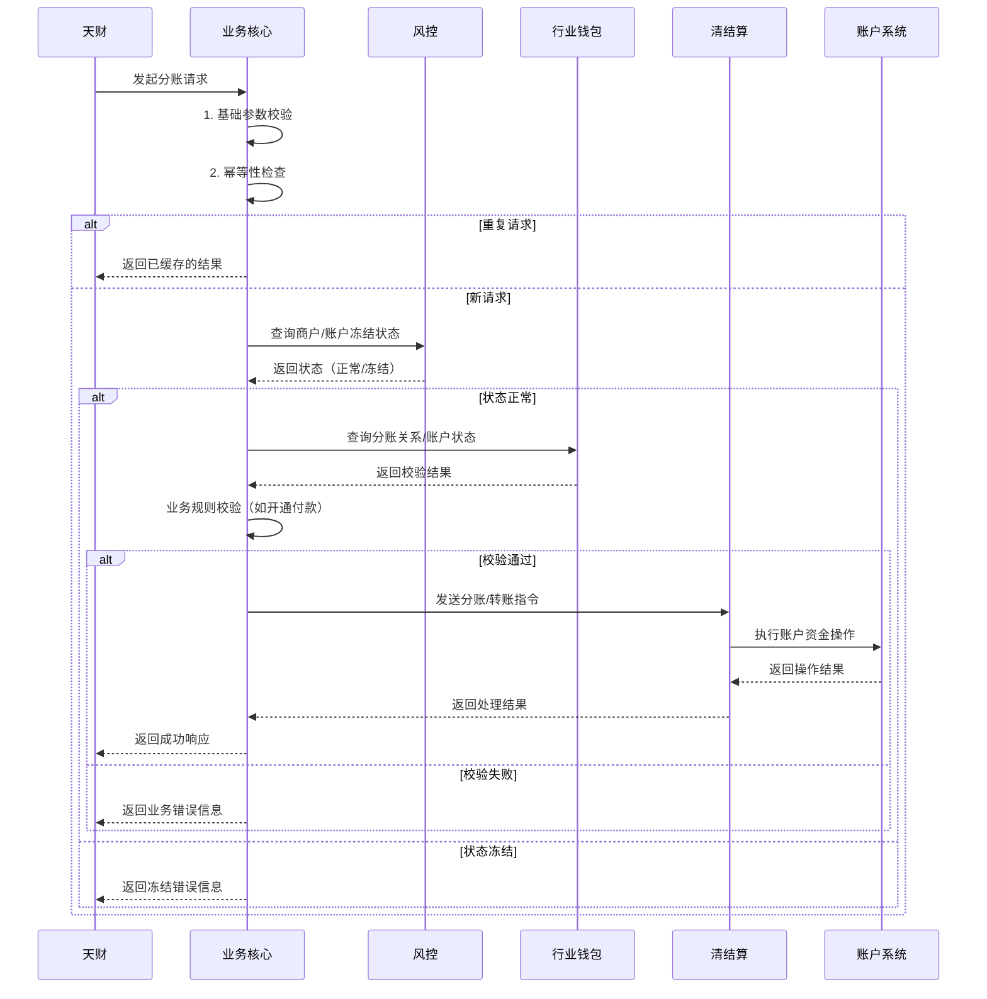
```mermaid
sequenceDiagram
    participant 天财
    participant 业务核心
    participant 风控
    participant 行业钱包
    participant 清结算
    participant 账户系统

    天财->>业务核心: 发起分账请求
    业务核心->>业务核心: 1. 基础参数校验
    业务核心->>业务核心: 2. 幂等性检查
    alt 重复请求
        业务核心-->>天财: 返回已缓存的结果
    else 新请求
        业务核心->>风控: 查询商户/账户冻结状态
        风控-->>业务核心: 返回状态（正常/冻结）
        alt 状态正常
            业务核心->>行业钱包: 查询分账关系/账户状态
            行业钱包-->>业务核心: 返回校验结果
            业务核心->>业务核心: 业务规则校验（如开通付款）
            alt 校验通过
                业务核心->>清结算: 发送分账/转账指令
                清结算->>账户系统: 执行账户资金操作
                账户系统-->>清结算: 返回操作结果
                清结算-->>业务核心: 返回处理结果
                业务核心-->>天财: 返回成功响应
            else 校验失败
                业务核心-->>天财: 返回业务错误信息
            end
        else 状态冻结
            业务核心-->>天财: 返回冻结错误信息
        end
    end
```

### 6. 错误处理
- **预期错误情况**: 请求参数错误、商户/账户被冻结、分账关系未绑定、付款方未开通付款、下游系统（如清结算、行业钱包）服务异常、网络超时。
- **处理策略**:
    - 对于参数和业务规则错误，立即返回明确的错误码和描述。
    - 对于下游系统异常，根据错误类型区分处理：对网络超时等可重试错误，执行指数退避重试；对明确的业务逻辑错误，不重试，直接失败。
    - 所有错误及处理过程均记录详细日志，并更新 `transaction_request` 表状态，用于对账和人工干预。

### 7. 依赖关系
- **上游模块**: 天财（业务请求方）。
- **下游模块**: 风控（用于商户/账户冻结状态校验）、行业钱包（用于关系与账户校验）、清结算系统（用于执行资金划转）、账户系统（通过清结算间接依赖）。

<a id="module-11"></a>

## 3.11 风控


### 1. 概述
- **目的与范围**: 本模块负责对商户及交易进行风险判定，并据此发起资金冻结操作。核心职责包括接收风险判定请求、执行风险规则、发起商户冻结和交易冻结流程。其边界在于风险规则的制定与判定，以及冻结指令（请求/命令）的发起，不涉及具体的账户资金操作执行。冻结操作的实际执行由下游清结算系统和账户系统完成。

### 2. 接口设计
- **API端点 (REST/GraphQL)**:
    - `POST /api/v1/risk/assessment`: 接收风险判定请求。
    - `GET /api/v1/risk/freeze-orders/{freezeOrderId}`: 查询冻结指令状态。
    - `POST /api/v1/risk/rules`: 创建风险规则（管理接口）。
    - `PUT /api/v1/risk/rules/{ruleId}`: 更新风险规则（管理接口）。
- **请求/响应结构**:
    - 风险判定请求 (`POST /api/v1/risk/assessment`):
        - 请求体: `{ “requestId”: “string”, “type”: “MERCHANT”|”TRANSACTION”, “entityId”: “string”, “data”: {} }`
        - 响应体: `{ “requestId”: “string”, “riskLevel”: “HIGH”|”MEDIUM”|”LOW”, “decision”: “FREEZE”|”PASS”, “freezeOrderId”: “string|null” }`
    - 冻结指令状态查询响应: `{ “freezeOrderId”: “string”, “status”: “PENDING”|”SUCCESS”|”FAILED”, “detail”: “string” }`
- **发布/消费的事件**:
    - 消费事件: TBD（例如来自业务核心的交易创建事件、来自监控系统的告警事件）。
    - 发布事件: `MerchantFreezeRequestedEvent`, `TransactionFreezeRequestedEvent`。

### 3. 数据模型
- **表/集合**:
    - `risk_events`: 风险事件记录表。
    - `risk_rules`: 风险规则配置表。
    - `freeze_orders`: 冻结指令记录表。
- **关键字段**:
    - `risk_events`: `id`, `request_id`, `entity_type`, `entity_id`, `trigger_data`, `risk_score`, `decision`, `created_at`。
    - `risk_rules`: `id`, `name`, `rule_type`, `condition`, `action`, `threshold`, `is_active`, `updated_at`。
    - `freeze_orders`: `id`, `order_no`, `entity_type`, `entity_id`, `freeze_type`, `status`, `request_data`, `response_data`, `retry_count`, `created_at`, `updated_at`。
- **与其他模块的关系**: 风控模块的风险判定结果会触发对清结算系统、账户系统等模块的调用，以执行冻结操作。`freeze_orders` 表通过 `entity_id` 关联商户或交易实体。

### 4. 业务逻辑
- **核心工作流/算法**:
    1.  接收来自业务核心、清结算系统或其他监控渠道（如内部审计日志告警）的风险事件或判定请求。
    2.  根据预设的风险规则模型（如交易频次、金额、商户行为模式等）进行风险评分或判定。规则引擎加载活跃规则，对输入数据进行匹配和计算。
    3.  若判定风险成立，则根据风险类型（商户级或交易级）生成幂等的冻结指令，并调用下游清结算系统接口发起相应的冻结流程。
    4.  异步监听或主动查询冻结指令的执行状态，并更新本地记录。
- **业务规则与验证**: 规则包括但不限于：商户交易行为异常检测（如短时间内高频交易）、单笔/累计交易金额阈值、关联账户风险传导等。验证逻辑需确保冻结指令的准确性和必要性，避免误判。
- **关键边界情况处理**:
    1.  对已冻结的商户或交易重复发起冻结请求的处理：通过幂等键（`requestId` 或 `freezeOrderId`）保证请求幂等性，返回已有处理结果。
    2.  风险判定所需数据不完整或延迟时的处理策略：配置规则降级策略或等待超时，记录数据缺失事件。
    3.  冻结指令发出后，下游系统执行失败或超时的补偿与通知机制：实现带指数退避的自动重试机制（记录于 `retry_count`），达到最大重试次数后标记为失败并触发告警，支持人工介入。定期与下游系统对账，以发现并修复状态不一致。
- **性能、安全与审计**:
    - 规则引擎需支持高效匹配，考虑对高频规则进行索引优化或缓存。
    - 所有风险判定请求、规则命中、冻结指令的发起与结果均需记录详细审计日志，满足数据留存要求。
    - 处理敏感风险数据时，需遵守数据隐私和安全规范，对日志中的敏感信息进行脱敏。

### 5. 时序图

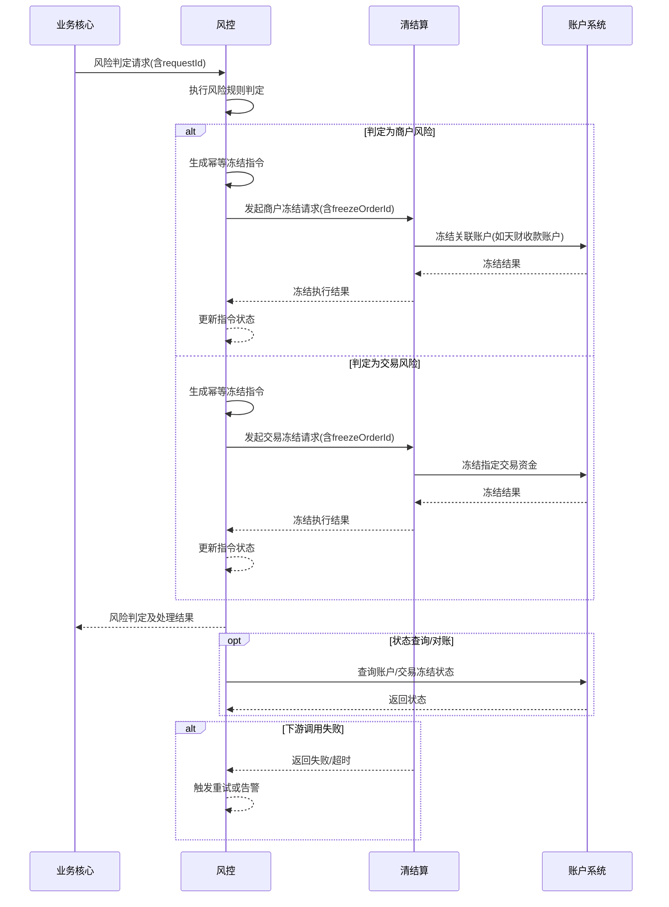
```mermaid
sequenceDiagram
    participant 业务核心
    participant 风控
    participant 清结算
    participant 账户系统

    业务核心->>风控: 风险判定请求(含requestId)
    风控->>风控: 执行风险规则判定
    alt 判定为商户风险
        风控->>风控: 生成幂等冻结指令
        风控->>清结算: 发起商户冻结请求(含freezeOrderId)
        清结算->>账户系统: 冻结关联账户(如天财收款账户)
        账户系统-->>清结算: 冻结结果
        清结算-->>风控: 冻结执行结果
        风控-->>风控: 更新指令状态
    else 判定为交易风险
        风控->>风控: 生成幂等冻结指令
        风控->>清结算: 发起交易冻结请求(含freezeOrderId)
        清结算->>账户系统: 冻结指定交易资金
        账户系统-->>清结算: 冻结结果
        清结算-->>风控: 冻结执行结果
        风控-->>风控: 更新指令状态
    end
    风控-->>业务核心: 风险判定及处理结果
    opt 状态查询/对账
        风控->>账户系统: 查询账户/交易冻结状态
        账户系统-->>风控: 返回状态
    end
    alt 下游调用失败
        清结算-->>风控: 返回失败/超时
        风控-->>风控: 触发重试或告警
    end
```

### 6. 错误处理
- **预期错误情况**:
    1.  风险判定服务不可用。
    2.  规则引擎执行错误（如规则语法错误）。
    3.  向下游系统（清结算）发起冻结请求失败或超时。
    4.  接收到的风险数据格式错误或无效。
    5.  与下游系统状态不一致。
- **处理策略**:
    1.  对关键服务依赖（如规则引擎、数据库）进行健康检查与熔断。
    2.  冻结指令发送失败时，根据 `freezeOrderId` 进行幂等重试，采用指数退避策略，记录日志并触发告警。
    3.  对无效请求返回明确的错误码和描述。
    4.  建立定期对账任务，比对风控模块的 `freeze_orders` 状态与下游系统的实际状态，发现不一致时触发修复流程或告警。

### 7. 依赖关系
- **上游模块**: 业务核心（触发交易风险判定）、清结算系统（可能提供交易数据或触发风险检查）。
- **下游模块**: 清结算系统（执行商户冻结、交易冻结的资金操作命令）。账户系统（风控模块可通过清结算间接查询状态，或直接查询以进行对账）。

<a id="module-12"></a>

## 3.12 交易系统


### 1. 概述
- **目的与范围**: 本模块负责接收和处理天财分账交易数据，是业务处理的核心入口。其核心职责是接收来自天财的分账请求，进行初步校验，并协调后续的分账、结算等业务流程。其边界止于将处理请求分发至行业钱包、清结算等下游系统，不涉及具体的账户操作、记账或风控逻辑。

### 2. 接口设计
- **API端点 (REST/GraphQL)**: TBD
- **请求/响应结构**: TBD
- **发布/消费的事件**: TBD

### 3. 数据模型
- **表/集合**: TBD
- **关键字段**: TBD
- **与其他模块的关系**: 接收天财的分账交易数据，处理后调用行业钱包、清结算等模块。

### 4. 业务逻辑
- **核心工作流/算法**:
    1.  接收天财的分账请求。
    2.  基础数据校验（机构号、APPID、报文格式）。
    3.  幂等性校验（检查请求ID是否已处理）。
    4.  检查风控状态（根据风控指令判断交易是否被冻结）。
    5.  调用行业钱包处理分账请求。
    6.  根据处理结果响应天财。
- **业务规则与验证**:
    1.  验证请求来源（机构号、APPID）的合法性。
    2.  校验请求报文格式。
    3.  确保交易数据符合天财分账业务的基本规则。
    4.  检查请求ID，防止重复处理。
    5.  检查商户或交易是否被风控冻结。
- **关键边界情况处理**:
    1.  **处理重复请求**: 通过校验请求ID实现幂等性，若请求ID已存在且处理成功，则直接返回成功结果；若处理中，则返回处理中状态；若处理失败，则根据规则决定是否重试。
    2.  **处理下游系统调用异常**: 对行业钱包、清结算等下游系统的调用设置超时和重试机制。根据下游返回的错误码决定是重试还是立即失败。
    3.  **处理风控冻结指令**: 在调用下游系统前，查询风控状态。若商户或交易被冻结，则直接拒绝交易，并返回相应的错误码和描述。

### 5. 时序图

```mermaid
sequenceDiagram
    participant T as 天财
    participant B as 业务核心
    participant W as 行业钱包

    T->>B: 发起分账请求
    B->>B: 基础校验（机构号、APPID）
    B->>B: 幂等性校验（请求ID）
    B->>B: 检查风控状态
    alt 校验通过
        B->>W: 调用分账处理
        W-->>B: 返回分账结果
        B-->>T: 响应分账请求（成功/失败）
    else 校验失败
        B-->>T: 响应分账请求（失败，含错误码）
    end
```

### 6. 错误处理
- **预期错误情况**:
    1.  请求参数校验失败（机构号、APPID、格式错误）。
    2.  重复请求（请求ID已处理）。
    3.  交易被风控冻结。
    4.  下游系统（行业钱包、清结算）服务不可用或返回业务失败。
    5.  网络超时。
    6.  系统内部异常。
- **处理策略**:
    1.  参数错误、重复请求、风控冻结等业务校验失败，立即返回明确的错误码和描述。
    2.  下游系统失败，根据其返回的错误码决定是重试还是返回失败。
    3.  网络超时或系统内部异常，记录详细错误日志，返回系统繁忙或处理失败。
    4.  所有错误情况均需记录日志，用于问题排查和监控。

### 7. 依赖关系
- **上游模块**: 天财（业务请求方）
    -   **交互方式**: 通过API接口接收分账请求。
    -   **依赖内容**: 请求报文格式、机构号、APPID、业务规则。
- **下游模块**:
    -   **行业钱包**:
        -   **交互方式**: 同步调用其分账处理接口。
        -   **依赖内容**: 分账处理能力、计费校验、账户关系验证。
    -   **清结算系统**:
        -   **交互方式**: 间接依赖（通过行业钱包调用）。业务核心不直接调用清结算。
        -   **依赖内容**: 清分、结算能力。
    -   **风控**:
        -   **交互方式**: 同步查询接口或订阅风控事件。
        -   **依赖内容**: 商户冻结状态、交易冻结指令。

<a id="module-13"></a>

## 3.13 代付系统


### 1. 概述
- **目的与范围**: 本模块负责处理从天财收款账户向外部收款方（如供应商）进行资金划转的业务，核心场景为批量付款。其边界包括接收付款指令、执行资金转账、处理手续费、更新状态，并与相关系统交互完成身份验证、计费、账务记录等。不涉及分账、归集、会员结算等内部资金分配流程。
- **关键实体澄清**: “天财”在本模块上下文中，指通过API发起批量付款请求的**业务方系统**，而非最终用户。

### 2. 接口设计
- **API端点 (REST)**:
    - `POST /v1/batch-payments`: 创建并提交批量付款批次。
    - `GET /v1/batch-payments/{batchId}`: 查询批量付款批次状态及详情。
    - `GET /v1/batch-payments/{batchId}/items`: 查询批次内所有付款明细项状态。
- **关键请求/响应字段**:
    - 创建批次请求 (`POST /v1/batch-payments`):
        - `requestId` (String): 请求唯一标识，用于幂等。
        - `payerMerchantId` (String): 付方收单商户ID（总部或门店）。
        - `payerAccountNo` (String): 付方天财收款账户号。
        - `feeMode` (String): 计费模式，枚举值：`NET`（净额）, `GROSS`（全额-付方承担）, `GROSS_RECEIVER`（全额-收方承担）。
        - `items` (Array): 付款明细列表，每个明细包含 `payeeAccountNo`（收款方账户号）、`amount`（金额，单位：分）、`remark`（备注）等。
    - 创建批次响应:
        - `batchId` (String): 系统生成的批次唯一标识。
        - `status` (String): 批次状态，如 `PROCESSING`, `PARTIAL_SUCCESS`, `SUCCESS`, `FAILED`。
- **发布/消费的事件**:
    - 消费事件: `AccountFrozenEvent` (账户冻结事件)，由风控系统发布，包含 `accountNo`（账户号）和 `freezeType`（冻结类型，如 `MERCHANT_FREEZE`）。
    - 发布事件: `PaymentCompletedEvent` (付款完成事件)，包含 `batchId`, `status`, `totalAmount`, `successCount`, `failCount`。

### 3. 数据模型
- **核心表/集合**:
    - `payment_batch` (付款批次表):
        - `batch_id` (PK): 批次ID。
        - `request_id` (UK): 外部请求ID，用于幂等。
        - `payer_merchant_id`: 付方商户ID。
        - `payer_account_no`: 付方天财收款账户号。
        - `fee_mode`: 计费模式。
        - `total_amount`: 批次总金额。
        - `total_fee`: 批次总手续费。
        - `status`: 批次状态。
        - `create_time`, `update_time`: 创建与更新时间。
    - `payment_item` (付款明细表):
        - `item_id` (PK): 明细项ID。
        - `batch_id` (FK): 关联的批次ID。
        - `payee_account_no`: 收款方账户号。
        - `amount`: 付款金额。
        - `fee`: 该笔手续费。
        - `status`: 明细状态（如 `PENDING`, `SUCCESS`, `FAILED`）。
        - `fail_reason`: 失败原因。
        - `accounting_voucher_no`: 关联的记账凭证号。
        - `create_time`, `update_time`: 创建与更新时间。
    - `compensation_log` (冲正/补偿日志表):
        - `log_id` (PK): 日志ID。
        - `batch_id`: 关联的批次ID。
        - `item_id`: 关联的明细项ID（如为单笔冲正）。
        - `compensation_type`: 冲正类型（如 `REVERSE_TRANSFER`, `REVERSE_ACCOUNTING`）。
        - `target_system`: 目标系统（如 `ACCOUNT`, `ACCOUNTING`）。
        - `request_body`: 冲正请求内容。
        - `response_body`: 冲正响应结果。
        - `status`: 冲正执行状态（`INIT`, `SENT`, `SUCCESS`, `FAILED`）。
        - `create_time`, `update_time`: 创建与更新时间。
- **与其他模块的关系**: 依赖**账户系统**执行账户扣款与入账（通过账户号关联），依赖**账务核心**完成记账（通过凭证号关联），依赖**计费中台**计算手续费。

### 4. 业务逻辑
- **核心工作流/算法**: 处理批量付款请求。流程包括：验证付方（总部/门店）是否已完成“开通付款”流程（含关系绑定、协议签署等）、校验付方天财收款账户状态与余额、调用计费中台计算手续费（支持净额或全额模式）、调用账户系统执行转账、触发账务核心记账、更新付款状态。
- **业务规则与验证**:
    1.  付方必须为已完成“开通付款”流程的收单商户（总部或门店）。通过调用**电子签约平台**的 `GET /api/merchant/{merchantId}/payment-authorization` 接口进行校验，该接口返回授权状态及协议ID。
    2.  付款资金必须来自付方的天财收款账户。
    3.  需校验付方账户状态是否正常（非冻结）。通过监听 `AccountFrozenEvent` 事件实时更新本地缓存/状态，并在交易执行前进行校验。
    4.  需校验账户余额是否充足（含手续费）。通过调用**账户系统**的查询余额接口进行校验。
    5.  收款方账户（天财接收方账户）状态需正常。通过调用**账户系统**的查询账户状态接口进行校验。
- **关键边界情况处理**:
    1.  **风控冻结处理**: 系统订阅 `AccountFrozenEvent` 事件。当收到付方账户的 `MERCHANT_FREEZE` 事件时，立即更新本地账户状态为冻结。对于处理中的交易，在调用账户系统前进行状态检查，若冻结则中止该笔及批次后续交易。对于已发起扣款但未完成的交易，进入冲正流程。
    2.  **下游系统调用失败**: 调用账户系统、账务核心等超时或失败，采用有限次数的指数退避重试。对于账户不存在等业务性错误，直接标记失败，不重试。
    3.  **部分成功与冲正**: 采用Saga模式管理分布式事务。若调用账户系统扣款成功，但后续记账失败，则触发冲正流程，向账户系统发起反向转账以回滚资金，并记录冲正日志。
    4.  **并发控制**: 在批次和单笔处理层面使用乐观锁（通过版本号）或数据库行锁，防止对同一账户余额的并发操作导致超额扣款。

### 5. 时序图
```mermaid
sequenceDiagram
    participant 天财 as 天财(业务方)
    participant 代付系统
    participant 电子签约平台
    participant 账户系统
    participant 计费中台
    participant 账务核心

    天财->>代付系统: POST /v1/batch-payments
    代付系统->>代付系统: 幂等校验 & 请求参数校验
    代付系统->>电子签约平台: GET 付方付款授权状态
    alt 未授权
        电子签约平台-->>代付系统: 返回未授权
        代付系统-->>天财: 返回失败(错误码: PAYER_NOT_AUTHORIZED)
    else 已授权
        电子签约平台-->>代付系统: 返回已授权
        代付系统->>账户系统: 查询付方账户状态与余额
        账户系统-->>代付系统: 返回账户状态与余额
        alt 账户异常或余额不足
            代付系统-->>天财: 返回失败(错误码: ACCOUNT_INVALID/INSUFFICIENT_BALANCE)
        else 状态正常且余额充足
            代付系统->>计费中台: 请求计算批次总手续费
            计费中台-->>代付系统: 返回手续费金额
            loop 处理每笔付款项
                代付系统->>账户系统: 执行单笔转账(付方->收方)
                alt 转账成功
                    账户系统-->>代付系统: 返回成功
                    代付系统->>账务核心: 触发该笔记账
                    alt 记账成功
                        账务核心-->>代付系统: 返回成功
                        代付系统->>代付系统: 更新该笔状态为SUCCESS
                    else 记账失败
                        账务核心-->>代付系统: 返回失败
                        代付系统->>代付系统: 记录冲正任务(反向转账)
                        代付系统->>代付系统: 更新该笔状态为FAILED
                    end
                else 转账失败
                    账户系统-->>代付系统: 返回失败(如:账户不存在)
                    代付系统->>代付系统: 更新该笔状态为FAILED
                end
            end
            代付系统->>代付系统: 汇总更新批次状态
            代付系统-->>天财: 返回批次处理结果(含成功/失败笔数)
        end
    end

    Note over 代付系统,账户系统: 异步冲正流程
    代付系统->>账户系统: 执行冲正转账(收方->付方)
    账户系统-->>代付系统: 返回冲正结果
    代付系统->>代付系统: 更新冲正日志状态
```

### 6. 错误处理
- **预期错误情况**:
    1.  付方未开通付款权限 (`PAYER_NOT_AUTHORIZED`)。
    2.  付方或收方账户状态异常 (`ACCOUNT_FROZEN`, `ACCOUNT_CLOSED`)。
    3.  付方账户余额不足 (`INSUFFICIENT_BALANCE`)。
    4.  计费中台服务不可用或返回错误 (`FEE_CALCULATION_ERROR`, `FEE_SERVICE_UNAVAILABLE`)。
    5.  账户系统转账失败 (`ACCOUNT_TRANSFER_FAILED`, `PAYEE_ACCOUNT_NOT_EXIST`)。
    6.  账务核心记账失败 (`ACCOUNTING_FAILED`)。
    7.  网络超时 (`NETWORK_TIMEOUT`)。
    8.  请求重复 (`DUPLICATE_REQUEST_ID`)。
- **处理策略**:
    1.  **业务校验错误**: 直接返回对应错误码，不进行重试。
    2.  **下游系统暂时性故障**: 对网络超时、服务暂时不可用等情况，采用指数退避策略进行重试（最多3次）。
    3.  **冲正机制**: 对于已扣款成功的交易，若后续步骤（如记账）失败，系统自动触发冲正流程。冲正请求记录在 `compensation_log` 中，由后台作业异步重试直至成功。冲正失败会告警，需人工介入。
    4.  **状态一致性**: 通过 `payment_batch` 和 `payment_item` 的状态机确保流程可追踪。任何步骤失败都会更新对应状态，并提供 `fail_reason`。
    5.  **监控与告警**: 对失败率、冲正失败、下游系统异常等设置监控指标和告警阈值。

### 7. 依赖关系
- **上游模块**:
    - **天财（业务方系统）**: 批量付款请求的发起方。
    - **电子签约平台**: 提供 `GET /api/merchant/{merchantId}/payment-authorization` 接口，用于校验付方“开通付款”授权状态。
    - **风控**: 发布 `AccountFrozenEvent` 事件，通知账户冻结状态变更。
- **下游模块**:
    - **计费中台**: 提供手续费计算接口。
    - **账户系统**: 提供账户状态查询、余额查询、资金转账接口。
    - **账务核心**: 提供记账凭证生成接口。
- **交互模式**:
    - 与**电子签约平台**、**计费中台**、**账户系统**、**账务核心**为同步API调用。
    - 与**风控**为异步事件订阅（消息队列）。

<a id="module-14"></a>

## 3.14 钱包APP/商服平台


### 1. 概述
- **目的与范围**：本模块是面向商户（总部、门店）和接收方（非收单商户、个人）的前端应用平台。其核心职责是为用户提供账户管理、交易查询、分账/转账操作、协议签署、认证流程（如打款验证、人脸验证）以及相关业务申请（如开通付款）的交互界面。它作为用户与后端系统交互的入口，主要负责界面展示、流程引导、数据收集以及前端状态管理，不处理核心业务规则（如计费、记账、风控判定）的计算与执行。
- **模块定位**：本模块是业务流程的发起者和用户交互的协调者，通过调用后端服务接口驱动业务流转，并根据后端返回的状态控制前端界面。

### 2. 接口设计
- **API端点 (REST/GraphQL)**：本模块作为前端应用，主要消费后端服务提供的RESTful API。关键接口类别包括：
    - **认证与权限**：从“三代”系统获取机构/商户令牌、用户角色及权限列表。
    - **账户服务**：从“行业钱包”查询天财收款账户、天财接收方账户的余额、状态及列表。
    - **交易服务**：向“行业钱包”提交分账/转账请求；从“清结算系统”或“业务核心”查询历史交易、结算记录。
    - **协议与认证**：从“电子签约平台”获取协议签署H5页面URL及签约流水号；查询签约状态。
    - **业务开通**：向“行业钱包”提交开通付款能力申请，并获取后续引导流程。
    - **文件服务**：从“对账单系统”获取对账单下载链接。
- **请求/响应结构**：TBD（需根据具体后端API文档定义）。
- **发布/消费的事件**：本模块主要消费后端服务通过Webhook或轮询方式推送的状态变更事件，如：协议签署完成事件、账户状态变更事件、交易处理结果事件。模块本身不发布业务事件。

### 3. 数据模型
- **前端状态模型**：本模块在前端（如Vuex/Pinia Store或React Context）维护以下状态，用于界面渲染和流程控制：
    - **用户会话**：包含`机构号`、`APPID`、`商户ID`、`用户角色`（总部、门店等）、`权限列表`、`令牌`。
    - **账户视图**：缓存当前用户可见的`账户列表`（含账户ID、类型、余额、状态）、`选中账户`信息。
    - **交易表单**：暂存用户正在填写的分账/转账请求数据（付方账户、收方账户、金额、备注等）。
    - **流程状态**：记录多步骤流程（如关系绑定、开通付款）的当前步骤、上下文数据（如签约流水号）及临时状态。
    - **界面状态**：控制加载中、错误提示、模态框显示等UI状态。
- **数据映射**：前端状态模型中的数据是对后端模块（如行业钱包、账户系统）数据视图的映射和适配，不独立持久化。数据转换在API调用响应处理层完成。

### 4. 业务逻辑
- **核心工作流/流程控制**：
    1.  **用户登录与鉴权流程**：引导用户输入凭证，调用“三代”系统接口进行身份验证，获取并存储用户角色与权限。
    2.  **权限校验与界面控制**：根据用户角色（总部/门店）和权限列表，动态渲染或禁用界面元素（如“发起归集”按钮仅总部可见且需具备相应权限）。
    3.  **关系绑定流程引导**：协调“电子签约平台”完成协议签署。保存签约流水号，监听签约结果回调或主动轮询状态，根据结果更新本地关系状态并引导下一步。
    4.  **分账/转账操作流程**：收集用户输入，进行前端格式校验，调用“行业钱包”提交请求。轮询或监听处理结果，更新交易状态。
    5.  **开通付款流程引导**：引导用户完成多步骤的签约与认证申请。管理流程步骤状态，在步骤间传递必要参数，调用不同后端服务（行业钱包、电子签约平台）。
    6.  **数据查询与展示流程**：调用相应后端接口获取账户、交易数据，进行前端格式化（如金额、日期）后展示。
- **业务规则与验证**：
    - **前端校验**：对用户输入进行即时格式校验（金额为正数、账户号格式、必填项）。
    - **操作权限控制**：基于从“三代”获取的权限列表，在界面层控制操作入口的可见性与可用性。例如：校验“门店发起归集”权限是否存在。
    - **状态依赖控制**：根据从后端查询的账户状态（冻结、正常）、关系绑定状态，控制相关操作按钮的禁用/启用及提示信息。
- **前端状态管理策略**：
    - 对于多步骤流程，使用前端路由参数或状态管理库持久化流程步骤和上下文，支持浏览器刷新后流程恢复。
    - 对高频查询数据（如账户余额）实施短期缓存与定时刷新策略。
    - 表单数据在页面组件卸载前进行本地暂存，提升用户体验。

### 5. 时序图

#### 5.1 关系绑定流程时序图
```mermaid
sequenceDiagram
    participant 商户 as 商户(总部)
    participant APP as 钱包APP/商服平台
    participant 三代 as 三代系统
    participant 签约 as 电子签约平台
    participant 钱包 as 行业钱包

    商户->>APP: 1. 访问关系绑定页面
    APP->>三代: 2. 获取用户权限
    三代-->>APP: 3. 返回权限列表
    APP->>APP: 4. 校验“发起绑定”权限
    APP->>签约: 5. 请求协议签署H5页面
    签约-->>APP: 6. 返回URL及签约流水号
    APP->>APP: 7. 保存流水号至流程状态
    APP-->>商户: 8. 跳转至H5签约页面
    商户->>签约: 9. 在H5页面完成签署与认证
    签约->>签约: 10. 执行打款/人脸验证
    签约-->>商户: 11. 提示签约成功
    商户->>APP: 12. 返回APP
    APP->>钱包: 13. 轮询关系绑定状态
    钱包-->>APP: 14. 返回绑定成功
    APP->>APP: 15. 更新本地关系状态
    APP-->>商户: 16. 展示绑定成功，启用分账
```

#### 5.2 分账/转账操作时序图
```mermaid
sequenceDiagram
    participant 商户 as 商户(总部)
    participant APP as 钱包APP/商服平台
    participant 三代 as 三代系统
    participant 钱包 as 行业钱包
    participant 清结算 as 清结算系统

    商户->>APP: 1. 填写分账表单
    APP->>APP: 2. 前端格式校验
    APP->>三代: 3. 校验操作权限
    三代-->>APP: 4. 权限校验通过
    APP->>钱包: 5. 提交分账请求
    钱包-->>APP: 6. 返回受理成功，交易流水号
    APP->>APP: 7. 保存流水号，展示处理中
    APP->>钱包: 8. 轮询交易结果
    钱包->>清结算: 9. 处理交易（异步）
    清结算-->>钱包: 10. 处理完成
    钱包-->>APP: 11. 返回交易结果（成功/失败）
    APP->>APP: 12. 更新本地交易状态
    APP-->>商户: 13. 展示交易结果
```

### 6. 错误处理
- **预期错误情况**：
    - 网络异常、后端服务超时或不可用。
    - 用户输入数据格式错误。
    - 后端返回的业务逻辑错误（余额不足、关系未绑定、账户冻结、权限不足）。
    - 认证流程失败（打款验证金额错误、人脸比对失败）。
- **处理策略**：
    - **网络与服务器错误**：采用指数退避策略进行API调用重试（如最多3次）。超过重试次数后，展示统一网络错误页面，提供“重试”按钮。
    - **用户输入错误**：在表单提交时进行即时校验并提示，阻止无效请求发出。
    - **业务逻辑错误**：拦截后端返回的错误码，映射为友好的用户提示信息。对于状态类错误（如未绑定），引导用户进入对应流程（如关系绑定）。
    - **流程中断与恢复**：对于多步骤流程，将关键进度和参数持久化。当流程因错误中断后，用户重新进入时可恢复至最近步骤。
    - **全局错误边界**：使用前端框架错误边界组件捕获渲染错误，降级展示备用UI。

### 7. 依赖关系
- **上游模块（依赖方）**：
    - **三代系统**：**关键依赖**。提供用户身份认证、机构校验、以及基于角色的操作权限控制。
    - **行业钱包**：**核心依赖**。提供账户查询、关系绑定状态查询、分账/转账请求提交、开通付款申请受理等接口。
    - **电子签约平台**：**核心依赖**。提供协议签署H5页面、签约状态查询及认证流程集成。
    - **清结算系统**：提供交易记录、结算单的查询接口。
    - **业务核心**：提供天财分账交易数据的查询接口。
    - **对账单系统**：提供对账单下载链接或文件流。
    - **账户系统**：通过行业钱包间接依赖，获取底层账户状态。
- **下游模块**：本模块为前端展示与流程引导层，无其他业务模块依赖其输出。用户通过本模块的操作直接触发上游模块的业务流程。

---
# 4 接口设计
## 4.1 对外接口
系统对外部业务方（如天财）暴露的接口。

| Method | Path | Module | Description | Request/Response |
| :--- | :--- | :--- | :--- | :--- |
| POST | /api/v1/institution/create | 三代 | 接收天财提交的机构开户申请。 | TBD |
| POST | /api/v1/audit/submit | 三代 | 提交业务审核（开户、关系绑定）。 | TBD |
| GET | /api/v1/audit/result/{auditNo} | 三代 | 查询审核结果。 | TBD |
| POST | /api/v1/split | 业务核心 | 用于处理分账请求。 | TBD |
| POST | /v1/batch-payments | 代付系统 | 创建并提交批量付款批次。 | TBD |
| GET | /v1/batch-payments/{batchId} | 代付系统 | 查询批量付款批次状态及详情。 | TBD |
| GET | /v1/batch-payments/{batchId}/items | 代付系统 | 查询批次内所有付款明细项状态。 | TBD |
| POST | /api/v1/statements/generate | 对账单系统 | 异步生成对账单。 | TBD |
| GET | /api/v1/statements | 对账单系统 | 查询对账单列表。 | TBD |
| GET | /api/v1/statements/{statementId}/download | 对账单系统 | 下载对账单文件。 | TBD |
| GET | /api/v1/statements/{statementId}/status | 对账单系统 | 查询对账单生成状态。 | TBD |

## 4.2 模块间接口
系统内部各模块之间相互调用的接口。

| Method | Path | Module | Description | Request/Response |
| :--- | :--- | :--- | :--- | :--- |
| POST | /api/v1/auth/validate | 三代 | （内部）接口调用鉴权验证。 | TBD |
| GET | /api/v1/institution/{institutionId}/permissions | 三代 | 查询机构接口权限。 | TBD |
| POST | /api/v1/settlement/process | 清结算 | 处理分账交易结算。 | TBD |
| POST | /api/v1/settlement/refund/deduct | 清结算 | 执行退货扣款。 | TBD |
| POST | /api/v1/settlement/freeze | 清结算 | 执行账户冻结。 | TBD |
| GET | /api/v1/settlement/statement/generate | 清结算 | 触发结算单生成。 | TBD |
| POST | /api/v1/signing/process | 电子签约平台 | 创建签约流程。 | TBD |
| GET | /api/v1/signing/process/{process_id} | 电子签约平台 | 查询签约流程状态。 | TBD |
| POST | /api/v1/signing/template | 电子签约平台 | 上传协议模板。 | TBD |
| POST | /api/v1/verification/payment | 认证系统 | 发起打款验证。 | TBD |
| POST | /api/v1/verification/face | 认证系统 | 发起人脸验证。 | TBD |
| GET | /api/v1/verification/result/{requestId} | 认证系统 | 查询验证结果。 | TBD |
| POST | /api/v1/fee/calculate | 计费中台 | 手续费计算接口。 | TBD |
| GET | /api/v1/fee/rules/{ruleId} | 计费中台 | 查询费率规则详情接口。 | TBD |
| POST | /api/v1/risk/assessment | 风控 | 接收风险判定请求。 | TBD |
| GET | /api/v1/risk/freeze-orders/{freezeOrderId} | 风控 | 查询冻结指令状态。 | TBD |
| POST | /api/v1/risk/rules | 风控 | 创建风险规则（管理接口）。 | TBD |
| PUT | /api/v1/risk/rules/{ruleId} | 风控 | 更新风险规则（管理接口）。 | TBD |
---
# 5 数据库设计
## 5.1 ER图
```mermaid
erDiagram
    institution_info {
        string institution_id PK
        string app_id
        string status
        string institution_name
    }
    app_auth {
        string app_id PK
        string institution_id FK
        string secret_key
    }
    api_permission {
        string id PK
        string institution_id FK
        string api_path
        string status
    }
    audit_record {
        string audit_no PK
        string institution_id FK
        string business_type
        string status
    }
    users {
        string user_id PK
        string institution_id FK
        string user_type
    }
    accounts {
        string account_id PK
        string user_id FK
        string account_type
        string status
        string institution_id FK
    }
    binding_relationships {
        string binding_id PK
        string payer_account_id FK
        string payee_account_id FK
        string status
    }
    split_requests {
        string request_id PK
        string payer_account_id FK
        string payee_account_id FK
        string amount
        string status
    }
    transaction_request {
        string request_id PK
        string institution_id FK
        string business_type
        string status
    }
    idempotency_token {
        string token PK
        string request_id FK
        string status
    }
    settlement_order {
        string settlement_id PK
        string request_id FK
        string account_id FK
        string amount
    }
    settlement_detail {
        string detail_id PK
        string settlement_id FK
        string account_id FK
        string amount
    }
    freeze_record {
        string freeze_id PK
        string account_id FK
        string freeze_type
        string status
    }
    refund_deduction {
        string deduction_id PK
        string account_id FK
        string amount
    }
    fee_rule {
        string rule_id PK
        string fee_type
        string rate
    }
    fee_transaction {
        string fee_id PK
        string request_id FK
        string amount
    }
    statement_jobs {
        string job_id PK
        string institution_id FK
        string statement_type
        string status
    }
    statement_metadata {
        string statement_id PK
        string job_id FK
        string file_path
    }
    risk_events {
        string event_id PK
        string institution_id FK
        string risk_level
    }
    risk_rules {
        string rule_id PK
        string rule_name
        string condition
    }
    freeze_orders {
        string freeze_order_id PK
        string event_id FK
        string target_type
        string status
    }
    agreement_template {
        string template_id PK
        string template_name
        string content
    }
    signing_process {
        string process_id PK
        string template_id FK
        string status
    }
    signing_party {
        string party_id PK
        string process_id FK
        string account_id FK
        string role
    }
    process_audit_log {
        string log_id PK
        string process_id FK
        string action
    }
    verification_request {
        string request_id PK
        string process_id FK
        string verification_type
        string status
    }
    payment_verification_detail {
        string detail_id PK
        string request_id FK
        string bank_account
        string amount
    }
    face_verification_detail {
        string detail_id PK
        string request_id FK
        string id_number
        string name
    }
    verification_audit_log {
        string log_id PK
        string request_id FK
        string action
    }
    payment_batch {
        string batch_id PK
        string institution_id FK
        string status
    }
    payment_item {
        string item_id PK
        string batch_id FK
        string payee_account_id FK
        string amount
        string status
    }
    compensation_log {
        string log_id PK
        string batch_id FK
        string item_id FK
        string action
    }

    institution_info ||--o{ app_auth : "has"
    institution_info ||--o{ api_permission : "grants"
    institution_info ||--o{ audit_record : "submits"
    institution_info ||--o{ users : "registers"
    institution_info ||--o{ accounts : "owns"
    institution_info ||--o{ transaction_request : "initiates"
    institution_info ||--o{ statement_jobs : "requests"
    institution_info ||--o{ risk_events : "triggers"
    institution_info ||--o{ payment_batch : "creates"
    users ||--o{ accounts : "has"
    accounts ||--o{ binding_relationships : "as_payer"
    accounts ||--o{ binding_relationships : "as_payee"
    accounts ||--o{ split_requests : "pays"
    accounts ||--o{ split_requests : "receives"
    accounts ||--o{ settlement_order : "involved_in"
    accounts ||--o{ settlement_detail : "involved_in"
    accounts ||--o{ freeze_record : "frozen"
    accounts ||--o{ refund_deduction : "deducted_from"
    accounts ||--o{ signing_party : "participates_as"
    accounts ||--o{ payment_item : "receives"
    transaction_request ||--o{ idempotency_token : "uses"
    transaction_request ||--o{ settlement_order : "triggers"
    transaction_request ||--o{ fee_transaction : "triggers"
    settlement_order ||--o{ settlement_detail : "contains"
    risk_events ||--o{ freeze_orders : "triggers"
    agreement_template ||--o{ signing_process : "used_by"
    signing_process ||--o{ signing_party : "involves"
    signing_process ||--o{ process_audit_log : "logs"
    signing_process ||--o{ verification_request : "initiates"
    verification_request ||--o{ payment_verification_detail : "details"
    verification_request ||--o{ face_verification_detail : "details"
    verification_request ||--o{ verification_audit_log : "logs"
    payment_batch ||--o{ payment_item : "contains"
    payment_batch ||--o{ compensation_log : "logs"
    payment_item ||--o{ compensation_log : "logs"
    statement_jobs ||--o{ statement_metadata : "generates"
```

## 5.2 表结构

| 表名 | 所属模块 | 主要字段（简述） | 关联关系（简述） |
| :--- | :--- | :--- | :--- |
| institution_info | 三代 | 机构ID (PK), APPID, 状态, 机构名称 | 与 app_auth, api_permission, audit_record, users, accounts, transaction_request, statement_jobs, risk_events, payment_batch 关联 |
| app_auth | 三代 | APPID (PK), 机构ID (FK), 密钥 | 属于一个 institution_info |
| api_permission | 三代 | 权限ID (PK), 机构ID (FK), 接口路径, 状态 | 属于一个 institution_info |
| audit_record | 三代 | 审核流水号 (PK), 机构ID (FK), 业务类型, 状态 | 属于一个 institution_info |
| users | 行业钱包 | 用户ID (PK), 机构ID (FK), 用户类型 | 属于一个 institution_info， 拥有多个 accounts |
| accounts | 行业钱包 | 账户ID (PK), 用户ID (FK), 账户类型, 状态, 机构ID (FK) | 属于一个 user 和一个 institution_info， 参与多种业务关系 |
| binding_relationships | 行业钱包 | 绑定关系ID (PK), 付方账户ID (FK), 收方账户ID (FK), 状态 | 关联付方和收方 accounts |
| split_requests | 行业钱包 | 请求ID (PK), 付方账户ID (FK), 收方账户ID (FK), 金额, 状态 | 关联付方和收方 accounts |
| transaction_request | 业务核心 | 请求ID (PK), 机构ID (FK), 业务类型, 状态 | 属于一个 institution_info， 关联 idempotency_token, settlement_order, fee_transaction |
| idempotency_token | 业务核心 | 令牌 (PK), 请求ID (FK), 状态 | 属于一个 transaction_request |
| settlement_order | 清结算 | 结算单ID (PK), 请求ID (FK), 账户ID (FK), 金额 | 属于一个 transaction_request 和一个 account |
| settlement_detail | 清结算 | 明细ID (PK), 结算单ID (FK), 账户ID (FK), 金额 | 属于一个 settlement_order 和一个 account |
| freeze_record | 清结算 | 冻结记录ID (PK), 账户ID (FK), 冻结类型, 状态 | 作用于一个 account |
| refund_deduction | 清结算 | 扣款ID (PK), 账户ID (FK), 金额 | 作用于一个 account |
| fee_rule | 计费中台 | 规则ID (PK), 费用类型, 费率 | TBD |
| fee_transaction | 计费中台 | 费用流水ID (PK), 请求ID (FK), 金额 | 属于一个 transaction_request |
| statement_jobs | 对账单系统 | 任务ID (PK), 机构ID (FK), 对账单类型, 状态 | 属于一个 institution_info， 生成 statement_metadata |
| statement_metadata | 对账单系统 | 对账单ID (PK), 任务ID (FK), 文件路径 | 属于一个 statement_jobs |
| risk_events | 风控 | 事件ID (PK), 机构ID (FK), 风险等级 | 属于一个 institution_info， 触发 freeze_orders |
| risk_rules | 风控 | 规则ID (PK), 规则名称, 条件 | TBD |
| freeze_orders | 风控 | 冻结指令ID (PK), 事件ID (FK), 目标类型, 状态 | 由一个 risk_events 触发 |
| agreement_template | 电子签约平台 | 模板ID (PK), 模板名称, 内容 | 被 signing_process 使用 |
| signing_process | 电子签约平台 | 流程ID (PK), 模板ID (FK), 状态 | 使用一个 agreement_template， 关联 signing_party, process_audit_log, verification_request |
| signing_party | 电子签约平台 | 参与方ID (PK), 流程ID (FK), 账户ID (FK), 角色 | 属于一个 signing_process 和一个 account |
| process_audit_log | 电子签约平台 | 日志ID (PK), 流程ID (FK), 操作 | 记录一个 signing_process 的操作 |
| verification_request | 认证系统 | 请求ID (PK), 流程ID (FK), 验证类型, 状态 | 由一个 signing_process 发起， 关联 payment_verification_detail, face_verification_detail, verification_audit_log |
| payment_verification_detail | 认证系统 | 明细ID (PK), 请求ID (FK), 银行卡号, 金额 | 属于一个 verification_request |
| face_verification_detail | 认证系统 | 明细ID (PK), 请求ID (FK), 身份证号, 姓名 | 属于一个 verification_request |
| verification_audit_log | 认证系统 | 日志ID (PK), 请求ID (FK), 操作 | 记录一个 verification_request 的操作 |
| payment_batch | 代付系统 | 批次ID (PK), 机构ID (FK), 状态 | 属于一个 institution_info， 包含 payment_item， 关联 compensation_log |
| payment_item | 代付系统 | 明细ID (PK), 批次ID (FK), 收方账户ID (FK), 金额, 状态 | 属于一个 payment_batch 和一个 account， 关联 compensation_log |
| compensation_log | 代付系统 | 日志ID (PK), 批次ID (FK), 明细ID (FK), 操作 | 记录一个 payment_batch 或 payment_item 的冲正操作 |