## 5.1 ER图

```mermaid
erDiagram
    institution_info {
        string institution_id PK
        string app_id
        string status
        string institution_name
    }
    app_auth {
        string app_id PK
        string institution_id FK
        string secret_key
    }
    api_permission {
        string id PK
        string institution_id FK
        string api_path
        string status
    }
    audit_record {
        string audit_no PK
        string institution_id FK
        string business_type
        string status
    }
    users {
        string user_id PK
        string institution_id FK
        string user_type
    }
    accounts {
        string account_id PK
        string user_id FK
        string account_type
        string status
        string institution_id FK
    }
    binding_relationships {
        string binding_id PK
        string payer_account_id FK
        string payee_account_id FK
        string status
    }
    split_requests {
        string request_id PK
        string payer_account_id FK
        string payee_account_id FK
        string amount
        string status
    }
    transaction_request {
        string request_id PK
        string institution_id FK
        string business_type
        string status
    }
    idempotency_token {
        string token PK
        string request_id FK
        string status
    }
    settlement_order {
        string settlement_id PK
        string request_id FK
        string account_id FK
        string amount
    }
    settlement_detail {
        string detail_id PK
        string settlement_id FK
        string account_id FK
        string amount
    }
    freeze_record {
        string freeze_id PK
        string account_id FK
        string freeze_type
        string status
    }
    refund_deduction {
        string deduction_id PK
        string account_id FK
        string amount
    }
    fee_rule {
        string rule_id PK
        string fee_type
        string rate
    }
    fee_transaction {
        string fee_id PK
        string request_id FK
        string amount
    }
    statement_jobs {
        string job_id PK
        string institution_id FK
        string statement_type
        string status
    }
    statement_metadata {
        string statement_id PK
        string job_id FK
        string file_path
    }
    risk_events {
        string event_id PK
        string institution_id FK
        string risk_level
    }
    risk_rules {
        string rule_id PK
        string rule_name
        string condition
    }
    freeze_orders {
        string freeze_order_id PK
        string event_id FK
        string target_type
        string status
    }
    agreement_template {
        string template_id PK
        string template_name
        string content
    }
    signing_process {
        string process_id PK
        string template_id FK
        string status
    }
    signing_party {
        string party_id PK
        string process_id FK
        string account_id FK
        string role
    }
    process_audit_log {
        string log_id PK
        string process_id FK
        string action
    }
    verification_request {
        string request_id PK
        string process_id FK
        string verification_type
        string status
    }
    payment_verification_detail {
        string detail_id PK
        string request_id FK
        string bank_account
        string amount
    }
    face_verification_detail {
        string detail_id PK
        string request_id FK
        string id_number
        string name
    }
    verification_audit_log {
        string log_id PK
        string request_id FK
        string action
    }
    payment_batch {
        string batch_id PK
        string institution_id FK
        string status
    }
    payment_item {
        string item_id PK
        string batch_id FK
        string payee_account_id FK
        string amount
        string status
    }
    compensation_log {
        string log_id PK
        string batch_id FK
        string item_id FK
        string action
    }

    institution_info ||--o{ app_auth : "has"
    institution_info ||--o{ api_permission : "grants"
    institution_info ||--o{ audit_record : "submits"
    institution_info ||--o{ users : "registers"
    institution_info ||--o{ accounts : "owns"
    institution_info ||--o{ transaction_request : "initiates"
    institution_info ||--o{ statement_jobs : "requests"
    institution_info ||--o{ risk_events : "triggers"
    institution_info ||--o{ payment_batch : "creates"
    users ||--o{ accounts : "has"
    accounts ||--o{ binding_relationships : "as_payer"
    accounts ||--o{ binding_relationships : "as_payee"
    accounts ||--o{ split_requests : "pays"
    accounts ||--o{ split_requests : "receives"
    accounts ||--o{ settlement_order : "involved_in"
    accounts ||--o{ settlement_detail : "involved_in"
    accounts ||--o{ freeze_record : "frozen"
    accounts ||--o{ refund_deduction : "deducted_from"
    accounts ||--o{ signing_party : "participates_as"
    accounts ||--o{ payment_item : "receives"
    transaction_request ||--o{ idempotency_token : "uses"
    transaction_request ||--o{ settlement_order : "triggers"
    transaction_request ||--o{ fee_transaction : "triggers"
    settlement_order ||--o{ settlement_detail : "contains"
    risk_events ||--o{ freeze_orders : "triggers"
    agreement_template ||--o{ signing_process : "used_by"
    signing_process ||--o{ signing_party : "involves"
    signing_process ||--o{ process_audit_log : "logs"
    signing_process ||--o{ verification_request : "initiates"
    verification_request ||--o{ payment_verification_detail : "details"
    verification_request ||--o{ face_verification_detail : "details"
    verification_request ||--o{ verification_audit_log : "logs"
    payment_batch ||--o{ payment_item : "contains"
    payment_batch ||--o{ compensation_log : "logs"
    payment_item ||--o{ compensation_log : "logs"
    statement_jobs ||--o{ statement_metadata : "generates"
```

## 5.2 表结构

| 表名 | 所属模块 | 主要字段（简述） | 关联关系（简述） |
| :--- | :--- | :--- | :--- |
| institution_info | 三代 | 机构ID (PK), APPID, 状态, 机构名称 | 与 app_auth, api_permission, audit_record, users, accounts, transaction_request, statement_jobs, risk_events, payment_batch 关联 |
| app_auth | 三代 | APPID (PK), 机构ID (FK), 密钥 | 属于一个 institution_info |
| api_permission | 三代 | 权限ID (PK), 机构ID (FK), 接口路径, 状态 | 属于一个 institution_info |
| audit_record | 三代 | 审核流水号 (PK), 机构ID (FK), 业务类型, 状态 | 属于一个 institution_info |
| users | 行业钱包 | 用户ID (PK), 机构ID (FK), 用户类型 | 属于一个 institution_info， 拥有多个 accounts |
| accounts | 行业钱包 | 账户ID (PK), 用户ID (FK), 账户类型, 状态, 机构ID (FK) | 属于一个 user 和一个 institution_info， 参与多种业务关系 |
| binding_relationships | 行业钱包 | 绑定关系ID (PK), 付方账户ID (FK), 收方账户ID (FK), 状态 | 关联付方和收方 accounts |
| split_requests | 行业钱包 | 请求ID (PK), 付方账户ID (FK), 收方账户ID (FK), 金额, 状态 | 关联付方和收方 accounts |
| transaction_request | 业务核心 | 请求ID (PK), 机构ID (FK), 业务类型, 状态 | 属于一个 institution_info， 关联 idempotency_token, settlement_order, fee_transaction |
| idempotency_token | 业务核心 | 令牌 (PK), 请求ID (FK), 状态 | 属于一个 transaction_request |
| settlement_order | 清结算 | 结算单ID (PK), 请求ID (FK), 账户ID (FK), 金额 | 属于一个 transaction_request 和一个 account |
| settlement_detail | 清结算 | 明细ID (PK), 结算单ID (FK), 账户ID (FK), 金额 | 属于一个 settlement_order 和一个 account |
| freeze_record | 清结算 | 冻结记录ID (PK), 账户ID (FK), 冻结类型, 状态 | 作用于一个 account |
| refund_deduction | 清结算 | 扣款ID (PK), 账户ID (FK), 金额 | 作用于一个 account |
| fee_rule | 计费中台 | 规则ID (PK), 费用类型, 费率 | TBD |
| fee_transaction | 计费中台 | 费用流水ID (PK), 请求ID (FK), 金额 | 属于一个 transaction_request |
| statement_jobs | 对账单系统 | 任务ID (PK), 机构ID (FK), 对账单类型, 状态 | 属于一个 institution_info， 生成 statement_metadata |
| statement_metadata | 对账单系统 | 对账单ID (PK), 任务ID (FK), 文件路径 | 属于一个 statement_jobs |
| risk_events | 风控 | 事件ID (PK), 机构ID (FK), 风险等级 | 属于一个 institution_info， 触发 freeze_orders |
| risk_rules | 风控 | 规则ID (PK), 规则名称, 条件 | TBD |
| freeze_orders | 风控 | 冻结指令ID (PK), 事件ID (FK), 目标类型, 状态 | 由一个 risk_events 触发 |
| agreement_template | 电子签约平台 | 模板ID (PK), 模板名称, 内容 | 被 signing_process 使用 |
| signing_process | 电子签约平台 | 流程ID (PK), 模板ID (FK), 状态 | 使用一个 agreement_template， 关联 signing_party, process_audit_log, verification_request |
| signing_party | 电子签约平台 | 参与方ID (PK), 流程ID (FK), 账户ID (FK), 角色 | 属于一个 signing_process 和一个 account |
| process_audit_log | 电子签约平台 | 日志ID (PK), 流程ID (FK), 操作 | 记录一个 signing_process 的操作 |
| verification_request | 认证系统 | 请求ID (PK), 流程ID (FK), 验证类型, 状态 | 由一个 signing_process 发起， 关联 payment_verification_detail, face_verification_detail, verification_audit_log |
| payment_verification_detail | 认证系统 | 明细ID (PK), 请求ID (FK), 银行卡号, 金额 | 属于一个 verification_request |
| face_verification_detail | 认证系统 | 明细ID (PK), 请求ID (FK), 身份证号, 姓名 | 属于一个 verification_request |
| verification_audit_log | 认证系统 | 日志ID (PK), 请求ID (FK), 操作 | 记录一个 verification_request 的操作 |
| payment_batch | 代付系统 | 批次ID (PK), 机构ID (FK), 状态 | 属于一个 institution_info， 包含 payment_item， 关联 compensation_log |
| payment_item | 代付系统 | 明细ID (PK), 批次ID (FK), 收方账户ID (FK), 金额, 状态 | 属于一个 payment_batch 和一个 account， 关联 compensation_log |
| compensation_log | 代付系统 | 日志ID (PK), 批次ID (FK), 明细ID (FK), 操作 | 记录一个 payment_batch 或 payment_item 的冲正操作 |