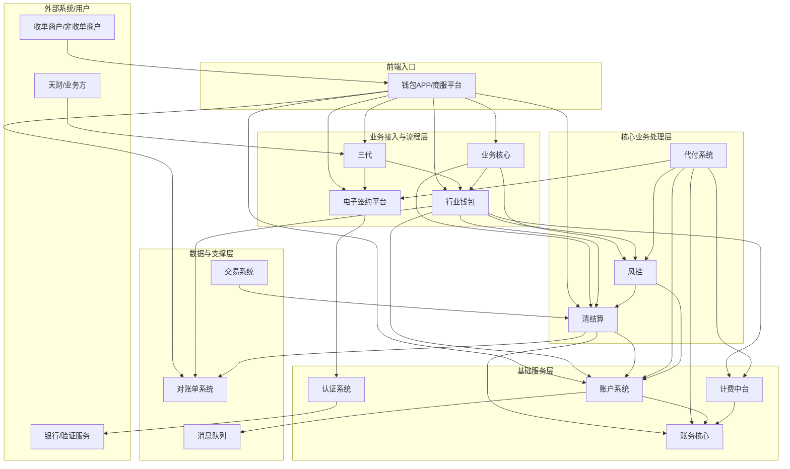
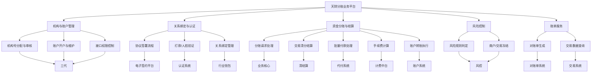
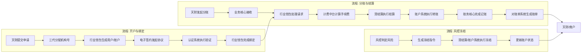
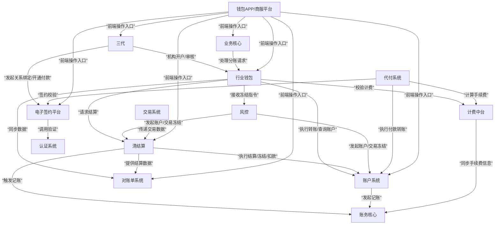

## 2.1 系统结构
系统采用分层架构，核心是业务处理与底层服务分离。上层业务模块（如三代、行业钱包、业务核心）负责处理业务流程、规则校验和状态管理。底层服务模块（如账户系统、账务核心、清结算）提供原子化的资金操作、记账和结算能力。认证、计费等中台服务提供通用能力支撑。模块间通过定义清晰的API进行同步或异步通信，确保职责清晰、松耦合。

## 2.2 功能结构
系统功能围绕天财分账业务的核心流程展开，主要包括机构与账户管理、关系绑定与认证、资金分账与结算、风险控制、以及账单服务五大功能域。每个功能域由相应的系统模块协同完成。

## 2.3 网络拓扑图
TBD

## 2.4 数据流转
数据流转以核心业务流程驱动，主要包括开户、关系绑定、分账、结算和冻结流程。数据在模块间按顺序传递，关键状态和结果被记录并同步，确保业务状态的一致性。

## 2.5 系统模块交互关系
模块交互关系基于职责划分，形成服务调用与事件驱动的混合模式。三代作为总入口，协调开户与绑定；业务核心与行业钱包处理主要业务逻辑；底层系统提供原子操作；中台系统提供支撑能力。

