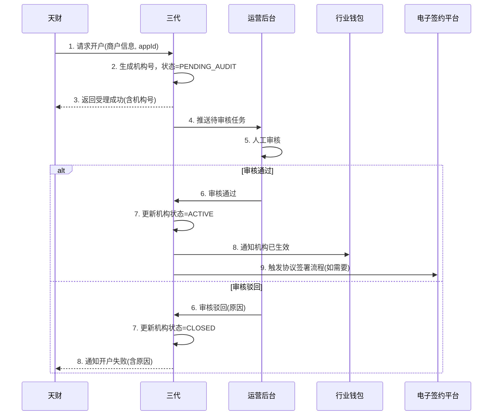
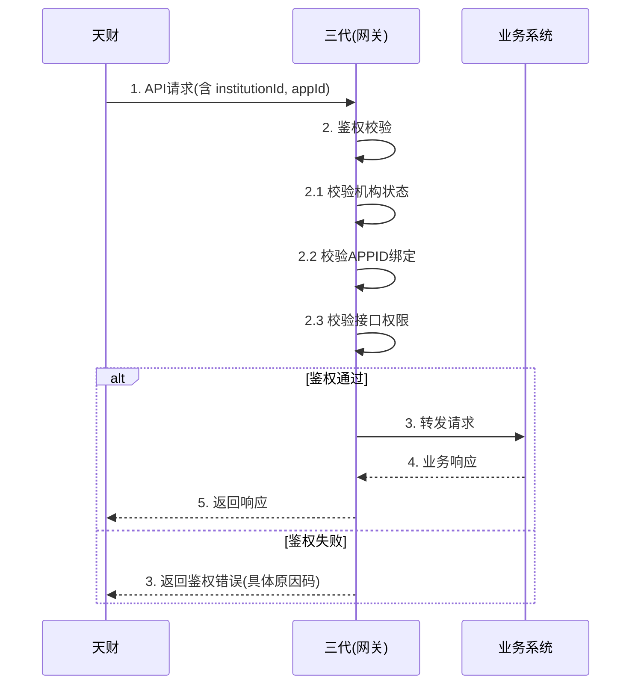

# 模块设计: 三代

生成时间: 2026-01-23 15:24:07
批判迭代: 2

---

# 三代模块设计文档

## 1. 概述
- **目的与范围**: 本模块是拉卡拉内部的一个系统或运营方，负责机构号分配、开户审核、关系绑定和接口调用控制。它是连接外部业务方（天财）与内部各系统（如行业钱包、清结算等）的枢纽，负责业务准入、权限控制和流程协调。
- **运营模式**: 三代是一个自动化系统，提供API供外部调用，并配备内部运营管理后台用于人工审核、配置与监控。核心业务流程（如接口鉴权、机构号生成）为自动化，部分审核环节（如开户资质审核）支持人工介入。

## 2. 接口设计
- **API端点 (REST/GraphQL)**:
    - `POST /api/v1/institution/create`: 接收天财提交的机构开户申请。
    - `POST /api/v1/audit/submit`: 提交业务审核（开户、关系绑定）。
    - `GET /api/v1/audit/result/{auditNo}`: 查询审核结果。
    - `POST /api/v1/auth/validate`: （内部）接口调用鉴权验证。
    - `GET /api/v1/institution/{institutionId}/permissions`: 查询机构接口权限。
- **请求/响应结构**:
    - `/api/v1/institution/create` 请求: `{ "appId": "string", "businessName": "string", "contactInfo": "TBD", "qualificationDocs": "TBD" }`
    - `/api/v1/institution/create` 响应: `{ "code": "string", "message": "string", "data": { "institutionId": "string", "status": "PENDING_AUDIT" } }`
    - `/api/v1/auth/validate` 请求: `{ "institutionId": "string", "appId": "string", "apiPath": "string", "httpMethod": "string" }`
    - `/api/v1/auth/validate` 响应: `{ "isAllowed": boolean, "reason": "string" }`
- **发布/消费的事件**:
    - 发布事件: `InstitutionCreated`, `AuditCompleted`, `InstitutionStatusChanged`。
    - 消费事件: TBD。

## 3. 数据模型
- **表/集合**:
    1.  `机构信息表 (institution_info)`:
        - `机构号 (institution_id)`: VARCHAR(32)， PRIMARY KEY， 唯一标识。
        - `机构名称 (name)`: VARCHAR(128)， NOT NULL。
        - `业务方类型 (business_type)`: VARCHAR(32)， 如 `TIANCAI`。
        - `关联APPID (app_id)`: VARCHAR(64)， NOT NULL， FOREIGN KEY (app_auth表)。
        - `状态 (status)`: ENUM('PENDING_AUDIT', 'ACTIVE', 'SUSPENDED', 'CLOSED')， NOT NULL。
        - `创建时间 (created_at)`: DATETIME， NOT NULL。
        - `更新时间 (updated_at)`: DATETIME。
        - **索引**: `idx_app_id` ON (`app_id`), `idx_status` ON (`status`)。
    2.  `接口权限表 (api_permission)`:
        - `id`: BIGINT， PRIMARY KEY， AUTO_INCREMENT。
        - `机构号 (institution_id)`: VARCHAR(32)， NOT NULL， FOREIGN KEY (institution_info表)。
        - `接口标识 (api_identifier)`: VARCHAR(255)， NOT NULL (如 `wallet.account.create`)。
        - `权限状态 (permission_status)`: ENUM('GRANTED', 'REVOKED')， DEFAULT 'GRANTED'。
        - `生效时间 (effective_from)`: DATETIME。
        - `失效时间 (effective_to)`: DATETIME。
        - **索引**: `idx_institution_api` ON (`institution_id`, `api_identifier`)。
    3.  `审核记录表 (audit_record)`:
        - `审核流水号 (audit_no)`: VARCHAR(64)， PRIMARY KEY。
        - `业务类型 (business_type)`: ENUM('INSTITUTION_CREATE', 'ACCOUNT_OPEN', 'RELATION_BIND')， NOT NULL。
        - `关联业务ID (ref_business_id)`: VARCHAR(128)， NOT NULL (如机构号、账户申请ID)。
        - `审核状态 (audit_status)`: ENUM('PENDING', 'APPROVED', 'REJECTED')， NOT NULL。
        - `审核意见 (comment)`: TEXT。
        - `审核人 (auditor)`: VARCHAR(64) (人工审核时填写)。
        - `审核时间 (audit_time)`: DATETIME。
        - `创建时间 (created_at)`: DATETIME， NOT NULL。
        - **索引**: `idx_ref_business` ON (`business_type`, `ref_business_id`), `idx_status` ON (`audit_status`)。
    4.  `APP授权表 (app_auth)`:
        - `APPID (app_id)`: VARCHAR(64)， PRIMARY KEY。
        - `关联机构号 (institution_id)`: VARCHAR(32)， NOT NULL， FOREIGN KEY (institution_info表)。
        - `密钥 (secret_key)`: VARCHAR(256)， NOT NULL (加密存储)。
        - `状态 (status)`: ENUM('ACTIVE', 'INACTIVE')， NOT NULL。
        - `创建时间 (created_at)`: DATETIME， NOT NULL。
- **与其他模块的关系**:
    - 通过`机构号`与行业钱包、清结算等模块的业务数据关联。
    - 审核记录与账户系统、电子签约平台的业务申请相关联。

## 4. 业务逻辑
- **核心工作流/算法**:
    1.  **机构号分配**:
        - **触发**: 天财通过`/api/v1/institution/create`提交申请。
        - **生成逻辑**: 采用`TC`(前缀) + `YYMMDD`(日期) + `7位递增序列`的规则生成唯一机构号（如`TC2401010000001`）。序列号通过分布式序列生成器保证集群内唯一。
        - **持久化**: 生成后，与申请信息一并存入`机构信息表`，状态为`PENDING_AUDIT`。
    2.  **开户审核**:
        - **接收请求**: 接收行业钱包转发的开户请求（针对天财收款账户/接收方账户）。
        - **审核内容**: 校验关联的机构号状态是否为`ACTIVE`；根据预设的商户资质规则（如营业执照、法人信息完备性）进行自动化校验，或流转至人工审核台。
        - **电子签约集成**: 对于需要协议签署的开户场景（如企业账户），审核通过后，调用**电子签约平台**的协议签署接口，生成签署链接或触发短信推送。开户流程的最终完成以协议签署成功为前提。
        - **结果通知**: 将审核结果（通过/驳回）及原因通知行业钱包。
    3.  **关系绑定控制**:
        - 在收付双方（如总部与门店）发起关系绑定时，校验双方账户状态及所属机构权限，控制流程的发起。必要时，触发涉及**电子签约平台**的协议签署流程。
    4.  **接口调用鉴权**:
        - **拦截**: 作为网关或拦截器，拦截所有来自天财的API请求。
        - **校验步骤**:
            a. 解析请求头或参数中的`机构号(institutionId)`和`APPID`。
            b. 查询`app_auth`表，验证`APPID`与`机构号`的绑定关系及状态。
            c. 查询`api_permission`表，验证该`机构号`对目标接口（`api_identifier`）是否有`GRANTED`权限且在有效期内。
            d. 若机构在`机构信息表`中状态非`ACTIVE`，直接拒绝。
        - **决策**: 所有校验通过则放行，任一失败则立即拒绝并返回具体错误码。
- **业务规则与验证**:
    - 一个业务方（天财）通过一个`APPID`仅能绑定一个状态为`ACTIVE`的机构号。
    - 接口调用必须携带有效的机构号和APPID，且该机构号在`接口权限表`中拥有对应接口的调用权限。
    - 开户审核需根据预设的商户资质规则进行校验。
- **关键边界情况处理**:
    - 机构号被禁用后，其所有接口调用应立即被拒绝。
    - 审核驳回时，需明确驳回原因并通知上游业务模块。

## 5. 时序图

### 5.1 机构开户与审核时序图

### 5.2 接口调用鉴权时序图

## 6. 错误处理
- **预期错误情况**:
    1.  无效的机构号或APPID。
    2.  接口调用权限不足。
    3.  开户申请信息不完整或不符合资质要求。
    4.  系统内部处理超时或失败（如数据库连接失败、下游服务不可用）。
- **处理策略**:
    - **权限类错误（1，2）**: 直接返回明确的鉴权失败错误码（如`AUTH_1001`, `AUTH_1002`），阻止请求继续，并记录安全日志。
    - **业务规则错误（3）**: 在审核环节驳回，通过审核记录保存具体原因，并同步通知上游调用方。
    - **系统错误（4）**:
        - **重试机制**: 对于非幂等的写操作（如开户申请），依赖上游重试；对于内部可重试调用（如查询权限），采用带退避策略的有限次重试。
        - **降级/熔断**: 对依赖的下游服务（如数据库、电子签约平台）设置熔断器，防止级联故障。在熔断期间，可根据场景返回默认值（如查询时）或快速失败（如审核时）。
        - **告警机制**: 监控系统错误率、延迟和熔断状态。当错误率超过阈值或发生熔断时，实时触发告警（短信、钉钉、邮件）至运维与开发人员。
        - **事务与补偿**: 关键业务流程（如机构状态变更）保证本地事务。涉及多个系统的分布式操作，记录详细操作日志，便于人工介入补偿。

## 7. 依赖关系
- **上游模块**: 天财（业务请求方）。
- **下游模块**: 行业钱包（转发开户、绑定请求）、清结算（可能传递机构信息）、账户系统（间接通过行业钱包依赖）、电子签约平台（协议签署）。
- **内部依赖**: 数据库、分布式序列服务、配置中心、监控告警系统。