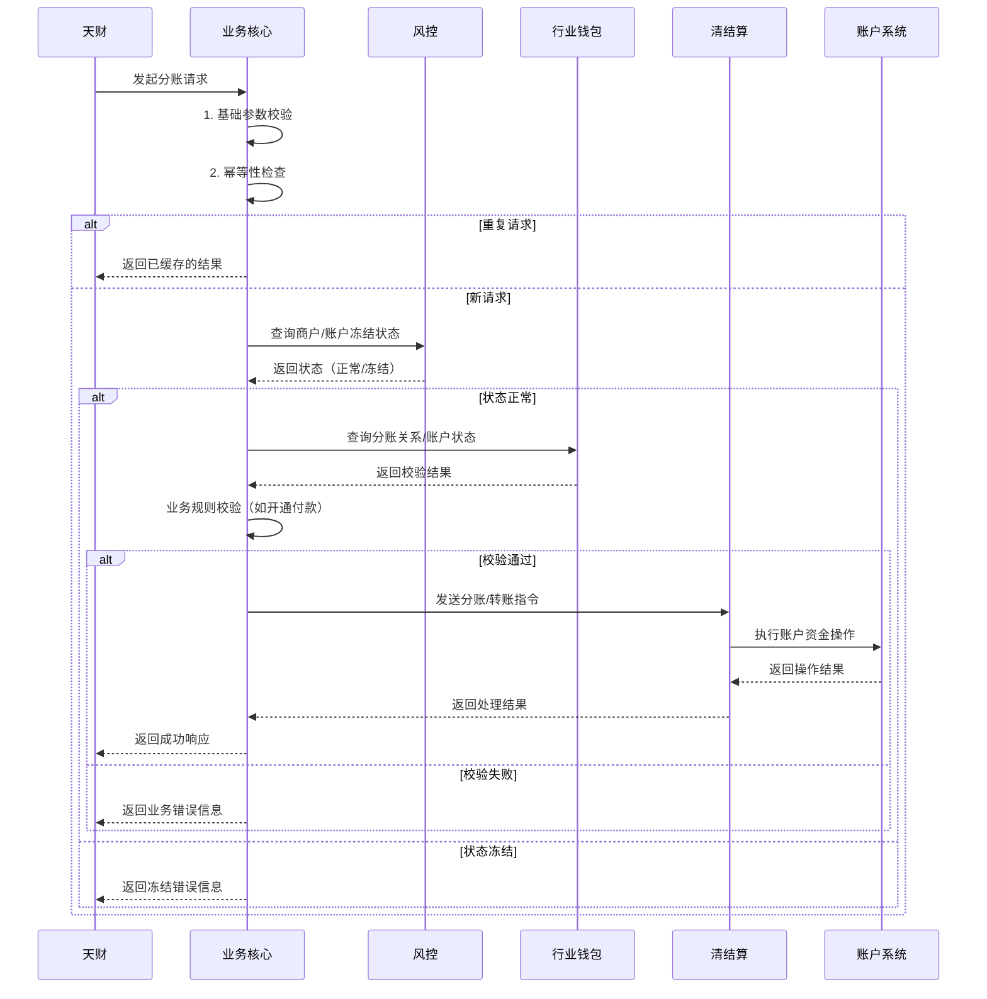

# 模块设计: 业务核心

生成时间: 2026-01-23 15:23:46
批判迭代: 2

---

# 业务核心模块设计文档

## 1. 概述
- **目的与范围**: 业务核心模块负责接收和处理来自“天财”的分账交易数据。它是连接外部业务方与内部清结算、账户等系统的中枢，负责交易请求的接收、路由、状态管理及结果返回。其边界止于将处理后的交易指令传递给下游系统，并接收下游系统的处理结果。

## 2. 接口设计
- **API端点 (REST/GraphQL)**: 提供 RESTful API 端点，如 `POST /api/v1/split` 用于处理分账请求。
- **请求/响应结构**: 请求体包含机构号、APPID、业务类型（归集/会员结算/批量付款）、付款方信息、收款方列表、金额、请求流水号等字段。响应体包含处理状态码、业务流水号、处理结果或错误信息。
- **发布/消费的事件**: 消费上游“天财”的请求事件。在处理关键状态变更（如交易创建、处理成功、处理失败）时，发布内部事件供其他模块（如监控、对账）订阅。

## 3. 数据模型
- **表/集合**: 核心表包括 `transaction_request`（交易请求记录表）和 `idempotency_token`（幂等令牌表）。
- **关键字段**:
    - `transaction_request`: 请求流水号、机构号、APPID、业务类型、付款方账户、收款方信息、金额、状态（待处理/处理中/成功/失败）、创建时间、更新时间、错误码、下游系统响应。
    - `idempotency_token`: 幂等键（由机构号+请求流水号生成）、对应的业务流水号、创建时间、过期时间。
- **与其他模块的关系**: 业务核心模块处理的数据与“天财”的请求直接相关，处理后需传递给“清结算”或“行业钱包”等系统执行。`transaction_request` 表记录与下游系统交互的完整链路。

## 4. 业务逻辑
- **核心工作流/算法**: 接收天财的分账请求，验证基础参数（如机构号、APPID），根据业务场景（如归集、会员结算、批量付款）将请求转换为内部系统可识别的指令，并调用相应下游系统（如清结算系统执行转账、行业钱包处理关系绑定校验）进行处理。
- **业务规则与验证**: 验证请求的合法性，包括但不限于商户状态（是否被冻结）、账户状态、分账关系是否已绑定、付款方是否已“开通付款”等。
- **关键边界情况处理**:
    - **幂等性处理**: 基于请求中的机构号和请求流水号生成唯一幂等键。在处理请求前，先查询 `idempotency_token` 表。若已存在且未过期，则直接返回已记录的业务结果，避免重复处理。
    - **下游失败重试策略**: 对于清结算、行业钱包等下游系统的可重试错误（如网络超时、暂时性服务不可用），采用指数退避策略进行有限次重试（如最多3次）。对于明确的业务失败（如账户余额不足、关系未绑定），则不重试，直接失败。
    - **交易状态管理与补偿**: 维护交易状态机（待处理 -> 处理中 -> 成功/失败）。在调用下游系统前，将状态置为“处理中”并持久化。若下游调用最终失败，将状态更新为“失败”并记录错误原因。对于涉及多个步骤的复杂交易，若部分步骤成功，需记录上下文，并触发补偿流程（如调用清结算的冲正接口）或告警人工干预。

## 5. 时序图

## 6. 错误处理
- **预期错误情况**: 请求参数错误、商户/账户被冻结、分账关系未绑定、付款方未开通付款、下游系统（如清结算、行业钱包）服务异常、网络超时。
- **处理策略**:
    - 对于参数和业务规则错误，立即返回明确的错误码和描述。
    - 对于下游系统异常，根据错误类型区分处理：对网络超时等可重试错误，执行指数退避重试；对明确的业务逻辑错误，不重试，直接失败。
    - 所有错误及处理过程均记录详细日志，并更新 `transaction_request` 表状态，用于对账和人工干预。

## 7. 依赖关系
- **上游模块**: 天财（业务请求方）。
- **下游模块**: 风控（用于商户/账户冻结状态校验）、行业钱包（用于关系与账户校验）、清结算系统（用于执行资金划转）、账户系统（通过清结算间接依赖）。